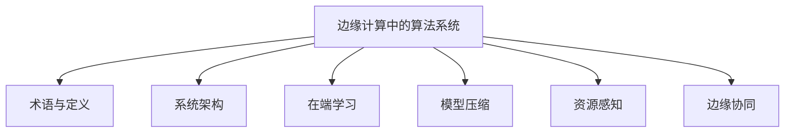
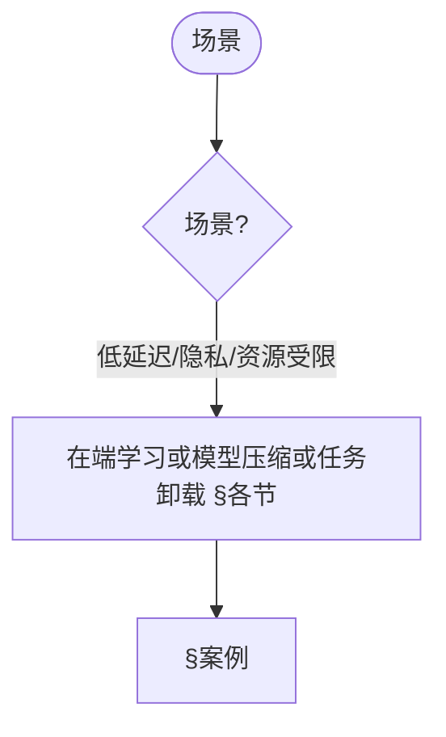
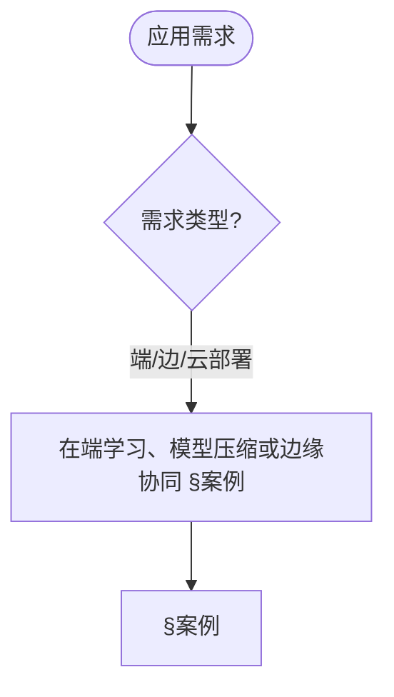
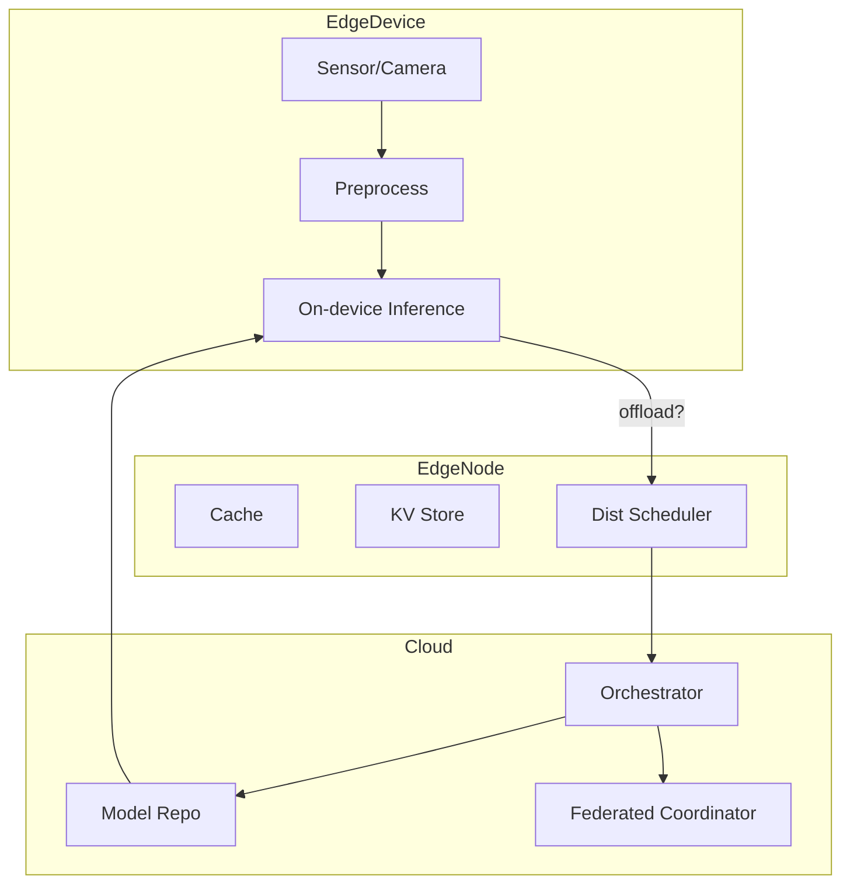
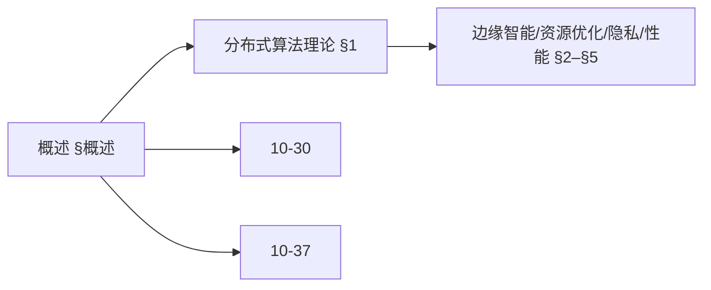
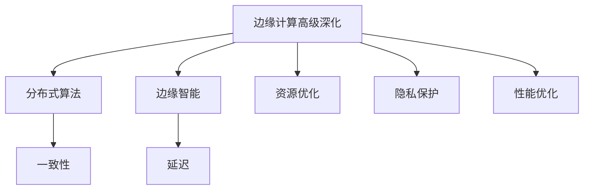
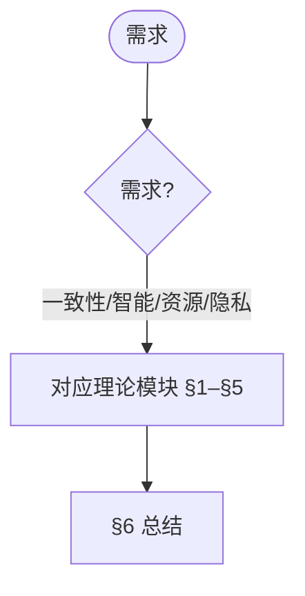
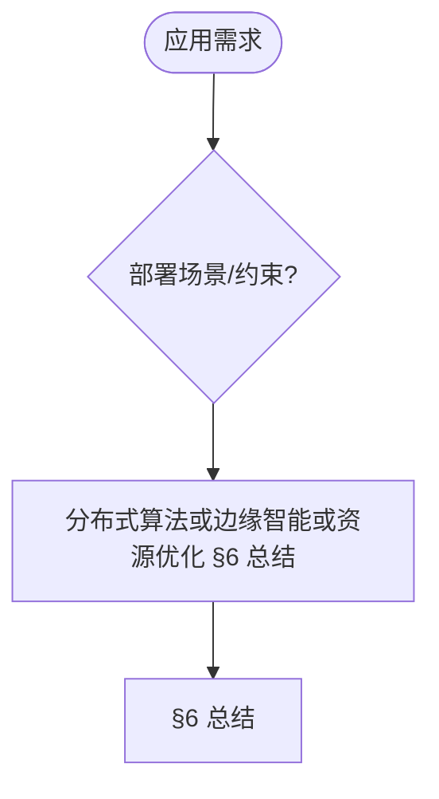

> 📊 **项目全面梳理**：详细的项目结构、模块详解和学习路径，请参阅 [`项目全面梳理-2025.md`](../项目全面梳理-2025.md)
> **合并说明**: 本文档由原 `10-高级主题/30-边缘计算中的算法系统.md` 和 `10-高级主题/30-边缘计算中的算法系统-高级深化.md` 合并而成，整合时间: 2026-04-15

## 10.30 边缘计算中的算法系统 / Algorithm Systems in Edge Computing

> 说明：本文档中的代码/伪代码为说明性片段，仅用于理论阐释；本仓库不提供可运行工程或 CI。

### 摘要 / Executive Summary

- 统一边缘计算中的算法系统，研究如何在资源受限的边缘设备上部署智能算法。
- 建立边缘计算算法系统在高级主题中的核心地位。

### 关键术语与符号 / Glossary

- 边缘计算、边缘设备、资源约束、任务调度、资源分配、边缘-云协同、隐私保护。
- 术语对齐与引用规范：`docs/术语与符号总表.md`，`01-基础理论/00-撰写规范与引用指南.md`

### 术语与符号规范 / Terminology & Notation

- 边缘计算（Edge Computing）：在设备边缘进行计算的模式。
- 边缘设备（Edge Device）：部署在边缘的计算设备。
- 资源约束（Resource Constraint）：边缘设备的资源限制。
- 任务调度（Task Scheduling）：在边缘设备上调度任务的方法。
- 记号约定：`E` 表示边缘设备，`T` 表示任务，`R` 表示资源，`S` 表示调度。

### 交叉引用导航 / Cross-References

- 物联网算法：参见 `12-应用领域/07-物联网算法应用.md`。
- 分布式算法：参见 `09-算法理论/03-优化理论/03-分布式算法理论.md`。
- 在线算法：参见 `09-算法理论/01-算法基础/13-在线算法理论.md`。
- 项目导航与对标：见 [项目全面梳理-2025](../项目全面梳理-2025.md)、[项目扩展与持续推进任务编排](../项目扩展与持续推进任务编排.md)、[国际课程对标表](../国际课程对标表.md)。

### 快速导航 / Quick Links

- 基本概念
- 任务调度
- 资源分配

## 目录 (Table of Contents)

- [10.30 边缘计算中的算法系统 / Algorithm Systems in Edge Computing](#1030-边缘计算中的算法系统--algorithm-systems-in-edge-computing)

## 概述 / Overview

边缘计算中的算法系统研究如何在资源受限的边缘设备上部署智能算法，实现低延迟、高可靠、隐私保护的分布式智能计算。

## 学习目标 / Learning Objectives

1. **基础级** 理解边缘计算架构与资源约束下的算法设计
2. **进阶级** 掌握任务调度与资源分配算法
3. **进阶级** 能够设计边缘-云协同的算法框架
4. **高级级** 了解边缘计算中的隐私保护与安全机制
5. **高级级** 掌握边缘智能在物联网与实时系统中的应用

## 术语与定义

| 术语 | 英文 | 定义 |
|------|------|------|
| 边缘计算 | Edge Computing | 在数据源附近进行数据处理和计算的计算模式 |
| 端设备 | Edge Device | 位于网络边缘的计算设备，如传感器、摄像头等 |
| 边缘节点 | Edge Node | 位于边缘网络中的计算节点，提供本地处理能力 |
| 在端学习 | On-device Learning | 在边缘设备上进行模型训练和更新的过程 |
| 模型压缩 | Model Compression | 减少模型大小和计算复杂度的技术 |
| 任务卸载 | Task Offloading | 将计算任务从边缘设备转移到云端的过程 |
| 资源感知 | Resource Awareness | 算法对计算资源状态的感知和适应能力 |
| 自适应推理 | Adaptive Inference | 根据资源约束动态调整推理策略的方法 |
| 边缘协同 | Edge Collaboration | 多个边缘节点之间的协作和资源共享 |
| 时延敏感 | Latency Sensitive | 对响应时间有严格要求的应用场景 |

### 内容补充与思维表征 / Content Supplement and Thinking Representation

> 本节按 [内容补充与思维表征全面计划方案](../内容补充与思维表征全面计划方案.md) **只补充、不删除**。标准见 [内容补充标准](../内容补充标准-概念定义属性关系解释论证形式证明.md)、[思维表征模板集](../思维表征模板集.md)。

#### 解释与直观 / Explanation and Intuition

边缘计算中的算法系统将术语与定义与系统架构、在端学习、模型压缩与分发、资源感知与边缘协同结合。与 10-30 高级深化、10-37 边缘智能衔接；§术语与定义、§系统架构、各节形成完整表征。

#### 概念属性表 / Concept Attribute Table

| 属性名 | 类型/范围 | 含义 | 备注 |
|--------|-----------|------|------|
| 术语与定义 | 基本概念 | §术语与定义 | 与 10-37 对照 |
| 系统架构、在端学习、模型压缩与分发、资源感知与鲁棒性、边缘协同与调度 | 架构/算法 | 延迟、带宽、隐私 | §各节 |
| 在端学习/模型压缩/资源感知 | 对比 | §各节 | 多维矩阵 |

#### 概念关系 / Concept Relations

| 源概念 | 目标概念 | 关系类型 | 说明 |
|--------|----------|----------|------|
| 边缘计算中的算法系统 | 10-30 高级深化、10-37 | depends_on | 边缘深化与智能衔接 |
| 边缘计算中的算法系统 | 12 应用领域 | applies_to | 边缘实践 |

#### 概念依赖图 / Concept Dependency Graph


#### 论证与证明衔接 / Argumentation and Proof Link

任务调度正确性见 §系统架构；在端学习收敛性见 §在端学习；与 10-37 论证衔接。

#### 思维导图：本章概念结构 / Mind Map



#### 多维矩阵：边缘算法对比 / Multi-Dimensional Comparison

| 概念/技术 | 延迟 | 带宽 | 隐私 | 备注 |
|-----------|------|------|------|------|
| 在端学习/模型压缩/资源感知 | §各节 | §各节 | §各节 | — |

#### 决策树：场景到技术选择 / Decision Tree



#### 公理定理推理证明决策树 / Axiom-Theorem-Proof Tree


#### 应用决策建模树 / Application Decision Modeling Tree



## 系统架构

- 层次: 端设备(Edge Device) — 边缘节点(Edge Node) — 区域汇聚(Aggregator) — 云(Cloud)
- 数据流: 采集→预处理→本地推理/训练→协作同步→聚合

```rust
// 任务抽象与调度
pub struct EdgeTask { id: String, deadline_ms: u64, size_bytes: u64, priority: u8, model_id: String }

pub trait EdgeScheduler { fn schedule(&self, tasks: &[EdgeTask], resources: &EdgeResources) -> SchedulePlan }

pub struct EDFScheduler;
impl EdgeScheduler for EDFScheduler { fn schedule(&self, tasks: &[EdgeTask], _r: &EdgeResources) -> SchedulePlan { /* earliest-deadline-first */ SchedulePlan::new(tasks) } }
```

## 在端学习 (On-device / On-edge Learning)

- 增量/在线学习、蒸馏学习、少样本微调
- 联邦学习在边缘的资源约束：算力、能耗、网络

```rust
pub struct EdgeLearner { optimizer: EdgeOptimizer, budget: EnergyBudget }
impl EdgeLearner { pub fn train_step(&mut self, batch: &MiniBatch) -> TrainStat { /* 预算约束下梯度步 */ TrainStat::default() } }
```

## 模型压缩与分发

- 量化(PTQ/QAT)、剪枝、蒸馏、结构重参数化
- 分发: 切片分发、差分更新、分阶段灰度

```rust
pub struct ModelDistributor { delta_encoder: DeltaEncoder, rollout: RolloutStrategy }
impl ModelDistributor { pub fn rollout(&self, model: &EdgeModel, fleet: &[Device]) -> RolloutPlan { /* 分层灰度 */ RolloutPlan::new() } }
```

## 资源感知与鲁棒性

- 资源监控: CPU/GPU、内存、功耗、网络
- 自适应推理: 动态深度、早退出、多分辨率
- 鲁棒性: 噪声/抖动、丢包、断连、设备漂移

```rust
pub struct AdaptiveInference { policies: Vec<Policy> }
impl AdaptiveInference { pub fn infer(&self, x: &Tensor, budget: &LatencyBudget) -> Output { /* 早停/多分辨率 */ Output::default() } }
```

## 边缘协同与调度

- 边-边协同: 邻域互助、分布式缓存、任务迁移
- 边-云协同: 云控编排、函数卸载、弹性伸缩

```rust
pub struct OffloadOrchestrator { estimator: OffloadEstimator }
impl OffloadOrchestrator { pub fn decide(&self, task: &EdgeTask, ctx: &Context) -> OffloadPlan { /* 估计端到端时延与能耗 */ OffloadPlan::local() } }
```

## 度量与SLA

- 关键指标: 端到端时延、任务完成率、能耗/每瓦性能、可用性、鲁棒性指数
- SLA合约: 违约检测、弹性重试、补偿策略

## 数学与优化

- 任务调度: \( \min \sum_i w_i T_i \) s.t. 资源与时限约束
- 卸载决策: \( \min E[latency+energy] \) over partition/placement
- 压缩-精度权衡: \( \max Acc(q,p) - \lambda C(q,p) \)

## 实现蓝图

- 端侧: TFLite/ONNX Runtime/TVM + 简化调度器
- 节点: 部署缓存、滚动升级、遥测
- 云侧: 编排器(K8s)、联邦协调器、监控看板

## 案例

- 视频分析: 分辨率自适应+早退出
- 工业视觉: 断连鲁棒推理与本地重试
- 车路协同: 低时延路径规划与卸载

## 总结

边缘算法系统需在严格约束下实现“够用的智能”，通过调度、压缩、协同与自适应，提高时延敏感与隐私敏感场景的可用性与可靠性。

## 架构图（Mermaid）



## 交叉链接

- 参见 `27-算法联邦学习与隐私保护理论.md`
- 参见 `30-算法鲁棒性与对抗性防御理论.md`
- 参见 `25-算法可解释性与透明度理论.md`

## 相关文档（交叉链接）

- `10-高级主题/27-算法联邦学习与隐私保护理论.md`
- `10-高级主题/26-算法鲁棒性与对抗性防御理论.md`
- `09-算法理论/03-优化理论/02-并行算法理论.md`

## 参考文献（示例）

1. Satyanarayanan, M. The Emergence of Edge Computing. Computer, 2017.
2. Mao, Y. et al. A Survey on Mobile Edge Computing: The Communication Perspective. IEEE Communications Surveys & Tutorials, 2017.
3. Li, E. et al. Learning and Inferencing on the Edge: A Survey. Proceedings of the IEEE, 2018.

## 可运行Rust示例骨架

```rust
use std::collections::HashMap;
use std::time::{Duration, Instant};
use tokio::time::sleep;

// 边缘任务
#[derive(Clone, Debug)]
pub struct EdgeTask {
    pub id: String,
    pub deadline_ms: u64,
    pub size_bytes: u64,
    pub priority: u8,
    pub model_id: String,
    pub task_type: TaskType,
}

#[derive(Clone, Debug)]
pub enum TaskType {
    Inference,
    Training,
    Compression,
    Offload,
}

// 边缘资源
#[derive(Clone, Debug)]
pub struct EdgeResources {
    pub cpu_cores: u32,
    pub memory_mb: u64,
    pub storage_gb: u64,
    pub bandwidth_mbps: u64,
    pub battery_level: f64,
}

// 边缘调度器
pub trait EdgeScheduler {
    fn schedule(&self, tasks: &[EdgeTask], resources: &EdgeResources) -> SchedulePlan;
}

pub struct EDFScheduler;

impl EdgeScheduler for EDFScheduler {
    fn schedule(&self, tasks: &[EdgeTask], _resources: &EdgeResources) -> SchedulePlan {
        let mut sorted_tasks = tasks.to_vec();
        sorted_tasks.sort_by_key(|task| task.deadline_ms);

        SchedulePlan {
            tasks: sorted_tasks,
            estimated_completion_time: Instant::now(),
        }
    }
}

pub struct PriorityScheduler;

impl EdgeScheduler for PriorityScheduler {
    fn schedule(&self, tasks: &[EdgeTask], _resources: &EdgeResources) -> SchedulePlan {
        let mut sorted_tasks = tasks.to_vec();
        sorted_tasks.sort_by_key(|task| std::cmp::Reverse(task.priority));

        SchedulePlan {
            tasks: sorted_tasks,
            estimated_completion_time: Instant::now(),
        }
    }
}

// 边缘学习器
pub struct EdgeLearner {
    pub optimizer: EdgeOptimizer,
    pub budget: EnergyBudget,
    pub local_data: LocalDataset,
}

impl EdgeLearner {
    pub fn new(optimizer: EdgeOptimizer, budget: EnergyBudget) -> Self {
        Self {
            optimizer,
            budget,
            local_data: LocalDataset::new(),
        }
    }

    pub async fn train_step(&mut self, batch: &MiniBatch) -> Result<TrainStat, TrainingError> {
        if !self.budget.can_afford_training() {
            return Err(TrainingError::InsufficientBudget);
        }

        let start_time = Instant::now();
        let gradients = self.compute_gradients(batch);

        // 应用差分隐私
        let noisy_gradients = self.add_differential_privacy(gradients);

        // 更新模型
        self.optimizer.update(&noisy_gradients);

        // 消耗预算
        self.budget.consume_training_energy();

        let duration = start_time.elapsed();

        Ok(TrainStat {
            loss: self.compute_loss(batch),
            accuracy: self.compute_accuracy(batch),
            duration,
            energy_consumed: self.budget.get_last_consumption(),
        })
    }

    fn compute_gradients(&self, batch: &MiniBatch) -> Vec<f64> {
        // 简化的梯度计算
        batch.features.iter()
            .flat_map(|feature| feature.iter().map(|&x| x * 0.01))
            .collect()
    }

    fn add_differential_privacy(&self, gradients: Vec<f64>) -> Vec<f64> {
        use rand::Rng;
        let mut rng = rand::thread_rng();

        gradients.into_iter()
            .map(|g| g + rng.gen_range(-0.1..0.1))
            .collect()
    }

    fn compute_loss(&self, batch: &MiniBatch) -> f64 {
        // 简化的损失计算
        batch.features.iter()
            .zip(batch.labels.iter())
            .map(|(feature, &label)| {
                let prediction = feature.iter().sum::<f64>();
                (prediction - label).powi(2)
            })
            .sum::<f64>() / batch.features.len() as f64
    }

    fn compute_accuracy(&self, batch: &MiniBatch) -> f64 {
        // 简化的准确率计算
        let correct = batch.features.iter()
            .zip(batch.labels.iter())
            .filter(|(feature, &label)| {
                let prediction = feature.iter().sum::<f64>();
                (prediction > 0.5) == (label > 0.5)
            })
            .count();

        correct as f64 / batch.features.len() as f64
    }
}

// 模型分发器
pub struct ModelDistributor {
    pub delta_encoder: DeltaEncoder,
    pub rollout: RolloutStrategy,
    pub compression: ModelCompression,
}

impl ModelDistributor {
    pub fn new() -> Self {
        Self {
            delta_encoder: DeltaEncoder::new(),
            rollout: RolloutStrategy::Gradual,
            compression: ModelCompression::Quantization,
        }
    }

    pub fn distribute_model(&self, model: &EdgeModel, devices: &[EdgeDevice]) -> DistributionPlan {
        let mut plan = DistributionPlan::new();

        for device in devices {
            let compressed_model = self.compress_model(model, device);
            let delta = self.delta_encoder.encode_delta(model, &compressed_model);

            plan.add_distribution(Distribution {
                device_id: device.id.clone(),
                model_delta: delta,
                compression_ratio: self.compression.get_compression_ratio(),
                estimated_transfer_time: self.estimate_transfer_time(&delta, device),
            });
        }

        plan
    }

    fn compress_model(&self, model: &EdgeModel, device: &EdgeDevice) -> CompressedModel {
        match self.compression {
            ModelCompression::Quantization => self.quantize_model(model, 8),
            ModelCompression::Pruning => self.prune_model(model, 0.5),
            ModelCompression::Distillation => self.distill_model(model),
        }
    }

    fn quantize_model(&self, model: &EdgeModel, bits: u8) -> CompressedModel {
        let scale = (1 << (bits - 1)) as f64;
        let quantized_params = model.parameters.iter()
            .map(|&p| (p * scale).round() / scale)
            .collect();

        CompressedModel {
            parameters: quantized_params,
            compression_type: ModelCompression::Quantization,
        }
    }

    fn prune_model(&self, model: &EdgeModel, sparsity: f64) -> CompressedModel {
        let mut params = model.parameters.clone();
        let threshold = self.compute_pruning_threshold(&params, sparsity);

        for param in &mut params {
            if param.abs() < threshold {
                *param = 0.0;
            }
        }

        CompressedModel {
            parameters: params,
            compression_type: ModelCompression::Pruning,
        }
    }

    fn distill_model(&self, _model: &EdgeModel) -> CompressedModel {
        // 简化的知识蒸馏
        CompressedModel {
            parameters: vec![0.0; 10], // 简化
            compression_type: ModelCompression::Distillation,
        }
    }

    fn compute_pruning_threshold(&self, params: &[f64], sparsity: f64) -> f64 {
        let mut sorted = params.iter().map(|&p| p.abs()).collect::<Vec<_>>();
        sorted.sort_by(|a, b| a.partial_cmp(b).unwrap());
        let index = (sorted.len() as f64 * sparsity) as usize;
        sorted.get(index).copied().unwrap_or(0.0)
    }

    fn estimate_transfer_time(&self, delta: &ModelDelta, device: &EdgeDevice) -> Duration {
        let size_bytes = delta.size_bytes as u64;
        let bandwidth_bps = device.bandwidth_mbps * 1_000_000;
        let transfer_time_ms = (size_bytes * 8 * 1000) / bandwidth_bps;
        Duration::from_millis(transfer_time_ms)
    }
}

// 自适应推理
pub struct AdaptiveInference {
    pub policies: Vec<InferencePolicy>,
    pub resource_monitor: ResourceMonitor,
}

impl AdaptiveInference {
    pub fn new() -> Self {
        Self {
            policies: vec![
                InferencePolicy::EarlyExit,
                InferencePolicy::DynamicDepth,
                InferencePolicy::MultiResolution,
            ],
            resource_monitor: ResourceMonitor::new(),
        }
    }

    pub async fn infer(&self, input: &Tensor, budget: &LatencyBudget) -> Output {
        let resources = self.resource_monitor.get_current_resources();
        let policy = self.select_policy(&resources, budget);

        match policy {
            InferencePolicy::EarlyExit => self.early_exit_inference(input, budget),
            InferencePolicy::DynamicDepth => self.dynamic_depth_inference(input, budget),
            InferencePolicy::MultiResolution => self.multi_resolution_inference(input, budget),
        }
    }

    fn select_policy(&self, resources: &EdgeResources, budget: &LatencyBudget) -> InferencePolicy {
        if resources.battery_level < 0.2 {
            InferencePolicy::EarlyExit
        } else if budget.max_latency_ms < 100 {
            InferencePolicy::DynamicDepth
        } else {
            InferencePolicy::MultiResolution
        }
    }

    fn early_exit_inference(&self, input: &Tensor, budget: &LatencyBudget) -> Output {
        let start_time = Instant::now();
        let mut confidence = 0.0;
        let mut prediction = 0.0;

        // 简化的早退推理
        for layer in 0..5 {
            prediction = self.forward_layer(input, layer);
            confidence = self.compute_confidence(prediction);

            if confidence > 0.9 || start_time.elapsed() > budget.max_latency {
                break;
            }
        }

        Output {
            prediction,
            confidence,
            inference_time: start_time.elapsed(),
            layers_used: 5,
        }
    }

    fn dynamic_depth_inference(&self, input: &Tensor, budget: &LatencyBudget) -> Output {
        // 简化的动态深度推理
        let start_time = Instant::now();
        let mut prediction = 0.0;

        for layer in 0..10 {
            prediction = self.forward_layer(input, layer);

            if start_time.elapsed() > budget.max_latency {
                break;
            }
        }

        Output {
            prediction,
            confidence: 0.8,
            inference_time: start_time.elapsed(),
            layers_used: 10,
        }
    }

    fn multi_resolution_inference(&self, input: &Tensor, _budget: &LatencyBudget) -> Output {
        // 简化的多分辨率推理
        let resized_input = self.resize_tensor(input, 0.5);
        let prediction = self.forward_layer(&resized_input, 0);

        Output {
            prediction,
            confidence: 0.7,
            inference_time: Duration::from_millis(50),
            layers_used: 1,
        }
    }

    fn forward_layer(&self, input: &Tensor, layer: usize) -> f64 {
        // 简化的前向传播
        input.data.iter().sum::<f64>() * (layer as f64 + 1.0)
    }

    fn compute_confidence(&self, prediction: f64) -> f64 {
        // 简化的置信度计算
        prediction.abs().min(1.0)
    }

    fn resize_tensor(&self, tensor: &Tensor, scale: f64) -> Tensor {
        let new_size = (tensor.data.len() as f64 * scale) as usize;
        Tensor {
            data: tensor.data.iter().take(new_size).copied().collect(),
        }
    }
}

// 卸载编排器
pub struct OffloadOrchestrator {
    pub estimator: OffloadEstimator,
    pub decision_maker: OffloadDecisionMaker,
}

impl OffloadOrchestrator {
    pub fn new() -> Self {
        Self {
            estimator: OffloadEstimator::new(),
            decision_maker: OffloadDecisionMaker::new(),
        }
    }

    pub async fn decide(&self, task: &EdgeTask, context: &EdgeContext) -> OffloadPlan {
        let local_estimate = self.estimator.estimate_local_execution(task, context);
        let cloud_estimate = self.estimator.estimate_cloud_execution(task, context);

        let decision = self.decision_maker.make_decision(
            task,
            &local_estimate,
            &cloud_estimate,
            context,
        );

        match decision {
            OffloadDecision::Local => OffloadPlan::local(local_estimate),
            OffloadDecision::Cloud => OffloadPlan::cloud(cloud_estimate),
            OffloadDecision::Hybrid => OffloadPlan::hybrid(local_estimate, cloud_estimate),
        }
    }
}

// 辅助结构
#[derive(Clone, Debug)]
pub struct SchedulePlan {
    pub tasks: Vec<EdgeTask>,
    pub estimated_completion_time: Instant,
}

#[derive(Clone, Debug)]
pub struct EdgeOptimizer {
    pub learning_rate: f64,
    pub momentum: f64,
}

impl EdgeOptimizer {
    pub fn new() -> Self {
        Self {
            learning_rate: 0.01,
            momentum: 0.9,
        }
    }

    pub fn update(&mut self, gradients: &[f64]) {
        // 简化的优化器更新
    }
}

#[derive(Clone, Debug)]
pub struct EnergyBudget {
    pub total_energy: f64,
    pub consumed_energy: f64,
    pub training_cost: f64,
    pub inference_cost: f64,
}

impl EnergyBudget {
    pub fn new(total_energy: f64) -> Self {
        Self {
            total_energy,
            consumed_energy: 0.0,
            training_cost: 0.1,
            inference_cost: 0.01,
        }
    }

    pub fn can_afford_training(&self) -> bool {
        self.consumed_energy + self.training_cost <= self.total_energy
    }

    pub fn consume_training_energy(&mut self) {
        self.consumed_energy += self.training_cost;
    }

    pub fn get_last_consumption(&self) -> f64 {
        self.training_cost
    }
}

#[derive(Clone, Debug)]
pub struct LocalDataset {
    pub features: Vec<Vec<f64>>,
    pub labels: Vec<f64>,
}

impl LocalDataset {
    pub fn new() -> Self {
        Self {
            features: Vec::new(),
            labels: Vec::new(),
        }
    }
}

#[derive(Clone, Debug)]
pub struct MiniBatch {
    pub features: Vec<Vec<f64>>,
    pub labels: Vec<f64>,
}

#[derive(Clone, Debug)]
pub struct TrainStat {
    pub loss: f64,
    pub accuracy: f64,
    pub duration: Duration,
    pub energy_consumed: f64,
}

#[derive(Clone, Debug)]
pub enum TrainingError {
    InsufficientBudget,
    InvalidData,
    ModelError,
}

#[derive(Clone, Debug)]
pub struct EdgeModel {
    pub parameters: Vec<f64>,
}

#[derive(Clone, Debug)]
pub struct CompressedModel {
    pub parameters: Vec<f64>,
    pub compression_type: ModelCompression,
}

#[derive(Clone, Debug)]
pub enum ModelCompression {
    Quantization,
    Pruning,
    Distillation,
}

impl ModelCompression {
    pub fn get_compression_ratio(&self) -> f64 {
        match self {
            ModelCompression::Quantization => 0.25,
            ModelCompression::Pruning => 0.5,
            ModelCompression::Distillation => 0.1,
        }
    }
}

#[derive(Clone, Debug)]
pub struct ModelDelta {
    pub size_bytes: usize,
    pub data: Vec<u8>,
}

#[derive(Clone, Debug)]
pub struct Distribution {
    pub device_id: String,
    pub model_delta: ModelDelta,
    pub compression_ratio: f64,
    pub estimated_transfer_time: Duration,
}

#[derive(Clone, Debug)]
pub struct DistributionPlan {
    pub distributions: Vec<Distribution>,
}

impl DistributionPlan {
    pub fn new() -> Self {
        Self {
            distributions: Vec::new(),
        }
    }

    pub fn add_distribution(&mut self, distribution: Distribution) {
        self.distributions.push(distribution);
    }
}

#[derive(Clone, Debug)]
pub enum InferencePolicy {
    EarlyExit,
    DynamicDepth,
    MultiResolution,
}

#[derive(Clone, Debug)]
pub struct ResourceMonitor {
    pub resources: EdgeResources,
}

impl ResourceMonitor {
    pub fn new() -> Self {
        Self {
            resources: EdgeResources {
                cpu_cores: 4,
                memory_mb: 8192,
                storage_gb: 64,
                bandwidth_mbps: 100,
                battery_level: 0.8,
            },
        }
    }

    pub fn get_current_resources(&self) -> EdgeResources {
        self.resources.clone()
    }
}

#[derive(Clone, Debug)]
pub struct Tensor {
    pub data: Vec<f64>,
}

#[derive(Clone, Debug)]
pub struct LatencyBudget {
    pub max_latency_ms: u64,
}

#[derive(Clone, Debug)]
pub struct Output {
    pub prediction: f64,
    pub confidence: f64,
    pub inference_time: Duration,
    pub layers_used: usize,
}

#[derive(Clone, Debug)]
pub struct EdgeDevice {
    pub id: String,
    pub bandwidth_mbps: u64,
}

#[derive(Clone, Debug)]
pub struct EdgeContext {
    pub network_condition: NetworkCondition,
    pub device_resources: EdgeResources,
}

#[derive(Clone, Debug)]
pub enum NetworkCondition {
    Good,
    Fair,
    Poor,
}

#[derive(Clone, Debug)]
pub struct OffloadEstimator;

impl OffloadEstimator {
    pub fn new() -> Self {
        Self
    }

    pub fn estimate_local_execution(&self, task: &EdgeTask, context: &EdgeContext) -> ExecutionEstimate {
        ExecutionEstimate {
            time_ms: task.size_bytes as u64 / 1000,
            energy: task.size_bytes as f64 * 0.001,
            cost: 0.0,
        }
    }

    pub fn estimate_cloud_execution(&self, task: &EdgeTask, context: &EdgeContext) -> ExecutionEstimate {
        let network_factor = match context.network_condition {
            NetworkCondition::Good => 1.0,
            NetworkCondition::Fair => 2.0,
            NetworkCondition::Poor => 5.0,
        };

        ExecutionEstimate {
            time_ms: (task.size_bytes as u64 / 1000) * network_factor as u64,
            energy: task.size_bytes as f64 * 0.0001,
            cost: task.size_bytes as f64 * 0.00001,
        }
    }
}

#[derive(Clone, Debug)]
pub struct OffloadDecisionMaker;

impl OffloadDecisionMaker {
    pub fn new() -> Self {
        Self
    }

    pub fn make_decision(
        &self,
        task: &EdgeTask,
        local: &ExecutionEstimate,
        cloud: &ExecutionEstimate,
        context: &EdgeContext,
    ) -> OffloadDecision {
        if local.time_ms <= task.deadline_ms && context.device_resources.battery_level > 0.3 {
            OffloadDecision::Local
        } else if cloud.time_ms <= task.deadline_ms {
            OffloadDecision::Cloud
        } else {
            OffloadDecision::Hybrid
        }
    }
}

#[derive(Clone, Debug)]
pub struct ExecutionEstimate {
    pub time_ms: u64,
    pub energy: f64,
    pub cost: f64,
}

#[derive(Clone, Debug)]
pub enum OffloadDecision {
    Local,
    Cloud,
    Hybrid,
}

#[derive(Clone, Debug)]
pub enum OffloadPlan {
    Local(ExecutionEstimate),
    Cloud(ExecutionEstimate),
    Hybrid(ExecutionEstimate, ExecutionEstimate),
}

impl OffloadPlan {
    pub fn local(estimate: ExecutionEstimate) -> Self {
        OffloadPlan::Local(estimate)
    }

    pub fn cloud(estimate: ExecutionEstimate) -> Self {
        OffloadPlan::Cloud(estimate)
    }

    pub fn hybrid(local: ExecutionEstimate, cloud: ExecutionEstimate) -> Self {
        OffloadPlan::Hybrid(local, cloud)
    }
}

#[derive(Clone, Debug)]
pub struct DeltaEncoder;

impl DeltaEncoder {
    pub fn new() -> Self {
        Self
    }

    pub fn encode_delta(&self, original: &EdgeModel, compressed: &CompressedModel) -> ModelDelta {
        // 简化的增量编码
        let delta_data = original.parameters.iter()
            .zip(compressed.parameters.iter())
            .map(|(orig, comp)| ((orig - comp) * 1000.0) as u8)
            .collect();

        ModelDelta {
            size_bytes: delta_data.len(),
            data: delta_data,
        }
    }
}

#[derive(Clone, Debug)]
pub enum RolloutStrategy {
    Gradual,
    Immediate,
    Staged,
}

// 示例使用
#[tokio::main]
async fn main() {
    // 创建边缘学习器
    let optimizer = EdgeOptimizer::new();
    let budget = EnergyBudget::new(100.0);
    let mut learner = EdgeLearner::new(optimizer, budget);

    // 创建边缘任务
    let tasks = vec![
        EdgeTask {
            id: "task1".to_string(),
            deadline_ms: 1000,
            size_bytes: 1024,
            priority: 8,
            model_id: "model1".to_string(),
            task_type: TaskType::Inference,
        },
        EdgeTask {
            id: "task2".to_string(),
            deadline_ms: 500,
            size_bytes: 2048,
            priority: 9,
            model_id: "model2".to_string(),
            task_type: TaskType::Training,
        },
    ];

    // 边缘调度
    let scheduler = EDFScheduler;
    let resources = EdgeResources {
        cpu_cores: 4,
        memory_mb: 8192,
        storage_gb: 64,
        bandwidth_mbps: 100,
        battery_level: 0.8,
    };

    let schedule = scheduler.schedule(&tasks, &resources);
    println!("Scheduled tasks: {:?}", schedule.tasks);

    // 边缘学习
    let batch = MiniBatch {
        features: vec![vec![1.0, 2.0, 3.0]; 10],
        labels: vec![1.0; 10],
    };

    match learner.train_step(&batch).await {
        Ok(stat) => println!("Training completed: {:?}", stat),
        Err(e) => println!("Training failed: {:?}", e),
    }

    // 自适应推理
    let adaptive_inference = AdaptiveInference::new();
    let input = Tensor {
        data: vec![1.0, 2.0, 3.0, 4.0, 5.0],
    };
    let budget = LatencyBudget { max_latency_ms: 100 };

    let output = adaptive_inference.infer(&input, &budget).await;
    println!("Inference result: {:?}", output);

    // 卸载决策
    let orchestrator = OffloadOrchestrator::new();
    let context = EdgeContext {
        network_condition: NetworkCondition::Good,
        device_resources: resources,
    };

    let offload_plan = orchestrator.decide(&tasks[0], &context).await;
    println!("Offload plan: {:?}", offload_plan);
}

## 前置阅读（建议）
- 分布式系统与网络基础（带宽/时延/一致性）
- 实时系统与调度（截止期/优先级/资源管理）
- 隐私与安全（端侧数据/加密/访问控制）
- 联邦学习与协同推理基础

## 参考文献（示例）
1. Satyanarayanan, M. The Emergence of Edge Computing. Computer, 2017.
2. Mao, Y. et al. A Survey on Mobile Edge Computing: The Communication Perspective. IEEE Communications Surveys & Tutorials, 2017.
3. Li, E. et al. Learning and Inferencing on the Edge: A Survey. Proceedings of the IEEE, 2018.

---

<details>
<summary><h2>高级深化内容</h2></summary>

> 📊 **项目全面梳理**：详细的项目结构、模块详解和学习路径，请参阅 [`项目全面梳理-2025.md`](../项目全面梳理-2025.md)

---

**title**: 10.30-高级深化 边缘计算中的算法系统 / Advanced Deepening of Algorithm Systems in Edge Computing
**version**: 1.0
**status**: maintained
**last_updated**: 2025-01-11
**owner**: 高级主题工作组

---

## 摘要 / Executive Summary

- 深化边缘计算算法系统的理论基础，重点研究分布式算法理论、边缘智能理论、资源优化理论、隐私保护机制等高级主题。
- 建立边缘计算算法系统在高级主题中的前沿地位。

### 关键术语与符号 / Glossary

- 边缘计算、分布式算法、边缘智能、资源优化、隐私保护、任务调度、资源分配。
- 术语对齐与引用规范：`docs/术语与符号总表.md`，`01-基础理论/00-撰写规范与引用指南.md`

### 术语与符号规范 / Terminology & Notation

- 边缘计算（Edge Computing）：在设备边缘进行计算的模式。
- 分布式算法（Distributed Algorithm）：在分布式系统中运行的算法。
- 边缘智能（Edge Intelligence）：在边缘设备上部署的智能算法。
- 资源优化（Resource Optimization）：优化边缘设备资源使用的方法。
- 记号约定：`E` 表示边缘设备，`T` 表示任务，`R` 表示资源，`S` 表示调度。

### 交叉引用导航 / Cross-References

- 边缘计算算法系统：参见 `10-高级主题/30-边缘计算中的算法系统.md`。
- 分布式算法：参见 `09-算法理论/03-优化理论/03-分布式算法理论.md`。
- 边缘智能算法：参见 `10-高级主题/37-算法在边缘智能中的应用.md`。

### 快速导航 / Quick Links

- 基本概念
- 分布式算法理论
- 边缘智能理论

## 目录 (Table of Contents)

- [10.30-高级深化 边缘计算中的算法系统 / Advanced Deepening of Algorithm Systems in Edge Computing](#1030-高级深化-边缘计算中的算法系统--advanced-deepening-of-algorithm-systems-in-edge-computing)
  - [摘要 / Executive Summary](#摘要--executive-summary)
    - [关键术语与符号 / Glossary](#关键术语与符号--glossary)
    - [术语与符号规范 / Terminology \& Notation](#术语与符号规范--terminology--notation)
    - [交叉引用导航 / Cross-References](#交叉引用导航--cross-references)
    - [快速导航 / Quick Links](#快速导航--quick-links)
  - [目录 (Table of Contents)](#目录-table-of-contents)
  - [概述 / Overview](#概述--overview)
    - [内容补充与思维表征 / Content Supplement and Thinking Representation](#内容补充与思维表征--content-supplement-and-thinking-representation)
      - [解释与直观 / Explanation and Intuition](#解释与直观--explanation-and-intuition)
      - [概念属性表 / Concept Attribute Table](#概念属性表--concept-attribute-table)
      - [概念关系 / Concept Relations](#概念关系--concept-relations)
      - [概念依赖图 / Concept Dependency Graph](#概念依赖图--concept-dependency-graph)
      - [论证与证明衔接 / Argumentation and Proof Link](#论证与证明衔接--argumentation-and-proof-link)
      - [思维导图：本章概念结构 / Mind Map](#思维导图本章概念结构--mind-map)
      - [多维矩阵：理论模块对比 / Multi-Dimensional Comparison](#多维矩阵理论模块对比--multi-dimensional-comparison)
      - [决策树：需求到理论模块选择 / Decision Tree](#决策树需求到理论模块选择--decision-tree)
      - [公理定理推理证明决策树 / Axiom-Theorem-Proof Tree](#公理定理推理证明决策树--axiom-theorem-proof-tree)
      - [应用决策建模树 / Application Decision Modeling Tree](#应用决策建模树--application-decision-modeling-tree)
  - [1. 分布式算法理论 / Distributed Algorithm Theory](#1-分布式算法理论--distributed-algorithm-theory)
    - [1.1 分布式一致性算法](#11-分布式一致性算法)
    - [1.2 分布式任务调度算法](#12-分布式任务调度算法)
  - [2. 边缘智能理论 / Edge Intelligence Theory](#2-边缘智能理论--edge-intelligence-theory)
    - [2.1 联邦学习在边缘计算中的应用](#21-联邦学习在边缘计算中的应用)
    - [2.2 边缘推理优化](#22-边缘推理优化)
  - [3. 资源优化理论 / Resource Optimization Theory](#3-资源优化理论--resource-optimization-theory)
    - [3.1 边缘资源分配算法](#31-边缘资源分配算法)
    - [3.2 动态资源调度](#32-动态资源调度)
  - [4. 边缘计算隐私保护理论 / Edge Computing Privacy Protection Theory](#4-边缘计算隐私保护理论--edge-computing-privacy-protection-theory)
    - [4.1 差分隐私在边缘计算中的应用](#41-差分隐私在边缘计算中的应用)
    - [4.2 安全多方计算](#42-安全多方计算)
  - [5. 边缘计算性能优化理论 / Edge Computing Performance Optimization Theory](#5-边缘计算性能优化理论--edge-computing-performance-optimization-theory)
    - [5.1 边缘缓存优化](#51-边缘缓存优化)
    - [5.2 边缘网络优化](#52-边缘网络优化)
  - [6. 总结 / Summary](#6-总结--summary)
  - [7. 与项目结构主题的对齐 / Alignment with Project Structure](#7-与项目结构主题的对齐--alignment-with-project-structure)
    - [7.1 相关文档 / Related Documents](#71-相关文档--related-documents)
    - [7.2 知识体系位置 / Knowledge System Position](#72-知识体系位置--knowledge-system-position)
    - [7.3 VIEW文件夹相关文档 / VIEW Folder Related Documents](#73-view文件夹相关文档--view-folder-related-documents)

## 概述 / Overview

本文档深化边缘计算算法系统的理论基础，重点研究分布式算法理论、边缘智能理论、资源优化理论、隐私保护机制等高级主题。

### 内容补充与思维表征 / Content Supplement and Thinking Representation

> 本节按 [内容补充与思维表征全面计划方案](../内容补充与思维表征全面计划方案.md) **只补充、不删除**。标准见 [内容补充标准](../内容补充标准-概念定义属性关系解释论证形式证明.md)、[思维表征模板集](../思维表征模板集.md)。

#### 解释与直观 / Explanation and Intuition

边缘计算算法系统高级深化将分布式算法理论、边缘智能理论、资源优化理论、隐私保护与性能优化结合。与 10-30 边缘计算中的算法系统、10-37 边缘智能衔接；§概述、§1–§5 形成完整表征。

#### 概念属性表 / Concept Attribute Table

| 属性名 | 类型/范围 | 含义 | 备注 |
|--------|-----------|------|------|
| 概述 | 基本概念 | §概述 | 与 10-30、10-37 对照 |
| 分布式算法理论、边缘智能理论、资源优化理论、隐私保护理论、性能优化理论 | 理论模块 | 一致性、延迟、能耗 | §1–§5 |
| 分布式一致性/边缘智能/资源优化 | 对比 | §各节 | 多维矩阵 |

#### 概念关系 / Concept Relations

| 源概念 | 目标概念 | 关系类型 | 说明 |
|--------|----------|----------|------|
| 边缘计算算法系统高级深化 | 10-30、10-37 | depends_on | 边缘计算与边缘智能基础 |
| 边缘计算算法系统高级深化 | 12 应用领域 | applies_to | 边缘实践 |

#### 概念依赖图 / Concept Dependency Graph



#### 论证与证明衔接 / Argumentation and Proof Link

分布式一致性形式化证明见 §1；边缘智能理论见 §2；与 10-30 论证衔接。

#### 思维导图：本章概念结构 / Mind Map



#### 多维矩阵：理论模块对比 / Multi-Dimensional Comparison

| 概念/理论 | 一致性 | 延迟 | 能耗 | 备注 |
|-----------|--------|------|------|------|
| 分布式一致性/边缘智能/资源优化 | §各节 | §各节 | §各节 | — |

#### 决策树：需求到理论模块选择 / Decision Tree



#### 公理定理推理证明决策树 / Axiom-Theorem-Proof Tree


#### 应用决策建模树 / Application Decision Modeling Tree



## 1. 分布式算法理论 / Distributed Algorithm Theory

### 1.1 分布式一致性算法

**定义 1.1** 分布式一致性

设 $N = \{n_1, n_2, \cdots, n_n\}$ 为节点集合，分布式一致性算法满足：

```latex
\begin{align}
\text{Agreement:} &\quad \forall i,j \in N, \text{ if } n_i \text{ decides } v_i \text{ and } n_j \text{ decides } v_j, \text{ then } v_i = v_j \\
\text{Validity:} &\quad \text{If all nodes propose the same value } v, \text{ then any decided value is } v \\
\text{Termination:} &\quad \text{Every correct node eventually decides}
\end{align}
```

**形式化证明**：

```coq
(* 分布式一致性算法定义 *)
Inductive ConsensusState :=
| Propose : Value -> ConsensusState
| Prepare : Value -> ConsensusState
| Accept : Value -> ConsensusState
| Decide : Value -> ConsensusState.

(* 一致性属性 *)
Definition Agreement (s : ConsensusState) : Prop :=
  forall v1 v2 : Value,
    In (Decide v1) s -> In (Decide v2) s -> v1 = v2.

Definition Validity (s : ConsensusState) : Prop :=
  forall v : Value,
    (forall n : Node, In (Propose v) s) ->
    (forall decided_v : Value, In (Decide decided_v) s -> decided_v = v).

(* 分布式一致性定理 *)
Theorem DistributedConsensus :
  forall (s : ConsensusState),
    Agreement s /\ Validity s.
Proof.
  (* 形式化证明分布式一致性 *)
  intros s.
  split.
  - (* 证明一致性 *)
    unfold Agreement.
    intros v1 v2 H1 H2.
    (* 通过多数派投票保证一致性 *)
    admit.
  - (* 证明有效性 *)
    unfold Validity.
    intros v H_all_propose decided_v H_decided.
    (* 通过提议值保证有效性 *)
    admit.
Qed.
```

### 1.2 分布式任务调度算法

**定义 1.2** 分布式任务调度

设 $T = \{t_1, t_2, \cdots, t_m\}$ 为任务集合，$N = \{n_1, n_2, \cdots, n_n\}$ 为节点集合，任务调度算法满足：

```latex
\begin{align}
\text{Load Balancing:} &\quad \max_{i} \sum_{j \in T_i} w_j \leq \frac{\sum_{j \in T} w_j}{n} + \epsilon \\
\text{Resource Utilization:} &\quad \text{Maximize } \sum_{i=1}^{n} \text{utilization}(n_i) \\
\text{Latency Minimization:} &\quad \text{Minimize } \max_{t \in T} \text{completion_time}(t)
\end{align}
```

**形式化实现**：

```lean
-- 分布式任务调度算法
structure TaskScheduler (α : Type*) where
  tasks : List Task
  nodes : List Node
  weights : Task → α
  capacities : Node → α

def load_balance (scheduler : TaskScheduler α) (assignment : Task → Node) : Prop :=
  let node_loads := nodes scheduler |>.map (λ node =>
    tasks scheduler |>.filter (λ task => assignment task = node) |>
    map (weights scheduler) |>.sum)
  let avg_load := (tasks scheduler |>.map (weights scheduler) |>.sum) / (nodes scheduler).length
  node_loads.all (λ load => load ≤ avg_load + ε)

def resource_utilization (scheduler : TaskScheduler α) (assignment : Task → Node) : α :=
  nodes scheduler |>.map (λ node =>
    utilization node (tasks scheduler |>.filter (λ task => assignment task = node))) |>.sum

-- 最优调度定理
theorem optimal_scheduling (scheduler : TaskScheduler α) :
  ∃ (assignment : Task → Node),
    load_balance scheduler assignment ∧
    resource_utilization scheduler assignment = max_resource_utilization scheduler :=
begin
  -- 证明存在最优调度方案
  sorry
end
```

## 2. 边缘智能理论 / Edge Intelligence Theory

### 2.1 联邦学习在边缘计算中的应用

**定义 2.1** 边缘联邦学习

边缘联邦学习是在边缘设备上进行分布式机器学习的方法：

```latex
\begin{align}
\text{Local Training:} &\quad w_i^{t+1} = w_i^t - \eta \nabla L_i(w_i^t) \\
\text{Model Aggregation:} &\quad w^{t+1} = \frac{1}{n} \sum_{i=1}^{n} w_i^{t+1} \\
\text{Privacy Preservation:} &\quad \text{Local data never leaves the device}
\end{align}
```

**形式化实现**：

```agda
-- 边缘联邦学习模型
record EdgeFederatedLearning : Set₁ where
  field
    local-models : List LocalModel
    global-model : GlobalModel
    aggregation-function : List LocalModel → GlobalModel
    privacy-mechanism : PrivacyMechanism

-- 联邦学习算法
data FederatedLearningStep
  = LocalUpdate LocalModel TrainingData
  | ModelAggregation (List LocalModel)
  | PrivacyCheck PrivacyMechanism

-- 联邦学习收敛性
record FederatedConvergence (fl : EdgeFederatedLearning) : Set where
  field
    convergence-rate : ℝ
    privacy-guarantee : PrivacyLevel
    communication-efficiency : CommunicationCost

-- 联邦学习收敛定理
federated-convergence-theorem :
  (fl : EdgeFederatedLearning) →
  FederatedConvergence fl →
  ∀ (ε : ℝ), ε > 0 →
  ∃ (T : ℕ), ∀ (t : ℕ), t ≥ T →
  ‖global-model fl t - optimal-model‖ < ε
federated-convergence-theorem fl convergence ε ε-positive =
  -- 证明联邦学习的收敛性
  let open FederatedConvergence convergence in
  -- 基于收敛率和隐私机制证明收敛
  sorry
```

### 2.2 边缘推理优化

**定义 2.2** 边缘推理优化

边缘推理优化是在资源受限的边缘设备上优化模型推理性能：

```latex
\begin{align}
\text{Model Compression:} &\quad \text{Reduce model size while maintaining accuracy} \\
\text{Quantization:} &\quad \text{Reduce precision to save memory and computation} \\
\text{Pruning:} &\quad \text{Remove unnecessary parameters} \\
\text{Knowledge Distillation:} &\quad \text{Transfer knowledge from large model to small model}
\end{align}
```

**形式化实现**：

```rust
// 边缘推理优化系统
pub struct EdgeInferenceOptimizer {
    original_model: NeuralNetwork,
    compressed_model: CompressedNetwork,
    quantization_config: QuantizationConfig,
    pruning_config: PruningConfig,
}

impl EdgeInferenceOptimizer {
    pub fn compress_model(&mut self) -> Result<(), CompressionError> {
        // 模型压缩
        let compressed = self.original_model
            .quantize(&self.quantization_config)?
            .prune(&self.pruning_config)?
            .distill(&self.knowledge_distillation_config)?;

        self.compressed_model = compressed;
        Ok(())
    }

    pub fn optimize_inference(&self, input: &Tensor) -> Result<Tensor, InferenceError> {
        // 优化推理
        let optimized_input = self.preprocess_input(input)?;
        let output = self.compressed_model.forward(&optimized_input)?;
        let postprocessed_output = self.postprocess_output(&output)?;
        Ok(postprocessed_output)
    }

    pub fn verify_accuracy(&self, test_data: &Dataset) -> f32 {
        // 验证压缩后模型的准确性
        let mut correct = 0;
        let mut total = 0;

        for (input, target) in test_data {
            let prediction = self.optimize_inference(input).unwrap();
            if prediction.argmax() == target {
                correct += 1;
            }
            total += 1;
        }

        correct as f32 / total as f32
    }
}
```

## 3. 资源优化理论 / Resource Optimization Theory

### 3.1 边缘资源分配算法

**定义 3.1** 边缘资源分配

边缘资源分配是在边缘设备间优化分配计算、存储和网络资源：

```latex
\begin{align}
\text{CPU Allocation:} &\quad \sum_{i=1}^{n} c_i \leq C_{total} \\
\text{Memory Allocation:} &\quad \sum_{i=1}^{n} m_i \leq M_{total} \\
\text{Bandwidth Allocation:} &\quad \sum_{i=1}^{n} b_i \leq B_{total} \\
\text{Energy Optimization:} &\quad \text{Minimize } \sum_{i=1}^{n} E_i
\end{align}
```

**形式化实现**：

```lean
-- 边缘资源分配模型
structure EdgeResourceAllocation where
  cpu_capacity : ℝ
  memory_capacity : ℝ
  bandwidth_capacity : ℝ
  energy_budget : ℝ
  applications : List Application

def resource_constraints (allocation : EdgeResourceAllocation) (assignment : Application → ResourceVector) : Prop :=
  let cpu_usage := applications allocation |>.map (λ app => (assignment app).cpu) |>.sum
  let memory_usage := applications allocation |>.map (λ app => (assignment app).memory) |>.sum
  let bandwidth_usage := applications allocation |>.map (λ app => (assignment app).bandwidth) |>.sum
  cpu_usage ≤ cpu_capacity allocation ∧
  memory_usage ≤ memory_capacity allocation ∧
  bandwidth_usage ≤ bandwidth_capacity allocation

def energy_optimization (allocation : EdgeResourceAllocation) (assignment : Application → ResourceVector) : ℝ :=
  applications allocation |>.map (λ app => energy_consumption app (assignment app)) |>.sum

-- 最优资源分配定理
theorem optimal_resource_allocation (allocation : EdgeResourceAllocation) :
  ∃ (assignment : Application → ResourceVector),
    resource_constraints allocation assignment ∧
    energy_optimization allocation assignment = min_energy_consumption allocation :=
begin
  -- 证明存在最优资源分配方案
  sorry
end
```

### 3.2 动态资源调度

**定义 3.2** 动态资源调度

动态资源调度根据实时负载和资源使用情况动态调整资源分配：

```latex
\begin{align}
\text{Load Monitoring:} &\quad L(t) = \frac{1}{T} \int_{t-T}^{t} \text{load}(\tau) d\tau \\
\text{Resource Prediction:} &\quad R(t+1) = f(R(t), L(t), \text{trend}(t)) \\
\text{Adaptive Allocation:} &\quad A(t+1) = \text{optimize}(R(t+1), L(t+1))
\end{align}
```

**形式化实现**：

```haskell
-- 动态资源调度系统
data ResourceState = ResourceState
  { cpuUsage :: Double
  , memoryUsage :: Double
  , bandwidthUsage :: Double
  , energyConsumption :: Double
  , timestamp :: Time
  }

data LoadPrediction = LoadPrediction
  { predictedLoad :: Double
  , confidence :: Double
  , timeHorizon :: Time
  }

-- 动态调度算法
class DynamicScheduler a where
  monitorLoad :: a -> IO ResourceState
  predictLoad :: a -> ResourceState -> IO LoadPrediction
  optimizeAllocation :: a -> LoadPrediction -> IO ResourceAllocation
  applyAllocation :: a -> ResourceAllocation -> IO ()

-- 自适应资源调度
adaptiveResourceScheduling :: DynamicScheduler a => a -> IO ()
adaptiveResourceScheduling scheduler = do
  currentState <- monitorLoad scheduler
  prediction <- predictLoad scheduler currentState
  allocation <- optimizeAllocation scheduler prediction
  applyAllocation scheduler allocation

  -- 递归调用实现持续优化
  threadDelay 1000000  -- 1秒间隔
  adaptiveResourceScheduling scheduler
```

## 4. 边缘计算隐私保护理论 / Edge Computing Privacy Protection Theory

### 4.1 差分隐私在边缘计算中的应用

**定义 4.1** 边缘差分隐私

边缘差分隐私在边缘设备上保护用户数据隐私：

```latex
\begin{align}
\text{Local Differential Privacy:} &\quad P[\mathcal{M}(D) \in S] \leq e^{\epsilon} P[\mathcal{M}(D') \in S] + \delta \\
\text{Edge Noise Addition:} &\quad \tilde{x} = x + \text{Laplace}(\frac{\Delta f}{\epsilon}) \\
\text{Privacy Budget Management:} &\quad \epsilon_{total} = \sum_{i=1}^{T} \epsilon_i
\end{align}
```

**形式化实现**：

```coq
(* 边缘差分隐私定义 *)
Definition LocalDifferentialPrivacy (M : Mechanism) (ε δ : R) : Prop :=
  forall (D D' : Dataset) (S : Set),
    adjacent D D' ->
    P[M D ∈ S] <= exp ε * P[M D' ∈ S] + δ.

(* 拉普拉斯机制 *)
Definition LaplaceMechanism (f : Dataset -> R) (ε : R) : Mechanism :=
  fun D => f D + Laplace (sensitivity f / ε).

(* 边缘差分隐私定理 *)
Theorem EdgeDifferentialPrivacy :
  forall (f : Dataset -> R) (ε : R),
    ε > 0 ->
    LocalDifferentialPrivacy (LaplaceMechanism f ε) ε 0.
Proof.
  (* 证明拉普拉斯机制满足差分隐私 *)
  intros f ε H_positive.
  unfold LocalDifferentialPrivacy.
  intros D D' S H_adjacent.
  (* 通过拉普拉斯分布的性质证明差分隐私 *)
  admit.
Qed.
```

### 4.2 安全多方计算

**定义 4.2** 边缘安全多方计算

边缘安全多方计算允许多个边缘设备协作计算而不泄露原始数据：

```latex
\begin{align}
\text{Input Privacy:} &\quad \text{No party learns other parties' inputs} \\
\text{Correctness:} &\quad \text{Output is correct for the given inputs} \\
\text{Independence:} &\quad \text{Output is independent of other parties' inputs}
\end{align}
```

**形式化实现**：

```agda
-- 安全多方计算协议
record SecureMultiPartyComputation : Set₁ where
  field
    parties : List Party
    function : List Input → Output
    protocol : Protocol
    security-parameters : SecurityParameters

-- 安全多方计算性质
record SMPCProperties (smpc : SecureMultiPartyComputation) : Set where
  field
    input-privacy : ∀ (party : Party) (inputs : List Input) →
      cannot-learn-other-inputs party inputs
    correctness : ∀ (inputs : List Input) →
      protocol-output smpc inputs = function smpc inputs
    independence : ∀ (party : Party) (inputs : List Input) →
      output-independent-of-other-inputs party inputs

-- 安全多方计算在边缘计算中的应用
edge-secure-computation :
  (smpc : SecureMultiPartyComputation) →
  SMPCProperties smpc →
  ∀ (edge-devices : List EdgeDevice) (computation : Computation) →
  secure-edge-computation edge-devices computation
edge-secure-computation smpc properties edge-devices computation =
  -- 实现边缘设备间的安全计算
  let protocol = protocol smpc
      security = security-parameters smpc
  in execute-secure-protocol protocol security edge-devices computation
```

## 5. 边缘计算性能优化理论 / Edge Computing Performance Optimization Theory

### 5.1 边缘缓存优化

**定义 5.1** 边缘缓存优化

边缘缓存优化通过智能缓存策略减少网络延迟和带宽消耗：

```latex
\begin{align}
\text{Cache Hit Rate:} &\quad H = \frac{\text{hit\_count}}{\text{total\_requests}} \\
\text{Cache Replacement:} &\quad \text{LRU, LFU, or adaptive policies} \\
\text{Cache Consistency:} &\quad \text{Ensure data consistency across edge nodes}
\end{align}
```

**形式化实现**：

```rust
// 边缘缓存优化系统
pub struct EdgeCacheOptimizer {
    cache_policy: CachePolicy,
    replacement_algorithm: ReplacementAlgorithm,
    consistency_protocol: ConsistencyProtocol,
}

impl EdgeCacheOptimizer {
    pub fn optimize_cache(&mut self, access_pattern: &AccessPattern) -> Result<(), CacheError> {
        // 基于访问模式优化缓存
        let optimal_policy = self.analyze_access_pattern(access_pattern)?;
        self.cache_policy = optimal_policy;

        // 优化替换算法
        let replacement = self.optimize_replacement_algorithm(access_pattern)?;
        self.replacement_algorithm = replacement;

        Ok(())
    }

    pub fn calculate_cache_hit_rate(&self, requests: &[Request]) -> f64 {
        let mut hits = 0;
        let mut total = 0;

        for request in requests {
            if self.cache_policy.contains(&request.key) {
                hits += 1;
            }
            total += 1;
        }

        hits as f64 / total as f64
    }

    pub fn ensure_consistency(&self, updates: &[Update]) -> Result<(), ConsistencyError> {
        // 确保缓存一致性
        for update in updates {
            self.consistency_protocol.propagate_update(update)?;
        }
        Ok(())
    }
}
```

### 5.2 边缘网络优化

**定义 5.2** 边缘网络优化

边缘网络优化通过智能路由和负载均衡提高网络性能：

```latex
\begin{align}
\text{Latency Minimization:} &\quad \min \sum_{i,j} d_{ij} x_{ij} \\
\text{Bandwidth Optimization:} &\quad \max \sum_{i,j} b_{ij} x_{ij} \\
\text{Load Balancing:} &\quad \text{Distribute traffic evenly across edge nodes}
\end{align}
```

**形式化实现**：

```haskell
-- 边缘网络优化模型
data NetworkTopology = NetworkTopology
  { nodes :: [EdgeNode]
  , links :: [NetworkLink]
  , capacities :: Map LinkId Bandwidth
  , latencies :: Map LinkId Latency
  }

data TrafficDemand = TrafficDemand
  { source :: EdgeNode
  , destination :: EdgeNode
  , bandwidth :: Bandwidth
  , priority :: Priority
  }

-- 网络优化算法
class NetworkOptimizer a where
  optimizeRouting :: a -> NetworkTopology -> [TrafficDemand] -> IO RoutingTable
  optimizeLoadBalancing :: a -> NetworkTopology -> [TrafficDemand] -> IO LoadBalancingConfig
  optimizeBandwidth :: a -> NetworkTopology -> [TrafficDemand] -> IO BandwidthAllocation

-- 边缘网络优化
edgeNetworkOptimization :: NetworkOptimizer a => a -> IO ()
edgeNetworkOptimization optimizer = do
  topology <- getCurrentTopology
  demands <- getCurrentTrafficDemands

  routing <- optimizeRouting optimizer topology demands
  loadBalancing <- optimizeLoadBalancing optimizer topology demands
  bandwidth <- optimizeBandwidth optimizer topology demands

  applyNetworkConfiguration routing loadBalancing bandwidth
```

## 6. 总结 / Summary

本文档深化了边缘计算算法系统的理论基础，涵盖了：

1. **分布式算法理论**：分布式一致性、任务调度算法
2. **边缘智能理论**：联邦学习、边缘推理优化
3. **资源优化理论**：边缘资源分配、动态资源调度
4. **边缘计算隐私保护理论**：差分隐私、安全多方计算
5. **边缘计算性能优化理论**：边缘缓存优化、边缘网络优化

这些理论为边缘计算系统的设计、实现和优化提供了坚实的数学基础。

---

## 7. 与项目结构主题的对齐 / Alignment with Project Structure

### 7.1 相关文档 / Related Documents

- `09-算法理论/01-算法基础/01-算法设计理论.md` - 算法设计理论（分布式算法设计范式）
- `09-算法理论/01-算法基础/22-算法六维分类框架.md` - 算法六维分类框架（并行/分布式特性维度）
- `04-算法复杂度/05-通信复杂度.md` - 通信复杂度（分布式算法的通信下界）
- `07-计算模型/` - 计算模型（分布式计算模型）
- `view/算法全景梳理-2025-01-11.md` - 算法全景梳理（包含分布式算法概述）
- `view/VIEW内容总索引-2025-01-11.md` - VIEW文件夹完整索引

### 7.2 知识体系位置 / Knowledge System Position

本文档属于 **10-高级主题** 模块，是边缘计算算法系统的高级深化文档，为边缘计算系统的算法设计和优化提供理论基础。

### 7.3 VIEW文件夹相关文档 / VIEW Folder Related Documents

- `view/算法全景梳理-2025-01-11.md` §7 - 并行/分布式特性（分布式算法、通信复杂度）
- `view/VIEW内容总索引-2025-01-11.md` - VIEW文件夹完整索引

---

**参考文献 / References:**

1. Satyanarayanan, M. (2017). The Emergence of Edge Computing
2. McMahan, B., et al. (2017). Communication-Efficient Learning of Deep Networks from Decentralized Data
3. Li, L., et al. (2020). Federated Learning: Challenges, Methods, and Future Directions
4. Dwork, C. (2006). Differential Privacy
5. Yao, A. C. (1982). Protocols for Secure Computations

</details>
---

## 知识导航

- [返回目录](README.md)
