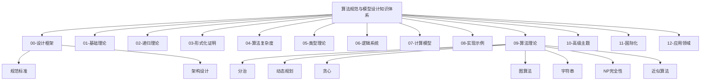
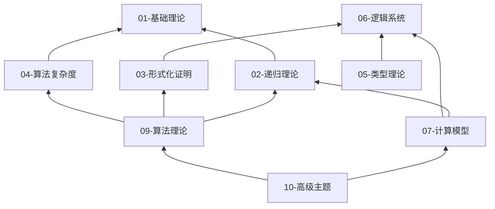

> **版本**: 1.0
> **最后更新**: 2026-04-19
> **作者**: 算法规范设计团队
>
> ---
>
# 算法规范与模型设计 - 知识体系架构

> **文档**: 知识体系架构总览
> **版本**: v1.0
> **创建日期**: 2026-04-10

---

## 一、知识体系总览



---

## 二、模块依赖关系



---

## 三、六维内容标准

每个知识单元包含六个维度：

| 维度 | 内容 | 符号 |
|------|------|------|
| **概念定义** | 形式化定义 + 自然语言解释 | $\mathcal{D}$ |
| **属性** | 性质、定理、复杂度 | $\mathcal{P}$ |
| **关系** | 概念依赖、等价、蕴含 | $\mathcal{R}$ |
| **解释** | 动机、直观、示例 | $\mathcal{E}$ |
| **论证** | 非形式化证明、思路 | $\mathcal{A}$ |
| **形式证明** | 严格数学证明 | $\mathcal{F}$ |

**文档命名**: `{序号}-{主题}-六维补充.md`

---

## 四、国际课程对标矩阵

| 本体系模块 | MIT | Stanford | CMU | Berkeley |
|------------|-----|----------|-----|----------|
| 01-基础理论 | 6.042J | CS103 | 15-251 | CS70 |
| 02-递归理论 | 18.404 | - | - | - |
| 03-形式化证明 | - | - | - | - |
| 04-算法复杂度 | 6.046 | CS161 | 15-451 | CS170 |
| 05-类型理论 | - | - | - | - |
| 06-逻辑系统 | - | - | - | - |
| 07-计算模型 | 18.404 | - | - | - |
| 09-算法理论 | 6.006/6.046 | CS161 | 15-451 | CS170 |
| 10-高级主题 | 6.845/6.867 | CS229/CS255 | 10-701 | - |

---

## 五、代码实现规范

### 5.1 语言分配

| 语言 | 适用场景 | 代码规范 |
|------|----------|----------|
| **Rust** | 系统/并发/性能关键 | Rust API Guidelines |
| **Go** | 工程/并发/云服务 | Effective Go |
| **Python** | 原型/教育/算法验证 | PEP 8 |
| **C** | 嵌入式/底层/教学 | Linux Kernel Style |

### 5.2 代码文档要求

```rust
/// 算法名称
///
/// # 复杂度
/// - 时间: O(?)
/// - 空间: O(?)
///
/// # 算法思想
/// 简要描述
///
/// # 参考
/// - CLRS Chapter ?
/// - 论文/链接
pub fn algorithm_name(...) -> ...
```

---

## 六、质量保证体系

### 6.1 文档质量检查清单

- [ ] 六维内容完整
- [ ] 数学符号符合ISO 80000
- [ ] 引用符合ACM规范
- [ ] Mermaid图表可渲染
- [ ] 中英文术语对照

### 6.2 代码质量检查清单

- [ ] 通过编译/解释器检查
- [ ] 单元测试覆盖主要路径
- [ ] 复杂度注释完整
- [ ] 算法引用来源
- [ ] 文档字符串完整

---

**维护**: 项目架构组
**更新**: 随版本迭代

## 学习目标

- 理解算法规范与模型设计 - 知识体系架构的核心概念
- 掌握算法规范与模型设计 - 知识体系架构的形式化表示

## 参考文献


- [Diátaxis] D. Procida. Diátaxis Documentation Framework. https://diataxis.fr/


## 知识导航

- [返回目录](../)
