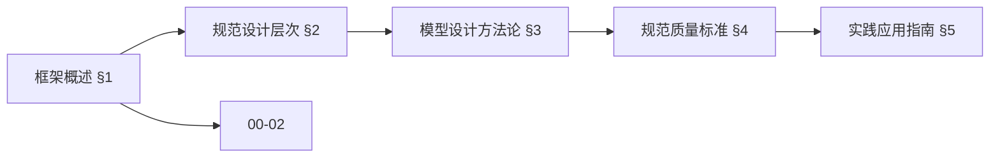
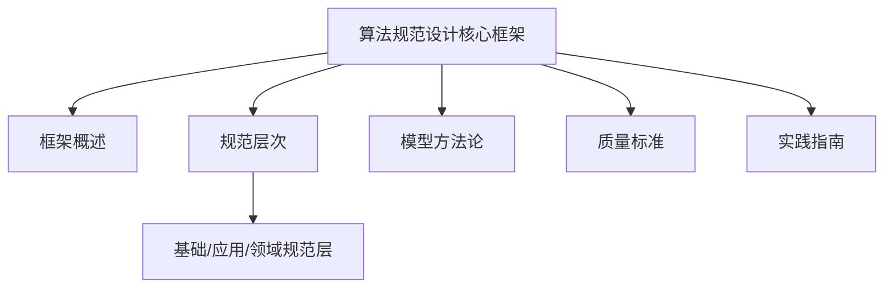
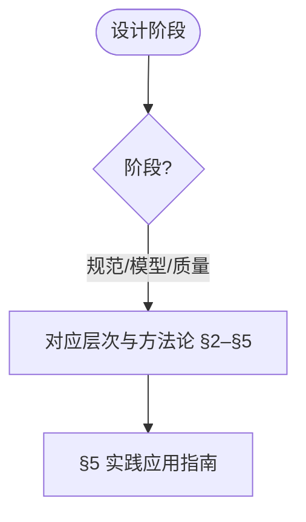
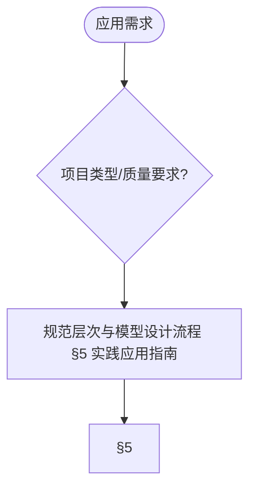

# 算法规范设计核心框架 (Algorithm Specification Design Core Framework)

> 📊 **项目全面梳理**：详细的项目结构、模块详解和学习路径，请参阅 [`项目全面梳理-2025.md`](../项目全面梳理-2025.md)
> 导航：`docs/README.md` · `docs/术语与符号总表.md` · `docs/跨文档索引.md`
> **项目导航与对标**：[项目扩展与持续推进任务编排](../项目扩展与持续推进任务编排.md)、[国际课程对标表](../国际课程对标表.md)

### 哲科结构参考 / Philosophy of Computer Science Reference

计算系统的**本体层次**（意图→规约→算法→程序→实现）与 Turner 的**规约-制品关系**为本框架的规范层次提供哲学支撑。详见 [Stanford Encyclopedia of Philosophy - Philosophy of Computer Science](https://plato.stanford.edu/entries/computer-science/) §1-§2，以及本项目 [项目哲科结构说明](../项目哲科结构说明.md)。

## 目录 (Table of Contents)

- [算法规范设计核心框架 (Algorithm Specification Design Core Framework)](#算法规范设计核心框架-algorithm-specification-design-core-framework)
  - [目录 (Table of Contents)](#目录-table-of-contents)
  - [1. 框架概述 (Framework Overview)](#1-框架概述-framework-overview)
    - [1.1 设计理念 (Design Philosophy)](#11-设计理念-design-philosophy)
    - [1.2 核心原则 (Core Principles)](#12-核心原则-core-principles)
    - [1.3 框架结构 (Framework Structure)](#13-框架结构-framework-structure)
  - [2. 规范设计层次 (Specification Design Layers)](#2-规范设计层次-specification-design-layers)
    - [2.1 基础规范层 (Basic Specification Layer)](#21-基础规范层-basic-specification-layer)
    - [2.2 应用规范层 (Application Specification Layer)](#22-应用规范层-application-specification-layer)
    - [2.3 领域规范层 (Domain Specification Layer)](#23-领域规范层-domain-specification-layer)
  - [3. 模型设计方法论 (Model Design Methodology)](#3-模型设计方法论-model-design-methodology)
    - [3.1 模型抽象 (Model Abstraction)](#31-模型抽象-model-abstraction)
    - [3.2 模型构建 (Model Construction)](#32-模型构建-model-construction)
    - [3.3 模型验证 (Model Validation)](#33-模型验证-model-validation)
  - [4. 规范质量标准 (Specification Quality Standards)](#4-规范质量标准-specification-quality-standards)
    - [4.1 完整性标准 (Completeness Standards)](#41-完整性标准-completeness-standards)
    - [4.2 一致性标准 (Consistency Standards)](#42-一致性标准-consistency-standards)
    - [4.3 可验证性标准 (Verifiability Standards)](#43-可验证性标准-verifiability-standards)
  - [5. 实践应用指南 (Practical Application Guide)](#5-实践应用指南-practical-application-guide)
    - [5.1 规范设计流程 (Specification Design Process)](#51-规范设计流程-specification-design-process)
    - [5.2 模型设计流程 (Model Design Process)](#52-模型设计流程-model-design-process)
    - [5.3 质量保证流程 (Quality Assurance Process)](#53-质量保证流程-quality-assurance-process)
  - [6. 参考文献 (References)](#6-参考文献-references)
    - [6.1 规范设计经典文献 (Classic Specification Design Literature)](#61-规范设计经典文献-classic-specification-design-literature)
    - [6.2 模型设计方法论 (Model Design Methodology)](#62-模型设计方法论-model-design-methodology)
    - [6.3 质量标准与评估 (Quality Standards and Assessment)](#63-质量标准与评估-quality-standards-and-assessment)
    - [6.4 国际标准与规范 (International Standards and Specifications)](#64-国际标准与规范-international-standards-and-specifications)

---

## 1. 框架概述 (Framework Overview)

### 1.1 设计理念 (Design Philosophy)

**算法规范设计核心框架**旨在为算法设计提供系统性的规范指导，确保算法设计的标准化、规范化和高质量 [Hoare1969][Dijkstra1976]。

**核心设计理念**：

1. **规范导向 (Specification-Oriented)**
   - 以规范设计为核心，建立标准化的设计框架
   - 确保算法设计的规范性和一致性
   - 提供可重复、可验证的设计方法

2. **模型驱动 (Model-Driven)**
   - 以模型设计方法论为指导
   - 提供系统性的设计方法
   - 支持抽象化和模块化设计

3. **知识支撑 (Knowledge-Supported)**
   - 以完整知识体系为支撑
   - 确保规范设计的理论基础
   - 提供跨领域的知识整合

4. **实践应用 (Practice-Applied)**
   - 以实际应用为导向
   - 提供规范设计的实践指导
   - 支持工程化和产业化应用

### 1.2 核心原则 (Core Principles)

**算法规范设计核心原则**：

1. **完整性原则 (Completeness Principle)**
   - 规范必须完整覆盖所有设计要素
   - 模型必须完整描述所有关键特征
   - 知识体系必须完整支撑所有应用场景

2. **一致性原则 (Consistency Principle)**
   - 规范内部必须保持逻辑一致性
   - 模型设计必须保持结构一致性
   - 知识体系必须保持概念一致性

3. **可验证性原则 (Verifiability Principle)** [IEEE1012]
   - 规范必须可验证和可测试
   - 模型必须可验证和可评估
   - 设计过程必须可追溯和可审计

4. **可扩展性原则 (Extensibility Principle)**
   - 规范框架必须支持扩展和演进
   - 模型设计必须支持模块化和组合
   - 知识体系必须支持持续更新

### 1.3 框架结构 (Framework Structure)

**算法规范设计核心框架**采用分层架构设计：

```text
算法规范设计核心框架
├── 规范设计层次
│   ├── 基础规范层 (Basic Specification Layer)
│   ├── 应用规范层 (Application Specification Layer)
│   └── 领域规范层 (Domain Specification Layer)
├── 模型设计方法论
│   ├── 模型抽象 (Model Abstraction)
│   ├── 模型构建 (Model Construction)
│   └── 模型验证 (Model Validation)
├── 规范质量标准
│   ├── 完整性标准 (Completeness Standards)
│   ├── 一致性标准 (Consistency Standards)
│   └── 可验证性标准 (Verifiability Standards)
└── 实践应用指南
    ├── 规范设计流程 (Specification Design Process)
    ├── 模型设计流程 (Model Design Process)
    └── 质量保证流程 (Quality Assurance Process)
```

### 内容补充与思维表征 / Content Supplement and Thinking Representation

> 本节按 [内容补充与思维表征全面计划方案](../内容补充与思维表征全面计划方案.md) **只补充、不删除**。标准见 [内容补充标准](../内容补充标准-概念定义属性关系解释论证形式证明.md)、[思维表征模板集](../思维表征模板集.md)。

#### 解释与直观 / Explanation and Intuition

算法规范设计核心框架将规范导向、模型驱动、知识支撑与实践应用结合。与 00-02 实践指南、00-04 模型设计方法论衔接；§1 框架概述、§2–§5 规范层次/模型方法论/质量标准/实践指南形成完整表征。

#### 概念属性表 / Concept Attribute Table

| 属性名 | 类型/范围 | 含义 | 备注 |
|--------|-----------|------|------|
| 框架概述、设计理念、核心原则、框架结构 | 基本概念 | §1 | 与 00-02、00-04 对照 |
| 规范设计层次、模型设计方法论、规范质量标准、实践应用指南 | 层次/方法/标准/指南 | 完整性、一致性、可验证性 | §2–§5 |
| 基础/应用/领域规范层 | 对比 | §2–§4 | 多维矩阵 |

#### 概念关系 / Concept Relations

| 源概念 | 目标概念 | 关系类型 | 说明 |
|--------|----------|----------|------|
| 算法规范设计核心框架 | 00-02、00-04 | depends_on | 实践指南与模型方法论 |
| 算法规范设计核心框架 | 01–12 各模块 | applies_to | 规范实践 |

#### 概念依赖图 / Concept Dependency Graph



#### 论证与证明衔接 / Argumentation and Proof Link

规范质量标准见 §4；与 00-03 质量标准体系论证衔接；层次与方法论正确性见 §2–§3。

#### 思维导图：本章概念结构 / Mind Map



#### 多维矩阵：规范层对比 / Multi-Dimensional Comparison

| 概念/层次 | 完整性 | 一致性 | 可验证性 | 备注 |
|-----------|--------|--------|----------|------|
| 基础/应用/领域规范层 | §2–§4 | §2–§4 | §2–§4 | — |

#### 决策树：设计阶段到层次与方法论选择 / Decision Tree



#### 公理定理推理证明决策树 / Axiom-Theorem-Proof Tree


#### 应用决策建模树 / Application Decision Modeling Tree



## 2. 规范设计层次 (Specification Design Layers)

### 2.1 基础规范层 (Basic Specification Layer)

**基础规范层**提供算法设计的基础规范和标准。

**核心要素**：

1. **算法定义规范 (Algorithm Definition Specification)**
   - 输入输出规范
   - 功能行为规范
   - 性能要求规范

2. **数据结构规范 (Data Structure Specification)**
   - 数据组织规范
   - 操作接口规范
   - 存储要求规范

3. **复杂度规范 (Complexity Specification)**
   - 时间复杂度规范
   - 空间复杂度规范
   - 渐进分析规范

**形式化定义**：

```mathematical
基础规范层 = {
    算法定义规范: AlgorithmDefinitionSpec,
    数据结构规范: DataStructureSpec,
    复杂度规范: ComplexitySpec
}

AlgorithmDefinitionSpec = {
    输入: InputSpec,
    输出: OutputSpec,
    功能: FunctionSpec,
    行为: BehaviorSpec
}
```

### 2.2 应用规范层 (Application Specification Layer)

**应用规范层**提供特定应用场景的算法规范。

**核心要素**：

1. **应用场景规范 (Application Scenario Specification)**
   - 业务需求规范
   - 技术约束规范
   - 性能指标规范

2. **接口规范 (Interface Specification)**
   - API设计规范
   - 数据交换规范
   - 协议标准规范

3. **集成规范 (Integration Specification)**
   - 系统集成规范
   - 模块组合规范
   - 部署配置规范

**形式化定义**：

```mathematical
应用规范层 = {
    应用场景规范: ApplicationScenarioSpec,
    接口规范: InterfaceSpec,
    集成规范: IntegrationSpec
}

ApplicationScenarioSpec = {
    业务需求: BusinessRequirement,
    技术约束: TechnicalConstraint,
    性能指标: PerformanceMetric
}
```

### 2.3 领域规范层 (Domain Specification Layer)

**领域规范层**提供特定领域的算法规范。

**核心要素**：

1. **领域模型规范 (Domain Model Specification)**
   - 领域概念规范
   - 业务规则规范
   - 领域约束规范

2. **算法族规范 (Algorithm Family Specification)**
   - 算法分类规范
   - 算法关系规范
   - 算法演化规范

3. **质量标准规范 (Quality Standard Specification)**
   - 质量属性规范
   - 评估标准规范
   - 改进指导规范

**形式化定义**：

```mathematical
领域规范层 = {
    领域模型规范: DomainModelSpec,
    算法族规范: AlgorithmFamilySpec,
    质量标准规范: QualityStandardSpec
}

DomainModelSpec = {
    领域概念: DomainConcept,
    业务规则: BusinessRule,
    领域约束: DomainConstraint
}
```

## 3. 模型设计方法论 (Model Design Methodology)

### 3.1 模型抽象 (Model Abstraction)

**模型抽象**是算法模型设计的核心方法，通过抽象化处理复杂问题。

**抽象层次**：

1. **概念抽象 (Conceptual Abstraction)**
   - 问题域抽象
   - 解决方案抽象
   - 设计模式抽象

2. **结构抽象 (Structural Abstraction)**
   - 数据流抽象
   - 控制流抽象
   - 模块结构抽象

3. **行为抽象 (Behavioral Abstraction)**
   - 功能行为抽象
   - 性能行为抽象
   - 交互行为抽象

**抽象方法**：

```mathematical
模型抽象 = {
    概念抽象: ConceptualAbstraction,
    结构抽象: StructuralAbstraction,
    行为抽象: BehavioralAbstraction
}

ConceptualAbstraction = {
    问题域: ProblemDomain,
    解决方案: Solution,
    设计模式: DesignPattern
}
```

### 3.2 模型构建 (Model Construction)

**模型构建**是算法模型设计的具体实现过程。

**构建步骤**：

1. **需求分析 (Requirement Analysis)**
   - 功能需求分析
   - 非功能需求分析
   - 约束条件分析

2. **架构设计 (Architecture Design)**
   - 系统架构设计
   - 模块架构设计
   - 接口架构设计

3. **详细设计 (Detailed Design)**
   - 算法详细设计
   - 数据结构设计
   - 实现策略设计

**构建方法**：

```mathematical
模型构建 = {
    需求分析: RequirementAnalysis,
    架构设计: ArchitectureDesign,
    详细设计: DetailedDesign
}

RequirementAnalysis = {
    功能需求: FunctionalRequirement,
    非功能需求: NonFunctionalRequirement,
    约束条件: Constraint
}
```

### 3.3 模型验证 (Model Validation)

**模型验证**是确保算法模型正确性和质量的关键环节。

**验证方法**：

1. **形式化验证 (Formal Verification)**
   - 数学证明验证
   - 逻辑推理验证
   - 模型检查验证

2. **测试验证 (Testing Verification)**
   - 单元测试验证
   - 集成测试验证
   - 系统测试验证

3. **性能验证 (Performance Verification)**
   - 复杂度分析验证
   - 性能测试验证
   - 基准测试验证

**验证框架**：

```mathematical
模型验证 = {
    形式化验证: FormalVerification,
    测试验证: TestingVerification,
    性能验证: PerformanceVerification
}

FormalVerification = {
    数学证明: MathematicalProof,
    逻辑推理: LogicalReasoning,
    模型检查: ModelChecking
}
```

## 4. 规范质量标准 (Specification Quality Standards)

### 4.1 完整性标准 (Completeness Standards)

**完整性标准**确保算法规范覆盖所有必要的设计要素。

**完整性要求**：

1. **功能完整性 (Functional Completeness)**
   - 所有功能需求必须被覆盖
   - 所有输入输出必须被定义
   - 所有异常情况必须被处理

2. **结构完整性 (Structural Completeness)**
   - 所有模块必须被定义
   - 所有接口必须被规范
   - 所有依赖关系必须被明确

3. **文档完整性 (Documentation Completeness)**
   - 所有设计决策必须被记录
   - 所有假设条件必须被说明
   - 所有变更历史必须被维护

**完整性检查**：

```mathematical
完整性标准 = {
    功能完整性: FunctionalCompleteness,
    结构完整性: StructuralCompleteness,
    文档完整性: DocumentationCompleteness
}

FunctionalCompleteness = {
    功能覆盖: FunctionCoverage,
    输入输出: InputOutput,
    异常处理: ExceptionHandling
}
```

### 4.2 一致性标准 (Consistency Standards)

**一致性标准**确保算法规范内部和外部的一致性。

**一致性要求**：

1. **内部一致性 (Internal Consistency)**
   - 规范内部逻辑一致
   - 定义术语一致
   - 表示方法一致

2. **外部一致性 (External Consistency)**
   - 与相关标准一致
   - 与行业规范一致
   - 与最佳实践一致

3. **版本一致性 (Version Consistency)**
   - 版本间兼容一致
   - 变更影响一致
   - 演进路径一致

**一致性检查**：

```mathematical
一致性标准 = {
    内部一致性: InternalConsistency,
    外部一致性: ExternalConsistency,
    版本一致性: VersionConsistency
}

InternalConsistency = {
    逻辑一致: LogicalConsistency,
    术语一致: TermConsistency,
    表示一致: RepresentationConsistency
}
```

### 4.3 可验证性标准 (Verifiability Standards)

**可验证性标准**确保算法规范可以被验证和测试。

**可验证性要求**：

1. **可测试性 (Testability)**
   - 功能可测试
   - 性能可测试
   - 可靠性可测试

2. **可追溯性 (Traceability)**
   - 需求可追溯
   - 设计可追溯
   - 实现可追溯

3. **可审计性 (Auditability)**
   - 过程可审计
   - 决策可审计
   - 质量可审计

**可验证性检查**：

```mathematical
可验证性标准 = {
    可测试性: Testability,
    可追溯性: Traceability,
    可审计性: Auditability
}

Testability = {
    功能测试: FunctionalTest,
    性能测试: PerformanceTest,
    可靠性测试: ReliabilityTest
}
```

## 5. 实践应用指南 (Practical Application Guide)

### 5.1 规范设计流程 (Specification Design Process)

**规范设计流程**提供系统性的规范设计方法。

**设计步骤**：

1. **需求收集 (Requirement Gathering)**
   - 业务需求收集
   - 技术需求收集
   - 约束条件收集

2. **规范设计 (Specification Design)**
   - 基础规范设计
   - 应用规范设计
   - 领域规范设计

3. **规范验证 (Specification Validation)**
   - 完整性验证
   - 一致性验证
   - 可验证性验证

4. **规范发布 (Specification Release)**
   - 规范评审
   - 规范批准
   - 规范发布

**流程框架**：

```mathematical
规范设计流程 = {
    需求收集: RequirementGathering,
    规范设计: SpecificationDesign,
    规范验证: SpecificationValidation,
    规范发布: SpecificationRelease
}

RequirementGathering = {
    业务需求: BusinessRequirement,
    技术需求: TechnicalRequirement,
    约束条件: Constraint
}
```

### 5.2 模型设计流程 (Model Design Process)

**模型设计流程**提供系统性的模型设计方法。

**设计步骤**：

1. **问题分析 (Problem Analysis)**
   - 问题域分析
   - 解决方案分析
   - 设计约束分析

2. **模型抽象 (Model Abstraction)**
   - 概念抽象
   - 结构抽象
   - 行为抽象

3. **模型构建 (Model Construction)**
   - 需求分析
   - 架构设计
   - 详细设计

4. **模型验证 (Model Validation)**
   - 形式化验证
   - 测试验证
   - 性能验证

**流程框架**：

```mathematical
模型设计流程 = {
    问题分析: ProblemAnalysis,
    模型抽象: ModelAbstraction,
    模型构建: ModelConstruction,
    模型验证: ModelValidation
}

ProblemAnalysis = {
    问题域: ProblemDomain,
    解决方案: Solution,
    设计约束: DesignConstraint
}
```

### 5.3 质量保证流程 (Quality Assurance Process)

**质量保证流程**确保算法规范设计的质量。

**保证步骤**：

1. **质量计划 (Quality Planning)**
   - 质量标准制定
   - 质量检查计划
   - 质量改进计划

2. **质量控制 (Quality Control)**
   - 过程质量控制
   - 结果质量控制
   - 持续质量监控

3. **质量改进 (Quality Improvement)**
   - 问题识别分析
   - 改进措施制定
   - 改进效果评估

**流程框架**：

```mathematical
质量保证流程 = {
    质量计划: QualityPlanning,
    质量控制: QualityControl,
    质量改进: QualityImprovement
}

QualityPlanning = {
    质量标准: QualityStandard,
    检查计划: InspectionPlan,
    改进计划: ImprovementPlan
}
```

## 6. 参考文献 (References)

**引用规范说明 / Citation Guidelines**: 本文档遵循项目引用规范（见 [CITATION_STANDARD.md](../CITATION_STANDARD.md)、[学术引用规范-ACM对齐版.md](../学术引用规范-ACM对齐版.md)）。文内采用 [Key] 格式引用，与参考文献列表对应。

### 6.1 规范设计经典文献 (Classic Specification Design Literature)

1. [Hoare1969] Hoare, C. A. R. (1969). "An Axiomatic Basis for Computer Programming." *Communications of the ACM*, 12(10), 576–580. DOI: 10.1145/363235.363259
2. [Dijkstra1976] Dijkstra, E. W. (1976). *A Discipline of Programming*. Prentice-Hall. ISBN: 978-0132158718
3. [Gries1981] Gries, D. (1981). *The Science of Programming*. Springer-Verlag. ISBN: 978-0387964805

### 6.2 模型设计方法论 (Model Design Methodology)

1. [Booch1999] Booch, G., Rumbaugh, J., & Jacobson, I. (1999). *The Unified Modeling Language User Guide*. Addison-Wesley. ISBN: 978-0201571684
2. [Fowler2002] Fowler, M. (2002). *Patterns of Enterprise Application Architecture*. Addison-Wesley. ISBN: 978-0321127426
3. [Gamma1994] Gamma, E., Helm, R., Johnson, R., & Vlissides, J. (1994). *Design Patterns: Elements of Reusable Object-Oriented Software*. Addison-Wesley. ISBN: 978-0201633610

### 6.3 质量标准与评估 (Quality Standards and Assessment)

1. [ISO25010] ISO/IEC 25010 (2011). "Systems and software Quality Requirements and Evaluation (SQuaRE) — System and software quality models." International Organization for Standardization.
2. [IEEE830] IEEE 830 (1998). "IEEE Recommended Practice for Software Requirements Specifications." IEEE.
3. [CMMI2018] CMMI Institute (2018). "CMMI for Development, Version 2.0." CMMI Institute.

### 6.4 国际标准与规范 (International Standards and Specifications)

1. [CC2020] ACM/IEEE (2020). "Computing Curricula 2020: Paradigms for Global Computing Education." ACM/IEEE.
2. [ISO12207] ISO/IEC 12207 (2017). "Systems and software engineering — Software life cycle processes." International Organization for Standardization.
3. [IEEE1012] IEEE 1012 (2016). "IEEE Standard for Software Verification and Validation." IEEE.

---

**文档版本**: v1.1
**最后更新**: 2025-02-02
**维护者**: 算法规范设计团队
**状态**: 已补充学术引用与文内引用 (P1)
