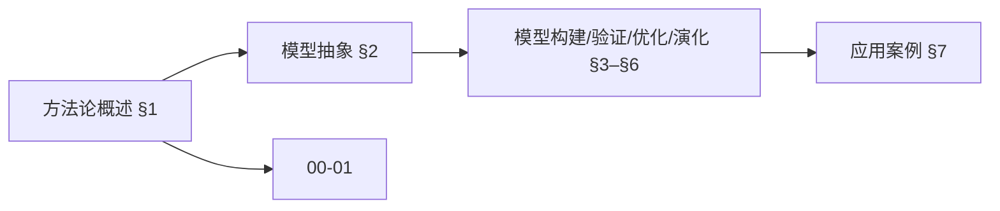
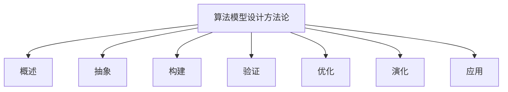
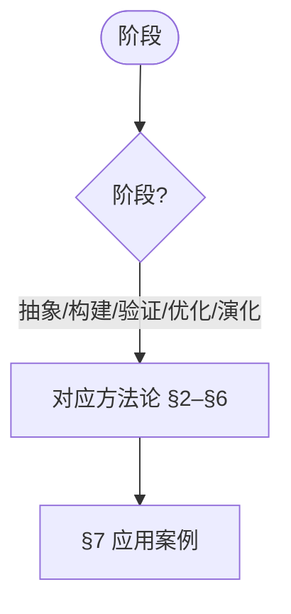
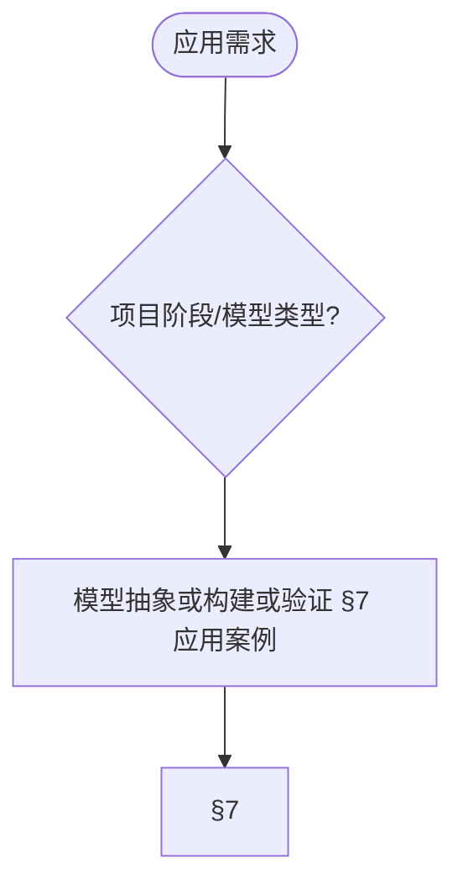

# 算法模型设计方法论 (Algorithm Model Design Methodology)

> 📊 **项目全面梳理**：详细的项目结构、模块详解和学习路径，请参阅 [`项目全面梳理-2025.md`](../项目全面梳理-2025.md)
> 导航：`docs/00-算法规范设计框架/01-算法规范设计核心框架.md` · `docs/00-算法规范设计框架/02-算法规范设计实践指南.md` · `docs/跨文档索引.md`
> **项目导航与对标**：[项目扩展与持续推进任务编排](../项目扩展与持续推进任务编排.md)、[国际课程对标表](../国际课程对标表.md)

## 目录 (Table of Contents)

- [算法模型设计方法论 (Algorithm Model Design Methodology)](#算法模型设计方法论-algorithm-model-design-methodology)
  - [目录 (Table of Contents)](#目录-table-of-contents)
  - [1. 方法论概述 (Methodology Overview)](#1-方法论概述-methodology-overview)
    - [1.1 方法论目标 (Methodology Objectives)](#11-方法论目标-methodology-objectives)
    - [1.2 方法论原则 (Methodology Principles)](#12-方法论原则-methodology-principles)
    - [1.3 方法论框架 (Methodology Framework)](#13-方法论框架-methodology-framework)
  - [2. 模型抽象方法论 (Model Abstraction Methodology)](#2-模型抽象方法论-model-abstraction-methodology)
    - [2.1 抽象层次理论 (Abstraction Level Theory)](#21-抽象层次理论-abstraction-level-theory)
    - [2.2 抽象方法 (Abstraction Methods)](#22-抽象方法-abstraction-methods)
    - [2.3 抽象验证 (Abstraction Validation)](#23-抽象验证-abstraction-validation)
  - [3. 模型构建方法论 (Model Construction Methodology)](#3-模型构建方法论-model-construction-methodology)
    - [3.1 构建策略 (Construction Strategies)](#31-构建策略-construction-strategies)
    - [3.2 构建方法 (Construction Methods)](#32-构建方法-construction-methods)
    - [3.3 构建验证 (Construction Validation)](#33-构建验证-construction-validation)
  - [4. 模型验证方法论 (Model Validation Methodology)](#4-模型验证方法论-model-validation-methodology)
    - [4.1 验证策略 (Validation Strategies)](#41-验证策略-validation-strategies)
    - [4.2 验证方法 (Validation Methods)](#42-验证方法-validation-methods)
    - [4.3 验证评估 (Validation Assessment)](#43-验证评估-validation-assessment)
  - [5. 模型优化方法论 (Model Optimization Methodology)](#5-模型优化方法论-model-optimization-methodology)
    - [5.1 优化目标 (Optimization Objectives)](#51-优化目标-optimization-objectives)
    - [5.2 优化方法 (Optimization Methods)](#52-优化方法-optimization-methods)
    - [5.3 优化评估 (Optimization Assessment)](#53-优化评估-optimization-assessment)
  - [6. 模型演化方法论 (Model Evolution Methodology)](#6-模型演化方法论-model-evolution-methodology)
    - [6.1 演化策略 (Evolution Strategies)](#61-演化策略-evolution-strategies)
    - [6.2 演化方法 (Evolution Methods)](#62-演化方法-evolution-methods)
    - [6.3 演化管理 (Evolution Management)](#63-演化管理-evolution-management)
  - [7. 应用案例 (Application Cases)](#7-应用案例-application-cases)
    - [7.1 基础模型设计案例 (Basic Model Design Cases)](#71-基础模型设计案例-basic-model-design-cases)
    - [7.2 复杂模型设计案例 (Complex Model Design Cases)](#72-复杂模型设计案例-complex-model-design-cases)
    - [7.3 领域模型设计案例 (Domain Model Design Cases)](#73-领域模型设计案例-domain-model-design-cases)
  - [8. 工具与方法 (Tools and Methods)](#8-工具与方法-tools-and-methods)
    - [8.1 建模工具 (Modeling Tools)](#81-建模工具-modeling-tools)
    - [8.2 验证工具 (Validation Tools)](#82-验证工具-validation-tools)
    - [8.3 优化工具 (Optimization Tools)](#83-优化工具-optimization-tools)
  - [9. 参考文献 (References)](#9-参考文献-references)
    - [9.1 方法论文献 (Methodology Literature)](#91-方法论文献-methodology-literature)
    - [9.2 模型设计文献 (Model Design Literature)](#92-模型设计文献-model-design-literature)
    - [9.3 验证方法文献 (Validation Methods Literature)](#93-验证方法文献-validation-methods-literature)
    - [9.4 优化方法文献 (Optimization Methods Literature)](#94-优化方法文献-optimization-methods-literature)

---

## 1. 方法论概述 (Methodology Overview)

模型设计方法论以抽象、构建与验证为核心，与UML与设计模式等经典文献一致 [Booch1999][Gamma1994]。

### 1.1 方法论目标 (Methodology Objectives)

**算法模型设计方法论**旨在为算法模型设计提供系统性的理论指导和实践方法。

**主要目标**：

1. **提供设计指导 (Provide Design Guidance)**
   - 提供系统性的模型设计方法
   - 建立标准化的设计流程
   - 提供设计决策的指导原则

2. **确保设计质量 (Ensure Design Quality)**
   - 建立质量保证机制
   - 提供质量评估方法
   - 支持持续质量改进

3. **促进设计创新 (Promote Design Innovation)**
   - 鼓励创新思维和方法
   - 支持新技术和新方法的应用
   - 促进设计实践的持续改进

4. **支持知识传承 (Support Knowledge Transfer)**
   - 提供最佳实践的案例和示例
   - 提供经验总结和教训学习
   - 支持知识的积累和传承

### 1.2 方法论原则 (Methodology Principles)

**算法模型设计方法论**基于以下核心原则：

1. **系统性原则 (Systematic Principle)**
   - 采用系统性的设计方法
   - 考虑系统的整体性和关联性
   - 确保设计过程的完整性和一致性

2. **抽象性原则 (Abstraction Principle)**
   - 通过抽象化处理复杂问题
   - 建立层次化的抽象模型
   - 支持模块化和组合化设计

3. **验证性原则 (Verification Principle)**
   - 建立验证机制确保设计正确性
   - 提供多种验证方法
   - 支持持续验证和改进

4. **演化性原则 (Evolution Principle)**
   - 支持模型的持续演化和改进
   - 建立演化管理机制
   - 促进模型的适应性发展

### 1.3 方法论框架 (Methodology Framework)

**算法模型设计方法论**采用分层架构设计：

```text
算法模型设计方法论
├── 模型抽象方法论
│   ├── 抽象层次理论
│   ├── 抽象方法
│   └── 抽象验证
├── 模型构建方法论
│   ├── 构建策略
│   ├── 构建方法
│   └── 构建验证
├── 模型验证方法论
│   ├── 验证策略
│   ├── 验证方法
│   └── 验证评估
├── 模型优化方法论
│   ├── 优化目标
│   ├── 优化方法
│   └── 优化评估
└── 模型演化方法论
    ├── 演化策略
    ├── 演化方法
    └── 演化管理
```

### 内容补充与思维表征 / Content Supplement and Thinking Representation

> 本节按 [内容补充与思维表征全面计划方案](../内容补充与思维表征全面计划方案.md) **只补充、不删除**。标准见 [内容补充标准](../内容补充标准-概念定义属性关系解释论证形式证明.md)、[思维表征模板集](../思维表征模板集.md)。

#### 解释与直观 / Explanation and Intuition

算法模型设计方法论将方法论概述与模型抽象、构建、验证、优化、演化方法论结合。与 00-01 核心框架、00-02 实践指南衔接；§1 概述、§2–§7 抽象/构建/验证/优化/演化与应用形成完整表征。

#### 概念属性表 / Concept Attribute Table

| 属性名 | 类型/范围 | 含义 | 备注 |
|--------|-----------|------|------|
| 方法论概述 | 基本概念 | §1 | 与 00-01、00-02 对照 |
| 模型抽象/构建/验证/优化/演化方法论、应用案例 | 方法论/案例 | 表达力、可验证性、适用阶段 | §2–§7 |
| 抽象/构建/验证/优化 | 对比 | §2–§5 | 多维矩阵 |

#### 概念关系 / Concept Relations

| 源概念 | 目标概念 | 关系类型 | 说明 |
|--------|----------|----------|------|
| 算法模型设计方法论 | 00-01、00-02 | depends_on | 核心框架与实践指南 |
| 算法模型设计方法论 | 01–12 各模块 | applies_to | 模型实践 |

#### 概念依赖图 / Concept Dependency Graph



#### 论证与证明衔接 / Argumentation and Proof Link

模型验证方法论见 §4；与 00-03 论证衔接；模型抽象/构建/验证正确性见 §2–§4。

#### 思维导图：本章概念结构 / Mind Map



#### 多维矩阵：方法论对比 / Multi-Dimensional Comparison

| 概念/方法论 | 表达力 | 可验证性 | 适用阶段 | 备注 |
|-------------|--------|----------|----------|------|
| 抽象/构建/验证/优化 | §2–§5 | §2–§5 | §2–§5 | — |

#### 决策树：阶段到方法论选择 / Decision Tree



#### 公理定理推理证明决策树 / Axiom-Theorem-Proof Tree


#### 应用决策建模树 / Application Decision Modeling Tree



## 2. 模型抽象方法论 (Model Abstraction Methodology)

### 2.1 抽象层次理论 (Abstraction Level Theory)

**抽象层次理论**是模型抽象方法论的理论基础，定义了不同层次的抽象概念。

**抽象层次定义**：

1. **概念抽象层 (Conceptual Abstraction Layer)**
   - 问题域抽象
   - 解决方案抽象
   - 设计模式抽象

2. **逻辑抽象层 (Logical Abstraction Layer)**
   - 数据流抽象
   - 控制流抽象
   - 模块结构抽象

3. **物理抽象层 (Physical Abstraction Layer)**
   - 实现结构抽象
   - 性能特征抽象
   - 部署配置抽象

**抽象层次关系**：

```mathematical
抽象层次理论 = {
    概念抽象层: ConceptualAbstractionLayer,
    逻辑抽象层: LogicalAbstractionLayer,
    物理抽象层: PhysicalAbstractionLayer
}

ConceptualAbstractionLayer = {
    问题域抽象: ProblemDomainAbstraction,
    解决方案抽象: SolutionAbstraction,
    设计模式抽象: DesignPatternAbstraction
}
```

### 2.2 抽象方法 (Abstraction Methods)

**抽象方法**提供具体的抽象化技术和方法。

**抽象方法类型**：

1. **分层抽象 (Layered Abstraction)**
   - 自顶向下抽象
   - 自底向上抽象
   - 中间向外抽象

2. **维度抽象 (Dimensional Abstraction)**
   - 功能维度抽象
   - 性能维度抽象
   - 质量维度抽象

3. **粒度抽象 (Granularity Abstraction)**
   - 粗粒度抽象
   - 中粒度抽象
   - 细粒度抽象

**抽象方法框架**：

```mathematical
抽象方法 = {
    分层抽象: LayeredAbstraction,
    维度抽象: DimensionalAbstraction,
    粒度抽象: GranularityAbstraction
}

LayeredAbstraction = {
    自顶向下: TopDownAbstraction,
    自底向上: BottomUpAbstraction,
    中间向外: MiddleOutAbstraction
}
```

### 2.3 抽象验证 (Abstraction Validation)

**抽象验证**确保抽象模型的正确性和有效性。

**验证方法**：

1. **一致性验证 (Consistency Validation)**
   - 抽象层次一致性验证
   - 抽象关系一致性验证
   - 抽象语义一致性验证

2. **完整性验证 (Completeness Validation)**
   - 抽象覆盖完整性验证
   - 抽象粒度完整性验证
   - 抽象关系完整性验证

3. **有效性验证 (Effectiveness Validation)**
   - 抽象效果验证
   - 抽象效率验证
   - 抽象适用性验证

**验证框架**：

```mathematical
抽象验证 = {
    一致性验证: ConsistencyValidation,
    完整性验证: CompletenessValidation,
    有效性验证: EffectivenessValidation
}

ConsistencyValidation = {
    层次一致性: LevelConsistency,
    关系一致性: RelationshipConsistency,
    语义一致性: SemanticConsistency
}
```

## 3. 模型构建方法论 (Model Construction Methodology)

### 3.1 构建策略 (Construction Strategies)

**构建策略**提供模型构建的总体策略和方法。

**策略类型**：

1. **自顶向下策略 (Top-Down Strategy)**
   - 从整体到局部
   - 从抽象到具体
   - 从概念到实现

2. **自底向上策略 (Bottom-Up Strategy)**
   - 从局部到整体
   - 从具体到抽象
   - 从实现到概念

3. **迭代策略 (Iterative Strategy)**
   - 逐步完善
   - 持续改进
   - 螺旋上升

**策略框架**：

```mathematical
构建策略 = {
    自顶向下策略: TopDownStrategy,
    自底向上策略: BottomUpStrategy,
    迭代策略: IterativeStrategy
}

TopDownStrategy = {
    整体设计: OverallDesign,
    局部设计: LocalDesign,
    详细设计: DetailedDesign
}
```

### 3.2 构建方法 (Construction Methods)

**构建方法**提供具体的模型构建技术和方法。

**方法类型**：

1. **需求驱动构建 (Requirement-Driven Construction)**
   - 需求分析
   - 需求建模
   - 需求验证

2. **架构驱动构建 (Architecture-Driven Construction)**
   - 架构设计
   - 架构建模
   - 架构验证

3. **模式驱动构建 (Pattern-Driven Construction)**
   - 模式识别
   - 模式应用
   - 模式组合

**方法框架**：

```mathematical
构建方法 = {
    需求驱动构建: RequirementDrivenConstruction,
    架构驱动构建: ArchitectureDrivenConstruction,
    模式驱动构建: PatternDrivenConstruction
}

RequirementDrivenConstruction = {
    需求分析: RequirementAnalysis,
    需求建模: RequirementModeling,
    需求验证: RequirementValidation
}
```

### 3.3 构建验证 (Construction Validation)

**构建验证**确保模型构建的正确性和质量。

**验证方法**：

1. **结构验证 (Structural Validation)**
   - 模型结构验证
   - 模型关系验证
   - 模型完整性验证

2. **行为验证 (Behavioral Validation)**
   - 模型行为验证
   - 模型交互验证
   - 模型性能验证

3. **质量验证 (Quality Validation)**
   - 模型质量验证
   - 模型可维护性验证
   - 模型可扩展性验证

**验证框架**：

```mathematical
构建验证 = {
    结构验证: StructuralValidation,
    行为验证: BehavioralValidation,
    质量验证: QualityValidation
}

StructuralValidation = {
    模型结构: ModelStructure,
    模型关系: ModelRelationship,
    模型完整性: ModelCompleteness
}
```

## 4. 模型验证方法论 (Model Validation Methodology)

### 4.1 验证策略 (Validation Strategies)

**验证策略**提供模型验证的总体策略和方法。

**策略类型**：

1. **形式化验证策略 (Formal Validation Strategy)**
   - 数学证明验证
   - 逻辑推理验证
   - 模型检查验证

2. **实验验证策略 (Experimental Validation Strategy)**
   - 原型验证
   - 仿真验证
   - 测试验证

3. **专家验证策略 (Expert Validation Strategy)**
   - 专家评审验证
   - 同行评议验证
   - 用户反馈验证

**策略框架**：

```mathematical
验证策略 = {
    形式化验证策略: FormalValidationStrategy,
    实验验证策略: ExperimentalValidationStrategy,
    专家验证策略: ExpertValidationStrategy
}

FormalValidationStrategy = {
    数学证明: MathematicalProof,
    逻辑推理: LogicalReasoning,
    模型检查: ModelChecking
}
```

### 4.2 验证方法 (Validation Methods)

**验证方法**提供具体的模型验证技术和方法。

**方法类型**：

1. **静态验证 (Static Validation)**
   - 语法检查
   - 语义检查
   - 一致性检查

2. **动态验证 (Dynamic Validation)**
   - 功能测试
   - 性能测试
   - 集成测试

3. **混合验证 (Hybrid Validation)**
   - 静态和动态结合
   - 形式化和实验结合
   - 定量和定性结合

**方法框架**：

```mathematical
验证方法 = {
    静态验证: StaticValidation,
    动态验证: DynamicValidation,
    混合验证: HybridValidation
}

StaticValidation = {
    语法检查: SyntaxChecking,
    语义检查: SemanticChecking,
    一致性检查: ConsistencyChecking
}
```

### 4.3 验证评估 (Validation Assessment)

**验证评估**评估验证过程和结果的有效性。

**评估方法**：

1. **覆盖率评估 (Coverage Assessment)**
   - 功能覆盖率评估
   - 结构覆盖率评估
   - 行为覆盖率评估

2. **有效性评估 (Effectiveness Assessment)**
   - 验证方法有效性评估
   - 验证结果有效性评估
   - 验证过程有效性评估

3. **效率评估 (Efficiency Assessment)**
   - 验证时间效率评估
   - 验证资源效率评估
   - 验证成本效率评估

**评估框架**：

```mathematical
验证评估 = {
    覆盖率评估: CoverageAssessment,
    有效性评估: EffectivenessAssessment,
    效率评估: EfficiencyAssessment
}

CoverageAssessment = {
    功能覆盖率: FunctionCoverage,
    结构覆盖率: StructureCoverage,
    行为覆盖率: BehaviorCoverage
}
```

## 5. 模型优化方法论 (Model Optimization Methodology)

### 5.1 优化目标 (Optimization Objectives)

**优化目标**定义模型优化的具体目标和指标。

**目标类型**：

1. **性能优化目标 (Performance Optimization Objectives)**
   - 时间复杂度优化
   - 空间复杂度优化
   - 吞吐量优化

2. **质量优化目标 (Quality Optimization Objectives)**
   - 正确性优化
   - 可靠性优化
   - 可维护性优化

3. **效率优化目标 (Efficiency Optimization Objectives)**
   - 资源利用率优化
   - 能耗优化
   - 成本优化

**目标框架**：

```mathematical
优化目标 = {
    性能优化目标: PerformanceOptimizationObjectives,
    质量优化目标: QualityOptimizationObjectives,
    效率优化目标: EfficiencyOptimizationObjectives
}

PerformanceOptimizationObjectives = {
    时间复杂度: TimeComplexity,
    空间复杂度: SpaceComplexity,
    吞吐量: Throughput
}
```

### 5.2 优化方法 (Optimization Methods)

**优化方法**提供具体的模型优化技术和方法。

**方法类型**：

1. **算法优化 (Algorithm Optimization)**
   - 算法改进
   - 算法替换
   - 算法组合

2. **结构优化 (Structural Optimization)**
   - 数据结构优化
   - 模块结构优化
   - 接口结构优化

3. **参数优化 (Parameter Optimization)**
   - 参数调优
   - 参数自适应
   - 参数学习

**方法框架**：

```mathematical
优化方法 = {
    算法优化: AlgorithmOptimization,
    结构优化: StructuralOptimization,
    参数优化: ParameterOptimization
}

AlgorithmOptimization = {
    算法改进: AlgorithmImprovement,
    算法替换: AlgorithmReplacement,
    算法组合: AlgorithmCombination
}
```

### 5.3 优化评估 (Optimization Assessment)

**优化评估**评估优化过程和结果的有效性。

**评估方法**：

1. **效果评估 (Effectiveness Assessment)**
   - 优化效果评估
   - 性能提升评估
   - 质量改善评估

2. **成本评估 (Cost Assessment)**
   - 优化成本评估
   - 资源消耗评估
   - 时间成本评估

3. **风险评估 (Risk Assessment)**
   - 优化风险评估
   - 副作用评估
   - 稳定性评估

**评估框架**：

```mathematical
优化评估 = {
    效果评估: EffectivenessAssessment,
    成本评估: CostAssessment,
    风险评估: RiskAssessment
}

EffectivenessAssessment = {
    优化效果: OptimizationEffectiveness,
    性能提升: PerformanceImprovement,
    质量改善: QualityImprovement
}
```

## 6. 模型演化方法论 (Model Evolution Methodology)

### 6.1 演化策略 (Evolution Strategies)

**演化策略**提供模型演化的总体策略和方法。

**策略类型**：

1. **渐进演化策略 (Gradual Evolution Strategy)**
   - 逐步改进
   - 平滑过渡
   - 风险控制

2. **激进演化策略 (Radical Evolution Strategy)**
   - 重大变革
   - 快速转型
   - 创新突破

3. **混合演化策略 (Hybrid Evolution Strategy)**
   - 渐进和激进结合
   - 局部和全局结合
   - 短期和长期结合

**策略框架**：

```mathematical
演化策略 = {
    渐进演化策略: GradualEvolutionStrategy,
    激进演化策略: RadicalEvolutionStrategy,
    混合演化策略: HybridEvolutionStrategy
}

GradualEvolutionStrategy = {
    逐步改进: GradualImprovement,
    平滑过渡: SmoothTransition,
    风险控制: RiskControl
}
```

### 6.2 演化方法 (Evolution Methods)

**演化方法**提供具体的模型演化技术和方法。

**方法类型**：

1. **版本演化 (Version Evolution)**
   - 版本管理
   - 版本控制
   - 版本兼容

2. **功能演化 (Functional Evolution)**
   - 功能扩展
   - 功能改进
   - 功能重构

3. **架构演化 (Architectural Evolution)**
   - 架构升级
   - 架构重构
   - 架构迁移

**方法框架**：

```mathematical
演化方法 = {
    版本演化: VersionEvolution,
    功能演化: FunctionalEvolution,
    架构演化: ArchitecturalEvolution
}

VersionEvolution = {
    版本管理: VersionManagement,
    版本控制: VersionControl,
    版本兼容: VersionCompatibility
}
```

### 6.3 演化管理 (Evolution Management)

**演化管理**管理模型演化的过程和结果。

**管理方法**：

1. **变更管理 (Change Management)**
   - 变更识别
   - 变更评估
   - 变更实施

2. **影响管理 (Impact Management)**
   - 影响分析
   - 影响评估
   - 影响控制

3. **风险管理 (Risk Management)**
   - 风险识别
   - 风险评估
   - 风险控制

**管理框架**：

```mathematical
演化管理 = {
    变更管理: ChangeManagement,
    影响管理: ImpactManagement,
    风险管理: RiskManagement
}

ChangeManagement = {
    变更识别: ChangeIdentification,
    变更评估: ChangeAssessment,
    变更实施: ChangeImplementation
}
```

## 7. 应用案例 (Application Cases)

### 7.1 基础模型设计案例 (Basic Model Design Cases)

**案例1：排序算法模型设计**：

```markdown
## 快速排序算法模型设计案例

### 1. 模型抽象
- 概念抽象：比较排序算法
- 逻辑抽象：分治策略
- 物理抽象：原地排序实现

### 2. 模型构建
- 需求分析：对数组进行原地排序
- 架构设计：分治算法架构
- 详细设计：分区函数和递归调用

### 3. 模型验证
- 形式化验证：算法正确性证明
- 实验验证：不同规模数据测试
- 专家验证：算法复杂度分析

### 4. 模型优化
- 性能优化：三路快排优化
- 质量优化：稳定性改进
- 效率优化：内存使用优化

### 5. 模型演化
- 版本演化：从基础版本到优化版本
- 功能演化：支持自定义比较函数
- 架构演化：从递归到迭代实现
```

**案例2：搜索算法模型设计**：

```markdown
## 二分搜索算法模型设计案例

### 1. 模型抽象
- 概念抽象：搜索算法
- 逻辑抽象：分治搜索策略
- 物理抽象：数组索引操作

### 2. 模型构建
- 需求分析：在有序数组中搜索目标
- 架构设计：迭代搜索架构
- 详细设计：搜索范围调整逻辑

### 3. 模型验证
- 形式化验证：搜索正确性证明
- 实验验证：边界条件测试
- 专家验证：复杂度分析验证

### 4. 模型优化
- 性能优化：循环展开优化
- 质量优化：边界处理优化
- 效率优化：分支预测优化

### 5. 模型演化
- 版本演化：从基础版本到优化版本
- 功能演化：支持多种搜索模式
- 架构演化：从迭代到递归实现
```

### 7.2 复杂模型设计案例 (Complex Model Design Cases)

**案例3：图算法模型设计**：

```markdown
## 最短路径算法模型设计案例

### 1. 模型抽象
- 概念抽象：图算法
- 逻辑抽象：贪心策略
- 物理抽象：优先队列实现

### 2. 模型构建
- 需求分析：单源最短路径计算
- 架构设计：Dijkstra算法架构
- 详细设计：松弛操作和优先队列

### 3. 模型验证
- 形式化验证：算法正确性证明
- 实验验证：不同图结构测试
- 专家验证：复杂度分析验证

### 4. 模型优化
- 性能优化：堆优化实现
- 质量优化：负权边处理
- 效率优化：并行化实现

### 5. 模型演化
- 版本演化：从基础版本到优化版本
- 功能演化：支持多源最短路径
- 架构演化：从单线程到多线程
```

### 7.3 领域模型设计案例 (Domain Model Design Cases)

**案例4：机器学习算法模型设计**：

```markdown
## 决策树算法模型设计案例

### 1. 模型抽象
- 概念抽象：机器学习算法
- 逻辑抽象：树形决策结构
- 物理抽象：递归树构建

### 2. 模型构建
- 需求分析：分类决策树构建
- 架构设计：C4.5算法架构
- 详细设计：信息增益计算和节点分裂

### 3. 模型验证
- 形式化验证：信息论基础验证
- 实验验证：不同数据集测试
- 专家验证：过拟合控制验证

### 4. 模型优化
- 性能优化：剪枝优化
- 质量优化：特征选择优化
- 效率优化：并行化训练

### 5. 模型演化
- 版本演化：从ID3到C4.5到CART
- 功能演化：支持回归和分类
- 架构演化：从单树到集成学习
```

## 8. 工具与方法 (Tools and Methods)

### 8.1 建模工具 (Modeling Tools)

**建模工具**：

1. **概念建模工具 (Conceptual Modeling Tools)**
   - UML建模工具
   - 概念图工具
   - 思维导图工具

2. **逻辑建模工具 (Logical Modeling Tools)**
   - 流程图工具
   - 数据流图工具
   - 状态图工具

3. **物理建模工具 (Physical Modeling Tools)**
   - 架构图工具
   - 部署图工具
   - 性能图工具

**工具选择指南**：

```mathematical
建模工具 = {
    概念建模工具: ConceptualModelingTools,
    逻辑建模工具: LogicalModelingTools,
    物理建模工具: PhysicalModelingTools
}

ConceptualModelingTools = {
    UML工具: UMLTools,
    概念图工具: ConceptDiagramTools,
    思维导图工具: MindMappingTools
}
```

### 8.2 验证工具 (Validation Tools)

**验证工具**：

1. **形式化验证工具 (Formal Validation Tools)**
   - 模型检查工具
   - 定理证明工具
   - 形式化验证工具

2. **实验验证工具 (Experimental Validation Tools)**
   - 测试工具
   - 仿真工具
   - 性能分析工具

3. **专家验证工具 (Expert Validation Tools)**
   - 评审工具
   - 协作工具
   - 反馈工具

**工具使用指南**：

```mathematical
验证工具 = {
    形式化验证工具: FormalValidationTools,
    实验验证工具: ExperimentalValidationTools,
    专家验证工具: ExpertValidationTools
}

FormalValidationTools = {
    模型检查: ModelChecking,
    定理证明: TheoremProving,
    形式化验证: FormalVerification
}
```

### 8.3 优化工具 (Optimization Tools)

**优化工具**：

1. **性能优化工具 (Performance Optimization Tools)**
   - 性能分析工具
   - 性能调优工具
   - 性能监控工具

2. **质量优化工具 (Quality Optimization Tools)**
   - 代码质量工具
   - 架构质量工具
   - 设计质量工具

3. **效率优化工具 (Efficiency Optimization Tools)**
   - 资源优化工具
   - 成本优化工具
   - 时间优化工具

**工具配置指南**：

```mathematical
优化工具 = {
    性能优化工具: PerformanceOptimizationTools,
    质量优化工具: QualityOptimizationTools,
    效率优化工具: EfficiencyOptimizationTools
}

PerformanceOptimizationTools = {
    性能分析: PerformanceAnalysis,
    性能调优: PerformanceTuning,
    性能监控: PerformanceMonitoring
}
```

## 9. 参考文献 (References)

**引用规范说明 / Citation Guidelines**: 本文档遵循项目引用规范（见 [CITATION_STANDARD.md](../CITATION_STANDARD.md)、[学术引用规范-ACM对齐版.md](../学术引用规范-ACM对齐版.md)）。文内采用 [Key] 格式引用，与参考文献列表对应。

### 9.1 方法论文献 (Methodology Literature)

1. [Booch1999] Booch, G., Rumbaugh, J., & Jacobson, I. (1999). *The Unified Modeling Language User Guide*. Addison-Wesley. ISBN: 978-0201571684
2. [Fowler2002] Fowler, M. (2002). *Patterns of Enterprise Application Architecture*. Addison-Wesley. ISBN: 978-0321127426
3. [Gamma1994] Gamma, E., Helm, R., Johnson, R., & Vlissides, J. (1994). *Design Patterns: Elements of Reusable Object-Oriented Software*. Addison-Wesley. ISBN: 978-0201633610

### 9.2 模型设计文献 (Model Design Literature)

1. [Jackson1995] Jackson, M. (1995). *Software Requirements & Specifications: A Lexicon of Practice, Principles and Prejudices*. Addison-Wesley. ISBN: 978-0201877128
2. [Rumbaugh1991] Rumbaugh, J., Blaha, M., Premerlani, W., Eddy, F., & Lorensen, W. (1991). *Object-Oriented Modeling and Design*. Prentice-Hall. ISBN: 978-0136298410
3. [Shlaer1992] Shlaer, S., & Mellor, S. J. (1992). *Object Lifecycles: Modeling the World in States*. Prentice-Hall. ISBN: 978-0136299400

### 9.3 验证方法文献 (Validation Methods Literature)

1. [Clarke1999] Clarke, E. M., Grumberg, O., & Peled, D. A. (1999). *Model Checking*. MIT Press. ISBN: 978-0262032704
2. [Huth2004] Huth, M., & Ryan, M. (2004). *Logic in Computer Science: Modelling and Reasoning about Systems* (2nd ed.). Cambridge University Press. ISBN: 978-0521543101
3. [Baier2008] Baier, C., & Katoen, J. P. (2008). *Principles of Model Checking*. MIT Press. ISBN: 978-0262026499

### 9.4 优化方法文献 (Optimization Methods Literature)

1. [Boyd2004] Boyd, S., & Vandenberghe, L. (2004). *Convex Optimization*. Cambridge University Press. ISBN: 978-0521833783
2. [Nocedal2006] Nocedal, J., & Wright, S. J. (2006). *Numerical Optimization* (2nd ed.). Springer. ISBN: 978-0387303031
3. [Bazaraa2006] Bazaraa, M. S., Sherali, H. D., & Shetty, C. M. (2006). *Nonlinear Programming: Theory and Algorithms* (3rd ed.). Wiley. ISBN: 978-0471486008

---

**文档版本**: v1.1
**最后更新**: 2025-02-02
**维护者**: 算法规范设计团队
**状态**: 已补充学术引用与文内引用 (P1)
