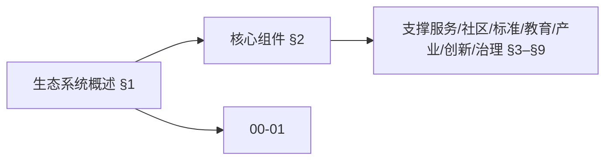
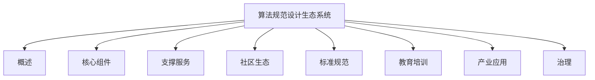
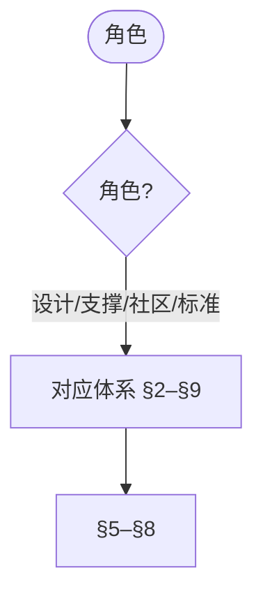
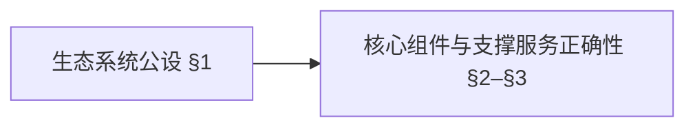
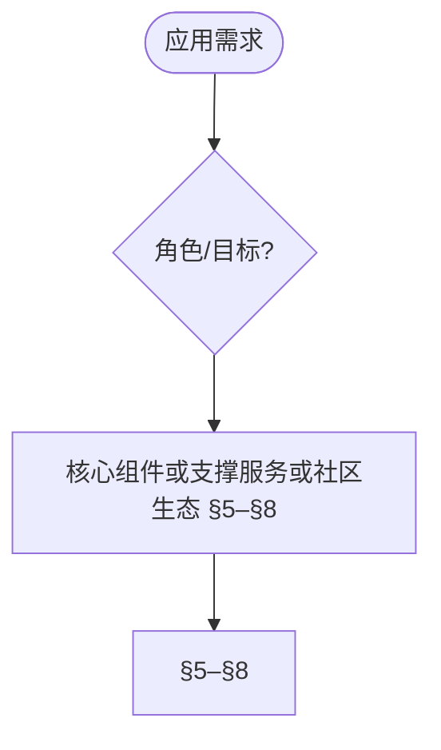

# 算法规范设计生态系统 (Algorithm Specification Design Ecosystem)

> 📊 **项目全面梳理**：详细的项目结构、模块详解和学习路径，请参阅 [`项目全面梳理-2025.md`](../项目全面梳理-2025.md)
> 导航：`docs/00-算法规范设计框架/01-算法规范设计核心框架.md` · `docs/00-算法规范设计框架/02-算法规范设计实践指南.md` · `docs/跨文档索引.md`
> **项目导航与对标**：[项目扩展与持续推进任务编排](../项目扩展与持续推进任务编排.md)、[国际课程对标表](../国际课程对标表.md)

## 目录 (Table of Contents)

- [算法规范设计生态系统 (Algorithm Specification Design Ecosystem)](#算法规范设计生态系统-algorithm-specification-design-ecosystem)
  - [目录 (Table of Contents)](#目录-table-of-contents)
  - [1. 生态系统概述 (Ecosystem Overview)](#1-生态系统概述-ecosystem-overview)
    - [1.1 生态系统目标 (Ecosystem Objectives)](#11-生态系统目标-ecosystem-objectives)
    - [1.2 生态系统架构 (Ecosystem Architecture)](#12-生态系统架构-ecosystem-architecture)
    - [1.3 生态系统特点 (Ecosystem Characteristics)](#13-生态系统特点-ecosystem-characteristics)
  - [2. 核心组件体系 (Core Component System)](#2-核心组件体系-core-component-system)
    - [2.1 规范设计组件 (Specification Design Components)](#21-规范设计组件-specification-design-components)
    - [2.2 模型设计组件 (Model Design Components)](#22-模型设计组件-model-design-components)
    - [2.3 质量保证组件 (Quality Assurance Components)](#23-质量保证组件-quality-assurance-components)
  - [3. 支撑服务体系 (Support Service System)](#3-支撑服务体系-support-service-system)
    - [3.1 知识服务 (Knowledge Services)](#31-知识服务-knowledge-services)
    - [3.2 工具服务 (Tool Services)](#32-工具服务-tool-services)
    - [3.3 平台服务 (Platform Services)](#33-平台服务-platform-services)
  - [4. 社区生态体系 (Community Ecosystem)](#4-社区生态体系-community-ecosystem)
    - [4.1 开发者社区 (Developer Community)](#41-开发者社区-developer-community)
    - [4.2 用户社区 (User Community)](#42-用户社区-user-community)
    - [4.3 专家社区 (Expert Community)](#43-专家社区-expert-community)
  - [5. 标准规范体系 (Standards and Specifications System)](#5-标准规范体系-standards-and-specifications-system)
    - [5.1 技术标准 (Technical Standards)](#51-技术标准-technical-standards)
    - [5.2 行业标准 (Industry Standards)](#52-行业标准-industry-standards)
    - [5.3 国际标准 (International Standards)](#53-国际标准-international-standards)
  - [6. 教育培训体系 (Education and Training System)](#6-教育培训体系-education-and-training-system)
    - [6.1 教育体系 (Education System)](#61-教育体系-education-system)
    - [6.2 培训体系 (Training System)](#62-培训体系-training-system)
    - [6.3 认证体系 (Certification System)](#63-认证体系-certification-system)
  - [7. 产业应用体系 (Industrial Application System)](#7-产业应用体系-industrial-application-system)
    - [7.1 应用领域 (Application Domains)](#71-应用领域-application-domains)
    - [7.2 应用模式 (Application Patterns)](#72-应用模式-application-patterns)
    - [7.3 应用案例 (Application Cases)](#73-应用案例-application-cases)
  - [8. 创新研发体系 (Innovation and R\&D System)](#8-创新研发体系-innovation-and-rd-system)
    - [8.1 研发组织 (R\&D Organizations)](#81-研发组织-rd-organizations)
    - [8.2 研发项目 (R\&D Projects)](#82-研发项目-rd-projects)
    - [8.3 研发成果 (R\&D Results)](#83-研发成果-rd-results)
  - [9. 生态系统治理 (Ecosystem Governance)](#9-生态系统治理-ecosystem-governance)
    - [9.1 治理结构 (Governance Structure)](#91-治理结构-governance-structure)
    - [9.2 治理机制 (Governance Mechanisms)](#92-治理机制-governance-mechanisms)
    - [9.3 治理流程 (Governance Processes)](#93-治理流程-governance-processes)
  - [10. 参考文献 (References)](#10-参考文献-references)
    - [10.1 生态系统文献 (Ecosystem Literature)](#101-生态系统文献-ecosystem-literature)
    - [10.2 标准规范文献 (Standards and Specifications Literature)](#102-标准规范文献-standards-and-specifications-literature)
    - [10.3 教育培训文献 (Education and Training Literature)](#103-教育培训文献-education-and-training-literature)
    - [10.4 产业应用文献 (Industrial Application Literature)](#104-产业应用文献-industrial-application-literature)

---

## 1. 生态系统概述 (Ecosystem Overview)

算法规范设计生态系统借鉴商业生态系统与标准规范体系 [Moore1996][ISO25010]。

### 1.1 生态系统目标 (Ecosystem Objectives)

**算法规范设计生态系统**旨在构建一个完整的、可持续发展的算法规范设计生态环境。

**主要目标**：

1. **构建完整生态 (Build Complete Ecosystem)**
   - 建立完整的生态系统架构
   - 提供全面的服务和支持
   - 促进生态系统的可持续发展

2. **促进协同发展 (Promote Collaborative Development)**
   - 促进各组件间的协同工作
   - 支持跨领域的合作创新
   - 建立共赢的合作机制

3. **推动标准化 (Promote Standardization)**
   - 推动算法规范的标准化
   - 建立行业标准体系
   - 促进国际标准对接

4. **支持产业化 (Support Industrialization)**
   - 支持算法规范的产业化应用
   - 促进技术成果转化
   - 推动产业发展

### 1.2 生态系统架构 (Ecosystem Architecture)

**算法规范设计生态系统**采用分层架构设计：

```text
算法规范设计生态系统
├── 核心组件体系
│   ├── 规范设计组件
│   ├── 模型设计组件
│   └── 质量保证组件
├── 支撑服务体系
│   ├── 知识服务
│   ├── 工具服务
│   └── 平台服务
├── 社区生态体系
│   ├── 开发者社区
│   ├── 用户社区
│   └── 专家社区
├── 标准规范体系
│   ├── 技术标准
│   ├── 行业标准
│   └── 国际标准
├── 教育培训体系
│   ├── 教育体系
│   ├── 培训体系
│   └── 认证体系
├── 产业应用体系
│   ├── 应用领域
│   ├── 应用模式
│   └── 应用案例
├── 创新研发体系
│   ├── 研发组织
│   ├── 研发项目
│   └── 研发成果
└── 生态系统治理
    ├── 治理结构
    ├── 治理机制
    └── 治理流程
```

### 1.3 生态系统特点 (Ecosystem Characteristics)

**算法规范设计生态系统**具有以下特点：

1. **完整性 (Completeness)**
   - 覆盖算法规范设计的各个方面
   - 提供完整的服务和支持
   - 形成完整的生态闭环

2. **开放性 (Openness)**
   - 开放的技术架构
   - 开放的社区参与
   - 开放的标准化过程

3. **协同性 (Collaboration)**
   - 各组件协同工作
   - 跨领域合作创新
   - 多方共赢机制

4. **可持续性 (Sustainability)**
   - 可持续的发展模式
   - 可持续的治理机制
   - 可持续的创新动力

### 内容补充与思维表征 / Content Supplement and Thinking Representation

> 本节按 [内容补充与思维表征全面计划方案](../内容补充与思维表征全面计划方案.md) **只补充、不删除**。标准见 [内容补充标准](../内容补充标准-概念定义属性关系解释论证形式证明.md)、[思维表征模板集](../思维表征模板集.md)。

#### 解释与直观 / Explanation and Intuition

算法规范设计生态系统将生态系统概述与核心组件、支撑服务、社区生态、标准规范、教育培训、产业应用、创新研发、生态系统治理结合。与 00-01 核心框架衔接；§1 概述、§2–§9 组件/服务/社区/标准/教育/产业/创新/治理形成完整表征。

#### 概念属性表 / Concept Attribute Table

| 属性名 | 类型/范围 | 含义 | 备注 |
|--------|-----------|------|------|
| 生态系统概述 | 基本概念 | §1 | 与 00-01 对照 |
| 核心组件、支撑服务、社区生态、标准规范、教育培训、产业应用、创新研发、生态系统治理 | 组件/服务/生态 | 开放性、协同性、可持续性 | §2–§9 |
| 核心组件/支撑服务/社区生态 | 对比 | §2–§4 | 多维矩阵 |

#### 概念关系 / Concept Relations

| 源概念 | 目标概念 | 关系类型 | 说明 |
|--------|----------|----------|------|
| 算法规范设计生态系统 | 00-01 | depends_on | 核心框架 |
| 算法规范设计生态系统 | 01–12 各模块 | applies_to | 生态实践 |

#### 概念依赖图 / Concept Dependency Graph



#### 论证与证明衔接 / Argumentation and Proof Link

生态系统治理见 §9；与 00-01 论证衔接；核心组件与支撑服务正确性见 §2–§3。

#### 思维导图：本章概念结构 / Mind Map



#### 多维矩阵：生态组件对比 / Multi-Dimensional Comparison

| 概念/组件 | 开放性 | 协同性 | 可持续性 | 备注 |
|-----------|--------|--------|----------|------|
| 核心组件/支撑服务/社区生态 | §2–§4 | §2–§4 | §2–§4 | — |

#### 决策树：角色到体系选择 / Decision Tree



#### 公理定理推理证明决策树 / Axiom-Theorem-Proof Tree



#### 应用决策建模树 / Application Decision Modeling Tree



## 2. 核心组件体系 (Core Component System)

### 2.1 规范设计组件 (Specification Design Components)

**规范设计组件**是生态系统的核心组件，提供算法规范设计的基础功能。

**组件类型**：

1. **规范定义组件 (Specification Definition Components)**
   - 规范语言定义
   - 规范模板定义
   - 规范标准定义

2. **规范构建组件 (Specification Construction Components)**
   - 规范编辑器
   - 规范生成器
   - 规范验证器

3. **规范管理组件 (Specification Management Components)**
   - 规范版本管理
   - 规范变更管理
   - 规范发布管理

**组件架构**：

```mathematical
规范设计组件 = {
    规范定义组件: SpecificationDefinitionComponents,
    规范构建组件: SpecificationConstructionComponents,
    规范管理组件: SpecificationManagementComponents
}

SpecificationDefinitionComponents = {
    规范语言定义: SpecificationLanguageDefinition,
    规范模板定义: SpecificationTemplateDefinition,
    规范标准定义: SpecificationStandardDefinition
}
```

### 2.2 模型设计组件 (Model Design Components)

**模型设计组件**提供算法模型设计的功能支持。

**组件类型**：

1. **模型抽象组件 (Model Abstraction Components)**
   - 抽象层次管理
   - 抽象方法库
   - 抽象验证器

2. **模型构建组件 (Model Construction Components)**
   - 模型构建器
   - 模型组合器
   - 模型优化器

3. **模型验证组件 (Model Validation Components)**
   - 形式化验证器
   - 实验验证器
   - 专家验证器

**组件架构**：

```mathematical
模型设计组件 = {
    模型抽象组件: ModelAbstractionComponents,
    模型构建组件: ModelConstructionComponents,
    模型验证组件: ModelValidationComponents
}

ModelAbstractionComponents = {
    抽象层次管理: AbstractionLevelManagement,
    抽象方法库: AbstractionMethodLibrary,
    抽象验证器: AbstractionValidator
}
```

### 2.3 质量保证组件 (Quality Assurance Components)

**质量保证组件**提供质量管理和保证的功能支持。

**组件类型**：

1. **质量评估组件 (Quality Assessment Components)**
   - 质量指标计算
   - 质量评估引擎
   - 质量报告生成

2. **质量改进组件 (Quality Improvement Components)**
   - 问题识别器
   - 改进建议器
   - 改进跟踪器

3. **质量监控组件 (Quality Monitoring Components)**
   - 质量监控器
   - 质量预警器
   - 质量仪表板

**组件架构**：

```mathematical
质量保证组件 = {
    质量评估组件: QualityAssessmentComponents,
    质量改进组件: QualityImprovementComponents,
    质量监控组件: QualityMonitoringComponents
}

QualityAssessmentComponents = {
    质量指标计算: QualityMetricCalculation,
    质量评估引擎: QualityAssessmentEngine,
    质量报告生成: QualityReportGeneration
}
```

## 3. 支撑服务体系 (Support Service System)

### 3.1 知识服务 (Knowledge Services)

**知识服务**提供算法规范设计相关的知识支持。

**服务类型**：

1. **知识库服务 (Knowledge Base Services)**
   - 规范知识库
   - 模型知识库
   - 最佳实践知识库

2. **知识检索服务 (Knowledge Retrieval Services)**
   - 语义检索
   - 智能推荐
   - 知识发现

3. **知识更新服务 (Knowledge Update Services)**
   - 知识版本管理
   - 知识同步更新
   - 知识质量保证

**服务架构**：

```mathematical
知识服务 = {
    知识库服务: KnowledgeBaseServices,
    知识检索服务: KnowledgeRetrievalServices,
    知识更新服务: KnowledgeUpdateServices
}

KnowledgeBaseServices = {
    规范知识库: SpecificationKnowledgeBase,
    模型知识库: ModelKnowledgeBase,
    最佳实践知识库: BestPracticeKnowledgeBase
}
```

### 3.2 工具服务 (Tool Services)

**工具服务**提供算法规范设计相关的工具支持。

**服务类型**：

1. **设计工具服务 (Design Tool Services)**
   - 规范设计工具
   - 模型设计工具
   - 质量评估工具

2. **协作工具服务 (Collaboration Tool Services)**
   - 版本控制工具
   - 协作平台
   - 评审工具

3. **集成工具服务 (Integration Tool Services)**
   - API集成服务
   - 数据集成服务
   - 系统集成服务

**服务架构**：

```mathematical
工具服务 = {
    设计工具服务: DesignToolServices,
    协作工具服务: CollaborationToolServices,
    集成工具服务: IntegrationToolServices
}

DesignToolServices = {
    规范设计工具: SpecificationDesignTools,
    模型设计工具: ModelDesignTools,
    质量评估工具: QualityAssessmentTools
}
```

### 3.3 平台服务 (Platform Services)

**平台服务**提供算法规范设计的平台支持。

**服务类型**：

1. **开发平台服务 (Development Platform Services)**
   - 开发环境
   - 测试环境
   - 部署环境

2. **运行平台服务 (Runtime Platform Services)**
   - 执行引擎
   - 监控服务
   - 日志服务

3. **管理平台服务 (Management Platform Services)**
   - 用户管理
   - 权限管理
   - 配置管理

**服务架构**：

```mathematical
平台服务 = {
    开发平台服务: DevelopmentPlatformServices,
    运行平台服务: RuntimePlatformServices,
    管理平台服务: ManagementPlatformServices
}

DevelopmentPlatformServices = {
    开发环境: DevelopmentEnvironment,
    测试环境: TestingEnvironment,
    部署环境: DeploymentEnvironment
}
```

## 4. 社区生态体系 (Community Ecosystem)

### 4.1 开发者社区 (Developer Community)

**开发者社区**是生态系统的重要组成部分，提供技术交流和协作平台。

**社区功能**：

1. **技术交流 (Technical Communication)**
   - 技术讨论
   - 经验分享
   - 问题解答

2. **协作开发 (Collaborative Development)**
   - 开源项目
   - 代码贡献
   - 技术评审

3. **知识分享 (Knowledge Sharing)**
   - 技术博客
   - 教程文档
   - 最佳实践

**社区架构**：

```mathematical
开发者社区 = {
    技术交流: TechnicalCommunication,
    协作开发: CollaborativeDevelopment,
    知识分享: KnowledgeSharing
}

TechnicalCommunication = {
    技术讨论: TechnicalDiscussion,
    经验分享: ExperienceSharing,
    问题解答: ProblemSolving
}
```

### 4.2 用户社区 (User Community)

**用户社区**为算法规范设计的用户提供支持和交流平台。

**社区功能**：

1. **用户支持 (User Support)**
   - 使用指导
   - 问题反馈
   - 技术支持

2. **需求收集 (Requirement Collection)**
   - 需求调研
   - 用户反馈
   - 功能建议

3. **用户培训 (User Training)**
   - 在线培训
   - 用户手册
   - 视频教程

**社区架构**：

```mathematical
用户社区 = {
    用户支持: UserSupport,
    需求收集: RequirementCollection,
    用户培训: UserTraining
}

UserSupport = {
    使用指导: UsageGuidance,
    问题反馈: ProblemFeedback,
    技术支持: TechnicalSupport
}
```

### 4.3 专家社区 (Expert Community)

**专家社区**汇聚算法规范设计领域的专家，提供专业指导。

**社区功能**：

1. **专业指导 (Professional Guidance)**
   - 技术咨询
   - 架构设计
   - 质量评估

2. **标准制定 (Standard Development)**
   - 标准起草
   - 标准评审
   - 标准推广

3. **人才培养 (Talent Development)**
   - 导师制度
   - 专业培训
   - 能力认证

**社区架构**：

```mathematical
专家社区 = {
    专业指导: ProfessionalGuidance,
    标准制定: StandardDevelopment,
    人才培养: TalentDevelopment
}

ProfessionalGuidance = {
    技术咨询: TechnicalConsulting,
    架构设计: ArchitectureDesign,
    质量评估: QualityAssessment
}
```

## 5. 标准规范体系 (Standards and Specifications System)

### 5.1 技术标准 (Technical Standards)

**技术标准**定义算法规范设计的技术规范和要求。

**标准类型**：

1. **规范语言标准 (Specification Language Standards)**
   - 语法标准
   - 语义标准
   - 工具标准

2. **模型设计标准 (Model Design Standards)**
   - 抽象标准
   - 构建标准
   - 验证标准

3. **质量保证标准 (Quality Assurance Standards)**
   - 质量标准
   - 评估标准
   - 改进标准

**标准架构**：

```mathematical
技术标准 = {
    规范语言标准: SpecificationLanguageStandards,
    模型设计标准: ModelDesignStandards,
    质量保证标准: QualityAssuranceStandards
}

SpecificationLanguageStandards = {
    语法标准: SyntaxStandards,
    语义标准: SemanticStandards,
    工具标准: ToolStandards
}
```

### 5.2 行业标准 (Industry Standards)

**行业标准**定义特定行业的算法规范设计标准。

**标准类型**：

1. **金融行业标准 (Financial Industry Standards)**
   - 金融算法规范
   - 风险控制标准
   - 合规要求标准

2. **医疗行业标准 (Healthcare Industry Standards)**
   - 医疗算法规范
   - 数据安全标准
   - 隐私保护标准

3. **制造业标准 (Manufacturing Industry Standards)**
   - 制造算法规范
   - 质量控制标准
   - 效率优化标准

**标准架构**：

```mathematical
行业标准 = {
    金融行业标准: FinancialIndustryStandards,
    医疗行业标准: HealthcareIndustryStandards,
    制造业标准: ManufacturingIndustryStandards
}

FinancialIndustryStandards = {
    金融算法规范: FinancialAlgorithmSpecifications,
    风险控制标准: RiskControlStandards,
    合规要求标准: ComplianceRequirementStandards
}
```

### 5.3 国际标准 (International Standards)

**国际标准**对接国际算法规范设计标准。

**标准类型**：

1. **ISO标准 (ISO Standards)**
   - ISO/IEC 25010软件质量模型
   - ISO/IEC 12207软件生命周期过程
   - ISO/IEC 15504软件过程评估

2. **IEEE标准 (IEEE Standards)**
   - IEEE 830软件需求规范
   - IEEE 1012软件验证和确认
   - IEEE 1061软件质量度量

3. **ACM标准 (ACM Standards)**
   - ACM/IEEE CC2020计算课程
   - ACM软件工程知识体系
   - ACM算法设计标准

**标准架构**：

```mathematical
国际标准 = {
    ISO标准: ISOStandards,
    IEEE标准: IEEEStandards,
    ACM标准: ACMStandards
}

ISOStandards = {
    ISO25010: ISO25010SoftwareQualityModel,
    ISO12207: ISO12207SoftwareLifeCycleProcesses,
    ISO15504: ISO15504SoftwareProcessAssessment
}
```

## 6. 教育培训体系 (Education and Training System)

### 6.1 教育体系 (Education System)

**教育体系**提供算法规范设计的系统教育。

**教育层次**：

1. **基础教育 (Basic Education)**
   - 算法基础
   - 规范设计基础
   - 模型设计基础

2. **专业教育 (Professional Education)**
   - 算法规范设计专业
   - 模型设计专业
   - 质量保证专业

3. **高级教育 (Advanced Education)**
   - 算法规范设计硕士
   - 模型设计博士
   - 质量保证专家

**教育架构**：

```mathematical
教育体系 = {
    基础教育: BasicEducation,
    专业教育: ProfessionalEducation,
    高级教育: AdvancedEducation
}

BasicEducation = {
    算法基础: AlgorithmBasics,
    规范设计基础: SpecificationDesignBasics,
    模型设计基础: ModelDesignBasics
}
```

### 6.2 培训体系 (Training System)

**培训体系**提供算法规范设计的专业培训。

**培训类型**：

1. **基础培训 (Basic Training)**
   - 入门培训
   - 技能培训
   - 工具培训

2. **专业培训 (Professional Training)**
   - 规范设计培训
   - 模型设计培训
   - 质量保证培训

3. **高级培训 (Advanced Training)**
   - 专家培训
   - 管理培训
   - 创新培训

**培训架构**：

```mathematical
培训体系 = {
    基础培训: BasicTraining,
    专业培训: ProfessionalTraining,
    高级培训: AdvancedTraining
}

BasicTraining = {
    入门培训: IntroductoryTraining,
    技能培训: SkillTraining,
    工具培训: ToolTraining
}
```

### 6.3 认证体系 (Certification System)

**认证体系**提供算法规范设计的专业认证。

**认证类型**：

1. **技能认证 (Skill Certification)**
   - 规范设计技能认证
   - 模型设计技能认证
   - 质量保证技能认证

2. **专业认证 (Professional Certification)**
   - 算法规范设计师认证
   - 模型设计师认证
   - 质量保证专家认证

3. **机构认证 (Organization Certification)**
   - 培训机构认证
   - 认证机构认证
   - 标准机构认证

**认证架构**：

```mathematical
认证体系 = {
    技能认证: SkillCertification,
    专业认证: ProfessionalCertification,
    机构认证: OrganizationCertification
}

SkillCertification = {
    规范设计技能认证: SpecificationDesignSkillCertification,
    模型设计技能认证: ModelDesignSkillCertification,
    质量保证技能认证: QualityAssuranceSkillCertification
}
```

## 7. 产业应用体系 (Industrial Application System)

### 7.1 应用领域 (Application Domains)

**应用领域**定义算法规范设计的应用范围。

**领域类型**：

1. **传统应用领域 (Traditional Application Domains)**
   - 金融科技
   - 医疗健康
   - 智能制造

2. **新兴应用领域 (Emerging Application Domains)**
   - 人工智能
   - 区块链
   - 物联网

3. **前沿应用领域 (Frontier Application Domains)**
   - 量子计算
   - 边缘计算
   - 脑机接口

**领域架构**：

```mathematical
应用领域 = {
    传统应用领域: TraditionalApplicationDomains,
    新兴应用领域: EmergingApplicationDomains,
    前沿应用领域: FrontierApplicationDomains
}

TraditionalApplicationDomains = {
    金融科技: FinTech,
    医疗健康: Healthcare,
    智能制造: SmartManufacturing
}
```

### 7.2 应用模式 (Application Patterns)

**应用模式**定义算法规范设计的应用模式。

**模式类型**：

1. **标准化应用模式 (Standardized Application Patterns)**
   - 标准规范应用
   - 标准模型应用
   - 标准质量应用

2. **定制化应用模式 (Customized Application Patterns)**
   - 定制规范应用
   - 定制模型应用
   - 定制质量应用

3. **创新应用模式 (Innovative Application Patterns)**
   - 创新规范应用
   - 创新模型应用
   - 创新质量应用

**模式架构**：

```mathematical
应用模式 = {
    标准化应用模式: StandardizedApplicationPatterns,
    定制化应用模式: CustomizedApplicationPatterns,
    创新应用模式: InnovativeApplicationPatterns
}

StandardizedApplicationPatterns = {
    标准规范应用: StandardSpecificationApplication,
    标准模型应用: StandardModelApplication,
    标准质量应用: StandardQualityApplication
}
```

### 7.3 应用案例 (Application Cases)

**应用案例**提供算法规范设计的实际应用案例。

**案例类型**：

1. **成功案例 (Success Cases)**
   - 金融算法规范案例
   - 医疗算法规范案例
   - 制造算法规范案例

2. **创新案例 (Innovation Cases)**
   - AI算法规范案例
   - 区块链算法规范案例
   - 量子算法规范案例

3. **最佳实践案例 (Best Practice Cases)**
   - 规范设计最佳实践
   - 模型设计最佳实践
   - 质量保证最佳实践

**案例架构**：

```mathematical
应用案例 = {
    成功案例: SuccessCases,
    创新案例: InnovationCases,
    最佳实践案例: BestPracticeCases
}

SuccessCases = {
    金融算法规范案例: FinancialAlgorithmSpecificationCases,
    医疗算法规范案例: HealthcareAlgorithmSpecificationCases,
    制造算法规范案例: ManufacturingAlgorithmSpecificationCases
}
```

## 8. 创新研发体系 (Innovation and R&D System)

### 8.1 研发组织 (R&D Organizations)

**研发组织**是生态系统创新研发的主体。

**组织类型**：

1. **学术研究组织 (Academic Research Organizations)**
   - 大学研究机构
   - 科研院所
   - 实验室

2. **企业研发组织 (Corporate R&D Organizations)**
   - 企业研究院
   - 技术中心
   - 创新实验室

3. **合作研发组织 (Collaborative R&D Organizations)**
   - 产学研合作
   - 国际合作
   - 联盟组织

**组织架构**：

```mathematical
研发组织 = {
    学术研究组织: AcademicResearchOrganizations,
    企业研发组织: CorporateRDOrganizations,
    合作研发组织: CollaborativeRDOrganizations
}

AcademicResearchOrganizations = {
    大学研究机构: UniversityResearchInstitutions,
    科研院所: ResearchInstitutes,
    实验室: Laboratories
}
```

### 8.2 研发项目 (R&D Projects)

**研发项目**是生态系统创新研发的具体载体。

**项目类型**：

1. **基础研究项目 (Basic Research Projects)**
   - 理论创新项目
   - 方法创新项目
   - 技术创新项目

2. **应用研究项目 (Applied Research Projects)**
   - 应用创新项目
   - 产品创新项目
   - 服务创新项目

3. **产业化项目 (Industrialization Projects)**
   - 技术转化项目
   - 产业化项目
   - 商业化项目

**项目架构**：

```mathematical
研发项目 = {
    基础研究项目: BasicResearchProjects,
    应用研究项目: AppliedResearchProjects,
    产业化项目: IndustrializationProjects
}

BasicResearchProjects = {
    理论创新项目: TheoreticalInnovationProjects,
    方法创新项目: MethodInnovationProjects,
    技术创新项目: TechnicalInnovationProjects
}
```

### 8.3 研发成果 (R&D Results)

**研发成果**是生态系统创新研发的产出。

**成果类型**：

1. **理论成果 (Theoretical Results)**
   - 理论创新
   - 方法创新
   - 模型创新

2. **技术成果 (Technical Results)**
   - 技术创新
   - 产品创新
   - 服务创新

3. **应用成果 (Application Results)**
   - 应用创新
   - 产业化成果
   - 商业化成果

**成果架构**：

```mathematical
研发成果 = {
    理论成果: TheoreticalResults,
    技术成果: TechnicalResults,
    应用成果: ApplicationResults
}

TheoreticalResults = {
    理论创新: TheoreticalInnovation,
    方法创新: MethodInnovation,
    模型创新: ModelInnovation
}
```

## 9. 生态系统治理 (Ecosystem Governance)

### 9.1 治理结构 (Governance Structure)

**治理结构**定义生态系统的治理组织架构。

**结构层次**：

1. **战略层 (Strategic Level)**
   - 生态系统委员会
   - 战略规划组
   - 政策制定组

2. **管理层 (Management Level)**
   - 执行委员会
   - 项目管理组
   - 运营管理组

3. **执行层 (Execution Level)**
   - 技术工作组
   - 标准工作组
   - 质量工作组

**治理架构**：

```mathematical
治理结构 = {
    战略层: StrategicLevel,
    管理层: ManagementLevel,
    执行层: ExecutionLevel
}

StrategicLevel = {
    生态系统委员会: EcosystemCommittee,
    战略规划组: StrategicPlanningGroup,
    政策制定组: PolicyMakingGroup
}
```

### 9.2 治理机制 (Governance Mechanisms)

**治理机制**定义生态系统的治理运行机制。

**机制类型**：

1. **决策机制 (Decision-Making Mechanisms)**
   - 决策流程
   - 决策规则
   - 决策监督

2. **协调机制 (Coordination Mechanisms)**
   - 协调流程
   - 协调规则
   - 协调监督

3. **监督机制 (Supervision Mechanisms)**
   - 监督流程
   - 监督规则
   - 监督评估

**机制架构**：

```mathematical
治理机制 = {
    决策机制: DecisionMakingMechanisms,
    协调机制: CoordinationMechanisms,
    监督机制: SupervisionMechanisms
}

DecisionMakingMechanisms = {
    决策流程: DecisionMakingProcess,
    决策规则: DecisionMakingRules,
    决策监督: DecisionMakingSupervision
}
```

### 9.3 治理流程 (Governance Processes)

**治理流程**定义生态系统的治理操作流程。

**流程类型**：

1. **规划流程 (Planning Processes)**
   - 战略规划
   - 年度规划
   - 项目规划

2. **执行流程 (Execution Processes)**
   - 项目执行
   - 标准执行
   - 质量执行

3. **评估流程 (Evaluation Processes)**
   - 绩效评估
   - 质量评估
   - 效果评估

**流程架构**：

```mathematical
治理流程 = {
    规划流程: PlanningProcesses,
    执行流程: ExecutionProcesses,
    评估流程: EvaluationProcesses
}

PlanningProcesses = {
    战略规划: StrategicPlanning,
    年度规划: AnnualPlanning,
    项目规划: ProjectPlanning
}
```

## 10. 参考文献 (References)

**引用规范说明 / Citation Guidelines**: 本文档遵循项目引用规范（见 [CITATION_STANDARD.md](../CITATION_STANDARD.md)、[学术引用规范-ACM对齐版.md](../学术引用规范-ACM对齐版.md)）。文内采用 [Key] 格式引用，与参考文献列表对应。

### 10.1 生态系统文献 (Ecosystem Literature)

1. [Moore1996] Moore, J. F. (1996). *The Death of Competition: Leadership and Strategy in the Age of Business Ecosystems*. HarperBusiness. ISBN: 978-0887308500
2. [Iansiti2004] Iansiti, M., & Levien, R. (2004). *The Keystone Advantage: What the New Dynamics of Business Ecosystems Mean for Strategy, Innovation, and Sustainability*. Harvard Business Review Press. ISBN: 978-1591393078
3. [Adner2012] Adner, R. (2012). *The Wide Lens: A New Strategy for Innovation*. Portfolio. ISBN: 978-1591844018

### 10.2 标准规范文献 (Standards and Specifications Literature)

1. [ISO25010] ISO/IEC 25010 (2011). "Systems and software Quality Requirements and Evaluation (SQuaRE) — System and software quality models." International Organization for Standardization.
2. [IEEE830] IEEE 830 (1998). "IEEE Recommended Practice for Software Requirements Specifications." IEEE.
3. [CC2020] ACM/IEEE (2020). "Computing Curricula 2020: Paradigms for Global Computing Education." ACM/IEEE.

### 10.3 教育培训文献 (Education and Training Literature)

1. [Bloom1956] Bloom, B. S. (1956). *Taxonomy of Educational Objectives: The Classification of Educational Goals*. Longmans, Green. ISBN: 978-0582280106
2. [Kirkpatrick1994] Kirkpatrick, D. L. (1994). *Evaluating Training Programs: The Four Levels*. Berrett-Koehler Publishers. ISBN: 978-1576753484
3. [Knowles1984] Knowles, M. S. (1984). *The Adult Learner: A Neglected Species* (3rd ed.). Gulf Publishing. ISBN: 978-0884151158

### 10.4 产业应用文献 (Industrial Application Literature)

1. [Porter1985] Porter, M. E. (1985). *Competitive Advantage: Creating and Sustaining Superior Performance*. Free Press. ISBN: 978-0684841465
2. [Christensen1997] Christensen, C. M. (1997). *The Innovator's Dilemma: When New Technologies Cause Great Firms to Fail*. Harvard Business Review Press. ISBN: 978-0875845852
3. [Chesbrough2003] Chesbrough, H. (2003). *Open Innovation: The New Imperative for Creating and Profiting from Technology*. Harvard Business Review Press. ISBN: 978-1578518371

---

**文档版本**: v1.1
**最后更新**: 2025-02-02
**维护者**: 算法规范设计团队
**状态**: 已补充学术引用与文内引用 (P1)
