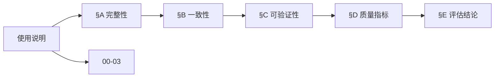
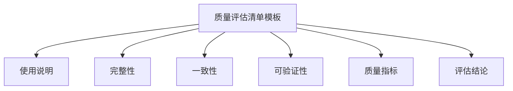
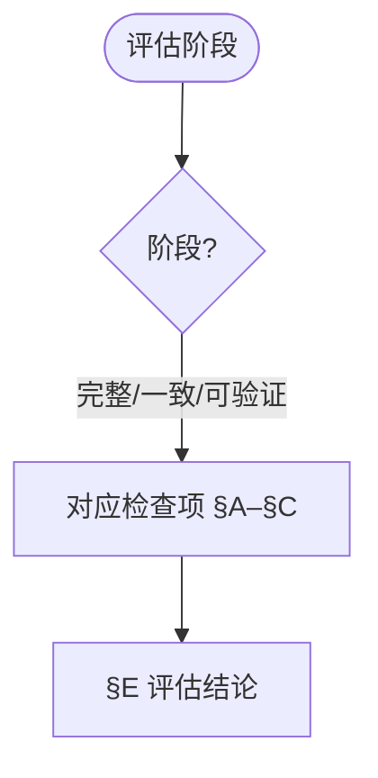
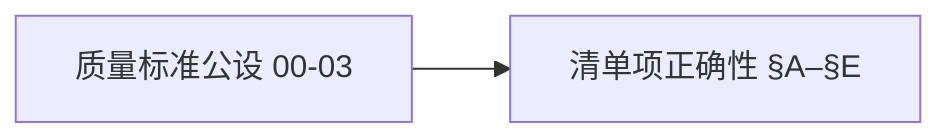
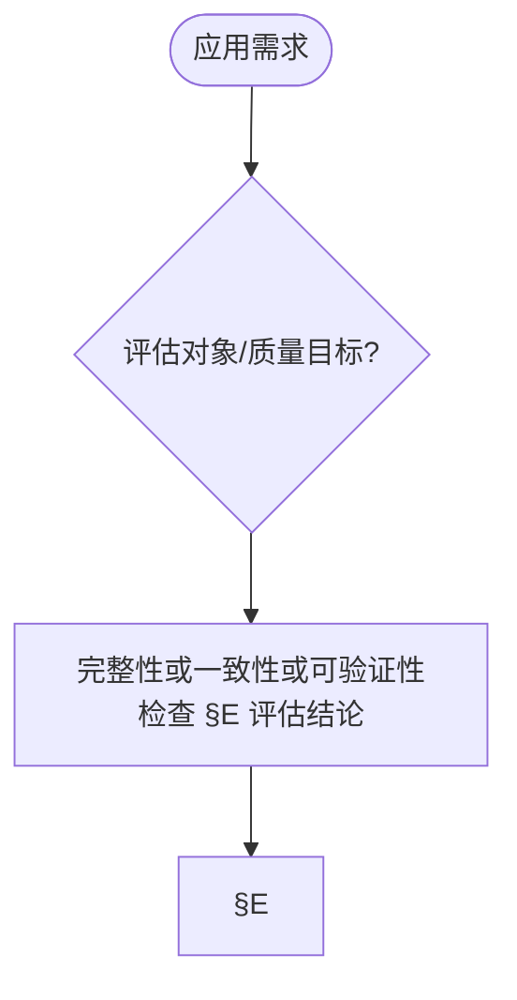

# 质量评估清单模板（Quality Assessment Checklist Template）

> 📊 **项目全面梳理**：详细的项目结构、模块详解和学习路径，请参阅 [`项目全面梳理-2025.md`](../项目全面梳理-2025.md)
> 导航：`docs/00-算法规范设计框架/02-算法规范设计实践指南.md` · `docs/00-算法规范设计框架/03-算法规范质量标准体系.md`
> **项目导航与对标**：[项目扩展与持续推进任务编排](../项目扩展与持续推进任务编排.md)、[国际课程对标表](../国际课程对标表.md)

## 使用说明

本模板依据项目规范质量标准体系与国际质量模型设计 [ISO25010][IEEE830]。用途：用于评估算法规范与模型设计产物的质量是否达标。

- 适用范围：规范文档、模型设计文档、评审记录、变更记录。
- 方法：逐项打分与说明，计算总分并给出结论与整改项。

### 内容补充与思维表征 / Content Supplement and Thinking Representation（轻量）

> 本节按 [内容补充与思维表征全面计划方案](../内容补充与思维表征全面计划方案.md) **只补充、不删除**；清单类文档做轻量补充。标准见 [内容补充标准](../内容补充标准-概念定义属性关系解释论证形式证明.md)、[思维表征模板集](../思维表征模板集.md)。

#### 解释与直观 / Explanation and Intuition

质量评估清单模板依据 00-03 规范质量标准体系，与完整性、一致性、可验证性维度对齐，支撑 00-07 规范评审清单。§使用说明、§A–§E 形成完整表征。

#### 概念属性表 / Concept Attribute Table

| 属性名 | 类型/范围 | 含义 | 备注 |
|--------|-----------|------|------|
| 使用说明 | 基本概念 | §使用说明 | 与 00-03、00-07 对照 |
| 完整性/一致性/可验证性/质量指标/评估结论 | 清单项 | 评分维度、达标要求 | §A–§E |
| 完整性/一致性/可验证性 | 对比 | §A–§C | 多维矩阵 |

#### 概念关系 / Concept Relations

| 源概念 | 目标概念 | 关系类型 | 说明 |
|--------|----------|----------|------|
| 质量评估清单模板 | 00-03 | depends_on | 质量标准体系 |
| 质量评估清单模板 | 00-07 | applies_to | 质量实践 |

#### 概念依赖图 / Concept Dependency Graph

#### 论证与证明衔接 / Argumentation and Proof Link

与 ISO25010、IEEE830 对齐见 §使用说明；清单项正确性见 §A–§E；质量标准公设见 00-03。

#### 思维导图：本章概念结构 / Mind Map

#### 多维矩阵：评估维度对比 / Multi-Dimensional Comparison

| 概念/维度 | 评分维度 | 达标要求 | 备注 |
|-----------|----------|----------|------|
| 完整性/一致性/可验证性 | §A–§C | §A–§C | — |

#### 决策树：评估阶段到检查项选择 / Decision Tree

#### 公理定理推理证明决策树 / Axiom-Theorem-Proof Tree

#### 应用决策建模树 / Application Decision Modeling Tree

## 元数据

- 项目/规范名称：
- 评估版本/日期：
- 评估人/角色：
- 评估对象链接：

## A. 完整性（Completeness）

- 功能覆盖率 ≥ 100%： [是/否] 说明：
- 输入输出定义完备： [是/否] 说明：
- 异常与边界处理完备： [是/否] 说明：
- 模块与接口定义完备： [是/否] 说明：
- 文档内容/格式/引用完备： [是/否] 说明：

评分（0-5）：  合计：

## B. 一致性（Consistency）

- 逻辑一致（定义/约束/规则一致）： [是/否] 说明：
- 术语一致（与术语表对齐）： [是/否] 说明：
- 表示一致（图/式/表/代码风格一致）： [是/否] 说明：
- 外部一致（对标标准/最佳实践）： [是/否] 说明：
- 版本一致（跨版本兼容/变更一致）： [是/否] 说明：

评分（0-5）：  合计：

## C. 可验证性（Verifiability）

- 可测试性（用例可设计/结果可验证）： [是/否] 说明：
- 可追溯性（需求-设计-实现-验证链路）： [是/否] 说明：
- 可审计性（过程/决策/质量可审计）： [是/否] 说明：

评分（0-5）：  合计：

## D. 质量指标（Metrics）

- 功能覆盖率： % 说明：
- 文档覆盖率： % 说明：
- 缺陷密度： /页 或 /KLOC 说明：
- 评审问题关闭率： % 说明：

## E. 评估结论与整改

- 综合评分（A+B+C）： /15
- 结论：通过 / 有条件通过 / 不通过
- 必须整改项：
  1)
  2)
  3)
- 建议改进项：
  1)
  2)
  3)

## 参考文献 / References

**引用规范说明**: 本文档遵循项目引用规范（见 [CITATION_STANDARD.md](../CITATION_STANDARD.md)、[学术引用规范-ACM对齐版.md](../学术引用规范-ACM对齐版.md)）。文内采用 [Key] 格式引用。

1. [ISO25010] ISO/IEC 25010 (2011). "Systems and software Quality Requirements and Evaluation (SQuaRE) — System and software quality models." International Organization for Standardization.
2. [IEEE830] IEEE 830 (1998). "IEEE Recommended Practice for Software Requirements Specifications." IEEE.

---

文档版本：v1.1  最后更新：2025-02-02  状态：已补充学术引用 (P1)
