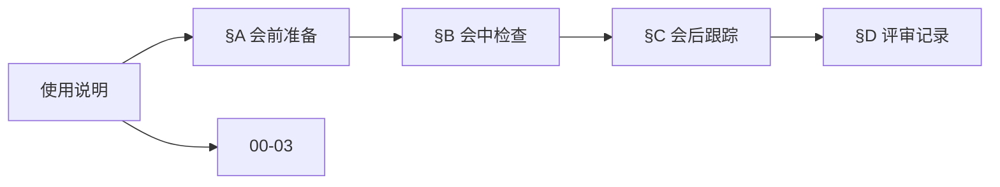
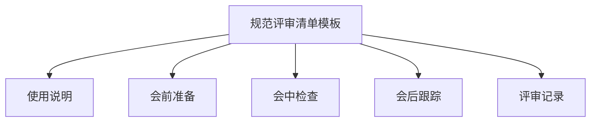
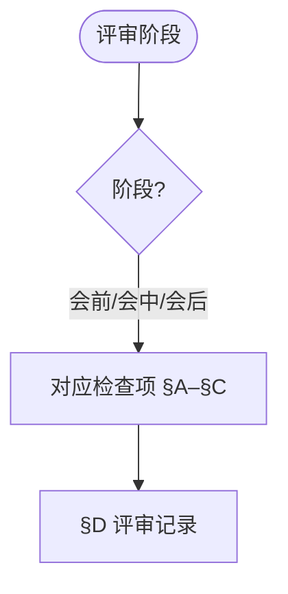
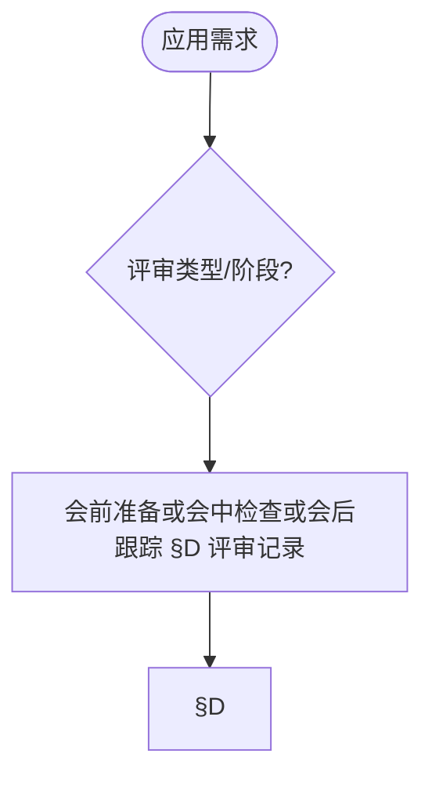

# 规范评审清单模板（Specification Review Checklist Template）

> 📊 **项目全面梳理**：详细的项目结构、模块详解和学习路径，请参阅 [`项目全面梳理-2025.md`](../项目全面梳理-2025.md)
> 导航：`docs/00-算法规范设计框架/02-算法规范设计实践指南.md` · `docs/00-算法规范设计框架/03-算法规范质量标准体系.md`
> **项目导航与对标**：[项目扩展与持续推进任务编排](../项目扩展与持续推进任务编排.md)、[国际课程对标表](../国际课程对标表.md)

## 使用说明

本模板依据软件需求规范与评审最佳实践设计 [IEEE830][Wiegers2003]。用途：组织与记录算法规范的评审活动，保证评审质量与可追溯。

- 适用范围：新规范/修订规范的评审（同行/正式/用户评审）。
- 方法：会前准备 → 会中检查 → 会后跟踪，逐项确认并记录结论。

### 内容补充与思维表征 / Content Supplement and Thinking Representation（轻量）

> 本节按 [内容补充与思维表征全面计划方案](../内容补充与思维表征全面计划方案.md) **只补充、不删除**；清单类文档做轻量补充。标准见 [内容补充标准](../内容补充标准-概念定义属性关系解释论证形式证明.md)、[思维表征模板集](../思维表征模板集.md)。

#### 解释与直观 / Explanation and Intuition

规范评审清单模板依据 IEEE830 与评审最佳实践，与 00-03 质量标准体系、00-06 质量评估清单衔接，支撑会前/会中/会后评审流程。§使用说明、§A–§D 形成完整表征。

#### 概念属性表 / Concept Attribute Table

| 属性名 | 类型/范围 | 含义 | 备注 |
|--------|-----------|------|------|
| 使用说明 | 基本概念 | §使用说明 | 与 00-03、00-06 对照 |
| 会前准备/会中检查/会后跟踪/评审记录 | 清单项 | 完整性、一致性、可验证性检查 | §A–§D |
| 会前/会中/会后 | 对比 | §A–§C | 多维矩阵 |

#### 概念关系 / Concept Relations

| 源概念 | 目标概念 | 关系类型 | 说明 |
|--------|----------|----------|------|
| 规范评审清单模板 | 00-03、00-06 | depends_on | 质量标准与评估清单 |
| 规范评审清单模板 | 00-02 实践指南 | applies_to | 评审实践 |

#### 概念依赖图 / Concept Dependency Graph

#### 论证与证明衔接 / Argumentation and Proof Link

与 IEEE830、Wiegers2003 对齐见 §使用说明；会前/会中/会后正确性见 §A–§C。

#### 思维导图：本章概念结构 / Mind Map

#### 多维矩阵：评审阶段对比 / Multi-Dimensional Comparison

| 概念/阶段 | 完整性 | 一致性 | 可验证性检查 | 备注 |
|-----------|--------|--------|--------------|------|
| 会前/会中/会后 | §A–§C | §A–§C | §A–§C | — |

#### 决策树：评审阶段到检查项选择 / Decision Tree

#### 公理定理推理证明决策树 / Axiom-Theorem-Proof Tree

#### 应用决策建模树 / Application Decision Modeling Tree

## 元数据

- 评审对象（规范名称/版本）：
- 评审类型（同行/正式/用户）：
- 评审日期与地点/会议号：
- 参会角色（负责人/作者/审阅者/记录人）：
- 关联材料（需求/设计/变更/用例链接）：

## A. 会前准备（Preparation）

- 评审计划（目标/范围/日程）已发出： [是/否] 说明：
- 资料准备（规范/参考/标准）齐全： [是/否] 说明：
- 角色确认（责任/决策/记录）清晰： [是/否] 说明：
- 评审准则（通过门槛/量化指标）明确： [是/否] 说明：

## B. 会中检查（Inspection）

- 完整性：功能/结构/文档完备： [通过/问题/不适用] 备注：
- 一致性：术语/逻辑/表示/外部/版本： [通过/问题/不适用] 备注：
- 可验证性：测试/追溯/审计： [通过/问题/不适用] 备注：
- 风险点：假设/约束/依赖/边界： [通过/问题/不适用] 备注：
- 变更影响：兼容性/迁移/成本： [通过/问题/不适用] 备注：

## C. 会后跟踪（Follow-up）

- 问题清单（编号/描述/严重度/责任人/截止）：
  1)
  2)
  3)
- 决议与结论：通过 / 有条件通过（需复核）/ 不通过
- 复核计划与节点：

## D. 评审记录（Record）

- 主要讨论要点摘要：
- 关键分歧与解决方案：
- 采纳/拒绝理由与依据：
- 附件与证据（截图/表格/链接）：

## 参考文献 / References

**引用规范说明**: 本文档遵循项目引用规范（见 [CITATION_STANDARD.md](../CITATION_STANDARD.md)、[学术引用规范-ACM对齐版.md](../学术引用规范-ACM对齐版.md)）。文内采用 [Key] 格式引用。

1. [IEEE830] IEEE 830 (1998). "IEEE Recommended Practice for Software Requirements Specifications." IEEE.
2. [Wiegers2003] Wiegers, K. (2003). *Software Requirements* (2nd ed.). Microsoft Press. ISBN: 978-0735618794

---

文档版本：v1.1  最后更新：2025-02-02  状态：已补充学术引用 (P1)
