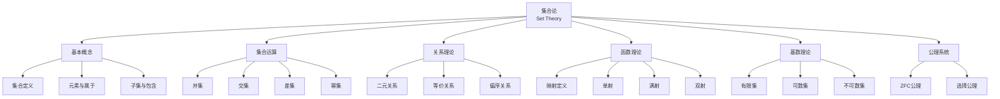

# 集合论基础 - 六维内容补充

> **模块**: 01-基础理论
> **文档**: 01-集合论基础
> **补充维度**: 概念定义、属性、关系、解释、论证、形式证明
> **对标**: MIT 6.042J / Stanford CS103 / CS2023 MSF
> **深度**: 本科高年级

---

## 思维导图：集合论核心概念结构



---

## 一、概念定义 (Concept Definition)

### 1.1 集合基本概念

**定义 1.1.1** (集合 / Set)

集合是由确定对象组成的无序整体，这些对象称为集合的元素。

$$A = \{x \mid P(x)\}$$

其中 $P(x)$ 是描述集合元素性质的谓词。

**定义 1.1.2** (属于关系 / Membership)

$x \in A$ 表示 $x$ 是集合 $A$ 的元素。

$x \notin A$ 表示 $x$ 不是集合 $A$ 的元素。

**定义 1.1.3** (空集 / Empty Set)

空集 $\emptyset$ 是不包含任何元素的集合：

$$\forall x: x \notin \emptyset$$

---

### 1.2 子集关系

**定义 1.2.1** (子集 / Subset)

$A \subseteq B$ 当且仅当 $A$ 的每个元素都属于 $B$：

$$A \subseteq B \iff \forall x (x \in A \rightarrow x \in B)$$

**定义 1.2.2** (真子集 / Proper Subset)

$A \subset B$ 当且仅当 $A \subseteq B$ 且 $A \neq B$：

$$A \subset B \iff A \subseteq B \land \exists x (x \in B \land x \notin A)$$

**定义 1.2.3** (集合相等 / Set Equality)

$$A = B \iff A \subseteq B \land B \subseteq A$$

---

### 1.3 集合运算

**定义 1.3.1** (并集 / Union)

$$A \cup B = \{x \mid x \in A \lor x \in B\}$$

**定义 1.3.2** (交集 / Intersection)

$$A \cap B = \{x \mid x \in A \land x \in B\}$$

**定义 1.3.3** (差集 / Set Difference)

$$A \setminus B = \{x \mid x \in A \land x \notin B\}$$

**定义 1.3.4** (补集 / Complement)

在全集 $U$ 下，$A$ 的补集：

$$A^c = U \setminus A = \{x \in U \mid x \notin A\}$$

**定义 1.3.5** (幂集 / Power Set)

$A$ 的幂集是 $A$ 的所有子集的集合：

$$\mathcal{P}(A) = \{B \mid B \subseteq A\}$$

---

### 1.4 关系

**定义 1.4.1** (笛卡尔积 / Cartesian Product)

$$A \times B = \{(a, b) \mid a \in A \land b \in B\}$$

**定义 1.4.2** (二元关系 / Binary Relation)

从 $A$ 到 $B$ 的二元关系 $R$ 是 $A \times B$ 的子集：

$$R \subseteq A \times B$$

**定义 1.4.3** (等价关系 / Equivalence Relation)

集合 $A$ 上的关系 $R$ 是等价关系，当且仅当满足：

1. **自反性**: $\forall a \in A: (a, a) \in R$
2. **对称性**: $\forall a, b \in A: (a, b) \in R \rightarrow (b, a) \in R$
3. **传递性**: $\forall a, b, c \in A: (a, b) \in R \land (b, c) \in R \rightarrow (a, c) \in R$

**定义 1.4.4** (偏序关系 / Partial Order)

集合 $A$ 上的关系 $\leq$ 是偏序关系，当且仅当满足：

1. **自反性**: $\forall a \in A: a \leq a$
2. **反对称性**: $\forall a, b \in A: a \leq b \land b \leq a \rightarrow a = b$
3. **传递性**: $\forall a, b, c \in A: a \leq b \land b \leq c \rightarrow a \leq c$

---

### 1.5 函数

**定义 1.5.1** (函数 / Function)

从 $A$ 到 $B$ 的函数 $f$ 是满足以下条件的二元关系 $f \subseteq A \times B$：

$$\forall a \in A: \exists! b \in B: (a, b) \in f$$

记作 $f: A \rightarrow B$，其中 $b = f(a)$。

**定义 1.5.2** (单射 / Injection)

$f: A \rightarrow B$ 是单射当且仅当：

$$\forall a_1, a_2 \in A: f(a_1) = f(a_2) \rightarrow a_1 = a_2$$

**定义 1.5.3** (满射 / Surjection)

$f: A \rightarrow B$ 是满射当且仅当：

$$\forall b \in B: \exists a \in A: f(a) = b$$

**定义 1.5.4** (双射 / Bijection)

$f$ 是双射当且仅当它既是单射又是满射。

---

### 1.6 基数

**定义 1.6.1** (基数相等 / Cardinal Equality)

集合 $A$ 和 $B$ 有相同的基数（等势），记作 $|A| = |B|$，当且仅当存在从 $A$ 到 $B$ 的双射。

**定义 1.6.2** (有限集 / Finite Set)

集合 $A$ 是有限的当且仅当存在 $n \in \mathbb{N}$ 使得 $|A| = |\{0, 1, ..., n-1\}|$。

**定义 1.6.3** (可数集 / Countable Set)

集合 $A$ 是可数的当且仅当 $|A| \leq |\mathbb{N}|$（存在到自然数的单射）。

**定义 1.6.4** (不可数集 / Uncountable Set)

集合是不可数的当且仅当它不是可数的。

---

## 二、属性 (Properties)

### 2.1 集合运算性质

| 性质 | 公式 | 说明 |
|------|------|------|
| **交换律** | $A \cup B = B \cup A$<br>$A \cap B = B \cap A$ | 并、交可交换 |
| **结合律** | $(A \cup B) \cup C = A \cup (B \cup C)$<br>$(A \cap B) \cap C = A \cap (B \cap C)$ | 并、交可结合 |
| **分配律** | $A \cup (B \cap C) = (A \cup B) \cap (A \cup C)$<br>$A \cap (B \cup C) = (A \cap B) \cup (A \cap C)$ | 并对交、交对并分配 |
| **德摩根律** | $(A \cup B)^c = A^c \cap B^c$<br>$(A \cap B)^c = A^c \cup B^c$ | 补集与运算的关系 |
| **幂等律** | $A \cup A = A$<br>$A \cap A = A$ | 与自身运算不变 |

### 2.2 幂集性质

| 性质 | 公式 |
|------|------|
| **基数** | $|\mathcal{P}(A)| = 2^{|A|}$ |
| **单调性** | $A \subseteq B \rightarrow \mathcal{P}(A) \subseteq \mathcal{P}(B)$ |
| **并交分配** | $\mathcal{P}(A \cap B) = \mathcal{P}(A) \cap \mathcal{P}(B)$ |

### 2.3 基数分类

| 集合类型 | 定义 | 示例 |
|----------|------|------|
| **有限集** | $|A| = n$ 对某个 $n \in \mathbb{N}$ | $\{1, 2, 3\}$ |
| **可数无限** | $|A| = |\mathbb{N}| = \aleph_0$ | $\mathbb{N}, \mathbb{Z}, \mathbb{Q}$ |
| **连续统** | $|A| = |\mathbb{R}| = 2^{\aleph_0} = \mathfrak{c}$ | $\mathbb{R}, [0, 1], \mathcal{P}(\mathbb{N})$ |
| **更大基数** | $2^{\mathfrak{c}}, 2^{2^{\mathfrak{c}}}, ...$ | $\mathcal{P}(\mathbb{R}), \mathcal{P}(\mathcal{P}(\mathbb{R}))$ |

---

## 三、关系 (Relationships)

### 3.1 概念依赖图

```
集合定义
    ↓
元素属于关系
    ↓
子集关系 → 集合相等
    ↓
    ┌─────────┬─────────┐
    ↓         ↓         ↓
集合运算   笛卡尔积   幂集
    │         ↓         ↓
    │      关系理论 ←───┘
    │         ↓
    │    等价/偏序关系
    │         ↓
    └────→ 函数理论
              ↓
           基数理论
              ↓
        有限/无限/可数性
```

### 3.2 关系类型层次

```
二元关系
    ├── 自反/非自反
    ├── 对称/反对称
    ├── 传递
    │
    ├── 等价关系 (自反+对称+传递)
    │       └── 诱导划分/商集
    │
    └── 偏序关系 (自反+反对称+传递)
            ├── 全序 (任意两元素可比)
            └── 良序 (任意子集有最小元)
```

---

## 四、解释 (Explanation)

### 4.1 幂集的直观理解

幂集是"所有可能的选择"的集合。

对于集合 $A = \{a, b, c\}$，构造子集时每个元素有两种选择：

- 包含在子集中
- 不包含在子集中

因此子集数量为 $2 \times 2 \times 2 = 2^3 = 8$。

**与计算机科学的联系**:

- 幂集对应位向量表示：$A$ 的每个子集可用一个 $|A|$ 位二进制数表示
- 第 $i$ 位为1表示包含第 $i$ 个元素

### 4.2 可数与不可数的直观

**可数集**: 可以"数"的集合，元素可以排成一个序列。

**证明 $\mathbb{Q}$ 可数**（对角线枚举）:

```
    1   2   3   4   ...
1  1/1 1/2 1/3 1/4
2  2/1 2/2 2/3 2/4
3  3/1 3/2 3/3 3/4
4  4/1 4/2 4/3 4/4

按对角线遍历: 1/1 → 1/2 → 2/1 → 3/1 → 2/2 → 1/3 → ...
跳过重复值即可枚举所有有理数
```

**不可数集**: 元素"太多"，无法排成序列。

**康托尔对角线法证明 $[0,1]$ 不可数**:
假设 $[0,1]$ 可数，列出所有实数：

```
r1 = 0.d11 d12 d13 d14 ...
r2 = 0.d21 d22 d23 d24 ...
r3 = 0.d31 d32 d33 d34 ...
r4 = 0.d41 d42 d43 d44 ...
...
```

构造新数 $x = 0.x_1 x_2 x_3 x_4 ...$，其中 $x_i \neq d_{ii}$。

则 $x$ 不在列表中，矛盾！因此 $[0,1]$ 不可数。

### 4.3 等价关系与划分

**核心定理**: 等价关系与划分一一对应。

**直觉**: 等价关系"分组"元素，相似的在一起。

**例子**:

- 模 $n$ 同余关系将 $\mathbb{Z}$ 划分为 $n$ 个剩余类
- 关系 "$x \sim y$ 当且仅当 $x - y$ 是偶数" 将整数分为奇数、偶数两类

---

## 五、形式证明 (Formal Proofs)

### 5.1 德摩根定律证明

**定理**: $(A \cup B)^c = A^c \cap B^c$

**证明**:

**$\subseteq$ 方向**:
设 $x \in (A \cup B)^c$

$$\begin{aligned}
x \in (A \cup B)^c &\Rightarrow x \notin A \cup B \\
&\Rightarrow x \notin A \land x \notin B \\
&\Rightarrow x \in A^c \land x \in B^c \\
&\Rightarrow x \in A^c \cap B^c
\end{aligned}$$

**$\supseteq$ 方向**:
设 $x \in A^c \cap B^c$

$$\begin{aligned}
x \in A^c \cap B^c &\Rightarrow x \in A^c \land x \in B^c \\
&\Rightarrow x \notin A \land x \notin B \\
&\Rightarrow x \notin A \cup B \\
&\Rightarrow x \in (A \cup B)^c
\end{aligned}$$

因此 $(A \cup B)^c = A^c \cap B^c$。

∎

### 5.2 幂集基数定理证明

**定理**: 对于有限集 $A$，$|\mathcal{P}(A)| = 2^{|A|}$。

**证明**:

设 $|A| = n$。

每个子集 $S \subseteq A$ 可由特征函数 $\chi_S: A \rightarrow \{0, 1\}$ 表示：

$$\chi_S(a) = \begin{cases} 1 & \text{if } a \in S \\ 0 & \text{if } a \notin S \end{cases}$$

这样的特征函数共有 $2^n$ 个（每个元素有2种选择）。

因此 $|\mathcal{P}(A)| = 2^n = 2^{|A|}$。

∎

### 5.3 康托尔定理证明

**定理**: 对于任意集合 $A$，$|A| < |\mathcal{P}(A)|$。

**证明**:

**单射存在**: 映射 $f: A \rightarrow \mathcal{P}(A)$，$f(a) = \{a\}$ 是单射。
因此 $|A| \leq |\mathcal{P}(A)|$。

**不存在满射**: 假设存在满射 $g: A \rightarrow \mathcal{P}(A)$。

定义集合 $D = \{a \in A \mid a \notin g(a)\}$。

由于 $g$ 是满射，存在 $d \in A$ 使得 $g(d) = D$。

**矛盾分析**:
- 若 $d \in D$，则由定义 $d \notin g(d) = D$，矛盾。
- 若 $d \notin D$，则由定义 $d \in g(d) = D$，矛盾。

因此不存在满射，$|A| < |\mathcal{P}(A)|$。

∎

### 5.4 等价关系诱导划分证明

**定理**: 集合 $A$ 上的等价关系 $R$ 诱导 $A$ 的一个划分。

**证明**:

定义等价类 $[a]_R = \{b \in A \mid (a, b) \in R\}$。

**证明这是划分**:

1. **非空性**: 由自反性，$a \in [a]_R$，每个等价类非空。

2. **覆盖性**: 对任意 $a \in A$，$a \in [a]_R$，因此所有等价类的并等于 $A$。

3. **互不相交**: 设 $[a]_R \cap [b]_R \neq \emptyset$，存在 $c \in [a]_R \cap [b]_R$。

   则 $(a, c) \in R$ 且 $(b, c) \in R$。

   由对称性，$(c, b) \in R$。

   由传递性，$(a, b) \in R$。

   因此 $[a]_R = [b]_R$（包含关系易证）。

∎

---

## 六、应用与实现

### 6.1 集合运算的位向量实现

```rust
pub struct BitSet {
    bits: Vec<u64>,
    size: usize,
}

impl BitSet {
    // 并集: 按位或
    pub fn union(&self, other: &BitSet) -> BitSet {
        let bits: Vec<u64> = self.bits.iter()
            .zip(other.bits.iter())
            .map(|(a, b)| a | b)
            .collect();
        BitSet { bits, size: self.size }
    }

    // 交集: 按位与
    pub fn intersection(&self, other: &BitSet) -> BitSet {
        let bits: Vec<u64> = self.bits.iter()
            .zip(other.bits.iter())
            .map(|(a, b)| a & b)
            .collect();
        BitSet { bits, size: self.size }
    }
}
```

### 6.2 等价关系与并查集

```rust
pub struct UnionFind {
    parent: Vec<usize>,
    rank: Vec<usize>,
}

impl UnionFind {
    // 查找等价类代表
    pub fn find(&mut self, x: usize) -> usize {
        if self.parent[x] != x {
            self.parent[x] = self.find(self.parent[x]); // 路径压缩
        }
        self.parent[x]
    }

    // 合并等价类
    pub fn union(&mut self, x: usize, y: usize) {
        let px = self.find(x);
        let py = self.find(y);
        if px != py {
            // 按秩合并
            if self.rank[px] < self.rank[py] {
                self.parent[px] = py;
            } else if self.rank[px] > self.rank[py] {
                self.parent[py] = px;
            } else {
                self.parent[py] = px;
                self.rank[px] += 1;
            }
        }
    }
}
```

---

## 参考文献

1. Halmos, P. R. (1974). *Naive Set Theory*. Springer.
2. Enderton, H. B. (1977). *Elements of Set Theory*. Academic Press.
3. Jech, T. (2003). *Set Theory* (3rd Millennium Edition). Springer.
4. Sipser, M. (2012). *Introduction to the Theory of Computation* (3rd Edition). Cengage Learning.

---

**文档版本**: v1.0
**创建日期**: 2026-04-10
