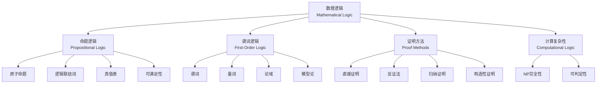

# 数理逻辑基础 - 六维内容补充


> **版本**: 1.0
> **创建日期**: 2026-04-19
> **最后更新**: 2026-04-19

> **模块**: 01-基础理论
> **文档**: 02-数理逻辑基础
> **补充维度**: 概念定义、属性、关系、解释、论证、形式证明
> **对标**: MIT 6.042J / Stanford CS103 / CMU 15-251
> **深度**: 本科高年级

---

## 思维导图：数理逻辑核心概念结构



---

## 一、概念定义 (Concept Definition)

### 1.1 命题逻辑

**定义 1.1.1** (命题 / Proposition)

命题是一个可以明确判断真假的陈述句。

$$P: \text{一个可判定真值的陈述}$$

真值集合：$\mathbb{B} = \{\top, \bot\}$（真、假）

**定义 1.1.2** (原子命题 / Atomic Proposition)

不可再分解的基本命题，用命题符号表示：$p, q, r, \cdots$

**定义 1.1.3** (逻辑联结词 / Logical Connectives)

| 联结词 | 符号 | 名称 | 真值表定义 |
|--------|------|------|-----------|
| 否定 | $\neg$ | NOT | $\neg \top = \bot$, $\neg \bot = \top$ |
| 合取 | $\land$ | AND | $\top \land \top = \top$，其余为 $\bot$ |
| 析取 | $\lor$ | OR | $\bot \lor \bot = \bot$，其余为 $\top$ |
| 蕴含 | $\rightarrow$ | IMPLIES | $\bot \rightarrow \top = \top$，其余 $A \rightarrow B = \bot$ 当 $A=\top, B=\bot$ |
| 等价 | $\leftrightarrow$ | IFF | $\top \leftrightarrow \top = \bot \leftrightarrow \bot = \top$ |

**定义 1.1.4** (合式公式 / Well-Formed Formula, WFF)

命题逻辑的合式公式递归定义：

1. 任何原子命题是合式公式
2. 若 $\phi$ 是合式公式，则 $\neg \phi$ 也是
3. 若 $\phi, \psi$ 是合式公式，则 $(\phi \land \psi)$, $(\phi \lor \psi)$, $(\phi \rightarrow \psi)$, $(\phi \leftrightarrow \psi)$ 也是
4. 只有通过有限次应用上述规则构造的才是合式公式

**定义 1.1.5** (重言式 / Tautology)

公式 $\phi$ 是重言式，当且仅当对所有真值赋值 $v$：

$$\forall v: v(\phi) = \top$$

**定义 1.1.6** (可满足性 / Satisfiability)

公式 $\phi$ 是可满足的，当且仅当存在真值赋值 $v$：

$$\exists v: v(\phi) = \top$$

---

### 1.2 谓词逻辑

**定义 1.2.1** (谓词 / Predicate)

谓词是从论域到真值的函数：

$$P: D^n \rightarrow \mathbb{B}$$

其中 $D$ 是论域，$n$ 是元数。

**定义 1.2.2** (量词 / Quantifiers)

| 量词 | 符号 | 定义 |
|------|------|------|
| 全称量词 | $\forall$ | $\forall x \in D: P(x) \equiv \bigwedge_{x \in D} P(x)$ |
| 存在量词 | $\exists$ | $\exists x \in D: P(x) \equiv \bigvee_{x \in D} P(x)$ |

**定义 1.2.3** (一阶语言 / First-Order Language)

一阶语言 $\mathcal{L}$ 由以下要素组成：

- 逻辑符号：$\neg, \land, \lor, \rightarrow, \leftrightarrow, \forall, \exists$
- 非逻辑符号：
  - 个体常元：$a, b, c, \cdots$
  - 函数符号：$f, g, h, \cdots$（带元数）
  - 谓词符号：$P, Q, R, \cdots$（带元数）
- 变元：$x, y, z, \cdots$

**定义 1.2.4** (项 / Term)

项递归定义：

1. 个体变元和常元是项
2. 若 $t_1, \cdots, t_n$ 是项，$f$ 是 $n$ 元函数，则 $f(t_1, \cdots, t_n)$ 是项

**定义 1.2.5** (原子公式 / Atomic Formula)

若 $t_1, \cdots, t_n$ 是项，$P$ 是 $n$ 元谓词，则 $P(t_1, \cdots, t_n)$ 是原子公式。

**定义 1.2.6** (结构 / Structure)

结构（或解释）$\mathcal{M} = (D, I)$，其中：

- $D$：非空论域
- $I$：解释函数，将非逻辑符号映射到 $D$ 上的对象

**定义 1.2.7** (逻辑有效性 / Logical Validity)

公式 $\phi$ 是逻辑有效的，当且仅当在所有结构中：

$$\forall \mathcal{M}: \mathcal{M} \models \phi$$

---

### 1.3 证明方法

**定义 1.3.1** (形式证明 / Formal Proof)

从公理和假设出发，通过推理规则得到的公式序列：

$$\phi_1, \phi_2, ..., \phi_n$$

其中每个 $\phi_i$ 或是公理，或是假设，或由前面公式通过推理规则得到。

**定义 1.3.2** (推理规则 / Inference Rules)

| 规则名 | 前提 | 结论 | 说明 |
|--------|------|------|------|
| 假言推理 MP | $\phi, \phi \rightarrow \psi$ | $\psi$ | Modus Ponens |
| 合取引入 | $\phi, \psi$ | $\phi \land \psi$ | 合取引入 |
| 合取消除 | $\phi \land \psi$ | $\phi$ 或 $\psi$ | 合取消除 |
| 析取引入 | $\phi$ | $\phi \lor \psi$ | 析取引入 |
| 假言三段论 HS | $\phi \rightarrow \psi, \psi \rightarrow \chi$ | $\phi \rightarrow \chi$ | 三段论 |
| 双重否定 DN | $\neg\neg\phi$ | $\phi$ | 双重否定消除 |

**定义 1.3.3** (自然演绎 / Natural Deduction)

一种证明系统，模仿人类自然推理过程：

$$\frac{\text{前提}_1 \quad ... \quad \text{前提}_n}{\text{结论}} \text{规则名}$$

**定义 1.3.4** (反证法 / Proof by Contradiction)

要证明 $\phi$，假设 $\neg \phi$ 推出矛盾 $\bot$：

$$\frac{\neg\phi \vdash \bot}{\phi} \text{RAA}$$

**定义 1.3.5** (数学归纳法 / Mathematical Induction)

要证明 $\forall n \in \mathbb{N}: P(n)$：

1. **基础步**：证明 $P(0)$
2. **归纳步**：假设 $P(k)$（归纳假设），证明 $P(k+1)$

$$\frac{P(0) \quad \forall k: P(k) \rightarrow P(k+1)}{\forall n: P(n)} \text{IND}$$

---

## 二、属性 (Properties)

### 2.1 命题逻辑性质

| 性质 | 公式 | 说明 |
|------|------|------|
| **交换律** | $\phi \land \psi \equiv \psi \land \phi$<br>$\phi \lor \psi \equiv \psi \lor \phi$ | 合取、析取可交换 |
| **结合律** | $(\phi \land \psi) \land \chi \equiv \phi \land (\psi \land \chi)$ | 合取可结合 |
| **分配律** | $\phi \land (\psi \lor \chi) \equiv (\phi \land \psi) \lor (\phi \land \chi)$ | 对偶分配律 |
| **德摩根律** | $\neg(\phi \land \psi) \equiv \neg\phi \lor \neg\psi$<br>$\neg(\phi \lor \psi) \equiv \neg\phi \land \neg\psi$ | 否定分配 |
| **蕴含等值** | $\phi \rightarrow \psi \equiv \neg\phi \lor \psi$ | 蕴含的定义 |
| **假言易位** | $\phi \rightarrow \psi \equiv \neg\psi \rightarrow \neg\phi$ | 逆否命题 |

### 2.2 量词性质

| 性质 | 公式 | 条件 |
|------|------|------|
| **量词否定** | $\neg\forall x: \phi \equiv \exists x: \neg\phi$<br>$\neg\exists x: \phi \equiv \forall x: \neg\phi$ | 德摩根律推广 |
| **量词分配** | $\forall x: (\phi \land \psi) \equiv (\forall x: \phi) \land (\forall x: \psi)$ | 全称对合取分配 |
| **存在分配** | $\exists x: (\phi \lor \psi) \equiv (\exists x: \phi) \lor (\exists x: \psi)$ | 存在对析取分配 |
| **量词交换** | $\forall x\forall y: \phi \equiv \forall y\forall x: \phi$ | 同类型量词可交换 |
| **量词收缩** | $\forall x: \phi(x) \land \forall x: \psi(x) \equiv \forall x: (\phi(x) \land \psi(x))$ | 相同量词可合并 |

### 2.3 推理系统性质

| 性质 | 定义 | 重要性 |
|------|------|--------|
| **可靠性** | 若 $\Gamma \vdash \phi$，则 $\Gamma \models \phi$ | 形式证明保证语义有效 |
| **完备性** | 若 $\Gamma \models \phi$，则 $\Gamma \vdash \phi$ | 语义有效都可形式证明 |
| **一致性** | 不存在 $\phi$ 使 $\Gamma \vdash \phi$ 且 $\Gamma \vdash \neg\phi$ | 系统无矛盾 |
| **可判定性** | 存在算法判定 $\Gamma \vdash \phi$ | 自动推理基础 |

---

## 三、关系 (Relationships)

### 3.1 概念依赖图

```
命题逻辑
    ↓
谓词逻辑 ←── 量词 + 谓词
    ↓
高阶逻辑 ←── 量词化谓词
    ↓
类型论 ←──  Curry-Howard 对应
    ↓
证明助手 ←── 形式化验证
```

### 3.2 逻辑系统层次

```
经典逻辑
    ├── 命题逻辑 (PL)
    │       ├── 可满足性 (SAT)
    │       └── 重言式判定 (co-NP完全)
    │
    └── 谓词逻辑 (FOL)
            ├── 可判定片段
            │       ├── 一元谓词逻辑
            │       └── 无量词片段
            └── 不可判定 (半可判定)

直觉主义逻辑
    └── 构造性证明
        └── 类型论
            └── 依赖类型
                └── 证明助手 (Coq, Lean)
```

### 3.3 证明方法选择

```
待证命题结构
    ├── 蕴含式 A → B
    │       └── 直接证明：假设A，证B
    ├── 合取式 A ∧ B
    │       └── 分别证A和B
    ├── 析取式 A ∨ B
    │       └── 选证A或B
    ├── 否定式 ¬A
    │       └── 反证法：假设A，导出矛盾
    ├── 全称式 ∀x: P(x)
    │       └── 任取x，证P(x)
    ├── 存在式 ∃x: P(x)
    │       └── 构造性：给出具体的x
    └── 等价式 A ↔ B
            └── 双向证明 A→B 和 B→A
```

---

## 四、解释 (Explanation)

### 4.1 逻辑联结词的直觉解释

**蕴含的实质蕴涵悖论**

实质蕴涵 $P \rightarrow Q$ 定义为 $\neg P \lor Q$，这导致一些反直觉的真命题：

- 假命题蕴含任何命题：$\bot \rightarrow \phi$ 恒真
- 真命题被任何命题蕴含：$\phi \rightarrow \top$ 恒真

**直观理解**：$P \rightarrow Q$ 可理解为"不可能 $P$ 真而 $Q$ 假"。

### 4.2 量词的几何解释

将谓词 $P(x)$ 视为集合：

- $\forall x: P(x)$：整个论域都在 $P$ 中（全称覆盖）
- $\exists x: P(x)$：$P$ 非空（存在性）

**量词否定直观**：

- "不是所有鸟都会飞" = "存在不会飞的鸟"
- "没有完美的人" = "所有人都不完美"

### 4.3 归纳法的直觉

**多米诺骨牌比喻**：

1. 第一块倒下（基础步）
2. 若第 $k$ 块倒下，则第 $k+1$ 块也倒下（归纳步）

**结论**：所有骨牌都会倒下。

**强归纳法**：假设所有小于 $k$ 的情况成立，证 $k$ 成立。

相当于：每块骨牌倒下依赖于前面所有骨牌，而非仅仅前一块。

### 4.4 可靠性与完备性

**可靠性**：形式系统不会说谎

- 能证明的都是真的

**完备性**：形式系统足够强大

- 真的都能被证明

**哥德尔不完备定理**：

- 足够强的形式系统（包含皮亚诺算术）
- 若一致，则不完备
- 存在真但不可证的命题

---

## 五、论证 (Argumentation)

### 5.1 命题逻辑可满足性

**SAT问题的计算复杂性**

命题逻辑可满足性判定是 NP 完全的：

1. **NP**：猜测一个赋值，多项式时间验证
2. **NP难**：所有NP问题可归约到SAT

**库克定理 (1971)**：SAT是NP完全的。

### 5.2 一阶逻辑的半可判定性

**丘奇-图灵定理 (1936)**：

一阶逻辑有效性判定是半可判定的：

- 若 $\phi$ 有效，则算法可在有限步内证明
- 若 $\phi$ 无效，算法可能永不停机

**证明思路**：

- 完备性定理保证：有效 $\Rightarrow$ 有证明
- 枚举所有证明，直到找到 $\phi$ 的证明
- 但无法判定何时放弃搜索（无效情况）

### 5.3 构造性 vs 经典逻辑

| 特征 | 经典逻辑 | 直觉主义逻辑 |
|------|----------|--------------|
| 排中律 | $A \lor \neg A$ 恒真 | 不普遍接受 |
| 双重否定 | $\neg\neg A \rightarrow A$ | 不普遍接受 |
| 存在证明 | 可非构造性 | 必须构造性 |
| 计算内容 | 抽象 | 可提取程序 |

**Curry-Howard 对应**：

命题 $\leftrightarrow$ 类型
证明 $\leftrightarrow$ 程序
证明归约 $\leftrightarrow$ 程序求值

---

## 六、形式证明 (Formal Proofs)

### 6.1 假言三段论证明

**定理**：$\vdash (P \rightarrow Q) \rightarrow ((Q \rightarrow R) \rightarrow (P \rightarrow R))$

**自然演绎证明**：

$$
\begin{array}{lll}
1. & P \rightarrow Q & \text{假设} \\
2. & Q \rightarrow R & \text{假设} \\
3. & P & \text{假设} \\
4. & Q & \text{MP}(1, 3) \\
5. & R & \text{MP}(2, 4) \\
6. & P \rightarrow R & \rightarrow I(3-5) \\
7. & (Q \rightarrow R) \rightarrow (P \rightarrow R) & \rightarrow I(2-6) \\
8. & (P \rightarrow Q) \rightarrow ((Q \rightarrow R) \rightarrow (P \rightarrow R)) & \rightarrow I(1-7)
\end{array}
$$

∎

### 6.2 量词交换律证明

**定理**：$\forall x \forall y: P(x, y) \vdash \forall y \forall x: P(x, y)$

**证明**：

$$
\begin{array}{lll}
1. & \forall x \forall y: P(x, y) & \text{前提} \\
2. & \forall y: P(a, y) & \forall E(1), a\text{为新常元} \\
3. & P(a, b) & \forall E(2), b\text{为新常元} \\
4. & \forall x: P(x, b) & \forall I(3), x\text{任意} \\
5. & \forall y \forall x: P(x, y) & \forall I(4), y\text{任意}
\end{array}
$$

∎

### 6.3 数学归纳法原理证明

**定理**：若 $P(0)$ 且 $\forall k: (P(k) \rightarrow P(k+1))$，则 $\forall n: P(n)$

**证明**（基于良序原理）：

假设存在反例，令 $S = \{n \in \mathbb{N} \mid \neg P(n)\}$。

若 $S \neq \emptyset$，由良序原理，$S$ 有最小元 $m$。

- 因 $P(0)$ 成立，故 $m > 0$
- 则 $m-1 \notin S$，即 $P(m-1)$ 成立
- 由归纳步，$P(m-1) \rightarrow P(m)$
- 故 $P(m)$ 成立，与 $m \in S$ 矛盾

因此 $S = \emptyset$，即 $\forall n: P(n)$。

∎

### 6.4 完备性定理概要证明

**定理 (哥德尔完备性)**：若 $\Gamma \models \phi$，则 $\Gamma \vdash \phi$

**证明概要**：

1. 将公式集 $\Gamma$ 扩展为极大一致集 $\Delta$
   - 包含所有公式或其否定之一
   - 保持一致性

2. 从 $\Delta$ 构造模型 $\mathcal{M}$
   - 论域：项的等价类
   - 解释：按公式定义

3. 证明 $\mathcal{M} \models \Delta$（真值引理）

4. 若 $\Gamma \models \phi$ 但 $\Gamma \not\vdash \phi$
   - 则 $\Gamma \cup \{\neg\phi\}$ 一致
   - 可扩展为 $\Delta'$ 并得到模型
   - 但该模型满足 $\Gamma$ 而不满足 $\phi$
   - 与语义有效性矛盾

∎

---

## 七、应用与实现

### 7.1 SAT求解器：DPLL算法

```rust
/// DPLL算法核心
pub struct DpllSolver {
    clauses: Vec<Vec<Literal>>,
    assignment: HashMap<Var, bool>,
}

impl DpllSolver {
    pub fn solve(&mut self) -> Option<HashMap<Var, bool>> {
        // 单位传播
        self.unit_propagate();

        // 纯文字消去
        self.pure_literal_eliminate();

        // 检查冲突
        if self.has_conflict() {
            return None; // 不可满足
        }

        // 检查满足
        if self.all_satisfied() {
            return Some(self.assignment.clone());
        }

        // 选择变量分支
        let var = self.select_variable();

        // 尝试赋值为真
        let mut solver_true = self.clone();
        solver_true.assignment.insert(var, true);
        if let Some(sat) = solver_true.solve() {
            return Some(sat);
        }

        // 尝试赋值为假
        let mut solver_false = self.clone();
        solver_false.assignment.insert(var, false);
        solver_false.solve()
    }
}
```

### 7.2 一阶逻辑合一算法

```rust
/// 最一般合一 (MGU)
pub fn unify(t1: &Term, t2: &Term) -> Option<Substitution> {
    match (t1, t2) {
        // 相同项
        (Term::Var(x), Term::Var(y)) if x == y => Some(Substitution::new()),

        // 变量与项合一
        (Term::Var(x), t) | (t, Term::Var(x)) => {
            if occurs_check(x, t) {
                None // 发生检查失败
            } else {
                let mut sub = Substitution::new();
                sub.insert(x.clone(), t.clone());
                Some(sub)
            }
        }

        // 函数符号
        (Term::Func(f1, args1), Term::Func(f2, args2)) => {
            if f1 != f2 || args1.len() != args2.len() {
                return None;
            }

            let mut sub = Substitution::new();
            for (a1, a2) in args1.iter().zip(args2.iter()) {
                let s1 = sub.apply(a1);
                let s2 = sub.apply(a2);
                match unify(&s1, &s2) {
                    Some(sub2) => sub.compose(&sub2),
                    None => return None,
                }
            }
            Some(sub)
        }

        _ => None,
    }
}
```

---

## 参考文献

1. Enderton, H. B. (2001). *A Mathematical Introduction to Logic* (2nd Edition). Academic Press.
2. Mendelson, E. (2015). *Introduction to Mathematical Logic* (6th Edition). CRC Press.
3. Boolos, G. S., Burgess, J. P., & Jeffrey, R. C. (2007). *Computability and Logic* (5th Edition). Cambridge University Press.
4. Girard, J.-Y., Taylor, P., & Lafont, Y. (1989). *Proofs and Types*. Cambridge University Press.

---

**文档版本**: v1.0
**创建日期**: 2026-04-10
---

## 知识导航

- [返回目录](README.md)

