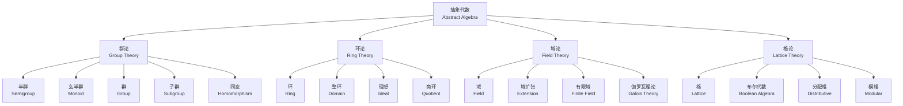

# 抽象代数基础 - 六维内容补充


> **版本**: 1.0
> **创建日期**: 2026-04-19
> **最后更新**: 2026-04-19

> **模块**: 01-基础理论
> **文档**: 03-抽象代数基础
> **补充维度**: 概念定义、属性、关系、解释、论证、形式证明
> **对标**: MIT 18.703 / Harvard Math 122 / Stanford Math 113
> **深度**: 本科高年级

---

## 思维导图：抽象代数核心概念结构



---

## 一、概念定义 (Concept Definition)

### 1.1 群 (Group)

**定义 1.1.1** (形式化)

群是一个二元组 $(G, \cdot)$，其中 $G$ 是非空集合，$\cdot: G \times G \rightarrow G$ 是二元运算，满足：

**公理**:

1. **结合律**: $\forall a, b, c \in G: (a \cdot b) \cdot c = a \cdot (b \cdot c)$
2. **单位元**: $\exists e \in G, \forall a \in G: e \cdot a = a \cdot e = a$
3. **逆元**: $\forall a \in G, \exists a^{-1} \in G: a \cdot a^{-1} = a^{-1} \cdot a = e$

**自然语言定义**

群是带有可逆运算的代数结构，捕捉了"对称性"的抽象本质。群的例子包括整数加法群、置换群、矩阵群等。

**定义 1.1.2** (阿贝尔群 / Abelian Group)

若群 $(G, \cdot)$ 还满足 **交换律**: $\forall a, b \in G: a \cdot b = b \cdot a$，则称为阿贝尔群（交换群）。

**定义 1.1.3** (子群 / Subgroup)

$H \subseteq G$ 是 $G$ 的子群，记作 $H \leq G$，当且仅当：

1. $e \in H$
2. $\forall a, b \in H: a \cdot b \in H$（封闭性）
3. $\forall a \in H: a^{-1} \in H$

---

### 1.2 环 (Ring)

**定义 1.2.1** (形式化)

环是一个三元组 $(R, +, \cdot)$，满足：

1. $(R, +)$ 是阿贝尔群
2. $(R, \cdot)$ 是半群
3. **分配律**: $\forall a, b, c \in R$:
   - $a \cdot (b + c) = a \cdot b + a \cdot c$
   - $(a + b) \cdot c = a \cdot c + b \cdot c$

**含幺环**: 若 $(R, \cdot)$ 有单位元 $1 \neq 0$，称为含幺环。

**定义 1.2.2** (整环 / Integral Domain)

整环是满足以下条件的交换含幺环：

- 无零因子: $a \cdot b = 0 \Rightarrow a = 0 \lor b = 0$

**定义 1.2.3** (理想 / Ideal)

$I \subseteq R$ 是理想，当且仅当：

1. $(I, +)$ 是 $(R, +)$ 的子群
2. $\forall r \in R, \forall i \in I: r \cdot i \in I$ 且 $i \cdot r \in I$（吸收性）

---

### 1.3 域 (Field)

**定义 1.3.1** (形式化)

域是一个三元组 $(F, +, \cdot)$，满足：

1. $(F, +)$ 是阿贝尔群，单位元记为 $0$
2. $(F \setminus \{0\}, \cdot)$ 是阿贝尔群，单位元记为 $1$
3. 乘法对加法满足分配律

**自然语言定义**

域是支持加、减、乘、除（除零外）的代数结构。有理数 $\mathbb{Q}$、实数 $\mathbb{R}$、复数 $\mathbb{C}$ 都是域。

**定义 1.3.2** (域扩张 / Field Extension)

若 $F \subseteq K$ 且 $F, K$ 都是域，则称 $K$ 是 $F$ 的域扩张，记作 $K/F$。

扩张次数: $[K:F] = \dim_F(K)$（$K$ 作为 $F$-向量空间的维数）

**定义 1.3.3** (有限域 / Finite Field)

元素个数有限的域，记作 $\mathbb{F}_q$ 或 $GF(q)$，其中 $q = p^n$（$p$ 为素数）。

---

### 1.4 格 (Lattice)

**定义 1.4.1** (形式化)

格是一个偏序集 $(L, \leq)$，其中任意两个元素都有最小上界（并）和最大下界（交）：

- **并**: $a \vee b = \sup\{a, b\}$
- **交**: $a \wedge b = \inf\{a, b\}$

**代数定义**: $(L, \vee, \wedge)$ 满足：

1. 交换律、结合律、幂等律、吸收律

**定义 1.4.2** (分配格 / Distributive Lattice)

满足分配律的格：
$$a \wedge (b \vee c) = (a \wedge b) \vee (a \wedge c)$$

**定义 1.4.3** (布尔代数 / Boolean Algebra)

有补分配格，即每个元素 $a$ 有唯一补元 $a'$ 满足：
$$a \vee a' = 1, \quad a \wedge a' = 0$$

---

## 二、属性 (Properties)

### 2.1 群的基本性质

| 性质 | 说明 | 公式 |
|------|------|------|
| **单位元唯一** | 群的单位元唯一 | - |
| **逆元唯一** | 每个元素的逆元唯一 | $(a^{-1})^{-1} = a$ |
| **消去律** | 左/右消去成立 | $ab = ac \Rightarrow b = c$ |
| **逆元的积** | 乘积的逆元 | $(ab)^{-1} = b^{-1}a^{-1}$ |
| **拉格朗日** | 子群阶整除群阶 | $\|H\|$ 整除 $\|G\|$ |

### 2.2 环的基本性质

| 性质 | 说明 | 公式 |
|------|------|------|
| **零元** | $0 \cdot a = a \cdot 0 = 0$ | - |
| **负元** | $(-a) \cdot b = -(a \cdot b)$ | - |
| **整环** | 消去律成立 | $ab = ac, a \neq 0 \Rightarrow b = c$ |
| **域** | 非零元可逆 | $\forall a \neq 0, \exists a^{-1}$ |

### 2.3 复杂度分析

| 问题 | 复杂度 | 说明 |
|------|--------|------|
| 群同构检验 | 图同构难度 | 一般群困难 |
| 阿贝尔群同构 | 多项式时间 | 基于不变量分解 |
| 群成员问题 | 多项式时间 | 给定生成集 |
| 域扩张计算 | 多项式时间 | 基于多项式运算 |
| 格中最近向量 | NP难 | 格密码学基础 |
| SVP/CVP | 近似NP难 | 最短/最近向量问题 |

---

## 三、关系 (Relationships)

### 3.1 代数结构层次

```
代数结构
    ├── 群胚 (Magma): 仅封闭
    ├── 半群 (Semigroup): +结合律
    │   └── 幺半群 (Monoid): +单位元
    │       └── 群 (Group): +逆元
    │           └── 阿贝尔群: +交换律
    │
    ├── 环 (Ring): 双运算结构
    │   ├── 交换环: +交换
    │   │   ├── 整环: +无零因子
    │   │   └── 域: +非零元可逆
    │   └── 除环 (Division Ring)
    │
    └── 格 (Lattice)
        ├── 分配格
        └── 布尔代数: +补元
```

### 3.2 概念关系表

| 源概念 | 目标概念 | 关系类型 | 说明 |
|--------|----------|----------|------|
| 群 | 环 | generalizes_to | 环有加法和乘法 |
| 域 | 环 | specializes | 域是特殊环 |
| 理想 | 子环 | specializes | 理想是特殊子环 |
| 商群 | 商环 | analogous_to | 类似构造 |
| 格 | 布尔代数 | generalizes_to | 布尔代数是特殊格 |
| 群表示 | 线性代数 | applies_to | 群作用在向量空间 |
| 伽罗瓦理论 | 域扩张 | connects | 群与域的对应 |

---

## 四、解释 (Explanation)

### 4.1 群的直观理解

**群 = 对称性的代数**

**示例**:

- 等边三角形的对称群 $D_3$ 有6个元素（3个旋转、3个反射）
- 整数加法群 $(\mathbb{Z}, +)$ 有无限多个元素

**群作用**: 群元素作为变换作用于集合

### 4.2 环与域的直观

**环**: 有加法和乘法的结构，如整数 $\mathbb{Z}$

- 可以加减乘，但不一定能除

**域**: 支持四则运算的结构，如有理数 $\mathbb{Q}$

- 非零元都可以做除法

**为什么有限域很重要？**

- 计算机中的运算天然是模运算
- 密码学、编码理论的基础

### 4.3 格的直观

**格 = 序结构的代数**

**示例**:

- 幂集格: $(\mathcal{P}(S), \subseteq)$，交=交集，并=并集
- 布尔代数: 命题逻辑的真值集合

---

## 五、论证 (Argumentation)

### 5.1 为什么拉格朗日定理成立？

**定理**: 若 $H \leq G$ 且 $|G| < \infty$，则 $|H|$ 整除 $|G|$。

**论证**:

1. 定义 $H$ 的左陪集: $aH = \{ah \mid h \in H\}$
2. 所有左陪集构成 $G$ 的划分
3. 每个左陪集与 $H$ 等势（双射: $h \mapsto ah$）
4. 因此 $|G| = [G:H] \cdot |H|$

### 5.2 群同态基本定理的意义

**定理**: 若 $\phi: G \rightarrow H$ 是同态，则 $G/\ker\phi \cong \text{im}\phi$。

**意义**: 任何同态都对应一个商结构，这是"结构保持映射"的核心性质。

---

## 六、形式证明 (Formal Proof)

### 6.1 拉格朗日定理证明

**定理**: 若 $H \leq G$ 是有限群 $G$ 的子群，则 $|H|$ 整除 $|G|$。

**证明**:

**定义左陪集**: 对 $a \in G$，定义 $aH = \{ah \mid h \in H\}$

**步骤 1**: 陪集构成划分

对任意 $a, b \in G$，要么 $aH = bH$，要么 $aH \cap bH = \emptyset$。

*证明*: 若 $x \in aH \cap bH$，则 $x = ah_1 = bh_2$，故 $a = bh_2h_1^{-1}$。

对任意 $ah \in aH$，有 $ah = bh_2h_1^{-1}h \in bH$，因此 $aH \subseteq bH$。

同理 $bH \subseteq aH$，故 $aH = bH$。

**步骤 2**: 所有陪集等势

映射 $f: H \rightarrow aH$，$f(h) = ah$ 是双射（逆映射为 $ah \mapsto h$）。

因此 $|aH| = |H|$。

**步骤 3**: 计算阶

设 $[G:H]$ 为不同左陪集的个数（指数）。

由于陪集划分 $G$：
$$|G| = \sum_{\text{陪集}} |aH| = [G:H] \cdot |H|$$

因此 $|H|$ 整除 $|G|$。

∎

### 6.2 有限域阶数定理

**定理**: 有限域的阶必为 $p^n$，其中 $p$ 为素数，$n \geq 1$。

**证明概要**:

1. 有限域 $F$ 的特征必为素数 $p$
2. 素域为 $\mathbb{F}_p$
3. $F$ 是 $\mathbb{F}_p$ 上的向量空间
4. 设维数为 $n$，则 $|F| = p^n$

∎

---

## 七、多语言实现

### 7.1 Python: 有限域运算

```python
from typing import List, Tuple

class FiniteField:
    """有限域 GF(p^n) 的实现（p为素数，n=1时）"""

    def __init__(self, p: int):
        assert self._is_prime(p), "p must be prime"
        self.p = p

    @staticmethod
    def _is_prime(n: int) -> bool:
        if n < 2:
            return False
        for i in range(2, int(n**0.5) + 1):
            if n % i == 0:
                return False
        return True

    def add(self, a: int, b: int) -> int:
        """加法"""
        return (a + b) % self.p

    def sub(self, a: int, b: int) -> int:
        """减法"""
        return (a - b) % self.p

    def mul(self, a: int, b: int) -> int:
        """乘法"""
        return (a * b) % self.p

    def inv(self, a: int) -> int:
        """乘法逆元（扩展欧几里得算法）"""
        if a == 0:
            raise ValueError("Zero has no inverse")

        def extended_gcd(a: int, b: int) -> Tuple[int, int, int]:
            if b == 0:
                return a, 1, 0
            g, x1, y1 = extended_gcd(b, a % b)
            x = y1
            y = x1 - (a // b) * y1
            return g, x, y

        _, x, _ = extended_gcd(a % self.p, self.p)
        return x % self.p

    def div(self, a: int, b: int) -> int:
        """除法"""
        return self.mul(a, self.inv(b))

    def pow(self, a: int, n: int) -> int:
        """幂运算（快速幂）"""
        result = 1
        a = a % self.p
        while n > 0:
            if n & 1:
                result = (result * a) % self.p
            a = (a * a) % self.p
            n >>= 1
        return result

# 示例
if __name__ == "__main__":
    F7 = FiniteField(7)

    print("GF(7) 运算示例:")
    print(f"3 + 5 = {F7.add(3, 5)}")  # 1
    print(f"3 * 5 = {F7.mul(3, 5)}")  # 1
    print(f"3^(-1) = {F7.inv(3)}")    # 5 (因为 3*5=15≡1 mod 7)
    print(f"4 / 3 = {F7.div(4, 3)}")  # 4 * 5 = 20 ≡ 6 mod 7
```

## 7.2 Rust: 群论基本结构

### 7.2 Rust: 群论基本结构

```rust
use std::collections::HashSet;
use std::hash::Hash;

/// 群公理 trait
pub trait Group: Clone + PartialEq {
    /// 单位元
    fn identity() -> Self;

    /// 群运算
    fn op(&self, other: &Self) -> Self;

    /// 逆元
    fn inverse(&self) -> Self;
}

/// 循环群 Z_n
#[derive(Clone, Debug, PartialEq, Eq, Hash)]
pub struct CyclicGroup {
    n: u64,
    value: u64,
}

impl CyclicGroup {
    pub fn new(n: u64, value: u64) -> Self {
        CyclicGroup { n, value: value % n }
    }

    pub fn order(&self) -> u64 {
        self.n
    }
}

impl Group for CyclicGroup {
    fn identity() -> Self {
        CyclicGroup { n: 1, value: 0 }
    }

    fn op(&self, other: &Self) -> Self {
        assert_eq!(self.n, other.n, "Different groups");
        CyclicGroup::new(self.n, (self.value + other.value) % self.n)
    }

    fn inverse(&self) -> Self {
        CyclicGroup::new(self.n, (self.n - self.value) % self.n)
    }
}

/// 置换群元素 (Sn中的元素)
#[derive(Clone, Debug, PartialEq)]
pub struct Permutation {
    n: usize,
    mapping: Vec<usize>,
}

impl Permutation {
    pub fn new(mapping: Vec<usize>) -> Self {
        let n = mapping.len();
        // 验证是有效置换
        let mut sorted = mapping.clone();
        sorted.sort();
        assert_eq!(sorted, (0..n).collect::<Vec<_>>(), "Invalid permutation");
        Permutation { n, mapping }
    }

    /// 恒等置换
    pub fn identity(n: usize) -> Self {
        Permutation {
            n,
            mapping: (0..n).collect(),
        }
    }

    /// 应用置换
    pub fn apply(&self, x: usize) -> usize {
        assert!(x < self.n);
        self.mapping[x]
    }

    /// 计算置换的阶
    pub fn order(&self) -> usize {
        let mut visited = vec![false; self.n];
        let mut lcm = 1usize;

        for i in 0..self.n {
            if visited[i] {
                continue;
            }

            // 找循环长度
            let mut cycle_len = 0;
            let mut current = i;
            while !visited[current] {
                visited[current] = true;
                current = self.apply(current);
                cycle_len += 1;
            }

            // lcm = lcm(lcm, cycle_len)
            lcm = lcm * cycle_len / gcd(lcm, cycle_len);
        }

        lcm
    }
}

impl Group for Permutation {
    fn identity() -> Self {
        Permutation::identity(0)
    }

    fn op(&self, other: &Self) -> Self {
        assert_eq!(self.n, other.n);
        let mut result = Vec::with_capacity(self.n);
        for i in 0..self.n {
            result.push(other.apply(self.apply(i)));
        }
        Permutation::new(result)
    }

    fn inverse(&self) -> Self {
        let mut result = vec![0; self.n];
        for i in 0..self.n {
            result[self.mapping[i]] = i;
        }
        Permutation::new(result)
    }
}

fn gcd(a: usize, b: usize) -> usize {
    if b == 0 { a } else { gcd(b, a % b) }
}

/// 生成由给定元素生成的子群
pub fn generated_subgroup<G: Group + Eq + Hash>(generators: &[G]) -> HashSet<G> {
    let mut subgroup = HashSet::new();
    let mut queue = vec![G::identity()];

    while let Some(g) = queue.pop() {
        if subgroup.insert(g.clone()) {
            for gen in generators {
                queue.push(g.op(gen));
                queue.push(g.op(&gen.inverse()));
            }
        }
    }

    subgroup
}

#[cfg(test)]
mod tests {
    use super::*;

    #[test]
    fn test_cyclic_group() {
        let g = CyclicGroup::new(7, 3);
        let h = CyclicGroup::new(7, 4);

        // 3 + 4 = 0 mod 7
        assert_eq!(g.op(&h), CyclicGroup::new(7, 0));

        // 逆元
        assert_eq!(g.op(&g.inverse()), CyclicGroup::new(7, 0));
    }

    #[test]
    fn test_permutation() {
        // (0 1 2) 循环
        let p = Permutation::new(vec![1, 2, 0]);
        assert_eq!(p.order(), 3);

        // p^3 = identity
        let p3 = p.op(&p).op(&p);
        assert_eq!(p3, Permutation::identity(3));
    }
}
```

---

## 八、代数结构速查表

| 结构 | 运算 | 公理 | 例子 |
|------|------|------|------|
| 半群 | 1个 | 封闭、结合 | (N, +) |
| 幺半群 | 1个 | +单位元 | (N, +, 0) |
| 群 | 1个 | +逆元 | (Z, +) |
| 阿贝尔群 | 1个 | +交换 | (Z, +) |
| 环 | 2个 | 群+半群+分配 | (Z, +, ×) |
| 域 | 2个 | 环+乘法群 | (Q, +, ×) |
| 格 | 2个 | 交并运算 | (P(S), ∩, ∪) |
| 布尔代数 | 2个 | 分配格+补 | {0, 1} |

---

## 参考文献

1. Dummit, D. & Foote, R. (2004). *Abstract Algebra* (3rd Edition). Wiley.
2. Artin, M. (2011). *Algebra* (2nd Edition). Pearson.
3. Aluffi, P. (2009). *Algebra: Chapter 0*. AMS.
4. Grätzer, G. (2011). *Lattice Theory: Foundation*. Springer.
5. Lidl, R. & Niederreiter, H. (1997). *Finite Fields* (2nd Edition). Cambridge University Press.

---

**文档版本**: v1.0
**创建日期**: 2026-04-10
**维护**: 项目基础理论工作组
---

## 知识导航

- [返回目录](README.md)

## 学习目标

- 理解抽象代数基础 - 六维内容补充的核心概念
- 掌握抽象代数基础 - 六维内容补充的形式化表示
