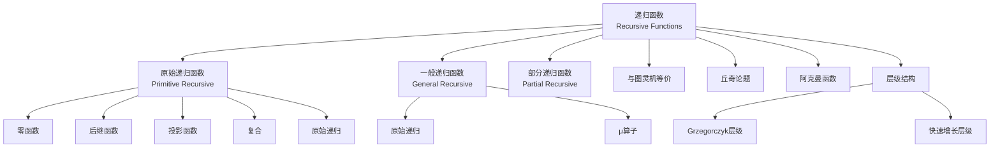
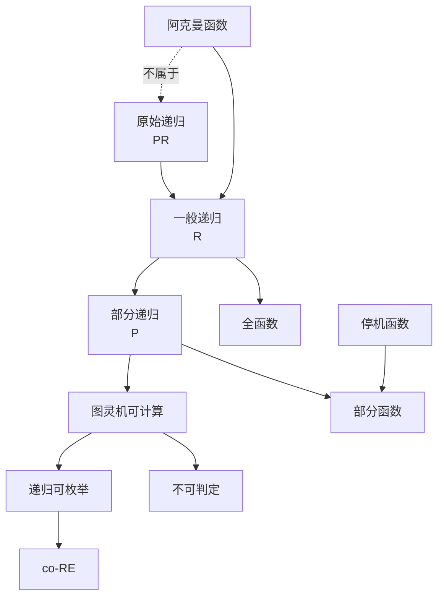

# 递归函数定义 - 深化六维补充


> **版本**: 1.0
> **创建日期**: 2026-04-19
> **最后更新**: 2026-04-19

> **模块**: 02-递归理论
> **文档**: 01-递归函数定义-深化补充
> **补充维度**: 概念定义、属性、关系、解释、论证、形式证明
> **对标**: MIT 18.404 / CMU 15-251 / UCSD CSE 105
> **深度**: 研究生级

---

## 思维导图：递归函数概念结构



---

## 一、概念定义 (Concept Definition)

### 1.1 原始递归函数 / Primitive Recursive Functions

**定义 1.1.1** (形式化)

**原始递归函数**是最小的函数类 $\mathcal{PR}$，包含：

**初始函数**:

1. **零函数**: $Z(x) = 0$
2. **后继函数**: $S(x) = x + 1$
3. **投影函数**: $P_i^n(x_1, \ldots, x_n) = x_i$

**构造规则**:

1. **复合**: 若 $g, h_1, \ldots, h_m \in \mathcal{PR}$，则
   $$f(\vec{x}) = g(h_1(\vec{x}), \ldots, h_m(\vec{x})) \in \mathcal{PR}$$

2. **原始递归**: 若 $g, h \in \mathcal{PR}$，则 $f$ 由 $g$ 和 $h$ 原始递归定义：
   $$
   \begin{cases}
   f(\vec{x}, 0) = g(\vec{x}) \\
   f(\vec{x}, y+1) = h(\vec{x}, y, f(\vec{x}, y))
   \end{cases}
   $$

---

### 1.2 一般递归函数 / General Recursive Functions

**定义 1.2.1** (形式化)

**一般递归函数**（全递归函数）在原始递归基础上增加 **μ-算子**（最小数算子）：

$$
\mu y. [f(\vec{x}, y) = 0] = \text{最小的 } y \text{ 使得 } f(\vec{x}, y) = 0 \text{ 且 } \forall z < y: f(\vec{x}, z) \downarrow \neq 0
$$

若不存在这样的 $y$，则未定义。

---

### 1.3 部分递归函数 / Partial Recursive Functions

**定义 1.3.1** (形式化)

**部分递归函数**允许μ-算子产生**部分函数**（在某些输入上未定义）。

**丘奇-图灵论题**: 部分递归函数类 = 图灵机可计算的部分函数类。

---

## 二、属性 (Properties)

### 2.1 原始递归函数示例

| 函数 | 定义 | 原始递归性 |
|------|------|------------|
| **加法** | $add(x, 0) = x; add(x, y+1) = S(add(x, y))$ | ✅ |
| **乘法** | $mul(x, 0) = 0; mul(x, y+1) = add(mul(x, y), x)$ | ✅ |
| **指数** | $exp(x, 0) = 1; exp(x, y+1) = mul(exp(x, y), x)$ | ✅ |
| **前驱** | $pred(0) = 0; pred(y+1) = y$ | ✅ |
| **减法** | $sub(x, 0) = x; sub(x, y+1) = pred(sub(x, y))$ | ✅ |
| **阶乘** | $fact(0) = 1; fact(y+1) = mul(fact(y), S(y))$ | ✅ |
| **阿克曼** | 见下文 | ❌ |

### 2.2 原始递归 vs 一般递归

| 特征 | 原始递归 | 一般递归 |
|------|----------|----------|
| **定义域** | 全函数 | 全函数 |
| **μ-算子** | 不允许 | 允许（有界） |
| **停机** | 必然停机 | 必然停机 |
| **增长** | 有界（Grzegorczyk） | 任意 |
| **表达能力** | 受限 | 完全可计算 |

### 2.3 阿克曼函数

**定义 1.3.2**:

$$
A(m, n) = \begin{cases}
n+1 & \text{if } m = 0 \\
A(m-1, 1) & \text{if } m > 0, n = 0 \\
A(m-1, A(m, n-1)) & \text{if } m > 0, n > 0
\end{cases}
$$

**定理**: 阿克曼函数是**全递归但非原始递归**的。

---

## 三、关系 (Relations)

### 3.1 概念关系表

| 源概念 | 目标概念 | 关系类型 | 说明 |
|--------|----------|----------|------|
| 原始递归 | 一般递归 | contained_in | $\mathcal{PR} \subset \mathcal{R}$ |
| 一般递归 | 部分递归 | contained_in | 全函数子集 |
| 递归函数 | 图灵机 | equivalent_to | 丘奇-图灵论题 |
| 阿克曼函数 | 非原始递归 | is | 典型例子 |
| 原始递归 | 有限增长 | characterized_by | Grzegorczyk层级 |
| 递归枚举 | 部分递归 | equivalent_to | RE = 部分递归 |

### 3.2 可计算性层次



---

## 四、解释 (Explanation)

### 4.1 动机与直观

**为什么研究递归函数？**

1930年代，数学家需要形式化"**可计算函数**"的概念：

- **丘奇**: λ演算
- **图灵**: 图灵机
- **哥德尔**: 一般递归函数

令人惊讶的是，三者定义了**相同的函数类**！这支持了丘奇-图灵论题。

**原始递归的直观**:

"从简单函数出发，通过明确的构造规则，能走多远？"

原始递归允许：

- 基本的算术运算
- 有限的迭代（for循环）

但不允许：

- 无界搜索（while循环直到条件满足）
- 快速增长（如阿克曼函数）

### 4.2 与已有概念的联系

**递归函数 ↔ 编程语言**

| 递归函数 | 编程概念 |
|----------|----------|
| 原始递归 | for循环（已知迭代次数） |
| 一般递归 | while循环（可能不终止） |
| 复合 | 函数调用 |
| 原始递归定义 | 递归函数 |
| μ-算子 | 无限循环 + 条件跳出 |

**阿克曼函数的意义**:

阿克曼函数展示了"**递归但不原始递归**"的可能性：

- 它是全函数（对所有输入都定义）
- 它必然停机
- 但它增长太快，无法被原始递归函数类包含

### 4.3 示例与反例

**示例 4.3.1**: 加法与乘法的原始递归定义

```
加法:
add(x, 0) = x                    [g(x) = x = P_1^1(x)]
add(x, y+1) = S(add(x, y))       [h(x, y, z) = S(z) = S(P_3^3(x,y,z))]

乘法:
mul(x, 0) = 0                    [g(x) = Z(x)]
mul(x, y+1) = add(mul(x, y), x)  [h(x, y, z) = add(z, x)]
```

**反例 4.3.2**: 为什么阿克曼函数不是原始递归？

**直观**: 原始递归函数的增长可以被某个"层级"限制，而阿克曼函数超越了所有这样的层级。

**形式证明概要**:

阿克曼函数 $A(n, n)$ 比任何原始递归函数增长都快。对于任何原始递归函数 $f$，存在 $n$ 使得：

$$\forall \vec{x}: f(\vec{x}) < A(n, \max(\vec{x}))$$

因此 $A$ 本身不能是原始递归的。

---

## 五、论证 (Argumentation)

### 5.1 非形式论证：原始递归函数为什么总是停机？

**结构归纳论证**:

1. **基例**: 初始函数（零、后继、投影）显然停机
2. **归纳步骤**:
   - 复合: 若 $h_i$ 和 $g$ 停机，则 $g(h_1(\vec{x}), \ldots)$ 停机
   - 原始递归:
     - 基例 $f(\vec{x}, 0) = g(\vec{x})$ 停机（归纳假设）
     - 归纳步骤 $f(\vec{x}, y+1) = h(\vec{x}, y, f(\vec{x}, y))$
     - 每次递归调用 $y$ 减小，必然到达基例

**关键**: 原始递归的递归结构是**良基的**（递归参数递减）。

### 5.2 反例与边界

**边界情况 5.2.1**: 原始递归函数的增长限制

虽然原始递归函数数量无限，但它们的**增长率**受限：

```
Level 0: f(x) = x + 1
Level 1: f(x, y) = x + y
Level 2: f(x, y) = x * y
Level 3: f(x, y) = x ^ y
...
阿克曼: 超越所有Level
```

---

## 六、形式证明 (Formal Proof)

### 6.1 原始递归函数类对复合封闭

**定理 6.1.1**: 若 $g, h_1, \ldots, h_m \in \mathcal{PR}$，则 $f(\vec{x}) = g(h_1(\vec{x}), \ldots, h_m(\vec{x})) \in \mathcal{PR}$。

**证明**: 直接由定义，复合是原始递归函数的构造规则之一。

### 6.2 阿克曼函数非原始递归性

**定理 6.2.1**: 阿克曼函数 $A(m, n)$ 不是原始递归的。

**证明概要**:

**定义** (Grzegorczyk层级近似):

设 $f_n$ 是第 $n$ 层Grzegorczyk函数，原始递归函数的增长被这些函数限制。

**引理**: 对于每个原始递归函数 $f$，存在 $k$ 使得：

$$f(\vec{x}) < f_k(\max(\vec{x}))$$

**关键观察**: 阿克曼函数满足：

$$A(n, n) > f_n(n)$$

对所有 $n$ 成立。因此 $A$ 不能被任何原始递归函数限制，故 $A \notin \mathcal{PR}$。

---

## 七、多语言实现：递归函数模拟

### 7.1 Python: 原始递归函数构造器

```python
"""
原始递归函数构造器
演示如何从基本函数构造复杂函数
"""

from typing import Callable, List
from functools import reduce

class PrimitiveRecursive:
    """原始递归函数构造器"""

    @staticmethod
    def zero(x: int) -> int:
        """零函数 Z(x) = 0"""
        return 0

    @staticmethod
    def succ(x: int) -> int:
        """后继函数 S(x) = x + 1"""
        return x + 1

    @staticmethod
    def proj(n: int, i: int) -> Callable[..., int]:
        """投影函数 P_i^n(x_1, ..., x_n) = x_i"""
        def projection(*args):
            assert len(args) == n
            return args[i - 1]
        return projection

    @staticmethod
    def compose(g: Callable, *h_funcs: Callable) -> Callable:
        """复合: f(x) = g(h_1(x), ..., h_m(x))"""
        def composed(*args):
            h_results = [h(*args) for h in h_funcs]
            return g(*h_results)
        return composed

    @staticmethod
    def prim_rec(g: Callable, h: Callable) -> Callable:
        """原始递归:
        f(x, 0) = g(x)
        f(x, y+1) = h(x, y, f(x, y))
        """
        def f(*args):
            if len(args) == 1:
                # 基本情况
                return g(args[0])

            x, y = args[:-1], args[-1]

            if y == 0:
                return g(*x)
            else:
                # f(x, y) = h(x, y-1, f(x, y-1))
                prev = f(*x, y - 1)
                return h(*x, y - 1, prev)

        return f

# 构造加法
def construct_addition():
    PR = PrimitiveRecursive()

    # add(x, 0) = x = P_1^1(x)
    g = PR.proj(1, 1)

    # add(x, y+1) = S(add(x, y))
    # h(x, y, z) = S(z) = S(P_3^3(x, y, z))
    h = PR.compose(PR.succ, PR.proj(3, 3))

    add = PR.prim_rec(g, h)
    return add

# 构造乘法
def construct_multiplication():
    PR = PrimitiveRecursive()
    add = construct_addition()

    # mul(x, 0) = 0
    g = lambda x: 0

    # mul(x, y+1) = add(mul(x, y), x)
    # h(x, y, z) = add(z, x)
    def h(x, y, z):
        return add(z, x)

    mul = PR.prim_rec(g, h)
    return mul

# 构造指数
def construct_exponentiation():
    PR = PrimitiveRecursive()
    mul = construct_multiplication()

    # exp(x, 0) = 1
    g = lambda x: 1

    # exp(x, y+1) = mul(exp(x, y), x)
    def h(x, y, z):
        return mul(z, x)

    exp = PR.prim_rec(g, h)
    return exp

# 阿克曼函数（非原始递归）
def ackermann(m: int, n: int) -> int:
    """阿克曼函数 - 非原始递归"""
    if m == 0:
        return n + 1
    elif n == 0:
        return ackermann(m - 1, 1)
    else:
        return ackermann(m - 1, ackermann(m, n - 1))

# 测试
if __name__ == "__main__":
    add = construct_addition()
    mul = construct_multiplication()
    exp = construct_exponentiation()

    print("=== 原始递归函数构造 ===")
    print(f"add(5, 3) = {add(5, 3)}")
    print(f"mul(4, 3) = {mul(4, 3)}")
    print(f"exp(2, 5) = {exp(2, 5)}")

    print("\n=== 阿克曼函数（非原始递归）===")
    for m in range(4):
        for n in range(4):
            print(f"A({m}, {n}) = {ackermann(m, n)}")
        print()
```

---

## 八、递归函数速查表

### 8.1 Grzegorczyk层级

| 层级 | 初始函数 | 允许操作 | 典型函数 |
|------|----------|----------|----------|
| $\mathcal{E}_0$ | $x+1, x+y$ | 受限复合 | 有限修改 |
| $\mathcal{E}_1$ | 加 $x+y$ | 原始递归 | 线性函数 |
| $\mathcal{E}_2$ | 乘 $x \cdot y$ | 原始递归 | 多项式 |
| $\mathcal{E}_3$ | 指数 $x^y$ | 原始递归 | 初等函数 |
| $\mathcal{E}_n (n \geq 3)$ | 前一层 | 原始递归 | 更高增长 |
| 超越所有 | - | - | 阿克曼函数 |

### 8.2 递归函数等价性

| 模型 | 全函数 | 部分函数 |
|------|--------|----------|
| **一般递归函数** | ✅ | - |
| **部分递归函数** | - | ✅ |
| **图灵机** | ✅ | ✅ |
| **λ演算** | ✅ | ✅ |
| **Post系统** | ✅ | ✅ |
| **马尔可夫算法** | ✅ | ✅ |

---

**文档版本**: v1.0
**创建日期**: 2026-04-10
**维护**: 项目递归理论工作组

---

## 参考文献

- 待补充

---

## 知识导航

- [返回目录](README.md)

## 学习目标

- 理解递归函数定义 - 深化六维补充的核心概念
- 掌握递归函数定义 - 深化六维补充的形式化表示
