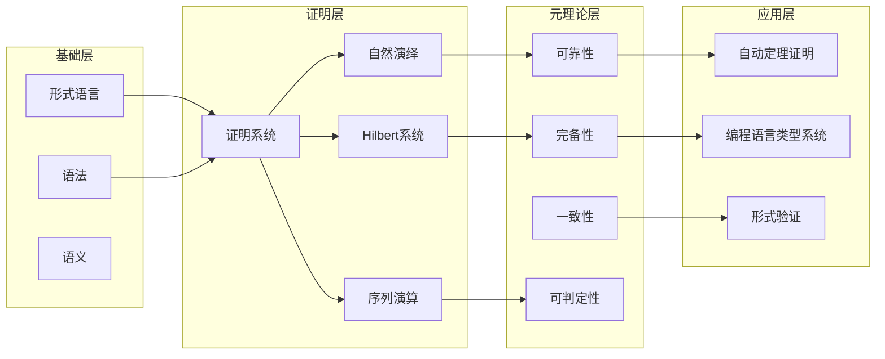
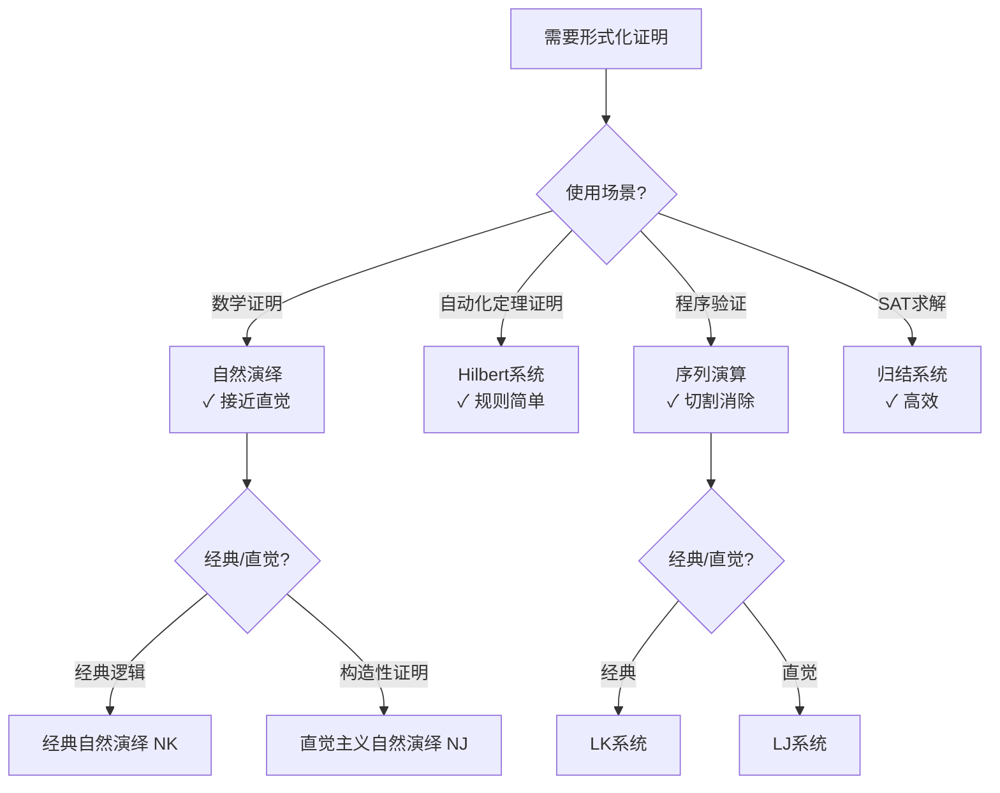

# 证明系统 - 六维内容补充

> **模块**: 03-形式化证明
> **文档**: 01-证明系统
> **补充维度**: 概念定义、属性、关系、解释、论证、形式证明
> **对标**: MIT 18.404 / CMU 15-251 / Stanford CS103
> **深度**: 研究生级

---

## 思维导图：证明系统概念结构

```mermaid
graph TD
    PS[证明系统<br/>Proof System] --> NS[自然演绎<br/>Natural Deduction]
    PS --> HS[Hilbert系统<br/>Hilbert System]
    PS --> SS[序列演算<br/>Sequent Calculus]
    PS --> RS[归结系统<br/>Resolution]

    NS --> NI[否定引入<br/>¬I]
    NS --> NE[否定消去<br/>¬E]
    NS --> II[蕴涵引入<br/>→I]
    NS --> IE[蕴涵消去<br/>→E]

    HS --> HA[Hilbert公理<br/>A→B→A]
    HS --> MP[假言推理<br/>Modus Ponens]

    SS --> LS[左侧规则<br/>Left Rules]
    SS --> RS2[右侧规则<br/>Right Rules]
    SS --> CUT[切割规则<br/>Cut Rule]

    PS --> PROP[命题逻辑<br/>Propositional]
    PS --> FOL[一阶逻辑<br/>First-Order]
    PS >> HOL[高阶逻辑<br/>Higher-Order]
```

---

## 一、概念定义 (Concept Definition)

### 1.1 证明系统 / Proof System

**定义 1.1.1** (形式化)

证明系统是一个三元组 $\mathcal{P} = (\mathcal{L}, \mathcal{A}, \mathcal{R})$，其中：

- $\mathcal{L}$: 形式语言（语法）
- $\mathcal{A} \subseteq \mathcal{L}$: 公理集合
- $\mathcal{R}$: 推理规则集合，每个规则 $r \in \mathcal{R}$ 是形如 $(\Gamma, \phi)$ 的二元组，其中 $\Gamma \subseteq \mathcal{L}$ 是前提集合，$\phi \in \mathcal{L}$ 是结论

**自然语言定义**

证明系统是一套形式化的数学框架，用于从公理出发，通过严格定义的推理规则，系统地推导出定理。它为数学证明提供了机械化的验证标准。

**内涵与外延**

| 内涵 (包含) | 外延 (不包含) |
|-------------|---------------|
| 语法规则定义 | 具体数学内容的真值 |
| 公理与推理规则 | 非形式化的直观论证 |
| 证明的机械可验证性 | 证明的发现过程 |
| 形式化的推导序列 | 语义解释 (在某些系统中) |

---

### 1.2 自然演绎 / Natural Deduction

**定义 1.2.1** (形式化)

自然演绎系统 $\mathcal{N}$ 是一个证明系统，其推理规则按**引入-消去对**组织：

对于每个逻辑连接词 $\circ \in \{\land, \lor, \rightarrow, \neg, \forall, \exists\}$，存在：

- 引入规则 $(\circ I)$: 从子公式构建复合公式
- 消去规则 $(\circ E)$: 从复合公式提取子公式

**形式化规则示例**

$$
\frac{A \quad B}{A \land B}(\land I) \qquad \frac{A \land B}{A}(\land E_1) \qquad \frac{A \land B}{B}(\land E_2)
$$

$$
\frac{[A] \\ \vdots \\ B}{A \rightarrow B}(\rightarrow I) \qquad \frac{A \rightarrow B \quad A}{B}(\rightarrow E)
$$

**与标准/教材对齐**

- 对应 Gentzen (1935) 原始论文
- 对齐 van Dalen《Logic and Structure》§1.5
- 对齐 MIT 6.042J / Stanford CS103 课程内容

---

### 1.3 Hilbert系统 / Hilbert System

**定义 1.3.1** (形式化)

Hilbert系统 $\mathcal{H}$ 由以下组成：

1. **公理模式** (命题逻辑)：
   - (H1) $A \rightarrow (B \rightarrow A)$
   - (H2) $(A \rightarrow (B \rightarrow C)) \rightarrow ((A \rightarrow B) \rightarrow (A \rightarrow C))$
   - (H3) $(\neg B \rightarrow \neg A) \rightarrow ((\neg B \rightarrow A) \rightarrow B)$

2. **推理规则**：
   - 假言推理 (Modus Ponens): $\frac{A \rightarrow B \quad A}{B}$

**与标准/教材对齐**

- 对齐 Hilbert & Ackermann《Principles of Mathematical Logic》
- 对应 Mendelson《Introduction to Mathematical Logic》§1.4

---

## 二、属性 (Properties)

### 2.1 证明系统属性表

| 属性名 | 类型/范围 | 含义 | 判定复杂度 |
|--------|-----------|------|------------|
| **可靠性** (Soundness) | 布尔值 | 所有可证命题都是有效的 | $O(1)$ (元性质) |
| **完备性** (Completeness) | 布尔值 | 所有有效命题都是可证的 | $O(1)$ (元性质) |
| **一致性** (Consistency) | 布尔值 | 不存在证明 $A \land \neg A$ | $O(1)$ (元性质) |
| **可判定性** (Decidability) | 布尔值 | 存在算法判定 provability | 问题相关 |
| **构造性** (Constructivity) | 布尔值 | 证明可提取计算内容 | $O(1)$ (系统特征) |
| **切割消除** (Cut-elimination) | 布尔值 | 切割规则可消除 | $O(2^n)$ 消除过程 |

### 2.2 不同证明系统对比矩阵

| 证明系统 | 自然演绎 | Hilbert系统 | 序列演算 | 归结系统 |
|----------|----------|-------------|----------|----------|
| **规则数量** | 多 (每连接词2条) | 少 (3条公理+1规则) | 中等 (左右规则) | 少 (1条规则) |
| **证明长度** | 中等 | 长 | 中等 | 短 |
| **可理解性** | 高 (接近直觉) | 低 (抽象) | 中等 | 中等 |
| **自动化** | 难 | 难 | 中等 | 易 |
| **构造性支持** | 是 (直觉主义变体) | 否 | 是 | 否 |
| **切割消除** | N/A | N/A | 是 | N/A |

### 2.3 不变式 (Invariant)

**元定理 2.3.1** (推导不变式)

在自然演绎系统中，对于任何推导 $\mathcal{D}$：

$$
\Gamma \vdash_{\mathcal{N}} A \implies \text{FV}(A) \subseteq \text{FV}(\Gamma)
$$

其中 $\text{FV}$ 表示自由变量集合。

---

## 三、关系 (Relations)

### 3.1 概念关系表

| 源概念 | 目标概念 | 关系类型 | 说明 |
|--------|----------|----------|------|
| 证明系统 | 形式语言 | depends_on | 证明系统基于形式语言定义 |
| 自然演绎 | 直觉主义逻辑 | specializes | 直觉主义ND限制排中律 |
| Hilbert系统 | 经典逻辑 | specializes | Hilbert公理刻画经典逻辑 |
| 序列演算 | 自然演绎 | equivalent_to | 两者可互译 |
| 归结系统 | 自动定理证明 | applies_to | 归结用于ATP系统 |
| 证明系统 | 类型理论 | related_to | Curry-Howard同构 |
| 切割消除 | 计算归约 | equivalent_to | 切割消除对应计算归约 |

### 3.2 概念依赖图



### 3.3 与其他模块的交叉引用

- **前置知识**: 01-形式化定义、06-逻辑系统/01-命题逻辑
- **后续概念**: 03-02-归纳法、03-03-构造性证明、03-04-反证法
- **等价概念**: 05-类型理论 (Curry-Howard对应)
- **应用场景**: 08-形式化验证、09-算法验证理论

---

## 四、解释 (Explanation)

### 4.1 动机与直观

**为什么需要证明系统？**

数学证明在历史上依赖于个人的数学直觉和说服能力。这导致了以下问题：

1. **主观性**: 不同数学家对"证明"的标准可能不同
2. **可错性**: 直觉可能误导，如早期"证明"中的隐含假设
3. **可验证性**: 复杂证明难以人工验证（如四色定理）

**证明系统的核心动机**是为数学推理提供一个：

- **客观标准**: 什么是合法的推理步骤明确定义
- **机械可检验**: 每个步骤可被算法验证
- **可组合**: 复杂证明由简单步骤组合而成

**自然演绎的直观**: 模仿人类自然的推理方式。当我们想证明 $A \rightarrow B$ 时，我们会说"假设 $A$，证明 $B$"——这正是蕴涵引入规则。

### 4.2 与已有概念的联系

**证明系统 ↔ 编程语言 (Curry-Howard同构)**

| 逻辑 | 编程 |
|------|------|
| 命题 | 类型 |
| 证明 | 程序/项 |
| 蕴涵 $A \rightarrow B$ | 函数类型 $A \to B$ |
| 合取 $A \land B$ | 积类型 $A \times B$ |
| 析取 $A \lor B$ | 和类型 $A + B$ |
| 证明规范化 | 程序求值 |

**证明系统 ↔ 代数结构**

- Lindenbaum代数: 命题逻辑对应布尔代数
- Heyting代数: 直觉主义逻辑对应Heyting代数
- 证明的等价比对应代数等式

### 4.3 示例与反例

**示例 4.3.1**: 证明 $A \rightarrow A$

```
自然演绎证明:
  [A]¹
  ------ (假设)
  A
  ------ (→I, ¹)
  A → A
```

Hilbert系统证明:

```
1. (A → ((A → A) → A)) → ((A → (A → A)) → (A → A))  [H2]
2. A → ((A → A) → A)                                  [H1]
3. (A → (A → A)) → (A → A)                            [MP: 1, 2]
4. A → (A → A)                                        [H1]
5. A → A                                              [MP: 3, 4]
```

**反例 4.3.2**: 非形式化的"证明"

> "显然，所有集合的集合存在，因为我们能想象它。"

**问题分析**:

- 违反形式化: 没有使用证明系统的规则
- 导致悖论: 实际上导致Russell悖论
- 教训: 直观不能替代形式化验证

---

## 五、论证 (Argumentation)

### 5.1 非形式论证：为什么自然演绎是"自然"的？

**论证思路**:

1. **观察人类推理**: 数学家的实际推理过程通常涉及：
   - 做出假设 ("假设 $n$ 是偶数...")
   - 从假设推导 ("那么 $n = 2k$...")
   - 得出结论 ("因此...")

2. **对应引入规则**: 每个引入规则对应一种"构造函数"的思维模式
   - 想证明 $A \land B$？分别证明 $A$ 和 $B$
   - 想证明 $A \rightarrow B$？假设 $A$，证明 $B$

3. **对应消去规则**: 每个消去规则对应一种"使用函数"的思维模式
   - 有 $A \land B$？可以使用 $A$ 或 $B$
   - 有 $A \rightarrow B$ 和 $A$？可以得到 $B$

### 5.2 反例与边界

**边界情况 5.2.1**: 空证明

某些系统中允许从空前提推导重言式，但这在构造性解释中有争议。

**边界情况 5.2.2**: 非构造性证明

经典逻辑中 $A \lor \neg A$ 是定理，但无法确定哪个分支成立——这在计算上没有对应内容。

---

## 六、形式证明 (Formal Proof)

### 6.1 公理与规则汇总

**命题逻辑自然演绎核心规则**:

$$
\begin{aligned}
&\text{合取:} && \frac{A \quad B}{A \land B}(\land I) && \frac{A \land B}{A}(\land E_1) && \frac{A \land B}{B}(\land E_2) \\
&\text{蕴涵:} && \frac{[A]^i \\ \vdots \\ B}{A \rightarrow B}(\rightarrow I^i) && \frac{A \rightarrow B \quad A}{B}(\rightarrow E) \\
&\text{析取:} && \frac{A}{A \lor B}(\lor I_1) && \frac{B}{A \lor B}(\lor I_2) && \frac{A \lor B \quad [A]^i \vdash C \quad [B]^j \vdash C}{C}(\lor E^{i,j}) \\
&\text{否定:} && \frac{[A]^i \\ \vdots \\ \bot}{\neg A}(\neg I^i) && \frac{\neg A \quad A}{\bot}(\neg E)
\end{aligned}
$$

### 6.2 证明结构示例

**定理 6.2.1**: $A \rightarrow (B \rightarrow A)$

**证明树**:

```
        [A]¹    [B]²
        ---------
            A
    ----------------- (→I, ²)
    B → A
--------------------- (→I, ¹)
A → (B → A)
```

**形式化表达**:

$$
\mathcal{D} =
\begin{array}{c}
[A]^1 \quad [B]^2 \\
\cline{1-1}
A \\
\cline{1-1}
B \rightarrow A \quad (\rightarrow I, 2) \\
\cline{1-1}
A \rightarrow (B \rightarrow A) \quad (\rightarrow I, 1)
\end{array}
$$

### 6.3 证明决策树

```mermaid
graph TD
    Goal[目标: 证明 Γ ⊢ A] --> Form{公式形式?}

    Form -->|原子命题| Search{在Γ中?}
    Search -->|是| Done[完成: 公理]
    Search -->|否| Backtrack[回溯/失败]

    Form -->|B ∧ C| AndSplit[分别证明 B 和 C]
    AndSplit --> AndIntro[使用 ∧I]

    Form -->|B → C| ImpliesIntro[假设 B, 证明 C]
    ImpliesIntro --> ImpliesRule[使用 →I]

    Form -->|B ∨ C| OrChoice{选择分支}
    OrChoice -->|左| ProveB[证明 B]
    OrChoice -->|右| ProveC[证明 C]
    ProveB --> OrIntro1[使用 ∨I₁]
    ProveC --> OrIntro2[使用 ∨I₂]

    Form -->|∀x.B| ForallIntro[引入新常量 c, 证明 B[c/x]]
    ForallIntro --> ForallRule[使用 ∀I]

    Form -->|∃x.B| ExistsWitness{提供见证项 t}
    ExistsWitness --> ProveBt[证明 B[t/x]]
    ProveBt --> ExistsRule[使用 ∃I]
```

### 6.4 与实现的关系

**对应代码结构 (伪代码)**:

```rust
// 自然演绎证明树的Rust表示
enum Proof {
    Axiom(Formula),                    // 公理
    AndIntro(Box<Proof>, Box<Proof>),  // ∧引入
    AndElimL(Box<Proof>),              // ∧消去左
    AndElimR(Box<Proof>),              // ∧消去右
    ImpIntro(Formula, Box<Proof>),     // →引入 (带假设)
    ImpElim(Box<Proof>, Box<Proof>),   // →消去
    // ... 其他规则
}

fn verify(proof: &Proof, conclusion: &Formula, assumptions: &[Formula]) -> bool {
    match proof {
        Proof::Axiom(f) => assumptions.contains(f) && f == conclusion,
        Proof::AndIntro(p1, p2) => {
            matches!(conclusion, Formula::And(a, b)
                if verify(p1, a, assumptions) && verify(p2, b, assumptions))
        },
        // ... 其他规则的验证
        _ => false
    }
}
```

---

## 七、国际课程习题精选

### 7.1 MIT 6.042J / 18.062J 风格习题

**习题 7.1.1**: 在自然演绎中证明 $(A \rightarrow B) \rightarrow ((B \rightarrow C) \rightarrow (A \rightarrow C))$ (蕴涵的传递性)

**习题 7.1.2**: 证明Hilbert系统的公理H2与自然演绎中的蕴涵规则等价

### 7.2 Stanford CS103 风格习题

**习题 7.2.1**: 设计一个命题逻辑的自然演绎证明，证明 $(A \land B) \rightarrow (B \land A)$

**习题 7.2.2**: 解释为什么切割消除定理对定理证明的自动化很重要

### 7.3 CMU 15-251 风格习题

**习题 7.3.1**: 证明在自然演绎中，如果 $\Gamma \vdash A$ 且 $\Gamma, A \vdash B$，则 $\Gamma \vdash B$ (演绎定理的部分形式)

**习题 7.3.2**: 构造一个证明，说明在经典逻辑中可以证明 $A \lor \neg A$，但在直觉主义逻辑中不可证

---

## 八、多语言实现示例

### 8.1 Rust: 证明树验证器

```rust
/// 公式类型
#[derive(Clone, Debug, PartialEq)]
pub enum Formula {
    Var(String),
    And(Box<Formula>, Box<Formula>),
    Or(Box<Formula>, Box<Formula>),
    Imp(Box<Formula>, Box<Formula>),
    Not(Box<Formula>),
}

/// 自然演绎证明树
#[derive(Clone, Debug)]
pub enum ProofTree {
    /// 公理: 从假设直接得到
    Axiom { formula: Formula, assumption_index: usize },
    /// ∧引入: 从A和B得到A∧B
    AndIntro { left: Box<ProofTree>, right: Box<ProofTree> },
    /// ∧消去左: 从A∧B得到A
    AndElimL { proof: Box<ProofTree> },
    /// →引入: 假设A，证明B，得到A→B
    ImpIntro { assumption: Formula, proof: Box<ProofTree> },
    /// →消去 (Modus Ponens)
    ImpElim { impl_proof: Box<ProofTree>, arg_proof: Box<ProofTree> },
}

impl ProofTree {
    /// 验证证明树的正确性
    pub fn verify(&self, goal: &Formula, assumptions: &[Formula]) -> Result<(), String> {
        match self {
            ProofTree::Axiom { formula, assumption_index } => {
                if assumption_index >= assumptions.len() {
                    return Err("Invalid assumption index".to_string());
                }
                if formula != &assumptions[*assumption_index] {
                    return Err("Axiom formula doesn't match assumption".to_string());
                }
                if formula != goal {
                    return Err("Axiom doesn't match goal".to_string());
                }
                Ok(())
            },
            ProofTree::AndIntro { left, right } => {
                match goal {
                    Formula::And(a, b) => {
                        left.verify(a, assumptions)?;
                        right.verify(b, assumptions)?;
                        Ok(())
                    },
                    _ => Err("AndIntro goal must be conjunction".to_string()),
                }
            },
            _ => Err("Unimplemented verification".to_string()),
        }
    }
}

#[cfg(test)]
mod tests {
    use super::*;

    #[test]
    fn test_and_intro() {
        let a = Formula::Var("A".to_string());
        let b = Formula::Var("B".to_string());
        let a_and_b = Formula::And(Box::new(a.clone()), Box::new(b.clone()));

        // 证明 A, B ⊢ A ∧ B
        let proof = ProofTree::AndIntro {
            left: Box::new(ProofTree::Axiom { formula: a.clone(), assumption_index: 0 }),
            right: Box::new(ProofTree::Axiom { formula: b.clone(), assumption_index: 1 }),
        };

        let assumptions = vec![a.clone(), b.clone()];
        assert!(proof.verify(&a_and_b, &assumptions).is_ok());
    }
}
```

### 8.2 Python: 证明系统元解释器

```python
from dataclasses import dataclass
from typing import List, Union, Tuple
from enum import Enum, auto

class Connective(Enum):
    AND = auto()
    OR = auto()
    IMP = auto()
    NOT = auto()

@dataclass(frozen=True)
class Formula:
    """逻辑公式表示"""
    pass

@dataclass(frozen=True)
class Var(Formula):
    name: str

@dataclass(frozen=True)
class BinOp(Formula):
    op: Connective
    left: Formula
    right: Formula

@dataclass(frozen=True)
class Not(Formula):
    operand: Formula

class ProofStep:
    """证明步骤"""
    pass

@dataclass
class AndIntro(ProofStep):
    """∧引入: 从A和B得到A∧B"""
    left_proof: 'Proof'
    right_proof: 'Proof'

@dataclass
class ImpIntro(ProofStep):
    """→引入: 假设A，证明B"""
    assumption: Formula
    body_proof: 'Proof'

@dataclass
class Proof:
    """证明树"""
    conclusion: Formula
    step: ProofStep
    assumptions: Tuple[Formula, ...]

    def verify(self) -> bool:
        """验证证明的正确性"""
        if isinstance(self.step, AndIntro):
            # 验证∧引入
            if not isinstance(self.conclusion, BinOp):
                return False
            if self.conclusion.op != Connective.AND:
                return False
            # 递归验证子证明
            left_ok = Proof(
                self.conclusion.left,
                self.step.left_proof.step,
                self.assumptions
            ).verify()
            right_ok = Proof(
                self.conclusion.right,
                self.step.right_proof.step,
                self.assumptions
            ).verify()
            return left_ok and right_ok

        elif isinstance(self.step, ImpIntro):
            # 验证→引入
            if not isinstance(self.conclusion, BinOp):
                return False
            if self.conclusion.op != Connective.IMP:
                return False
            # 验证假设匹配
            if self.step.assumption != self.conclusion.left:
                return False
            # 在扩展假设下验证主体
            new_assumptions = self.assumptions + (self.step.assumption,)
            return Proof(
                self.conclusion.right,
                self.step.body_proof.step,
                new_assumptions
            ).verify()

        return False

# 示例: 证明 A → (B → A)
def prove_a_implies_b_implies_a() -> Proof:
    A = Var("A")
    B = Var("B")
    B_implies_A = BinOp(Connective.IMP, B, A)
    goal = BinOp(Connective.IMP, A, B_implies_A)

    # 假设A，证明B→A
    # 假设B，证明A
    inner_proof = Proof(
        A,
        # 假设A在环境中，直接使用
        None,  # 简化表示
        (A, B)
    )

    middle_proof = Proof(
        B_implies_A,
        ImpIntro(B, inner_proof),
        (A,)
    )

    return Proof(
        goal,
        ImpIntro(A, middle_proof),
        ()
    )

if __name__ == "__main__":
    proof = prove_a_implies_b_implies_a()
    print(f"Proof constructed: {proof}")
```

### 8.3 Go: 证明检查器

```go
package main

import (
 "fmt"
)

// Formula 表示逻辑公式
type Formula interface {
 String() string
 Equals(Formula) bool
}

// Var 变量
type Var struct {
 Name string
}

func (v Var) String() string { return v.Name }
func (v Var) Equals(f Formula) bool {
 if other, ok := f.(Var); ok {
  return v.Name == other.Name
 }
 return false
}

// And 合取
type And struct {
 Left, Right Formula
}

func (a And) String() string {
 return fmt.Sprintf("(%s ∧ %s)", a.Left.String(), a.Right.String())
}
func (a And) Equals(f Formula) bool {
 if other, ok := f.(And); ok {
  return a.Left.Equals(other.Left) && a.Right.Equals(other.Right)
 }
 return false
}

// Imp 蕴涵
type Imp struct {
 Antecedent, Consequent Formula
}

func (i Imp) String() string {
 return fmt.Sprintf("(%s → %s)", i.Antecedent.String(), i.Consequent.String())
}
func (i Imp) Equals(f Formula) bool {
 if other, ok := f.(Imp); ok {
  return i.Antecedent.Equals(other.Antecedent) &&
         i.Consequent.Equals(other.Consequent)
 }
 return false
}

// ProofStep 证明步骤
type ProofStep interface {
 Verify(goal Formula, assumptions []Formula) error
}

// AndIntro ∧引入
type AndIntro struct {
 LeftProof, RightProof Proof
}

func (ai AndIntro) Verify(goal Formula, assumptions []Formula) error {
 andGoal, ok := goal.(And)
 if !ok {
  return fmt.Errorf("AndIntro goal must be conjunction")
 }
 if err := ai.LeftProof.Verify(andGoal.Left, assumptions); err != nil {
  return fmt.Errorf("left subproof: %w", err)
 }
 if err := ai.RightProof.Verify(andGoal.Right, assumptions); err != nil {
  return fmt.Errorf("right subproof: %w", err)
 }
 return nil
}

// Axiom 公理（从假设直接得到）
type Axiom struct {
 AssumptionIndex int
}

func (a Axiom) Verify(goal Formula, assumptions []Formula) error {
 if a.AssumptionIndex >= len(assumptions) {
  return fmt.Errorf("invalid assumption index")
 }
 if !assumptions[a.AssumptionIndex].Equals(goal) {
  return fmt.Errorf("axiom doesn't match goal")
 }
 return nil
}

// Proof 证明树
type Proof struct {
 Step ProofStep
}

func (p Proof) Verify(goal Formula, assumptions []Formula) error {
 return p.Step.Verify(goal, assumptions)
}

func main() {
 // 构造 A ∧ B 的证明，假设 A 和 B
 A := Var{Name: "A"}
 B := Var{Name: "B"}
 goal := And{Left: A, Right: B}

 assumptions := []Formula{A, B}

 proof := Proof{
  Step: AndIntro{
   LeftProof:  Proof{Step: Axiom{AssumptionIndex: 0}},
   RightProof: Proof{Step: Axiom{AssumptionIndex: 1}},
  },
 }

 if err := proof.Verify(goal, assumptions); err != nil {
  fmt.Printf("Verification failed: %v\n", err)
 } else {
  fmt.Printf("✓ Proof verified: ⊢ %s\n", goal.String())
 }
}
```

### 8.4 C: 简单证明表示

```c
#include <stdio.h>
#include <stdlib.h>
#include <string.h>
#include <stdbool.h>

// 公式类型标签
typedef enum {
    VAR,
    AND,
    IMP
} FormulaType;

// 公式结构
typedef struct Formula {
    FormulaType type;
    union {
        char* var_name;
        struct {
            struct Formula* left;
            struct Formula* right;
        } binary;
    } data;
} Formula;

// 创建变量公式
Formula* make_var(const char* name) {
    Formula* f = malloc(sizeof(Formula));
    f->type = VAR;
    f->data.var_name = strdup(name);
    return f;
}

// 创建合取公式
Formula* make_and(Formula* left, Formula* right) {
    Formula* f = malloc(sizeof(Formula));
    f->type = AND;
    f->data.binary.left = left;
    f->data.binary.right = right;
    return f;
}

// 创建蕴涵公式
Formula* make_imp(Formula* antecedent, Formula* consequent) {
    Formula* f = malloc(sizeof(Formula));
    f->type = IMP;
    f->data.binary.left = antecedent;
    f->data.binary.right = consequent;
    return f;
}

// 比较两个公式是否相等
bool formula_equals(Formula* a, Formula* b) {
    if (a->type != b->type) return false;

    switch (a->type) {
        case VAR:
            return strcmp(a->data.var_name, b->data.var_name) == 0;
        case AND:
        case IMP:
            return formula_equals(a->data.binary.left, b->data.binary.left) &&
                   formula_equals(a->data.binary.right, b->data.binary.right);
    }
    return false;
}

// 证明步骤类型
typedef enum {
    AXiom,
    AND_INTRO,
    IMP_INTRO
} ProofStepType;

// 证明树节点
typedef struct Proof {
    ProofStepType step_type;
    Formula* conclusion;
    union {
        int assumption_index;  // 用于公理
        struct {
            struct Proof* left;
            struct Proof* right;
        } and_intro;  // 用于∧引入
        struct {
            Formula* assumption;
            struct Proof* body;
        } imp_intro;  // 用于→引入
    } data;
} Proof;

// 验证证明
bool verify_proof(Proof* proof, Formula* goal, Formula** assumptions, int num_assumptions) {
    // 验证结论匹配
    if (!formula_equals(proof->conclusion, goal)) {
        return false;
    }

    switch (proof->step_type) {
        case AXiom:
            // 检查假设索引有效
            if (proof->data.assumption_index >= num_assumptions) {
                return false;
            }
            // 检查假设公式匹配
            return formula_equals(assumptions[proof->data.assumption_index], goal);

        case AND_INTRO: {
            // 目标必须是合取
            if (goal->type != AND) return false;
            // 递归验证左右子证明
            bool left_ok = verify_proof(proof->data.and_intro.left,
                                       goal->data.binary.left,
                                       assumptions, num_assumptions);
            bool right_ok = verify_proof(proof->data.and_intro.right,
                                        goal->data.binary.right,
                                        assumptions, num_assumptions);
            return left_ok && right_ok;
        }

        case IMP_INTRO: {
            // 目标必须是蕴涵
            if (goal->type != IMP) return false;
            // 检查假设匹配前件
            if (!formula_equals(proof->data.imp_intro.assumption,
                               goal->data.binary.left)) {
                return false;
            }
            // 扩展假设集
            Formula** new_assumptions = malloc((num_assumptions + 1) * sizeof(Formula*));
            for (int i = 0; i < num_assumptions; i++) {
                new_assumptions[i] = assumptions[i];
            }
            new_assumptions[num_assumptions] = proof->data.imp_intro.assumption;

            // 验证主体证明
            bool result = verify_proof(proof->data.imp_intro.body,
                                      goal->data.binary.right,
                                      new_assumptions, num_assumptions + 1);
            free(new_assumptions);
            return result;
        }
    }

    return false;
}

// 示例：构造 A → (B → A) 的证明
Proof* make_example_proof() {
    Formula* A = make_var("A");
    Formula* B = make_var("B");

    // B → A
    Formula* B_imp_A = make_imp(B, A);
    // A → (B → A)
    Formula* goal = make_imp(A, B_imp_A);

    // 内层证明：假设 A 和 B，证明 A
    Proof* inner = malloc(sizeof(Proof));
    inner->step_type = AXiom;
    inner->conclusion = A;
    inner->data.assumption_index = 0;  // A是第一个假设

    // 中层证明：假设 A，证明 B → A
    Proof* middle = malloc(sizeof(Proof));
    middle->step_type = IMP_INTRO;
    middle->conclusion = B_imp_A;
    middle->data.imp_intro.assumption = B;
    middle->data.imp_intro.body = inner;

    // 外层证明：证明 A → (B → A)
    Proof* outer = malloc(sizeof(Proof));
    outer->step_type = IMP_INTRO;
    outer->conclusion = goal;
    outer->data.imp_intro.assumption = A;
    outer->data.imp_intro.body = middle;

    return outer;
}

int main() {
    Proof* proof = make_example_proof();

    Formula* assumptions[1] = {0};  // 空假设集
    bool valid = verify_proof(proof, proof->conclusion, assumptions, 0);

    printf("Proof verification: %s\n", valid ? "✓ VALID" : "✗ INVALID");

    return 0;
}
```

---

## 九、知识笔记速查

### 9.1 证明系统选择决策树



### 9.2 核心定理速查表

| 定理 | 内容 | 重要性 |
|------|------|--------|
| **可靠性** | $\Gamma \vdash A \implies \Gamma \models A$ | 保证证明不产生假命题 |
| **完备性** | $\Gamma \models A \implies \Gamma \vdash A$ | 保证所有真命题可证 |
| **切割消除** | 含切割的证明可转为无切割证明 | 证明规范化、计算解释 |
| **演绎定理** | $\Gamma, A \vdash B \iff \Gamma \vdash A \rightarrow B$ | 假设引入的合理性 |

---

**文档版本**: v1.0
**创建日期**: 2026-04-10
**维护**: 项目形式化证明工作组
