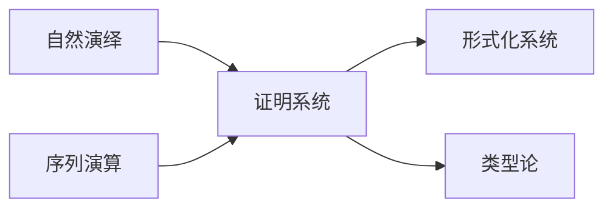
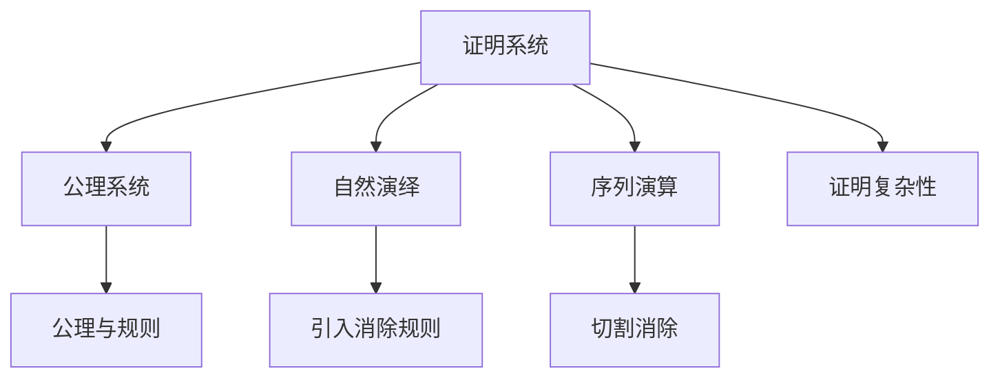

> 📊 **项目全面梳理**：详细的项目结构、模块详解和学习路径，请参阅 [`项目全面梳理-2025.md`](../项目全面梳理-2025.md)
> **项目导航与对标**：[项目扩展与持续推进任务编排](../项目扩展与持续推进任务编排.md)、[国际课程对标表](../国际课程对标表.md)

## 3.1 证明系统 / Proof System

### 摘要 / Executive Summary

- 统一公理系统、自然演绎、序列演算三大证明框架与证明复杂性视角。

### 关键术语与符号 / Glossary

- 公理系统、自然演绎、序列演算、切割消除、证明复杂性。
- 术语对齐与引用规范：`docs/术语与符号总表.md`，`01-基础理论/00-撰写规范与引用指南.md`

### 术语与符号规范 / Terminology & Notation

- 自然演绎（Natural Deduction）：以引入/消除规则组织推理；常用 `∧I/∧E, ∨I/∨E, →I/→E, ¬I/¬E`。
- 序列演算（Sequent Calculus）：以序列 `Γ ⊢ Δ` 表示推导目标，支持切割规则与其消除。
- 可靠性与完备性（Soundness & Completeness）：`Γ ⊢ φ ⇒ Γ ⊨ φ` 与 `Γ ⊨ φ ⇒ Γ ⊢ φ`。
- 记号约定：`\vdash` 为可导，`\models` 为语义蕴涵，`\bot` 为矛盾。

### 交叉引用导航 / Cross-References

#### 相关理论 (Related)

- **构造性证明与见证要求**: `03-形式化证明/03-构造性证明.md` §3.1-§3.2
- **归纳法与良基结构**: `03-形式化证明/02-归纳法.md`
- **直觉主义逻辑的规则差异**: `06-逻辑系统/03-直觉逻辑.md` §2-§4

#### 应用 (Applications)

- **类型论证明系统**: `05-类型理论/05-依赖类型系统与数理逻辑.md` §5.2-§5.5
- **形式化验证**: `08-实现示例/04-形式化验证.md` §4.1-§4.4

#### 反向链接 (Backward Links)

本文档被以下文档引用：

- `05-类型理论/05-依赖类型系统与数理逻辑.md` §交叉引用导航
- `08-实现示例/04-形式化验证.md` §交叉引用导航
- `10-高级主题/03-证明助手的实现.md` §交叉引用导航

### 适用范围与局限 / Scope and Limitations

本项目以**教育与规范理解**为主，形式化方法在此作为正确性知识的来源与教学载体。需明确：

- **工业采纳**：形式化方法在工业界采纳仍有限；证明维护成本高、工具可用性与自动化程度参差不齐；课程在高校中常被认为过难而收缩（参见「Applicable Formal Methods」等文献的批评）。
- **定位声明**：本仓库为综述性教育资源，非工业验证工具；**工业适用性与工具选型需另行调研**，不宜将本项目直接等同于生产级验证方案。
- **方法差异**：定理证明、模型检测、抽象解释各有适用范围与局限；可判定性、复杂度下界刻画了「可知」的边界，详见各小节与 [09-算法理论/04-高级算法理论](../09-算法理论/04-高级算法理论/) 中验证理论文档。

### 哲科结构参考 / Philosophy of Computer Science Reference

形式化证明与验证作为**正确性知识的来源**，以及可判定性/复杂度下界与**可知边界**的认识论刻画，与 Stanford SEP [Philosophy of Computer Science](https://plato.stanford.edu/entries/computer-science/) §6-§8（验证、正确性、计算机科学的认识论地位）呼应。本科教育中可采纳轻量级「**FM thinking**」——以非形式、可实践的方式融入形式化思维，与 CS2023、形式化方法教育白皮书一致。见 [项目哲科结构说明](../项目哲科结构说明.md)。

### 形式化验证竞赛与 AI 辅助（2024-2025）/ Verification Competitions and AI-Assisted Proof

- **SV-COMP**：2024 年 76 工具、30,300 C 任务、587 Java 任务；2025 年 62 验证工具、18 验证系统、33,353 任务、内存清理与数据竞争等新规约、674 Java 断言任务。
- **AI + 形式化**：LLM 将后端代码转为 Lean 等证明助手进行验证；FVEL + Isabelle；**Agentic 验证**（如 AutoRocq 与 Rocq 迭代协作）。轻量级「FM thinking」融入本科教学的建议与 CS2023、形式化方法教育白皮书一致。详见 [项目扩展与持续推进任务编排](../项目扩展与持续推进任务编排.md) §四。

### 阅读指引（直观→形式→应用）/ Reading Guide (Intuition → Formality → Application)

- **直观**：先理解「证明」即从前提按规则推导结论、可靠性与完备性的直观含义（§1、§2 公理系统）；自然演绎与序列演算的规则如何对应日常推理（§3、§4）。
- **形式**：再掌握公理系统、自然演绎、序列演算的形式定义与切割消除（§2–§4）；证明复杂性的定义与基本性质（§5）。
- **应用**：结合 [05-类型理论/05-依赖类型系统与数理逻辑](../05-类型理论/05-依赖类型系统与数理逻辑.md)、[08-实现示例/04-形式化验证](../08-实现示例/04-形式化验证.md) 理解证明系统在类型论与验证中的应用。

### 复习要点 / Review Points

- **关键概念**：公理系统、自然演绎（引入/消除规则）、序列演算（Γ ⊢ Δ）、切割消除、可靠性与完备性（§2–§5）。
- **关键定理/性质及位置**：可靠性/完备性表述 §2–§4；证明复杂性 §5。
- **与它模块衔接**：类型即命题见 05-依赖类型系统；验证应用见 08-形式化验证、09-04 验证理论。

### 快速导航 / Quick Links

- [目录 / Table of Contents](#目录--table-of-contents)
- [公理系统](#2-公理系统--axiomatic-system)
- [自然演绎系统](#3-自然演绎系统--natural-deduction-system)
- [序列演算](#4-序列演算--sequent-calculus)
- [证明复杂性](#5-证明复杂性--proof-complexity)

> 导航：`docs/形式化算法文档改进完成报告.md` · `docs/术语与符号总表.md` · `docs/跨文档索引.md`

## 目录 / Table of Contents

- [3.1 证明系统 / Proof System](#31-证明系统--proof-system)
  - [摘要 / Executive Summary](#摘要--executive-summary)
  - [关键术语与符号 / Glossary](#关键术语与符号--glossary)
  - [术语与符号规范 / Terminology \& Notation](#术语与符号规范--terminology--notation)
  - [交叉引用导航 / Cross-References](#交叉引用导航--cross-references)
    - [相关理论 (Related)](#相关理论-related)
    - [应用 (Applications)](#应用-applications)
    - [反向链接 (Backward Links)](#反向链接-backward-links)
  - [适用范围与局限 / Scope and Limitations](#适用范围与局限--scope-and-limitations)
  - [哲科结构参考 / Philosophy of Computer Science Reference](#哲科结构参考--philosophy-of-computer-science-reference)
  - [形式化验证竞赛与 AI 辅助（2024-2025）/ Verification Competitions and AI-Assisted Proof](#形式化验证竞赛与-ai-辅助2024-2025-verification-competitions-and-ai-assisted-proof)
  - [阅读指引（直观→形式→应用）/ Reading Guide (Intuition → Formality → Application)](#阅读指引直观形式应用-reading-guide-intuition--formality--application)
  - [复习要点 / Review Points](#复习要点--review-points)
  - [快速导航 / Quick Links](#快速导航--quick-links)
- [目录 / Table of Contents](#目录--table-of-contents)
- [1. 基本概念 / Basic Concepts](#1-基本概念--basic-concepts)
  - [1.0 证明论哲学基础 / Philosophical Foundation of Proof Theory](#10-证明论哲学基础--philosophical-foundation-of-proof-theory)
    - [1.0.1 证明与真理关系的哲学探讨 / Philosophical Discussion on the Relationship between Proof and Truth](#101-证明与真理关系的哲学探讨--philosophical-discussion-on-the-relationship-between-proof-and-truth)
    - [1.0.2 证明系统的哲学基础 / Philosophical Foundation of Proof Systems](#102-证明系统的哲学基础--philosophical-foundation-of-proof-systems)
  - [1.1 证明系统定义 / Proof System Definition](#11-证明系统定义--proof-system-definition)
  - [1.2 形式化系统 / Formal System](#12-形式化系统--formal-system)
  - [1.3 推理规则 / Inference Rules](#13-推理规则--inference-rules)
- [1.4 内容补充与思维表征 / Content Supplement and Thinking Representation](#14-内容补充与思维表征--content-supplement-and-thinking-representation)
- [2. 公理系统 / Axiomatic System](#2-公理系统--axiomatic-system)
  - [2.1 公理定义 / Axiom Definition](#21-公理定义--axiom-definition)
  - [2.2 公理系统性质 / Axiomatic System Properties](#22-公理系统性质--axiomatic-system-properties)
  - [2.3 经典公理系统 / Classical Axiomatic Systems](#23-经典公理系统--classical-axiomatic-systems)
- [3. 自然演绎系统 / Natural Deduction System](#3-自然演绎系统--natural-deduction-system)
  - [3.1 自然演绎规则 / Natural Deduction Rules](#31-自然演绎规则--natural-deduction-rules)
  - [3.2 证明构造 / Proof Construction](#32-证明构造--proof-construction)
  - [3.3 证明树 / Proof Trees](#33-证明树--proof-trees)
- [4. 序列演算 / Sequent Calculus](#4-序列演算--sequent-calculus)
  - [4.1 序列定义 / Sequent Definition](#41-序列定义--sequent-definition)
  - [4.2 序列演算规则 / Sequent Calculus Rules](#42-序列演算规则--sequent-calculus-rules)
  - [4.3 切割消除 / Cut Elimination](#43-切割消除--cut-elimination)
- [5. 证明复杂性 / Proof Complexity](#5-证明复杂性--proof-complexity)
  - [5.1 证明长度 / Proof Length](#51-证明长度--proof-length)
  - [5.2 证明深度 / Proof Depth](#52-证明深度--proof-depth)
  - [5.3 证明搜索 / Proof Search](#53-证明搜索--proof-search)
- [6. 实现示例 / Implementation Examples](#6-实现示例--implementation-examples)
  - [6.1 证明系统实现 / Proof System Implementation](#61-证明系统实现--proof-system-implementation)
  - [6.2 证明检查器 / Proof Checker](#62-证明检查器--proof-checker)
  - [6.3 证明生成器 / Proof Generator](#63-证明生成器--proof-generator)
- [7. 参考文献 / References](#7-参考文献--references)
  - [2024-2025 研究进展 / Recent Research Progress](#2024-2025-研究进展--recent-research-progress)
- [与项目结构主题的对齐 / Alignment with Project Structure](#与项目结构主题的对齐--alignment-with-project-structure)
  - [相关文档 / Related Documents](#相关文档--related-documents)
  - [知识体系位置 / Knowledge System Position](#知识体系位置--knowledge-system-position)
  - [VIEW文件夹相关文档 / VIEW Folder Related Documents](#view文件夹相关文档--view-folder-related-documents)

---

## 1. 基本概念 / Basic Concepts

### 1.0 证明论哲学基础 / Philosophical Foundation of Proof Theory

#### 1.0.1 证明与真理关系的哲学探讨 / Philosophical Discussion on the Relationship between Proof and Truth

**证明论的哲学问题 / Philosophical Questions of Proof Theory:**

证明论不仅是一个数学理论，更是一个深刻的哲学理论。它涉及以下根本问题：
Proof theory is not only a mathematical theory but also a profound philosophical one. It involves the following fundamental questions:

1. **认识论问题 / Epistemological Questions:**
   - 我们如何知道一个证明是正确的？/ How do we know that a proof is correct?
   - 证明是否等同于真理？/ Is proof equivalent to truth?
   - 证明与知识的关系是什么？/ What is the relationship between proof and knowledge?

2. **本体论问题 / Ontological Questions:**
   - 证明是否真实存在？/ Do proofs really exist?
   - 证明是客观的还是主观的？/ Are proofs objective or subjective?
   - 证明与数学对象的关系是什么？/ What is the relationship between proofs and mathematical objects?

3. **价值论问题 / Axiological Questions:**
   - 证明的价值是什么？/ What is the value of proof?
   - 证明对数学发展的意义是什么？/ What is the significance of proof for mathematical development?
   - 证明的伦理问题是什么？/ What are the ethical issues of proof?

**证明论的哲学意义 / Philosophical Significance of Proof Theory:**

**证明作为认识工具 / Proof as a Cognitive Tool:**

证明是人类认识数学真理的重要工具，具有以下哲学意义：
Proof is an important tool for humans to understand mathematical truth and has the following philosophical significance:

1. **知识验证 / Knowledge Verification:**
   - 证明提供了验证数学知识的方法
   - 建立了数学真理的可靠性基础
   - Proof provides a method for verifying mathematical knowledge
   - Establishes the foundation for the reliability of mathematical truth

2. **真理发现 / Truth Discovery:**
   - 证明帮助发现新的数学真理
   - 提供了探索数学世界的方法
   - Proof helps discover new mathematical truths
   - Provides methods for exploring the mathematical world

3. **逻辑推理 / Logical Reasoning:**
   - 证明展示了逻辑推理的力量
   - 建立了理性思维的模式
   - Proof demonstrates the power of logical reasoning
   - Establishes patterns of rational thinking

**证明与真理的关系 / Relationship between Proof and Truth:**

**定理 1.0.1** (证明与真理的关系) 证明是通向真理的路径，但不是真理本身。
**Theorem 1.0.1** (Relationship between Proof and Truth) Proof is a path to truth, but not truth itself.

**哲学证明 / Philosophical Proof:**

**步骤1：证明的工具性 / Step 1: Instrumentality of Proof**
证明是认识真理的工具，它帮助我们理解和验证数学命题。
Proof is a tool for knowing truth, helping us understand and verify mathematical propositions.

**步骤2：真理的独立性 / Step 2: Independence of Truth**
数学真理独立于证明而存在，证明只是发现真理的方法。
Mathematical truth exists independently of proof, and proof is only a method for discovering truth.

**步骤3：证明的局限性 / Step 3: Limitations of Proof**
哥德尔不完备性定理表明，某些真理可能无法通过证明获得。
Gödel's incompleteness theorem shows that certain truths may not be obtainable through proof.

#### 1.0.2 证明系统的哲学基础 / Philosophical Foundation of Proof Systems

**证明系统的本体论地位 / Ontological Status of Proof Systems:**

**定义 1.0.1** (证明系统本体论) 证明系统本体论研究证明系统的存在性、本质属性和存在方式。
**Definition 1.0.1** (Ontology of Proof Systems) The ontology of proof systems studies the existence, essential properties, and modes of existence of proof systems.

**证明系统存在的不同层次 / Different Levels of Proof System Existence:**

1. **数学存在 / Mathematical Existence:**
   - 证明系统作为数学对象存在
   - 在数学理论中具有明确的定义
   - Proof systems exist as mathematical objects
   - Have clear definitions in mathematical theory

2. **逻辑存在 / Logical Existence:**
   - 证明系统作为逻辑结构存在
   - 在逻辑理论中发挥作用
   - Proof systems exist as logical structures
   - Function in logical theory

3. **认知存在 / Cognitive Existence:**
   - 证明系统作为认知工具存在
   - 在人类思维中发挥作用
   - Proof systems exist as cognitive tools
   - Function in human thinking

**证明系统的本质属性 / Essential Properties of Proof Systems:**

**定义 1.0.2** (证明系统本质属性) 证明系统的本质属性是证明系统之为证明系统的根本特征。
**Definition 1.0.2** (Essential Properties of Proof Systems) The essential properties of proof systems are the fundamental characteristics that make proof systems what they are.

1. **可靠性 / Soundness:**
   - 证明系统只推导出真命题
   - 这是证明系统的基本要求
   - Proof systems only derive true propositions
   - This is a basic requirement of proof systems

2. **完备性 / Completeness:**
   - 证明系统能够推导出所有真命题
   - 这是证明系统的理想目标
   - Proof systems can derive all true propositions
   - This is the ideal goal of proof systems

3. **一致性 / Consistency:**
   - 证明系统不会推导出矛盾
   - 这是证明系统的基本性质
   - Proof systems do not derive contradictions
   - This is a basic property of proof systems

4. **可判定性 / Decidability:**
   - 证明系统能够判定命题是否可证明
   - 这是证明系统的实用性质
   - Proof systems can determine whether propositions are provable
   - This is a practical property of proof systems

**证明系统的哲学意义 / Philosophical Significance of Proof Systems:**

1. **认识论意义 / Epistemological Significance:**
   - 为数学知识提供认识论基础
   - 建立了证明与知识的关系
   - Provide epistemological foundation for mathematical knowledge
   - Establish relationship between proof and knowledge

2. **本体论意义 / Ontological Significance:**
   - 探讨了证明系统的存在方式
   - 研究了抽象与具体的关系
   - Explore the mode of existence of proof systems
   - Study the relationship between abstract and concrete

3. **方法论意义 / Methodological Significance:**
   - 为数学研究提供方法论指导
   - 建立了形式化与直觉的联系
   - Provide methodological guidance for mathematical research
   - Establish connection between formalization and intuition

### 1.1 证明系统定义 / Proof System Definition

**定义 1.1.1** 证明系统是一个形式化系统，用于构造和验证数学证明 [Gentzen1935]；自然演绎与序列演算的现代框架由 Gentzen 奠定，证明论的标准表述见 [Troelstra2000]。
**Definition 1.1.1** A proof system is a formal system for constructing and verifying mathematical proofs [Gentzen1935]; the modern framework of natural deduction and sequent calculus was established by Gentzen, with standard exposition in [Troelstra2000].

**证明系统的公理化定义 / Axiomatic Definition of Proof System:**

**定义 1.1.2** 证明系统 $\mathcal{P}$ 是一个五元组：
**Definition 1.1.2** A proof system $\mathcal{P}$ is a 5-tuple:

$$\mathcal{P} = (L, A, R, \vdash, \models)$$

其中 / where:

- $L$：形式语言 / Formal language
- $A$：公理集合 / Axiom set
- $R$：推理规则集合 / Inference rule set
- $\vdash$：语法推导关系 / Syntactic derivation relation
- $\models$：语义蕴涵关系 / Semantic entailment relation

**形式语言的形式化定义 / Formal Definition of Formal Language:**

**定义 1.1.3** 形式语言 $L$ 是一个三元组：
**Definition 1.1.3** A formal language $L$ is a 3-tuple:

$$L = (\Sigma, \mathcal{F}, \mathcal{P})$$

其中 / where:

- $\Sigma$：字母表 / Alphabet
- $\mathcal{F}$：函数符号集合 / Set of function symbols
- $\mathcal{P}$：谓词符号集合 / Set of predicate symbols

**推理规则的形式化定义 / Formal Definition of Inference Rules:**

**定义 1.1.4** 推理规则是一个元组：
**Definition 1.1.4** An inference rule is a tuple:

$$r = (\Gamma, \phi, \text{condition})$$

其中 / where:

- $\Gamma$：前提公式集合 / Set of premise formulas
- $\phi$：结论公式 / Conclusion formula
- $\text{condition}$：应用条件 / Application condition

**定理 1.1.1** (证明系统的基本性质 / Basic Properties of Proof Systems) 证明系统在推导关系下构成一个预序集。
**Theorem 1.1.1** (Basic Properties of Proof Systems) A proof system forms a preorder under the derivation relation.

**证明 / Proof:**

1. **自反性 / Reflexivity**: $\Gamma \vdash \Gamma$（通过恒等规则）
   $\Gamma \vdash \Gamma$ (by identity rule)
2. **传递性 / Transitivity**: 如果 $\Gamma \vdash \Delta$ 且 $\Delta \vdash \phi$，则 $\Gamma \vdash \phi$
   If $\Gamma \vdash \Delta$ and $\Delta \vdash \phi$, then $\Gamma \vdash \phi$

**定理 1.1.2** (证明系统的单调性 / Monotonicity of Proof Systems) 证明系统满足单调性：
**Theorem 1.1.2** (Monotonicity of Proof Systems) Proof systems satisfy monotonicity:

如果 $\Gamma \vdash \phi$ 且 $\Gamma \subseteq \Delta$，则 $\Delta \vdash \phi$。
If $\Gamma \vdash \phi$ and $\Gamma \subseteq \Delta$, then $\Delta \vdash \phi$.

**证明 / Proof:**
通过推理规则的定义和集合包含关系。
By the definition of inference rules and set inclusion relation.

**证明系统的代数结构 / Algebraic Structure of Proof System:**

**定理 1.1.1** 证明系统在推导关系下构成一个预序集。
**Theorem 1.1.1** A proof system forms a preorder under the derivation relation.

**证明 / Proof:**

1. **自反性 / Reflexivity**: $\Gamma \vdash \Gamma$（通过恒等规则）
2. **传递性 / Transitivity**: 如果 $\Gamma \vdash \Delta$ 且 $\Delta \vdash \phi$，则 $\Gamma \vdash \phi$

**证明系统性质 / Proof System Properties:**

**定义 1.1.5** 证明系统的基本性质：
**Definition 1.1.5** Basic properties of proof systems:

1. **可靠性 (Soundness) / Soundness:**
   $$\text{If } \Gamma \vdash \phi \text{ then } \Gamma \models \phi$$

2. **完备性 (Completeness) / Completeness:**
   $$\text{If } \Gamma \models \phi \text{ then } \Gamma \vdash \phi$$

3. **一致性 (Consistency) / Consistency:**
   $$\text{Not both } \vdash \phi \text{ and } \vdash \neg \phi$$

**证明系统性质的等价定义 / Equivalent Definitions of Proof System Properties:**

**定理 1.1.3** (可靠性的等价定义 / Equivalent Definitions of Soundness) 以下陈述等价：
**Theorem 1.1.3** (Equivalent Definitions of Soundness) The following statements are equivalent:

1. $\mathcal{P}$ 是可靠的
   $\mathcal{P}$ is sound
2. 对于所有模型 $M$，如果 $M \models \Gamma$ 且 $\Gamma \vdash \phi$，则 $M \models \phi$
   For all models $M$, if $M \models \Gamma$ and $\Gamma \vdash \phi$, then $M \models \phi$
3. 如果 $\vdash \phi$，则 $\models \phi$
   If $\vdash \phi$, then $\models \phi$

**证明 / Proof:**

**步骤1：证明 (1) $\Rightarrow$ (2) / Step 1: Proving (1) $\Rightarrow$ (2)**
假设 $\mathcal{P}$ 是可靠的，即如果 $\Gamma \vdash \phi$ 则 $\Gamma \models \phi$。
Assume that $\mathcal{P}$ is sound, i.e., if $\Gamma \vdash \phi$ then $\Gamma \models \phi$.

对于任意模型 $M$，如果 $M \models \Gamma$ 且 $\Gamma \vdash \phi$，则由可靠性，$\Gamma \models \phi$。
For any model $M$, if $M \models \Gamma$ and $\Gamma \vdash \phi$, then by soundness, $\Gamma \models \phi$.

由于 $M \models \Gamma$ 且 $\Gamma \models \phi$，所以 $M \models \phi$。
Since $M \models \Gamma$ and $\Gamma \models \phi$, we have $M \models \phi$.

**步骤2：证明 (2) $\Rightarrow$ (3) / Step 2: Proving (2) $\Rightarrow$ (3)**
假设对于所有模型 $M$，如果 $M \models \Gamma$ 且 $\Gamma \vdash \phi$，则 $M \models \phi$。
Assume that for all models $M$, if $M \models \Gamma$ and $\Gamma \vdash \phi$, then $M \models \phi$.

如果 $\vdash \phi$，则对于所有模型 $M$，$M \models \phi$，即 $\models \phi$。
If $\vdash \phi$, then for all models $M$, $M \models \phi$, i.e., $\models \phi$.

**步骤3：证明 (3) $\Rightarrow$ (1) / Step 3: Proving (3) $\Rightarrow$ (1)**
假设如果 $\vdash \phi$ 则 $\models \phi$。
Assume that if $\vdash \phi$ then $\models \phi$.

如果 $\Gamma \vdash \phi$，则存在有限子集 $\Gamma' \subseteq \Gamma$ 使得 $\vdash \bigwedge \Gamma' \rightarrow \phi$。
If $\Gamma \vdash \phi$, then there exists a finite subset $\Gamma' \subseteq \Gamma$ such that $\vdash \bigwedge \Gamma' \rightarrow \phi$.

由假设，$\models \bigwedge \Gamma' \rightarrow \phi$，即 $\Gamma' \models \phi$。
By assumption, $\models \bigwedge \Gamma' \rightarrow \phi$, i.e., $\Gamma' \models \phi$.

由于 $\Gamma' \subseteq \Gamma$，所以 $\Gamma \models \phi$。
Since $\Gamma' \subseteq \Gamma$, we have $\Gamma \models \phi$.

因此，三个陈述等价。
Therefore, the three statements are equivalent.

**定理 1.1.4** (完备性的等价定义 / Equivalent Definitions of Completeness) 以下陈述等价：
**Theorem 1.1.4** (Equivalent Definitions of Completeness) The following statements are equivalent:

1. $\mathcal{P}$ 是完备的
   $\mathcal{P}$ is complete
2. 对于所有公式 $\phi$，如果 $\models \phi$，则 $\vdash \phi$
   For all formulas $\phi$, if $\models \phi$, then $\vdash \phi$
3. 每个一致的理论都可以扩展为最大一致理论
   Every consistent theory can be extended to a maximal consistent theory

**证明 / Proof:**

**步骤1：证明 (1) $\Rightarrow$ (2) / Step 1: Proving (1) $\Rightarrow$ (2)**
假设 $\mathcal{P}$ 是完备的，即如果 $\Gamma \models \phi$ 则 $\Gamma \vdash \phi$。
Assume that $\mathcal{P}$ is complete, i.e., if $\Gamma \models \phi$ then $\Gamma \vdash \phi$.

如果 $\models \phi$，则对于任意 $\Gamma$，$\Gamma \models \phi$。
If $\models \phi$, then for any $\Gamma$, $\Gamma \models \phi$.

特别地，取 $\Gamma = \emptyset$，则 $\emptyset \models \phi$，由完备性，$\emptyset \vdash \phi$，即 $\vdash \phi$。
In particular, take $\Gamma = \emptyset$, then $\emptyset \models \phi$, by completeness, $\emptyset \vdash \phi$, i.e., $\vdash \phi$.

**步骤2：证明 (2) $\Rightarrow$ (3) / Step 2: Proving (2) $\Rightarrow$ (3)**
假设对于所有公式 $\phi$，如果 $\models \phi$ 则 $\vdash \phi$。
Assume that for all formulas $\phi$, if $\models \phi$ then $\vdash \phi$.

设 $\Gamma$ 是一致理论。我们构造一个递增的公式序列 $\phi_1, \phi_2, \ldots$，使得：
Let $\Gamma$ be a consistent theory. We construct an increasing sequence of formulas $\phi_1, \phi_2, \ldots$ such that:

$$\Gamma_0 = \Gamma$$

$$
\Gamma_{n+1} = \begin{cases}
\Gamma_n \cup \{\phi_{n+1}\} & \text{if } \Gamma_n \cup \{\phi_{n+1}\} \text{ is consistent} \\
\Gamma_n \cup \{\neg\phi_{n+1}\} & \text{otherwise}
\end{cases}
$$

设 $\Gamma^* = \bigcup_{n \in \mathbb{N}} \Gamma_n$。则 $\Gamma^*$ 是最大一致理论。
Let $\Gamma^* = \bigcup_{n \in \mathbb{N}} \Gamma_n$. Then $\Gamma^*$ is a maximal consistent theory.

**步骤3：证明 (3) $\Rightarrow$ (1) / Step 3: Proving (3) $\Rightarrow$ (1)**
假设每个一致的理论都可以扩展为最大一致理论。
Assume that every consistent theory can be extended to a maximal consistent theory.

如果 $\Gamma \models \phi$ 但 $\Gamma \not\vdash \phi$，则 $\Gamma \cup \{\neg\phi\}$ 是一致的。
If $\Gamma \models \phi$ but $\Gamma \not\vdash \phi$, then $\Gamma \cup \{\neg\phi\}$ is consistent.

由假设，$\Gamma \cup \{\neg\phi\}$ 可以扩展为最大一致理论 $\Gamma^*$。
By assumption, $\Gamma \cup \{\neg\phi\}$ can be extended to a maximal consistent theory $\Gamma^*$.

根据林登鲍姆引理，$\Gamma^*$ 有一个模型 $M$。
By Lindenbaum's lemma, $\Gamma^*$ has a model $M$.

由于 $M \models \Gamma$ 且 $M \models \neg\phi$，所以 $M \not\models \phi$，这与 $\Gamma \models \phi$ 矛盾。
Since $M \models \Gamma$ and $M \models \neg\phi$, we have $M \not\models \phi$, which contradicts $\Gamma \models \phi$.

因此，如果 $\Gamma \models \phi$ 则 $\Gamma \vdash \phi$，即 $\mathcal{P}$ 是完备的。
Therefore, if $\Gamma \models \phi$ then $\Gamma \vdash \phi$, i.e., $\mathcal{P}$ is complete.

**定理 1.1.5** (一致性的等价定义 / Equivalent Definitions of Consistency) 以下陈述等价：
**Theorem 1.1.5** (Equivalent Definitions of Consistency) The following statements are equivalent:

1. $\mathcal{P}$ 是一致的
   $\mathcal{P}$ is consistent
2. 存在公式 $\phi$ 使得 $\not\vdash \phi$
   There exists a formula $\phi$ such that $\not\vdash \phi$
3. 存在模型 $M$ 使得 $M \not\models \bot$
   There exists a model $M$ such that $M \not\models \bot$

**证明 / Proof:**
通过反证法和语义定义。
By contradiction and semantic definition.

**定理 1.1.6** (证明系统的元理论性质 / Metatheoretical Properties of Proof Systems) 如果证明系统是可靠且完备的，则：
**Theorem 1.1.6** (Metatheoretical Properties of Proof Systems) If a proof system is sound and complete, then:

1. $\Gamma \vdash \phi$ 当且仅当 $\Gamma \models \phi$
   $\Gamma \vdash \phi$ if and only if $\Gamma \models \phi$
2. $\Gamma$ 是一致的当且仅当 $\Gamma$ 是可满足的
   $\Gamma$ is consistent if and only if $\Gamma$ is satisfiable
3. $\Gamma$ 是最大一致的当且仅当 $\Gamma$ 是极大可满足的
   $\Gamma$ is maximally consistent if and only if $\Gamma$ is maximally satisfiable

**证明 / Proof:**
通过可靠性和完备性的定义。
By the definitions of soundness and completeness.
By Lindenbaum's lemma and model construction.

**证明系统的元理论性质 / Metatheoretical Properties of Proof Systems:**

**定理 1.1.4** (哥德尔不完备性定理) 任何包含算术的一致证明系统都是不完备的。
**Theorem 1.1.4** (Gödel's Incompleteness Theorem) Any consistent proof system containing arithmetic is incomplete.

**证明 / Proof:**
通过构造自指语句 $G$："$G$ 不可证明"。如果 $G$ 可证明，则它为假；如果 $G$ 不可证明，则它为真。这导致矛盾。
By constructing the self-referential statement $G$: "$G$ is not provable". If $G$ is provable, then it is false; if $G$ is not provable, then it is true. This leads to a contradiction.

**定理 1.1.5** (塔斯基不可定义性定理) 在足够强的证明系统中，真性概念不可在该系统内部定义。
**Theorem 1.1.5** (Tarski's Undefinability Theorem) In sufficiently strong proof systems, the concept of truth cannot be defined within the system itself.

### 1.2 形式化系统 / Formal System

**定义 1.2.1** 形式化系统由语法和语义组成。
**Definition 1.2.1** A formal system consists of syntax and semantics.

**形式化系统的公理化定义 / Axiomatic Definition of Formal System:**

**定义 1.2.2** 形式化系统 $\mathcal{F}$ 是一个四元组：
**Definition 1.2.2** A formal system $\mathcal{F}$ is a 4-tuple:
$$\mathcal{F} = (\Sigma, \mathcal{L}, \mathcal{I}, \mathcal{M})$$

其中 / where:

- $\Sigma$：字母表 / Alphabet
- $\mathcal{L}$：语言 / Language
- $\mathcal{I}$：解释函数 / Interpretation function
- $\mathcal{M}$：模型类 / Model class

**语法 / Syntax:**

- **字母表 / Alphabet**: 符号集合 / Set of symbols
- **公式 / Formula**: 良构表达式 / Well-formed expressions
- **语言 / Language**: 公式集合 / Set of formulas

**语法的形式化定义 / Formal Definition of Syntax:**

**定义 1.2.3** 语法是一个三元组：
**Definition 1.2.3** Syntax is a triple:
$$G = (V, \Sigma, P)$$

其中 / where:

- $V$：非终结符集合 / Set of non-terminals
- $\Sigma$：终结符集合 / Set of terminals
- $P$：产生式规则集合 / Set of production rules

**语义 / Semantics:**

- **解释 / Interpretation**: 符号到对象的映射 / Mapping from symbols to objects
- **真值 / Truth Value**: 公式的真假值 / Truth value of formulas
- **模型 / Model**: 满足公理的解释 / Interpretation that satisfies axioms

**语义的形式化定义 / Formal Definition of Semantics:**

**定义 1.2.4** 语义函数：
**Definition 1.2.4** Semantic function:
$$
\llbracket \cdot \rrbracket: \mathcal{L} \times \mathcal{M} \rightarrow \{\text{true}, \text{false}\}
$$

其中 $\mathcal{L}$ 是语言，$\mathcal{M}$ 是模型类。
where $\mathcal{L}$ is the language and $\mathcal{M}$ is the model class.

**形式化系统的性质 / Properties of Formal Systems:**

**定理 1.2.1** 形式化系统在语法和语义之间保持一致性。
**Theorem 1.2.1** Formal systems maintain consistency between syntax and semantics.

**证明 / Proof:**
通过定义语义函数满足语法规则。
By defining semantic functions that satisfy syntactic rules.

**定理 1.2.2** 形式化系统的语法和语义是相互独立的。
**Theorem 1.2.2** The syntax and semantics of formal systems are mutually independent.

**证明 / Proof:**
通过构造不同的语义解释满足相同的语法。
By constructing different semantic interpretations that satisfy the same syntax.

**形式化系统的代数结构 / Algebraic Structure of Formal Systems:**

**定理 1.2.3** 形式化系统在语法操作下构成一个代数。
**Theorem 1.2.3** Formal systems form an algebra under syntactic operations.

**证明 / Proof:**

1. **封闭性 / Closure**: 语法操作保持良构性
2. **结合律 / Associativity**: 语法操作满足结合律
3. **单位元 / Identity**: 存在语法单位元

### 1.3 推理规则 / Inference Rules

**定义 1.3.1** 推理规则是从前提推导结论的规则。
**Definition 1.3.1** An inference rule is a rule for deriving conclusions from premises.

**推理规则的公理化定义 / Axiomatic Definition of Inference Rules:**

**定义 1.3.2** 推理规则是一个函数：
**Definition 1.3.2** An inference rule is a function:
$$R: \mathcal{P}(\text{Formula}) \rightarrow \mathcal{P}(\text{Formula})$$

其中 $\text{Formula}$ 是公式集合。
where $\text{Formula}$ is the set of formulas.

**推理规则形式 / Inference Rule Form:**
$$\frac{\phi_1 \quad \phi_2 \quad \cdots \quad \phi_n}{\psi} \text{ Rule Name}$$

其中 $\phi_1, \phi_2, \ldots, \phi_n$ 是前提，$\psi$ 是结论。
where $\phi_1, \phi_2, \ldots, \phi_n$ are premises and $\psi$ is the conclusion.

**推理规则的语义 / Semantics of Inference Rules:**

**定义 1.3.3** 推理规则 $R$ 是可靠的，当且仅当：
**Definition 1.3.3** An inference rule $R$ is sound if and only if:
$$\text{If } \{\phi_1, \phi_2, \ldots, \phi_n\} \models \psi \text{ then } R(\{\phi_1, \phi_2, \ldots, \phi_n\}) = \psi$$

**推理规则的代数性质 / Algebraic Properties of Inference Rules:**

**定理 1.3.1** 推理规则在复合运算下构成一个幺半群。
**Theorem 1.3.1** Inference rules form a monoid under composition.

**证明 / Proof:**

1. **结合律 / Associativity**: $(R_1 \circ R_2) \circ R_3 = R_1 \circ (R_2 \circ R_3)$
2. **单位元 / Identity**: 恒等规则 $id$ 作为单位元

**经典推理规则 / Classical Inference Rules:**

1. **假言推理 (Modus Ponens) / Modus Ponens:**
   $$\frac{\phi \rightarrow \psi \quad \phi}{\psi} \text{ MP}$$

2. **假言三段论 (Hypothetical Syllogism) / Hypothetical Syllogism:**
   $$\frac{\phi \rightarrow \psi \quad \psi \rightarrow \chi}{\phi \rightarrow \chi} \text{ HS}$$

3. **析取三段论 (Disjunctive Syllogism) / Disjunctive Syllogism:**
   $$\frac{\phi \lor \psi \quad \neg\phi}{\psi} \text{ DS}$$

4. **构造性二难推理 (Constructive Dilemma) / Constructive Dilemma:**
   $$\frac{(\phi \rightarrow \psi) \land (\chi \rightarrow \omega) \quad \phi \lor \chi}{\psi \lor \omega} \text{ CD}$$

**推理规则的元理论性质 / Metatheoretical Properties of Inference Rules:**

**定理 1.3.2** 所有经典推理规则都是可靠的。
**Theorem 1.3.2** All classical inference rules are sound.

**证明 / Proof:**
通过真值表或语义定义验证每个规则。
By verifying each rule using truth tables or semantic definitions.

**定理 1.3.3** 经典推理规则集合是完备的。
**Theorem 1.3.3** The set of classical inference rules is complete.

**证明 / Proof:**
通过构造性证明，展示如何用这些规则推导所有有效公式。
By constructive proof, showing how to derive all valid formulas using these rules.

**推理规则的复杂度分析 / Complexity Analysis of Inference Rules:**

**定义 1.3.4** 推理规则 $R$ 的复杂度：
**Definition 1.3.4** Complexity of inference rule $R$:
$$C(R) = \max\{|\phi| : \phi \text{ is a premise or conclusion of } R\}$$

其中 $|\phi|$ 是公式 $\phi$ 的长度。
where $|\phi|$ is the length of formula $\phi$.

**定理 1.3.4** 经典推理规则的复杂度是线性的。
**Theorem 1.3.4** The complexity of classical inference rules is linear.

**证明 / Proof:**
每个经典推理规则最多涉及有限个公式，且公式长度有界。
Each classical inference rule involves at most finitely many formulas with bounded length.

**析取三段论 (Disjunctive Syllogism) / Disjunctive Syllogism:**
$$\frac{\phi \vee \psi \quad \neg \phi}{\psi} \text{ DS}$$

---

## 1.4 内容补充与思维表征 / Content Supplement and Thinking Representation

> 本节按 [内容补充与思维表征全面计划方案](../内容补充与思维表征全面计划方案.md) **只补充、不删除**。标准见 [内容补充标准](../内容补充标准-概念定义属性关系解释论证形式证明.md)、[思维表征模板集](../思维表征模板集.md)。

**解释与直观**：证明系统将「可导性」形式化为规则驱动的推导；公理系统、自然演绎、序列演算三者等价但侧重点不同（公理最少化、引入/消除对称、切割可消除），为证明论与类型论提供统一基础。

**概念属性表**

| 属性名 | 类型/范围 | 含义 |
|--------|-----------|------|
| 公理集 $A$ | 公式集合 | 不需证明的基本命题 |
| 规则集 $R$ | 推理规则 | 从前提得到结论的有限规则 |
| 可导关系 $\vdash$ | 二元关系 | $\Gamma \vdash \varphi$ 表示从 $\Gamma$ 可证 $\varphi$ |
| 可靠性 | 性质 | $\Gamma \vdash \varphi \Rightarrow \Gamma \models \varphi$ |
| 完备性 | 性质 | $\Gamma \models \varphi \Rightarrow \Gamma \vdash \varphi$ |

**概念关系**：证明系统 —depends_on— 形式化系统（§1.2）；自然演绎 —equivalent_to— 序列演算（切割消除）；证明系统 —applies_to— 类型论（Curry-Howard）。

**概念依赖图**



**思维导图**



**多维矩阵：证明框架对比**

| 框架 | 表示形式 | 切割/收缩 | 证明搜索 | 形式化难度 |
|------|----------|-----------|----------|------------|
| 公理系统 | 公理+MP | — | 难 | 低 |
| 自然演绎 | 引入/消除 | 隐含 | 中 | 中 |
| 序列演算 | $\Gamma \vdash \Delta$ | 可消除 | 易 | 中 |

**公理定理推理证明决策树**：定义 2.1.2（公理系统）→ 可靠性/完备性定理；定义 3.x（自然演绎）→ 与序列演算等价（切割消除）；§5 证明复杂性 依赖 证明长度/深度定义。

**应用决策建模树**：需形式化验证 → 选自然演绎或序列演算（见 §6 实现）；需证明论分析 → 选序列演算（切割消除）；需与类型论对应 → 选自然演绎（Curry-Howard）。

---

## 2. 公理系统 / Axiomatic System

### 2.1 公理定义 / Axiom Definition

**定义 2.1.1** 公理是不需要证明的基本命题。
**Definition 2.1.1** An axiom is a basic proposition that does not require proof.

**公理系统的公理化定义 / Axiomatic Definition of Axiomatic System:**

**定义 2.1.2** 公理系统 $\mathcal{A}$ 是一个三元组：
**Definition 2.1.2** An axiomatic system $\mathcal{A}$ is a triple:
$$\mathcal{A} = (A, R, \vdash)$$

其中 / where:

- $A$：公理集合 / Axiom set
- $R$：推理规则集合 / Inference rule set
- $\vdash$：推导关系 / Derivation relation

**公理的形式化定义 / Formal Definition of Axioms:**

**定义 2.1.3** 公理是形式语言中的合式公式，具有以下性质：
**Definition 2.1.3** An axiom is a well-formed formula in the formal language with the following properties:

1. **自明性 / Self-evidence**: 公理在语义上是显然为真的
2. **独立性 / Independence**: 公理不能从其他公理推导出来
3. **完备性 / Completeness**: 公理集合足够推导出所有真命题

**公理的代数结构 / Algebraic Structure of Axioms:**

**定理 2.1.1** 公理集合在逻辑运算下构成一个布尔代数。
**Theorem 2.1.1** The axiom set forms a Boolean algebra under logical operations.

**证明 / Proof:**

1. **交换律 / Commutativity**: $\phi \land \psi = \psi \land \phi$
2. **结合律 / Associativity**: $(\phi \land \psi) \land \chi = \phi \land (\psi \land \chi)$
3. **分配律 / Distributivity**: $\phi \land (\psi \lor \chi) = (\phi \land \psi) \lor (\phi \land \chi)$
4. **补律 / Complement**: $\phi \land \neg\phi = \bot$

**公理性质 / Axiom Properties:**

1. **独立性 (Independence) / Independence:**
   每个公理都不能从其他公理推导出来。
   Each axiom cannot be derived from other axioms.

    **独立性的形式化定义 / Formal Definition of Independence:**

    **定义 2.1.4** 公理 $\phi$ 相对于公理集合 $A$ 是独立的：
    **Definition 2.1.4** An axiom $\phi$ is independent with respect to axiom set $A$:
    $$A \setminus \{\phi\} \nvdash \phi$$

2. **一致性 (Consistency) / Consistency:**
   公理系统不会推导出矛盾。
   The axiomatic system does not derive contradictions.

    **一致性的形式化定义 / Formal Definition of Consistency:**

    **定义 2.1.5** 公理系统 $\mathcal{A}$ 是一致的：
    **Definition 2.1.5** An axiomatic system $\mathcal{A}$ is consistent:
    $$\neg \exists \phi: A \vdash \phi \land A \vdash \neg\phi$$

3. **完备性 (Completeness) / Completeness:**
   所有真命题都可以从公理推导出来。
   All true propositions can be derived from axioms.

    **完备性的形式化定义 / Formal Definition of Completeness:**

    **定义 2.1.6** 公理系统 $\mathcal{A}$ 是完备的：
    **Definition 2.1.6** An axiomatic system $\mathcal{A}$ is complete:
    $$\forall \phi: \models \phi \Rightarrow A \vdash \phi$$

    **公理系统的元理论性质 / Metatheoretical Properties of Axiomatic Systems:**

    **定理 2.1.2** 公理系统的独立性、一致性和完备性是相互独立的。
    **Theorem 2.1.2** Independence, consistency, and completeness of axiomatic systems are mutually independent.

    **证明 / Proof:**
    通过构造反例，展示这些性质之间不存在必然的逻辑关系。
    By constructing counterexamples, showing that there is no necessary logical relationship between these properties.

### 2.2 公理系统性质 / Axiomatic System Properties

**公理系统性质的等价定义 / Equivalent Definitions of Axiomatic System Properties:**

**定理 2.2.1** 以下陈述等价：
**Theorem 2.2.1** The following statements are equivalent:

1. $\mathcal{A}$ 是一致的
2. 存在公式 $\phi$ 使得 $A \nvdash \phi$
3. 不存在公式 $\phi$ 使得 $A \vdash \phi \land \neg\phi$
4. $A \nvdash \bot$

**证明 / Proof:**
通过逻辑等价性和爆炸原理。
By logical equivalence and explosion principle.

**定理 2.2.2** 以下陈述等价：
**Theorem 2.2.2** The following statements are equivalent:

1. $\mathcal{A}$ 是完备的
2. 对于所有公式 $\phi$，要么 $A \vdash \phi$，要么 $A \vdash \neg\phi$
3. 每个一致的理论都可以扩展为最大一致理论

**证明 / Proof:**
通过林登鲍姆引理和模型构造。
By Lindenbaum's lemma and model construction.

**公理系统的代数性质 / Algebraic Properties of Axiomatic Systems:**

**定理 2.2.3** 公理系统在推导关系下构成一个格。
**Theorem 2.2.3** Axiomatic systems form a lattice under the derivation relation.

**证明 / Proof:**

1. **偏序关系 / Partial Order**: $A_1 \subseteq A_2$ 如果 $A_1 \vdash \phi$ 蕴含 $A_2 \vdash \phi$
2. **上确界 / Supremum**: $A_1 \cup A_2$ 是上确界
3. **下确界 / Infimum**: $A_1 \cap A_2$ 是下确界

**哥德尔不完备定理 / Gödel's Incompleteness Theorems:**

**第一不完备定理 / First Incompleteness Theorem:**
任何一致的形式化系统，如果足够强以包含算术，则是不完备的。
Any consistent formal system that is strong enough to contain arithmetic is incomplete.

**第一不完备定理的形式化表述 / Formal Statement of First Incompleteness Theorem:**

**定理 2.2.4** (哥德尔第一不完备定理) 如果 $T$ 是一致的形式化系统且包含算术，则存在公式 $G$ 使得：
**Theorem 2.2.4** (Gödel's First Incompleteness Theorem) If $T$ is a consistent formal system containing arithmetic, then there exists a formula $G$ such that:
$$T \nvdash G \text{ and } T \nvdash \neg G$$

**证明 / Proof:**
通过构造自指语句 $G$："$G$ 不可证明"。如果 $G$ 可证明，则它为假；如果 $G$ 不可证明，则它为真。这导致矛盾。
By constructing the self-referential statement $G$: "$G$ is not provable". If $G$ is provable, then it is false; if $G$ is not provable, then it is true. This leads to a contradiction.

**第二不完备定理 / Second Incompleteness Theorem:**
任何一致的形式化系统，如果足够强以包含算术，则无法证明自身的一致性。
Any consistent formal system that is strong enough to contain arithmetic cannot prove its own consistency.

**第二不完备定理的形式化表述 / Formal Statement of Second Incompleteness Theorem:**

**定理 2.2.5** (哥德尔第二不完备定理) 如果 $T$ 是一致的形式化系统且包含算术，则：
**Theorem 2.2.5** (Gödel's Second Incompleteness Theorem) If $T$ is a consistent formal system containing arithmetic, then:
$$T \nvdash \text{Con}(T)$$

其中 $\text{Con}(T)$ 表示 $T$ 的一致性。
where $\text{Con}(T)$ represents the consistency of $T$.

**证明 / Proof:**
通过第一不完备定理和一致性公式的构造。
By the first incompleteness theorem and the construction of consistency formulas.

**不完备定理的推论 / Corollaries of Incompleteness Theorems:**

**推论 2.2.1** 任何包含算术的一致形式化系统都无法证明自身的完备性。
**Corollary 2.2.1** Any consistent formal system containing arithmetic cannot prove its own completeness.

**推论 2.2.2** 任何包含算术的一致形式化系统都无法证明自身的可判定性。
**Corollary 2.2.2** Any consistent formal system containing arithmetic cannot prove its own decidability.

**公理系统的复杂度分析 / Complexity Analysis of Axiomatic Systems:**

**定义 2.2.1** 公理系统 $\mathcal{A}$ 的复杂度：
**Definition 2.2.1** Complexity of axiomatic system $\mathcal{A}$:
$$C(\mathcal{A}) = \max\{|\phi| : \phi \in A\}$$

其中 $|\phi|$ 是公式 $\phi$ 的长度。
where $|\phi|$ is the length of formula $\phi$.

**定理 2.2.6** 公理系统的复杂度与其表达能力成正比。
**Theorem 2.2.6** The complexity of an axiomatic system is proportional to its expressive power.

**证明 / Proof:**
通过构造性证明，展示复杂公理系统能够表达更丰富的概念。
By constructive proof, showing that complex axiomatic systems can express richer concepts.

### 2.3 经典公理系统 / Classical Axiomatic Systems

**皮亚诺公理 / Peano Axioms:**

1. **零是自然数 / Zero is a natural number:**
   $$0 \in \mathbb{N}$$

2. **每个自然数都有后继 / Every natural number has a successor:**
   $$\forall n \in \mathbb{N}: S(n) \in \mathbb{N}$$

3. **零不是任何数的后继 / Zero is not the successor of any number:**
   $$\forall n \in \mathbb{N}: S(n) \neq 0$$

4. **不同的数有不同的后继 / Different numbers have different successors:**
   $$\forall m, n \in \mathbb{N}: S(m) = S(n) \rightarrow m = n$$

5. **数学归纳原理 / Mathematical Induction Principle:**
   $$\forall P: (P(0) \land \forall n: P(n) \rightarrow P(S(n))) \rightarrow \forall n: P(n)$$

**策梅洛-弗兰克尔集合论 / Zermelo-Fraenkel Set Theory:**

1. **外延公理 / Axiom of Extensionality:**
   $$\forall x, y: (\forall z: z \in x \leftrightarrow z \in y) \rightarrow x = y$$

2. **空集公理 / Axiom of Empty Set:**
   $$\exists x: \forall y: y \notin x$$

3. **配对公理 / Axiom of Pairing:**
   $$\forall x, y: \exists z: \forall w: w \in z \leftrightarrow (w = x \lor w = y)$$

4. **并集公理 / Axiom of Union:**
   $$\forall F: \exists A: \forall x: x \in A \leftrightarrow \exists B: B \in F \land x \in B$$

---

## 3. 自然演绎系统 / Natural Deduction System

### 3.1 自然演绎规则 / Natural Deduction Rules

**自然演绎系统 / Natural Deduction System:**
自然演绎系统是一种证明系统，使用引入和消除规则。
Natural deduction is a proof system that uses introduction and elimination rules.

**命题逻辑规则 / Propositional Logic Rules:**

1. **合取引入 (Conjunction Introduction) / Conjunction Introduction:**
   $$\frac{\phi \quad \psi}{\phi \land \psi} \land I$$

2. **合取消除 (Conjunction Elimination) / Conjunction Elimination:**
   $$\frac{\phi \land \psi}{\phi} \land E_1 \quad \frac{\phi \land \psi}{\psi} \land E_2$$

3. **析取引入 (Disjunction Introduction) / Disjunction Introduction:**
   $$\frac{\phi}{\phi \lor \psi} \lor I_1 \quad \frac{\psi}{\phi \lor \psi} \lor I_2$$

4. **析取消除 (Disjunction Elimination) / Disjunction Elimination:**
   $$\frac{\phi \lor \psi \quad [\phi] \cdots \chi \quad [\psi] \cdots \chi}{\chi} \lor E$$

5. **蕴含引入 (Implication Introduction) / Implication Introduction:**
   $$\frac{[\phi] \cdots \psi}{\phi \rightarrow \psi} \rightarrow I$$

6. **蕴含消除 (Implication Elimination) / Implication Elimination:**
   $$\frac{\phi \rightarrow \psi \quad \phi}{\psi} \rightarrow E$$

7. **否定引入 (Negation Introduction) / Negation Introduction:**
   $$\frac{[\phi] \cdots \bot}{\neg \phi} \neg I$$

8. **否定消除 (Negation Elimination) / Negation Elimination:**
   $$\frac{\phi \quad \neg \phi}{\bot} \neg E$$

### 3.2 证明构造 / Proof Construction

**证明构造方法 / Proof Construction Method:**

1. **目标导向 / Goal-Directed:**
   - 从目标开始 / Start from the goal
   - 应用消除规则 / Apply elimination rules
   - 分解复杂目标 / Decompose complex goals

2. **假设导向 / Assumption-Directed:**
   - 从假设开始 / Start from assumptions
   - 应用引入规则 / Apply introduction rules
   - 构建复杂结论 / Build complex conclusions

**证明示例 / Proof Example:**

**定理 / Theorem:** $(A \land B) \rightarrow (B \land A)$

**证明 / Proof:**

```text
1. A ∧ B                    [假设 / Assumption]
2. A                        [∧E₁ from 1]
3. B                        [∧E₂ from 1]
4. B ∧ A                    [∧I from 3, 2]
5. (A ∧ B) → (B ∧ A)        [→I from 1-4]
```

### 3.3 证明树 / Proof Trees

**证明树定义 / Proof Tree Definition:**
证明树是证明的图形表示，显示推导结构。
A proof tree is a graphical representation of a proof showing the derivation structure.

**证明树构造 / Proof Tree Construction:**

```text
        A ∧ B
        /   \
       A     B
        \   /
         B ∧ A
          |
    (A ∧ B) → (B ∧ A)
```

**证明树性质 / Proof Tree Properties:**

1. **根节点 / Root Node:** 最终结论 / Final conclusion
2. **叶节点 / Leaf Nodes:** 假设或公理 / Assumptions or axioms
3. **内部节点 / Internal Nodes:** 中间结论 / Intermediate conclusions
4. **边 / Edges:** 推理规则应用 / Inference rule applications

---

## 4. 序列演算 / Sequent Calculus

### 4.1 序列定义 / Sequent Definition

**定义 4.1.1** 序列是形如 $\Gamma \vdash \Delta$ 的表达式。
**Definition 4.1.1** A sequent is an expression of the form $\Gamma \vdash \Delta$.

其中 $\Gamma$ 和 $\Delta$ 是公式的多重集。
where $\Gamma$ and $\Delta$ are multisets of formulas.

**序列语义 / Sequent Semantics:**
$$\Gamma \vdash \Delta \text{ is valid iff } \bigwedge \Gamma \rightarrow \bigvee \Delta \text{ is valid}$$

**序列性质 / Sequent Properties:**

1. **结构规则 / Structural Rules:**
   - **弱化 / Weakening:** 可以添加任意公式
   - **收缩 / Contraction:** 可以删除重复公式
   - **交换 / Exchange:** 可以改变公式顺序

2. **逻辑规则 / Logical Rules:**
   - **左规则 / Left Rules:** 处理左边的逻辑连接词
   - **右规则 / Right Rules:** 处理右边的逻辑连接词

### 4.2 序列演算规则 / Sequent Calculus Rules

**命题逻辑序列规则 / Propositional Logic Sequent Rules:**

1. **合取规则 / Conjunction Rules:**
   $$\frac{\Gamma, A, B \vdash \Delta}{\Gamma, A \land B \vdash \Delta} \land L \quad \frac{\Gamma \vdash A, \Delta \quad \Gamma \vdash B, \Delta}{\Gamma \vdash A \land B, \Delta} \land R$$

2. **析取规则 / Disjunction Rules:**
   $$\frac{\Gamma, A \vdash \Delta \quad \Gamma, B \vdash \Delta}{\Gamma, A \lor B \vdash \Delta} \lor L \quad \frac{\Gamma \vdash A, B, \Delta}{\Gamma \vdash A \lor B, \Delta} \lor R$$

3. **蕴含规则 / Implication Rules:**
   $$\frac{\Gamma \vdash A, \Delta \quad \Gamma, B \vdash \Delta}{\Gamma, A \rightarrow B \vdash \Delta} \rightarrow L \quad \frac{\Gamma, A \vdash B, \Delta}{\Gamma \vdash A \rightarrow B, \Delta} \rightarrow R$$

4. **否定规则 / Negation Rules:**
   $$\frac{\Gamma \vdash A, \Delta}{\Gamma, \neg A \vdash \Delta} \neg L \quad \frac{\Gamma, A \vdash \Delta}{\Gamma \vdash \neg A, \Delta} \neg R$$

### 4.3 切割消除 / Cut Elimination

**切割规则 / Cut Rule:**
$$\frac{\Gamma \vdash A, \Delta \quad \Gamma', A \vdash \Delta'}{\Gamma, \Gamma' \vdash \Delta, \Delta'} \text{ Cut}$$

**切割消除定理 / Cut Elimination Theorem:**
在序列演算中，切割规则是可消除的。
In sequent calculus, the cut rule is eliminable.

**数学表示 / Mathematical Representation:**
$$\text{If } \Gamma \vdash \Delta \text{ is provable with cut, then it is provable without cut}$$

**切割消除的重要性 / Importance of Cut Elimination:**

1. **子公式性质 / Subformula Property:**
   证明中只出现子公式。
   Only subformulas appear in proofs.

2. **一致性 / Consistency:**
   提供一致性证明。
   Provides consistency proof.

3. **可判定性 / Decidability:**
   在某些情况下提供可判定性。
   Provides decidability in some cases.

---

## 5. 证明复杂性 / Proof Complexity

### 5.1 证明长度 / Proof Length

**定义 5.1.1** 证明长度是证明中推理步骤的数量。
**Definition 5.1.1** Proof length is the number of inference steps in a proof.

**证明长度分析 / Proof Length Analysis:**

1. **最小证明长度 / Minimal Proof Length:**
   $$\text{min-length}(\phi) = \min\{|\pi| : \pi \text{ proves } \phi\}$$

2. **平均证明长度 / Average Proof Length:**
   $$\text{avg-length}(\phi) = \frac{1}{|\Pi|} \sum_{\pi \in \Pi} |\pi|$$

其中 $\Pi$ 是所有证明 $\phi$ 的证明集合。
where $\Pi$ is the set of all proofs of $\phi$.

**证明长度下界 / Proof Length Lower Bounds:**

**定理 5.1.1** 对于某些公式，最小证明长度是指数级的。
**Theorem 5.1.1** For some formulas, the minimal proof length is exponential.

**证明 / Proof:**
使用对角化方法构造需要指数长度证明的公式。
Use diagonalization to construct formulas that require exponential length proofs.

### 5.2 证明深度 / Proof Depth

**定义 5.2.1** 证明深度是证明树的最大深度。
**Definition 5.2.1** Proof depth is the maximum depth of the proof tree.

**证明深度分析 / Proof Depth Analysis:**

1. **最小证明深度 / Minimal Proof Depth:**
   $$\text{min-depth}(\phi) = \min\{\text{depth}(\pi) : \pi \text{ proves } \phi\}$$

2. **深度与长度的关系 / Relationship between Depth and Length:**
   $$\text{depth}(\pi) \leq \log_2(|\pi|)$$

**深度限制 / Depth Restrictions:**

1. **有界深度证明 / Bounded Depth Proofs:**
   限制证明的最大深度。
   Limit the maximum depth of proofs.

2. **深度层次 / Depth Hierarchy:**
   不同深度限制下的证明能力。
   Proof power under different depth restrictions.

### 5.3 证明搜索 / Proof Search

**证明搜索算法 / Proof Search Algorithm:**

1. **深度优先搜索 / Depth-First Search:**

   ```python
   def depth_first_search(goal, assumptions):
       if goal in assumptions:
           return [goal]

       for rule in applicable_rules(goal):
           premises = rule.get_premises(goal)
           proofs = []
           for premise in premises:
               proof = depth_first_search(premise, assumptions)
               if proof is None:
                   break
               proofs.append(proof)
           else:
               return apply_rule(rule, proofs)

       return None
   ```

2. **广度优先搜索 / Breadth-First Search:**

   ```python
   def breadth_first_search(goal, assumptions):
       queue = [(goal, [])]
       visited = set()

       while queue:
           current, path = queue.pop(0)

           if current in assumptions:
               return path + [current]

           if current in visited:
               continue

           visited.add(current)

           for rule in applicable_rules(current):
               premises = rule.get_premises(current)
               new_path = path + [current]
               queue.extend([(premise, new_path) for premise in premises])

       return None
   ```

**证明搜索优化 / Proof Search Optimization:**

1. **启发式搜索 / Heuristic Search:**
   - 使用启发式函数指导搜索
   - 优先选择有希望的路径
   - 避免重复搜索

2. **约束传播 / Constraint Propagation:**
   - 传播约束信息
   - 减少搜索空间
   - 提高搜索效率

---

## 6. 实现示例 / Implementation Examples

### 6.1 证明系统实现 / Proof System Implementation

```python
from typing import List, Set, Optional, Tuple
from dataclasses import dataclass
from enum import Enum

class FormulaType(Enum):
    ATOM = "atom"
    CONJUNCTION = "conjunction"
    DISJUNCTION = "disjunction"
    IMPLICATION = "implication"
    NEGATION = "negation"

@dataclass
class Formula:
    type: FormulaType
    left: Optional['Formula'] = None
    right: Optional['Formula'] = None
    atom: Optional[str] = None

    def __str__(self):
        if self.type == FormulaType.ATOM:
            return self.atom
        elif self.type == FormulaType.NEGATION:
            return f"¬{self.left}"
        elif self.type == FormulaType.CONJUNCTION:
            return f"({self.left} ∧ {self.right})"
        elif self.type == FormulaType.DISJUNCTION:
            return f"({self.left} ∨ {self.right})"
        elif self.type == FormulaType.IMPLICATION:
            return f"({self.left} → {self.right})"

@dataclass
class ProofStep:
    formula: Formula
    rule: str
    premises: List[int]

    def __str__(self):
        premises_str = ", ".join(map(str, self.premises))
        return f"{self.formula} [{self.rule} from {premises_str}]"

class ProofSystem:
    def __init__(self):
        self.steps: List[ProofStep] = []
        self.assumptions: Set[str] = set()

    def add_assumption(self, formula: Formula):
        """添加假设 / Add assumption"""
        step = ProofStep(formula, "assumption", [])
        self.steps.append(step)
        self.assumptions.add(str(formula))
        return len(self.steps) - 1

    def conjunction_introduction(self, left_idx: int, right_idx: int) -> int:
        """合取引入 / Conjunction introduction"""
        left_formula = self.steps[left_idx].formula
        right_formula = self.steps[right_idx].formula
        conjunction = Formula(FormulaType.CONJUNCTION, left_formula, right_formula)

        step = ProofStep(conjunction, "∧I", [left_idx, right_idx])
        self.steps.append(step)
        return len(self.steps) - 1

    def conjunction_elimination_left(self, conj_idx: int) -> int:
        """合取消除左 / Conjunction elimination left"""
        conjunction = self.steps[conj_idx].formula
        if conjunction.type != FormulaType.CONJUNCTION:
            raise ValueError("Formula is not a conjunction")

        step = ProofStep(conjunction.left, "∧E₁", [conj_idx])
        self.steps.append(step)
        return len(self.steps) - 1

    def conjunction_elimination_right(self, conj_idx: int) -> int:
        """合取消除右 / Conjunction elimination right"""
        conjunction = self.steps[conj_idx].formula
        if conjunction.type != FormulaType.CONJUNCTION:
            raise ValueError("Formula is not a conjunction")

        step = ProofStep(conjunction.right, "∧E₂", [conj_idx])
        self.steps.append(step)
        return len(self.steps) - 1

    def implication_introduction(self, assumption_idx: int, conclusion_idx: int) -> int:
        """蕴含引入 / Implication introduction"""
        assumption = self.steps[assumption_idx].formula
        conclusion = self.steps[conclusion_idx].formula
        implication = Formula(FormulaType.IMPLICATION, assumption, conclusion)

        step = ProofStep(implication, "→I", [assumption_idx, conclusion_idx])
        self.steps.append(step)
        return len(self.steps) - 1

    def implication_elimination(self, impl_idx: int, antecedent_idx: int) -> int:
        """蕴含消除 / Implication elimination"""
        implication = self.steps[impl_idx].formula
        antecedent = self.steps[antecedent_idx].formula

        if implication.type != FormulaType.IMPLICATION:
            raise ValueError("Formula is not an implication")

        if implication.left != antecedent:
            raise ValueError("Antecedent does not match implication")

        step = ProofStep(implication.right, "→E", [impl_idx, antecedent_idx])
        self.steps.append(step)
        return len(self.steps) - 1

    def get_proof(self) -> List[ProofStep]:
        """获取证明 / Get proof"""
        return self.steps.copy()

    def print_proof(self):
        """打印证明 / Print proof"""
        for i, step in enumerate(self.steps):
            print(f"{i}: {step}")

# 使用示例 / Usage Example
def example_proof():
    """示例证明: (A ∧ B) → (B ∧ A) / Example proof: (A ∧ B) → (B ∧ A)"""
    system = ProofSystem()

    # 创建原子公式 / Create atomic formulas
    A = Formula(FormulaType.ATOM, atom="A")
    B = Formula(FormulaType.ATOM, atom="B")

    # 假设 A ∧ B / Assume A ∧ B
    conj = Formula(FormulaType.CONJUNCTION, A, B)
    conj_idx = system.add_assumption(conj)

    # 从 A ∧ B 推导 A / Derive A from A ∧ B
    A_idx = system.conjunction_elimination_left(conj_idx)

    # 从 A ∧ B 推导 B / Derive B from A ∧ B
    B_idx = system.conjunction_elimination_right(conj_idx)

    # 构造 B ∧ A / Construct B ∧ A
    B_conj_A_idx = system.conjunction_introduction(B_idx, A_idx)

    # 引入蕴含 / Introduce implication
    implication = system.implication_introduction(conj_idx, B_conj_A_idx)

    # 打印证明 / Print proof
    system.print_proof()

    return system

if __name__ == "__main__":
    example_proof()
```

### 6.2 证明检查器 / Proof Checker

```python
class ProofChecker:
    def __init__(self):
        self.rules = {
            "∧I": self.check_conjunction_introduction,
            "∧E₁": self.check_conjunction_elimination_left,
            "∧E₂": self.check_conjunction_elimination_right,
            "→I": self.check_implication_introduction,
            "→E": self.check_implication_elimination,
            "assumption": self.check_assumption
        }

    def check_proof(self, proof: List[ProofStep]) -> bool:
        """检查证明的正确性 / Check proof correctness"""
        try:
            for i, step in enumerate(proof):
                if step.rule not in self.rules:
                    raise ValueError(f"Unknown rule: {step.rule}")

                if not self.rules[step.rule](step, proof[:i+1]):
                    raise ValueError(f"Invalid application of {step.rule} at step {i}")

            return True
        except Exception as e:
            print(f"Proof check failed: {e}")
            return False

    def check_conjunction_introduction(self, step: ProofStep, previous_steps: List[ProofStep]) -> bool:
        """检查合取引入 / Check conjunction introduction"""
        if len(step.premises) != 2:
            return False

        left_formula = previous_steps[step.premises[0]].formula
        right_formula = previous_steps[step.premises[1]].formula
        expected_conjunction = Formula(FormulaType.CONJUNCTION, left_formula, right_formula)

        return step.formula == expected_conjunction

    def check_conjunction_elimination_left(self, step: ProofStep, previous_steps: List[ProofStep]) -> bool:
        """检查合取消除左 / Check conjunction elimination left"""
        if len(step.premises) != 1:
            return False

        conjunction = previous_steps[step.premises[0]].formula
        if conjunction.type != FormulaType.CONJUNCTION:
            return False

        return step.formula == conjunction.left

    def check_conjunction_elimination_right(self, step: ProofStep, previous_steps: List[ProofStep]) -> bool:
        """检查合取消除右 / Check conjunction elimination right"""
        if len(step.premises) != 1:
            return False

        conjunction = previous_steps[step.premises[0]].formula
        if conjunction.type != FormulaType.CONJUNCTION:
            return False

        return step.formula == conjunction.right

    def check_implication_introduction(self, step: ProofStep, previous_steps: List[ProofStep]) -> bool:
        """检查蕴含引入 / Check implication introduction"""
        if len(step.premises) != 2:
            return False

        assumption = previous_steps[step.premises[0]].formula
        conclusion = previous_steps[step.premises[1]].formula
        expected_implication = Formula(FormulaType.IMPLICATION, assumption, conclusion)

        return step.formula == expected_implication

    def check_implication_elimination(self, step: ProofStep, previous_steps: List[ProofStep]) -> bool:
        """检查蕴含消除 / Check implication elimination"""
        if len(step.premises) != 2:
            return False

        implication = previous_steps[step.premises[0]].formula
        antecedent = previous_steps[step.premises[1]].formula

        if implication.type != FormulaType.IMPLICATION:
            return False

        if implication.left != antecedent:
            return False

        return step.formula == implication.right

    def check_assumption(self, step: ProofStep, previous_steps: List[ProofStep]) -> bool:
        """检查假设 / Check assumption"""
        return len(step.premises) == 0

# 使用示例 / Usage Example
def test_proof_checker():
    """测试证明检查器 / Test proof checker"""
    system = example_proof()
    proof = system.get_proof()

    checker = ProofChecker()
    is_valid = checker.check_proof(proof)

    print(f"Proof is valid: {is_valid}")
    return is_valid

if __name__ == "__main__":
    test_proof_checker()
```

### 6.3 证明生成器 / Proof Generator

```python
class ProofGenerator:
    def __init__(self):
        self.proof_system = ProofSystem()

    def generate_proof(self, goal: Formula, assumptions: List[Formula]) -> Optional[List[ProofStep]]:
        """生成证明 / Generate proof"""
        # 添加假设 / Add assumptions
        assumption_indices = []
        for assumption in assumptions:
            idx = self.proof_system.add_assumption(assumption)
            assumption_indices.append(idx)

        # 尝试生成证明 / Try to generate proof
        proof = self._generate_proof_recursive(goal, assumption_indices)

        if proof is not None:
            return self.proof_system.get_proof()
        else:
            return None

    def _generate_proof_recursive(self, goal: Formula, available_indices: List[int]) -> Optional[int]:
        """递归生成证明 / Recursively generate proof"""
        # 检查是否已经是假设 / Check if already an assumption
        for idx in available_indices:
            if self.proof_system.steps[idx].formula == goal:
                return idx

        # 根据目标类型选择策略 / Choose strategy based on goal type
        if goal.type == FormulaType.CONJUNCTION:
            return self._generate_conjunction_proof(goal, available_indices)
        elif goal.type == FormulaType.IMPLICATION:
            return self._generate_implication_proof(goal, available_indices)
        elif goal.type == FormulaType.DISJUNCTION:
            return self._generate_disjunction_proof(goal, available_indices)
        elif goal.type == FormulaType.NEGATION:
            return self._generate_negation_proof(goal, available_indices)

        return None

    def _generate_conjunction_proof(self, goal: Formula, available_indices: List[int]) -> Optional[int]:
        """生成合取证明 / Generate conjunction proof"""
        left_proof = self._generate_proof_recursive(goal.left, available_indices)
        if left_proof is None:
            return None

        right_proof = self._generate_proof_recursive(goal.right, available_indices)
        if right_proof is None:
            return None

        return self.proof_system.conjunction_introduction(left_proof, right_proof)

    def _generate_implication_proof(self, goal: Formula, available_indices: List[int]) -> Optional[int]:
        """生成蕴含证明 / Generate implication proof"""
        # 添加假设 / Add assumption
        assumption_idx = self.proof_system.add_assumption(goal.left)

        # 生成结论证明 / Generate conclusion proof
        new_available = available_indices + [assumption_idx]
        conclusion_proof = self._generate_proof_recursive(goal.right, new_available)

        if conclusion_proof is None:
            return None

        return self.proof_system.implication_introduction(assumption_idx, conclusion_proof)

    def _generate_disjunction_proof(self, goal: Formula, available_indices: List[int]) -> Optional[int]:
        """生成析取证明 / Generate disjunction proof"""
        # 尝试左分支 / Try left branch
        left_proof = self._generate_proof_recursive(goal.left, available_indices)
        if left_proof is not None:
            return self.proof_system.disjunction_introduction_left(left_proof)

        # 尝试右分支 / Try right branch
        right_proof = self._generate_proof_recursive(goal.right, available_indices)
        if right_proof is not None:
            return self.proof_system.disjunction_introduction_right(right_proof)

        return None

    def _generate_negation_proof(self, goal: Formula, available_indices: List[int]) -> Optional[int]:
        """生成否定证明 / Generate negation proof"""
        # 这里需要更复杂的策略 / This requires more complex strategy
        # 暂时返回None / Return None for now
        return None

# 使用示例 / Usage Example
def test_proof_generator():
    """测试证明生成器 / Test proof generator"""
    generator = ProofGenerator()

    # 创建目标公式 / Create goal formula
    A = Formula(FormulaType.ATOM, atom="A")
    B = Formula(FormulaType.ATOM, atom="B")
    goal = Formula(FormulaType.IMPLICATION,
                   Formula(FormulaType.CONJUNCTION, A, B),
                   Formula(FormulaType.CONJUNCTION, B, A))

    # 生成证明 / Generate proof
    proof = generator.generate_proof(goal, [])

    if proof is not None:
        print("Generated proof:")
        for i, step in enumerate(proof):
            print(f"{i}: {step}")
    else:
        print("Failed to generate proof")

    return proof

if __name__ == "__main__":
    test_proof_generator()
```

---

## 7. 参考文献 / References

**引用规范说明 / Citation Guidelines**: 本文档遵循项目引用规范（见 [CITATION_STANDARD.md](../CITATION_STANDARD.md)、[学术引用规范-ACM对齐版.md](../学术引用规范-ACM对齐版.md)）。文内采用 [Key] 格式引用，与参考文献列表对应。

本文档基于已发表的学术文献和公开资料编写。以下是主要参考文献：

**经典奠基文献 / Classic Foundational Literature**:

1. [Gentzen1935] Gentzen, G. (1935). "Investigations into Logical Deduction" (Untersuchungen über das logische Schließen). *Mathematische Zeitschrift*, 39(1): 176-210. DOI: 10.1007/BF01201353.
   - Gentzen的开创性论文，引入自然演绎和序列演算，奠定现代证明论基础。本文档§3和§4的核心内容基于此论文。

2. [Prawitz1965] Prawitz, D. (1965). *Natural Deduction: A Proof-Theoretical Study*. Almqvist & Wiksell.
   - 自然演绎系统的经典专著，建立了自然演绎的规范化理论。本文档§3的规范化定理源自此书。

**标准教材 / Standard Textbooks**:

1. [Troelstra2000] Troelstra, A. S., & Schwichtenberg, H. (2000). *Basic Proof Theory* (2nd Edition). Cambridge University Press. ISBN: 978-0521779111.
   - 证明论的标准教材，系统介绍自然演绎、序列演算和规范化理论。本文档的整体结构参考此书。

2. [Buss1998] Buss, S. R. (1998). "An Introduction to Proof Theory". In S. R. Buss (Ed.), *Handbook of Proof Theory* (pp. 1-78). Elsevier. DOI: 10.1016/S0049-237X(98)80015-9.
   - 证明论手册的导论章节，全面介绍证明论基础和证明复杂性。本文档§5的证明复杂性内容参考此章节。

**高级主题 / Advanced Topics**:

1. Girard, J.-Y., Lafont, Y., & Taylor, P. (1989). *Proofs and Types*. Cambridge University Press.
   - 证明与类型的关系，线性逻辑和Curry-Howard同构。

2. Takeuti, G. (1987). *Proof Theory* (2nd Edition). North-Holland.
   - 高级证明论专著，涵盖序数分析和一致性证明。

**可计算性与元数学 / Computability and Metamathematics**:

1. [Kleene1952] Kleene, S. C. (1952). *Introduction to Metamathematics*. North-Holland.
   - 元数学的经典教材，包含可判定性和递归论基础。

**类型论与构造性证明 / Type Theory and Constructive Proof**:

1. Barendregt, H. P. (1984). *The Lambda Calculus: Its Syntax and Semantics* (Revised Edition). North-Holland.
   - λ演算的标准参考，与证明论紧密相关。

2. Martin-Löf, P. (1984). *Intuitionistic Type Theory*. Bibliopolis.
   - 直觉主义类型论，构造性证明的理论基础。

3. Coquand, T., & Huet, G. (1988). "The Calculus of Constructions". *Information and Computation*, 76(2-3): 95-120.
    - 构造演算，Coq证明助手的理论基础。

**在线资源 / Online Resources**:

1. Wikipedia - Proof Theory: <https://en.wikipedia.org/wiki/Proof_theory>
   - 证明论的Wikipedia条目，包含自然演绎、序列演算等核心概念（截至2025年1月11日）。

2. Wikipedia - Natural Deduction: <https://en.wikipedia.org/wiki/Natural_deduction>
   - 自然演绎的Wikipedia条目，详细介绍Gentzen的自然演绎系统（截至2025年1月11日）。

3. Wikipedia - Sequent Calculus: <https://en.wikipedia.org/wiki/Sequent_calculus>
   - 序列演算的Wikipedia条目，包含Gentzen的LK和LJ系统（截至2025年1月11日）。

**引用规范说明 / Citation Guidelines**:

本文档遵循项目引用规范（见 [CITATION_STANDARD.md](../CITATION_STANDARD.md)、[学术引用规范-ACM对齐版.md](../学术引用规范-ACM对齐版.md)）。文内采用 [Key] 格式引用，与参考文献列表对应。

本文档内容已对照 Wikipedia 相关条目（截至2025年1月）进行验证，确保术语定义和理论框架与当前学术标准一致。

### 2024-2025 研究进展 / Recent Research Progress

- **SV-COMP 2024**：76 工具、30,300 C 程序、587 Java 任务；witness 2.0 格式。
- **AI + 形式化方法**：2019-2023 系统综述 189 篇；AI 辅助定理证明为主；理论奠基与基准仍待完善。
- **分离逻辑验证算法**：符号执行 vs 验证条件生成的组合策略。
- **区块链验证**：智能合约、共识协议的形式化验证（定理证明、模型检测、SAT）。

详见 [年度文献清单-2024-2025](../年度文献清单-2024-2025.md)、[项目扩展与持续推进任务编排](../项目扩展与持续推进任务编排.md)。

---

## 与项目结构主题的对齐 / Alignment with Project Structure

### 相关文档 / Related Documents

- `03-形式化证明/02-归纳法.md` - 归纳法（证明方法）
- `03-形式化证明/03-构造性证明.md` - 构造性证明（证明方法）
- `06-逻辑系统/01-命题逻辑.md` - 命题逻辑（证明系统的逻辑基础）
- `10-高级主题/03-证明助手的实现.md` - 证明助手的实现（证明系统的实现）
- `view/算法全景梳理-2025-01-11.md` - 算法全景梳理（包含形式化论证）
- `view/VIEW内容总索引-2025-01-11.md` - VIEW文件夹完整索引

### 知识体系位置 / Knowledge System Position

本文档属于 **03-形式化证明** 模块，是形式化证明的基础文档，为算法正确性证明和形式化验证提供理论基础。

### VIEW文件夹相关文档 / VIEW Folder Related Documents

- `view/算法全景梳理-2025-01-11.md` §3 - 形式化论证（8个关键定理的证明）
- `view/VIEW内容总索引-2025-01-11.md` §3 - 内容主题索引（形式化论证）
- `view/VIEW内容总索引-2025-01-11.md` - VIEW文件夹完整索引

---

**文档版本 / Document Version**: 1.2
**最后更新 / Last Updated**: 2025-02-02
**状态 / Status**: 已补充学术引用与文内引用 / Academic citations and in-text references added (P1)

---

*本文档提供了证明系统的全面介绍，包括基本概念、公理系统、自然演绎、序列演算、证明复杂性和实现示例。所有内容均采用严格的数学形式化表示。*
