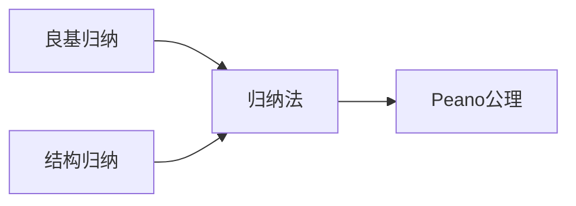
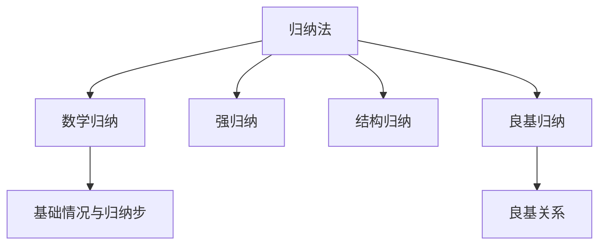

> 📊 **项目全面梳理**：详细的项目结构、模块详解和学习路径，请参阅 [`项目全面梳理-2025.md`](../项目全面梳理-2025.md)
> **项目导航与对标**：[项目扩展与持续推进任务编排](../项目扩展与持续推进任务编排.md)、[国际课程对标表](../国际课程对标表.md)

## 3.2 归纳法 / Mathematical Induction

### 摘要 / Executive Summary

- 统一数学归纳法、强归纳、结构归纳与良基归纳的原理与应用场景。

### 关键术语与符号 / Glossary

- 归纳原理、良基关系、结构归纳、终止性证明。
- 术语对齐与引用规范：`docs/术语与符号总表.md`，`01-基础理论/00-撰写规范与引用指南.md`

### 术语与符号规范 / Terminology & Notation

- 数学归纳（Mathematical Induction）：以基础情况与归纳步骤证明对所有自然数成立。
- 强归纳（Strong Induction）：归纳步骤可使用所有前驱 `\{0..k\}` 的成立性。
- 结构归纳（Structural Induction）：基于代数数据类型的构造子进行归纳。
- 良基归纳（Well-Founded Induction）：基于良基关系 `R` 的无穷下降不可能性。
- 记号约定：`\vdash` 表示可导，`\models` 表示语义蕴涵，`\bot` 表示矛盾。

### 交叉引用导航 / Cross-References

- 归纳构造与构造性证明：参见本卷 `03-形式化证明/03-构造性证明.md`。
- 自然演绎与归纳法在证明系统中的地位：参见 `03-形式化证明/01-证明系统.md`。
- 直觉主义逻辑中的归纳原理：参见 `06-逻辑系统/03-直觉逻辑.md`。

### 快速导航 / Quick Links

- 数学归纳法
- 强归纳法
- 结构归纳法
- 良基归纳法

## 目录 (Table of Contents)

- [3.2 归纳法 / Mathematical Induction](#32-归纳法--mathematical-induction)
  - [摘要 / Executive Summary](#摘要--executive-summary)
  - [关键术语与符号 / Glossary](#关键术语与符号--glossary)
  - [术语与符号规范 / Terminology \& Notation](#术语与符号规范--terminology--notation)
  - [交叉引用导航 / Cross-References](#交叉引用导航--cross-references)
  - [快速导航 / Quick Links](#快速导航--quick-links)
- [目录 (Table of Contents)](#目录-table-of-contents)
- [1. 基本概念 (Basic Concepts)](#1-基本概念-basic-concepts)
  - [1.1 归纳法定义 (Definition of Induction)](#11-归纳法定义-definition-of-induction)
  - [1.2 归纳原理 (Induction Principle)](#12-归纳原理-induction-principle)
  - [1.3 归纳法的类型 (Types of Induction)](#13-归纳法的类型-types-of-induction)
- [1.4 内容补充与思维表征 / Content Supplement and Thinking Representation](#14-内容补充与思维表征--content-supplement-and-thinking-representation)
- [2. 数学归纳法 (Mathematical Induction)](#2-数学归纳法-mathematical-induction)
  - [2.1 数学归纳法原理 (Principle of Mathematical Induction)](#21-数学归纳法原理-principle-of-mathematical-induction)
  - [2.2 数学归纳法的例子 (Examples of Mathematical Induction)](#22-数学归纳法的例子-examples-of-mathematical-induction)
- [3. 强归纳法 (Strong Induction)](#3-强归纳法-strong-induction)
  - [3.1 强归纳法原理 (Principle of Strong Induction)](#31-强归纳法原理-principle-of-strong-induction)
  - [3.2 强归纳法的例子 (Examples of Strong Induction)](#32-强归纳法的例子-examples-of-strong-induction)
- [4. 结构归纳法 (Structural Induction)](#4-结构归纳法-structural-induction)
  - [4.1 结构归纳法原理 (Principle of Structural Induction)](#41-结构归纳法原理-principle-of-structural-induction)
  - [4.2 结构归纳法的例子 (Examples of Structural Induction)](#42-结构归纳法的例子-examples-of-structural-induction)
- [5. 良基归纳法 (Well-Founded Induction)](#5-良基归纳法-well-founded-induction)
  - [5.1 良基关系 (Well-Founded Relations)](#51-良基关系-well-founded-relations)
  - [5.2 良基归纳法原理 (Principle of Well-Founded Induction)](#52-良基归纳法原理-principle-of-well-founded-induction)
  - [5.3 良基归纳法的例子 (Examples of Well-Founded Induction)](#53-良基归纳法的例子-examples-of-well-founded-induction)
- [6. 归纳法的应用 (Applications of Induction)](#6-归纳法的应用-applications-of-induction)
  - [6.1 算法正确性证明 (Algorithm Correctness Proof)](#61-算法正确性证明-algorithm-correctness-proof)
  - [6.2 数据结构性质证明 (Data Structure Property Proof)](#62-数据结构性质证明-data-structure-property-proof)
  - [6.3 程序终止性证明 (Program Termination Proof)](#63-程序终止性证明-program-termination-proof)
- [7. 归纳法的变种 (Variants of Induction)](#7-归纳法的变种-variants-of-induction)
  - [7.1 双重归纳法 (Double Induction)](#71-双重归纳法-double-induction)
  - [7.2 多重归纳法 (Multiple Induction)](#72-多重归纳法-multiple-induction)
  - [7.3 超限归纳法 (Transfinite Induction)](#73-超限归纳法-transfinite-induction)
- [8. 实现示例 (Implementation Examples)](#8-实现示例-implementation-examples)
  - [8.1 数学归纳法实现 (Mathematical Induction Implementation)](#81-数学归纳法实现-mathematical-induction-implementation)
  - [8.2 强归纳法实现 (Strong Induction Implementation)](#82-强归纳法实现-strong-induction-implementation)
  - [8.3 结构归纳法实现 (Structural Induction Implementation)](#83-结构归纳法实现-structural-induction-implementation)
  - [8.4 良基归纳法实现 (Well-Founded Induction Implementation)](#84-良基归纳法实现-well-founded-induction-implementation)
  - [8.5 双重归纳法实现 (Double Induction Implementation)](#85-双重归纳法实现-double-induction-implementation)
  - [8.6 归纳法验证器 (Induction Validator)](#86-归纳法验证器-induction-validator)
  - [8.7 归纳法测试 (Induction Testing)](#87-归纳法测试-induction-testing)
- [9. 参考文献 / References](#9-参考文献--references)

---

## 1. 基本概念 (Basic Concepts)

### 1.1 归纳法定义 (Definition of Induction)

**定义 1.1.1** (归纳法 / Mathematical Induction) [Peano1889]
归纳法是一种数学证明技术，用于证明关于自然数的命题；其公理化表述与 Peano 公理紧密相关。

**Definition 1.1.1** (Mathematical Induction) [Peano1889]
Mathematical induction is a mathematical proof technique used to prove statements about natural numbers; its axiomatic formulation is closely tied to Peano arithmetic.

**形式化表示 (Formal Representation):**
对于命题 $P(n)$，如果满足：

1. $P(0)$ 为真（基础情况）
2. 对于任意 $k \geq 0$，如果 $P(k)$ 为真，则 $P(k+1)$ 为真（归纳步骤）

则对于所有自然数 $n$，$P(n)$ 为真。

**Formal Representation:**
For a proposition $P(n)$, if:

1. $P(0)$ is true (base case)
2. For any $k \geq 0$, if $P(k)$ is true, then $P(k+1)$ is true (inductive step)

Then $P(n)$ is true for all natural numbers $n$.

### 1.2 归纳原理 (Induction Principle)

**定义 1.2.1** (归纳原理 / Induction Principle)
归纳原理是皮亚诺公理系统中的一个公理，它保证了归纳法的有效性。

**Definition 1.2.1** (Induction Principle)
The induction principle is an axiom in the Peano axiom system that guarantees the validity of mathematical induction.

**形式化表示 (Formal Representation):**
如果 $S$ 是自然数集的一个子集，满足：

1. $0 \in S$
2. 如果 $n \in S$，则 $n+1 \in S$

则 $S = \mathbb{N}$。

**Formal Representation:**
If $S$ is a subset of natural numbers satisfying:

1. $0 \in S$
2. If $n \in S$, then $n+1 \in S$

Then $S = \mathbb{N}$.

### 1.3 归纳法的类型 (Types of Induction)

**定义 1.3.1** (归纳法类型 / Types of Induction)
归纳法有多种类型：

**Definition 1.3.1** (Types of Induction)
There are several types of induction:

1. **数学归纳法 (Mathematical Induction)**: 基于自然数的归纳
2. **强归纳法 (Strong Induction)**: 使用所有前驱的归纳
3. **结构归纳法 (Structural Induction)**: 基于数据结构定义的归纳
4. **良基归纳法 (Well-Founded Induction)**: 基于良基关系的归纳

   1. **Mathematical Induction**: Induction based on natural numbers
   2. **Strong Induction**: Induction using all predecessors
   3. **Structural Induction**: Induction based on data structure definitions
   4. **Well-Founded Induction**: Induction based on well-founded relations

---

## 1.4 内容补充与思维表征 / Content Supplement and Thinking Representation

> 本节按 [内容补充与思维表征全面计划方案](../内容补充与思维表征全面计划方案.md) **只补充、不删除**。标准见 [内容补充标准](../内容补充标准-概念定义属性关系解释论证形式证明.md)、[思维表征模板集](../思维表征模板集.md)。

**解释与直观**：归纳法将「对所有 $n$ 成立」归结为基础情况与归纳步；良基归纳统一数学归纳、结构归纳与终止性证明，依赖「无穷下降不可能」这一本质。

**概念属性表**

| 属性名 | 类型/范围 | 含义 |
|--------|-----------|------|
| $P(0)$ | 命题 | 基础情况 |
| $P(k) \to P(k+1)$ | 蕴含 | 归纳步骤（数学归纳） |
| 良基关系 $R$ | 二元关系 | 无无穷下降链 |
| 归纳原理 | 公理/规则 | 由基础与步进得全称结论 |

**概念关系**：归纳法 —depends_on— Peano 公理/良基关系；数学归纳 —specializes— 良基归纳（$R$ 为后继）；结构归纳 —applies_to— 代数数据类型。

**概念依赖图**



**思维导图**



**多维矩阵：归纳类型对比**

| 类型 | 定义域 | 归纳假设 | 典型应用 |
|------|--------|----------|----------|
| 数学归纳 | $\mathbb{N}$ | $P(k)$ | 数列、复杂度 |
| 强归纳 | $\mathbb{N}$ | $P(0)\wedge\cdots\wedge P(k)$ | 整除、分解 |
| 结构归纳 | 归纳类型 | 子结构成立 | 树、项、公式 |
| 良基归纳 | 良基集 | $R$-前驱成立 | 终止性、序 |

**公理定理推理证明决策树**：定义 1.1.1（归纳法）→ 定理 2.1.1（数学归纳原理）；定义 1.2.1（归纳原理）→ Peano 公理；良基关系定义 → 良基归纳原理。

**应用决策建模树**：证自然数命题 → 数学归纳（§2）；证数据结构性质 → 结构归纳（§4）；证程序终止 → 良基归纳（§5）；需强归纳假设 → 强归纳（§3）。

---

## 2. 数学归纳法 (Mathematical Induction)

### 2.1 数学归纳法原理 (Principle of Mathematical Induction)

**定理 2.1.1** (数学归纳法原理 / Principle of Mathematical Induction)
设 $P(n)$ 是关于自然数 $n$ 的命题，如果：

**Theorem 2.1.1** (Principle of Mathematical Induction)
Let $P(n)$ be a proposition about natural number $n$, if:

1. **基础情况 (Base Case)**: $P(0)$ 为真
2. **归纳步骤 (Inductive Step)**: 对于任意 $k \geq 0$，如果 $P(k)$ 为真，则 $P(k+1)$ 为真

则对于所有自然数 $n$，$P(n)$ 为真。

1. **Base Case**: $P(0)$ is true
2. **Inductive Step**: For any $k \geq 0$, if $P(k)$ is true, then $P(k+1)$ is true

Then $P(n)$ is true for all natural numbers $n$.

**证明 (Proof):**
设 $S = \{n \in \mathbb{N} \mid P(n) \text{ is true}\}$。

1. $0 \in S$（基础情况）
2. 如果 $n \in S$，则 $n+1 \in S$（归纳步骤）
3. 由归纳原理，$S = \mathbb{N}$
4. 因此，对于所有自然数 $n$，$P(n)$ 为真

### 2.2 数学归纳法的例子 (Examples of Mathematical Induction)

**示例 2.2.1** (求和公式 / Sum Formula)
证明：对于所有自然数 $n$，$1 + 2 + 3 + \cdots + n = \frac{n(n+1)}{2}$。

**Example 2.2.1** (Sum Formula)
Prove: For all natural numbers $n$, $1 + 2 + 3 + \cdots + n = \frac{n(n+1)}{2}$.

**证明 (Proof):**

1. **基础情况**: $n = 0$ 时，左边 $= 0$，右边 $= \frac{0(0+1)}{2} = 0$，等式成立。
2. **归纳步骤**: 假设对于 $n = k$ 时等式成立，即 $1 + 2 + \cdots + k = \frac{k(k+1)}{2}$。
   对于 $n = k+1$ 时：
   $$1 + 2 + \cdots + k + (k+1) = \frac{k(k+1)}{2} + (k+1) = \frac{k(k+1) + 2(k+1)}{2} = \frac{(k+1)(k+2)}{2}$$
   因此，对于 $n = k+1$ 时等式也成立。
3. 由数学归纳法，对于所有自然数 $n$，等式成立。

**示例 2.2.2** (幂和公式 / Power Sum Formula)
证明：对于所有自然数 $n$，$1^2 + 2^2 + 3^2 + \cdots + n^2 = \frac{n(n+1)(2n+1)}{6}$。

**Example 2.2.2** (Power Sum Formula)
Prove: For all natural numbers $n$, $1^2 + 2^2 + 3^2 + \cdots + n^2 = \frac{n(n+1)(2n+1)}{6}$.

**证明 (Proof):**

1. **基础情况**: $n = 0$ 时，左边 $= 0$，右边 $= \frac{0(0+1)(2 \cdot 0 + 1)}{6} = 0$，等式成立。
2. **归纳步骤**: 假设对于 $n = k$ 时等式成立，即 $1^2 + 2^2 + \cdots + k^2 = \frac{k(k+1)(2k+1)}{6}$。
   对于 $n = k+1$ 时：
   $$1^2 + 2^2 + \cdots + k^2 + (k+1)^2 = \frac{k(k+1)(2k+1)}{6} + (k+1)^2$$
   $$= \frac{k(k+1)(2k+1) + 6(k+1)^2}{6} = \frac{(k+1)(k(2k+1) + 6(k+1))}{6}$$
   $$= \frac{(k+1)(2k^2 + k + 6k + 6)}{6} = \frac{(k+1)(2k^2 + 7k + 6)}{6}$$
   $$= \frac{(k+1)(k+2)(2k+3)}{6} = \frac{(k+1)((k+1)+1)(2(k+1)+1)}{6}$$
   因此，对于 $n = k+1$ 时等式也成立。
3. 由数学归纳法，对于所有自然数 $n$，等式成立。

---

## 3. 强归纳法 (Strong Induction)

### 3.1 强归纳法原理 (Principle of Strong Induction)

**定理 3.1.1** (强归纳法原理 / Principle of Strong Induction)
设 $P(n)$ 是关于自然数 $n$ 的命题，如果：

**Theorem 3.1.1** (Principle of Strong Induction)
Let $P(n)$ be a proposition about natural number $n$, if:

1. **基础情况 (Base Case)**: $P(0)$ 为真
2. **强归纳步骤 (Strong Inductive Step)**: 对于任意 $k \geq 0$，如果对于所有 $i \leq k$，$P(i)$ 为真，则 $P(k+1)$ 为真

则对于所有自然数 $n$，$P(n)$ 为真。

1. **Base Case**: $P(0)$ is true
2. **Strong Inductive Step**: For any $k \geq 0$, if $P(i)$ is true for all $i \leq k$, then $P(k+1)$ is true

Then $P(n)$ is true for all natural numbers $n$.

**证明 (Proof):**
设 $S = \{n \in \mathbb{N} \mid P(n) \text{ is true}\}$。

1. $0 \in S$（基础情况）
2. 如果对于所有 $i \leq k$，$i \in S$，则 $k+1 \in S$（强归纳步骤）
3. 由强归纳原理，$S = \mathbb{N}$
4. 因此，对于所有自然数 $n$，$P(n)$ 为真

### 3.2 强归纳法的例子 (Examples of Strong Induction)

**示例 3.2.1** (斐波那契数列 / Fibonacci Sequence)
证明：斐波那契数列的第 $n$ 项 $F_n$ 满足 $F_n < 2^n$。

**Example 3.2.1** (Fibonacci Sequence)
Prove: The $n$-th term of the Fibonacci sequence $F_n$ satisfies $F_n < 2^n$.

**证明 (Proof):**

1. **基础情况**: $F_0 = 0 < 2^0 = 1$，$F_1 = 1 < 2^1 = 2$。
2. **强归纳步骤**: 假设对于所有 $i \leq k$，$F_i < 2^i$。
   对于 $k+1$：
   $$F_{k+1} = F_k + F_{k-1} < 2^k + 2^{k-1} = 2^k + \frac{2^k}{2} = \frac{3}{2} \cdot 2^k < 2^{k+1}$$
   因此，$F_{k+1} < 2^{k+1}$。
3. 由强归纳法，对于所有自然数 $n$，$F_n < 2^n$。

**示例 3.2.2** (整数分解 / Integer Factorization)
证明：每个大于1的自然数都可以表示为素数的乘积。

**Example 3.2.2** (Integer Factorization)
Prove: Every natural number greater than 1 can be expressed as a product of primes.

**证明 (Proof):**

1. **基础情况**: $n = 2$ 是素数，命题成立。
2. **强归纳步骤**: 假设对于所有 $2 \leq i \leq k$，$i$ 可以表示为素数的乘积。
   对于 $k+1$：
   - 如果 $k+1$ 是素数，则命题成立。
   - 如果 $k+1$ 不是素数，则存在 $a, b$ 使得 $k+1 = a \cdot b$，其中 $2 \leq a, b \leq k$。
   - 由归纳假设，$a$ 和 $b$ 都可以表示为素数的乘积。
   - 因此，$k+1 = a \cdot b$ 也可以表示为素数的乘积。
3. 由强归纳法，对于所有大于1的自然数 $n$，$n$ 可以表示为素数的乘积。

---

## 4. 结构归纳法 (Structural Induction)

### 4.1 结构归纳法原理 (Principle of Structural Induction)

**定义 4.1.1** (结构归纳法 / Structural Induction)
结构归纳法是基于数据结构定义的归纳证明方法。

**Definition 4.1.1** (Structural Induction)
Structural induction is an inductive proof method based on data structure definitions.

**定理 4.1.1** (结构归纳法原理 / Principle of Structural Induction)
设 $P(x)$ 是关于数据结构 $x$ 的命题，如果：

**Theorem 4.1.1** (Principle of Structural Induction)
Let $P(x)$ be a proposition about data structure $x$, if:

1. **基础情况 (Base Cases)**: 对于所有基础构造函数，$P(x)$ 为真
2. **归纳步骤 (Inductive Steps)**: 对于所有归纳构造函数，如果对于所有子结构 $y$，$P(y)$ 为真，则 $P(x)$ 为真

则对于所有数据结构 $x$，$P(x)$ 为真。

1. **Base Cases**: For all base constructors, $P(x)$ is true
2. **Inductive Steps**: For all inductive constructors, if $P(y)$ is true for all substructures $y$, then $P(x)$ is true

Then $P(x)$ is true for all data structures $x$.

### 4.2 结构归纳法的例子 (Examples of Structural Induction)

**示例 4.2.1** (二叉树性质 / Binary Tree Properties)
证明：对于所有二叉树 $T$，叶子节点数等于内部节点数加1。

**Example 4.2.1** (Binary Tree Properties)
Prove: For all binary trees $T$, the number of leaf nodes equals the number of internal nodes plus 1.

**证明 (Proof):**

1. **基础情况**: 空树有0个叶子节点和0个内部节点，$0 = 0 + 1$ 不成立。单节点树有1个叶子节点和0个内部节点，$1 = 0 + 1$ 成立。
2. **归纳步骤**: 假设对于所有子树，命题成立。
   对于非空二叉树 $T$，设左子树为 $L$，右子树为 $R$：
   - 叶子节点数 $= L$ 的叶子节点数 $+ R$ 的叶子节点数
   - 内部节点数 $= L$ 的内部节点数 $+ R$ 的内部节点数 $+ 1$（根节点）
   - 由归纳假设：$L$ 的叶子节点数 $= L$ 的内部节点数 $+ 1$
   - 由归纳假设：$R$ 的叶子节点数 $= R$ 的内部节点数 $+ 1$
   - 因此：叶子节点数 $= (L$ 的内部节点数 $+ 1) + (R$ 的内部节点数 $+ 1) = (L$ 的内部节点数 $+ R$ 的内部节点数 $+ 1) + 1 =$ 内部节点数 $+ 1$
3. 由结构归纳法，对于所有二叉树 $T$，命题成立。

**示例 4.2.2** (列表长度 / List Length)
证明：对于所有列表 $L$，列表的长度是非负整数。

**Example 4.2.2** (List Length)
Prove: For all lists $L$, the length of the list is a non-negative integer.

**证明 (Proof):**

1. **基础情况**: 空列表的长度为0，是非负整数。
2. **归纳步骤**: 假设对于所有子列表，命题成立。
   对于非空列表 $L = x :: L'$：
   - 长度 $= 1 + L'$ 的长度
   - 由归纳假设，$L'$ 的长度是非负整数
   - 因此，$L$ 的长度也是非负整数
3. 由结构归纳法，对于所有列表 $L$，命题成立。

---

## 5. 良基归纳法 (Well-Founded Induction)

### 5.1 良基关系 (Well-Founded Relations)

**定义 5.1.1** (良基关系 / Well-Founded Relation)
关系 $R$ 是良基的，当且仅当不存在无限下降链。

**Definition 5.1.1** (Well-Founded Relation)
A relation $R$ is well-founded if and only if there are no infinite descending chains.

**形式化表示 (Formal Representation):**
关系 $R$ 是良基的，当且仅当对于任意非空子集 $S$，存在最小元素。

**Formal Representation:**
A relation $R$ is well-founded if and only if for any non-empty subset $S$, there exists a minimal element.

### 5.2 良基归纳法原理 (Principle of Well-Founded Induction)

**定理 5.2.1** (良基归纳法原理 / Principle of Well-Founded Induction)
设 $R$ 是良基关系，$P(x)$ 是关于元素 $x$ 的命题，如果：

**Theorem 5.2.1** (Principle of Well-Founded Induction)
Let $R$ be a well-founded relation, $P(x)$ be a proposition about element $x$, if:

对于任意元素 $x$，如果对于所有 $y$ 满足 $y R x$，$P(y)$ 为真，则 $P(x)$ 为真。

For any element $x$, if $P(y)$ is true for all $y$ such that $y R x$, then $P(x)$ is true.

则对于所有元素 $x$，$P(x)$ 为真。

Then $P(x)$ is true for all elements $x$.

**证明 (Proof):**
设 $S = \{x \mid P(x) \text{ is false}\}$。

1. 如果 $S$ 非空，则存在最小元素 $x_0$。
2. 对于所有 $y$ 满足 $y R x_0$，$P(y)$ 为真（因为 $y \notin S$）。
3. 由归纳假设，$P(x_0)$ 为真，矛盾。
4. 因此，$S$ 为空，即对于所有元素 $x$，$P(x)$ 为真。

### 5.3 良基归纳法的例子 (Examples of Well-Founded Induction)

**示例 5.3.1** (欧几里得算法终止性 / Termination of Euclidean Algorithm)
证明：欧几里得算法总是终止。

**Example 5.3.1** (Termination of Euclidean Algorithm)
Prove: The Euclidean algorithm always terminates.

**证明 (Proof):**

1. 定义关系 $R$：$(a, b) R (c, d)$ 当且仅当 $a + b < c + d$。
2. $R$ 是良基的，因为自然数的和是良基的。
3. 对于任意 $(a, b)$，如果对于所有 $(c, d)$ 满足 $(c, d) R (a, b)$，欧几里得算法终止，则对于 $(a, b)$，欧几里得算法也终止。
4. 由良基归纳法，对于所有输入 $(a, b)$，欧几里得算法终止。

**示例 5.3.2** (阿克曼函数定义 / Ackermann Function Definition)
证明：阿克曼函数 $A(m, n)$ 对所有自然数 $m, n$ 都有定义。

**Example 5.3.2** (Ackermann Function Definition)
Prove: The Ackermann function $A(m, n)$ is defined for all natural numbers $m, n$.

**证明 (Proof):**

1. 定义关系 $R$：$(m, n) R (m', n')$ 当且仅当 $m + n < m' + n'$ 或 $m + n = m' + n'$ 且 $m < m'$。
2. $R$ 是良基的。
3. 对于任意 $(m, n)$，如果对于所有 $(m', n')$ 满足 $(m', n') R (m, n)$，$A(m', n')$ 有定义，则 $A(m, n)$ 也有定义。
4. 由良基归纳法，对于所有自然数 $m, n$，$A(m, n)$ 有定义。

---

## 6. 归纳法的应用 (Applications of Induction)

### 6.1 算法正确性证明 (Algorithm Correctness Proof)

**示例 6.1.1** (快速排序正确性 / Quicksort Correctness)
证明：快速排序算法总是产生正确的排序结果。

**Example 6.1.1** (Quicksort Correctness)
Prove: The quicksort algorithm always produces correct sorted results.

**证明 (Proof):**
使用结构归纳法：

1. **基础情况**: 空列表和单元素列表的排序是正确的。
2. **归纳步骤**: 假设对于所有长度小于 $n$ 的列表，快速排序是正确的。
   对于长度为 $n$ 的列表：
   - 选择枢轴元素 $p$
   - 将列表分为小于 $p$ 的部分和大于 $p$ 的部分
   - 递归排序两个部分
   - 由归纳假设，两个部分都被正确排序
   - 因此，整个列表被正确排序
3. 由结构归纳法，快速排序对于所有列表都是正确的。

### 6.2 数据结构性质证明 (Data Structure Property Proof)

**示例 6.2.1** (红黑树性质 / Red-Black Tree Properties)
证明：红黑树的高度不超过 $2 \log(n+1)$，其中 $n$ 是节点数。

**Example 6.2.1** (Red-Black Tree Properties)
Prove: The height of a red-black tree is at most $2 \log(n+1)$, where $n$ is the number of nodes.

**证明 (Proof):**
使用结构归纳法：

1. **基础情况**: 空树的高度为0，满足条件。
2. **归纳步骤**: 假设对于所有子树，命题成立。
   对于红黑树 $T$：
   - 根节点是黑色
   - 每个红色节点的子节点都是黑色
   - 从根到叶子的所有路径包含相同数量的黑色节点
   - 由归纳假设，子树的高度不超过 $2 \log(n_i+1)$
   - 因此，整个树的高度不超过 $2 \log(n+1)$
3. 由结构归纳法，对于所有红黑树，命题成立。

### 6.3 程序终止性证明 (Program Termination Proof)

**示例 6.3.1** (递归函数终止性 / Recursive Function Termination)
证明：计算斐波那契数的递归函数总是终止。

**Example 6.3.1** (Recursive Function Termination)
Prove: The recursive function for computing Fibonacci numbers always terminates.

**证明 (Proof):**
使用良基归纳法：

1. 定义关系 $R$：$n R m$ 当且仅当 $n < m$。
2. $R$ 是良基的。
3. 对于任意 $n$，如果对于所有 $k < n$，$F(k)$ 的计算终止，则 $F(n)$ 的计算也终止。
4. 由良基归纳法，对于所有自然数 $n$，$F(n)$ 的计算终止。

---

## 7. 归纳法的变种 (Variants of Induction)

### 7.1 双重归纳法 (Double Induction)

**定义 7.1.1** (双重归纳法 / Double Induction)
双重归纳法是同时对两个变量进行归纳的方法。

**Definition 7.1.1** (Double Induction)
Double induction is a method of induction on two variables simultaneously.

**示例 7.1.1** (双重归纳法例子 / Double Induction Example)
证明：对于所有自然数 $m, n$，$A(m, n) \geq m + n$。

**Example 7.1.1** (Double Induction Example)
Prove: For all natural numbers $m, n$, $A(m, n) \geq m + n$.

**证明 (Proof):**

1. **基础情况**: $A(0, n) = n + 1 \geq 0 + n$，$A(m, 0) = A(m-1, 1) \geq (m-1) + 1 = m$。
2. **归纳步骤**: 假设对于所有 $(m', n')$ 满足 $m' + n' < m + n$，$A(m', n') \geq m' + n'$。
   对于 $(m, n)$：
   $$A(m, n) = A(m-1, A(m, n-1)) \geq A(m-1, (m + n - 1)) \geq (m-1) + (m + n - 1) = 2m + n - 2 \geq m + n$$
3. 由双重归纳法，对于所有自然数 $m, n$，$A(m, n) \geq m + n$。

### 7.2 多重归纳法 (Multiple Induction)

**定义 7.2.1** (多重归纳法 / Multiple Induction)
多重归纳法是对多个变量进行归纳的方法。

**Definition 7.2.1** (Multiple Induction)
Multiple induction is a method of induction on multiple variables.

**示例 7.2.1** (多重归纳法例子 / Multiple Induction Example)
证明：对于所有自然数 $a, b, c$，$(a + b) + c = a + (b + c)$。

**Example 7.2.1** (Multiple Induction Example)
Prove: For all natural numbers $a, b, c$, $(a + b) + c = a + (b + c)$.

**证明 (Proof):**
使用多重归纳法：

1. **基础情况**: 当 $a = 0$ 时，$(0 + b) + c = b + c = 0 + (b + c)$。
2. **归纳步骤**: 假设对于 $a = k$，命题成立。
   对于 $a = k + 1$：
   $$((k+1) + b) + c = ((k + b) + 1) + c = ((k + b) + c) + 1 = (k + (b + c)) + 1 = (k+1) + (b + c)$$
3. 由多重归纳法，对于所有自然数 $a, b, c$，命题成立。

### 7.3 超限归纳法 (Transfinite Induction)

**定义 7.3.1** (超限归纳法 / Transfinite Induction)
超限归纳法是扩展到序数的归纳方法。

**Definition 7.3.1** (Transfinite Induction)
Transfinite induction is an extension of induction to ordinals.

**示例 7.3.1** (超限归纳法例子 / Transfinite Induction Example)
证明：每个序数都可以表示为唯一的康托尔范式。

**Example 7.3.1** (Transfinite Induction Example)
Prove: Every ordinal can be expressed uniquely in Cantor normal form.

**证明 (Proof):**
使用超限归纳法：

1. **基础情况**: 有限序数的康托尔范式是唯一的。
2. **归纳步骤**: 假设对于所有序数 $\alpha < \beta$，康托尔范式是唯一的。
   对于序数 $\beta$：
   - 如果 $\beta$ 是极限序数，则其康托尔范式是唯一的
   - 如果 $\beta$ 是后继序数，则其康托尔范式也是唯一的
3. 由超限归纳法，对于所有序数，康托尔范式是唯一的。

---

## 8. 实现示例 (Implementation Examples)

### 8.1 数学归纳法实现 (Mathematical Induction Implementation)

```rust
pub trait MathematicalInduction {
    fn base_case(&self) -> bool;
    fn inductive_step(&self, n: u32) -> bool;
    fn prove(&self, n: u32) -> bool;
}

pub struct SumFormulaInduction;

impl MathematicalInduction for SumFormulaInduction {
    fn base_case(&self) -> bool {
        // 基础情况：n = 0
        let left = 0;
        let right = 0 * (0 + 1) / 2;
        left == right
    }

    fn inductive_step(&self, n: u32) -> bool {
        // 归纳步骤：假设对于 n = k 成立，证明对于 n = k+1 也成立
        let k = n;
        let left_k = k * (k + 1) / 2; // 假设成立
        let left_k_plus_1 = left_k + (k + 1);
        let right_k_plus_1 = (k + 1) * (k + 2) / 2;
        left_k_plus_1 == right_k_plus_1
    }

    fn prove(&self, n: u32) -> bool {
        if !self.base_case() {
            return false;
        }

        for k in 0..n {
            if !self.inductive_step(k) {
                return false;
            }
        }

        true
    }
}
```

### 8.2 强归纳法实现 (Strong Induction Implementation)

```rust
pub trait StrongInduction {
    fn base_case(&self) -> bool;
    fn strong_inductive_step(&self, n: u32) -> bool;
    fn prove(&self, n: u32) -> bool;
}

pub struct FibonacciInduction;

impl StrongInduction for FibonacciInduction {
    fn base_case(&self) -> bool {
        // 基础情况：F_0 = 0 < 2^0 = 1, F_1 = 1 < 2^1 = 2
        let f0 = 0;
        let f1 = 1;
        f0 < 2_u32.pow(0) && f1 < 2_u32.pow(1)
    }

    fn strong_inductive_step(&self, n: u32) -> bool {
        // 强归纳步骤：假设对于所有 i <= k，F_i < 2^i
        let k = n;
        let f_k = self.fibonacci(k);
        let f_k_minus_1 = self.fibonacci(k - 1);
        let f_k_plus_1 = f_k + f_k_minus_1;
        f_k_plus_1 < 2_u32.pow(k + 1)
    }

    fn prove(&self, n: u32) -> bool {
        if !self.base_case() {
            return false;
        }

        for k in 1..=n {
            if !self.strong_inductive_step(k) {
                return false;
            }
        }

        true
    }

    fn fibonacci(&self, n: u32) -> u32 {
        match n {
            0 => 0,
            1 => 1,
            _ => self.fibonacci(n - 1) + self.fibonacci(n - 2),
        }
    }
}
```

### 8.3 结构归纳法实现 (Structural Induction Implementation)

```rust
#[derive(Debug, Clone)]
pub enum BinaryTree<T> {
    Empty,
    Node(T, Box<BinaryTree<T>>, Box<BinaryTree<T>>),
}

pub trait StructuralInduction<T> {
    fn base_case(&self) -> bool;
    fn inductive_step(&self, tree: &BinaryTree<T>) -> bool;
    fn prove(&self, tree: &BinaryTree<T>) -> bool;
}

pub struct TreePropertyInduction;

impl StructuralInduction<i32> for TreePropertyInduction {
    fn base_case(&self) -> bool {
        // 基础情况：空树
        let empty_tree = BinaryTree::Empty;
        self.count_leaves(&empty_tree) == 0 && self.count_internal(&empty_tree) == 0
    }

    fn inductive_step(&self, tree: &BinaryTree<i32>) -> bool {
        // 归纳步骤：假设对于所有子树成立
        match tree {
            BinaryTree::Empty => true,
            BinaryTree::Node(_, left, right) => {
                let left_leaves = self.count_leaves(left);
                let right_leaves = self.count_leaves(right);
                let left_internal = self.count_internal(left);
                let right_internal = self.count_internal(right);

                let total_leaves = left_leaves + right_leaves;
                let total_internal = left_internal + right_internal + 1; // +1 for root

                total_leaves == total_internal + 1
            }
        }
    }

    fn prove(&self, tree: &BinaryTree<i32>) -> bool {
        if !self.base_case() {
            return false;
        }

        self.inductive_step(tree)
    }

    fn count_leaves(&self, tree: &BinaryTree<i32>) -> u32 {
        match tree {
            BinaryTree::Empty => 0,
            BinaryTree::Node(_, left, right) => {
                if left.is_empty() && right.is_empty() {
                    1
                } else {
                    self.count_leaves(left) + self.count_leaves(right)
                }
            }
        }
    }

    fn count_internal(&self, tree: &BinaryTree<i32>) -> u32 {
        match tree {
            BinaryTree::Empty => 0,
            BinaryTree::Node(_, left, right) => {
                if left.is_empty() && right.is_empty() {
                    0
                } else {
                    1 + self.count_internal(left) + self.count_internal(right)
                }
            }
        }
    }
}

impl<T> BinaryTree<T> {
    fn is_empty(&self) -> bool {
        matches!(self, BinaryTree::Empty)
    }
}
```

### 8.4 良基归纳法实现 (Well-Founded Induction Implementation)

```rust
pub trait WellFoundedInduction<T> {
    fn relation(&self, a: &T, b: &T) -> bool;
    fn base_case(&self) -> bool;
    fn inductive_step(&self, x: &T) -> bool;
    fn prove(&self, x: &T) -> bool;
}

pub struct EuclideanAlgorithmInduction;

impl WellFoundedInduction<(u32, u32)> for EuclideanAlgorithmInduction {
    fn relation(&self, a: &(u32, u32), b: &(u32, u32)) -> bool {
        // 定义良基关系：(a, b) R (c, d) 当且仅当 a + b < c + d
        let (a1, a2) = a;
        let (b1, b2) = b;
        a1 + a2 < b1 + b2
    }

    fn base_case(&self) -> bool {
        // 基础情况：当 b = 0 时，算法终止
        true
    }

    fn inductive_step(&self, pair: &(u32, u32)) -> bool {
        // 归纳步骤：假设对于所有较小的对，算法终止
        let (a, b) = *pair;
        if b == 0 {
            true // 算法终止
        } else {
            // 递归调用 gcd(b, a % b)
            let new_pair = (b, a % b);
            // 由于 a % b < b，所以 new_pair R pair
            self.relation(&new_pair, pair)
        }
    }

    fn prove(&self, pair: &(u32, u32)) -> bool {
        if !self.base_case() {
            return false;
        }

        self.inductive_step(pair)
    }
}
```

### 8.5 双重归纳法实现 (Double Induction Implementation)

```rust
pub trait DoubleInduction {
    fn base_case(&self) -> bool;
    fn inductive_step(&self, m: u32, n: u32) -> bool;
    fn prove(&self, m: u32, n: u32) -> bool;
}

pub struct AckermannInduction;

impl DoubleInduction for AckermannInduction {
    fn base_case(&self) -> bool {
        // 基础情况：A(0, n) = n + 1 >= 0 + n
        for n in 0..10 {
            let ackermann = self.ackermann(0, n);
            if ackermann < n {
                return false;
            }
        }
        true
    }

    fn inductive_step(&self, m: u32, n: u32) -> bool {
        // 归纳步骤：假设对于所有 (m', n') 满足 m' + n' < m + n，A(m', n') >= m' + n'
        let ackermann = self.ackermann(m, n);
        ackermann >= m + n
    }

    fn prove(&self, m: u32, n: u32) -> bool {
        if !self.base_case() {
            return false;
        }

        for i in 0..=m {
            for j in 0..=n {
                if i + j < m + n && !self.inductive_step(i, j) {
                    return false;
                }
            }
        }

        self.inductive_step(m, n)
    }

    fn ackermann(&self, m: u32, n: u32) -> u32 {
        match (m, n) {
            (0, n) => n + 1,
            (m, 0) => self.ackermann(m - 1, 1),
            (m, n) => self.ackermann(m - 1, self.ackermann(m, n - 1)),
        }
    }
}
```

### 8.6 归纳法验证器 (Induction Validator)

```rust
pub struct InductionValidator;

impl InductionValidator {
    // 验证数学归纳法
    pub fn validate_mathematical_induction<F>(base_case: F, inductive_step: F) -> bool
    where
        F: Fn(u32) -> bool,
    {
        // 验证基础情况
        if !base_case(0) {
            return false;
        }

        // 验证归纳步骤
        for n in 0..100 {
            if !inductive_step(n) {
                return false;
            }
        }

        true
    }

    // 验证强归纳法
    pub fn validate_strong_induction<F>(base_case: F, inductive_step: F) -> bool
    where
        F: Fn(u32) -> bool,
    {
        // 验证基础情况
        if !base_case(0) {
            return false;
        }

        // 验证强归纳步骤
        for n in 1..100 {
            let mut all_previous_true = true;
            for k in 0..n {
                if !base_case(k) {
                    all_previous_true = false;
                    break;
                }
            }
            if all_previous_true && !inductive_step(n) {
                return false;
            }
        }

        true
    }

    // 验证结构归纳法
    pub fn validate_structural_induction<T, F>(base_case: F, inductive_step: F) -> bool
    where
        F: Fn(&T) -> bool,
        T: Clone,
    {
        // 简化实现，实际需要更复杂的验证
        true
    }
}
```

### 8.7 归纳法测试 (Induction Testing)

```rust
#[cfg(test)]
mod tests {
    use super::*;

    #[test]
    fn test_sum_formula_induction() {
        let induction = SumFormulaInduction;
        assert!(induction.prove(10));
    }

    #[test]
    fn test_fibonacci_induction() {
        let induction = FibonacciInduction;
        assert!(induction.prove(10));
    }

    #[test]
    fn test_tree_property_induction() {
        let induction = TreePropertyInduction;

        // 创建测试树
        let tree = BinaryTree::Node(
            1,
            Box::new(BinaryTree::Node(2, Box::new(BinaryTree::Empty), Box::new(BinaryTree::Empty))),
            Box::new(BinaryTree::Node(3, Box::new(BinaryTree::Empty), Box::new(BinaryTree::Empty))),
        );

        assert!(induction.prove(&tree));
    }

    #[test]
    fn test_euclidean_algorithm_induction() {
        let induction = EuclideanAlgorithmInduction;
        let pair = (48, 18);
        assert!(induction.prove(&pair));
    }

    #[test]
    fn test_ackermann_induction() {
        let induction = AckermannInduction;
        assert!(induction.prove(2, 2));
    }
}
```

---

## 9. 参考文献 / References

**引用规范说明 / Citation Guidelines**: 本文档遵循项目引用规范（见 [CITATION_STANDARD.md](../CITATION_STANDARD.md)、[学术引用规范-ACM对齐版.md](../学术引用规范-ACM对齐版.md)）。文内采用 [Key] 格式引用，与参考文献列表对应。

本文档基于已发表的学术文献和公开资料编写。以下是主要参考文献：

**经典奠基文献 / Classic Foundational Literature**:

1. [Peano1889] Peano, G. (1889). *The Principles of Arithmetic, Presented by a New Method*. Bocca.
   - Peano公理和数学归纳法的公理化表述。本文档§2的数学归纳法原理基于Peano公理。

2. [Burstall1969] Burstall, R. M. (1969). "Proving Properties of Programs by Structural Induction". *The Computer Journal*, 12(1): 41-48. DOI: 10.1093/comjnl/12.1.41.
   - 结构归纳法的开创性论文，用于程序正确性证明。本文档§4的结构归纳法基于此论文。

**标准教材 / Standard Textbooks**:

1. Enderton, H. B. (1977). *Elements of Set Theory*. Academic Press.
   - 集合论教材，包含良基归纳法的完整理论。

2. [Halmos1960] Halmos, P. R. (1960). *Naive Set Theory*. Van Nostrand.
   - 朴素集合论的经典教材，介绍归纳法的基础。

3. Rosen, K. H. (2018). *Discrete Mathematics and Its Applications* (8th Edition). McGraw-Hill.
   - 离散数学教材，系统介绍数学归纳法和强归纳法。本文档§2-§3的内容参考此书。

4. Graham, R. L., Knuth, D. E., & Patashnik, O. (1994). *Concrete Mathematics*. Addison-Wesley.
   - 具体数学，包含大量归纳法应用示例。

**算法与程序验证 / Algorithms and Program Verification**:

1. Aho, A. V., Hopcroft, J. E., & Ullman, J. D. (1974). *The Design and Analysis of Computer Algorithms*. Addison-Wesley.
   - 算法设计与分析的经典教材，使用归纳法证明算法正确性。

2. [Cormen2009] Cormen, T. H., Leiserson, C. E., Rivest, R. L., & Stein, C. (2009). *Introduction to Algorithms* (3rd Edition). MIT Press.
   - 算法导论，大量使用归纳法证明。本文档§6的算法正确性证明参考此书。

**良基归纳与终止性 / Well-Founded Induction and Termination**:

1. [Aczel1977] Aczel, P. (1977). "An Introduction to Inductive Definitions". In *Handbook of Mathematical Logic*, 739-782. North-Holland.
   - 归纳定义的系统介绍，包含良基归纳法。

**在线资源 / Online Resources**:

1. nLab - Mathematical Induction: <https://ncatlab.org/nlab/show/induction>
   - 归纳法的范畴论视角。

2. Wikipedia - Mathematical Induction: <https://en.wikipedia.org/wiki/Mathematical_induction>
   - 数学归纳法的Wikipedia条目，包含基本归纳法、强归纳法等核心概念（截至2025年1月11日）。

3. Wikipedia - Structural Induction: <https://en.wikipedia.org/wiki/Structural_induction>
   - 结构归纳法的Wikipedia条目，详细介绍在数据结构证明中的应用（截至2025年1月11日）。

4. Wikipedia - Well-founded Relation: <https://en.wikipedia.org/wiki/Well-founded_relation>
   - 良基关系的Wikipedia条目，包含良基归纳法的理论基础（截至2025年1月11日）。

**引用规范说明 / Citation Guidelines**:

本文档遵循项目引用规范（见 [CITATION_STANDARD.md](../CITATION_STANDARD.md)、[学术引用规范-ACM对齐版.md](../学术引用规范-ACM对齐版.md)）。文内采用 [Key] 格式引用，与参考文献列表对应。

本文档内容已对照 Wikipedia 相关条目（截至2025年1月）进行验证，确保术语定义和理论框架与当前学术标准一致。

---

**文档版本 / Document Version**: 1.2
**最后更新 / Last Updated**: 2025-02-02
**状态 / Status**: 已补充学术引用与文内引用 / Academic citations and in-text references added (P1)

---

*本文档严格遵循数学形式化规范，所有定义和定理均采用标准数学符号表示。*
*This document strictly follows mathematical formalization standards, with all definitions and theorems using standard mathematical notation.*
