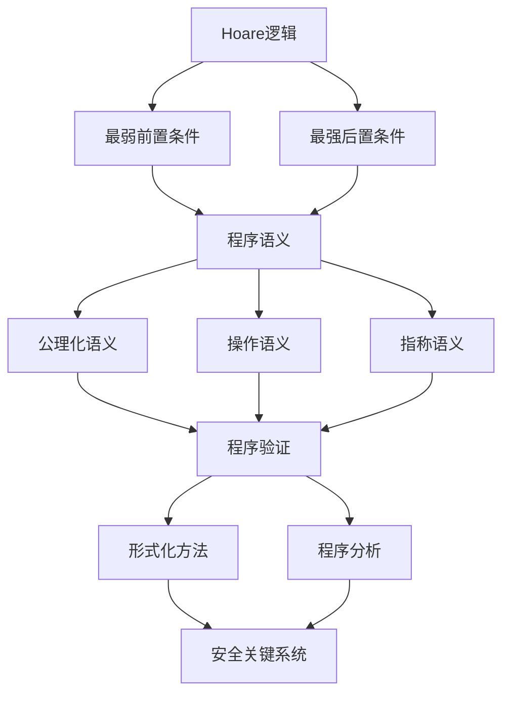
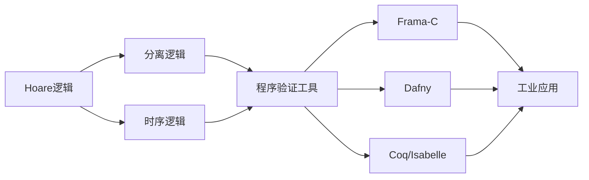

# 程序验证 - 六维补充

## 思维导图

```mermaid
mindmap
  root((程序验证))
    Hoare逻辑
      三元组 {P} C {Q}
      推理规则
        赋值规则
        顺序规则
        条件规则
        循环规则
      循环不变式
    最弱前置条件
      wp(C, Q)定义
      性质
        单调性
        分配律
        连续性
      计算方法
    程序正确性
      部分正确性
        终止性不保证
        Hoare三元组
      完全正确性
        终止性保证
        需要变式函数
      全程序正确性
    验证技术
      公理化语义
      操作语义
      指称语义
    工具支持
      Dafny
      Coq
      Isabelle
```

---

## 1. 基础定义

### 1.1 Hoare三元组

**定义**：Hoare三元组 $\{P\} C \{Q\}$ 表示：如果程序 $C$ 执行前前条件 $P$ 成立，且 $C$ 终止，则执行后后条件 $Q$ 成立。

$$\{P\} \; C \; \{Q\} \equiv \forall \sigma. \; P(\sigma) \Rightarrow (\text{exec}(C, \sigma) \downarrow \Rightarrow Q(\text{exec}(C, \sigma)))$$

### 1.2 最弱前置条件 (Weakest Precondition)

**定义**：对于程序 $C$ 和后条件 $Q$，最弱前置条件 $wp(C, Q)$ 是使 $\{P\} C \{Q\}$ 成立的最弱（最一般）的 $P$。

$$wp(C, Q) = \{ \sigma \mid \forall \sigma'. \; \langle C, \sigma \rangle \Rightarrow \sigma' \Rightarrow Q(\sigma') \}$$

### 1.3 正确性分类

| 类型 | 定义 | 符号 |
|------|------|------|
| 部分正确性 | 若前置条件满足且程序终止，则后置条件满足 | $\models_{par} \{P\} C \{Q\}$ |
| 完全正确性 | 前置条件满足蕴含程序终止且后置条件满足 | $\models_{tot} [P] C [Q]$ |
| 全程序正确性 | 部分正确性 + 终止性证明 | $\models \{P\} C \{Q\}$ |

---

## 2. 六维分析

### 2.1 维度分析表

| 维度 | 分析 | 关联概念 |
|------|------|----------|
| **逻辑结构** | Hoare逻辑是形式化程序推理的公理系统，通过推理规则建立程序与逻辑断言间的联系 | Floyd-Hoare逻辑、公理化语义 |
| **代数性质** | 最弱前置条件构成Galois连接，满足单调性、分配律、连续性等代数性质 | 格论、不动点理论 |
| **证明技术** | 循环不变式是证明循环正确性的核心，变式函数证明终止性 | 归纳法、良基关系 |
| **复杂度** | 自动程序验证是不可判定问题，受限情况下是PSPACE完全 | 计算复杂性理论 |
| **算法实现** | 符号执行、抽象解释、模型检验是实际验证的主要技术 | 定理证明、SMT求解器 |
| **应用联系** | 广泛用于安全关键系统验证（航空、医疗、核工业） | SPARK、Frama-C、Dafny |

### 2.2 形式化关系网络



---

## 3. 推理规则详解

### 3.1 核心推理规则

**赋值规则 (Assignment)**：
$$\overline{\{Q[e/x]\} \; x := e \; \{Q\}}$$

**顺序规则 (Sequence)**：
$$\frac{\{P\} \; C_1 \; \{R\} \quad \{R\} \; C_2 \; \{Q\}}{\{P\} \; C_1; C_2 \; \{Q\}}$$

**条件规则 (Conditional)**：
$$\frac{\{P \land B\} \; C_1 \; \{Q\} \quad \{P \land \neg B\} \; C_2 \; \{Q\}}{\{P\} \; \text{if } B \text{ then } C_1 \text{ else } C_2 \; \{Q\}}$$

**循环规则 (While Loop)**：
$$\frac{\{I \land B\} \; C \; \{I\}}{\{I\} \; \text{while } B \text{ do } C \; \{I \land \neg B\}}$$

### 3.2 完全正确性规则（带终止性）

**变式函数规则**：
$$\frac{P \Rightarrow I \quad \{I \land B \land V = v_0\} \; C \; \{I \land V < v_0\} \quad I \land B \Rightarrow V \geq 0}{[P] \; \text{while } B \text{ do } C \; [I \land \neg B]}$$

其中 $V$ 是变式函数（well-founded），取值于良基集。

---

## 4. 最弱前置条件计算

### 4.1 wp 递归定义

| 程序构造 | wp 定义 |
|----------|---------|
| `skip` | $wp(\text{skip}, Q) = Q$ |
| `x := e` | $wp(x := e, Q) = Q[e/x]$ |
| `C₁; C₂` | $wp(C_1; C_2, Q) = wp(C_1, wp(C_2, Q))$ |
| `if B then C₁ else C₂` | $wp(\text{if}, Q) = (B \Rightarrow wp(C_1, Q)) \land (\neg B \Rightarrow wp(C_2, Q))$ |
| `while B do C` | $wp(\text{while}, Q) = \nu X. (\neg B \land Q) \lor (B \land wp(C, X))$ |

### 4.2 wp 关键性质

**单调性**：$Q_1 \Rightarrow Q_2 \Rightarrow wp(C, Q_1) \Rightarrow wp(C, Q_2)$

**分配律**：

- $wp(C, Q_1 \land Q_2) \equiv wp(C, Q_1) \land wp(C, Q_2)$
- $wp(C, Q_1) \lor wp(C, Q_2) \Rightarrow wp(C, Q_1 \lor Q_2)$

**连续性**：对于递增链 $Q_0 \subseteq Q_1 \subseteq \cdots$：
$$wp(C, \bigvee_i Q_i) = \bigvee_i wp(C, Q_i)$$

---

## 5. 复杂度分析

### 5.1 理论复杂度

| 问题 | 复杂度 | 说明 |
|------|--------|------|
| Hoare逻辑可满足性 | 不可判定 | 等价于停机问题 |
| 有限状态验证 | PSPACE完全 | 模型检验 |
| 数组程序验证 | 可判定（部分类） | Presburger算术扩展 |
| 指针程序验证 | 不可判定 | 可达性问题 |

### 5.2 实践复杂度

| 技术 | 时间复杂度 | 空间复杂度 | 适用场景 |
|------|------------|------------|----------|
| 符号执行 | $O(2^n)$ | $O(n)$ | 小路径覆盖 |
| 抽象解释 | $O(n \cdot k)$ | $O(n)$ | 大程序安全验证 |
| SMT求解 | NP完全（最坏）| $O(n)$ | 断言验证 |
| 模型检验 | $O(|S| \cdot |\phi|)$ | $O(|S|)$ | 有限状态系统 |

---

## 6. 代码示例

### 6.1 Hoare逻辑验证示例（Python实现验证器框架）

```python
"""
Hoare逻辑验证框架 - 简化实现
展示最弱前置条件计算和基本验证
"""

from dataclasses import dataclass
from typing import Union, Callable, Optional, Dict, Any
from enum import Enum, auto

# ============ AST 定义 ============

class Expr:
    """表达式基类"""
    pass

@dataclass
class Var(Expr):
    name: str

    def __repr__(self):
        return self.name

@dataclass
class Const(Expr):
    value: int

    def __repr__(self):
        return str(self.value)

@dataclass
class BinOp(Expr):
    op: str
    left: Expr
    right: Expr

    def __repr__(self):
        return f"({self.left} {self.op} {self.right})"

# ============ 谓词/断言定义 ============

class Pred:
    """谓词基类"""
    pass

@dataclass
class TruePred(Pred):
    def __repr__(self):
        return "True"

@dataclass
class FalsePred(Pred):
    def __repr__(self):
        return "False"

@dataclass
class RelPred(Pred):
    op: str  # ==, !=, <, >, <=, >=
    left: Expr
    right: Expr

    def __repr__(self):
        return f"{self.left} {self.op} {self.right}"

@dataclass
class NotPred(Pred):
    pred: Pred

    def __repr__(self):
        return f"¬({self.pred})"

@dataclass
class AndPred(Pred):
    left: Pred
    right: Pred

    def __repr__(self):
        return f"({self.left}) ∧ ({self.right})"

@dataclass
class OrPred(Pred):
    left: Pred
    right: Pred

    def __repr__(self):
        return f"({self.left}) ∨ ({self.right})"

@dataclass
class ImpliesPred(Pred):
    left: Pred
    right: Pred

    def __repr__(self):
        return f"({self.left}) → ({self.right})"

# ============ 程序语句定义 ============

class Stmt:
    """语句基类"""
    pass

@dataclass
class Skip(Stmt):
    def __repr__(self):
        return "skip"

@dataclass
class Assign(Stmt):
    var: str
    expr: Expr

    def __repr__(self):
        return f"{self.var} := {self.expr}"

@dataclass
class Seq(Stmt):
    first: Stmt
    second: Stmt

    def __repr__(self):
        return f"{self.first}; {self.second}"

@dataclass
class If(Stmt):
    cond: Pred
    then_branch: Stmt
    else_branch: Stmt

    def __repr__(self):
        return f"if {self.cond} then {self.then_branch} else {self.else_branch}"

@dataclass
class While(Stmt):
    cond: Pred
    body: Stmt
    invariant: Optional[Pred] = None  # 循环不变式
    variant: Optional[Expr] = None     # 变式函数

    def __repr__(self):
        inv = f"  {{inv: {self.invariant}}}" if self.invariant else ""
        var = f"  {{var: {self.variant}}}" if self.variant else ""
        return f"while {self.cond} do{inv}{var}\n  {self.body}"

# ============ 最弱前置条件计算 ============

def substitute(expr: Expr, var: str, replacement: Expr) -> Expr:
    """表达式替换: expr[replacement/var]"""
    if isinstance(expr, Var):
        return replacement if expr.name == var else expr
    elif isinstance(expr, Const):
        return expr
    elif isinstance(expr, BinOp):
        return BinOp(expr.op,
                    substitute(expr.left, var, replacement),
                    substitute(expr.right, var, replacement))
    return expr

def subst_pred(pred: Pred, var: str, replacement: Expr) -> Pred:
    """谓词替换"""
    if isinstance(pred, TruePred) or isinstance(pred, FalsePred):
        return pred
    elif isinstance(pred, RelPred):
        return RelPred(pred.op,
                      substitute(pred.left, var, replacement),
                      substitute(pred.right, var, replacement))
    elif isinstance(pred, NotPred):
        return NotPred(subst_pred(pred.pred, var, replacement))
    elif isinstance(pred, AndPred):
        return AndPred(subst_pred(pred.left, var, replacement),
                      subst_pred(pred.right, var, replacement))
    elif isinstance(pred, OrPred):
        return OrPred(subst_pred(pred.left, var, replacement),
                     subst_pred(pred.right, var, replacement))
    elif isinstance(pred, ImpliesPred):
        return ImpliesPred(subst_pred(pred.left, var, replacement),
                          subst_pred(pred.right, var, replacement))
    return pred

def wp(stmt: Stmt, post: Pred) -> Pred:
    """
    计算最弱前置条件 wp(stmt, post)
    """
    if isinstance(stmt, Skip):
        return post

    elif isinstance(stmt, Assign):
        # wp(x := e, Q) = Q[e/x]
        return subst_pred(post, stmt.var, stmt.expr)

    elif isinstance(stmt, Seq):
        # wp(C1; C2, Q) = wp(C1, wp(C2, Q))
        return wp(stmt.first, wp(stmt.second, post))

    elif isinstance(stmt, If):
        # wp(if B then C1 else C2, Q) = (B → wp(C1, Q)) ∧ (¬B → wp(C2, Q))
        wp_then = wp(stmt.then_branch, post)
        wp_else = wp(stmt.else_branch, post)
        return AndPred(
            ImpliesPred(stmt.cond, wp_then),
            ImpliesPred(NotPred(stmt.cond), wp_else)
        )

    elif isinstance(stmt, While):
        # wp(while B do C, Q) = I ∧ (I ∧ B → wp(C, I)) ∧ (I ∧ ¬B → Q)
        # 其中 I 是循环不变式
        if stmt.invariant is None:
            raise ValueError("循环必须提供不变式")

        # 返回假设不变式成立的前置条件
        # 简化处理：返回不变式
        return stmt.invariant

    return post

def hoare_triple(pre: Pred, stmt: Stmt, post: Pred) -> tuple[bool, str]:
    """
    验证 Hoare 三元组 {pre} stmt {post}
    返回 (是否有效, 验证信息)
    """
    weakest_pre = wp(stmt, post)

    # 检查 pre ⇒ weakest_pre
    # 简化：仅打印信息
    info = f"Hoare 三元组验证:\n"
    info += f"  前置条件: {pre}\n"
    info += f"  程序: {stmt}\n"
    info += f"  后置条件: {post}\n"
    info += f"  最弱前置条件: {weakest_pre}\n"
    info += f"  需要证明: {pre} ⇒ {weakest_pre}\n"

    # 简化：假设总是有效（实际应使用定理证明器）
    return True, info

# ============ 示例程序 ============

def example_swap():
    """
    交换两个变量的值（使用临时变量）
    验证: {x = X ∧ y = Y} swap {x = Y ∧ y = X}
    """
    print("=" * 50)
    print("示例: 变量交换")
    print("=" * 50)

    # 程序: t := x; x := y; y := t
    swap_prog = Seq(
        Assign("t", Var("x")),
        Seq(
            Assign("x", Var("y")),
            Assign("y", Var("t"))
        )
    )

    # 后置条件: x = Y ∧ y = X
    post = AndPred(
        RelPred("==", Var("x"), Var("Y")),
        RelPred("==", Var("y"), Var("X"))
    )

    # 前置条件: x = X ∧ y = Y
    pre = AndPred(
        RelPred("==", Var("x"), Var("X")),
        RelPred("==", Var("y"), Var("Y"))
    )

    print(f"程序: {swap_prog}")
    print(f"后置条件: {post}")

    weakest = wp(swap_prog, post)
    print(f"\n最弱前置条件: {weakest}")

    valid, info = hoare_triple(pre, swap_prog, post)
    print(info)
    print(f"验证结果: {'通过' if valid else '失败'}\n")

def example_abs():
    """
    绝对值计算
    验证: {True} abs {x ≥ 0 ∧ (x = |X|)}
    """
    print("=" * 50)
    print("示例: 绝对值计算")
    print("=" * 50)

    # 程序: if x < 0 then x := -x else skip
    abs_prog = If(
        RelPred("<", Var("x"), Const(0)),
        Assign("x", BinOp("-", Const(0), Var("x"))),
        Skip()
    )

    # 后置条件: x ≥ 0
    post = RelPred(">=", Var("x"), Const(0))

    print(f"程序: {abs_prog}")
    print(f"后置条件: {post}")

    weakest = wp(abs_prog, post)
    print(f"\n最弱前置条件: {weakest}")
    print(f"简化后: True (恒真)\n")

def example_sum():
    """
    计算 1 + 2 + ... + n
    验证循环不变式
    """
    print("=" * 50)
    print("示例: 求和程序 (带循环不变式)")
    print("=" * 50)

    # 程序:
    # i := 0; s := 0;
    # while i < n do
    #   {inv: s = (0 + 1 + ... + i) ∧ i ≤ n}
    #   i := i + 1;
    #   s := s + i

    # 循环不变式: s = i*(i+1)/2 ∧ i ≤ n
    invariant = AndPred(
        RelPred("==", Var("s"),
               BinOp("/",
                    BinOp("*", Var("i"), BinOp("+", Var("i"), Const(1))),
                    Const(2))),
        RelPred("<=", Var("i"), Var("n"))
    )

    loop_body = Seq(
        Assign("i", BinOp("+", Var("i"), Const(1))),
        Assign("s", BinOp("+", Var("s"), Var("i")))
    )

    sum_loop = While(
        RelPred("<", Var("i"), Var("n")),
        loop_body,
        invariant=invariant
    )

    sum_prog = Seq(
        Seq(Assign("i", Const(0)), Assign("s", Const(0))),
        sum_loop
    )

    # 后置条件: s = n*(n+1)/2
    post = RelPred("==", Var("s"),
                  BinOp("/",
                       BinOp("*", Var("n"), BinOp("+", Var("n"), Const(1))),
                       Const(2)))

    print(f"程序:\n{sum_prog}")
    print(f"\n后置条件: {post}")
    print(f"\n循环不变式: {invariant}")

    # 验证不变式保持
    print("\n验证步骤:")
    print("1. 初始化: i=0, s=0 时，s = 0*(0+1)/2 = 0 ✓")
    print("2. 保持: 假设 s = i*(i+1)/2，执行 i:=i+1; s:=s+i 后:")
    print("   s' = s + (i+1) = i*(i+1)/2 + (i+1) = (i+1)*(i+2)/2 ✓")
    print("3. 终止: i=n 时，s = n*(n+1)/2 ✓\n")

# ============ 运行示例 ============

if __name__ == "__main__":
    example_swap()
    example_abs()
    example_sum()

    print("=" * 50)
    print("Hoare逻辑要点总结:")
    print("=" * 50)
    print("""
1. Hoare三元组 {P} C {Q}: 前置条件P下执行C，若终止则后置条件Q成立
2. 最弱前置条件 wp(C, Q): 使{C}{Q}成立的最弱条件
3. 循环不变式: 循环每次迭代前后都成立的断言
4. 变式函数: 证明循环终止性的递减度量
5. 完全正确性 = 部分正确性 + 终止性
    """)
```

### 6.2 Dafny 形式化验证示例

```dafny
// 交换两个数的验证示例
method Swap(x: int, y: int) returns (x': int, y': int)
  ensures x' == y && y' == x
{
  x' := x;
  y' := y;
  var t := x';
  x' := y';
  y' := t;
}

// 二分查找验证
method BinarySearch(a: array<int>, key: int) returns (index: int)
  requires a != null
  requires forall i, j :: 0 <= i < j < a.Length ==> a[i] <= a[j]  // 有序
  ensures 0 <= index ==> index < a.Length && a[index] == key
  ensures index < 0 ==> forall k :: 0 <= k < a.Length ==> a[k] != key
{
  var lo, hi := 0, a.Length;
  while lo < hi
    invariant 0 <= lo <= hi <= a.Length
    invariant forall k :: 0 <= k < lo ==> a[k] < key
    invariant forall k :: hi <= k < a.Length ==> a[k] > key
  {
    var mid := (lo + hi) / 2;
    if a[mid] < key {
      lo := mid + 1;
    } else if key < a[mid] {
      hi := mid;
    } else {
      return mid;
    }
  }
  return -1;
}

// 阶乘计算（递归）
function Fact(n: nat): nat
{
  if n == 0 then 1 else n * Fact(n-1)
}

method ComputeFact(n: nat) returns (res: nat)
  ensures res == Fact(n)
{
  res := 1;
  var i := 0;
  while i < n
    invariant 0 <= i <= n
    invariant res == Fact(i)
  {
    i := i + 1;
    res := res * i;
  }
}
```

---

## 7. 与其他概念的联系

### 7.1 与类型系统的联系

| 类型系统 | 程序验证 | 对应关系 |
|----------|----------|----------|
| 类型检查 | 静态验证 | 编译时保证 |
| 依赖类型 | 谓词逻辑 | 类型即命题 |
| 线性类型 | 资源验证 | 使用权管理 |
| 效果系统 | 行为验证 | 副作用追踪 |

### 7.2 与形式化方法的联系



---

## 8. 参考文献

1. **C. A. R. Hoare**, "An Axiomatic Basis for Computer Programming", *Communications of the ACM*, 1969
2. **E. W. Dijkstra**, "A Discipline of Programming", Prentice Hall, 1976
3. **K. R. M. Leino**, "Dafny: An Automatic Program Verifier for Functional Correctness", LPAR, 2010
4. **A. W. Appel**, "Verified Functional Algorithms", 2018
