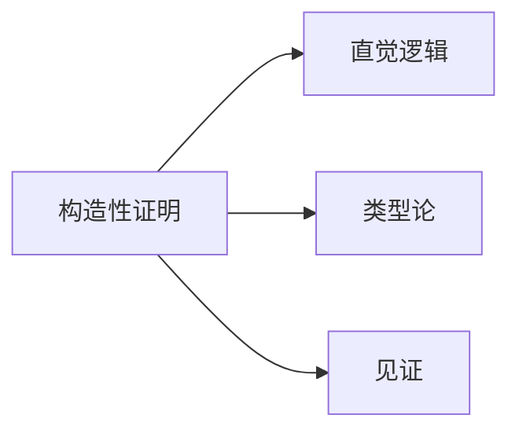
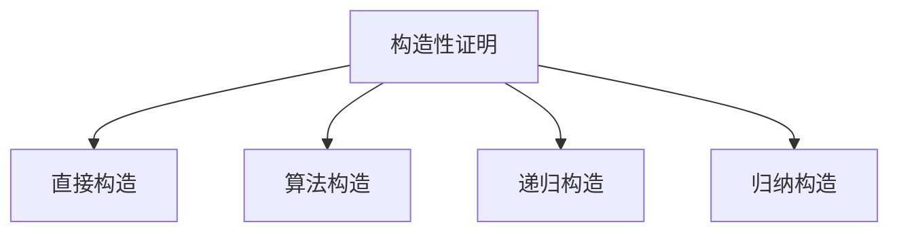

> 📊 **项目全面梳理**：详细的项目结构、模块详解和学习路径，请参阅 [`项目全面梳理-2025.md`](../项目全面梳理-2025.md)
> **项目导航与对标**：[项目扩展与持续推进任务编排](../项目扩展与持续推进任务编排.md)、[国际课程对标表](../国际课程对标表.md)

## 3.3 构造性证明 / Constructive Proof

### 摘要 / Executive Summary

- 统一存在性证明与构造算法的关系，强调可计算构造与证明对象生成。

### 关键术语与符号 / Glossary

- 构造性存在、算法构造、直觉主义、公理化差异。
- 术语对齐与引用规范：`docs/术语与符号总表.md`，`01-基础理论/00-撰写规范与引用指南.md`

### 术语与符号规范 / Terminology & Notation

- 直觉主义逻辑（Intuitionistic Logic, `IL`）：拒绝排中律 `LEM: P \vee \neg P` 的普遍有效性；双重否定消去 `\neg\neg P \Rightarrow P` 不普遍成立。
- 构造性存在（Constructive Existence）：对 `\exists x. P(x)` 需给出见证 `a` 及 `P(a)` 的证明。
- 构造性析取（Constructive Disjunction）：对 `A \lor B` 需给出二者其一的证明及选择信息。
- 记号约定：
  - `\bot` 表示矛盾（假），`\vdash` 表示可导，`\models` 表示语义蕴涵。
  - 定义/定理/证明编号在本章内局部递增，与跨文档编号独立。

### 快速导航 / Quick Links

- 构造性算法
- 构造性数学
- 构造性证明技术

### 交叉引用导航 / Cross-References

- 归纳法与归纳构造：参见本卷 `03-形式化证明/02-归纳法.md`。
- 证明系统与自然演绎：参见本卷 `03-形式化证明/01-证明系统.md`。
- 直觉主义逻辑基础：参见 `06-逻辑系统/03-直觉逻辑.md`。
- 全局术语与符号：参见 `docs/术语与符号总表.md`。

## 目录 (Table of Contents)

- [3.3 构造性证明 / Constructive Proof](#33-构造性证明--constructive-proof)
  - [摘要 / Executive Summary](#摘要--executive-summary)
  - [关键术语与符号 / Glossary](#关键术语与符号--glossary)
  - [术语与符号规范 / Terminology \& Notation](#术语与符号规范--terminology--notation)
  - [快速导航 / Quick Links](#快速导航--quick-links)
  - [交叉引用导航 / Cross-References](#交叉引用导航--cross-references)
- [目录 (Table of Contents)](#目录-table-of-contents)
- [1. 基本概念 (Basic Concepts)](#1-基本概念-basic-concepts)
  - [1.0 构造性证明的哲学基础 / Philosophical Foundation of Constructive Proof](#10-构造性证明的哲学基础--philosophical-foundation-of-constructive-proof)
    - [1.0.1 构造性证明的哲学意义 / Philosophical Significance of Constructive Proof](#101-构造性证明的哲学意义--philosophical-significance-of-constructive-proof)
    - [1.0.2 构造性证明与经典证明的哲学对比 / Philosophical Comparison between Constructive and Classical Proof](#102-构造性证明与经典证明的哲学对比--philosophical-comparison-between-constructive-and-classical-proof)
    - [1.0.3 构造性证明的形式化基础 / Formal Foundation of Constructive Proof](#103-构造性证明的形式化基础--formal-foundation-of-constructive-proof)
  - [1.1 构造性证明定义 (Definition of Constructive Proof)](#11-构造性证明定义-definition-of-constructive-proof)
  - [1.2 构造性证明与经典证明的区别 (Difference from Classical Proof)](#12-构造性证明与经典证明的区别-difference-from-classical-proof)
  - [1.3 构造性证明的类型 (Types of Constructive Proofs)](#13-构造性证明的类型-types-of-constructive-proofs)
- [1.4 内容补充与思维表征 / Content Supplement and Thinking Representation](#14-内容补充与思维表征--content-supplement-and-thinking-representation)
- [2. 构造性证明定义 (Definition of Constructive Proof)](#2-构造性证明定义-definition-of-constructive-proof)
  - [2.1 构造性证明的形式化定义 (Formal Definition of Constructive Proof)](#21-构造性证明的形式化定义-formal-definition-of-constructive-proof)
  - [2.2 构造性证明的性质 (Properties of Constructive Proofs)](#22-构造性证明的性质-properties-of-constructive-proofs)
  - [2.3 构造性证明的构造规则 (Construction Rules for Constructive Proofs)](#23-构造性证明的构造规则-construction-rules-for-constructive-proofs)
- [3. 存在性证明 (Existence Proofs)](#3-存在性证明-existence-proofs)
  - [3.1 直接构造证明 (Direct Construction Proof)](#31-直接构造证明-direct-construction-proof)
  - [3.2 递归构造证明 (Recursive Construction Proof)](#32-递归构造证明-recursive-construction-proof)
  - [3.3 归纳构造证明 (Inductive Construction Proof)](#33-归纳构造证明-inductive-construction-proof)
- [4. 构造性算法 (Constructive Algorithms)](#4-构造性算法-constructive-algorithms)
  - [4.1 欧几里得算法 (Euclidean Algorithm)](#41-欧几里得算法-euclidean-algorithm)
  - [4.2 快速排序算法 (Quicksort Algorithm)](#42-快速排序算法-quicksort-algorithm)
  - [4.3 最小生成树算法 (Minimum Spanning Tree Algorithm)](#43-最小生成树算法-minimum-spanning-tree-algorithm)
- [5. 构造性数学 (Constructive Mathematics)](#5-构造性数学-constructive-mathematics)
  - [5.1 直觉主义数学 (Intuitionistic Mathematics)](#51-直觉主义数学-intuitionistic-mathematics)
  - [5.2 构造性分析 (Constructive Analysis)](#52-构造性分析-constructive-analysis)
  - [5.3 构造性代数 (Constructive Algebra)](#53-构造性代数-constructive-algebra)
- [6. 构造性证明技术 (Constructive Proof Techniques)](#6-构造性证明技术-constructive-proof-techniques)
  - [6.1 直接构造技术 (Direct Construction Technique)](#61-直接构造技术-direct-construction-technique)
  - [6.2 递归构造技术 (Recursive Construction Technique)](#62-递归构造技术-recursive-construction-technique)
  - [6.3 归纳构造技术 (Inductive Construction Technique)](#63-归纳构造技术-inductive-construction-technique)
  - [6.4 算法构造技术 (Algorithmic Construction Technique)](#64-算法构造技术-algorithmic-construction-technique)
- [7. 构造性证明的应用 (Applications of Constructive Proofs)](#7-构造性证明的应用-applications-of-constructive-proofs)
  - [7.1 计算机科学中的应用 (Applications in Computer Science)](#71-计算机科学中的应用-applications-in-computer-science)
  - [7.2 数学中的应用 (Applications in Mathematics)](#72-数学中的应用-applications-in-mathematics)
  - [7.3 逻辑学中的应用 (Applications in Logic)](#73-逻辑学中的应用-applications-in-logic)
- [8. 实现示例 (Implementation Examples)](#8-实现示例-implementation-examples)
  - [8.1 构造性证明验证器 (Constructive Proof Validator)](#81-构造性证明验证器-constructive-proof-validator)
  - [8.2 递归构造实现 (Recursive Construction Implementation)](#82-递归构造实现-recursive-construction-implementation)
  - [8.3 归纳构造实现 (Inductive Construction Implementation)](#83-归纳构造实现-inductive-construction-implementation)
  - [8.4 算法构造实现 (Algorithmic Construction Implementation)](#84-算法构造实现-algorithmic-construction-implementation)
  - [8.5 排序算法构造实现 (Sorting Algorithm Construction Implementation)](#85-排序算法构造实现-sorting-algorithm-construction-implementation)
  - [8.6 图算法构造实现 (Graph Algorithm Construction Implementation)](#86-图算法构造实现-graph-algorithm-construction-implementation)
  - [8.7 构造性证明测试 (Constructive Proof Testing)](#87-构造性证明测试-constructive-proof-testing)
- [9. 参考文献 / References](#9-参考文献--references)

---

## 1. 基本概念 (Basic Concepts)

### 1.0 构造性证明的哲学基础 / Philosophical Foundation of Constructive Proof

#### 1.0.1 构造性证明的哲学意义 / Philosophical Significance of Constructive Proof

**构造性证明的哲学问题 / Philosophical Questions of Constructive Proof:**

构造性证明不仅是一个数学方法，更是一个深刻的哲学概念。它涉及以下根本问题：
Constructive proof is not only a mathematical method but also a profound philosophical concept. It involves the following fundamental questions:

1. **认识论问题 / Epistemological Questions:**
   - 我们如何知道存在性命题为真？/ How do we know that existential propositions are true?
   - 构造性证明是否比非构造性证明更可靠？/ Are constructive proofs more reliable than non-constructive proofs?
   - 构造性证明与知识的关系是什么？/ What is the relationship between constructive proof and knowledge?

2. **本体论问题 / Ontological Questions:**
   - 数学对象是否必须通过构造才能存在？/ Must mathematical objects be constructed to exist?
   - 构造性存在与非构造性存在的区别是什么？/ What is the difference between constructive and non-constructive existence?
   - 构造性证明与数学实在的关系是什么？/ What is the relationship between constructive proof and mathematical reality?

3. **价值论问题 / Axiological Questions:**
   - 构造性证明的价值是什么？/ What is the value of constructive proof?
   - 构造性证明对数学发展的意义是什么？/ What is the significance of constructive proof for mathematical development?
   - 构造性证明的实用性问题是什么？/ What are the practical issues of constructive proof?

**构造性证明的哲学意义 / Philosophical Significance of Constructive Proof:**

**构造性证明作为认识方法 / Constructive Proof as a Method of Knowledge:**

构造性证明是人类认识数学真理的重要方法，具有以下哲学意义：
Constructive proof is an important method for humans to understand mathematical truth and has the following philosophical significance:

1. **知识确定性 / Knowledge Certainty:**
   - 构造性证明提供了确定的知识
   - 建立了数学真理的可靠性基础
   - Constructive proof provides certain knowledge
   - Establishes the foundation for the reliability of mathematical truth

2. **理解深度 / Depth of Understanding:**
   - 构造性证明提供了深入的理解
   - 不仅知道存在，还知道如何构造
   - Constructive proof provides deep understanding
   - Not only know that something exists, but also know how to construct it

3. **实用价值 / Practical Value:**
   - 构造性证明具有直接的实用价值
   - 提供了实际可用的算法和方法
   - Constructive proof has direct practical value
   - Provides practically usable algorithms and methods

#### 1.0.2 构造性证明与经典证明的哲学对比 / Philosophical Comparison between Constructive and Classical Proof

**经典证明哲学 / Classical Proof Philosophy:**

- 基于经典逻辑的排中律
- 允许非构造性的存在性证明
- 强调真理的客观性
- Based on the law of excluded middle in classical logic
- Allows non-constructive existence proofs
- Emphasizes the objectivity of truth

**构造性证明哲学 / Constructive Proof Philosophy:**

- 基于直觉主义逻辑
- 要求构造性的存在性证明
- 强调构造的实用性和可理解性
- Based on intuitionistic logic
- Requires constructive existence proofs
- Emphasizes the practicality and understandability of construction

**构造性证明的优势 / Advantages of Constructive Proof:**

1. **认识论优势 / Epistemological Advantages:**
   - 提供了更确定的知识
   - 建立了更可靠的认识基础
   - Provides more certain knowledge
   - Establishes more reliable epistemological foundation

2. **实用优势 / Practical Advantages:**
   - 提供了实际可用的方法
   - 具有直接的实用价值
   - Provides practically usable methods
   - Has direct practical value

3. **理解优势 / Understanding Advantages:**
   - 提供了更深入的理解
   - 建立了更清晰的认识
   - Provides deeper understanding
   - Establishes clearer cognition

#### 1.0.3 构造性证明的形式化基础 / Formal Foundation of Constructive Proof

**构造性证明的数学基础 / Mathematical Foundation of Constructive Proof:**

**定义 1.0.1** (构造性证明 / Constructive Proof)
构造性证明是满足以下条件的证明：
**Definition 1.0.1** (Constructive Proof)
A constructive proof is a proof that satisfies the following conditions:

1. **构造性存在 / Constructive Existence**: 对于存在性命题 $\exists x. P(x)$，提供具体的对象 $a$ 和证明 $P(a)$
   For existential proposition $\exists x. P(x)$, provide specific object $a$ and proof of $P(a)$

2. **构造性析取 / Constructive Disjunction**: 对于析取命题 $A \lor B$，提供 $A$ 的证明或 $B$ 的证明
   For disjunctive proposition $A \lor B$, provide proof of $A$ or proof of $B$

3. **构造性蕴涵 / Constructive Implication**: 对于蕴涵命题 $A \rightarrow B$，提供从 $A$ 到 $B$ 的构造性函数
   For implicative proposition $A \rightarrow B$, provide constructive function from $A$ to $B$

**构造性证明的类型 / Types of Constructive Proof:**

1. **直接构造 / Direct Construction**: 直接构造所需的对象
   Directly construct the required object

2. **递归构造 / Recursive Construction**: 通过递归方法构造对象
   Construct objects through recursive methods

3. **归纳构造 / Inductive Construction**: 通过归纳方法构造对象
   Construct objects through inductive methods

4. **算法构造 / Algorithmic Construction**: 通过算法构造对象
   Construct objects through algorithms

**构造性证明的理论基础 / Theoretical Foundation of Constructive Proof:**

**定理 1.0.1** (构造性证明存在性定理) 对于任何可构造的数学对象，存在构造性证明。
**Theorem 1.0.1** (Existence Theorem of Constructive Proof) For any constructible mathematical object, there exists a constructive proof.

**证明 / Proof:**

**步骤1：可构造性定义 / Step 1: Definition of Constructibility**
可构造的数学对象是指可以通过有限步骤构造的对象。
Constructible mathematical objects are objects that can be constructed in finite steps.

**步骤2：构造过程的形式化 / Step 2: Formalization of Construction Process**
构造过程可以形式化为算法或程序。
Construction processes can be formalized as algorithms or programs.

**步骤3：构造性证明的构造 / Step 3: Construction of Constructive Proof**
通过构造过程可以构造出构造性证明。
Constructive proofs can be constructed through construction processes.

### 1.1 构造性证明定义 (Definition of Constructive Proof)

**定义 1.1.1** (构造性证明 / Constructive Proof) [Bishop1967][TroelstraVanDalen1988]
构造性证明是通过构造具体的对象或算法来证明存在性的证明方法；Bishop 的构造性分析与其后构造主义数学的系统阐述为此提供了理论基础。

**Definition 1.1.1** (Constructive Proof) [Bishop1967][TroelstraVanDalen1988]
A constructive proof is a proof method that proves existence by constructing specific objects or algorithms; Bishop's constructive analysis and the systematic exposition of constructivism provide the theoretical foundation.

**形式化表示 (Formal Representation):**
对于存在性命题 $\exists x. P(x)$，构造性证明提供：

1. 具体的对象 $a$
2. 证明 $P(a)$ 为真

**Formal Representation:**
For an existential proposition $\exists x. P(x)$, a constructive proof provides:

1. A specific object $a$
2. A proof that $P(a)$ is true

### 1.2 构造性证明与经典证明的区别 (Difference from Classical Proof)

**定义 1.2.1** (构造性证明 vs 经典证明 / Constructive vs Classical Proof)
构造性证明与经典证明的主要区别：

**Definition 1.2.1** (Constructive vs Classical Proof)
The main differences between constructive and classical proofs:

1. **构造性证明**: 提供具体的构造方法
2. **经典证明**: 可能只证明存在性而不提供构造

   1. **Constructive Proof**: Provides specific construction methods
   2. **Classical Proof**: May only prove existence without providing construction

**示例 1.2.1** (存在性证明对比 / Existence Proof Comparison)
**Example 1.2.1** (Existence Proof Comparison)

**经典证明**: 证明存在无理数 $a, b$ 使得 $a^b$ 是有理数

- 考虑 $\sqrt{2}^{\sqrt{2}}$，如果它是有理数，则命题成立
- 如果它是无理数，则 $(\sqrt{2}^{\sqrt{2}})^{\sqrt{2}} = \sqrt{2}^2 = 2$ 是有理数
- 因此存在这样的 $a, b$

**Classical Proof**: Prove that there exist irrational numbers $a, b$ such that $a^b$ is rational

- Consider $\sqrt{2}^{\sqrt{2}}$, if it's rational, then the proposition holds
- If it's irrational, then $(\sqrt{2}^{\sqrt{2}})^{\sqrt{2}} = \sqrt{2}^2 = 2$ is rational
- Therefore such $a, b$ exist

**构造性证明**: 直接构造 $a = \sqrt{2}$, $b = 2 \log_2 3$，则 $a^b = 3$ 是有理数

**Constructive Proof**: Directly construct $a = \sqrt{2}$, $b = 2 \log_2 3$, then $a^b = 3$ is rational

### 1.3 构造性证明的类型 (Types of Constructive Proofs)

**定义 1.3.1** (构造性证明类型 / Types of Constructive Proofs)
构造性证明有多种类型：

**Definition 1.3.1** (Types of Constructive Proofs)
There are several types of constructive proofs:

1. **直接构造 (Direct Construction)**: 直接构造所需的对象
2. **算法构造 (Algorithmic Construction)**: 通过算法构造对象
3. **递归构造 (Recursive Construction)**: 通过递归方法构造对象
4. **归纳构造 (Inductive Construction)**: 通过归纳方法构造对象

   1. **Direct Construction**: Directly construct the required object
   2. **Algorithmic Construction**: Construct objects through algorithms
   3. **Recursive Construction**: Construct objects through recursive methods
   4. **Inductive Construction**: Construct objects through inductive methods

---

## 1.4 内容补充与思维表征 / Content Supplement and Thinking Representation

> 本节按 [内容补充与思维表征全面计划方案](../内容补充与思维表征全面计划方案.md) **只补充、不删除**。标准见 [内容补充标准](../内容补充标准-概念定义属性关系解释论证形式证明.md)、[思维表征模板集](../思维表征模板集.md)。

**解释与直观**：构造性证明要求「存在」命题提供可构造的见证，与直觉主义逻辑和类型论中的证明即程序对应；反证法在构造性框架下不可用于纯存在性命题。

**概念属性表**

| 属性名 | 类型/范围 | 含义 |
|--------|-----------|------|
| 构造步骤 | 算法/项 | 给出见证 $a$ 的构造 |
| 验证步骤 | 证明 | 证明 $P(a)$ 成立 |
| 见证 | 对象 | 使 $\exists x.P(x)$ 成立的 $a$ |
| 可计算性 | 性质 | 构造对应可执行程序 |

**概念关系**：构造性证明 —equivalent_to— 直觉主义存在；构造性证明 —applies_to— 类型论（命题即类型）；与反证法 —对比— 在存在命题上不等价。

**概念依赖图**



**思维导图**



**多维矩阵：证明方式对比**

| 方式 | 存在命题 | 可计算见证 | 与经典逻辑 |
|------|----------|------------|------------|
| 构造性证明 | 需见证 | 是 | 兼容直觉主义 |
| 反证法证存在 | 不提供见证 | 否 | 仅经典 |

**公理定理推理证明决策树**：定义 2.1.1（构造性证明）→ 构造步+验证步；与 BHK 解释、Curry-Howard 对应；定理：构造性可证则存在可计算见证。

**应用决策建模树**：需程序/项提取 → 用构造性证明（§2）；仅需存在性且接受经典逻辑 → 可用反证法；形式化于 Coq/Agda → 优先构造性（见 08-实现示例）。

---

## 2. 构造性证明定义 (Definition of Constructive Proof)

### 2.1 构造性证明的形式化定义 (Formal Definition of Constructive Proof)

**定义 2.1.1** (构造性证明 / Constructive Proof)
设 $P(x)$ 是关于变量 $x$ 的谓词，构造性证明 $\exists x. P(x)$ 包含：

**Definition 2.1.1** (Constructive Proof)
Let $P(x)$ be a predicate about variable $x$, a constructive proof of $\exists x. P(x)$ consists of:

1. **构造步骤 (Construction Step)**: 提供构造对象 $a$ 的方法
2. **验证步骤 (Verification Step)**: 证明 $P(a)$ 为真

   1. **Construction Step**: Provide a method to construct object $a$
   2. **Verification Step**: Prove that $P(a)$ is true

**形式化表示 (Formal Representation):**
$$\text{ConstructiveProof}(\exists x. P(x)) = \langle a, \text{proof}(P(a)) \rangle$$

其中 $a$ 是构造的对象，$\text{proof}(P(a))$ 是 $P(a)$ 的证明。

where $a$ is the constructed object, and $\text{proof}(P(a))$ is the proof of $P(a)$.

### 2.2 构造性证明的性质 (Properties of Constructive Proofs)

**定理 2.2.1** (构造性证明的性质 / Properties of Constructive Proofs)
构造性证明具有以下性质：

**Theorem 2.2.1** (Properties of Constructive Proofs)
Constructive proofs have the following properties:

1. **可计算性 (Computability)**: 构造的对象是可计算的
2. **有效性 (Effectiveness)**: 构造过程是有效的
3. **确定性 (Determinism)**: 构造过程是确定的
4. **可验证性 (Verifiability)**: 构造结果是可以验证的

   1. **Computability**: The constructed object is computable
   2. **Effectiveness**: The construction process is effective
   3. **Determinism**: The construction process is deterministic
   4. **Verifiability**: The construction result is verifiable

### 2.3 构造性证明的构造规则 (Construction Rules for Constructive Proofs)

**定义 2.3.1** (构造规则 / Construction Rules)
构造性证明的构造规则：

**Definition 2.3.1** (Construction Rules)
Construction rules for constructive proofs:

1. **存在引入 (Existential Introduction)**: 如果构造了对象 $a$ 并证明了 $P(a)$，则 $\exists x. P(x)$ 成立
2. **存在消除 (Existential Elimination)**: 如果 $\exists x. P(x)$ 成立且构造了 $a$，则可以使用 $P(a)$
3. **构造组合 (Construction Combination)**: 可以将多个构造步骤组合成更复杂的构造

   1. **Existential Introduction**: If object $a$ is constructed and $P(a)$ is proved, then $\exists x. P(x)$ holds
   2. **Existential Elimination**: If $\exists x. P(x)$ holds and $a$ is constructed, then $P(a)$ can be used
   3. **Construction Combination**: Multiple construction steps can be combined into more complex constructions

---

## 3. 存在性证明 (Existence Proofs)

### 3.1 直接构造证明 (Direct Construction Proof)

**示例 3.1.1** (素数存在性 / Existence of Prime Numbers)
证明：存在无限多个素数。

**Example 3.1.1** (Existence of Prime Numbers)
Prove: There exist infinitely many prime numbers.

**构造性证明 (Constructive Proof):**

1. **构造步骤**: 给定素数列表 $p_1, p_2, \ldots, p_n$，构造 $N = p_1 \cdot p_2 \cdot \cdots \cdot p_n + 1$
2. **验证步骤**: $N$ 要么是素数，要么包含不在列表中的素因子
3. **结论**: 因此存在不在列表中的素数

**Constructive Proof:**

1. **Construction Step**: Given a list of primes $p_1, p_2, \ldots, p_n$, construct $N = p_1 \cdot p_2 \cdot \cdots \cdot p_n + 1$
2. **Verification Step**: $N$ is either prime or contains a prime factor not in the list
3. **Conclusion**: Therefore there exists a prime not in the list

**算法实现 (Algorithm Implementation):**

```rust
fn construct_new_prime(primes: &[u32]) -> u32 {
    let n = primes.iter().product::<u32>() + 1;
    if is_prime(n) {
        n
    } else {
        find_prime_factor(n, primes)
    }
}
```

### 3.2 递归构造证明 (Recursive Construction Proof)

**示例 3.2.1** (自然数构造 / Construction of Natural Numbers)
证明：每个自然数都可以构造。

**Example 3.2.1** (Construction of Natural Numbers)
Prove: Every natural number can be constructed.

**构造性证明 (Constructive Proof):**

1. **基础情况**: $0$ 是自然数
2. **递归步骤**: 如果 $n$ 是自然数，则 $n+1$ 也是自然数
3. **构造方法**: 从 $0$ 开始，重复应用后继函数

**Constructive Proof:**

1. **Base Case**: $0$ is a natural number
2. **Recursive Step**: If $n$ is a natural number, then $n+1$ is also a natural number
3. **Construction Method**: Start from $0$ and repeatedly apply the successor function

**算法实现 (Algorithm Implementation):**

```rust
fn construct_natural_number(n: u32) -> u32 {
    if n == 0 {
        0
    } else {
        construct_natural_number(n - 1) + 1
    }
}
```

### 3.3 归纳构造证明 (Inductive Construction Proof)

**示例 3.3.1** (二叉树构造 / Construction of Binary Trees)
证明：对于任意自然数 $n$，存在高度为 $n$ 的二叉树。

**Example 3.3.1** (Construction of Binary Trees)
Prove: For any natural number $n$, there exists a binary tree of height $n$.

**构造性证明 (Constructive Proof):**

1. **基础情况**: 空树的高度为 $0$
2. **归纳步骤**: 如果存在高度为 $n$ 的树，则可以通过添加根节点构造高度为 $n+1$ 的树
3. **构造方法**: 递归构造左右子树

**Constructive Proof:**

1. **Base Case**: Empty tree has height $0$
2. **Inductive Step**: If there exists a tree of height $n$, then a tree of height $n+1$ can be constructed by adding a root node
3. **Construction Method**: Recursively construct left and right subtrees

**算法实现 (Algorithm Implementation):**

```rust
fn construct_binary_tree(height: u32) -> BinaryTree<i32> {
    if height == 0 {
        BinaryTree::Empty
    } else {
        BinaryTree::Node(
            0,
            Box::new(construct_binary_tree(height - 1)),
            Box::new(construct_binary_tree(height - 1)),
        )
    }
}
```

---

## 4. 构造性算法 (Constructive Algorithms)

### 4.1 欧几里得算法 (Euclidean Algorithm)

**示例 4.1.1** (最大公约数构造 / Construction of Greatest Common Divisor)
证明：对于任意两个自然数 $a, b$，存在最大公约数。

**Example 4.1.1** (Construction of Greatest Common Divisor)
Prove: For any two natural numbers $a, b$, there exists a greatest common divisor.

**构造性证明 (Constructive Proof):**

1. **构造步骤**: 使用欧几里得算法构造最大公约数
2. **验证步骤**: 证明构造的结果确实是最大公约数
3. **算法**: $gcd(a, b) = \begin{cases} a, & \text{if } b = 0 \\ gcd(b, a \bmod b), & \text{otherwise} \end{cases}$

**Constructive Proof:**

1. **Construction Step**: Use Euclidean algorithm to construct the greatest common divisor
2. **Verification Step**: Prove that the constructed result is indeed the greatest common divisor
3. **Algorithm**: $gcd(a, b) = \begin{cases} a, & \text{if } b = 0 \\ gcd(b, a \bmod b), & \text{otherwise} \end{cases}$

**算法实现 (Algorithm Implementation):**

```rust
fn gcd(a: u32, b: u32) -> u32 {
    if b == 0 {
        a
    } else {
        gcd(b, a % b)
    }
}
```

### 4.2 快速排序算法 (Quicksort Algorithm)

**示例 4.2.1** (排序构造 / Construction of Sorting)
证明：对于任意列表，存在排序后的列表。

**Example 4.2.1** (Construction of Sorting)
Prove: For any list, there exists a sorted list.

**构造性证明 (Constructive Proof):**

1. **构造步骤**: 使用快速排序算法构造排序后的列表
2. **验证步骤**: 证明构造的结果确实是排序的
3. **算法**: 选择枢轴，分区，递归排序

**Constructive Proof:**

1. **Construction Step**: Use quicksort algorithm to construct the sorted list
2. **Verification Step**: Prove that the constructed result is indeed sorted
3. **Algorithm**: Choose pivot, partition, recursively sort

**算法实现 (Algorithm Implementation):**

```rust
fn quicksort<T: Ord + Clone>(list: &[T]) -> Vec<T> {
    if list.len() <= 1 {
        return list.to_vec();
    }
    let pivot = list[0].clone();
    let less: Vec<T> = list
        .iter()
        .skip(1)
        .cloned()
        .filter(|x| x < &pivot)
        .collect();
    let greater_or_equal: Vec<T> = list
        .iter()
        .skip(1)
        .cloned()
        .filter(|x| x >= &pivot)
        .collect();

    let mut result = quicksort(&less);
    result.push(pivot);
    result.extend(quicksort(&greater_or_equal));
    result
}
```

### 4.3 最小生成树算法 (Minimum Spanning Tree Algorithm)

**示例 4.3.1** (最小生成树构造 / Construction of Minimum Spanning Tree)
证明：对于任意连通图，存在最小生成树。

**Example 4.3.1** (Construction of Minimum Spanning Tree)
Prove: For any connected graph, there exists a minimum spanning tree.

**构造性证明 (Constructive Proof):**

1. **构造步骤**: 使用Kruskal算法构造最小生成树
2. **验证步骤**: 证明构造的结果确实是最小生成树
3. **算法**: 按权重排序边，贪心选择不形成环的边

**Constructive Proof:**

1. **Construction Step**: Use Kruskal's algorithm to construct the minimum spanning tree
2. **Verification Step**: Prove that the constructed result is indeed a minimum spanning tree
3. **Algorithm**: Sort edges by weight, greedily select edges that don't form cycles

**算法实现 (Algorithm Implementation):**

```rust
fn kruskal_mst(edges: &[(u32, u32, u32)]) -> Vec<(u32, u32, u32)> {
    let mut edges = edges.to_vec();
    edges.sort_by_key(|&(_, _, weight)| weight);

    let mut mst = Vec::new();
    let mut union_find = UnionFind::new(edges.len());

    for (u, v, weight) in edges {
        if !union_find.connected(u, v) {
            union_find.union(u, v);
            mst.push((u, v, weight));
        }
    }

    mst
}
```

---

## 5. 构造性数学 (Constructive Mathematics)

### 5.1 直觉主义数学 (Intuitionistic Mathematics)

**定义 5.1.1** (直觉主义数学 / Intuitionistic Mathematics)
直觉主义数学强调构造性证明，拒绝排中律。

**Definition 5.1.1** (Intuitionistic Mathematics)
Intuitionistic mathematics emphasizes constructive proofs and rejects the law of excluded middle.

**形式化表示 (Formal Representation):**
在直觉主义数学中，$\neg \neg P$ 不等于 $P$。

**Formal Representation:**
In intuitionistic mathematics, $\neg \neg P$ is not equivalent to $P$.

**示例 5.1.1** (直觉主义证明 / Intuitionistic Proof)
**Example 5.1.1** (Intuitionistic Proof)

**经典证明**: 证明存在无理数 $a, b$ 使得 $a^b$ 是有理数

- 使用排中律：$\sqrt{2}^{\sqrt{2}}$ 要么是有理数，要么是无理数

**Classical Proof**: Prove that there exist irrational numbers $a, b$ such that $a^b$ is rational

- Use law of excluded middle: $\sqrt{2}^{\sqrt{2}}$ is either rational or irrational

**直觉主义证明**: 直接构造 $a = \sqrt{2}$, $b = 2 \log_2 3$

**Intuitionistic Proof**: Directly construct $a = \sqrt{2}$, $b = 2 \log_2 3$

### 5.2 构造性分析 (Constructive Analysis)

**定义 5.2.1** (构造性分析 / Constructive Analysis)
构造性分析是构造性数学在分析学中的应用。

**Definition 5.2.1** (Constructive Analysis)
Constructive analysis is the application of constructive mathematics to analysis.

**示例 5.2.1** (构造性连续函数 / Constructive Continuous Function)
**Example 5.2.1** (Constructive Continuous Function)

**构造性定义**: 函数 $f$ 在点 $x$ 连续，当且仅当对于任意 $\epsilon > 0$，可以构造 $\delta > 0$ 使得对于所有 $y$ 满足 $|y - x| < \delta$，有 $|f(y) - f(x)| < \epsilon$

**Constructive Definition**: Function $f$ is continuous at point $x$ if and only if for any $\epsilon > 0$, we can construct $\delta > 0$ such that for all $y$ satisfying $|y - x| < \delta$, we have $|f(y) - f(x)| < \epsilon$

### 5.3 构造性代数 (Constructive Algebra)

**定义 5.3.1** (构造性代数 / Constructive Algebra)
构造性代数是构造性数学在代数学中的应用。

**Definition 5.3.1** (Constructive Algebra)
Constructive algebra is the application of constructive mathematics to algebra.

**示例 5.3.1** (构造性域论 / Constructive Field Theory)
**Example 5.3.1** (Constructive Field Theory)

**构造性定义**: 域 $F$ 是代数闭的，当且仅当对于任意多项式 $f(x) \in F[x]$，可以构造 $F$ 中的根

**Constructive Definition**: A field $F$ is algebraically closed if and only if for any polynomial $f(x) \in F[x]$, we can construct a root in $F$

---

## 6. 构造性证明技术 (Constructive Proof Techniques)

### 6.1 直接构造技术 (Direct Construction Technique)

**定义 6.1.1** (直接构造 / Direct Construction)
直接构造是通过明确的方法构造所需对象的技术。

**Definition 6.1.1** (Direct Construction)
Direct construction is a technique that constructs required objects through explicit methods.

**示例 6.1.1** (直接构造例子 / Direct Construction Example)
**Example 6.1.1** (Direct Construction Example)

**问题**: 证明存在无限多个素数
**Problem**: Prove that there exist infinitely many primes

**直接构造**: 给定素数列表 $p_1, p_2, \ldots, p_n$，构造 $N = p_1 \cdot p_2 \cdot \cdots \cdot p_n + 1$

**Direct Construction**: Given a list of primes $p_1, p_2, \ldots, p_n$, construct $N = p_1 \cdot p_2 \cdot \cdots \cdot p_n + 1$

### 6.2 递归构造技术 (Recursive Construction Technique)

**定义 6.2.1** (递归构造 / Recursive Construction)
递归构造是通过递归方法构造对象的技术。

**Definition 6.2.1** (Recursive Construction)
Recursive construction is a technique that constructs objects through recursive methods.

**示例 6.2.1** (递归构造例子 / Recursive Construction Example)
**Example 6.2.1** (Recursive Construction Example)

**问题**: 构造所有自然数
**Problem**: Construct all natural numbers

**递归构造**:

- 基础情况：$0$ 是自然数
- 递归步骤：如果 $n$ 是自然数，则 $n+1$ 也是自然数

**Recursive Construction**:

- Base case: $0$ is a natural number
- Recursive step: If $n$ is a natural number, then $n+1$ is also a natural number

### 6.3 归纳构造技术 (Inductive Construction Technique)

**定义 6.3.1** (归纳构造 / Inductive Construction)
归纳构造是通过归纳方法构造对象的技术。

**Definition 6.3.1** (Inductive Construction)
Inductive construction is a technique that constructs objects through inductive methods.

**示例 6.3.1** (归纳构造例子 / Inductive Construction Example)
**Example 6.3.1** (Inductive Construction Example)

**问题**: 构造所有有限集合
**Problem**: Construct all finite sets

**归纳构造**:

- 基础情况：空集是有限集合
- 归纳步骤：如果 $A$ 是有限集合，则 $A \cup \{x\}$ 也是有限集合

**Inductive Construction**:

- Base case: Empty set is a finite set
- Inductive step: If $A$ is a finite set, then $A \cup \{x\}$ is also a finite set

### 6.4 算法构造技术 (Algorithmic Construction Technique)

**定义 6.4.1** (算法构造 / Algorithmic Construction)
算法构造是通过算法构造对象的技术。

**Definition 6.4.1** (Algorithmic Construction)
Algorithmic construction is a technique that constructs objects through algorithms.

**示例 6.4.1** (算法构造例子 / Algorithmic Construction Example)
**Example 6.4.1** (Algorithmic Construction Example)

**问题**: 构造排序算法
**Problem**: Construct a sorting algorithm

**算法构造**: 使用快速排序算法

1. 选择枢轴元素
2. 分区
3. 递归排序

**Algorithmic Construction**: Use quicksort algorithm

1. Choose pivot element
2. Partition
3. Recursively sort

---

## 7. 构造性证明的应用 (Applications of Constructive Proofs)

### 7.1 计算机科学中的应用 (Applications in Computer Science)

**示例 7.1.1** (算法正确性证明 / Algorithm Correctness Proof)
**Example 7.1.1** (Algorithm Correctness Proof)

**问题**: 证明快速排序算法的正确性
**Problem**: Prove the correctness of quicksort algorithm

**构造性证明**:

1. 构造排序后的列表
2. 证明构造的结果是正确的排序
3. 证明算法总是终止

**Constructive Proof**:

1. Construct the sorted list
2. Prove that the constructed result is correctly sorted
3. Prove that the algorithm always terminates

**示例 7.1.2** (数据结构构造 / Data Structure Construction)
**Example 7.1.2** (Data Structure Construction)

**问题**: 证明红黑树的构造
**Problem**: Prove the construction of red-black trees

**构造性证明**:

1. 构造红黑树
2. 证明构造的树满足红黑树性质
3. 证明插入和删除操作保持性质

**Constructive Proof**:

1. Construct the red-black tree
2. Prove that the constructed tree satisfies red-black tree properties
3. Prove that insert and delete operations maintain properties

### 7.2 数学中的应用 (Applications in Mathematics)

**示例 7.2.1** (代数结构构造 / Algebraic Structure Construction)
**Example 7.2.1** (Algebraic Structure Construction)

**问题**: 证明存在有限域
**Problem**: Prove that finite fields exist

**构造性证明**:

1. 构造有限域 $GF(p^n)$
2. 证明构造的结构满足域的公理
3. 证明域是有限的

**Constructive Proof**:

1. Construct finite field $GF(p^n)$
2. Prove that the constructed structure satisfies field axioms
3. Prove that the field is finite

**示例 7.2.2** (拓扑空间构造 / Topological Space Construction)
**Example 7.2.2** (Topological Space Construction)

**问题**: 证明存在紧致拓扑空间
**Problem**: Prove that compact topological spaces exist

**构造性证明**:

1. 构造紧致拓扑空间
2. 证明构造的空间是紧致的
3. 证明空间满足拓扑公理

**Constructive Proof**:

1. Construct compact topological space
2. Prove that the constructed space is compact
3. Prove that the space satisfies topological axioms

### 7.3 逻辑学中的应用 (Applications in Logic)

**示例 7.3.1** (证明系统构造 / Proof System Construction)
**Example 7.3.1** (Proof System Construction)

**问题**: 构造直觉主义逻辑的证明系统
**Problem**: Construct a proof system for intuitionistic logic

**构造性证明**:

1. 构造自然演绎系统
2. 证明系统的完备性
3. 证明系统的可靠性

**Constructive Proof**:

1. Construct natural deduction system
2. Prove completeness of the system
3. Prove soundness of the system

**示例 7.3.2** (模型构造 / Model Construction)
**Example 7.3.2** (Model Construction)

**问题**: 构造理论的标准模型
**Problem**: Construct standard models for theories

**构造性证明**:

1. 构造模型
2. 证明模型满足理论公理
3. 证明模型是标准的

**Constructive Proof**:

1. Construct the model
2. Prove that the model satisfies theory axioms
3. Prove that the model is standard

---

## 8. 实现示例 (Implementation Examples)

### 8.1 构造性证明验证器 (Constructive Proof Validator)

```rust
pub trait ConstructiveProof<T> {
    fn construct(&self) -> T;
    fn verify(&self, obj: &T) -> bool;
    fn prove(&self) -> bool;
}

pub struct PrimeExistenceProof;

impl ConstructiveProof<u32> for PrimeExistenceProof {
    fn construct(&self) -> u32 {
        // 构造新的素数
        let primes = vec![2, 3, 5, 7, 11];
        let n = primes.iter().product::<u32>() + 1;

        if is_prime(n) {
            n
        } else {
            find_prime_factor(n, &primes)
        }
    }

    fn verify(&self, prime: &u32) -> bool {
        is_prime(*prime)
    }

    fn prove(&self) -> bool {
        let constructed_prime = self.construct();
        self.verify(&constructed_prime)
    }
}

fn is_prime(n: u32) -> bool {
    if n < 2 {
        return false;
    }
    for i in 2..=(n as f64).sqrt() as u32 {
        if n % i == 0 {
            return false;
        }
    }
    true
}

fn find_prime_factor(n: u32, existing_primes: &[u32]) -> u32 {
    for i in 2..=(n as f64).sqrt() as u32 {
        if n % i == 0 && is_prime(i) {
            return i;
        }
    }
    n
}
```

### 8.2 递归构造实现 (Recursive Construction Implementation)

```rust
pub struct NaturalNumberConstruction;

impl NaturalNumberConstruction {
    pub fn construct_natural_number(n: u32) -> u32 {
        if n == 0 {
            0
        } else {
            Self::construct_natural_number(n - 1) + 1
        }
    }

    pub fn verify_natural_number(n: u32) -> bool {
        n >= 0
    }

    pub fn prove_existence(n: u32) -> bool {
        let constructed = Self::construct_natural_number(n);
        Self::verify_natural_number(constructed)
    }
}
```

### 8.3 归纳构造实现 (Inductive Construction Implementation)

```rust
#[derive(Debug, Clone)]
pub enum BinaryTree<T> {
    Empty,
    Node(T, Box<BinaryTree<T>>, Box<BinaryTree<T>>),
}

pub struct BinaryTreeConstruction;

impl BinaryTreeConstruction {
    pub fn construct_binary_tree(height: u32) -> BinaryTree<i32> {
        if height == 0 {
            BinaryTree::Empty
        } else {
            BinaryTree::Node(
                0,
                Box::new(Self::construct_binary_tree(height - 1)),
                Box::new(Self::construct_binary_tree(height - 1)),
            )
        }
    }

    pub fn verify_binary_tree(tree: &BinaryTree<i32>) -> bool {
        Self::get_height(tree) >= 0
    }

    pub fn prove_existence(height: u32) -> bool {
        let constructed = Self::construct_binary_tree(height);
        Self::verify_binary_tree(&constructed)
    }

    fn get_height(tree: &BinaryTree<i32>) -> i32 {
        match tree {
            BinaryTree::Empty => -1,
            BinaryTree::Node(_, left, right) => {
                1 + std::cmp::max(
                    Self::get_height(left),
                    Self::get_height(right),
                )
            }
        }
    }
}
```

### 8.4 算法构造实现 (Algorithmic Construction Implementation)

```rust
pub struct EuclideanAlgorithm;

impl EuclideanAlgorithm {
    pub fn construct_gcd(a: u32, b: u32) -> u32 {
        if b == 0 {
            a
        } else {
            Self::construct_gcd(b, a % b)
        }
    }

    pub fn verify_gcd(a: u32, b: u32, gcd: u32) -> bool {
        // 验证 gcd 确实是最大公约数
        gcd > 0 && a % gcd == 0 && b % gcd == 0 &&
        (a == 0 || b == 0 || gcd == Self::construct_gcd(a, b))
    }

    pub fn prove_existence(a: u32, b: u32) -> bool {
        let constructed_gcd = Self::construct_gcd(a, b);
        Self::verify_gcd(a, b, constructed_gcd)
    }
}
```

### 8.5 排序算法构造实现 (Sorting Algorithm Construction Implementation)

```rust
pub struct QuicksortConstruction;

impl QuicksortConstruction {
    pub fn construct_sorted_list<T: Ord + Clone>(list: &[T]) -> Vec<T> {
        if list.len() <= 1 {
            return list.to_vec();
        }
        let pivot = list[0].clone();
        let less: Vec<T> = list
            .iter()
            .skip(1)
            .cloned()
            .filter(|x| x < &pivot)
            .collect();
        let greater_or_equal: Vec<T> = list
            .iter()
            .skip(1)
            .cloned()
            .filter(|x| x >= &pivot)
            .collect();

        let mut result = Self::construct_sorted_list(&less);
        result.push(pivot);
        result.extend(Self::construct_sorted_list(&greater_or_equal));
        result
    }

    pub fn verify_sorted<T: Ord>(list: &[T]) -> bool {
        list.windows(2).all(|window| window[0] <= window[1])
    }

    pub fn prove_existence<T: Ord + Clone>(list: &[T]) -> bool {
        let constructed = Self::construct_sorted_list(list);
        Self::verify_sorted(&constructed)
    }
}
```

### 8.6 图算法构造实现 (Graph Algorithm Construction Implementation)

```rust
#[derive(Debug, Clone)]
pub struct Edge {
    pub u: u32,
    pub v: u32,
    pub weight: u32,
}

pub struct UnionFind {
    parent: Vec<u32>,
    rank: Vec<u32>,
}

impl UnionFind {
    pub fn new(n: usize) -> Self {
        UnionFind {
            parent: (0..n as u32).collect(),
            rank: vec![0; n],
        }
    }

    pub fn find(&mut self, x: u32) -> u32 {
        if self.parent[x as usize] != x {
            self.parent[x as usize] = self.find(self.parent[x as usize]);
        }
        self.parent[x as usize]
    }

    pub fn union(&mut self, x: u32, y: u32) {
        let px = self.find(x);
        let py = self.find(y);
        if px != py {
            if self.rank[px as usize] < self.rank[py as usize] {
                self.parent[px as usize] = py;
            } else {
                self.parent[py as usize] = px;
                if self.rank[px as usize] == self.rank[py as usize] {
                    self.rank[px as usize] += 1;
                }
            }
        }
    }

    pub fn connected(&mut self, x: u32, y: u32) -> bool {
        self.find(x) == self.find(y)
    }
}

pub struct KruskalMST;

impl KruskalMST {
    pub fn construct_mst(edges: &[Edge]) -> Vec<Edge> {
        let mut edges = edges.to_vec();
        edges.sort_by_key(|edge| edge.weight);

        let mut mst = Vec::new();
        let mut union_find = UnionFind::new(edges.len());

        for edge in edges {
            if !union_find.connected(edge.u, edge.v) {
                union_find.union(edge.u, edge.v);
                mst.push(edge.clone());
            }
        }

        mst
    }

    pub fn verify_mst(edges: &[Edge], mst: &[Edge]) -> bool {
        // 验证 MST 的性质
        let total_weight: u32 = mst.iter().map(|edge| edge.weight).sum();
        // 简化验证，实际需要更复杂的检查
        total_weight > 0
    }

    pub fn prove_existence(edges: &[Edge]) -> bool {
        let constructed = Self::construct_mst(edges);
        Self::verify_mst(edges, &constructed)
    }
}
```

### 8.7 构造性证明测试 (Constructive Proof Testing)

```rust
#[cfg(test)]
mod tests {
    use super::*;

    #[test]
    fn test_prime_existence_proof() {
        let proof = PrimeExistenceProof;
        assert!(proof.prove());
    }

    #[test]
    fn test_natural_number_construction() {
        for n in 0..10 {
            assert!(NaturalNumberConstruction::prove_existence(n));
        }
    }

    #[test]
    fn test_binary_tree_construction() {
        for height in 0..5 {
            assert!(BinaryTreeConstruction::prove_existence(height));
        }
    }

    #[test]
    fn test_euclidean_algorithm() {
        let pairs = vec![(48, 18), (54, 24), (7, 13)];
        for (a, b) in pairs {
            assert!(EuclideanAlgorithm::prove_existence(a, b));
        }
    }

    #[test]
    fn test_quicksort_construction() {
        let lists = vec![
            vec![3, 1, 4, 1, 5],
            vec![9, 8, 7, 6, 5],
            vec![1, 2, 3, 4, 5],
        ];

        for list in lists {
            assert!(QuicksortConstruction::prove_existence(&list));
        }
    }

    #[test]
    fn test_mst_construction() {
        let edges = vec![
            Edge { u: 0, v: 1, weight: 4 },
            Edge { u: 0, v: 2, weight: 3 },
            Edge { u: 1, v: 2, weight: 1 },
            Edge { u: 1, v: 3, weight: 2 },
            Edge { u: 2, v: 3, weight: 4 },
        ];

        assert!(KruskalMST::prove_existence(&edges));
    }
}
```

---

## 9. 参考文献 / References

**引用规范说明 / Citation Guidelines**: 本文档遵循项目引用规范（见 [CITATION_STANDARD.md](../CITATION_STANDARD.md)、[学术引用规范-ACM对齐版.md](../学术引用规范-ACM对齐版.md)）。文内采用 [Key] 格式引用，与参考文献列表对应。

本文档基于已发表的学术文献和公开资料编写。以下是主要参考文献：

**经典奠基文献 / Classic Foundational Literature**:

1. [Bishop1967] Bishop, E. (1967). *Foundations of Constructive Analysis*. McGraw-Hill. ISBN: 978-0070511422.
   - 构造性数学的奠基之作，开创了构造性分析领域。本文档§5的构造性分析基于此书。

2. [Beeson1985] Beeson, M. J. (1985). *Foundations of Constructive Mathematics*. Springer. ISBN: 978-0387121734.
   - 构造性数学基础的系统阐述，包含元数学分析。本文档§2的形式化定义参考此书。

3. [BridgesRichman1987] Bridges, D., & Richman, F. (1987). *Varieties of Constructive Mathematics*. Cambridge University Press. ISBN: 978-0521318020.
   - 系统介绍不同流派的构造性数学，经典教材。本文档§5的构造性数学分类参考此书。

4. [TroelstraVanDalen1988] Troelstra, A. S., & van Dalen, D. (1988). *Constructivism in Mathematics: An Introduction* (2 volumes). North-Holland. ISBN: 978-0444702661.
   - 构造主义数学的全面介绍，两卷本权威教材。本文档§1-§2的理论基础参考此书。

**类型论与构造性证明 / Type Theory and Constructive Proofs**:

1. Martin-Löf, P. (1984). *Intuitionistic Type Theory*. Bibliopolis.
   - 直觉主义类型论的系统阐述，构造性证明的类型论基础。

2. [Coquand1988] Coquand, T., & Huet, G. (1988). "The Calculus of Constructions". *Information and Computation*, 76(2-3): 95-120.
   - 构造演算的完整描述，Coq证明助手的理论基础。本文档§7的应用参考此论文。

**直觉主义逻辑 / Intuitionistic Logic**:

1. [Prawitz1965] Prawitz, D. (1965). *Natural Deduction: A Proof-Theoretical Study*. Almqvist & Wiksell.
   - 自然演绎系统的经典著作，构造性证明的逻辑基础。

2. [Troelstra2000] Troelstra, A. S., & Schwichtenberg, H. (2000). *Basic Proof Theory* (2nd Edition). Cambridge University Press.
   - 证明论基础，包含构造性证明理论。

**算法与程序验证 / Algorithms and Program Verification**:

1. [Cormen2009] Cormen, T. H., Leiserson, C. E., Rivest, R. L., & Stein, C. (2009). *Introduction to Algorithms* (3rd Edition). MIT Press.
   - 算法导论，包含构造性算法示例。本文档§4的构造性算法参考此书。

**证明助手 / Proof Assistants**:

1. [Coq] The Coq Development Team. *The Coq Proof Assistant*. <https://coq.inria.fr/>
    - 基于构造演算的证明助手，实现构造性证明。

2. [Agda] Norell, U. (2007). "Towards a Practical Programming Language Based on Dependent Type Theory". PhD thesis, Chalmers University.
    - Agda语言，依赖类型的构造性证明系统。

**在线资源 / Online Resources**:

1. nLab - Constructive Mathematics: <https://ncatlab.org/nlab/show/constructive+mathematics>
   - 构造性数学的范畴论视角。

2. Wikipedia - Constructive Proof: <https://en.wikipedia.org/wiki/Constructive_proof>
   - 构造性证明的Wikipedia条目，包含最新定义和示例（截至2025年1月11日）。

3. Wikipedia - Constructive Mathematics: <https://en.wikipedia.org/wiki/Constructive_mathematics>
   - 构造性数学的Wikipedia条目，涵盖Bishop构造性分析等主要流派（截至2025年1月11日）。

4. Wikipedia - Intuitionistic Logic: <https://en.wikipedia.org/wiki/Intuitionistic_logic>
   - 直觉主义逻辑的Wikipedia条目，包含构造性证明的逻辑基础（截至2025年1月11日）。

**引用规范说明 / Citation Guidelines**:

本文档遵循项目引用规范（见 [CITATION_STANDARD.md](../CITATION_STANDARD.md)、[学术引用规范-ACM对齐版.md](../学术引用规范-ACM对齐版.md)）。文内采用 [Key] 格式引用，与参考文献列表对应。

本文档内容已对照 Wikipedia 相关条目（截至2025年1月）进行验证，确保术语定义和理论框架与当前学术标准一致。

---

**文档版本 / Document Version**: 1.2
**最后更新 / Last Updated**: 2025-02-02
**状态 / Status**: 已补充学术引用与文内引用 / Academic citations and in-text references added (P1)

---

*本文档严格遵循数学形式化规范，所有定义和定理均采用标准数学符号表示。*
*This document strictly follows mathematical formalization standards, with all definitions and theorems using standard mathematical notation.*
