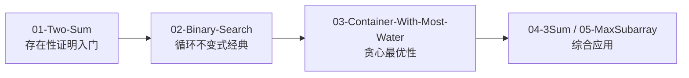

> 📊 **项目全面梳理**：详细的项目结构、模块详解和学习路径，请参阅 [`项目全面梳理-2025.md`](../../项目全面梳理-2025.md)
> **项目导航与对标**：[项目扩展与持续推进任务编排](../../项目扩展与持续推进任务编排.md)、[国际课程对标表](../../国际课程对标表.md)

## 04.00 算法正确性证明案例总览与方法论 / Algorithm Correctness Proof Casebook Overview & Methodology

### 摘要 / Executive Summary

本文档是 `docs/03-形式化证明/04-算法正确性证明案例/` 子模块的总览与方法论纲领。它定义了一套可复现的**四步方法论**——"自然语言规约 → 霍尔逻辑推导 → 循环不变式提取 → Lean 形式化"——用于将 LeetCode 题目的"手写正确性论证"升级为严格的、机器可检验的形式化证明。所有本目录下的具体案例文档均遵循本文档规定的统一分析模板，确保读者在不同算法范式之间迁移时能获得一致的阅读体验。

### 前置阅读 / Prerequisites

- 霍尔逻辑基础：`docs/03-形式化证明/02-程序验证基础/01-霍尔逻辑.md`
- 循环不变式提取：`docs/03-形式化证明/02-程序验证基础/03-循环不变式.md`（待发布时）
- Lean 4 基础：`docs/03-形式化证明/03-Lean 4形式化证明实践/01-Lean 4基础.md`
- LeetCode 形式化规约方法论：`docs/13-LeetCode算法面试专题/03-Explanation/formal-specification/LeetCode题解中的形式化规约方法论.md`

### 关键术语与符号 / Glossary

| 中文术语 | 英文术语 | 说明 |
|----------|----------|------|
| 形式化规约 | Formal Specification | 将自然语言题意翻译为精确的数学谓词 |
| 霍尔逻辑推导 | Hoare Logic Derivation | 使用霍尔规则构建程序正确性的推导树 |
| 循环不变式 | Loop Invariant | 循环体每次迭代前后保持的状态断言 |
| Lean 形式化 | Lean Formalization | 在 Lean 4 证明助手中编写机器可检验的定理与证明 |
| 四步方法论 | Four-Step Methodology | 本文档定义的标准操作流程（SOP） |
| 题意五元组 | Problem Quintuple | `(Input, Precondition, Algorithm, Postcondition, Output)` |

---

## 目录 / Table of Contents

- [04.00 算法正确性证明案例总览与方法论 / Algorithm Correctness Proof Casebook Overview \& Methodology](#0400-算法正确性证明案例总览与方法论--algorithm-correctness-proof-casebook-overview--methodology)
  - [摘要 / Executive Summary](#摘要--executive-summary)
  - [前置阅读 / Prerequisites](#前置阅读--prerequisites)
  - [关键术语与符号 / Glossary](#关键术语与符号--glossary)
- [目录 / Table of Contents](#目录--table-of-contents)
- [1. 四步方法论](#1-四步方法论)
  - [Step 1: 自然语言规约](#step-1-自然语言规约)
  - [Step 2: 霍尔逻辑推导](#step-2-霍尔逻辑推导)
  - [Step 3: 循环不变式提取](#step-3-循环不变式提取)
  - [Step 4: Lean 形式化](#step-4-lean-形式化)
- [2. 统一分析模板](#2-统一分析模板)
- [3. 案例目录与分类](#3-案例目录与分类)
  - [已规划案例（按算法范式分类）](#已规划案例按算法范式分类)
  - [学习路径建议](#学习路径建议)
- [4. 与 LeetCode 模块的交叉引用](#4-与-leetcode-模块的交叉引用)
- [5. 质量保证检查清单](#5-质量保证检查清单)
- [6. 参考文献 / References](#6-参考文献--references)
- [知识导航](#知识导航)
- [学习目标](#学习目标)

---

## 1. 四步方法论

以下方法论将一道 LeetCode 题目的正确性证明拆解为四个递进步骤，每一步都有明确的输入、输出与验证标准。


### Step 1: 自然语言规约

**目标**：消除自然语言题意的歧义，将其翻译为精确的数学描述。

**输入**：LeetCode 题目描述（含约束条件）。

**输出**：**题意五元组** $(\mathcal{I}, Pre, A, Post, \mathcal{O})$：

| 组件 | 符号 | 说明 |
|------|------|------|
| 输入域 | $\mathcal{I}$ | 输入变量的类型与取值范围，如 $a: \text{Array}\langle\mathbb{Z}\rangle, n: \mathbb{N}$ |
| 前置条件 | $Pre$ | 输入必须满足的性质，如 $n = |a| \land n \geq 1$ |
| 算法 | $A$ | 伪代码或命令式程序 |
| 后置条件 | $Post$ | 输出必须满足的性质，如 $\exists i, j. \, a[i] + a[j] = target$ |
| 输出域 | $\mathcal{O}$ | 返回值类型与格式，如 $\text{Option}\langle(\mathbb{N}, \mathbb{N})\rangle$ |

**示例**（LeetCode 1. Two Sum）：

- $\mathcal{I} = \{ a: \text{Array}\langle\mathbb{Z}\rangle, \, target: \mathbb{Z} \}$
- $Pre = \{ |a| \geq 2 \}$
- $Post = \{ \exists i, j. \, 0 \leq i < j < |a| \land a[i] + a[j] = target \}$

**质量检查**：五元组中的每个谓词必须可在一阶逻辑（或高阶逻辑）中表达，且与 LeetCode 官方示例一致。

> 详细规范见：`docs/13-LeetCode算法面试专题/03-Explanation/formal-specification/LeetCode题解中的形式化规约方法论.md`

### Step 2: 霍尔逻辑推导

**目标**：使用霍尔逻辑的推理规则，构造 $\{Pre\} \, A \, \{Post\}$ 的推导树。

**输入**：Step 1 产生的五元组。

**输出**：

1. 顶层霍尔三元组 $\{Pre\} \, A \, \{Post\}$；
2. 若 $A$ 包含循环，则标注循环不变式 $I$ 的位置；
3. 对递归算法，标注归纳假设 $H(n)$。

**关键策略**：

- **顺序算法**：自上而下（从 $Pre$ 出发）或自下而上（从 $Post$ 反向推导，参见 `docs/03-形式化证明/02-程序验证基础/02-最弱前置条件.md`）。
- **分支算法**：使用条件规则，分别验证 then/else 分支。
- **循环算法**：先猜测循环不变式 $I$，再验证初始化、保持、终止三性质。
- **递归算法**：对递归深度进行结构归纳，证明基例与归纳步。

**LeetCode 特化提示**：

- 大多数 LeetCode 题解使用 while/for 循环，因此循环不变式是核心。
- 边界条件（如 $i < n$ vs $i \leq n$）的差异往往体现在霍尔逻辑的前置条件强化上。

### Step 3: 循环不变式提取

**目标**：为迭代算法找到"足够强"且"可保持"的循环不变式，使其在循环终止时能推出后置条件。

**输入**：Step 2 中标注的循环位置与期望的后置条件。

**输出**：

1. 显式写出循环不变式 $I$（一阶公式）；
2. 验证三性质的简短论证；
3. （可选）变式函数 $V$（用于终止性证明）。

**常见模式**（LeetCode 高频）：

| 算法范式 | 循环不变式模式 | 典型题目 |
|----------|----------------|----------|
| 二分查找 | 目标若在，则必在区间 $[lo, hi)$ 内 | 704, 34, 35 |
| 滑动窗口 | 窗口 $[l, r)$ 内满足某性质，且为最优 | 3, 76, 424 |
| 双指针 | 左指针右侧、右指针左侧已被排除 | 11, 15, 42 |
| 前缀和 | $sum$ 等于某区间内元素之和 | 560, 974 |
| 链表遍历 | 已遍历部分满足某逆向/正向性质 | 206, 92 |

**质量检查**：

- 初始化：循环第一次迭代前是否显然成立？
- 保持：假设 $I \land B$ 成立，一次迭代后 $I$ 是否仍成立？
- 终止：$I \land \neg B$ 是否能推出（或经简单推导推出）$Post$？

> 若以上任一检查失败，需修正 $I$ 或重新审视算法逻辑。

### Step 4: Lean 形式化

**目标**：将自然语言的正确性论证翻译为 Lean 4 中可通过类型检查的定理与证明。

**输入**：Step 1–3 的全部产物。

**输出**：一个独立的 `.lean` 文件，包含：

1. 问题实例的定义（输入类型、约束函数）；
2. 算法函数的 Lean 实现（可用 `partial` 或确保终止性）；
3. 核心定理陈述（如 `correctness : ∀ input, Pre input → Post (algorithm input)`）；
4. 证明（允许使用 `sorry` 标记未完成部分，但函数实现必须可运行）。

**翻译对照表**：

| 自然语言概念 | Lean 4 表达 |
|--------------|-------------|
| 前置条件 $Pre$ | `def Pre (a : Array Int) (target : Int) : Prop := a.size ≥ 2` |
| 后置条件 $Post$ | `def Post (a : Array Int) (target : Int) (result : Option (Nat × Nat)) : Prop := ...` |
| 存在性证明 | `use i, j` 或 `exists i, j` |
| 循环不变式 | `def LoopInvariant (a : Array Int) (target : Int) (lo hi : Nat) : Prop := ...` |
| 数学归纳 | `induction n with \| zero => ... \| succ n ih => ...` |
| 自然数性质 | `omega` tactic |

> 详细操作指南见：`docs/13-LeetCode算法面试专题/01-How-To-Guides/formal-proof/如何用Lean4形式化证明LeetCode题目.md`

---

## 2. 统一分析模板

本目录下的每个案例文档必须包含以下固定章节，以确保跨案例的可比性与可检索性。

```markdown
## 题目信息 / Problem Metadata
- LeetCode 题号与名称
- 难度与标签
- 对应 LeetCode 专题文档链接

## Step 1: 形式化规约 / Formal Specification
- 输入域、前置条件、后置条件、输出域
- 与自然语言题意的对照说明

## Step 2: 算法设计与复杂度 / Algorithm Design
- 核心算法思路（1–2 段）
- 时间/空间复杂度

## Step 3: 霍尔逻辑推导 / Hoare Logic Derivation
- 顶层三元组
- 循环不变式（或归纳假设）
- 推导树或逐步论证

## Step 4: 循环不变式验证 / Loop Invariant Verification
- 不变式陈述
- 初始化、保持、终止三性质验证
- （如适用）变式函数与终止性

## Step 5: Lean 4 形式化 / Lean 4 Formalization
- 核心定义与定理陈述
- 证明要点（可选贴出完整证明或关键 tactic）
- 文件路径与编译状态

## 参考文献 / References
- 题目来源
- 相关算法教材或论文

## 交叉引用 / Cross-References
- 指向本模块其他案例
- 指向 LeetCode 专题中的对应题解
```

---

## 3. 案例目录与分类

### 已规划案例（按算法范式分类）

| 编号 | 案例文档 | 算法范式 | 核心证明技术 | 难度 | 状态 |
|------|----------|----------|--------------|------|------|
| 01 | `01-LeetCode-1-Two-Sum.md` | 哈希表 / 查找 | 存在性证明 + 构造性见证 | 初级 | 规划中 |
| 02 | `02-LeetCode-704-Binary-Search.md` | 二分查找 | 循环不变式 + 范围收缩 | 中级 | 规划中 |
| 03 | `03-LeetCode-11-Container-With-Most-Water.md` | 双指针 / 贪心 | 最优性证明（交换论证） | 高级 | 规划中 |
| 04 | `04-LeetCode-15-3Sum.md` | 双指针 / 去重 | 组合完备性 + 不变式 | 高级 | 待规划 |
| 05 | `05-LeetCode-53-Maximum-Subarray.md` | 动态规划 | 归纳法 + 最优子结构 | 中级 | 待规划 |

### 学习路径建议



---

## 4. 与 LeetCode 模块的交叉引用

本案例子模块与 `docs/13-LeetCode算法面试专题/` 形成**理论 ↔ 实践**的双向链接：

| 本模块案例 | 指向 LeetCode 专题 | LeetCode 专题指向本模块 |
|------------|--------------------|--------------------------|
| `01-LeetCode-1-Two-Sum.md` | `13/01-数据结构专题/04-哈希表.md` | 哈希表题解中的"正确性说明"段落 |
| `02-LeetCode-704-Binary-Search.md` | `13/02-算法范式专题/05-二分查找.md` | 二分查找题解中的循环不变式说明 |
| `03-LeetCode-11-Container-With-Most-Water.md` | `13/02-算法范式专题/02-双指针.md` | 双指针题解中的最优性论证 |

**双向引用规范**：

- 从本模块指向 LeetCode：使用相对路径 `../../13-LeetCode算法面试专题/...`
- 从 LeetCode 指向本模块：使用相对路径 `../../03-形式化证明/04-算法正确性证明案例/...`
- 引用形式："关于本题的形式化证明，详见 `03-形式化证明/04-算法正确性证明案例/02-LeetCode-704-Binary-Search.md`"

---

## 5. 质量保证检查清单

在发布任何案例文档前，请确认以下检查项：

- [ ] **规约一致性**：形式化五元组与 LeetCode 官方题意无冲突
- [ ] **推导完整性**：霍尔逻辑推导的每一步都标注了所用规则名称
- [ ] **不变式三性质**：循环不变式明确验证初始化、保持、终止
- [ ] **Lean 可编译**：提供的 `.lean` 代码片段可通过 `lake build`（允许 `sorry`）
- [ ] **交叉引用双向**：本模块与 LeetCode 模块的对应文档互相引用
- [ ] **复杂度标注**：时间/空间复杂度与大 $O$ 记号正确
- [ ] **参考文献完整**：至少包含题目来源与一本标准教材引用

---

## 6. 参考文献 / References

1. **Hoare, C. A. R.** An Axiomatic Basis for Computer Programming. *Communications of the ACM*, 12(10), 1969, 576–580.
2. **Cormen, T. H., et al.** *Introduction to Algorithms* (4th ed.). MIT Press, 2022.
3. **Nipkow, T., & Klein, G.** *Concrete Semantics with Isabelle/HOL*. Springer, 2014.
4. **项目内部文档**：`docs/13-LeetCode算法面试专题/03-Explanation/formal-specification/LeetCode题解中的形式化规约方法论.md`
5. **项目内部文档**：`docs/13-LeetCode算法面试专题/01-How-To-Guides/formal-proof/如何用Lean4形式化证明LeetCode题目.md`

---

## 知识导航

- [返回 03-形式化证明 目录](../README.md)
- [下一章：01-LeetCode-1-Two-Sum](./01-LeetCode-1-Two-Sum.md)（规划中）
- [前置理论：02-程序验证基础/01-霍尔逻辑.md](../02-程序验证基础/01-霍尔逻辑.md)
- [前置理论：02-程序验证基础/03-循环不变式.md](../02-程序验证基础/03-循环不变式.md)（待发布）
- [LeetCode 形式化规约方法论](../../13-LeetCode算法面试专题/03-Explanation/formal-specification/LeetCode题解中的形式化规约方法论.md)
- [Lean 4 形式化证明 How-To](../../13-LeetCode算法面试专题/01-How-To-Guides/formal-proof/如何用Lean4形式化证明LeetCode题目.md)

---

## 学习目标

完成本章节后，读者将能够：

1. 为任意 LeetCode 题目写出精确的**题意五元组**形式化规约；
2. 按照四步方法论，将自然语言的正确性论证组织为结构化的霍尔逻辑推导；
3. 为常见算法范式（二分、双指针、滑动窗口、哈希）识别并验证标准循环不变式模式；
4. 将手写证明翻译为 Lean 4 的定理陈述，并知晓关键 tactic 的对应关系；
5. 在 LeetCode 题解中嵌入形式化正确性说明，提升代码评审与面试沟通的专业度。
