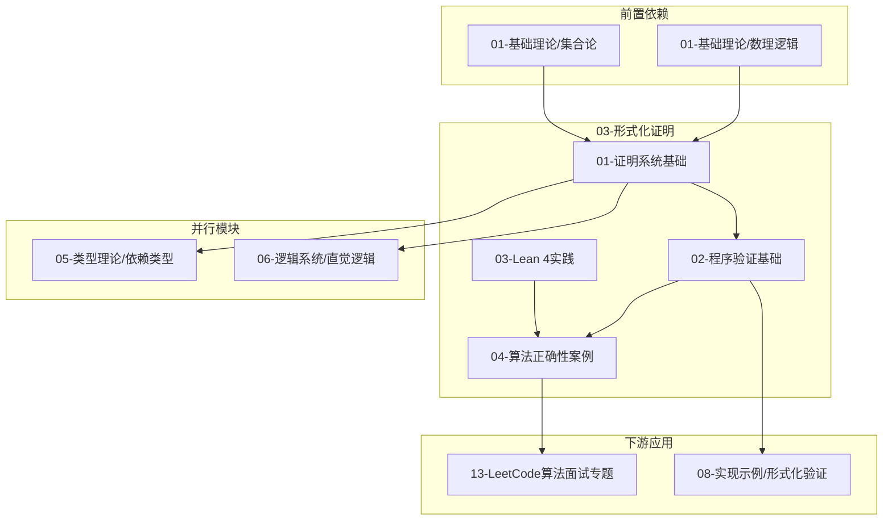

> 📊 **项目全面梳理**：详细的项目结构、模块详解和学习路径，请参阅 [`项目全面梳理-2025.md`](../项目全面梳理-2025.md)
> **项目导航与对标**：[项目扩展与持续推进任务编排](../项目扩展与持续推进任务编排.md)、[国际课程对标表](../国际课程对标表.md)

# 03 形式化证明 / Formal Proof

## 模块定位 / Module Positioning

`03-形式化证明` 是 **FormalAlgorithm** 项目的**核心差异化模块**。本项目主张的"LeetCode + 形式化证明"范式要求：不仅能写出通过测试用例的代码，更能**严格证明代码在所有合法输入下的正确性**。本模块提供从理论（证明系统、霍尔逻辑）到工具（Lean 4）再到实践（LeetCode 算法正确性证明案例）的完整能力栈。

### 模块核心价值

| 维度 | 说明 |
|------|------|
| **理论深度** | 覆盖证明系统、归纳法、构造性/反证法、霍尔逻辑、程序验证，对齐 CMU 15-414 / MIT 6.822 研究生课程深度 |
| **工具实践** | 以 Lean 4 为主证明助手，提供从入门到 LeetCode 形式化的渐进路径 |
| **算法衔接** | 通过 `04-算法正确性证明案例/` 子模块，将形式化方法直接映射到 LeetCode 高频题型 |
| **机器可检验** | 所有核心案例均配备 Lean 4 代码，确保证明可被计算机验证，而非仅依赖人工审阅 |

---

## 子模块结构与导航 / Submodules & Navigation

本模块按"**理论奠基 → 程序验证 → 工具实践 → 算法案例**"的递进逻辑组织，共分为四个子目录：

### 01-证明系统基础 / Proof System Foundations

| 文档 | 内容概要 | 难度 |
|------|----------|------|
| `01-证明系统.md` + `01-证明系统-六维补充.md` | 公理系统、自然演绎、序列演算、切割消除、证明复杂性 | 中级–高级 |

**定位**：形式化证明的通用理论框架。无论你是用 Lean、Coq 还是纸笔证明，都需要理解"什么是合法的推导"。

**核心产出**：能够读懂并书写自然演绎推导树；理解可靠性与完备性的区别。

---

### 02-程序验证基础 / Program Verification Foundations

| 文档 | 内容概要 | 难度 | 状态 |
|------|----------|------|------|
| `01-霍尔逻辑.md` | 霍尔三元组、核心推理规则、可靠性证明、Cook 完备性、LeetCode 语境示例 | 中级 | **新发布** |
| `02-最弱前置条件.md` | wp 计算、Dijkstra 守卫命令、从后置条件自动推导前置条件 | 中级–高级 | 规划中 |
| `03-循环不变式.md` | 不变式三性质、提取方法论、常见模式（二分、双指针、滑动窗口） | 中级 | 规划中 |
| `04-终止性证明.md` | 变式函数、良基归纳、递归与迭代的终止性论证 | 高级 | 规划中 |

**定位**：连接"纯逻辑证明"与"真实代码正确性"的桥梁。LeetCode 中几乎所有迭代算法（二分、双指针、滑动窗口）的正确性证明都依赖本章工具。

**核心产出**：能够为一段循环代码写出可被面试官认可的循环不变式论证；理解为何循环边界条件 `<=` 与 `<` 的差异会影响不变式设计。

---

### 03-Lean 4 形式化证明实践 / Lean 4 Formalization Practice

| 文档 | 内容概要 | 难度 |
|------|----------|------|
| `01-Lean 4基础.md` | Lean 4 安装、类型系统、`def`/`theorem`/`tactic` 入门 | 初级–中级 |
| `02-数学归纳法与结构归纳法.md` | 在 Lean 中使用 `induction`、`cases`、`rw` 完成标准归纳证明 | 中级 |
| `03-从自然语言证明到Lean证明.md` | 翻译方法论：自然语言三段论 → Lean tactic 序列 | 高级 |

**定位**：将纸笔证明升级为机器可检验证明的操作手册。

**核心产出**：能够独立为一道 LeetCode 题目编写 `.lean` 文件，包含规范定义、算法实现、定理陈述与证明骨架。

---

### 04-算法正确性证明案例 / Algorithm Correctness Casebook

| 文档 | 题目 | 算法范式 | 核心证明技术 | 状态 |
|------|------|----------|--------------|------|
| `00-案例总览与方法论.md` | — | — | 四步方法论（规约→推导→不变式→Lean） | **新发布** |
| `01-LeetCode-1-Two-Sum.md` | Two Sum | 哈希表 | 存在性证明 + 构造性见证 | 规划中 |
| `02-LeetCode-704-Binary-Search.md` | Binary Search | 二分查找 | 循环不变式 + 范围收缩 | 规划中 |
| `03-LeetCode-11-Container-With-Most-Water.md` | Container With Most Water | 双指针 / 贪心 | 最优性证明（交换论证） | 规划中 |

**定位**：`03-形式化证明` 与 `13-LeetCode算法面试专题` 的**官方交汇点**。每个案例都展示从题意到 Lean 证明的完整链路。

**核心产出**：掌握"四步方法论"，能在面试中自信地给出算法正确性的形式化论述。

---

## 推荐学习路径 / Recommended Learning Paths

本模块支持三条差异化学习路径，读者可根据自身背景选择：

### 路径 A：算法工程师快速通道（面试导向）

**目标**：在 LeetCode 题解中嵌入可信的正确性论证，提升面试表现。

**时间估计**：2–3 周（每天 1–2 小时）

---

### 路径 B：形式化验证研究员通道（学术导向）

**目标**：建立从逻辑基础到机器证明的完整知识体系，能够独立开展形式化验证研究。

**时间估计**：6–8 周

---

### 路径 C：查漏补缺通道（按需查阅）

**目标**：针对特定证明技术快速定位文档。

| 我想解决的问题 | 跳转文档 |
|--------------|----------|
| "如何为二分查找写循环不变式？" | `02-程序验证基础/03-循环不变式.md` §常见模式 |
| "如何在 Lean 4 中证明存在性定理？" | `03-Lean 4形式化证明实践/03-从自然语言证明到Lean证明.md` |
| "这道 Two Sum 题怎么形式化规约？" | `04-算法正确性证明案例/01-LeetCode-1-Two-Sum.md` |
| "霍尔逻辑和 wp 有什么关系？" | `02-程序验证基础/01-霍尔逻辑.md` §4 + `02-最弱前置条件.md` |

---

## 与其他模块的关系 / Cross-Module Relationships

### 详细依赖说明

| 本模块子目录 | 依赖的上游模块 | 服务的下游模块 |
|--------------|----------------|----------------|
| 01-证明系统基础 | `01-基础理论/02-数理逻辑基础`、`01-基础理论/03-集合论基础` | `05-类型理论/05-依赖类型系统与数理逻辑`、`06-逻辑系统` |
| 02-程序验证基础 | `01-证明系统基础`、`02-递归理论`（归纳法） | `08-实现示例/04-形式化验证`、`10-高级主题/03-证明助手的实现` |
| 03-Lean 4 实践 | `01-证明系统基础`、`05-类型理论/02-依赖类型论` | `04-算法正确性案例`、`13-LeetCode/01-How-To-Guides/formal-proof` |
| 04-算法正确性案例 | `02-程序验证基础`、`03-Lean 4 实践` | `13-LeetCode算法面试专题`（全部子目录） |

---

## 模块完成度与状态 / Completion Status

| 子模块 | 文档数 | 完成度 | 备注 |
|--------|--------|--------|------|
| 01-证明系统基础 | 2 | 100% | 已发布，维护中 |
| 02-程序验证基础 | 4 | 25% | `01-霍尔逻辑.md` 已发布；其余规划中 |
| 03-Lean 4 形式化证明实践 | 3 | 66% | 前两篇已发布；第三篇规划中 |
| 04-算法正确性证明案例 | 4 | 25% | `00-案例总览与方法论.md` 已发布；案例待撰写 |
| **模块整体** | — | **~60% → 目标 90%** | 聚焦 P0/P1 缺口修复，暂停 P2 扩张 |

---

## 参考文献 / References

1. **Hoare, C. A. R.** An Axiomatic Basis for Computer Programming. *Communications of the ACM*, 12(10), 1969, 576–580.
2. **Apt, K. R., & Olderog, E.-R.** *Fifty Years of Hoare's Logic: Formulas and Programs in Retrospect*. Springer, 2019.
3. **Nipkow, T., & Klein, G.** *Concrete Semantics with Isabelle/HOL*. Springer, 2014.
4. **Cormen, T. H., et al.** *Introduction to Algorithms* (4th ed.). MIT Press, 2022.

---

**文档版本**: 2.0
**最后更新**: 2026-04-29
**状态**: maintained（按模块补全方案持续更新中）

---

## 知识导航

- [返回 docs 根目录](../)
- [模块补全方案（最新）](./模块补全方案_2026-04-29.md)
- [形式化证明模块知识图谱](./形式化证明模块知识图谱.md)
- [LeetCode 算法面试专题](../13-LeetCode算法面试专题/README.md)

---

## 学习目标

完成本模块后，读者将能够：

1. 理解并运用公理系统、自然演绎和霍尔逻辑进行形式化推理；
2. 为命令式程序（特别是 LeetCode 迭代算法）写出完整的循环不变式论证；
3. 使用 Lean 4 将自然语言证明翻译为机器可检验的形式化证明；
4. 按照"四步方法论"为任意 LeetCode 题目建立从题意规约到正确性证明的完整链路；
5. 在面试或代码评审中，以形式化语言清晰地论证算法正确性。
