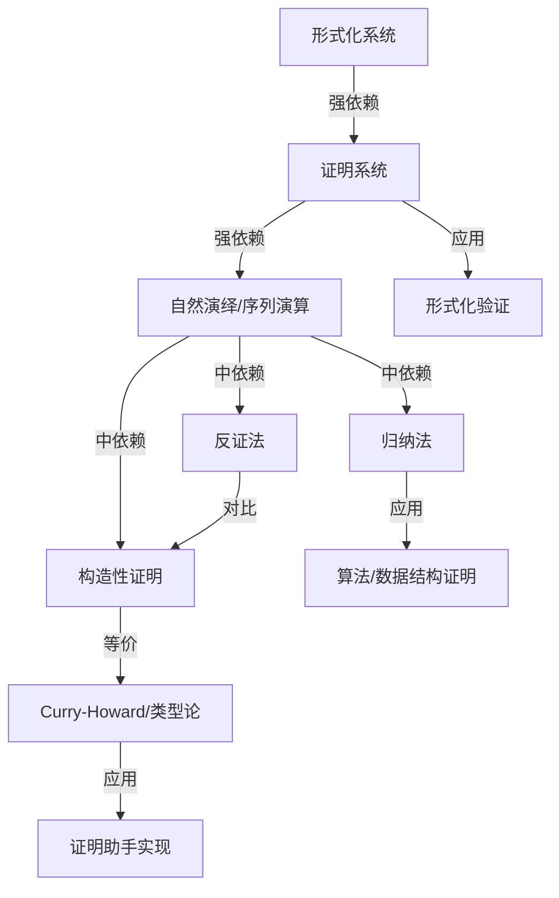
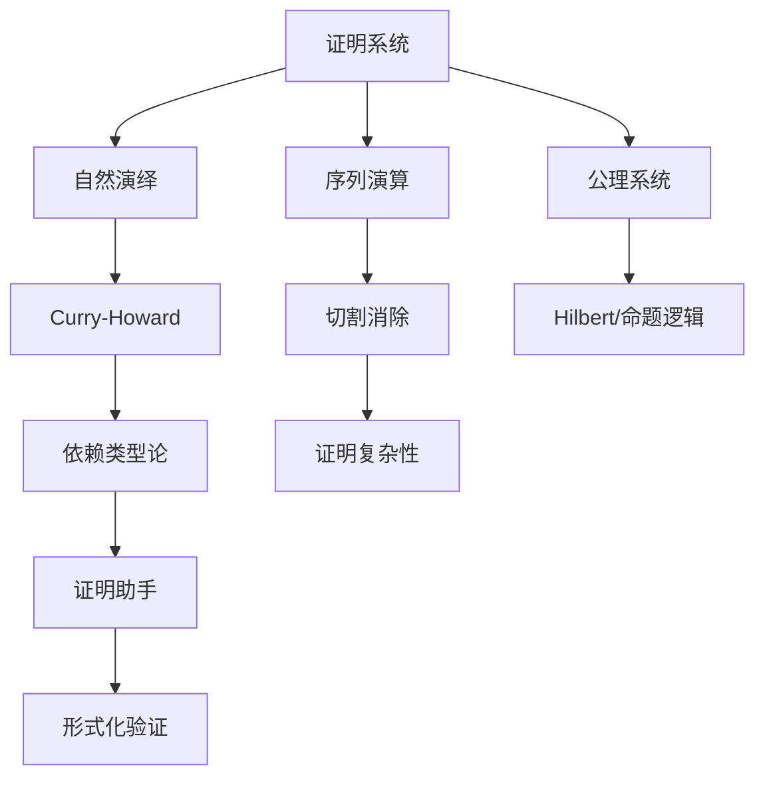
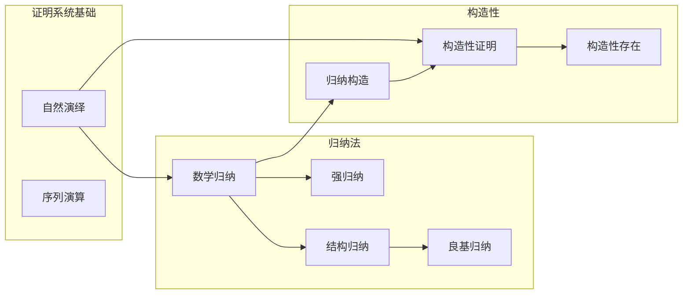
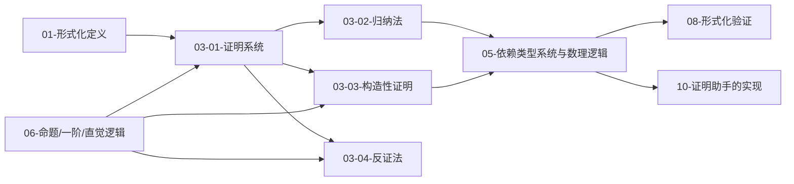

# 形式化证明模块知识图谱

> **创建日期**: 2025-02-02
> **覆盖范围**: 03-形式化证明模块全部文档（01-证明系统、02-归纳法、03-构造性证明、04-反证法）
> **目的**: 建立证明论概念间的语义链接网络，支持与类型论、逻辑系统、形式化验证的关联学习

---

## 一、模块概念依赖图

### 1.1 核心概念依赖关系

### 1.2 详细概念关系

| 源概念 | 目标概念 | 关系类型 | 强度 | 说明 |
|--------|----------|----------|------|------|
| 形式化系统 | 证明系统 | depends_on | 强 | 证明系统建立在形式化系统之上 |
| 证明系统 | 自然演绎/序列演算 | depends_on | 强 | 三大证明框架之核心 |
| 证明系统 | 归纳法 | applies_to | 中 | 归纳法在证明系统中的运用 |
| 证明系统 | 构造性证明 | applies_to | 中 | 构造性证明依赖证明规则 |
| 证明系统 | 反证法 | applies_to | 中 | 反证法依赖否定与切割规则 |
| 归纳法 | 构造性证明 | depends_on | 中 | 归纳构造是构造性证明的一种 |
| 构造性证明 | 反证法 | equivalent_to/对比 | 弱 | 直觉主义下反证法受限 |
| 证明系统 | 类型论证明 | applies_to | 中 | 05-依赖类型系统与数理逻辑 |
| 证明系统 | 形式化验证 | applies_to | 弱 | 08-形式化验证、定理证明器 |

---

## 二、证明系统与逻辑知识图谱

### 2.1 证明系统概念关系

### 2.2 证明系统相关概念索引

**定义位置**: `03-形式化证明/01-证明系统.md` §1.1–§2, §3–§4

**前置概念** (Prerequisites):

- 形式化系统 → `01-基础理论/01-形式化定义.md` §1.1
- 形式语言与推理规则 → `01-基础理论/01-形式化定义.md` §1.2–§1.3

**后续概念** (Next Steps):

- 归纳法 → `03-形式化证明/02-归纳法.md` §1–§5
- 构造性证明 → `03-形式化证明/03-构造性证明.md` §1–§3
- 反证法 → `03-形式化证明/04-反证法.md` §2–§3
- 类型论证明系统 → `05-类型理论/05-依赖类型系统与数理逻辑.md` §5.2–§5.5
- 形式化验证 → `08-实现示例/04-形式化验证.md` §4.1–§4.2

**等价/应用** (Equivalent / Applications):

- 自然演绎与类型论 → 05-依赖类型系统与数理逻辑 §5.2
- 证明助手实现 → `10-高级主题/03-证明助手的实现.md` §3.1–§3.3

---

## 三、归纳法与构造性证明核心图谱

### 3.1 归纳与构造概念层次

### 3.2 概念定义索引

| 概念 | 定义位置 | 文档 |
|------|----------|------|
| 证明系统 | §1.1, §2–§4 | 01-证明系统.md |
| 自然演绎 | §3.1–§3.3 | 01-证明系统.md |
| 序列演算与切割消除 | §4.1–§4.3 | 01-证明系统.md |
| 数学归纳/强归纳/结构归纳/良基归纳 | §1–§5 | 02-归纳法.md |
| 构造性证明与存在性证明 | §1–§3 | 03-构造性证明.md |
| 反证法与排中律 | §2–§3 | 04-反证法.md |

---

## 四、学习路径图

### 4.1 推荐学习顺序

### 4.2 学习路径说明

**基础路径** (必需):

1. 形式化系统与推理规则（01-基础理论）
2. 证明系统（01-证明系统：公理、自然演绎、序列演算）
3. 归纳法（02-归纳法：数学/强/结构/良基归纳）

**扩展路径** (推荐):

1. 构造性证明（03-构造性证明：存在性、直觉主义）
2. 反证法（04-反证法：排中律、与构造性对比）

**应用路径** (可选):

1. 依赖类型系统与数理逻辑（05-类型理论）
2. 形式化验证（08-实现示例/04）
3. 证明助手的实现（10-高级主题/03）

---

## 五、概念快速检索

### 5.1 按主题检索

**证明框架**:

- 公理系统: 03/01 §2
- 自然演绎: 03/01 §3
- 序列演算与切割消除: 03/01 §4
- 证明复杂性: 03/01 §5

**归纳与构造**:

- 数学归纳/强归纳/结构归纳/良基归纳: 03/02 §1–§5
- 构造性存在与归纳构造: 03/03 §2–§3
- 反证法与排中律: 03/04 §3

**与类型论/验证的衔接**:

- 类型论证明系统: 05/05 §5.2–§5.5
- 形式化验证: 08/04 §4.1–§4.2
- 证明助手: 10/03 §3.1–§3.3

### 5.2 按文档检索

| 文档 | 核心概念 |
|------|----------|
| 01-证明系统 | 公理系统、自然演绎、序列演算、切割消除、证明复杂性 |
| 02-归纳法 | 数学归纳、强归纳、结构归纳、良基归纳 |
| 03-构造性证明 | 构造性存在、直觉主义、归纳构造 |
| 04-反证法 | 排中律、否定规则、与构造性证明对比 |

---

**文档版本**: 1.0
**最后更新**: 2025-02-02
**状态**: 形式化证明模块知识图谱（与类型论、验证链路一致）
