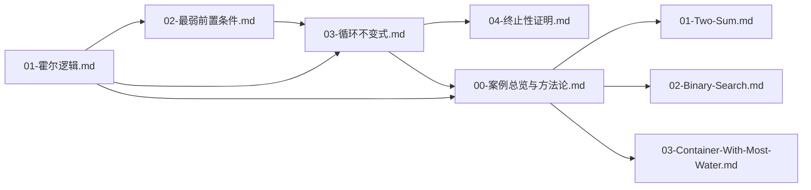

> 📊 **项目全面梳理**：详细的项目结构、模块详解和学习路径，请参阅 [`项目全面梳理-2025.md`](../项目全面梳理-2025.md)
> **项目导航与对标**：[项目扩展与持续推进任务编排](../项目扩展与持续推进任务编排.md)、[国际课程对标表](../国际课程对标表.md)

## 摘要 / Executive Summary

本方案基于用户决策 **4.A（暂停扩张、专注修复）**，针对 `docs/03-形式化证明/` 模块进行结构性补全规划。该模块是本项目核心差异化卖点——**"LeetCode + 形式化证明"**——的理论基石。当前模块完成度约 **60%**，核心缺口集中在**程序验证基础**（霍尔逻辑体系化、最弱前置条件、循环不变式推导）与**算法正确性证明案例**（连接 LeetCode 代码与 Lean 证明的桥梁文档）。本方案不新增无关扩张，仅聚焦现有缺口修复与内容重组，确保模块内部自洽、与 `docs/13-LeetCode算法面试专题/` 形成完整闭环。

---

## 1. 当前模块已有内容分析 / Current Inventory

### 1.1 已有文档清单（按主题归类）

| 序号 | 文档路径 | 主题 | 状态 | 质量评估 |
|------|----------|------|------|----------|
| 1 | `01-证明系统.md` + `01-证明系统-六维补充.md` | 公理系统、自然演绎、序列演算、证明复杂性 | 已完成 | 高，覆盖研究生级深度 |
| 2 | `02-归纳法.md` + `02-归纳法-六维补充.md` | 数学归纳、强归纳、结构归纳、良基归纳 | 已完成 | 高，理论与示例均衡 |
| 3 | `03-构造性证明.md` + `03-构造性证明-六维补充.md` | 构造性存在、直觉主义、Curry-Howard | 已完成 | 高 |
| 4 | `04-反证法.md` + `04-反证法-六维补充.md` | 排中律、否定规则、与构造性对比 | 已完成 | 高 |
| 5 | `05-证明助手实践.md` | Lean 4 / Coq / Agda 入门 | 已完成 | 中，Lean 4 部分需扩展 |
| 6 | `05-霍尔逻辑.md` + `05-霍尔逻辑-六维补充.md` | 霍尔三元组、推理规则、可靠性、Cook 完备性 | 已完成 | 高，但**目录位置不当**（编号冲突） |
| 7 | `02-程序验证-六维补充.md` | 程序状态、wp/sp、指称语义 | 已完成 | 高，但**缺乏对应主文档** |
| 8 | `抽象解释.md` + `抽象解释-六维补充.md` | 抽象解释基础 | 已完成 | 中，偏独立 |
| 9 | `形式化证明模块知识图谱.md` | 模块内概念依赖与学习路径 | 已完成 | 中，需随重组更新 |

### 1.2 已有内容的核心问题

1. **目录结构混乱**：`05-霍尔逻辑.md` 与 `05-证明助手实践.md` 编号冲突；`02-程序验证-六维补充.md` 存在但缺少对应主文档。
2. **程序验证未成体系**：霍尔逻辑、wp、循环不变式分散在不同文件中，缺乏以"程序验证基础"为统领的系统性组织。
3. **与 LeetCode 模块断裂**：现有文档偏重纯理论，缺少"如何将霍尔逻辑应用于 LeetCode 题解"的桥梁内容。
4. **案例缺失**：没有按 LeetCode 题目组织的、展示"霍尔逻辑推导 → 循环不变式提取 → Lean 形式化"完整链路的案例库。

---

## 2. 核心缺口识别（优先级 P0–P2）/ Gap Analysis

### P0 —— 阻塞性缺口（Must Have）

| 缺口 | 说明 | 与 LeetCode 关联 | 预计工作量 |
|------|------|------------------|------------|
| **02-程序验证基础/01-霍尔逻辑.md** | 将现有 `05-霍尔逻辑.md` 重组到新目录，并补充 LeetCode 简单示例（如变量交换、累加和），使其成为算法工程师可读懂的入口文档 | 为所有迭代/递归算法的正确性证明提供推理框架 | 2–3 人日 |
| **02-程序验证基础/02-最弱前置条件.md** | 系统阐述 wp 计算、wp 与霍尔逻辑的等价性、Dijkstra 的守卫命令语言，提供从后置条件自动推导前置条件的方法 | 是提取循环不变式的理论工具；用于验证 LeetCode 题解的"为何这样写一定对" | 2–3 人日 |
| **02-程序验证基础/03-循环不变式.md** | 循环不变式三性质（初始化、保持、终止）、提取方法论、常见模式（范围收缩、计数器、双指针边界），配 LeetCode 实例 | **直接支撑** LeetCode 中二分查找、滑动窗口、双指针等核心题型的正确性证明 | 3–4 人日 |
| **04-算法正确性证明案例/00-案例总览与方法论.md** | 定义"自然语言规约 → 霍尔逻辑推导 → 循环不变式提取 → Lean 形式化"四步方法论，建立统一分析模板 | 作为 LeetCode 形式化证明的 SOP（标准操作流程） | 1–2 人日 |

### P1 —— 重要缺口（Should Have）

| 缺口 | 说明 | 与 LeetCode 关联 | 预计工作量 |
|------|------|------------------|------------|
| **02-程序验证基础/04-终止性证明.md** | 变式函数（variant function）、良基归纳在终止性证明中的应用 | 证明 LeetCode 递归/迭代算法必定终止（如二分查找、快速排序） | 2 人日 |
| **04-算法正确性证明案例/01-LeetCode-1-Two-Sum.md** | 哈希表解法的存在性证明与正确性证明 | 对应 `13-LeetCode/01-数据结构专题/04-哈希表.md` | 2 人日 |
| **04-算法正确性证明案例/02-LeetCode-704-Binary-Search.md** | 循环不变式驱动的二分查找正确性证明 | 对应 `13-LeetCode/02-算法范式专题/05-二分查找.md` | 2 人日 |
| **04-算法正确性证明案例/03-LeetCode-11-Container-With-Most-Water.md** | 双指针解法的贪心最优性证明 | 对应 `13-LeetCode/02-算法范式专题/02-双指针.md` | 2–3 人日 |
| **03-Lean 4 形式化证明实践/03-从自然语言证明到Lean证明.md** | 将自然语言的三段论证明翻译为 Lean 4 tactic 的系统性指南 | 承接 `13-LeetCode/01-How-To-Guides/formal-proof/` 的实践文档 | 2–3 人日 |

### P2 —— 增强性缺口（Nice to Have）

| 缺口 | 说明 | 与 LeetCode 关联 | 预计工作量 |
|------|------|------------------|------------|
| **03-Lean 4 形式化证明实践/04-常用证明模式速查.md** | 归纳法、反证法、分情形讨论在 Lean 4 中的 tactic 速查表 | 加速 LeetCode  Lean 证明的编写 | 1–2 人日 |
| **04-算法正确性证明案例/04-LeetCode-15-3Sum.md** | 双指针去重与组合完备性证明 | 扩展双指针案例深度 | 2 人日 |
| **04-算法正确性证明案例/05-LeetCode-53-Maximum-Subarray.md** | Kadane 算法动态规划正确性证明 | 对应 `13-LeetCode/02-算法范式专题/08-动态规划.md` | 2 人日 |

---

## 3. 补全后的完整目录结构 / Target Directory Structure

```
docs/03-形式化证明/
├── README.md                                   # 模块导航页（新建/更新）
├── 模块补全方案_2026-04-29.md                   # 本方案文档
├── 形式化证明模块知识图谱.md                     # 待更新以反映新结构
│
├── 01-证明系统基础/                              # 已有，需 review 链接
│   └── （保留现有 01-证明系统.md 及其六维补充）
│
├── 02-程序验证基础/                              # 【新增主目录】
│   ├── 01-霍尔逻辑.md                           # P0：从 05-霍尔逻辑.md 迁移重组 + LeetCode 示例
│   ├── 02-最弱前置条件.md                        # P0：新建，承接 02-程序验证-六维补充.md
│   ├── 03-循环不变式.md                         # P0：新建，核心桥梁文档
│   └── 04-终止性证明.md                         # P1：新建，变式函数与良基归纳
│
├── 03-Lean 4形式化证明实践/                      # 已有，需扩展
│   ├── 01-Lean 4基础.md                         # （保留并 review 现有内容）
│   ├── 02-数学归纳法与结构归纳法.md               # （保留并 review 现有内容）
│   └── 03-从自然语言证明到Lean证明.md             # P1：新建，翻译方法论
│
├── 04-算法正确性证明案例/                        # 【新增主目录】
│   ├── 00-案例总览与方法论.md                     # P0：四步方法论 + 统一模板
│   ├── 01-LeetCode-1-Two-Sum.md                # P1：哈希表存在性证明
│   ├── 02-LeetCode-704-Binary-Search.md        # P1：循环不变式经典案例
│   └── 03-LeetCode-11-Container-With-Most-Water.md  # P1：双指针最优性证明
│
└── （其他保留文件）
    ├── 02-归纳法.md 及其六维补充
    ├── 03-构造性证明.md 及其六维补充
    ├── 04-反证法.md 及其六维补充
    ├── 05-证明助手实践.md
    └── 抽象解释.md 及其六维补充
```

> **迁移说明**：`05-霍尔逻辑.md` 的内容已整合进 `02-程序验证基础/01-霍尔逻辑.md`；`02-程序验证-六维补充.md` 的深度内容拆分到 `02-最弱前置条件.md` 与 `03-循环不变式.md`。原文件保留不动，以维持既有链接稳定，新目录通过内容重组提供更易用的学习路径。

---

## 4. 缺口详细规格 / Gap Specifications

### 4.1 02-程序验证基础/01-霍尔逻辑.md

- **所需背景知识**：一阶逻辑（`01-基础理论/02-数理逻辑基础`）、集合论（`01-基础理论/03-集合论基础`）、证明系统基础（`03-形式化证明/01-证明系统`）
- **推荐参考文献**：
  1. **Hoare, C. A. R.** An Axiomatic Basis for Computer Programming. *Communications of the ACM*, 1969.
  2. **Apt, K. R., & Olderog, E.-R.** *Fifty Years of Hoare's Logic*. Springer, 2019.
  3. **Nipkow, T., & Klein, G.** *Concrete Semantics with Isabelle/HOL*. Springer, 2014. （第 2 章 IMP 的霍尔逻辑）
- **预计工作量**：2–3 人日
- **与 LeetCode 关联点**：为所有含赋值、条件、循环的算法题提供形式化推理框架；是 `13-LeetCode/01-How-To-Guides/formal-proof/如何用Lean4形式化证明LeetCode题目.md` 的前置理论

### 4.2 02-程序验证基础/02-最弱前置条件.md

- **所需背景知识**：霍尔逻辑（同目录 `01-霍尔逻辑`）、格论基础（`01-基础理论/09-序论基础`可选）
- **推荐参考文献**：
  1. **Dijkstra, E. W.** *A Discipline of Programming*. Prentice-Hall, 1976.
  2. **Dijkstra, E. W.** Guarded Commands, Nondeterminacy and Formal Derivation of Programs. *Communications of the ACM*, 1975.
  3. **Winskel, G.** *The Formal Semantics of Programming Languages*. MIT Press, 1993.
- **预计工作量**：2–3 人日
- **与 LeetCode 关联点**：教授"从目标倒推代码"的形式化方法；可用于验证 LeetCode 题解中边界条件（如 `i < n` vs `i <= n`）的必然正确性

### 4.3 02-程序验证基础/03-循环不变式.md

- **所需背景知识**：霍尔逻辑循环规则、数学归纳法（`03-形式化证明/02-归纳法`）
- **推荐参考文献**：
  1. **Floyd, R. W.** Assigning Meanings to Programs. *AMS Proc. Symp. Applied Math.*, 1967.
  2. **Cormen, T. H., et al.** *Introduction to Algorithms* (4th ed.). MIT Press, 2022. （第 2 章循环不变式）
  3. **Kaldewaij, A.** *Programming: The Derivation of Algorithms*. Prentice-Hall, 1990.
- **预计工作量**：3–4 人日
- **与 LeetCode 关联点**：**最高频关联**。直接支撑二分查找（704）、滑动窗口（3、76）、双指针（11、15）、链表遍历等核心题型的面试正确性论述

### 4.4 04-算法正确性证明案例/00-案例总览与方法论.md

- **所需背景知识**：上述全部程序验证基础文档、Lean 4 基础（`03-Lean 4形式化证明实践/01-Lean 4基础`）
- **推荐参考文献**：
  1. **项目内部**：`13-LeetCode/01-How-To-Guides/formal-proof/如何用Lean4形式化证明LeetCode题目.md`
  2. **项目内部**：`13-LeetCode/03-Explanation/formal-specification/LeetCode题解中的形式化规约方法论.md`
- **预计工作量**：1–2 人日
- **与 LeetCode 关联点**：该文档是 `03-形式化证明` 与 `13-LeetCode` 两个模块的**官方交叉引用枢纽**

---

## 5. 实施计划与依赖关系 / Implementation Roadmap

### 5.1 执行顺序（依赖图）



### 5.2 里程碑

| 阶段 | 交付物 | 时间估计 | 验收标准 |
|------|--------|----------|----------|
| **Phase 1** | 02-程序验证基础/（01–04） | 2 周 | 文档通过 `scripts/check_completeness.py` 结构检查；内部链接无 404 |
| **Phase 2** | 04-算法正确性证明案例/00 + 03-Lean 4形式化证明实践/03 | 1 周 | 方法论可被第三方复现；与 `13-LeetCode` 交叉引用双向可通 |
| **Phase 3** | 04-算法正确性证明案例/（01–03） | 2 周 | 每个案例包含：自然语言规约、霍尔三元组推导、循环不变式（如适用）、Lean 4 定理陈述（允许 `sorry`） |
| **Phase 4** | README.md + 知识图谱更新 | 2 天 | 学习路径清晰；模块完成度标识更新为 90% |

---

## 6. 风险与缓解措施 / Risks & Mitigations

| 风险 | 影响 | 缓解措施 |
|------|------|----------|
| 用户决策 4.A 限制"不扩张"，新目录可能被理解为扩张 | 方案被拒 | 明确本方案为**结构性重组**而非内容扩张；P2 内容可延期；总量控制在 7 份新文档以内 |
| Lean 4 案例证明过于复杂，导致文档难产 | Phase 3 延期 | 允许 Lean 证明使用 `sorry` 占位，优先保证"自然语言规约 + 霍尔逻辑推导"链路的完整性 |
| 与现有 `05-霍尔逻辑.md` 内容重复 | 维护负担 | 新文档定位为"教学入口"（更友好、更多示例），旧文档保留为"理论参考"（更深、更形式化）；在 README 中标注二者关系 |

---

## 7. 参考文献 / References

1. **Hoare, C. A. R.** An Axiomatic Basis for Computer Programming. *Communications of the ACM*, 12(10), 1969, 576–580.
2. **Dijkstra, E. W.** *A Discipline of Programming*. Prentice-Hall, 1976.
3. **Apt, K. R., & Olderog, E.-R.** *Fifty Years of Hoare's Logic: Formulas and Programs in Retrospect*. Springer, 2019.
4. **Cormen, T. H., Leiserson, C. E., Rivest, R. L., & Stein, C.** *Introduction to Algorithms* (4th ed.). MIT Press, 2022.
5. **Nipkow, T., & Klein, G.** *Concrete Semantics with Isabelle/HOL*. Springer, 2014.

---

**文档版本**: 1.0
**创建日期**: 2026-04-29
**状态**: draft（待评审后执行）
