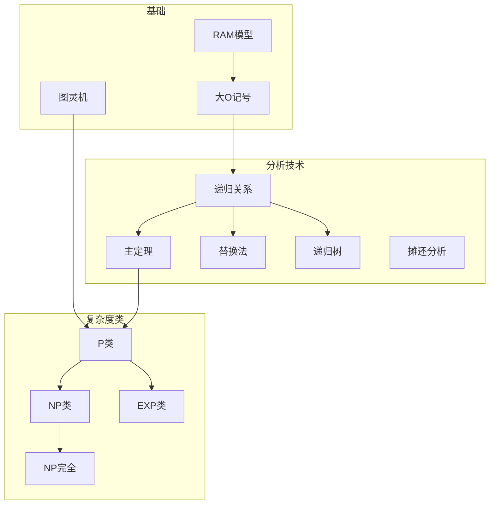

# 时间复杂度 - 六维内容补充


> **版本**: 1.0
> **创建日期**: 2026-04-19
> **最后更新**: 2026-04-19

> **模块**: 04-算法复杂度
> **文档**: 01-时间复杂度
> **补充维度**: 概念定义、属性、关系、解释、论证、形式证明
> **对标**: MIT 6.046 / CMU 15-451 / Stanford CS161 / Berkeley CS170
> **深度**: 研究生级

---

## 思维导图：时间复杂度概念结构

```mermaid
graph TD
    TC[时间复杂度<br/>Time Complexity] --> ACM[算法分析模型]
    TC --> AN[渐进记号<br/>Asymptotic Notation]
    TC --> AT[分析技术]

    ACM --> RAM[RAM模型]
    ACM --> TM[图灵机模型]
    ACM --> UCM[均匀代价/对数代价]

    AN --> BIGO[O 大O记号]
    AN --> OMEGA[Ω Omega记号]
    AN --> THETA[Θ Theta记号]
    AN --> LITTLEO[o 小o记号]
    AN >> LITTLEOMEGA[ω 小omega记号]

    AT --> REC[递归分析]
    AT --> MAST[主定理]
    AT --> SUB[替换法]
    AT --> TREE[递归树]
    AT --> AMO[摊还分析]

    TC --> COMP[复杂度类]
    COMP --> P[P类]
    COMP --> NP[NP类]
    COMP --> NPC[NP完全]
```

---

## 一、概念定义 (Concept Definition)

### 1.1 时间复杂度 / Time Complexity

**定义 1.1.1** (形式化)

设算法 $\mathcal{A}$ 在输入 $x$ 上的运行时间为 $T_{\mathcal{A}}(x)$。算法 $\mathcal{A}$ 的**最坏情况时间复杂度** $T(n)$ 定义为：

$$
T(n) = \max_{|x| = n} T_{\mathcal{A}}(x)
$$

其中 $|x|$ 表示输入 $x$ 的规模（通常以比特或元素个数计）。

**平均情况时间复杂度**:

$$
\bar{T}(n) = \mathbb{E}_{|x| = n}[T_{\mathcal{A}}(x)] = \sum_{|x|=n} p(x) \cdot T_{\mathcal{A}}(x)
$$

其中 $p(x)$ 是输入 $x$ 的概率分布。

**自然语言定义**

时间复杂度是描述算法运行时间随输入规模增长而增长的函数。它提供了算法效率的量化度量，使我们能够比较不同算法的性能并预测其在大型输入上的表现。

---

### 1.2 计算模型 / Computation Model

**定义 1.2.1** (RAM模型)

**随机存取机** (Random Access Machine, RAM) 是一个抽象计算模型：

- **内存**: 无限个寄存器 $R_0, R_1, R_2, \ldots$，每个可存储一个整数
- **程序**: 有限指令序列，每条指令执行基本操作（加载、存储、算术、跳转）
- **时间**: 每条指令耗时1单位时间（**均匀代价准则**）

**对数代价准则**: 操作耗时与操作数位数成正比，即 $\log |x|$。

**与图灵机的关系**:

$$
T_{\text{TM}}(n) = O(T_{\text{RAM}}(n)^2 \cdot \log T_{\text{RAM}}(n))
$$

对于多项式时间算法，RAM和图灵机在复杂度类等价。

---

### 1.3 渐进记号 / Asymptotic Notation

**定义 1.3.1** (大O记号)

$$
O(g(n)) = \{f(n) : \exists c > 0, n_0 > 0, \forall n \geq n_0, 0 \leq f(n) \leq c \cdot g(n)\}
$$

**定义 1.3.2** (Omega记号)

$$
\Omega(g(n)) = \{f(n) : \exists c > 0, n_0 > 0, \forall n \geq n_0, 0 \leq c \cdot g(n) \leq f(n)\}
$$

**定义 1.3.3** (Theta记号)

$$
\Theta(g(n)) = O(g(n)) \cap \Omega(g(n))
$$

**定义 1.3.4** (小o记号)

$$
o(g(n)) = \{f(n) : \forall c > 0, \exists n_0 > 0, \forall n \geq n_0, 0 \leq f(n) < c \cdot g(n)\}
$$

**极限形式等价定义**:

$$
\begin{aligned}
f(n) = O(g(n)) &\iff \limsup_{n \to \infty} \frac{f(n)}{g(n)} < \infty \\
f(n) = o(g(n)) &\iff \lim_{n \to \infty} \frac{f(n)}{g(n)} = 0 \\
f(n) = \Theta(g(n)) &\iff 0 < \liminf_{n \to \infty} \frac{f(n)}{g(n)} \leq \limsup_{n \to \infty} \frac{f(n)}{g(n)} < \infty
\end{aligned}
$$

---

### 1.4 递归关系 / Recurrence Relations

**定义 1.4.1** (分治递归)

典型的分治算法时间复杂度满足：

$$
T(n) = a \cdot T\left(\frac{n}{b}\right) + f(n)
$$

其中：

- $a \geq 1$: 子问题数量
- $b > 1$: 子问题规模缩小因子
- $f(n)$: 分解与合并的代价

---

## 二、属性 (Properties)

### 2.1 渐进记号属性表

| 记号 | 含义 | 直观理解 | 数学条件 |
|------|------|----------|----------|
| **$f = O(g)$** | $f$ 增长不超过 $g$ | 上界 | $\exists c: f \leq c \cdot g$ |
| **$f = \Omega(g)$** | $f$ 增长不低于 $g$ | 下界 | $\exists c: f \geq c \cdot g$ |
| **$f = \Theta(g)$** | $f$ 与 $g$ 同阶 | 紧确界 | $f = O(g) \land f = \Omega(g)$ |
| **$f = o(g)$** | $f$ 严格小于 $g$ | 严格上界 | $\lim f/g = 0$ |
| **$f = \omega(g)$** | $f$ 严格大于 $g$ | 严格下界 | $\lim f/g = \infty$ |

### 2.2 常见复杂度对比矩阵

| 复杂度 | 记号 | $n=10$ | $n=100$ | $n=1000$ | 可解规模示例 |
|--------|------|--------|---------|----------|--------------|
| **常数** | $O(1)$ | 1 | 1 | 1 | 数组访问 |
| **对数** | $O(\log n)$ | 3.3 | 6.6 | 10 | 二分查找 |
| **线性** | $O(n)$ | 10 | 100 | 1000 | 线性扫描 |
| **线性对数** | $O(n \log n)$ | 33 | 660 | 10000 | 归并排序 |
| **平方** | $O(n^2)$ | 100 | 10000 | $10^6$ | 冒泡排序 |
| **立方** | $O(n^3)$ | 1000 | $10^6$ | $10^9$ | 矩阵乘法(朴素) |
| **指数** | $O(2^n)$ | 1024 | $2^{100}$ | $2^{1000}$ | 子集枚举 |
| **阶乘** | $O(n!)$ | $3.6 \times 10^6$ | $9.3 \times 10^{157}$ | - | 排列枚举 |

### 2.3 复杂度增长可视化

```
规模 n →
  │
  │                                    ╱ 2^n
  │                              ╱
  │                        ╱
  │                  ╱   n^3
  │            ╱   n^2
  │      ╱   n log n
  │  ╱  n
  │╱ log n
  │
  └─────────────────────────────────────
  10   100   1000   10000
```

---

## 三、关系 (Relations)

### 3.1 概念关系表

| 源概念 | 目标概念 | 关系类型 | 说明 |
|--------|----------|----------|------|
| 时间复杂度 | 空间复杂度 | related_to | 资源消耗的两面 |
| 大O记号 | 最坏情况分析 | specializes | O记号描述最坏情况 |
| 渐进分析 | 精确分析 | contrasts_with | 忽略常数与低阶项 |
| 主定理 | 分治算法 | applies_to | 分析分治递归 |
| 时间复杂度 | 可计算性 | depends_on | 多项式vs指数决定可行性 |
| P类 | 多项式时间 | equivalent_to | P = \bigcup_k TIME(n^k) |

### 3.2 概念依赖图



---

## 四、解释 (Explanation)

### 4.1 动机与直观

**为什么要忽略常数和低阶项？**

考虑两个算法：

- 算法A: $T_A(n) = 2n^2 + 100n + 1000$
- 算法B: $T_B(n) = n^2 + n + 1$

当 $n = 1000$:

- $T_A(1000) = 2,101,000$
- $T_B(1000) = 1,001,001$

当 $n = 1,000,000$:

- $T_A = 2 \times 10^{12}$
- $T_B = 10^{12}$

**关键洞察**: 对于大规模输入，常数因子和低端项的影响相对越来越小。渐进记号让我们关注增长率的本质差异。

**为什么区分多项式和指数？**

| 规模 $n$ | $n^3$ | $2^n$ | 差距 |
|----------|-------|-------|------|
| 10 | $10^3$ | $10^3$ | 1x |
| 50 | $1.25 \times 10^5$ | $10^{15}$ | $10^{10}$x |
| 100 | $10^6$ | $10^{30}$ | $10^{24}$x |

指数复杂度随规模增长"爆炸"，使得问题在实际中不可解。

### 4.2 与已有概念的联系

**时间复杂度 ↔ 算法设计**

| 设计范式 | 典型复杂度 | 示例 |
|----------|-----------|------|
| 暴力搜索 | 指数 | 子集枚举 $O(2^n)$ |
| 分治 | 对数线性 | 归并排序 $O(n \log n)$ |
| 动态规划 | 多项式 | 背包问题 $O(nW)$ |
| 贪心 | 多项式 | Kruskal $O(E \log E)$ |

**时间复杂度 ↔ 可计算性**

- **P类**: 实际可解的问题
- **NP类**: 解可验证的问题
- **EXP类**: 理论可解但实践困难
- **不可判定**: 连理论可解都做不到（如停机问题）

### 4.3 示例与反例

**示例 4.3.1**: 二分查找复杂度分析

```python
def binary_search(arr, target):
    left, right = 0, len(arr) - 1
    while left <= right:
        mid = (left + right) // 2
        if arr[mid] == target:
            return mid
        elif arr[mid] < target:
            left = mid + 1
        else:
            right = mid - 1
    return -1
```

**分析**:

- 每次迭代搜索空间减半
- 最坏情况：直到搜索空间为1
- 迭代次数：$\lceil \log_2 n \rceil$
- **时间复杂度**: $O(\log n)$

**反例 4.3.2**: 错误的复杂度分析

```python
# 声称是O(n)的算法
def process(arr):
    n = len(arr)
    result = 0
    for i in range(n):
        for j in range(i, n):
            result += arr[i] * arr[j]  # 内层循环!
    return result
```

**错误分析**: 声称是 $O(n)$ 因为"只有一个外层循环"。

**正确分析**:

- 内层循环执行次数：$n + (n-1) + \ldots + 1 = \frac{n(n+1)}{2}$
- **实际复杂度**: $O(n^2)$

---

## 五、论证 (Argumentation)

### 5.1 非形式论证：主定理的直观

**主定理陈述**:

对于递归式 $T(n) = aT(n/b) + f(n)$，比较 $f(n)$ 与 $n^{\log_b a}$：

- **Case 1**: 若 $f(n) = O(n^{\log_b a - \epsilon})$，则 $T(n) = \Theta(n^{\log_b a})$
- **Case 2**: 若 $f(n) = \Theta(n^{\log_b a})$，则 $T(n) = \Theta(n^{\log_b a} \log n)$
- **Case 3**: 若 $f(n) = \Omega(n^{\log_b a + \epsilon})$，则 $T(n) = \Theta(f(n))$

**直观理解**:

想象递归调用树：

- **Case 1**: 叶子层工作量占主导（递归太深）
- **Case 2**: 每层工作量差不多（平衡）
- **Case 3**: 根层工作量占主导（合并代价太高）

**类比**: 像公司组织结构

- Case 1: 底层员工太多，CEO工作可忽略
- Case 2: 每层管理者工作量相当
- Case 3: CEO一个人干了大部分活

### 5.2 反例与边界

**边界情况 5.2.1**: 主定理不适用的情况

$T(n) = 2T(n/2) + n \log n$

这里 $f(n) = n \log n$ 与 $n^{\log_2 2} = n$ 比较：

- $n \log n$ 不是多项式大于 $n$
- 主定理Case 3不适用（正则条件不满足）

**正确解法**: 使用扩展主定理或递归树，得 $T(n) = \Theta(n \log^2 n)$。

**边界情况 5.2.2**: 平均情况的陷阱

快速排序平均 $O(n \log n)$，但最坏 $O(n^2)$。在实际应用中，随机化可以避免最坏情况。

---

## 六、形式证明 (Formal Proof)

### 6.1 主定理证明概要

**定理 6.1.1** (主定理): 对于 $T(n) = aT(n/b) + f(n)$，其中 $a \geq 1, b > 1$。

**证明框架** (Case 1):

**递归树分析**:

- 树深度: $h = \log_b n$
- 第 $k$ 层节点数: $a^k$
- 第 $k$ 层每个子问题规模: $n / b^k$
- 第 $k$ 层总工作量: $a^k \cdot f(n/b^k)$

**总工作量**:

$$
T(n) = \sum_{k=0}^{\log_b n} a^k \cdot f(n/b^k)
$$

**Case 1**: 设 $f(n) = O(n^{\log_b a - \epsilon})$

$$
\begin{aligned}
T(n) &= \sum_{k=0}^{\log_b n} a^k \cdot O\left(\frac{n}{b^k}\right)^{\log_b a - \epsilon} \\
&= O\left(n^{\log_b a - \epsilon}\right) \sum_{k=0}^{\log_b n} a^k \cdot b^{-k(\log_b a - \epsilon)} \\
&= O\left(n^{\log_b a - \epsilon}\right) \sum_{k=0}^{\log_b n} (b^\epsilon)^k \\
&= O\left(n^{\log_b a - \epsilon}\right) \cdot O(n^\epsilon) \\
&= O(n^{\log_b a})
\end{aligned}
$$

(详细推导见CLRS第4章)

### 6.2 证明决策树

```mermaid
graph TD
    Master[主定理证明] --> Tree[递归树分析]
    Tree --> Level[每层工作量]
    Level --> Sum[求和]

    Master --> Case{比较f(n)与n^log_b_a}

    Case -->|f较小| Case1[Case 1]
    Case -->|f相等| Case2[Case 2]
    Case -->|f较大| Case3[Case 3]

    Case1 --> Geo1[几何级数递减]
    Geo1 --> Leaf[叶子主导]

    Case2 --> Geo2[几何级数常数]
    Geo2 --> Equal[每层相等]

    Case3 --> Geo3[几何级数递增]
    Geo3 --> Root[根主导]
```

---

## 七、多语言实现：复杂度分析工具

### 7.1 Rust: 实验性复杂度测量

```rust
use std::time::Instant;

/// 测量算法运行时间
pub fn measure_time<F, T>(f: F, input_sizes: &[usize]) -> Vec<(usize, u128)>
where
    F: Fn(usize) -> T,
{
    let mut results = Vec::new();

    for &n in input_sizes {
        let start = Instant::now();
        let _ = f(n);
        let elapsed = start.elapsed().as_micros();
        results.push((n, elapsed));
    }

    results
}

/// 估计复杂度类别
pub fn estimate_complexity(measurements: &[(usize, u128)]) -> &'static str {
    if measurements.len() < 2 {
        return "Insufficient data";
    }

    let ratios: Vec<f64> = measurements.windows(2)
        .map(|w| {
            let (n1, t1) = (w[0].0 as f64, w[0].1 as f64);
            let (n2, t2) = (w[1].0 as f64, w[1].1 as f64);

            // t2/t1 vs (n2/n1)^k
            let time_ratio = t2 / t1;
            let size_ratio = n2 / n1;

            time_ratio.ln() / size_ratio.ln()
        })
        .collect();

    let avg_exponent: f64 = ratios.iter().sum::<f64>() / ratios.len() as f64;

    match avg_exponent {
        e if e < 0.5 => "O(1) or O(log n)",
        e if e < 1.5 => "O(n)",
        e if e < 2.5 => "O(n²)",
        e if e < 3.5 => "O(n³)",
        _ => "Exponential or higher",
    }
}

#[cfg(test)]
mod tests {
    use super::*;

    #[test]
    fn test_linear_complexity() {
        let measurements = measure_time(
            |n| (0..n).sum::<usize>(),
            &[1000, 2000, 4000, 8000]
        );

        let estimated = estimate_complexity(&measurements);
        println!("Estimated: {}", estimated);
        assert!(estimated.contains("n"));
    }
}
```

### 7.2 Python: 渐进记号实现

```python
from typing import Callable, List, Tuple
import math

class AsymptoticAnalysis:
    """渐进分析工具类"""

    @staticmethod
    def is_big_o(f: Callable[[int], float],
                 g: Callable[[int], float],
                 n_values: List[int],
                 c: float = None) -> Tuple[bool, float]:
        """
        验证 f = O(g)

        返回: (是否满足, 找到的最小c)
        """
        if c is None:
            # 自动寻找最小的c
            ratios = [f(n) / g(n) for n in n_values if g(n) > 0]
            if not ratios:
                return False, float('inf')
            c = max(ratios) * 1.1  # 留一些余量

        for n in n_values:
            if f(n) > c * g(n):
                return False, c

        return True, c

    @staticmethod
    def is_theta(f: Callable[[int], float],
                 g: Callable[[int], float],
                 n_values: List[int]) -> bool:
        """验证 f = Θ(g)"""
        o_check, _ = AsymptoticAnalysis.is_big_o(f, g, n_values)

        # 检查 g = O(f)，即 f = Ω(g)
        omega_check, _ = AsymptoticAnalysis.is_big_o(g, f, n_values)

        return o_check and omega_check

    @staticmethod
    def empirical_complexity(measurements: List[Tuple[int, float]],
                            candidate_classes: List[str] = None) -> List[Tuple[str, float]]:
        """
        通过实验测量估计复杂度类别

        返回: [(类别, 拟合度), ...]
        """
        if candidate_classes is None:
            candidate_classes = ['O(1)', 'O(log n)', 'O(n)', 'O(n log n)',
                                'O(n^2)', 'O(n^3)', 'O(2^n)']

        n_values = [m[0] for m in measurements]
        t_values = [m[1] for m in measurements]

        # 归一化
        max_t = max(t_values)
        normalized_t = [t / max_t for t in t_values]

        results = []

        for class_name in candidate_classes:
            # 计算理论值
            if class_name == 'O(1)':
                theoretical = [1.0] * len(n_values)
            elif class_name == 'O(log n)':
                theoretical = [math.log(n) for n in n_values]
            elif class_name == 'O(n)':
                theoretical = [n for n in n_values]
            elif class_name == 'O(n log n)':
                theoretical = [n * math.log(n) for n in n_values]
            elif class_name == 'O(n^2)':
                theoretical = [n ** 2 for n in n_values]
            elif class_name == 'O(n^3)':
                theoretical = [n ** 3 for n in n_values]
            elif class_name == 'O(2^n)':
                theoretical = [2 ** n for n in n_values]
            else:
                continue

            # 归一化理论值
            max_theory = max(theoretical)
            normalized_theory = [t / max_theory for t in theoretical]

            # 计算拟合度 (1 - 平均相对误差)
            errors = [abs(normalized_t[i] - normalized_theory[i])
                     for i in range(len(n_values))]
            fit = 1.0 - sum(errors) / len(errors)

            results.append((class_name, fit))

        # 按拟合度排序
        results.sort(key=lambda x: x[1], reverse=True)
        return results


if __name__ == "__main__":
    # 示例：分析线性搜索的复杂度
    import time

    def linear_search(n: int) -> float:
        arr = list(range(n))
        target = n - 1

        start = time.time()
        for i, x in enumerate(arr):
            if x == target:
                break
        end = time.time()

        return (end - start) * 1000  # ms

    measurements = []
    for n in [1000, 2000, 4000, 8000, 16000]:
        # 多次测量取平均
        times = [linear_search(n) for _ in range(10)]
        avg_time = sum(times) / len(times)
        measurements.append((n, avg_time))

    print("Measurements:")
    for n, t in measurements:
        print(f"  n={n}: {t:.3f}ms")

    analysis = AsymptoticAnalysis()
    estimates = analysis.empirical_complexity(measurements)

    print("\nEstimated complexity (by fit):")
    for class_name, fit in estimates[:3]:
        print(f"  {class_name}: {fit:.2%} fit")
```

---

## 八、算法复杂度速查表

### 8.1 排序算法复杂度

| 算法 | 最好 | 平均 | 最坏 | 空间 | 稳定 |
|------|------|------|------|------|------|
| 冒泡排序 | $O(n)$ | $O(n^2)$ | $O(n^2)$ | $O(1)$ | 是 |
| 选择排序 | $O(n^2)$ | $O(n^2)$ | $O(n^2)$ | $O(1)$ | 否 |
| 插入排序 | $O(n)$ | $O(n^2)$ | $O(n^2)$ | $O(1)$ | 是 |
| 归并排序 | $O(n \log n)$ | $O(n \log n)$ | $O(n \log n)$ | $O(n)$ | 是 |
| 快速排序 | $O(n \log n)$ | $O(n \log n)$ | $O(n^2)$ | $O(\log n)$ | 否 |
| 堆排序 | $O(n \log n)$ | $O(n \log n)$ | $O(n \log n)$ | $O(1)$ | 否 |
| 计数排序 | $O(n + k)$ | $O(n + k)$ | $O(n + k)$ | $O(k)$ | 是 |
| 基数排序 | $O(nk)$ | $O(nk)$ | $O(nk)$ | $O(n + k)$ | 是 |

### 8.2 数据结构操作复杂度

| 数据结构 | 访问 | 搜索 | 插入 | 删除 | 备注 |
|----------|------|------|------|------|------|
| 数组 | $O(1)$ | $O(n)$ | $O(n)$ | $O(n)$ | 随机访问 |
| 链表 | $O(n)$ | $O(n)$ | $O(1)$ | $O(1)$ | 已知位置 |
| 二叉搜索树 | $O(n)$ | $O(n)$ | $O(n)$ | $O(n)$ | 未平衡 |
| 平衡BST | $O(\log n)$ | $O(\log n)$ | $O(\log n)$ | $O(\log n)$ | AVL/红黑树 |
| 哈希表 | N/A | $O(1)$ | $O(1)$ | $O(1)$ | 平均情况 |
| 堆 | N/A | N/A | $O(\log n)$ | $O(\log n)$ | 优先队列 |

---

**文档版本**: v1.0
**创建日期**: 2026-04-10
**维护**: 项目算法复杂度工作组

---

## 参考文献

- 待补充

---

## 知识导航

- [返回目录](README.md)

