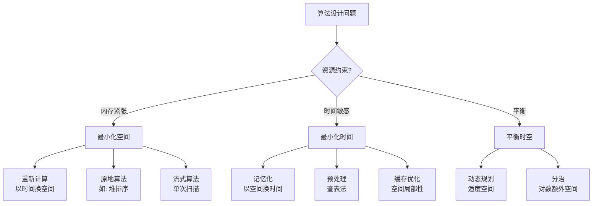

# 空间复杂度 - 六维内容补充


> **版本**: 1.0
> **创建日期**: 2026-04-19
> **最后更新**: 2026-04-19

> **模块**: 04-算法复杂度
> **文档**: 02-空间复杂度
> **补充维度**: 概念定义、属性、关系、解释、论证、形式证明
> **对标**: MIT 6.046 / CMU 15-451 / Berkeley CS170
> **深度**: 研究生级

---

## 思维导图：空间复杂度概念结构

```mermaid
graph TD
    SC[空间复杂度<br/>Space Complexity] --> ACM[辅助空间<br/>Auxiliary Space]
    SC --> IS[输入空间<br/>Input Space]
    SC --> OS[输出空间<br/>Output Space]

    ACM --> RS[递归栈<br/>Recursion Stack]
    ACM --> HT[堆空间<br/>Heap Space]
    ACM --> DS[数据结构<br/>Data Structure]

    SC --> OSA[空间优化技术]
    OSA --> IP[原地算法<br/>In-Place]
    OSA --> RO[滚动数组<br/>Rolling Array]
    OSA --> BJ[位运算压缩<br/>Bit Compression]
    OSA --> SC2[状态压缩<br/>State Compression]

    SC --> TS[时空权衡<br/>Time-Space Tradeoff]
    TS --> MEM[以空间换时间<br/>Memoization]
    TS --> REC2[以时间换空间<br/>Recomputation]

    SC --> CL[复杂度类别]
    CL --> L[L类<br/>对数空间]
    CL >> NL[NL类<br/>非确定对数空间]
    CL >> PSPACE[PSPACE类]
```

---

## 一、概念定义 (Concept Definition)

### 1.1 空间复杂度 / Space Complexity

**定义 1.1.1** (形式化)

算法 $\mathcal{A}$ 在输入 $x$ 上的**空间复杂度** $S(n)$ 定义为：

$$
S(n) = \max_{|x| = n} \left\{\text{算法执行过程中同时占用的最大存储单元数}\right\}
$$

其中存储单元包括：

- 输入数据占用的空间
- 辅助变量和临时存储
- 递归调用栈空间
- 动态分配的堆空间

**组成分解**:

$$
S(n) = S_{\text{input}}(n) + S_{\text{auxiliary}}(n) + S_{\text{output}}(n)
$$

**自然语言定义**

空间复杂度度量算法执行过程中所需存储空间随输入规模增长的速率。它是评估算法资源消耗的另一关键维度，与时间管理共同决定算法的可行性。

---

### 1.2 辅助空间 / Auxiliary Space

**定义 1.2.1** (形式化)

**辅助空间**是算法执行过程中**除输入和输出外**额外需要的存储空间：

$$
S_{\text{auxiliary}}(n) = S(n) - S_{\text{input}}(n) - S_{\text{output}}(n)
$$

**关键区分**:

- **总空间复杂度**: 包含输入、输出和辅助空间
- **辅助空间复杂度**: 仅额外需要的空间

**示例对比**:

| 算法 | 输入空间 | 辅助空间 | 总空间 | 说明 |
|------|----------|----------|--------|------|
| 归并排序 | $O(n)$ | $O(n)$ | $O(n)$ | 需要额外数组 |
| 快速排序 | $O(n)$ | $O(\log n)$ | $O(n)$ | 递归栈空间 |
| 堆排序 | $O(n)$ | $O(1)$ | $O(n)$ | 原地排序 |

---

### 1.3 空间复杂度类别

**定义 1.3.1** (复杂度类)

- **L** (Logarithmic space):
  $$\text{L} = \text{DSPACE}(\log n)$$
  可被确定型图灵机在对数空间内判定的问题。

- **NL** (Nondeterministic Logarithmic space):
  $$\text{NL} = \text{NSPACE}(\log n)$$
  可被非确定型图灵机在对数空间内判定的问题。

- **PSPACE** (Polynomial space):
  $$\text{PSPACE} = \bigcup_{k} \text{DSPACE}(n^k)$$
  多项式空间可解的问题。

**层次关系**:

$$
\text{L} \subseteq \text{NL} \subseteq \text{P} \subseteq \text{NP} \subseteq \text{PSPACE}
$$

**已知结果**:

- $\text{L} \neq \text{PSPACE}$ (空间层次定理)
- $\text{L} \subseteq \text{NL} \subseteq \text{P}$ (是否真包含是开放问题)

---

## 二、属性 (Properties)

### 2.1 空间复杂度属性表

| 属性名 | 类型 | 含义 | 示例 |
|--------|------|------|------|
| **原地性** (In-place) | 布尔 | 辅助空间 $O(1)$ | 堆排序、冒泡排序 |
| **递归深度** | 函数 | 最大递归调用层数 | 快速排序 $O(\log n)$ vs $O(n)$ |
| **栈溢出风险** | 布尔 | 递归深度是否可能超标 | 深度DFS |
| **内存局部性** | 度量 | 访问模式的缓存友好性 | 数组 vs 链表 |
| **动态分配** | 计数 | 堆分配次数 | 影响实际性能 |

### 2.2 排序算法空间复杂度对比

| 算法 | 总空间 | 辅助空间 | 原地性 | 递归栈 | 备注 |
|------|--------|----------|--------|--------|------|
| 冒泡排序 | $O(n)$ | $O(1)$ | ✅ | - | 迭代实现 |
| 选择排序 | $O(n)$ | $O(1)$ | ✅ | - | 迭代实现 |
| 插入排序 | $O(n)$ | $O(1)$ | ✅ | - | 迭代实现 |
| 归并排序 | $O(n)$ | $O(n)$ | ❌ | $O(\log n)$ | 需额外数组 |
| 快速排序 | $O(n)$ | $O(\log n)$ | ✅ | $O(\log n)$ | 平均情况 |
| 堆排序 | $O(n)$ | $O(1)$ | ✅ | - | 原地堆化 |
| 计数排序 | $O(n + k)$ | $O(k)$ | ❌ | - | $k$为值域 |
| 基数排序 | $O(n + k)$ | $O(n + k)$ | ❌ | - | 需桶数组 |

### 2.3 数据结构空间占用对比

| 数据结构 | 空间复杂度 | 单位元素开销 | 备注 |
|----------|-----------|--------------|------|
| 数组 | $O(n)$ | 数据本身 | 连续存储 |
| 链表 | $O(n)$ | 数据 + 2指针 | 指针 overhead |
| 二叉树 | $O(n)$ | 数据 + 2指针 | 左右子节点 |
| 哈希表 | $O(n)$ | 数据 + 1-2指针 | 负载因子0.5-0.75 |
| 线段树 | $O(4n)$ | 数据×4 | 完全二叉树结构 |
| 邻接矩阵 | $O(V^2)$ | 边信息 | 稠密图 |
| 邻接表 | $O(V + E)$ | 边节点 | 稀疏图 |

---

## 三、关系 (Relations)

### 3.1 概念关系表

| 源概念 | 目标概念 | 关系类型 | 说明 |
|--------|----------|----------|------|
| 空间复杂度 | 时间复杂度 | tradeoff_with | 时空权衡是核心设计决策 |
| 辅助空间 | 原地算法 | equivalent_to | 原地 = 辅助空间 $O(1)$ |
| 递归栈 | 递归深度 | proportional_to | 栈空间正比于递归深度 |
| 空间复杂度 | 内存层次 | affects | 影响缓存命中率 |
| L类 | NL类 | contained_in | $\text{L} \subseteq \text{NL}$ |
| NL类 | P类 | contained_in | $\text{NL} \subseteq \text{P}$ |

### 3.2 时空权衡决策图



---

## 四、解释 (Explanation)

### 4.1 动机与直观

**为什么空间复杂度同样重要？**

1. **内存是有限的**: 即使时间允许，内存耗尽会导致程序崩溃
   - 例：$O(n^2)$ 空间的算法在 $n=10^5$ 时需要 40GB 内存

2. **空间影响时间**:
   - 更大的内存占用 $\Rightarrow$ 更多的缓存未命中
   - 随机访问大数组比顺序访问慢 10-100 倍

3. **实际问题约束**:
   - 嵌入式系统：KB级内存
   - 移动应用：内存限制防止后台被杀
   - 大数据处理：无法全部装入内存

**时空权衡的直观例子**:

| 策略 | 时间 | 空间 | 适用场景 |
|------|------|------|----------|
| 查表法 | $O(1)$ | 大 | 三角函数、CRC计算 |
| 实时计算 | $O(n)$ | $O(1)$ | 内存受限的嵌入式 |
| 记忆化 | 首次$O(n)$，后续$O(1)$ | $O(n)$ | 重复查询的优化 |

### 4.2 与已有概念的联系

**空间复杂度 ↔ 算法范式**

| 范式 | 典型空间特征 | 优化方向 |
|------|-------------|----------|
| 贪心 | $O(1)$ 或 $O(n)$ | 通常已很优 |
| 分治 | $O(\log n)$ 栈空间 | 尾递归优化 |
| 动态规划 | $O(n)$ 到 $O(n^2)$ | 滚动数组优化 |
| 回溯 | $O(n)$ 递归栈 | 迭代实现 |

**空间复杂度 ↔ 并行计算**

- 空间可以换取并行度
- 例：归并排序的并行版本需要 $O(n)$ 空间，但可达到 $O(\log n)$ 并行时间

### 4.3 示例与反例

**示例 4.3.1**: Fibonacci的空间优化

```python
# 方法1: 朴素递归 - 空间 O(n)（递归栈）
def fib_recursive(n):
    if n <= 1: return n
    return fib_recursive(n-1) + fib_recursive(n-2)

# 方法2: 记忆化 - 空间 O(n)
def fib_memo(n, memo={}):
    if n in memo: return memo[n]
    if n <= 1: return n
    memo[n] = fib_memo(n-1, memo) + fib_memo(n-2, memo)
    return memo[n]

# 方法3: 滚动数组 - 空间 O(1) ⭐ 最优
def fib_optimized(n):
    if n <= 1: return n
    a, b = 0, 1
    for _ in range(2, n + 1):
        a, b = b, a + b
    return b
```

**反例 4.3.2**: 忽视空间复杂度的后果

```python
# 看似高效的DP - 实际上内存爆炸
def lcs_dp_big_space(s1, s2):
    m, n = len(s1), len(s2)
    # 创建 m×n 的二维数组
    dp = [[0] * n for _ in range(m)]  # O(mn) 空间!
    # ... 填表逻辑
    return dp[m-1][n-1]

# 对于 s1=s2=10^5 的字符串
# 空间需求: 10^10 个整数 ≈ 40GB - 内存溢出!
```

---

## 五、论证 (Argumentation)

### 5.1 非形式论证：为什么归并排序无法原地实现？

**直觉**:
归并操作需要合并两个已排序子数组。如果不用额外空间，合并时元素会被覆盖。

**形式化论证**:
考虑归并两个长度为 $n/2$ 的子数组。稳定归并要求保持相等元素的相对顺序，这需要缓冲空间来暂存元素。

**已知结果**:

- 存在 $O(1)$ 辅助空间的归并排序，但时间复杂度退化到 $O(n^2)$ 或更差
- 最优的"原地归并排序"实际上使用 $O(\log n)$ 位的外部存储

### 5.2 反例与边界

**边界情况 5.2.1**: 递归栈溢出

```python
# 快速排序的最坏情况 - 递归深度O(n)
def quicksort_worst(arr):
    if len(arr) <= 1:
        return arr
    pivot = arr[0]  # 已排序数组的最坏选择
    left = [x for x in arr[1:] if x <= pivot]
    right = [x for x in arr[1:] if x > pivot]
    return quicksort_worst(left) + [pivot] + quicksort_worst(right)

# 对于 n=10^6 的已排序数组
# Python默认递归深度限制1000 - 栈溢出!
```

---

## 六、形式证明 (Formal Proof)

### 6.1 原地快速排序的空间复杂度

**定理 6.1.1**: 原地快速排序的辅助空间复杂度为 $O(\log n)$（期望）。

**证明**:

**算法框架**:

```
quicksort(A, lo, hi):
    if lo < hi:
        p = partition(A, lo, hi)
        quicksort(A, lo, p - 1)
        quicksort(A, p + 1, hi)
```

**空间使用分析**:

1. **partition操作**: $O(1)$ 额外空间（仅使用索引变量）
2. **递归栈空间**: 取决于递归深度

**递归深度分析**:

设 $D(n)$ 为处理规模为 $n$ 的子数组时的最大递归深度。

分区后，两个子问题的规模分别为 $k$ 和 $n-1-k$（$k$ 为分区点位置）。

递归深度满足：
$$D(n) = 1 + \max(D(k), D(n-1-k))$$

**期望深度**:

假设分区点均匀分布在 $[0, n-1]$：

$$\mathbb{E}[D(n)] = 1 + \frac{1}{n} \sum_{k=0}^{n-1} \max(\mathbb{E}[D(k)], \mathbb{E}[D(n-1-k)])$$

由于对称性：
$$\mathbb{E}[D(n)] \leq 1 + \frac{2}{n} \sum_{k=n/2}^{n-1} \mathbb{E}[D(k)]$$

通过归纳法可证 $\mathbb{E}[D(n)] = O(\log n)$。

**最坏情况**: 当分区极度不平衡时，$D(n) = O(n)$。

### 6.2 空间层次定理简述

**定理 6.2.1** (Space Hierarchy Theorem):

对于空间可构造函数 $f(n)$ 和 $g(n)$，若 $f(n) = o(g(n))$，则：

$$\text{DSPACE}(f(n)) \subsetneq \text{DSPACE}(g(n))$$

**推论**:

- $\text{L} \neq \text{PSPACE}$
- 存在需要超多项式空间的问题

---

## 七、多语言实现：空间优化技术

### 7.1 Rust: 滚动数组优化DP

```rust
/// 滚动数组优化的一维DP
/// 适用于只依赖前一行/前一状态的DP问题

/// 斐波那契 - O(1)空间
pub fn fib_rolling(n: usize) -> u64 {
    if n <= 1 {
        return n as u64;
    }

    let mut a = 0u64;
    let mut b = 1u64;

    for _ in 2..=n {
        let next = a.wrapping_add(b);
        a = b;
        b = next;
    }

    b
}

/// 0/1背包 - O(W)空间 (优化前O(nW))
pub fn knapsack_rolling(weights: &[usize], values: &[usize], capacity: usize) -> usize {
    let n = weights.len();
    let mut dp = vec![0; capacity + 1];

    for i in 0..n {
        // 逆序更新，避免覆盖还需要使用的值
        for w in (weights[i]..=capacity).rev() {
            dp[w] = dp[w].max(dp[w - weights[i]] + values[i]);
        }
    }

    dp[capacity]
}

/// 编辑距离 - O(min(m,n))空间
pub fn edit_distance_space_optimized(s1: &str, s2: &str) -> usize {
    let (m, n) = (s1.len(), s2.len());

    // 确保s2是较短的字符串
    if m < n {
        return edit_distance_space_optimized(s2, s1);
    }

    let s1_bytes = s1.as_bytes();
    let s2_bytes = s2.as_bytes();

    let mut prev = vec![0; n + 1];
    let mut curr = vec![0; n + 1];

    // 初始化
    for j in 0..=n {
        prev[j] = j;
    }

    for i in 1..=m {
        curr[0] = i;
        for j in 1..=n {
            if s1_bytes[i-1] == s2_bytes[j-1] {
                curr[j] = prev[j-1];
            } else {
                curr[j] = 1 + curr[j-1].min(prev[j]).min(prev[j-1]);
            }
        }
        // 交换引用而非复制
        std::mem::swap(&mut prev, &mut curr);
    }

    prev[n]
}

/// 位运算压缩的并查集
pub struct BitDSU {
    parent: Vec<u32>,  // 使用u32而非usize节省空间
    rank: Vec<u8>,     // rank最多log(n)，用u8足够
}

impl BitDSU {
    pub fn new(n: usize) -> Self {
        BitDSU {
            parent: (0..n as u32).collect(),
            rank: vec![0; n],
        }
    }

    pub fn find(&mut self, x: u32) -> u32 {
        if self.parent[x as usize] != x {
            self.parent[x as usize] = self.find(self.parent[x as usize]);
        }
        self.parent[x as usize]
    }

    pub fn union(&mut self, x: u32, y: u32) -> bool {
        let px = self.find(x);
        let py = self.find(y);

        if px == py {
            return false;
        }

        match self.rank[px as usize].cmp(&self.rank[py as usize]) {
            std::cmp::Ordering::Less => {
                self.parent[px as usize] = py;
            }
            std::cmp::Ordering::Greater => {
                self.parent[py as usize] = px;
            }
            std::cmp::Ordering::Equal => {
                self.parent[py as usize] = px;
                self.rank[px as usize] += 1;
            }
        }
        true
    }
}
```

### 7.2 Python: 空间复杂度分析工具

```python
import sys
import tracemalloc
from typing import Callable, Any, List, Tuple

class SpaceAnalyzer:
    """空间复杂度分析工具"""

    @staticmethod
    def measure_peak_memory(func: Callable, *args, **kwargs) -> Tuple[Any, int]:
        """
        测量函数执行的峰值内存使用

        返回: (函数返回值, 峰值内存字节数)
        """
        tracemalloc.start()

        result = func(*args, **kwargs)

        current, peak = tracemalloc.get_traced_memory()
        tracemalloc.stop()

        return result, peak

    @staticmethod
    def object_size(obj: Any) -> int:
        """计算对象的内存占用（包括引用的对象）"""
        size = sys.getsizeof(obj)

        if isinstance(obj, dict):
            size += sum(sys.getsizeof(k) + sys.getsizeof(v) for k, v in obj.items())
        elif isinstance(obj, (list, tuple, set)):
            size += sum(sys.getsizeof(item) for item in obj)

        return size

    @staticmethod
    def analyze_space_complexity(algorithm: Callable[[int], Any],
                                 input_sizes: List[int]) -> List[Tuple[int, int]]:
        """
        分析算法的空间复杂度

        返回: [(输入规模, 峰值内存), ...]
        """
        results = []

        for n in input_sizes:
            _, peak = SpaceAnalyzer.measure_peak_memory(algorithm, n)
            results.append((n, peak))

        return results

    @staticmethod
    def estimate_space_complexity(measurements: List[Tuple[int, int]]) -> str:
        """
        根据测量结果估计空间复杂度类别
        """
        if len(measurements) < 2:
            return "Insufficient data"

        # 计算空间增长相对于输入规模的关系
        ratios = []
        for i in range(1, len(measurements)):
            n1, s1 = measurements[i-1]
            n2, s2 = measurements[i]

            if s1 == 0:
                continue

            space_ratio = s2 / s1
            size_ratio = n2 / n1

            # 估计指数
            if size_ratio > 1:
                exp = space_ratio / size_ratio
                ratios.append(exp)

        if not ratios:
            return "O(1)"

        avg_ratio = sum(ratios) / len(ratios)

        if avg_ratio < 0.1:
            return "O(1)"
        elif avg_ratio < 2:
            return "O(n)"
        elif avg_ratio < 5:
            return "O(n log n) or O(n^2)"
        else:
            return "O(n^2) or higher"


# 示例：分析不同实现的空间占用
def create_matrix_2d(n: int) -> List[List[int]]:
    """创建二维矩阵 - O(n^2)空间"""
    return [[i * j for j in range(n)] for i in range(n)]


def create_matrix_compressed(n: int) -> List[int]:
    """创建压缩表示 - O(n)空间（如果可压缩）"""
    # 对于i*j的矩阵，可以只存储i和j的范围
    return [0, n-1, 0, n-1]  # 表示矩阵范围


if __name__ == "__main__":
    analyzer = SpaceAnalyzer()

    # 分析二维数组实现
    print("2D Matrix implementation:")
    measurements = analyzer.analyze_space_complexity(
        create_matrix_2d,
        [100, 200, 400, 800]
    )
    for n, mem in measurements:
        print(f"  n={n}: {mem / 1024:.1f} KB")

    estimated = analyzer.estimate_space_complexity(measurements)
    print(f"Estimated: {estimated}")
```

---

## 八、空间优化技术速查表

### 8.1 DP空间优化

| 原空间 | 优化后 | 技术 | 适用条件 |
|--------|--------|------|----------|
| $O(n^2)$ | $O(n)$ | 滚动数组 | 只依赖前一行 |
| $O(n^2)$ | $O(1)$ | 状态压缩 | 位运算表示状态 |
| $O(n^3)$ | $O(n^2)$ | 区间DP优化 | 只依赖小区间 |
| $O(n)$ | $O(1)$ | 变量滚动 | 只依赖前几个状态 |

### 8.2 数据结构空间优化

| 优化技术 | 空间节省 | 时间代价 | 适用场景 |
|----------|----------|----------|----------|
| 数组代替链表 | 去掉指针开销 | 插入变慢 | 静态数据 |
| 位运算压缩 | 1/8 - 1/32 | 访问变慢 | 布尔数组 |
| 稀疏矩阵存储 | 大量节省 | 访问变慢 | 稀疏数据 |
| 共享子结构 | 去重 | 查找开销 | 重复子树 |

---

**文档版本**: v1.0
**创建日期**: 2026-04-10
**维护**: 项目算法复杂度工作组

---

## 参考文献

- 待补充

---

## 知识导航

- [返回目录](README.md)

## 学习目标

- 理解空间复杂度 - 六维内容补充的核心概念
- 掌握空间复杂度 - 六维内容补充的形式化表示
