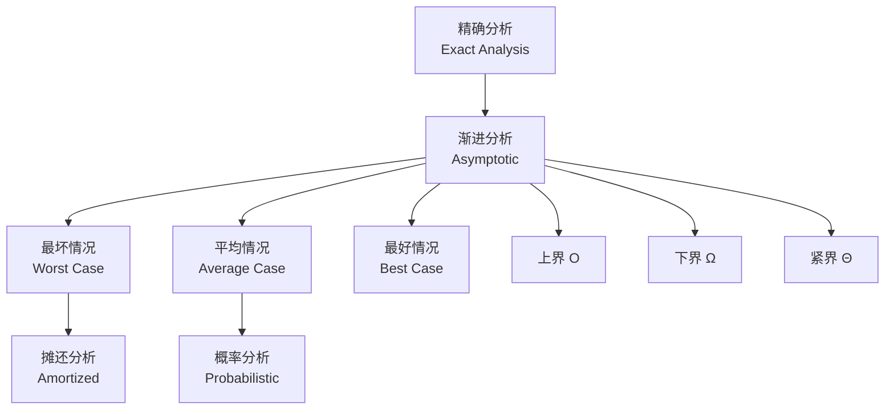

# 渐进分析理论 - 六维内容补充


> **版本**: 1.0
> **创建日期**: 2026-04-19
> **最后更新**: 2026-04-19

> **模块**: 04-算法复杂度
> **文档**: 03-渐进分析
> **补充维度**: 概念定义、属性、关系、解释、论证、形式证明
> **对标**: MIT 6.046 / Stanford CS161 / CMU 15-451
> **深度**: 研究生级

---

## 思维导图：渐进分析概念结构

```mermaid
graph TD
    AA[渐进分析<br/>Asymptotic Analysis] --> NOTA[渐近记号<br/>Asymptotic Notation]
    AA --> LIMIT[极限定义<br/>Limit Definitions]
    AA --> MASTER[主定理<br/>Master Theorem]

    NOTA --> BIGO[Big-O 上界]
    NOTA --> OMEGA[Big-Ω 下界]
    NOTA --> THETA[Big-Θ 紧界]
    NOTA --> LIT[Little-o / ω]

    MASTER --> CASE1[Case 1<br/>f(n) = O(n^{log_b a - ε})]
    MASTER --> CASE2[Case 2<br/>f(n) = Θ(n^{log_b a})]
    MASTER --> CASE3[Case 3<br/>f(n) = Ω(n^{log_b a + ε})]

    AA --> AMORT[摊还分析<br/>Amortized Analysis]
    AMORT --> AGGR[聚合分析]
    AMORT --> ACCT[会计方法]
    AMORT --> POT[势能方法]

    AA --> PROB[概率分析<br/>Probabilistic]
```

---

## 一、概念定义 (Concept Definition)

### 1.1 渐近记号 / Asymptotic Notation

**定义 1.1.1** (形式化)

设 $f, g: \mathbb{N} \rightarrow \mathbb{R}^+$ 为正函数。

| 记号 | 定义 | 直观 |
|------|------|------|
| **$O(g)$** | $\exists c > 0, n_0: \forall n \geq n_0, f(n) \leq c \cdot g(n)$ | $f$ 增长不超过 $g$ |
| **$\Omega(g)$** | $\exists c > 0, n_0: \forall n \geq n_0, f(n) \geq c \cdot g(n)$ | $f$ 增长至少为 $g$ |
| **$\Theta(g)$** | $f \in O(g) \land f \in \Omega(g)$ | $f$ 与 $g$ 同阶 |
| **$o(g)$** | $\forall c > 0, \exists n_0: \forall n \geq n_0, f(n) < c \cdot g(n)$ | $f$ 严格小于 $g$ |
| **$\omega(g)$** | $\forall c > 0, \exists n_0: \forall n \geq n_0, f(n) > c \cdot g(n)$ | $f$ 严格大于 $g$ |

**极限定义**:

- $f \in O(g) \Leftrightarrow \limsup_{n \rightarrow \infty} \frac{f(n)}{g(n)} < \infty$
- $f \in o(g) \Leftrightarrow \lim_{n \rightarrow \infty} \frac{f(n)}{g(n)} = 0$
- $f \in \Theta(g) \Leftrightarrow 0 < \liminf \frac{f}{g} \leq \limsup \frac{f}{g} < \infty$

---

### 1.2 主定理 / Master Theorem

**定义 1.2.1** (形式化)

对于递归式 $T(n) = aT(n/b) + f(n)$，其中 $a \geq 1, b > 1$：

| Case | 条件 | 结果 |
|------|------|------|
| **1** | $f(n) = O(n^{\log_b a - \epsilon})$ | $T(n) = \Theta(n^{\log_b a})$ |
| **2** | $f(n) = \Theta(n^{\log_b a})$ | $T(n) = \Theta(n^{\log_b a} \log n)$ |
| **2'** | $f(n) = \Theta(n^{\log_b a} \log^k n)$ | $T(n) = \Theta(n^{\log_b a} \log^{k+1} n)$ |
| **3** | $f(n) = \Omega(n^{\log_b a + \epsilon})$ 且 $af(n/b) \leq cf(n)$ | $T(n) = \Theta(f(n))$ |

---

### 1.3 摊还分析 / Amortized Analysis

**定义 1.3.1** (形式化)

**摊还代价**是操作序列中单个操作的平均代价上界：

$$T_{\text{amortized}}(n) = \frac{\text{序列总代价}}{\text{操作数}}$$

**三种方法**:

| 方法 | 核心思想 | 适用场景 |
|------|----------|----------|
| **聚合分析** | 直接计算n个操作总代价T(n)，摊还=T(n)/n | 操作代价模式清晰 |
| **会计方法** | 给操作"预付费"，存储信用支付未来昂贵操作 | 需跟踪数据结构状态 |
| **势能方法** | 定义势能函数$\Phi$，摊还=实际+ΔΦ | 形式化分析 |

---

## 二、属性 (Properties)

### 2.1 渐近记号性质

**传递性**:

- $f \in O(g) \land g \in O(h) \Rightarrow f \in O(h)$

**自反性**:

- $f \in O(f)$, $f \in \Omega(f)$, $f \in \Theta(f)$

**对称性**:

- $f \in \Theta(g) \Leftrightarrow g \in \Theta(f)$

**转置对称性**:

- $f \in O(g) \Leftrightarrow g \in \Omega(f)$

**运算规则**:

- $O(f) + O(g) = O(\max(f, g))$
- $O(f) \cdot O(g) = O(f \cdot g)$
- $O(cf) = O(f)$ for $c > 0$

### 2.2 常见复杂度层次

| 复杂度 | 名称 | 典型算法 |
|--------|------|----------|
| $O(1)$ | 常数 | 哈希表查找 |
| $O(\log n)$ | 对数 | 二分查找 |
| $O(n)$ | 线性 | 线性查找 |
| $O(n \log n)$ | 线性对数 | 归并排序、堆排序 |
| $O(n^2)$ | 平方 | 冒泡排序、选择排序 |
| $O(n^3)$ | 立方 | Floyd-Warshall |
| $O(2^n)$ | 指数 | 子集枚举 |
| $O(n!)$ | 阶乘 | 排列枚举 |

### 2.3 摊还分析示例

| 数据结构/操作 | 实际代价 | 摊还代价 | 分析方法 |
|---------------|----------|----------|----------|
| **动态数组 push** | $O(1)$ / $O(n)$ (扩容) | $O(1)$ | 聚合/势能 |
| **二叉堆 insert** | $O(\log n)$ | $O(\log n)$ | 直接分析 |
| **并查集 union** | $O(\alpha(n))$ | $O(\alpha(n))$ | 势能 |
| **Splay树 access** | $O(\log n)$ 均摊 | $O(\log n)$ | 势能 |
| **栈 multipop** | $O(k)$ | $O(1)$ | 会计方法 |

---

## 三、关系 (Relations)

### 3.1 概念关系表

| 源概念 | 目标概念 | 关系类型 | 说明 |
|--------|----------|----------|------|
| $O$ | $o$ | contains | $o(g) \subset O(g)$ |
| $\Theta$ | $O \cap \Omega$ | equals | $\Theta = O \cap \Omega$ |
| 主定理 | 递归树 | based_on | 主定理源自递归树分析 |
| 摊还分析 | 平均情况 | different_from | 摊还≠平均，摊还是最坏保证 |
| 渐进分析 | 精确分析 | approximates | 忽略低阶项和常数 |

### 3.2 复杂度分析层次



---

## 四、解释 (Explanation)

### 4.1 动机与直观

**为什么需要渐进分析？**

精确分析 $T(n) = 3n^2 + 5n + 7$ 对比 $T(n) = 2n^2 + 100n + 1000$：

- 小$n$: 第二个"看起来更好"
- 大$n$: 二次项主导，第一个渐进更优

**渐进分析关注$n \rightarrow \infty$时的增长趋势**，忽略：

- 常数因子
- 低阶项
- 小$n$的行为

**主定理直观**:

比较 $f(n)$ (合并代价) 与 $n^{\log_b a}$ (叶子工作量)：

- **Case 1**: 叶子工作主导 → 复杂度由叶子决定
- **Case 2**: 两者平衡 → 每层贡献相似，多一个log因子
- **Case 3**: 合并工作主导 → 复杂度由根决定

### 4.2 与已有概念的联系

**渐进分析 ↔ 极限理论**

渐近记号本质上是极限概念的另一种表述：

- $f \in o(g) \Leftrightarrow \lim f/g = 0$
- $f \in O(g) \Leftrightarrow \limsup f/g < \infty$

**摊还分析 ↔ 金融会计**

- **会计方法**: 存钱(便宜操作)用于取钱(昂贵操作)
- **势能方法**: 系统势能就像"储蓄账户"

### 4.3 示例与反例

**示例 4.3.1**: 主定理应用

```
1. T(n) = 2T(n/2) + n
   a=2, b=2, log_2(2)=1
   f(n) = n = Θ(n^1) → Case 2
   T(n) = Θ(n log n)

2. T(n) = 4T(n/2) + n
   a=4, b=2, log_2(4)=2
   f(n) = n = O(n^{2-1}) → Case 1
   T(n) = Θ(n^2)

3. T(n) = 3T(n/4) + n log n
   a=3, b=4, log_4(3)≈0.79
   f(n) = Ω(n^{0.79+ε}) → Case 3
   T(n) = Θ(n log n)
```

**反例 4.3.2**: 主定理不适用的情况

```
T(n) = 2T(n/2) + n/log n

n^{log_2 2} = n
f(n) = n/log n

检查：f(n) 与 n 的关系
- 不是 O(n^{1-ε}): n/log n > n^{0.9} 对大n
- 不是 Θ(n): 比值趋于0
- 不是 Ω(n^{1+ε}): 实际上更小

主定理不适用！需要用递归树或其他方法。
```

---

## 五、论证 (Argumentation)

### 5.1 非形式论证：动态数组扩容的摊还分析

**问题**: 动态数组，初始容量1，满时扩容为2倍，push操作摊还代价？

**聚合分析**:

n次push的总代价：

- 普通push: n次 × O(1) = O(n)
- 扩容: 1 + 2 + 4 + ... + 2^{⌈log n⌉} < 2n

总代价 = O(n) + O(n) = O(n)

摊还 = O(n)/n = O(1)

### 5.2 反例与边界

**边界情况 5.2.1**: 渐进分析的局限性

```python
# 算法A: T_A(n) = 1000n log n
# 算法B: T_B(n) = 2n^2

# 渐进分析: A是O(n log n)，B是O(n^2)
# 结论: A渐进更优

# 实际:
# n < 100时，B更快！
# 实际应用中可能需要考虑常数因子
```

---

## 六、形式证明 (Formal Proof)

### 6.1 主定理Case 2证明

**定理**: 若 $f(n) = \Theta(n^{\log_b a})$，则 $T(n) = \Theta(n^{\log_b a} \log n)$。

**证明概要**:

递归树分析：

- 第$i$层有 $a^i$ 个节点
- 每个节点规模 $n/b^i$，代价 $f(n/b^i) = \Theta((n/b^i)^{\log_b a})$
- 第$i$层总代价: $a^i \cdot \Theta((n/b^i)^{\log_b a}) = \Theta(n^{\log_b a})$

树高: $\log_b n$ 层

每层代价相同，共 $\log_b n$ 层：

$$T(n) = \sum_{i=0}^{\log_b n} \Theta(n^{\log_b a}) = \Theta(n^{\log_b a} \log n)$$

### 6.2 势能方法形式化

**定义**: 势能函数 $\Phi: D \rightarrow \mathbb{R}_{\geq 0}$，其中 $D$ 是数据结构状态。

**摊还代价定义**:

$$\hat{c}_i = c_i + \Phi(D_i) - \Phi(D_{i-1}) = c_i + \Delta\Phi$$

**n次操作总代价**:

$$\sum_{i=1}^n c_i = \sum_{i=1}^n \hat{c}_i - \Phi(D_n) + \Phi(D_0) \leq \sum_{i=1}^n \hat{c}_i$$

（假设 $\Phi(D_0) = 0$ 且 $\Phi(D_n) \geq 0$）

---

## 七、复杂度计算速查

### 7.1 递归式求解方法

| 方法 | 适用条件 | 结果形式 |
|------|----------|----------|
| **代入法** | 猜测形式，验证 | 各种 |
| **递归树** | 可视化各层贡献 | 求和形式 |
| **主定理** | $T(n) = aT(n/b) + f(n)$ | 闭式 |
| **Akra-Bazzi** | 非均匀划分 | 积分形式 |

### 7.2 常见递推式解

| 递推式 | 解 | 应用 |
|--------|-----|------|
| $T(n) = T(n/2) + O(1)$ | $O(\log n)$ | 二分查找 |
| $T(n) = 2T(n/2) + O(n)$ | $O(n \log n)$ | 归并排序 |
| $T(n) = T(n-1) + O(1)$ | $O(n)$ | 线性扫描 |
| $T(n) = T(n-1) + O(n)$ | $O(n^2)$ | 选择排序 |
| $T(n) = 2T(n-1) + O(1)$ | $O(2^n)$ | 汉诺塔 |

---

**文档版本**: v1.0
**创建日期**: 2026-04-10
**维护**: 项目复杂度分析工作组

---

## 参考文献

- 待补充

---

## 知识导航

- [返回目录](README.md)

## 学习目标

- 理解渐进分析理论 - 六维内容补充的核心概念
- 掌握渐进分析理论 - 六维内容补充的形式化表示
