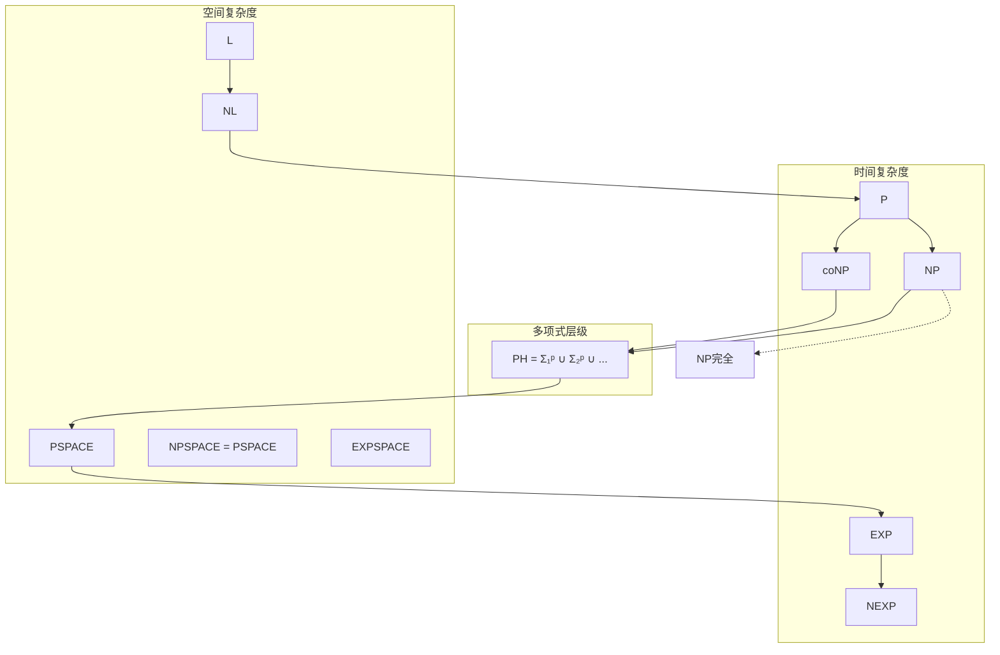

# 复杂度类 - 六维内容补充


> **版本**: 1.0
> **创建日期**: 2026-04-19
> **最后更新**: 2026-04-19

> **模块**: 04-算法复杂度
> **文档**: 04-复杂度类
> **补充维度**: 概念定义、属性、关系、解释、论证、形式证明
> **对标**: MIT 18.404 / CMU 15-455 / Berkeley CS278
> **深度**: 研究生级

---

## 思维导图：复杂度类概念结构

```mermaid
graph TD
    CC[复杂度类<br/>Complexity Classes] --> TIME[时间复杂度]
    CC --> SPACE[空间复杂度]

    TIME --> P[P类<br/>多项式时间]
    TIME --> NP[NP类<br/>非确定多项式]
    TIME --> EXP[EXP类<br/>指数时间]

    SPACE >> L[L类<br/>对数空间]
    SPACE >> NL[NL类<br/>非确定对数空间]
    SPACE >> PSPACE[PSPACE<br/>多项式空间]

    P --> NPC[NP完全<br/>NPC]
    P --> NPI[NP中间<br/>NPI]

    NP --> coNP[coNP类]

    CC --> HIE[层级结构]
    HIE --> PH[多项式层级<br/>PH]
    HIE --> CH[计数层级<br/>CH]

    CC --> REL[重要关系]
    REL --> PVSNP[P vs NP<br/>千禧年问题]
    REL --> NPSPACE[NPSPACE = PSPACE]
```

---

## 一、概念定义 (Concept Definition)

### 1.1 复杂度类 / Complexity Class

**定义 1.1.1** (形式化)

**复杂度类**是具有类似计算资源需求的问题集合。形式上，对于函数 $f: \mathbb{N} \rightarrow \mathbb{N}$：

$$
\text{DTIME}(f(n)) = \{L \mid \exists \text{ DTM } M \text{ 在时间 } O(f(n)) \text{ 内判定 } L\}
$$

$$
\text{DSPACE}(f(n)) = \{L \mid \exists \text{ DTM } M \text{ 在空间 } O(f(n)) \text{ 内判定 } L\}
$$

**自然语言定义**

复杂度类是计算复杂性理论中对计算问题进行分类的框架。它将问题按照解决它们所需的时间和空间资源分组，帮助我们理解问题的内在难度以及问题之间的关系。

---

### 1.2 P类 / Polynomial Time

**定义 1.2.1** (形式化)

$$
\text{P} = \bigcup_{k \geq 1} \text{DTIME}(n^k)
$$

即：P是所有可被确定型图灵机在多项式时间内判定的语言的集合。

**特征**:

- 被认为是"实际可解"的问题类
- 对补运算封闭（P = co-P）
- 对并、交、连接等运算封闭

---

### 1.3 NP类 / Nondeterministic Polynomial Time

**定义 1.3.1** (形式化)

$$
\text{NP} = \bigcup_{k \geq 1} \text{NTIME}(n^k)
$$

**等价定义**（验证者定义）:

$L \in \text{NP}$ 当且仅当存在多项式时间验证者 $V$ 和多项式 $p$：

$$
x \in L \iff \exists c \in \{0,1\}^{p(|x|)}: V(x, c) = 1
$$

其中 $c$ 称为**证书**（certificate）或**见证**（witness）。

---

### 1.4 NP完全性 / NP-Completeness

**定义 1.4.1** (形式化)

语言 $L$ 是**NP完全**的，如果：

1. $L \in \text{NP}$
2. $\forall L' \in \text{NP}: L' \leq_p L$（$L'$ 可多项式归约到 $L$）

**多项式归约** $A \leq_p B$：

存在多项式时间可计算函数 $f$：

$$
x \in A \iff f(x) \in B
$$

**定理**: 若任意NP完全问题在P中，则P = NP。

---

### 1.5 coNP类 / Complement of NP

**定义 1.5.1** (形式化)

$$
\text{coNP} = \{L \mid \overline{L} \in \text{NP}\}
$$

等价地，$L \in \text{coNP}$ 当且仅当存在一个多项式时间验证者 $V$ 和多项式 $p$，使得：

$$
x \in L \iff \forall c \in \{0,1\}^{p(|x|)}: V(x, c) = 1
$$

即：**coNP 是所有可在多项式时间内被反驳（falsified）的语言集合**（Sipser, 2012, §7.3）。

**关键性质**：

- P = coP（显然，因为确定性图灵机可对补运算封闭）
- P ⊆ NP ∩ coNP
- 若 NP ≠ coNP，则 P ≠ NP

---

### 1.6 PSPACE / Polynomial Space

**定义 1.6.1** (严格形式化)

$$
\text{PSPACE} = \bigcup_{k \geq 1} \text{DSPACE}(n^k)
$$

即：PSPACE 是所有可被确定型图灵机在输入长度的多项式空间内判定的语言集合（Sipser, 2012, §8.2; CLRS, 2022, §34.3）。

**等价刻画**：

- PSPACE = NPSPACE（Savitch 定理，见 §6.2）
- PSPACE = \bigcup_{k \geq 1} \text{NSPACE}(n^k)

**典型问题**：

- **TQBF**（全真量词布尔公式）：给定一个全量词化的布尔公式 $\phi = Q_1 x_1 Q_2 x_2 \cdots Q_n x_n \, \psi(x_1, \ldots, x_n)$，判定其是否为真。TQBF 是 PSPACE-完全的（Sipser, 2012, Thm. 8.9）。
- **博弈必胜策略问题**：如广义Hex、国际象棋在 $n \times n$ 棋盘上的必胜策略判定。

---

### 1.7 EXP / Exponential Time

**定义 1.7.1** (严格形式化)

$$
\text{EXP} = \bigcup_{k \geq 1} \text{DTIME}(2^{n^k})
$$

$$
\text{NEXP} = \bigcup_{k \geq 1} \text{NTIME}(2^{n^k})
$$

**关键关系**：

- PSPACE ⊆ EXP（因为空间 $S(n)$ 可在时间 $2^{O(S(n))}$ 内被穷尽搜索）
- NP ⊆ NEXP
- 已知 PSPACE ≠ EXP，但 EXP ≠ NEXP 仍是开放问题
- 若 P = NP，则 EXP = NEXP（Padding 论证）（CLRS, 2022, Ex. 34.2-7）

**典型问题**：

- 广义棋类（如 $n \times n$ 国际象棋、围棋）的必胜策略判定属于 EXP-完全。

---

## 二、属性 (Properties)

### 2.1 主要复杂度类对比

| 复杂度类 | 资源限制 | 典型问题 | 是否包含于P |
|----------|----------|----------|-------------|
| **L** | 对数空间 | 路径连通性 | ✅ 是 |
| **NL** | 非确定对数空间 | 有向路径 | ? ⊆ P |
| **P** | 多项式时间 | 排序、最短路径 | = |
| **NP** | 非确定多项式/证书验证 | SAT、TSP | ? ⊇ P |
| **PSPACE** | 多项式空间 | 博弈、QSAT | ⊇ NP |
| **EXP** | 指数时间 | 广义棋类 | ⊇ PSPACE |
| **NEXP** | 非确定指数 | - | ⊇ EXP |

### 2.2 NP完全问题列表

| 问题 | 描述 | 证明方法 |
|------|------|----------|
| **SAT** | 布尔公式可满足性 | Cook-Levin定理 |
| **3-SAT** | 每个子句3个文字的SAT | 从SAT归约 |
| **CLIQUE** | 图中是否存在k-团 | 从3-SAT归约 |
| **VERTEX-COVER** | 最小顶点覆盖 | 从CLIQUE归约 |
| **HAMILTONIAN-PATH** | 哈密顿路径 | 从3-SAT归约 |
| **TSP** | 旅行商问题 | 从HAMILTONIAN-PATH归约 |
| **SUBSET-SUM** | 子集和问题 | 从3-SAT归约 |
| **KNAPSACK** | 0/1背包问题 | 从SUBSET-SUM归约 |
| **GRAPH-COLORING** | 图着色 | 从3-SAT归约 |
| **INTEGER-PROGRAMMING** | 整数规划 | 从3-SAT归约 |

### 2.3 复杂度类关系表

| 关系 | 含义 | 证明状态 |
|------|------|----------|
| P ⊆ NP | 显然 | 已证明 |
| L ⊆ NL | 显然 | 已证明 |
| NL ⊆ P | 模拟 | 已证明 |
| NP ⊆ PSPACE | 模拟 | 已证明 |
| PSPACE ⊆ EXP | 空间层次 | 已证明 |
| P = NP? | 核心问题 | 开放问题 |
| L = NL? | 空间问题 | 开放问题 |
| NP = coNP? | 对偶问题 | 开放问题 |

---

## 三、关系 (Relations)

### 3.1 概念关系表

| 源概念 | 目标概念 | 关系类型 | 说明 |
|--------|----------|----------|------|
| P | NP | contained_in | P ⊆ NP |
| NP | NP完全 | contains | NPC ⊆ NP |
| SAT | NP完全 | is | 首个NP完全问题 |
| NP完全 | 困难问题 | characterizes | NP难的 ∩ NP |
| PSPACE | NPSPACE | equals | Savitch定理 |
| EXP | NEXP | contained_in | EXP ⊆ NEXP |
| P vs NP | 千禧年问题 | is | 克莱数学研究所问题 |

### 3.2 复杂度类层次图



---

## 四、解释 (Explanation)

### 4.1 动机与直观

**为什么P被认为是"实际可解"？**

考虑多项式 $n^3$ vs 指数 $2^n$：

| $n$ | $n^3$ | $2^n$ | 差距 |
|-----|-------|-------|------|
| 10 | 1,000 | 1,024 | 1x |
| 50 | 125,000 | $10^{15}$ | $10^{10}$x |
| 100 | $10^6$ | $10^{30}$ | $10^{24}$x |

指数增长太快，即使最快的计算机也无法处理中等规模的输入。

**NP的直观**:

"如果答案给你，你能快速验证吗？"

- SAT: 给定赋值，可快速检查是否满足
- TSP: 给定路径，可快速检查长度
- 因子分解: 给定因子，可快速验证乘积

**P vs NP的核心问题**:

"验证是否比求解容易？"

直觉上似乎是"是"，但数学上无法证明。

### 4.2 与已有概念的联系

**复杂度类 ↔ 算法设计**

| 复杂度类 | 算法策略 | 示例 |
|----------|----------|------|
| P | 多项式算法 | 动态规划、贪心 |
| NP | 搜索+验证 | 回溯、分支限界 |
| NP难 | 近似、启发式 | 遗传算法、模拟退火 |
| PSPACE | 博弈树搜索 | Minimax、α-β剪枝 |

**复杂度类 ↔ 密码学**

- 现代密码学依赖于P ≠ NP的假设
- 如果P = NP，大多数加密算法将被破解
- 单向函数的存在性蕴含P ≠ NP

### 4.3 示例与反例

**示例 4.3.1**: 素数测试

PRIMES（判定一个数是否为素数）:

- 1970s: 认为在NP ∩ coNP
- 2002: AKS算法证明 PRIMES ∈ P
- 这是从"可能不在P中"到"确实在P中"的转变

**反例 4.3.2**: 错误的"证明"

声称证明了P = NP的常见错误：

1. 忽略了NP完全问题的某些约束
2. 使用了指数时间的子程序
3. 对"多项式"的误解

---

## 五、论证 (Argumentation)

### 5.1 非形式论证：为什么相信P ≠ NP？

**证据积累**:

1. **长期努力**: 数十年尝试寻找多项式算法未果
2. **结构差异**: NP完全问题缺乏多项式算法的"结构"
3. **oracles**: 相对化技术显示某些证明技术不可能成功
4. **自然证明**: Razborov-Rudich障碍

**类比**:

想象一个巨大的迷宫：

- P: 你能快速找到出口
- NP: 有人给你地图，你能快速验证
- 问题: 有地图是否帮助你快速找到出口？

### 5.2 反例与边界

**边界情况 5.2.1**: 平均情况 vs 最坏情况

某些NP完全问题在平均情况下容易：

- 随机3-SAT在特定参数下可解
- 实际TSP实例通常有良好启发式解

**边界情况 5.2.2**: 近似算法

虽然不能精确求解NPC问题，但某些问题有好的近似算法：

- 顶点覆盖: 2-近似
- MAX-SAT: 0.78-近似
- TSP: 1.5-近似（度量空间）

---

## 六、形式证明 (Formal Proof)

### 6.1 Cook-Levin定理

**定理 6.1.1** (Cook, 1971; Levin, 1973). SAT 是 NP-完全的。

#### 6.1.1 直观解释

Cook-Levin 定理的核心思想是：**任何 NP 问题的计算过程都可以被“编译”成一个布尔电路的可满足性问题**。

想象一个非确定型图灵机 $M$ 在多项式时间 $p(n)$ 内运行。它的整个计算历史——包括每一步的磁带内容、读写头位置、机器状态——可以被编码成一个 $p(n) \times p(n)$ 的“表格”。我们可以用布尔变量 $x_{i,j,s}$ 表示"在时间步 $i$、位置 $j$ 上的符号是 $s$"。然后，我们写下一系列布尔约束，确保：

1. 表格的初始行是输入 $w$；
2. 每一行到下一行的演变符合 $M$ 的转移函数；
3. 某个位置出现过接受状态。

这些约束的合取就是一个布尔公式 $\phi_{M,w}$。$\phi_{M,w}$ 可满足 $\iff$ $M$ 存在一条接受 $w$ 的计算路径。由于表格大小是多项式的，整个公式也是多项式大小的，从而完成了从任意 $L \in \text{NP}$ 到 SAT 的多项式时间归约（CLRS, 2022, Thm. 34.9; Sipser, 2012, Thm. 7.37）。

#### 6.1.2 形式化陈述

设 $L \in \text{NP}$ 由单带非确定型图灵机 $N$ 在时间 $T(n) = O(n^k)$ 内判定。则存在一个多项式时间可计算函数 $f: \Sigma^* \rightarrow \{\text{布尔公式}\}$，使得：

$$
w \in L \iff f(w) \in \text{SAT}
$$

其中 $f(w) = \phi_{N,w}$ 包含 $O(T(n)^2)$ 个变量和 $O(T(n)^2)$ 个子句。

#### 6.1.3 证明概要

**SAT ∈ NP**: 给定一个赋值 $\alpha$，可在多项式时间内逐子句验证 $\alpha$ 是否满足公式。

**NP难性**: 对于任意 $L \in \text{NP}$，构造从 $L$ 到 SAT 的归约。

设 $M$ 是在时间 $T(n) = n^k$ 内判定 $L$ 的NTM。对于输入 $w$（$|w| = n$），构造布尔公式 $\phi_{M,w}$：

$$
\phi_{M,w} = \phi_{cell} \land \phi_{start} \land \phi_{move} \land \phi_{accept}
$$

其中：

- **$\phi_{cell}$**（单元格唯一性）：对每个时间步 $i$ 和位置 $j$，恰好有一个符号出现在单元格 $(i,j)$ 中。
  $$
  \phi_{cell} = \bigwedge_{i,j} \left[ \left( \bigvee_{s \in C} x_{i,j,s} \right) \land \bigwedge_{s \neq t} (\neg x_{i,j,s} \lor \neg x_{i,j,t}) \right]
  $$

- **$\phi_{start}$**（初始配置）：时间 0 时，前 $n$ 个单元格包含 $w$，状态为 $q_0$，读写头在位置 1。

- **$\phi_{move}$**（转移合法性）：每个 $2 \times 3$ 的"窗口"必须对应 $M$ 的一个合法转移。这确保了从第 $i$ 行到第 $i+1$ 行的演变是局部合法的。

- **$\phi_{accept}$**（接受状态）：存在某个时间步 $i$ 和某个位置 $j$，使得 $M$ 处于接受状态 $q_{accept}$。

$\phi_{M,w}$ 的大小为 $O(T(n)^2) = O(n^{2k})$，可在多项式时间内构造。因此 $L \leq_p \text{SAT}$。

---

### 6.2 经典归约证明

归约是复杂度理论的核心工具。下面给出三个经典的 NP-完全性归约证明，展示如何从一个已知的 NP-完全问题构造出另一个问题的 NP-完全性（CLRS, 2022, §34.5）。

#### 6.2.1 3-SAT ≤p CLIQUE

**定理 6.2.1**. CLIQUE 是 NP-完全的。

**证明**（通过从 3-SAT 归约）：

设 $\phi = C_1 \land C_2 \land \cdots \land C_k$ 是一个 3-CNF 公式，其中每个子句 $C_r = (l_1^r \lor l_2^r \lor l_3^r)$ 包含恰好 3 个文字。

我们构造图 $G = (V, E)$ 如下：

- **顶点集**：对每个子句 $C_r$ 中的每个文字 $l_i^r$，创建一个顶点 $v_i^r$。因此共有 $3k$ 个顶点。
- **边集**：两个顶点 $v_i^r$ 和 $v_j^s$ 之间有边，当且仅当：
  1. 它们来自不同的子句（$r \neq s$）；
  2. 对应的文字是**一致**的（不互为补，即不是 $x$ 和 $\neg x$）。

设参数 $k$ 等于子句数。

**Claim**：$\phi$ 可满足 $\iff$ $G$ 有一个大小为 $k$ 的团。

*($\Rightarrow$)* 若 $\phi$ 可满足，取一个满足赋值。每个子句 $C_r$ 中至少有一个文字为真。从每个子句中选出一个为真的文字对应的顶点，得到 $k$ 个顶点。由于这些文字来自不同的子句且可以同时为真（不会互为补），它们在 $G$ 中两两相连，构成一个 $k$-团。

*($\Leftarrow$)* 若 $G$ 有一个 $k$-团，由于同一子句内的顶点之间没有边，这个团必须从 $k$ 个不同子句中各取一个顶点。将这些顶点对应的文字赋值为真。由于团中任意两顶点都有边，这些文字是一致的（不会同时包含 $x$ 和 $\neg x$）。因此可以无矛盾地扩展为一个满足赋值，使得 $\phi$ 为真。

归约在多项式时间内完成，故 3-SAT ≤p CLIQUE，CLIQUE 是 NP-难的。又因 CLIQUE ∈ NP（给定 $k$ 个顶点可在线性时间内验证是否构成团），所以 CLIQUE 是 NP-完全的（CLRS, 2022, Thm. 34.11）。

---

#### 6.2.2 CLIQUE ≤p VERTEX-COVER

**定理 6.2.2**. VERTEX-COVER 是 NP-完全的。

**证明**（通过从 CLIQUE 归约）：

给定图 $G = (V, E)$ 和参数 $k$，问 $G$ 是否有大小为 $k$ 的团。

构造补图 $\overline{G} = (V, \overline{E})$，其中 $\overline{E} = \{(u,v) \mid u,v \in V, u \neq v, (u,v) \notin E\}$。

**Claim**：$G$ 有大小为 $k$ 的团 $\iff$ $\overline{G}$ 有大小为 $|V| - k$ 的顶点覆盖。

*($\Rightarrow$)* 设 $V' \subseteq V$ 是 $G$ 中一个大小为 $k$ 的团。则 $V'$ 中任意两点在 $G$ 中都有边，因此在 $\overline{G}$ 中**没有**边。于是 $\overline{G}$ 中的每条边至少有一个端点不在 $V'$ 中，即 $V \setminus V'$ 覆盖了 $\overline{G}$ 中的所有边。$|V \setminus V'| = |V| - k$。

*($\Leftarrow$)* 设 $V'' \subseteq V$ 是 $\overline{G}$ 中一个大小为 $|V| - k$ 的顶点覆盖。则 $\overline{G}$ 中每条边至少有一个端点在 $V''$ 中，因此在 $V \setminus V''$ 中的顶点之间在 $\overline{G}$ 中没有边。这意味着 $V \setminus V''$ 在 $G$ 中构成一个完全子图（团），其大小为 $|V| - (|V| - k) = k$。

归约只需构造补图，时间是多项式的。结合 CLIQUE 的 NP-完全性，VERTEX-COVER 是 NP-完全的（CLRS, 2022, Thm. 34.12）。

---

#### 6.2.3 3-SAT ≤p HAMILTONIAN-CYCLE

**定理 6.2.3**. HAM-CYCLE（哈密顿回路）是 NP-完全的。

**证明**（通过从 3-SAT 归约，Karp, 1972）：

设 $\phi = C_1 \land \cdots \land C_k$ 是一个 3-CNF 公式，变量为 $x_1, \ldots, x_n$。我们构造有向图 $G$ 使得 $\phi$ 可满足 $\iff$ $G$ 有哈密顿回路。

**变量 gadgets**：对每个变量 $x_i$，构造一个"梯形" gadget（如下图示意）：

```
→ v_i,1 → v_i,2 → ... → v_i,m →
↑                        ↓
← u_i,1 ← u_i,2 ← ... ← u_i,m ←
```

其中 $m$ 是该变量出现的次数（或统一取一个多项式上界）。这个 gadget 有两条哈密顿路径：从上往下走（表示 $x_i = \text{true}$）或从下往上走（表示 $x_i = \text{false}$）。

**子句 gadgets**：对每个子句 $C_j$，构造一个单独的顶点 $c_j$。

**连接**：若文字 $x_i$ 出现在子句 $C_j$ 中，则从变量 gadget $x_i$ 的"true 路径"上拆出一条边，中间插入子句顶点 $c_j$。若文字 $\neg x_i$ 出现在 $C_j$ 中，则从"false 路径"上拆入 $c_j$。

**直观**：哈密顿回路必须选择每个变量 gadget 的一条方向（赋值）。如果子句 $C_j$ 中的某个文字为真，则回路可以"绕道"经过 $c_j$。为了访问所有子句顶点，回路必须让每个子句至少有一个为真的文字，即满足该子句。

形式化地，可以证明：$\phi$ 可满足 $\iff$ $G$ 存在哈密顿回路。归约在多项式时间内完成（gadget 数量和大小都是 $O(nk)$ 的）。因此 HAM-CYCLE 是 NP-完全的（Sipser, 2012, Thm. 7.46; CLRS, 2022, Thm. 34.13）。

---

### 6.3 Savitch定理

### 6.2 Savitch定理

**定理 6.2.1**: $\text{NSPACE}(S(n)) \subseteq \text{DSPACE}(S(n)^2)$。

**推论**: $\text{PSPACE} = \text{NPSPACE}$。

**证明概要**:

通过**可达性方法**模拟非确定性空间。

对于配置图（节点为配置，边为单步转移），非确定性计算对应于从起始配置到接受配置的路径。

使用**递归**检查路径存在性：

```
REACHABLE(c1, c2, t):  // 是否存在从c1到c2的长度≤2^t的路径
    if t = 0: return (c1 == c2 or c1 → c2)
    for each middle configuration cm:
        if REACHABLE(c1, cm, t-1) and REACHABLE(cm, c2, t-1):
            return true
    return false
```

空间复杂度: $O(S(n) \cdot \log(2^{S(n)})) = O(S(n)^2)$。

---

## 七、多语言实现：复杂度分析工具

### 7.1 Python: 复杂度类判定演示

```python
"""
复杂度类相关工具
"""

from typing import Callable, List, Tuple
import time
from functools import wraps

class ComplexityAnalyzer:
    """复杂度分析器"""

    @staticmethod
    def measure_runtime(algorithm: Callable,
                       inputs: List[int],
                       generator: Callable[[int], any]) -> List[Tuple[int, float]]:
        """
        测量算法在不同输入规模下的运行时间

        返回: [(输入规模, 运行时间), ...]
        """
        results = []

        for n in inputs:
            data = generator(n)

            start = time.perf_counter()
            algorithm(data)
            elapsed = time.perf_counter() - start

            results.append((n, elapsed))

        return results

    @staticmethod
    def estimate_complexity_class(measurements: List[Tuple[int, float]]) -> str:
        """
        根据测量结果估计复杂度类别

        使用对数-对数图分析
        """
        if len(measurements) < 2:
            return "Insufficient data"

        # 计算对数斜率
        import math

        log_n = [math.log(m[0]) for m in measurements]
        log_t = [math.log(m[1]) for m in measurements]

        # 最小二乘法估计斜率
        n = len(log_n)
        sum_x = sum(log_n)
        sum_y = sum(log_t)
        sum_xy = sum(x * y for x, y in zip(log_n, log_t))
        sum_x2 = sum(x * x for x in log_n)

        slope = (n * sum_xy - sum_x * sum_y) / (n * sum_x2 - sum_x * sum_x)

        # 根据斜率估计复杂度
        if slope < 0.5:
            return "O(1) or O(log n)"
        elif slope < 1.5:
            return "O(n)"
        elif slope < 2.5:
            return "O(n^2)"
        elif slope < 3.5:
            return "O(n^3)"
        else:
            return "Exponential or higher"

    @staticmethod
    def verify_polynomial_time(algorithm: Callable,
                              input_generator: Callable[[int], any],
                              max_n: int = 10000,
                              threshold: float = 3.0) -> bool:
        """
        验证算法是否在多项式时间内运行

        检查运行时间是否随输入规模多项式增长
        """
        sizes = [100, 200, 400, 800, 1600, 3200]
        sizes = [s for s in sizes if s <= max_n]

        times = []
        for n in sizes:
            data = input_generator(n)
            start = time.perf_counter()
            algorithm(data)
            elapsed = time.perf_counter() - start
            times.append((n, elapsed))

        # 检查是否近似多项式
        for i in range(1, len(times)):
            n_ratio = times[i][0] / times[i-1][0]
            t_ratio = times[i][1] / times[i-1][1]

            # 如果时间是多项式的，t_ratio 应该近似于 n_ratio^k
            # 如果指数增长，t_ratio 会非常大
            if t_ratio > n_ratio ** threshold:
                return False

        return True


# 示例: 比较多项式 vs 指数算法
def demo_complexity_classes():
    analyzer = ComplexityAnalyzer()

    # O(n) 算法: 线性扫描
    def linear_search(arr):
        target = len(arr) - 1
        for i, x in enumerate(arr):
            if x == target:
                return i
        return -1

    # O(n^2) 算法: 冒泡排序
    def bubble_sort(arr):
        arr = arr.copy()
        n = len(arr)
        for i in range(n):
            for j in range(0, n - i - 1):
                if arr[j] > arr[j + 1]:
                    arr[j], arr[j + 1] = arr[j + 1], arr[j]
        return arr

    # 生成输入
    def generate_input(n):
        return list(range(n))

    print("=== Linear Search (O(n)) ===")
    measurements = analyzer.measure_runtime(
        linear_search,
        [1000, 2000, 4000, 8000],
        generate_input
    )
    for n, t in measurements:
        print(f"n={n}: {t*1000:.3f} ms")
    print(f"Estimated: {analyzer.estimate_complexity_class(measurements)}")

    print("\n=== Bubble Sort (O(n^2)) ===")
    measurements = analyzer.measure_runtime(
        bubble_sort,
        [500, 1000, 2000],
        generate_input
    )
    for n, t in measurements:
        print(f"n={n}: {t*1000:.3f} ms")
    print(f"Estimated: {analyzer.estimate_complexity_class(measurements)}")


if __name__ == "__main__":
    demo_complexity_classes()
```

---

## 八、复杂度类速查表

### 8.1 主要复杂度类包含关系

```
L ⊆ NL ⊆ P ⊆ NP ⊆ PH ⊆ PSPACE = NPSPACE ⊆ EXP ⊆ NEXP ⊆ EXPSPACE
```

### 8.2 P vs NP 关键事实

| 事实 | 说明 |
|------|------|
| P ⊆ NP | 显然成立 |
| P = NP? | 开放问题，$10^6$美元奖金 |
| NP完全存在 | Cook-Levin定理 |
| 大量候选问题 | 数千个NP完全问题 |
| 证明障碍 | 相对化、自然证明障碍 |

### 8.3 NP完全问题识别指南

一个问题可能是NP完全的，如果：

- ✅ 解可在多项式时间内验证
- ✅ 涉及组合搜索或优化
- ✅ 与已知NP完全问题相似
- ✅ 长期寻找多项式算法未果

---

## 九、参考文献 / References

**引用规范说明 / Citation Guidelines**: 本文档遵循项目引用规范（见 [CITATION_STANDARD.md](../CITATION_STANDARD.md)、[学术引用规范-ACM对齐版.md](../学术引用规范-ACM对齐版.md)）。文内采用 (Author, Year) 格式引用。

### 经典教材

1. **Cormen, T. H., Leiserson, C. E., Rivest, R. L., & Stein, C.** (2022). *Introduction to Algorithms* (4th ed.). MIT Press.
   - ISBN: 978-0262046305
   - Chapter 34: NP-Completeness
   - 本文档中 NP-完全性、Cook-Levin 定理、经典归约证明等内容的主要参考来源。

2. **Sipser, M.** (2012). *Introduction to the Theory of Computation* (3rd ed.). Cengage Learning.
   - ISBN: 978-1133187790
   - Chapter 7: Time Complexity; Chapter 8: Space Complexity
   - 本文档中复杂度类 P、NP、coNP、PSPACE、EXP 的严格定义及 Savitch 定理的主要参考来源。

### 经典论文

1. **Cook, S. A.** (1971). "The Complexity of Theorem-Proving Procedures". *Proceedings of the 3rd Annual ACM Symposium on Theory of Computing*, 151-158.
   - Cook-Levin 定理的原始证明。

2. **Levin, L. A.** (1973). "Universal Search Problems" (in Russian). *Problemy Peredachi Informatsii*, 9(3), 265-266.
   - 独立于 Cook 提出 NP-完全性概念。

3. **Karp, R. M.** (1972). "Reducibility among Combinatorial Problems". *Complexity of Computer Computations*, 85-103.
   - 开创了从 3-SAT 到 HAM-CYCLE、CLIQUE 等问题的多项式归约体系。

4. **Savitch, W. J.** (1970). "Relationships between Nondeterministic and Deterministic Tape Complexities". *Journal of Computer and System Sciences*, 4(2), 177-192.
   - Savitch 定理的原始证明。

---

**文档版本**: v1.0
**创建日期**: 2026-04-10
**维护**: 项目算法复杂度工作组

---

## 参考文献

- [CLRS2009]

---

## 知识导航

- [返回目录](README.md)

## 学习目标

- 理解复杂度类 - 六维内容补充的核心概念
- 掌握复杂度类 - 六维内容补充的形式化表示
