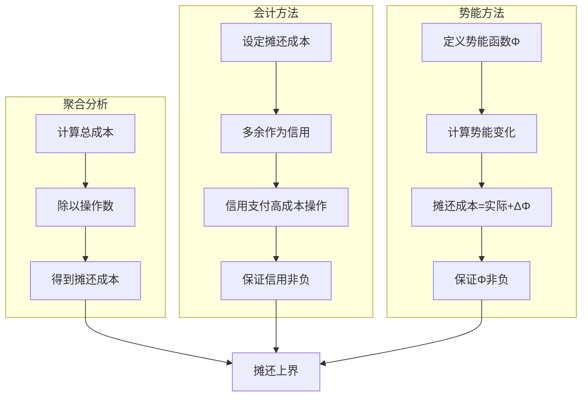
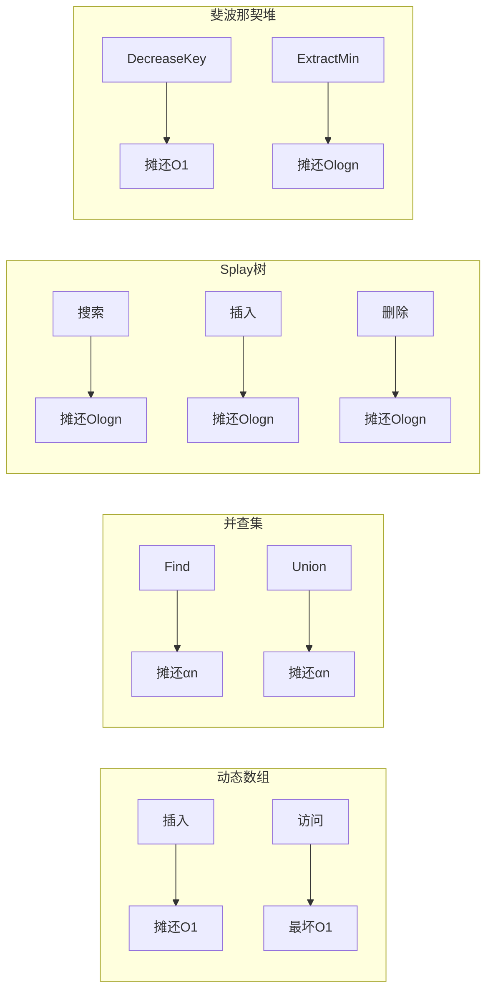
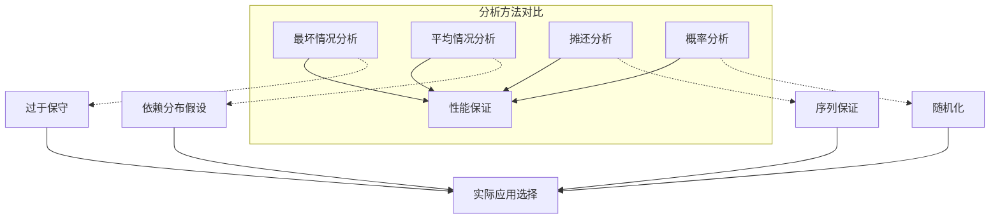

# 摊还分析 - 六维补充


> **版本**: 1.0
> **创建日期**: 2026-04-19
> **最后更新**: 2026-04-19

## 思维导图

```mermaid
mindmap
  root((摊还分析))
    聚合分析
      总成本/操作数
      栈操作示例
      二进制计数器
      计算步骤
    会计方法
      摊还成本设定
      信用/存款机制
      栈操作
      数据结构维护
    势能方法
      势能函数定义
      状态势能
      实际成本与摊还成本
      数学框架
    应用场景
      动态数组
        倍增策略
        摊还O(1)插入
      并查集
        路径压缩
        按秩合并
      Splay树
        伸展操作
        摊还对数界
      斐波那契堆
        懒合并
        Dijkstra加速
    对比分析
      方法等价性
      适用场景
      复杂度界限
```

---

## 1. 基础定义

### 1.1 摊还分析的本质

**定义**：摊还分析（Amortized Analysis）用于分析数据结构上一系列操作的**平均性能**，其中某些操作代价高，某些代价低，但高代价操作的发生频率受到低代价操作的限制。

> 关键区分：摊还分析 ≠ 平均情况分析
>
> - **摊还分析**：最坏情况下的平均（保证性）
> - **平均情况分析**：概率期望（依赖于输入分布）

### 1.2 三种核心方法

| 方法 | 核心思想 | 适用场景 | 计算复杂度 |
|------|----------|----------|------------|
| **聚合分析** | 计算 n 个操作的总时间上界，除以 n | 操作序列分析 | 需要全局视图 |
| **会计方法** | 为操作分配"摊还成本"，多余部分作为信用存储 | 单个操作分析 | 直观易理解 |
| **势能方法** | 定义势能函数，将操作成本与数据结构状态关联 | 复杂数据结构 | 数学性强 |

### 1.3 形式化定义

设操作序列为 $op_1, op_2, \ldots, op_n$，实际成本为 $c_1, c_2, \ldots, c_n$。

**摊还成本**：
$$\text{摊还成本} = \frac{\sum_{i=1}^n c_i}{n}$$

对于**会计方法**和**势能方法**，需要保证：
$$\sum_{i=1}^n \hat{c}_i \geq \sum_{i=1}^n c_i$$

其中 $\hat{c}_i$ 是摊还成本。

---

## 2. 六维分析

### 2.1 维度分析表

| 维度 | 分析 | 关联概念 |
|------|------|----------|
| **逻辑结构** | 操作序列的成本分配遵循"预付费"逻辑，高成本操作由前期低成本操作积累的信用支付 | 预付费机制、信用系统 |
| **代数性质** | 势能函数构成一个良定义的同态，操作前后势能变化与实际成本满足特定不等式关系 | 群论、势能场理论 |
| **证明技术** | 通过构造合适的势能函数或信用分配方案，证明摊还成本上界；常用技巧包括势能不能为负、信用非负性 | 不变式证明、数学归纳 |
| **复杂度** | 动态数组插入摊还 O(1)，斐波那契堆 extract-min 摊还 O(log n)，decrease-key 摊还 O(1) | 平摊 vs 最坏 |
| **算法实现** | 倍增策略（动态数组）、按秩合并+路径压缩（并查集）、懒标记（斐波那契堆）| 延迟执行、批量处理 |
| **应用联系** | 广泛应用于 STL vector、数据库索引、图算法（Dijkstra、Prim）、内存管理 | 工程实践、系统设计 |

### 2.2 方法对比图



---

## 3. 聚合分析详解

### 3.1 方法原理

**步骤**：

1. 分析 n 个操作序列的总成本上界 $T(n)$
2. 摊还成本 = $T(n) / n$

**关键**：需要证明对于**任意**操作序列，总成本都不超过 $T(n)$

### 3.2 栈操作示例

**问题**：栈支持 `PUSH`、`POP`、`MULTIPOP(S, k)`，分析 n 个操作的摊还成本。

**分析**：

- `PUSH` 实际成本：$O(1)$
- `POP` 实际成本：$O(1)$
- `MULTIPOP(S, k)` 实际成本：$O(\min(k, |S|))$

**聚合分析**：

- 每个元素最多被 `PUSH` 一次、`POP` 一次
- n 个操作最多执行 n 次 `PUSH`，因此最多 n 次 `POP`
- 总成本 $T(n) = O(n)$
- **摊还成本 = $O(1)$ 每个操作**

### 3.3 二进制计数器

**问题**：从 0 开始的 k 位计数器，n 次 `INCREMENT` 操作。

**分析**：

- 第 i 位（从0开始）翻转次数：$\lfloor n / 2^i \rfloor$
- 总翻转次数：$\sum_{i=0}^{k-1} \lfloor n / 2^i \rfloor \leq n \sum_{i=0}^{\infty} 1/2^i = 2n$
- **摊还成本 = $O(1)$ 每次 `INCREMENT`**

---

## 4. 会计方法详解

### 4.1 方法原理

**核心思想**：

- 为每个操作分配一个**摊还成本** $\hat{c}_i$
- 若 $\hat{c}_i > c_i$（实际成本），差额作为**信用**存储在数据结构中
- 若 $\hat{c}_i < c_i$，使用之前存储的信用支付差额

**不变式**：数据结构中的总信用始终非负
$$\text{Credit} = \sum_{i=1}^n \hat{c}_i - \sum_{i=1}^n c_i \geq 0$$

### 4.2 栈操作 - 会计方法分析

| 操作 | 实际成本 | 摊还成本 | 信用变化 |
|------|----------|----------|----------|
| `PUSH` | 1 | 2 | +1（存入该元素） |
| `POP` | 1 | 0 | 使用元素上的信用 |
| `MULTIPOP` | $k'$ | 0 | 使用各元素的信用 |

**解释**：

- 每次 `PUSH` 多付 1 单位信用，存储在该元素上
- `POP` 和 `MULTIPOP` 使用元素上的信用支付，无需额外费用
- 信用不变式：栈中每个元素都有 1 单位信用

### 4.3 动态数组插入

**问题**：动态数组满时倍增容量，分析插入操作的摊还成本。

**会计方法分析**：

- 普通插入实际成本：1
- 普通插入摊还成本：3
  - 1 用于当前插入
  - 1 作为信用存储在新元素上
  - 1 作为信用存储在需要移动的旧元素上

- 扩容时（大小从 m 到 2m）：
  - 实际成本：m（复制 m 个元素）
  - 使用信用：m/2 个元素各贡献 1（用于移动自己），m/2 个元素各贡献 1（用于移动旧元素）
  - 摊还成本：0

**结论**：**插入摊还成本 = $O(1)$**

---

## 5. 势能方法详解

### 5.1 方法原理

**势能函数**：$\Phi: \text{状态} \rightarrow \mathbb{R}_{\geq 0}$

**摊还成本定义**：
$$\hat{c}_i = c_i + \Phi(D_i) - \Phi(D_{i-1}) = c_i + \Delta\Phi$$

**总摊还成本**：
$$\sum_{i=1}^n \hat{c}_i = \sum_{i=1}^n c_i + \Phi(D_n) - \Phi(D_0)$$

若 $\Phi(D_0) = 0$ 且 $\Phi(D_n) \geq 0$，则：
$$\sum_{i=1}^n \hat{c}_i \geq \sum_{i=1}^n c_i$$

### 5.2 动态数组 - 势能方法

**势能函数**：设 $n$ = 元素个数，$s$ = 数组大小
$$\Phi = 2n - s$$

**约束**：数组至少半满（$n \geq s/2$），保证 $\Phi \geq 0$

**分析**：

| 情况 | 实际成本 | 势能变化 | 摊还成本 |
|------|----------|----------|----------|
| 普通插入（无扩容）| 1 | $+2$（n增加1，s不变） | 3 |
| 扩容插入（$n=s$ 到 $n=s+1$）| $n+1$（复制n个+插入1个）| $2 - n$（s变为2s=2n）| 3 |

**结论**：**插入摊还成本 = $O(1)$**

### 5.3 斐波那契堆

**核心操作摊还复杂度**：

| 操作 | 实际复杂度（最坏） | 摊还复杂度 |
|------|-------------------|------------|
| `MAKE-HEAP` | $O(1)$ | $O(1)$ |
| `INSERT` | $O(1)$ | $O(1)$ |
| `MINIMUM` | $O(1)$ | $O(1)$ |
| `EXTRACT-MIN` | $O(n)$ | $O(\log n)$ |
| `UNION` | $O(1)$ | $O(1)$ |
| `DECREASE-KEY` | $O(n)$ | $O(1)$ |
| `DELETE` | $O(n)$ | $O(\log n)$ |

**势能函数**：
$$\Phi(H) = t(H) + 2m(H)$$

其中 $t(H)$ = 根表树的数量，$m(H)$ = 标记节点数

**Dijkstra算法加速**：

- 使用二叉堆：$O(E \log V)$
- 使用斐波那契堆：$O(V \log V + E)$

---

## 6. 复杂度对比

### 6.1 典型数据结构摊还复杂度



### 6.2 复杂度表

| 数据结构 | 操作 | 最坏情况 | 摊还情况 | 方法 |
|----------|------|----------|----------|------|
| 动态数组 | 插入 | $O(n)$ | $O(1)$ | 聚合/势能 |
| 动态数组 | 删除（收缩）| $O(n)$ | $O(1)$ | 势能 |
| 栈 | 任意序列 | $O(n)$ | $O(1)$ | 聚合 |
| 队列（双栈）| 任意序列 | $O(n)$ | $O(1)$ | 势能 |
| 并查集 | Find/Union | $O(\log n)$ | $O(\alpha(n))$ | 聚合 |
| Splay树 | 所有操作 | $O(n)$ | $O(\log n)$ | 势能 |
| 斐波那契堆 | INSERT | $O(1)$ | $O(1)$ | 势能 |
| 斐波那契堆 | EXTRACT-MIN | $O(n)$ | $O(\log n)$ | 势能 |
| 斐波那契堆 | DECREASE-KEY | $O(n)$ | $O(1)$ | 势能 |

---

## 7. 代码示例

### 7.1 动态数组实现（带摊还分析）

```python
"""
动态数组实现 - 演示摊还 O(1) 插入
使用会计方法和势能方法进行分析
"""

from typing import List, TypeVar, Generic, Iterator

T = TypeVar('T')

class DynamicArray(Generic[T]):
    """
    动态数组实现
    - 初始容量为1
    - 满时容量倍增
    - 插入摊还复杂度: O(1)
    """

    def __init__(self, initial_capacity: int = 1):
        self._size: int = 0          # 元素个数 n
        self._capacity: int = max(initial_capacity, 1)  # 容量 s
        self._data: List[T] = [None] * self._capacity

        # 统计信息（用于分析）
        self._total_insertions: int = 0
        self._total_copies: int = 0   # 扩容时的复制操作
        self._resize_count: int = 0

    def __len__(self) -> int:
        return self._size

    def __getitem__(self, index: int) -> T:
        if not 0 <= index < self._size:
            raise IndexError(f"Index {index} out of range [0, {self._size})")
        return self._data[index]

    def __setitem__(self, index: int, value: T) -> None:
        if not 0 <= index < self._size:
            raise IndexError(f"Index {index} out of range [0, {self._size})")
        self._data[index] = value

    def __iter__(self) -> Iterator[T]:
        for i in range(self._size):
            yield self._data[i]

    def capacity(self) -> int:
        return self._capacity

    def append(self, value: T) -> None:
        """
        在末尾添加元素
        摊还复杂度: O(1)

        会计方法分析:
        - 每次 append 收取 3 单位费用
        - 1 用于当前插入
        - 1 存入该元素（用于将来移动自己）
        - 1 存入该元素（用于帮助移动另一个旧元素）

        势能方法分析:
        - Φ = 2n - s (s >= n 保证 Φ >= 0)
        - 普通插入: c=1, ΔΦ=+2, ĉ=3
        - 扩容插入: c=n+1, ΔΦ=2-n, ĉ=3
        """
        self._total_insertions += 1

        # 检查是否需要扩容
        if self._size >= self._capacity:
            self._resize()

        self._data[self._size] = value
        self._size += 1

    def _resize(self) -> None:
        """数组扩容 - 容量倍增"""
        old_capacity = self._capacity
        self._capacity *= 2
        self._resize_count += 1

        # 复制旧数据
        new_data: List[T] = [None] * self._capacity
        for i in range(self._size):
            new_data[i] = self._data[i]
            self._total_copies += 1

        self._data = new_data
        print(f"  [扩容] {old_capacity} -> {self._capacity}, 复制 {self._size} 个元素")

    def pop(self) -> T:
        """移除并返回最后一个元素"""
        if self._size == 0:
            raise IndexError("Pop from empty array")

        value = self._data[self._size - 1]
        self._size -= 1

        # 可选：缩容（当使用率低于 25% 时减半）
        if self._size < self._capacity // 4 and self._capacity > 4:
            self._shrink()

        return value

    def _shrink(self) -> None:
        """数组缩容 - 容量减半"""
        old_capacity = self._capacity
        self._capacity = max(self._capacity // 2, 1)

        new_data: List[T] = [None] * self._capacity
        for i in range(self._size):
            new_data[i] = self._data[i]

        self._data = new_data
        print(f"  [缩容] {old_capacity} -> {self._capacity}")

    def potential(self) -> int:
        """
        计算势能函数 Φ = 2n - s
        用于势能方法分析
        """
        return 2 * self._size - self._capacity

    def amortized_analysis_report(self) -> str:
        """生成摊还分析报告"""
        if self._total_insertions == 0:
            return "暂无操作"

        actual_cost_per_op = (self._total_insertions + self._total_copies) / self._total_insertions

        report = f"""
=== 摊还分析报告 ===
总插入操作: {self._total_insertions}
总复制操作: {self._total_copies} (扩容时)
扩容次数: {self._resize_count}
当前大小: {self._size}
当前容量: {self._capacity}
当前势能 Φ = 2n - s = {self.potential()}

实际总成本 = 插入次数 + 复制次数 = {self._total_insertions + self._total_copies}
每个操作实际平均成本 = {actual_cost_per_op:.4f}

根据会计方法:
  每个操作摊还成本 = 3 (常数)

根据势能方法:
  插入摊还成本 ≤ 3 (常数)

结论: append 操作摊还复杂度为 O(1)
"""
        return report


def demonstrate_dynamic_array():
    """演示动态数组的摊还行为"""
    print("=" * 60)
    print("动态数组摊还分析演示")
    print("=" * 60)

    arr = DynamicArray[int](initial_capacity=1)
    print(f"初始状态: 大小={arr._size}, 容量={arr.capacity()}, 势能={arr.potential()}")

    # 插入 17 个元素，触发多次扩容
    print("\n--- 插入序列 ---")
    for i in range(17):
        print(f"\n插入 {i}:")
        arr.append(i)
        print(f"  状态: 大小={len(arr)}, 容量={arr.capacity()}, 势能={arr.potential()}")

    print(arr.amortized_analysis_report())


# ============ 并查集（带路径压缩和按秩合并）============

class UnionFind:
    """
    并查集实现
    - 路径压缩
    - 按秩合并
    - 摊还复杂度: O(α(n)) ≈ O(1)
    """

    def __init__(self, n: int):
        self._parent: List[int] = list(range(n))
        self._rank: List[int] = [0] * n
        self._size: int = n

        # 统计
        self._find_count: int = 0
        self._path_compression_steps: int = 0
        self._union_count: int = 0

    def find(self, x: int) -> int:
        """
        查找根节点（带路径压缩）
        摊还复杂度: O(α(n))
        """
        self._find_count += 1

        if self._parent[x] != x:
            # 路径压缩：将路径上所有节点直接连到根
            root = self.find(self._parent[x])
            if self._parent[x] != root:
                self._path_compression_steps += 1
            self._parent[x] = root

        return self._parent[x]

    def union(self, x: int, y: int) -> bool:
        """
        合并两个集合（按秩合并）
        摊还复杂度: O(α(n))
        """
        self._union_count += 1

        root_x = self.find(x)
        root_y = self.find(y)

        if root_x == root_y:
            return False

        # 按秩合并：将矮树接到高树下
        if self._rank[root_x] < self._rank[root_y]:
            root_x, root_y = root_y, root_x

        self._parent[root_y] = root_x

        if self._rank[root_x] == self._rank[root_y]:
            self._rank[root_x] += 1

        self._size -= 1
        return True

    def connected(self, x: int, y: int) -> bool:
        return self.find(x) == self.find(y)

    def count(self) -> int:
        return self._size


def demonstrate_union_find():
    """演示并查集的摊还行为"""
    print("=" * 60)
    print("并查集摊还分析演示")
    print("=" * 60)

    n = 1000
    uf = UnionFind(n)

    print(f"初始: {n} 个独立集合")

    # 合并相邻元素
    for i in range(0, n - 1, 2):
        uf.union(i, i + 1)

    print(f"两两合并后: {uf.count()} 个集合")
    print(f"Union 操作: {uf._union_count}")

    # 随机查询
    import random
    for _ in range(100):
        a, b = random.randint(0, n-1), random.randint(0, n-1)
        uf.connected(a, b)

    print(f"Find 操作: {uf._find_count}")
    print(f"路径压缩次数: {uf._path_compression_steps}")
    print(f"\n摊还分析: m 次操作的复杂度为 O(m · α(n))")
    print(f"其中 α 是阿克曼函数的反函数，增长极慢 (< 5 for all practical n)")


# ============ 队列（双栈实现）============

class AmortizedQueue(Generic[T]):
    """
    使用双栈实现的队列
    - 入队: O(1) 摊还
    - 出队: O(1) 摊还
    """

    def __init__(self):
        self._in_stack: List[T] = []   # 入队栈
        self._out_stack: List[T] = []  # 出队栈

        # 统计
        self._enqueue_count: int = 0
        self._dequeue_count: int = 0
        self._transfer_count: int = 0  # 栈间转移次数

    def enqueue(self, item: T) -> None:
        """入队 - O(1) 摊还"""
        self._enqueue_count += 1
        self._in_stack.append(item)

    def dequeue(self) -> T:
        """出队 - O(1) 摊还"""
        self._dequeue_count += 1

        if not self._out_stack:
            # 将 in_stack 全部转移到 out_stack
            while self._in_stack:
                self._out_stack.append(self._in_stack.pop())
                self._transfer_count += 1

        if not self._out_stack:
            raise IndexError("Dequeue from empty queue")

        return self._out_stack.pop()

    def peek(self) -> T:
        if not self._out_stack:
            while self._in_stack:
                self._out_stack.append(self._in_stack.pop())

        if not self._out_stack:
            raise IndexError("Peek from empty queue")

        return self._out_stack[-1]

    def is_empty(self) -> bool:
        return not self._in_stack and not self._out_stack

    def __len__(self) -> int:
        return len(self._in_stack) + len(self._out_stack)

    def analysis_report(self) -> str:
        """摊还分析报告"""
        total_ops = self._enqueue_count + self._dequeue_count
        if total_ops == 0:
            return "暂无操作"

        return f"""
=== 双栈队列摊还分析 ===
入队操作: {self._enqueue_count}
出队操作: {self._dequeue_count}
栈间转移: {self._transfer_count} 次元素移动

会计方法:
  - 每个入队操作支付 3 单位: 1 用于入栈, 2 作为信用存储
  - 出队操作: 当 out_stack 非空时免费, 需要转移时使用信用

势能方法:
  - Φ = |in_stack|
  - 入队: ĉ = 1 + 1 = 2
  - 出队(需转移): ĉ = k + 1 - k = 1 (k 为转移元素数)

结论: 入队和出队都是 O(1) 摊还
"""


def demonstrate_queue():
    """演示双栈队列"""
    print("=" * 60)
    print("双栈队列摊还分析演示")
    print("=" * 60)

    q = AmortizedQueue[int]()

    # 交替入队和出队
    for i in range(5):
        q.enqueue(i)
        print(f"入队 {i}")

    print(f"\n队列大小: {len(q)}")

    for _ in range(3):
        val = q.dequeue()
        print(f"出队 {val}")

    for i in range(5, 8):
        q.enqueue(i)
        print(f"入队 {i}")

    while not q.is_empty():
        val = q.dequeue()
        print(f"出队 {val}")

    print(q.analysis_report())


# ============ 主程序 ============

if __name__ == "__main__":
    demonstrate_dynamic_array()
    print()
    demonstrate_union_find()
    print()
    demonstrate_queue()

    print("\n" + "=" * 60)
    print("摊还分析要点总结")
    print("=" * 60)
    print("""
1. 聚合分析: 计算 n 个操作的总成本，除以 n
2. 会计方法: 为操作分配摊还成本，多余作为信用存储
3. 势能方法: 定义状态势能，摊还成本 = 实际成本 + 势能变化

关键应用:
- 动态数组: 倍增策略实现 O(1) 插入
- 并查集: 路径压缩 + 按秩合并 → O(α(n))
- 双栈队列: 栈间转移实现 O(1) 入队/出队
- 斐波那契堆: 懒合并实现 O(1) DECREASE-KEY
    """)
```

## 7.2 Splay树势能分析示例
### 7.2 Splay树势能分析示例

```python
"""
Splay树简化实现 - 演示势能方法
Splay操作摊还复杂度: O(log n)
"""

from typing import Optional, List

class SplayNode:
    def __init__(self, key: int):
        self.key = key
        self.left: Optional[SplayNode] = None
        self.right: Optional[SplayNode] = None
        self.parent: Optional[SplayNode] = None
        self.size: int = 1  # 子树大小（用于计算势能）

    def update_size(self):
        """更新子树大小"""
        self.size = 1
        if self.left:
            self.size += self.left.size
        if self.right:
            self.size += self.right.size


class SplayTree:
    """
    Splay树实现

    势能函数: Φ = Σ r(x)，其中 r(x) = log₂(size(x))

    Splay操作摊还成本: 3(r'(x) - r(x)) + 1 = O(log n)
    """

    def __init__(self):
        self.root: Optional[SplayNode] = None
        self._access_count: int = 0
        self._rotation_count: int = 0

    def _rotate_right(self, p: SplayNode) -> SplayNode:
        """右旋"""
        self._rotation_count += 1
        q = p.left
        p.left = q.right
        if q.right:
            q.right.parent = p
        q.parent = p.parent
        if p.parent:
            if p == p.parent.left:
                p.parent.left = q
            else:
                p.parent.right = q
        q.right = p
        p.parent = q
        p.update_size()
        q.update_size()
        return q

    def _rotate_left(self, p: SplayNode) -> SplayNode:
        """左旋"""
        self._rotation_count += 1
        q = p.right
        p.right = q.left
        if q.left:
            q.left.parent = p
        q.parent = p.parent
        if p.parent:
            if p == p.parent.left:
                p.parent.left = q
            else:
                p.parent.right = q
        q.left = p
        p.parent = q
        p.update_size()
        q.update_size()
        return q

    def _splay(self, x: SplayNode) -> SplayNode:
        """
        Splay操作 - 将节点 x 旋转到根
        摊还复杂度: O(log n)
        """
        while x.parent:
            p = x.parent
            g = p.parent

            if not g:  # Zig 情况
                if x == p.left:
                    self._rotate_right(p)
                else:
                    self._rotate_left(p)
            elif x == p.left and p == g.left:  # Zig-Zig
                self._rotate_right(g)
                self._rotate_right(p)
            elif x == p.right and p == g.right:  # Zig-Zig
                self._rotate_left(g)
                self._rotate_left(p)
            elif x == p.right and p == g.left:  # Zig-Zag
                self._rotate_left(p)
                self._rotate_right(g)
            else:  # Zig-Zag
                self._rotate_right(p)
                self._rotate_left(g)

        return x

    def search(self, key: int) -> bool:
        """搜索并Splay"""
        self._access_count += 1
        node = self._find_node(key)
        if node:
            self.root = self._splay(node)
            return True
        return False

    def _find_node(self, key: int) -> Optional[SplayNode]:
        """查找节点（不Splay）"""
        curr = self.root
        while curr:
            if key < curr.key:
                curr = curr.left
            elif key > curr.key:
                curr = curr.right
            else:
                return curr
        return None

    def insert(self, key: int) -> None:
        """插入"""
        if not self.root:
            self.root = SplayNode(key)
            return

        # 查找插入位置
        curr = self.root
        parent = None
        while curr:
            parent = curr
            if key < curr.key:
                curr = curr.left
            else:
                curr = curr.right

        # 插入
        new_node = SplayNode(key)
        new_node.parent = parent
        if key < parent.key:
            parent.left = new_node
        else:
            parent.right = new_node

        # 更新大小
        curr = parent
        while curr:
            curr.update_size()
            curr = curr.parent

        # Splay到根
        self.root = self._splay(new_node)

    def potential(self) -> float:
        """
        计算势能 Φ = Σ log₂(size(x))
        用于势能方法分析
        """
        import math

        def calc_potential(node: Optional[SplayNode]) -> float:
            if not node:
                return 0.0
            pot = math.log2(node.size) if node.size > 0 else 0
            return pot + calc_potential(node.left) + calc_potential(node.right)

        return calc_potential(self.root)

    def report(self) -> str:
        """报告"""
        return f"""
Splay树统计:
  访问次数: {self._access_count}
  旋转次数: {self._rotation_count}
  当前势能 Φ: {self.potential():.2f}

势能方法分析:
  每次访问摊还成本 ≤ 3·log₂(n) + 1 = O(log n)
  其中 n 为树中节点数
"""


# 演示
def demonstrate_splay():
    print("=" * 60)
    print("Splay树摊还分析演示")
    print("=" * 60)

    tree = SplayTree()

    # 插入 1 到 15
    for i in range(1, 16):
        tree.insert(i)

    print(f"插入 1-15 后，势能: {tree.potential():.2f}")

    # 顺序访问（最坏情况）
    print("\n顺序访问 1-15:")
    for i in range(1, 16):
        tree.search(i)

    print(tree.report())

    print("注意：虽然单次操作最坏 O(n)，但 m 次操作序列摊还 O(m·log n)")


if __name__ == "__main__":
    demonstrate_splay()
```

---

## 8. 与其他概念的联系

### 8.1 摊还分析 vs 其他分析方法



### 8.2 与算法设计模式的联系

| 设计模式 | 摊还分析应用 | 例子 |
|----------|--------------|------|
| **懒加载** | 延迟昂贵操作，分摊到多个调用 | 斐波那契堆的懒合并 |
| **批量处理** | 积累后统一处理降低成本 | 动态数组扩容 |
| **增量更新** | 小步更新避免全局重算 | Splay树的局部调整 |
| **信用系统** | 预付成本应对未来开销 | 会计方法分析 |

---

## 9. 参考文献

1. **R. E. Tarjan**, "Amortized Computational Complexity", *SIAM Journal on Algebraic and Discrete Methods*, 1985
2. **D. D. Sleator and R. E. Tarjan**, "Self-Adjusting Binary Search Trees", *Journal of the ACM*, 1985
3. **M. L. Fredman and R. E. Tarjan**, "Fibonacci Heaps and Their Uses in Improved Network Optimization Algorithms", *Journal of the ACM*, 1987
4. **T. H. Cormen et al.**, "Introduction to Algorithms, 3rd Edition", Chapter 17: Amortized Analysis, MIT Press, 2009

---

## 参考文献

- 待补充

---

## 知识导航

- [返回目录](README.md)

## 学习目标

- 理解摊还分析 - 六维补充的核心概念
- 掌握摊还分析 - 六维补充的形式化表示
