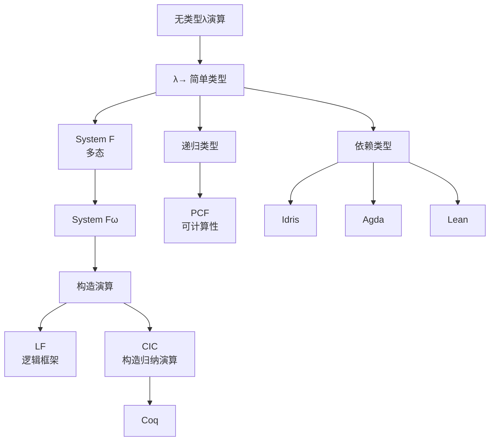
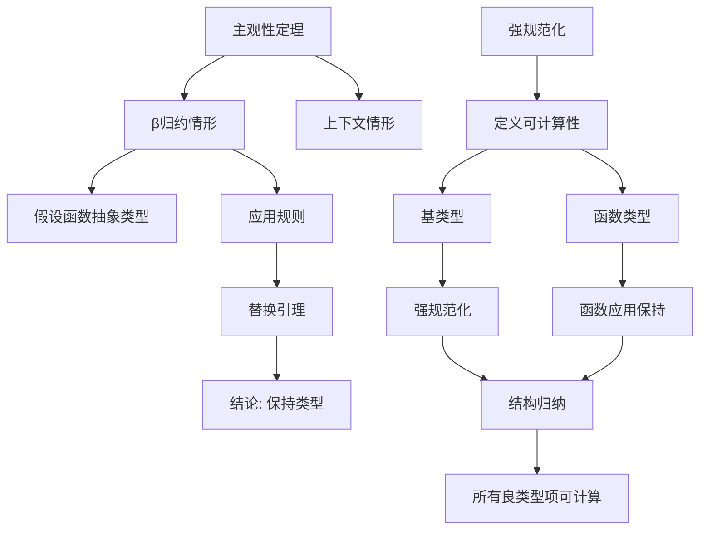

# 简单类型论 - 六维内容补充


> **版本**: 1.0
> **创建日期**: 2026-04-19
> **最后更新**: 2026-04-19

> **模块**: 05-类型理论
> **文档**: 01-简单类型论
> **补充维度**: 概念定义、属性、关系、解释、论证、形式证明
> **对标**: Stanford CS242 / CMU 15-312 / MIT 6.170
> **深度**: 研究生级

---

## 思维导图：简单类型论概念结构

```mermaid
graph TD
    STT[简单类型λ演算<br/>Simply Typed λ-Calculus] --> SY[语法]
    STT --> TY[类型系统]
    STT --> SEM[语义]

    SY --> VAR[变量]
    SY --> APP[应用<br/>Application]
    SY --> ABS[抽象<br/>Abstraction]

    TY --> BTYPE[基本类型]
    TY --> ARROW[函数类型<br/>A → B]
    TY --> PROD[积类型<br/>A × B]
    TY >> SUM[和类型<br/>A + B]

    SEM --> STAT[静态语义<br/>类型规则]
    SEM --> DYN[动态语义<br/>求值规则]
    SEM --> CH[Curry-Howard<br/>对应]

    STT --> PROP[重要性质]
    PROP --> SN[强规范化<br/>Strong Normalization]
    PROP --> CON[合流性<br/>Confluence]
    PROP --> SUB[主观性<br/>Subject Reduction]

    STT --> EXT[扩展]
    EXT --> POLY[多态<br/>Polymorphism]
    EXT >> DEP[依赖类型<br/>Dependent Types]
```

---

## 一、概念定义 (Concept Definition)

### 1.1 简单类型λ演算 / Simply Typed Lambda Calculus (λ→)

**定义 1.1.1** (形式化)

简单类型λ演算 $\lambda^\rightarrow$ 是一个类型化计算模型，由以下组成：

**语法**:

$$
\begin{aligned}
\text{类型} \quad A, B &::= \iota \mid A \rightarrow B \\
\text{项} \quad M, N &::= x \mid \lambda x:A.M \mid M\,N \\
\text{上下文} \quad \Gamma &::= \cdot \mid \Gamma, x:A
\end{aligned}
$$

其中：

- $\iota$: 基本类型（base type）
- $A \rightarrow B$: 函数类型
- $x$: 变量
- $\lambda x:A.M$: 带类型标注的λ抽象
- $M\,N$: 函数应用

**自然语言定义**

简单类型λ演算是无类型λ演算的类型化版本。每个项都有一个明确的类型，类型系统确保"类型正确的程序不会出错"。它是现代函数式编程语言（Haskell、ML）和类型系统的理论基础。

---

### 1.2 类型判断 / Type Judgment

**定义 1.2.1** (形式化)

**类型判断**（typing judgment）记为 $\Gamma \vdash M : A$，表示在上下文$\Gamma$中，项$M$具有类型$A$。

**类型规则**:

$$
\frac{}{\Gamma, x:A \vdash x : A}(\text{Var})
$$

$$
\frac{\Gamma, x:A \vdash M : B}{\Gamma \vdash \lambda x:A.M : A \rightarrow B}(\rightarrow\text{-Intro})
$$

$$
\frac{\Gamma \vdash M : A \rightarrow B \quad \Gamma \vdash N : A}{\Gamma \vdash M\,N : B}(\rightarrow\text{-Elim})
$$

**与标准/教材对齐**

- 对应 Church (1940) 简单类型λ演算
- 对齐 Pierce《Types and Programming Languages》第9章
- 对齐 Harper《Practical Foundations for Programming Languages》

---

### 1.3 β归约与求值 / Beta Reduction

**定义 1.3.1** (形式化)

**β归约**是最核心的计算规则：

$$
(\lambda x:A.M)\,N \rightarrow_\beta M[N/x]

$

其中 $M[N/x]$ 表示将 $M$ 中的自由变量 $x$ 替换为 $N$（需避免变量捕获）。

**求值策略**:

| 策略 | 名称 | 规则 |
|------|------|------|
| **CBV** | Call-by-Value | 先求值参数，再代入 |
| **CBN** | Call-by-Name | 直接代入，需要时再求值 |
| **CBNeed** | Call-by-Need | CBN + 结果共享 |

---

## 二、属性 (Properties)

### 2.1 类型系统属性表

| 属性名 | 类型 | 含义 | λ→中是否满足 |
|--------|------|------|--------------|
| **类型安全** (Type Safety) | 元性质 | 良类型项不会出错 | ✅ 是 |
| **强规范化** (Strong Normalization) | 元性质 | 所有归约序列终止 | ✅ 是 |
| **合流性** (Confluence) | 元性质 | 归约顺序不影响结果 | ✅ 是 |
| **主观性** (Subject Reduction) | 元性质 | 归约保持类型 | ✅ 是 |
| **类型唯一性** (Uniqueness) | 元性质 | 每个项有唯一类型 | ✅ 是 |
| **可判定性** (Decidability) | 元性质 | 类型检查可判定 | ✅ 是 |

### 2.2 类型构造器对比

| 类型构造器 | 符号 | 引入规则 | 消去规则 | 积/和类型 |
|------------|------|----------|----------|-----------|
| **函数类型** | $A \rightarrow B$ | λ抽象 | 应用 | - |
| **积类型** | $A \times B$ | 配对 $(M, N)$ | 投影 $\pi_1, \pi_2$ | 积 |
| **和类型** | $A + B$ | 注入 $\iota_1, \iota_2$ | case分析 | 和 |
| **单位类型** | $1$ / $\top$ | $()$ | - | 空积 |
| **空类型** | $0$ / $\bot$ | - | 吸收 $\text{absurd}$ | 空和 |

### 2.3 Curry-Howard对应

| 逻辑 | 类型 | 证明 | 程序 |
|------|------|------|------|
| 蕴涵 | $A \rightarrow B$ | 蕴涵引入 | λ抽象 |
| 合取 | $A \times B$ | 合取引入 | 配对 |
| 析取 | $A + B$ | 析取引入 | 注入 |
| 真 | $\top$ | 空证明 | $()$ |
| 假 | $\bot$ | 矛盾 | 空类型 |
| 证明 | $t : A$ | - | 具有类型A的程序 |

---

## 三、关系 (Relations)

### 3.1 概念关系表

| 源概念 | 目标概念 | 关系类型 | 说明 |
|--------|----------|----------|------|
| 简单类型论 | 无类型λ演算 | restricts | 加类型限制 |
| 简单类型论 | 直觉主义逻辑 | equivalent_to | Curry-Howard对应 |
| 函数类型 | 逻辑蕴涵 | corresponds_to | CH对应 |
| 积类型 | 合取 | corresponds_to | CH对应 |
| 和类型 | 析取 | corresponds_to | CH对应 |
| 类型检查 | 定理证明 | reduces_to | 类型即命题 |
| 简单类型论 | 多态类型论 | generalizes_to | 加入类型变量 |
| 简单类型论 | 依赖类型论 | generalizes_to | 类型依赖项 |

### 3.2 类型系统层次



---

## 四、解释 (Explanation)

### 4.1 动机与直观

**为什么需要类型？**

无类型λ演算允许构造如 $(\lambda x.x\,x)(\lambda x.x\,x)$ 这样的项，它会导致无限归约——程序"挂起"。

**类型的作用**:
1. **防止错误**: 阻止"坏"的程序通过类型检查
2. **文档**: 类型是函数行为的规格说明
3. **优化**: 类型信息帮助编译器生成高效代码
4. **推理**: 类型对应逻辑命题（Curry-Howard）

**函数类型的直观**:

类型 $A \rightarrow B$ 表示"给定类型$A$的输入，产生类型$B$的输出"。

λ抽象 $\lambda x:A.M$ 是"假设我有类型$A$的$x$，我可以用它构造类型$B$的$M$"。

应用 $M\,N$ 是"将函数$M$作用于参数$N$"。

### 4.2 与已有概念的联系

**类型 ↔ 集合**:

| 类型论 | 集合论 |
|--------|--------|
| 类型 $A$ | 集合 $A$ |
| 项 $M:A$ | 元素 $M \in A$ |
| 函数类型 $A \rightarrow B$ | 函数空间 $B^A$ |
| 积类型 $A \times B$ | 笛卡尔积 $A \times B$ |
| 和类型 $A + B$ | 不交并 $A \sqcup B$ |

**区别**: 类型是语法概念（构造性），集合是语义概念（可能非构造性）。

### 4.3 示例与反例

**示例 4.3.1**: 恒等函数

```
恒等函数: λx:A.x
类型: A → A

类型推导:
  x:A ⊢ x:A      (Var规则)
  ------------  (→-Intro)
  ⊢ λx:A.x : A → A
```

**反例 4.3.2**: 自应用（类型错误）

```
无类型版本: λx.x x
尝试类型化:
  假设 x : A
  那么 x 必须是函数: A = B → C
  但 x 的参数类型是 A = B → C
  所以 B = B → C，即无限类型!

结论: λx.x x 无法在简单类型论中类型化
```

这解释了为什么类型系统能防止非终止程序。

---

## 五、论证 (Argumentation)

### 5.1 非形式论证：为什么类型系统能防止无限归约？

**核心洞察**: 类型系统限制了"自引用"的可能性。

**论证**:

1. 无限归约通常涉及自应用（如 $x\,x$）或递归
2. 在简单类型论中，$x : A$ 和 $x : A \rightarrow B$ 不能同时成立
3. 因此 $x\,x$ 无法类型化
4. 良类型的程序具有"层级结构"，保证了归约的有界性

### 5.2 反例与边界

**边界情况 5.2.1**: 有类型但仍然非终止

简单类型论本身不允许一般递归定义。但添加不动点算子：

```
fix : (A → A) → A
fix f = f (fix f)
```

会使系统失去强规范化性。

**边界情况 5.2.2**: 类型唯一性的例外

在加入子类型（subtyping）后，类型不再唯一：

```
如果 A <: B，那么 x:A 也是 x:B
```

---

## 六、形式证明 (Formal Proof)

### 6.1 主观性定理 (Subject Reduction)

**定理 6.1.1**: 若 $\Gamma \vdash M : A$ 且 $M \rightarrow_\beta N$，则 $\Gamma \vdash N : A$。

**证明** (对归约关系归纳):

**基例** ($\beta$-归约):

设 $M = (\lambda x:A.M_1)\,M_2$，$N = M_1[M_2/x]$。

由类型规则：
```
Γ ⊢ λx:A.M1 : A → B    Γ ⊢ M2 : A
-------------------------------- (→-Elim)
Γ ⊢ (λx:A.M1) M2 : B
```

由 (→-Intro) 反推：
```
Γ, x:A ⊢ M1 : B
```

由替换引理（Substitution Lemma）：
```
若 Γ, x:A ⊢ M1 : B 且 Γ ⊢ M2 : A，则 Γ ⊢ M1[M2/x] : B
```

因此 $\Gamma \vdash N : B$。

**归纳步骤**: （略，对上下文和兼容规则归纳）

### 6.2 强规范化定理

**定理 6.2.1** (Strong Normalization): 所有良类型的项都是强规范化的（不存在无限归约序列）。

**证明概要** (Tait方法):

**定义** 可计算性谓词 $\text{Comp}_A(M)$：

- **基类型**: $\text{Comp}_\iota(M)$ 当且仅当 $M$ 强规范化
- **函数类型**: $\text{Comp}_{A \rightarrow B}(M)$ 当且仅当
  - $M$ 强规范化，且
  - 对所有满足 $\text{Comp}_A(N)$ 的 $N$，有 $\text{Comp}_B(M\,N)$

**关键引理**:
1. 可计算性蕴含强规范化
2. 可计算性在归约下封闭
3. 所有良类型项都是可计算的（通过对类型推导的结构归纳证明）

### 6.3 证明决策树



---

## 七、多语言实现：类型检查器

### 7.1 Rust: 简单类型检查器

```rust
use std::collections::HashMap;

/// 类型定义
# [derive(Clone, Debug, PartialEq)]
pub enum Type {
    Base(String),           // 基本类型
    Arrow(Box<Type>, Box<Type>),  // 函数类型 A -> B
}

impl Type {
    pub fn base(name: &str) -> Self {
        Type::Base(name.to_string())
    }

    pub fn arrow(domain: Type, codomain: Type) -> Self {
        Type::Arrow(Box::new(domain), Box::new(codomain))
    }
}

/// 项定义
# [derive(Clone, Debug)]
pub enum Term {
    Var(String),                                    // 变量
    Abs(String, Box<Type>, Box<Term>),             // λx:A.M
    App(Box<Term>, Box<Term>),                     // M N
}

impl Term {
    pub fn var(name: &str) -> Self {
        Term::Var(name.to_string())
    }

    pub fn abs(var: &str, ty: Type, body: Term) -> Self {
        Term::Abs(var.to_string(), Box::new(ty), Box::new(body))
    }

    pub fn app(func: Term, arg: Term) -> Self {
        Term::App(Box::new(func), Box::new(arg))
    }
}

/// 类型上下文
type Context = HashMap<String, Type>;

/// 类型检查错误
# [derive(Debug)]
pub enum TypeError {
    VariableNotFound(String),
    TypeMismatch { expected: Type, got: Type },
    NotAFunction { got: Type },
}

/// 类型检查
pub fn type_check(ctx: &Context, term: &Term) -> Result<Type, TypeError> {
    match term {
        Term::Var(x) => {
            ctx.get(x)
                .cloned()
                .ok_or_else(|| TypeError::VariableNotFound(x.clone()))
        }

        Term::Abs(x, ty, body) => {
            let mut new_ctx = ctx.clone();
            new_ctx.insert(x.clone(), (**ty).clone());
            let body_ty = type_check(&new_ctx, body)?;
            Ok(Type::arrow((**ty).clone(), body_ty))
        }

        Term::App(func, arg) => {
            let func_ty = type_check(ctx, func)?;
            let arg_ty = type_check(ctx, arg)?;

            match func_ty {
                Type::Arrow(domain, codomain) => {
                    if *domain == arg_ty {
                        Ok(*codomain)
                    } else {
                        Err(TypeError::TypeMismatch {
                            expected: *domain,
                            got: arg_ty,
                        })
                    }
                }
                _ => Err(TypeError::NotAFunction { got: func_ty }),
            }
        }
    }
}

/// β归约
pub fn beta_reduce(term: Term) -> Term {
    match term {
        Term::App(func, arg) => {
            let func = beta_reduce(*func);
            let arg = beta_reduce(*arg);

            if let Term::Abs(x, _, body) = func {
                substitute(*body, &x, &arg)
            } else {
                Term::App(Box::new(func), Box::new(arg))
            }
        }
        Term::Abs(x, ty, body) => {
            Term::Abs(x, ty, Box::new(beta_reduce(*body)))
        }
        _ => term,
    }
}

/// 替换
fn substitute(body: Term, var: &str, replacement: &Term) -> Term {
    match body {
        Term::Var(x) if x == var => replacement.clone(),
        Term::Var(_) => body,
        Term::Abs(x, ty, b) if x != var => {
            Term::Abs(x, ty, Box::new(substitute(*b, var, replacement)))
        }
        Term::Abs(_, _, _) => body,  // 变量捕获避免
        Term::App(f, a) => Term::App(
            Box::new(substitute(*f, var, replacement)),
            Box::new(substitute(*a, var, replacement)),
        ),
    }
}

# [cfg(test)]
mod tests {
    use super::*;

    #[test]
    fn test_identity_function() {
        // λx:Int.x : Int -> Int
        let id = Term::abs("x", Type::base("Int"), Term::var("x"));
        let ctx = Context::new();

        assert_eq!(
            type_check(&ctx, &id),
            Ok(Type::arrow(Type::base("Int"), Type::base("Int")))
        );
    }

    #[test]
    fn test_application() {
        // (λx:Int.x) 5
        let id = Term::abs("x", Type::base("Int"), Term::var("x"));
        let five = Term::var("5");
        let app = Term::app(id, five);

        let mut ctx = Context::new();
        ctx.insert("5".to_string(), Type::base("Int"));

        assert_eq!(type_check(&ctx, &app), Ok(Type::base("Int")));
    }

    #[test]
    fn test_type_error() {
        // (λx:Int.x) "hello" - 类型错误
        let id = Term::abs("x", Type::base("Int"), Term::var("x"));
        let hello = Term::var("hello");
        let app = Term::app(id, hello);

        let mut ctx = Context::new();
        ctx.insert("hello".to_string(), Type::base("String"));

        assert!(type_check(&ctx, &app).is_err());
    }
}
```

## 7.2 Python: 带类型推断的解释器
### 7.2 Python: 带类型推断的解释器

```python
from dataclasses import dataclass
from typing import Dict, Union, Optional, Tuple
from enum import Enum, auto

class Type:
    """类型基类"""
    pass

@dataclass(frozen=True)
class TVar(Type):
    """类型变量（用于多态）"""
    name: str

@dataclass(frozen=True)
class TBase(Type):
    """基本类型"""
    name: str

@dataclass(frozen=True)
class TArrow(Type):
    """函数类型"""
    domain: Type
    codomain: Type

def Int() -> TBase:
    return TBase("Int")

def Bool() -> TBase:
    return TBase("Bool")

class Term:
    """项基类"""
    pass

@dataclass
class Var(Term):
    name: str

@dataclass
class Abs(Term):
    var: str
    type_: Type
    body: Term

@dataclass
class App(Term):
    func: Term
    arg: Term

def type_check(term: Term, ctx: Optional[Dict[str, Type]] = None) -> Type:
    """类型检查"""
    if ctx is None:
        ctx = {}

    if isinstance(term, Var):
        if term.name not in ctx:
            raise TypeError(f"Variable {term.name} not found")
        return ctx[term.name]

    elif isinstance(term, Abs):
        new_ctx = ctx.copy()
        new_ctx[term.var] = term.type_
        body_type = type_check(term.body, new_ctx)
        return TArrow(term.type_, body_type)

    elif isinstance(term, App):
        func_type = type_check(term.func, ctx)
        arg_type = type_check(term.arg, ctx)

        if not isinstance(func_type, TArrow):
            raise TypeError(f"Expected function type, got {func_type}")

        if func_type.domain != arg_type:
            raise TypeError(
                f"Type mismatch: expected {func_type.domain}, got {arg_type}"
            )

        return func_type.codomain

    else:
        raise TypeError(f"Unknown term: {term}")

def beta_reduce(term: Term) -> Term:
    """β归约"""
    if isinstance(term, App):
        func = beta_reduce(term.func)
        arg = beta_reduce(term.arg)

        if isinstance(func, Abs):
            return substitute(func.body, func.var, arg)
        else:
            return App(func, arg)

    elif isinstance(term, Abs):
        return Abs(term.var, term.type_, beta_reduce(term.body))

    else:
        return term

def substitute(body: Term, var: str, replacement: Term) -> Term:
    """替换"""
    if isinstance(body, Var):
        return replacement if body.name == var else body

    elif isinstance(body, Abs):
        if body.var == var:
            return body  # 避免变量捕获
        return Abs(body.var, body.type_, substitute(body.body, var, replacement))

    elif isinstance(body, App):
        return App(
            substitute(body.func, var, replacement),
            substitute(body.arg, var, replacement)
        )

    else:
        return body

def normalize(term: Term, max_steps: int = 1000) -> Term:
    """规范化（完全求值）"""
    for _ in range(max_steps):
        new_term = beta_reduce(term)
        if new_term == term:  # 达到范式
            return term
        term = new_term
    raise RuntimeError("Normalization did not terminate")

# 示例
def example():
    # 构造: (λx:Int.x) 5
    identity = Abs("x", Int(), Var("x"))
    five = Var("5")
    application = App(identity, five)

    # 类型检查
    ctx = {"5": Int()}
    ty = type_check(application, ctx)
    print(f"Type: {ty}")  # Int

    # 归约
    result = normalize(application)
    print(f"Result: {result}")  # Var("5")

if __name__ == "__main__":
    example()
```

---

## 八、Curry-Howard速查表

### 8.1 逻辑与类型对应

| 逻辑概念 | 类型概念 | λ演算概念 |
|----------|----------|-----------|
| 命题 | 类型 | - |
| 证明 | 项 | 程序 |
| 真 ($\top$) | 单位类型 $1$ | $()$ |
| 假 ($\bot$) | 空类型 $0$ | - |
| 蕴涵 ($A \Rightarrow B$) | 函数类型 $A \rightarrow B$ | λ抽象 |
| 合取 ($A \land B$) | 积类型 $A \times B$ | 配对 |
| 析取 ($A \lor B$) | 和类型 $A + B$ | 注入 |
| 否定 ($\neg A$) | $A \rightarrow \bot$ | 到空类型的函数 |
| 全称量词 ($\forall x:A.B$) | 依赖积 $\Pi x:A.B$ | 依赖函数 |
| 存在量词 ($\exists x:A.B$) | 依赖和 $\Sigma x:A.B$ | 依赖对 |

### 8.2 证明策略与程序构造

| 证明策略 | 程序构造 | 示例 |
|----------|----------|------|
| 假设引入 | λ抽象 | 假设A，证明B → λx:A.M |
| 蕴涵消去 | 函数应用 | 由A→B和A得B → f a |
| 合取引入 | 配对 | 证明A和B → (M, N) |
| 合取消去 | 投影 | 由A∧B得A → π₁(M) |
| 析取引入 | 注入 | 证明A → ι₁(M) |
| 析取消去 | case分析 | case M of ι₁(x)→N₁ \| ι₂(y)→N₂ |
| 矛盾消除 | 空类型消除 | 由⊥得任意A → absurd(M) |

---

**文档版本**: v1.0
**创建日期**: 2026-04-10
**维护**: 项目类型理论工作组

---

## 参考文献

- [Pierce2002] B. C. Pierce. Types and Programming Languages. MIT Press, 2002.
- [Barendregt1984] H. P. Barendregt. The Lambda Calculus: Its Syntax and Semantics. North-Holland, 1984.
- [MartinLöf1984] P. Martin-Löf. Intuitionistic Type Theory. Bibliopolis, 1984.
- [HoTTBook2013] The Univalent Foundations Program. Homotopy Type Theory. IAS, 2013.

---

## 知识导航

- [返回目录](README.md)

## 学习目标

- 理解简单类型论 - 六维内容补充的核心概念
- 掌握简单类型论 - 六维内容补充的形式化表示
