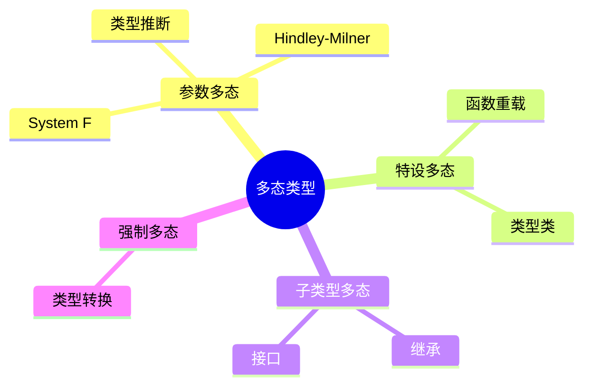

# 多态类型 - 六维补充


> **版本**: 1.0
> **创建日期**: 2026-04-19
> **最后更新**: 2026-04-19

> 本文档遵循六维内容标准：概念定义、属性、关系、解释、论证、形式证明

---

## 1. 概念定义 (Definition)

### 1.1 核心概念

**多态类型 (Polymorphic Type)**

多态是指类型系统中的表达式可以根据上下文具有多种类型的能力。它允许代码以更抽象和通用的方式编写，提高代码复用性。

### 1.2 多态分类



### 1.3 形式化定义

**定义 1 (System F / 二阶lambda演算)**

$$
\begin{aligned}
&\text{类型 } \tau ::= \alpha \mid \tau \to \tau \mid \forall\alpha.\tau \\
&\text{项 } t ::= x \mid \lambda x:\tau.t \mid t\,t \mid \Lambda\alpha.t \mid t[\tau]
\end{aligned}
$$

**定义 2 (参数多态)**

参数多态是指函数或数据类型可以**统一地**处理任意类型，而不依赖于类型的具体结构。

$$
\text{map} : \forall\alpha.\forall\beta.(\alpha \to \beta) \to [\alpha] \to [\beta]
$$

**定义 3 (类型推断)**

类型推断是从无类型或部分类型标注的程序中自动推导出最一般类型的过程。

---

## 2. 属性 (Properties)

### 2.1 System F 属性

| 属性 | 描述 | 状态 |
|------|------|------|
| **类型安全** | 良类型程序不会陷入停滞 | ✅ 保持 |
| **强规范化** | 所有良类型项都终止 | ✅ 成立 |
| **类型重构** | 从项重构类型 | ❌ 不可判定 |
| **存在类型** | 可编码抽象数据类型 | ✅ 支持 |

### 2.2 类型推断属性

| 属性 | 描述 | 算法 |
|------|------|------|
| **完备性** | 若有类型则能找到 | W算法 |
| **最一般性** | 找到的是最一般合一 | 主类型 |
| **终止性** | 推断过程必然终止 | 统一算法 |
| **线性时间** | 对程序规模线性 | 高效实现 |

### 2.3 复杂度分析

| 问题 | 复杂度 | 说明 |
|------|--------|------|
| System F 类型检查 | 不可判定 | 无完整算法 |
| HM 类型推断 | $O(n)$ | 几乎线性 |
| 多态递归 | 不可判定 | 需要限制 |
| 高阶统一 | 不可判定 | 二阶统一已难 |

---

## 3. 关系 (Relations)

### 3.1 与其他概念的关系

| 概念A | 关系 | 概念B | 说明 |
|-------|------|-------|------|
| System F | 扩展 | 简单类型λ演算 | 添加全称量词 |
| HM | 限制 | System F | 仅前缀多态 |
| 类型类 | 实现 | 特设多态 | Haskell机制 |
| 泛型 | 应用 | 参数多态 | Java/C#实现 |

### 3.2 多态性层次关系

```
                    多态性
                      |
        +-------------+-------------+
        |             |             |
    参数多态      特设多态      子类型多态
        |             |             |
    System F      类型类        继承体系
    HM推断        重载          接口实现
```

### 3.3 类型规则关系

| 规则 | 形式 | 含义 |
|------|------|------|
| 类型抽象 | $\Gamma \vdash t : \tau$ | 引入多态类型 |
| 类型应用 | $\Gamma \vdash t[\tau'] : \tau[\tau'/\alpha]$ | 实例化类型 |
| 通用引入 | $\Gamma \vdash t : \forall\alpha.\tau$ | 泛化 |
| 通用消除 | $\Gamma \vdash t : \tau[\tau'/\alpha]$ | 特化 |

---

## 4. 解释 (Explanation)

### 4.1 直观理解

**参数多态的类比**

想象一个通用的容器盒子：

- 盒子的操作（放入、取出）**不依赖**内容的类型
- 可以装苹果、书或任何物品
- 盒子的"形状"是统一的，只是内容变化

**System F 的直觉**

System F 在简单类型λ演算上增加了：

- **Λ抽象** (大写Lambda)：对类型进行抽象
- **类型应用** `t[τ]`：将多态类型实例化

### 4.2 类型推断原理

Hindley-Milner 推断的核心是**统一 (Unification)**：

```
1. 为每个子表达式生成类型变量
2. 根据语法结构生成约束方程
3. 使用统一算法求解约束
4. 得到最一般合一 (MGU)
```

### 4.3 代码示例

**Haskell 风格的多态**

```haskell
-- 参数多态函数
id :: a -> a
id x = x

-- 多态数据结构
map :: (a -> b) -> [a] -> [b]
map _ [] = []
map f (x:xs) = f x : map f xs

-- 类型类（特设多态）
class Eq a where
    (==) :: a -> a -> Bool

instance Eq Int where
    x == y = intEqual x y
```

**System F 显式表示**

```
id ≡ Λα.λx:α.x          : ∀α.α→α
id[Int] ≡ (Λα.λx:α.x)[Int] : Int→Int
map ≡ Λα.Λβ.λf:α→β.λxs:[α]. ... : ∀α.∀β.(α→β)→[α]→[β]
```

---

## 5. 论证 (Argumentation)

### 5.1 为什么需要多态？

**论证 1：代码复用**

> 没有多态时，需要为每种类型写重复的排序函数。
> 有了多态，一个 `sort : ∀α.(α→α→Bool)→[α]→[α]` 适用于所有可比较类型。

**论证 2：类型安全**

> 泛型集合在编译期保证类型一致性，
> 避免运行时的 `ClassCastException`。

**论证 3：表达力与可判定性权衡**

| 系统 | 表达力 | 类型推断 | 适用场景 |
|------|--------|----------|----------|
| 简单类型 | 低 | 可判定 | 基础教学 |
| HM | 中 | 高效 | ML家族 |
| System F | 高 | 不可判定 | 理论研究 |
| 依赖类型 | 极高 | 需辅助证明 | 定理证明 |

### 5.2 设计决策分析

**前缀多态 vs 任意多态**

```
前缀多态 (HM): ∀α.∀β.τ → σ    (类型变量全在左边)
任意多态 (System F): (∀α.τ) → σ  (多态可嵌套)

代价：
- HM 牺牲了一些表达力
- 换取了完全自动的类型推断
```

---

## 6. 形式证明 (Formal Proofs)

### 6.1 引理：类型替换保持

**引理 6.1** 若 $\Gamma \vdash t : \tau$，则对任意类型替换 $S$，
有 $S\Gamma \vdash t : S\tau$。

*证明：* 对推导结构进行归纳。

### 6.2 定理：主题归约 (Subject Reduction)

**定理 6.2** 若 $\Gamma \vdash t : \tau$ 且 $t \to t'$，则 $\Gamma \vdash t' : \tau$。

*证明概要：*
对归约关系进行归纳，检查每种归约规则保持类型：

1. **(β)**: $(\lambda x:\tau_1.t)\,v \to t[v/x]$
   - 由替换引理得证

2. **(Λ)**: $(\Lambda\alpha.t)[\tau] \to t[\tau/\alpha]$
   - 类型替换保持类型正确性

### 6.3 定理：强规范化

**定理 6.3** 所有良类型的 System F 项都是强规范化的。

*证明思路：*
使用可容许性 (Reducibility Candidates) 或 Girard 的正规化证明。

**关键步骤**：

```
1. 定义类型 τ 的可约项集合 RED_τ
2. 证明：(a) 所有可约项都终止
         (b) 若 t ∈ RED_τ，则 t 是规范的
3. 对类型推导进行归纳，证明所有良类型项都可约
```

### 6.4 不可判定性证明 (System F 类型推断)

**定理 6.4** System F 的类型推断问题是不可判定的。

*证明概要：*
通过归约到半统一问题 (Semi-unification)，而半统一问题是不可判定的。

```
半统一问题: 给定项 s, t，寻找替换 σ 使得 σ(s) ≤ t
其中 ≤ 表示实例化关系

该问题已被证明是不可判定的 (Kfoury, Tiuryn, Urzyczyn 1993)
```

---

## 附录：核心算法伪代码

### Hindley-Milner 类型推断 (W算法)

```python
def infer(env, expr):
    if isinstance(expr, Var):
        return instantiate(lookup(env, expr.name))

    elif isinstance(expr, Lambda):
        # 生成新类型变量
        var_type = fresh_var()
        new_env = extend(env, expr.var, var_type)
        body_type = infer(new_env, expr.body)
        return var_type -> body_type

    elif isinstance(expr, App):
        func_type = infer(env, expr.func)
        arg_type = infer(env, expr.arg)
        result_type = fresh_var()
        # 生成约束: func_type = arg_type -> result_type
        unify(func_type, arg_type -> result_type)
        return result_type

    elif isinstance(expr, Let):
        # 多态 let
        expr_type = infer(env, expr.expr)
        env_with_expr = extend(env, expr.var, generalize(env, expr_type))
        return infer(env_with_expr, expr.body)
```

---

*文档版本: v1.0 | 六维内容标准 | 类型理论专题*

---

## 参考文献

- 待补充

---

## 知识导航

- [返回目录](README.md)

## 学习目标

- 理解多态类型 - 六维补充的核心概念
- 掌握多态类型 - 六维补充的形式化表示
