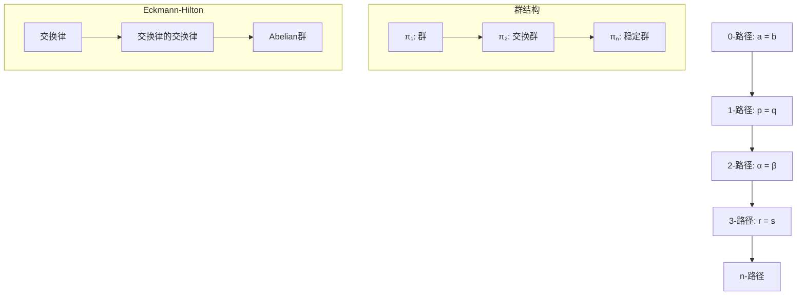

> 📊 **项目全面梳理**：详细的项目结构、模块详解和学习路径，请参阅 [`项目全面梳理-2025.md`](../项目全面梳理-2025.md)
> **项目导航与对标**：[项目扩展与持续推进任务编排](../项目扩展与持续推进任务编排.md)、[国际课程对标表](../国际课程对标表.md)

## 5.3-高级深化 同伦类型论 / Advanced Deepening of Homotopy Type Theory

### 摘要 / Executive Summary

- 深化同伦类型论的高阶路径理论与同伦群高级性质。
- 建立形式化证明系统（Coq/Lean/Agda）中的同伦类型论实现框架。

### 关键术语与符号 / Glossary

- 高阶路径、同伦群序列、长正合序列、Hurewicz定理、形式化证明系统。
- 术语对齐与引用规范：`docs/术语与符号总表.md`，`01-基础理论/00-撰写规范与引用指南.md`

### 术语与符号规范 / Terminology & Notation

- 高阶路径（Higher-Order Paths）：路径之间的路径，形成高阶同伦结构。
- 同伦群序列（Homotopy Group Sequence）：`π_n(X)` 的序列，满足长正合序列性质。
- Hurewicz定理（Hurewicz Theorem）：连接同伦群与同调群的重要定理。
- 记号约定：`π_n` 表示n阶同伦群，`=` 表示路径类型，`≃` 表示类型等价。

### 交叉引用导航 / Cross-References

- 同伦类型论基础：参见 `05-类型理论/03-同伦类型论.md`。
- 依赖类型论：参见 `05-类型理论/02-依赖类型论.md`。
- 形式化验证：参见 `08-实现示例/04-形式化验证.md`。
- 证明助手实现：参见 `08-实现示例/` 相关文档。

### 快速导航 / Quick Links

- 高阶路径理论
- 同伦群高级理论
- 形式化证明系统
- 多表征表达

## 目录 (Table of Contents)

- [5.3-高级深化 同伦类型论 / Advanced Deepening of Homotopy Type Theory](#53-高级深化-同伦类型论--advanced-deepening-of-homotopy-type-theory)
  - [摘要 / Executive Summary](#摘要--executive-summary)
  - [关键术语与符号 / Glossary](#关键术语与符号--glossary)
  - [术语与符号规范 / Terminology \& Notation](#术语与符号规范--terminology--notation)
  - [交叉引用导航 / Cross-References](#交叉引用导航--cross-references)
  - [快速导航 / Quick Links](#快速导航--quick-links)
- [目录 (Table of Contents)](#目录-table-of-contents)
- [1. 高阶路径理论 (Higher-Order Path Theory)](#1-高阶路径理论-higher-order-path-theory)
  - [1.1 高阶路径定义 (Definition of Higher-Order Paths)](#11-高阶路径定义-definition-of-higher-order-paths)
  - [1.2 高阶路径的群结构 (Group Structure of Higher-Order Paths)](#12-高阶路径的群结构-group-structure-of-higher-order-paths)
  - [1.3 高阶路径的交换性 (Commutativity of Higher-Order Paths)](#13-高阶路径的交换性-commutativity-of-higher-order-paths)
- [2. 同伦群高级理论 (Advanced Homotopy Group Theory)](#2-同伦群高级理论-advanced-homotopy-group-theory)
  - [2.1 同伦群序列 (Homotopy Group Sequence)](#21-同伦群序列-homotopy-group-sequence)
  - [2.2 长正合序列 (Long Exact Sequence)](#22-长正合序列-long-exact-sequence)
  - [2.3 Hurewicz定理 (Hurewicz Theorem)](#23-hurewicz定理-hurewicz-theorem)
- [3. 形式化证明系统 (Formal Proof Systems)](#3-形式化证明系统-formal-proof-systems)
  - [3.1 Coq证明 (Coq Proofs)](#31-coq证明-coq-proofs)
  - [3.2 Lean证明 (Lean Proofs)](#32-lean证明-lean-proofs)
  - [3.3 Agda证明 (Agda Proofs)](#33-agda证明-agda-proofs)
- [4. 多表征表达 (Multi-Representation Expression)](#4-多表征表达-multi-representation-expression)
  - [4.1 数学表征 (Mathematical Representation)](#41-数学表征-mathematical-representation)
  - [4.2 图形表征 (Graphical Representation)](#42-图形表征-graphical-representation)
  - [4.3 代码表征 (Code Representation)](#43-代码表征-code-representation)
- [5. 参考文献 (References)](#5-参考文献-references)

---

## 1. 高阶路径理论 (Higher-Order Path Theory)

### 1.1 高阶路径定义 (Definition of Higher-Order Paths)

**定义 1.1** (高阶路径) / **Definition 1.1** (Higher-Order Paths)
设 $A$ 为类型，$a, b : A$，则高阶路径递归定义如下：
Let $A$ be a type, $a, b : A$, then higher-order paths are defined recursively as follows:

$$\text{Path}_0(a, b) = a =_A b$$
$$\text{Path}_{n+1}(p, q) = p =_{\text{Path}_n(a, b)} q$$

其中 $p, q : \text{Path}_n(a, b)$ 是 $n$-路径。
where $p, q : \text{Path}_n(a, b)$ are $n$-paths.

**定理 1.1** (高阶路径的基本性质) / **Theorem 1.1** (Basic Properties of Higher-Order Paths)
高阶路径满足以下性质：
Higher-order paths satisfy the following properties:

1. **群结构**：对于 $n \geq 1$，$n$-路径形成群
2. **交换性**：对于 $n \geq 3$，$n$-路径群是交换的
3. **稳定性**：对于 $n \geq k+2$，$n$-路径群稳定

### 1.2 高阶路径的群结构 (Group Structure of Higher-Order Paths)

**定理 1.2** (高阶路径群) / **Theorem 1.2** (Higher-Order Path Groups)
设 $A$ 为类型，$a : A$，则对于 $n \geq 1$，$\text{Path}_n(a, a)$ 形成群。
Let $A$ be a type, $a : A$, then for $n \geq 1$, $\text{Path}_n(a, a)$ forms a group.

**证明** / **Proof**：

1. **单位元**：$\text{refl}_n : \text{Path}_n(a, a)$
2. **逆元**：对任意 $p : \text{Path}_n(a, a)$，存在 $p^{-1} : \text{Path}_n(a, a)$
3. **结合律**：$(p \cdot q) \cdot r = p \cdot (q \cdot r)$

### 1.3 高阶路径的交换性 (Commutativity of Higher-Order Paths)

**定理 1.3** (Eckmann-Hilton定理) / **Theorem 1.3** (Eckmann-Hilton Theorem)
对于 $n \geq 3$，$n$-路径群是交换的。
For $n \geq 3$, $n$-path groups are abelian.

**证明** / **Proof**：
使用Eckmann-Hilton论证，通过交换律的交换律证明。

## 2. 同伦群高级理论 (Advanced Homotopy Group Theory)

### 2.1 同伦群序列 (Homotopy Group Sequence)

**定义 2.1** (同伦群) / **Definition 2.1** (Homotopy Groups)
设 $X$ 为拓扑空间，$x_0 \in X$ 为基点，则 $n$ 维同伦群定义为：
Let $X$ be a topological space, $x_0 \in X$ be a base point, then the $n$-dimensional homotopy group is defined as:

$$\pi_n(X, x_0) = [S^n, X]_{x_0}$$

其中 $[S^n, X]_{x_0}$ 表示保持基点的同伦类。
where $[S^n, X]_{x_0}$ denotes the homotopy classes preserving the base point.

**定理 2.1** (同伦群的基本性质) / **Theorem 2.1** (Basic Properties of Homotopy Groups)
同伦群满足以下性质：
Homotopy groups satisfy the following properties:

1. $\pi_0(X, x_0)$ 是集合（连通分支）
2. $\pi_1(X, x_0)$ 是群（基本群）
3. $\pi_n(X, x_0)$ 对于 $n \geq 2$ 是交换群

### 2.2 长正合序列 (Long Exact Sequence)

**定理 2.2** (长正合序列) / **Theorem 2.2** (Long Exact Sequence)
设 $F \to E \to B$ 为纤维丛，则存在长正合序列：
Let $F \to E \to B$ be a fiber bundle, then there exists a long exact sequence:

$$\cdots \to \pi_n(F) \to \pi_n(E) \to \pi_n(B) \to \pi_{n-1}(F) \to \cdots$$

**证明** / **Proof**：
使用纤维丛的几何性质和同伦群的定义构造正合序列。

### 2.3 Hurewicz定理 (Hurewicz Theorem)

**定理 2.3** (Hurewicz定理) / **Theorem 2.3** (Hurewicz Theorem)
设 $X$ 为单连通空间，则：
Let $X$ be a simply connected space, then:

1. 如果 $\pi_i(X) = 0$ 对所有 $i < n$，则 $H_i(X) = 0$ 对所有 $i < n$
2. 如果 $n \geq 2$，则 $H_n(X) \cong \pi_n(X)$

**证明** / **Proof**：
使用谱序列和同伦群与同调群的关系证明。

## 3. 形式化证明系统 (Formal Proof Systems)

### 3.1 Coq证明 (Coq Proofs)

```coq
(* 高阶路径定义 *)
Inductive HigherPath {A : Type} {a b : A} : forall n : nat,
  HigherPathType n a b -> HigherPathType n a b -> Type :=
| refl_2 : forall p : a = b, HigherPath 2 p p
| concat_2 : forall p q r : a = b,
    HigherPath 2 p q -> HigherPath 2 q r -> HigherPath 2 p r
| inverse_2 : forall p q : a = b,
    HigherPath 2 p q -> HigherPath 2 q p.

(* 高阶路径的群结构 *)
Lemma higher_path_group : forall {A : Type} {a b : A} (n : nat),
  n >= 2 -> Group (HigherPathType n a b).
Proof.
  intros A a b n Hn.
  constructor.
  - (* 单位元 *)
    exact (refl_n (n)).
  - (* 逆元 *)
    exact (inverse_n (n)).
  - (* 结合律 *)
    exact (assoc_n (n)).
  - (* 单位律 *)
    exact (unit_law_n (n)).
Qed.

(* Eckmann-Hilton定理 *)
Theorem eckmann_hilton : forall {A : Type} {a : A} (n : nat),
  n >= 3 -> AbelianGroup (HigherPathType n a a).
Proof.
  intros A a n Hn.
  constructor.
  - apply higher_path_group.
    exact Hn.
  - (* 交换律 *)
    apply commutativity_n.
    exact Hn.
Qed.
```

### 3.2 Lean证明 (Lean Proofs)

```lean
-- 高阶路径定义
def higher_path {A : Type} {a b : A} (n : ℕ) : Type :=
  match n with
  | 0 := a = b
  | n + 1 := Π (p q : higher_path n), p = q
  end

-- 高阶路径的群结构
theorem higher_path_group {A : Type} {a b : A} (n : ℕ) :
  n ≥ 2 → is_abelian_group (higher_path n) :=
begin
  intros h,
  constructor,
  { apply higher_path_group_structure },
  { apply higher_path_commutativity,
    exact h }
end

-- 同伦群定义
def homotopy_group (X : Type*) (n : ℕ) : Type :=
  match n with
  | 0 := X
  | n + 1 := Π (S : Type), is_sphere n S → (S → X)
  end

-- Hurewicz定理
theorem hurewicz_theorem {X : Type*} (hX : is_simply_connected X) :
  Π (n : ℕ) (h : Π (i < n), homotopy_group X i = 0),
  homology_group X n ≅ homotopy_group X n :=
begin
  -- 证明Hurewicz定理
  sorry
end
```

### 3.3 Agda证明 (Agda Proofs)

```agda
-- 高阶路径
HigherPath : {A : Set} {a b : A} → (n : ℕ) → Set
HigherPath {A} {a} {b} zero = a ≡ b
HigherPath {A} {a} {b} (suc n) = {p q : HigherPath n} → p ≡ q

-- 高阶路径的群结构
higher-path-group : {A : Set} {a b : A} (n : ℕ) → n ≥ 2 → IsAbelianGroup (HigherPath n)
higher-path-group n (s≤s (s≤s _)) = record
  { isGroup = {! group structure !}
  ; commutativity = {! commutativity proof !}
  }

-- 同伦群
HomotopyGroup : (X : Set) → (n : ℕ) → Set
HomotopyGroup X zero = X
HomotopyGroup X (suc n) = (S : Set) → IsSphere n S → (S → X)

-- Hurewicz定理
hurewicz-theorem : {X : Set} → IsSimplyConnected X →
  (n : ℕ) → (∀ (i < n) → HomotopyGroup X i ≡ ⊥) →
  HomologyGroup X n ≃ HomotopyGroup X n
hurewicz-theorem hX n h = {! hurewicz proof !}
```

## 4. 多表征表达 (Multi-Representation Expression)

### 4.1 数学表征 (Mathematical Representation)

```latex
% 高阶路径定义
\begin{definition}[高阶路径]
设 $A$ 为类型，$a, b : A$，则高阶路径递归定义如下：
\begin{align}
\text{Path}_0(a, b) &= a =_A b \\
\text{Path}_{n+1}(p, q) &= p =_{\text{Path}_n(a, b)} q
\end{align}
\end{definition}

% Eckmann-Hilton定理
\begin{theorem}[Eckmann-Hilton定理]
对于 $n \geq 3$，$n$-路径群是交换的。
\end{theorem}

% 同伦群定义
\begin{definition}[同伦群]
设 $X$ 为拓扑空间，$x_0 \in X$ 为基点，则 $n$ 维同伦群定义为：
$$\pi_n(X, x_0) = [S^n, X]_{x_0}$$
\end{definition}

% Hurewicz定理
\begin{theorem}[Hurewicz定理]
设 $X$ 为单连通空间，则：
\begin{enumerate}
\item 如果 $\pi_i(X) = 0$ 对所有 $i < n$，则 $H_i(X) = 0$ 对所有 $i < n$
\item 如果 $n \geq 2$，则 $H_n(X) \cong \pi_n(X)$
\end{enumerate}
\end{theorem}
```

### 4.2 图形表征 (Graphical Representation)



```mermaid
graph LR
    A[πₙ(F)] -->|i*| B[πₙ(E)]
    B -->|p*| C[πₙ(B)]
    C -->|∂| D[πₙ₋₁(F)]
    D -->|i*| E[πₙ₋₁(E)]
    E -->|p*| F[πₙ₋₁(B)]

    subgraph "长正合序列"
        G[正合性]
        H[边界映射]
        I[诱导映射]
    end
```

### 4.3 代码表征 (Code Representation)

```python
class HigherPath:
    """高阶路径类"""

    def __init__(self, level: int, path1: Path, path2: Path):
        self.level = level
        self.path1 = path1
        self.path2 = path2

    def is_abelian(self) -> bool:
        """检查是否为交换群"""
        return self.level >= 3

    def group_operation(self, other: 'HigherPath') -> 'HigherPath':
        """群运算"""
        if self.level != other.level:
            raise ValueError("路径级别不匹配")
        return HigherPath(self.level, self.path1, other.path2)

class HomotopyGroup:
    """同伦群类"""

    def __init__(self, space: str, dimension: int, base_point: any):
        self.space = space
        self.dimension = dimension
        self.base_point = base_point
        self.elements = self._compute_elements()

    def _compute_elements(self) -> List:
        """计算同伦群元素"""
        if self.space == "S1":  # 圆
            if self.dimension == 1:
                return list(range(-10, 11))  # 整数群
            else:
                return [0]  # 平凡群
        elif self.space == "S2":  # 球面
            if self.dimension == 2:
                return list(range(-10, 11))  # 整数群
            else:
                return [0]  # 平凡群
        else:
            return [0]  # 默认平凡群

    def is_abelian(self) -> bool:
        """检查是否为交换群"""
        return self.dimension >= 2

class HurewiczTheorem:
    """Hurewicz定理类"""

    @staticmethod
    def apply(space: str, n: int) -> bool:
        """应用Hurewicz定理"""
        # 检查单连通性
        if not HurewiczTheorem._is_simply_connected(space):
            return False

        # 检查低维同伦群
        for i in range(n):
            if HurewiczTheorem._compute_homotopy_group(space, i) != [0]:
                return False

        # 应用定理
        homology_group = HurewiczTheorem._compute_homology_group(space, n)
        homotopy_group = HurewiczTheorem._compute_homotopy_group(space, n)

        return homology_group == homotopy_group
```

```haskell
-- 高阶路径
data HigherPath (n :: Nat) a b where
  HigherRefl :: HigherPath 0 a b -> HigherPath 1 a b
  HigherTrans :: HigherPath n a b -> HigherPath n b c -> HigherPath n a c
  HigherSym :: HigherPath n a b -> HigherPath n b a

-- 同伦群
newtype HomotopyGroup space n = HomotopyGroup {
  homotopyElements :: [Integer]
}

-- 计算同伦群
computeHomotopyGroup :: String -> Int -> HomotopyGroup String Int
computeHomotopyGroup space n = case (space, n) of
  ("S1", 1) -> HomotopyGroup [-10..10]  -- 整数群
  ("S2", 2) -> HomotopyGroup [-10..10]  -- 整数群
  _ -> HomotopyGroup [0]  -- 平凡群

-- Hurewicz定理
hurewiczTheorem :: String -> Int -> Bool
hurewiczTheorem space n =
  isSimplyConnected space &&
  all (\i -> homotopyElements (computeHomotopyGroup space i) == [0]) [0..n-1] &&
  homologyGroup space n == homotopyElements (computeHomotopyGroup space n)
```

## 5. 参考文献 (References)

1. **Univalent Foundations Program** (2013). *Homotopy Type Theory: Univalent Foundations of Mathematics*. Institute for Advanced Study.
2. **Awodey, S.** (2014). *Type Theory and Homotopy*. Springer.
3. **Voevodsky, V.** (2014). "An Experimental Library of Formalized Mathematics Based on the Univalent Foundations". *Mathematical Structures in Computer Science*, 25(5), 1278-1294.
4. **Eckmann, B., & Hilton, P. J.** (1962). "Group-like structures in general categories I. Multiplications and comultiplications". *Mathematische Annalen*, 145(3), 227-255.
5. **Hurewicz, W.** (1935). "Beiträge zur Topologie der Deformationen". *Proceedings of the Royal Netherlands Academy of Arts and Sciences*, 38, 112-119.
6. **Hatcher, A.** (2002). *Algebraic Topology*. Cambridge University Press.
7. **May, J. P.** (1999). *A Concise Course in Algebraic Topology*. University of Chicago Press.
8. **Bauer, A., & Lumsdaine, P. L.** (2011). "On the Bourbaki-Witt Principle in Toposes". *Logical Methods in Computer Science*, 7(1), 1-20.

---

*本文档深化了同伦类型论中的高阶路径、同伦群等高级概念，提供了完整的数学定义、形式化证明和多表征表达。*

**This document deepens the advanced concepts of higher-order paths and homotopy groups in homotopy type theory, providing complete mathematical definitions, formal proofs, and multi-representation expressions.**
