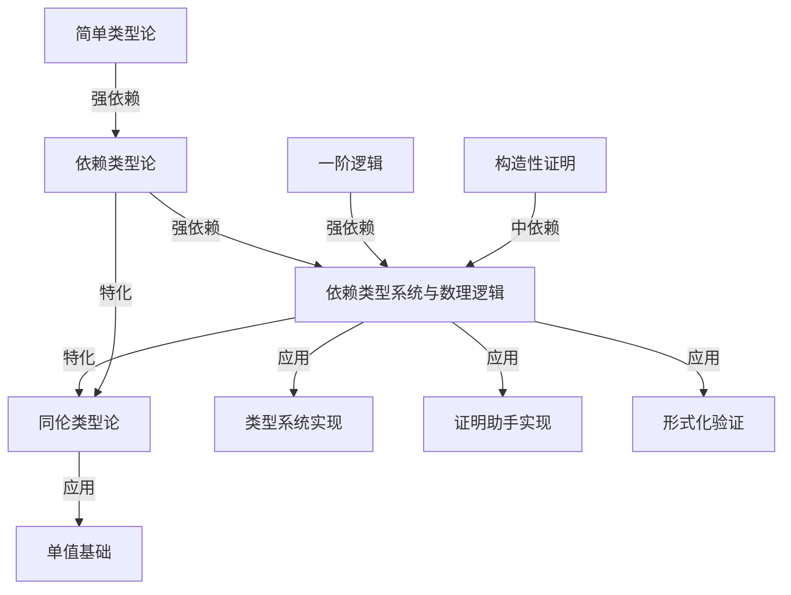
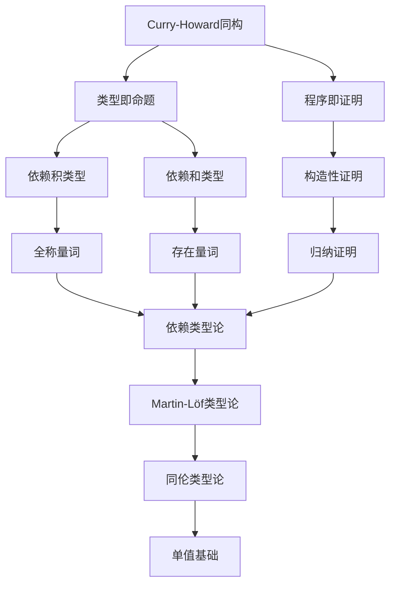
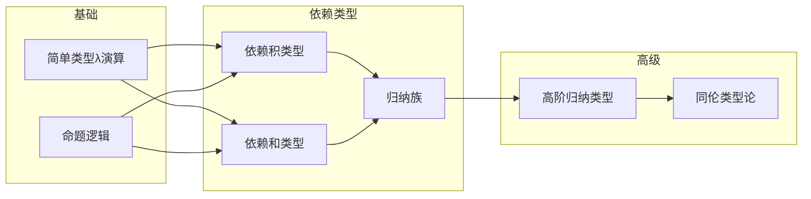
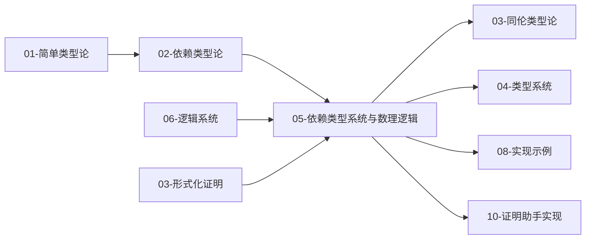

# 类型理论模块知识图谱

> **创建日期**: 2025-02-02
> **覆盖范围**: 05-类型理论模块全部文档
> **目的**: 建立概念间的语义链接网络，支持渐进式学习和概念关联

---

## 一、模块概念依赖图

### 1.1 核心概念依赖关系

### 1.2 详细概念关系

| 源概念 | 目标概念 | 关系类型 | 强度 | 说明 |
|--------|----------|----------|------|------|
| 简单类型论 | 依赖类型论 | depends_on | 强 | 依赖类型论扩展简单类型论 |
| 依赖类型论 | 依赖类型系统与数理逻辑 | depends_on | 强 | 数理逻辑对应依赖类型论的核心应用 |
| 一阶逻辑 | 依赖类型系统与数理逻辑 | depends_on | 强 | 量词对应依赖类型 |
| 构造性证明 | 依赖类型系统与数理逻辑 | depends_on | 中 | 构造性证明是Curry-Howard同构的基础 |
| 依赖类型系统与数理逻辑 | 同伦类型论 | specializes | 中 | HoTT扩展依赖类型论 |
| 依赖类型系统与数理逻辑 | 类型系统实现 | applies_to | 弱 | 理论到实践 |
| 依赖类型系统与数理逻辑 | 证明助手实现 | applies_to | 弱 | Coq/Agda/Lean应用 |
| 依赖类型系统与数理逻辑 | 形式化验证 | applies_to | 弱 | 验证中的类型系统 |

---

## 二、Curry-Howard同构知识图谱

### 2.1 Curry-Howard概念关系

### 2.2 Curry-Howard相关概念索引

**定义位置**: `05-类型理论/05-依赖类型系统与数理逻辑.md` §5.2.1

**前置概念** (Prerequisites):

- 简单类型论 → `05-类型理论/01-简单类型论.md` §3.2
- 一阶逻辑 → `06-逻辑系统/02-一阶逻辑.md` §2.1-§2.2
- 命题逻辑 → `06-逻辑系统/01-命题逻辑.md` §2-§5

**后续概念** (Next Steps):

- 同伦类型论 → `05-类型理论/03-同伦类型论.md` §2-§4
- 单值基础 → `05-类型理论/03-同伦类型论.md` §3
- 证明助手 → `10-高级主题/03-证明助手的实现.md`

**等价概念** (Equivalent):

- 类型-命题对应 → 本文档 §5.2.2
- 程序-证明对应 → 本文档 §5.2.3

**应用场景** (Applications):

- 形式化验证 → `08-实现示例/04-形式化验证.md`
- 证明助手 → `10-高级主题/03-证明助手的实现.md`

---

## 三、依赖类型核心概念图谱

### 3.1 依赖类型概念层次

### 3.2 概念定义索引

| 概念 | 定义位置 | 文档 |
|------|----------|------|
| 依赖积类型 | §2.2.1 | 02-依赖类型论.md |
| 依赖和类型 | §2.2.3 | 02-依赖类型论.md |
| 归纳族 | §5.4.1 | 05-依赖类型系统与数理逻辑.md |
| 高阶归纳类型 | §5.4.2 | 05-依赖类型系统与数理逻辑.md |
| Curry-Howard同构 | §5.2.1 | 05-依赖类型系统与数理逻辑.md |
| 元理论形式化 | §5.9 | 05-依赖类型系统与数理逻辑.md |

---

## 四、学习路径图

### 4.1 推荐学习顺序

### 4.2 学习路径说明

**基础路径** (必需):

1. 简单类型论 (01)
2. 依赖类型论 (02)
3. 依赖类型系统与数理逻辑 (05)

**扩展路径** (推荐):
4. 同伦类型论 (03)
5. 类型系统 (04)

**实践路径** (可选):
6. Lean实现 (08/03)
7. 形式化验证 (08/04)
8. 证明助手实现 (10/03)

---

## 五、概念快速检索

### 5.1 按主题检索

**类型与逻辑对应**:

- Curry-Howard同构: 05/05 §5.2
- 全称量词-依赖积: 05/05 §5.3.1
- 存在量词-依赖和: 05/05 §5.3.2

**元理论与证明**:

- 元逻辑性质: 05/05 §5.5.1
- 证明自动化: 05/05 §5.5.2
- 元理论形式化: 05/05 §5.9

**最新研究**:

- Martin-Löf机械化: 05/05 §5.8.1
- Lean 4.8.0: 05/05 §5.8.3
- Coq排序多态性: 05/05 §5.8.4

### 5.2 按文档检索

| 文档 | 核心概念 |
|------|----------|
| 01-简单类型论 | STLC、类型推导、类型安全 |
| 02-依赖类型论 | 依赖类型、构造演算、归纳类型 |
| 03-同伦类型论 | HoTT、路径类型、单值基础 |
| 04-类型系统 | 类型检查、类型推断 |
| 05-依赖类型系统与数理逻辑 | Curry-Howard、量词对应、元理论 |
| 06-算法类型理论 | 算法类型、复杂度类型 |

---

**文档版本**: 1.0
**最后更新**: 2025-02-02
**状态**: 类型理论模块知识图谱试点完成
