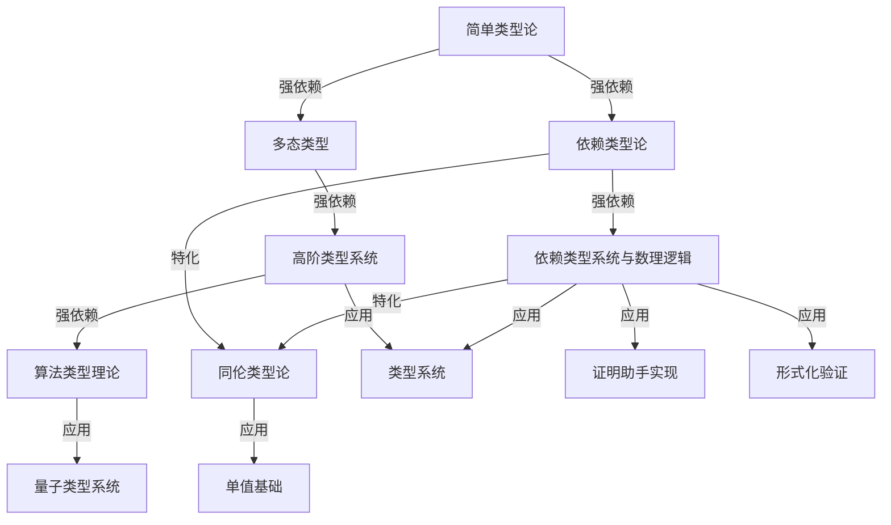
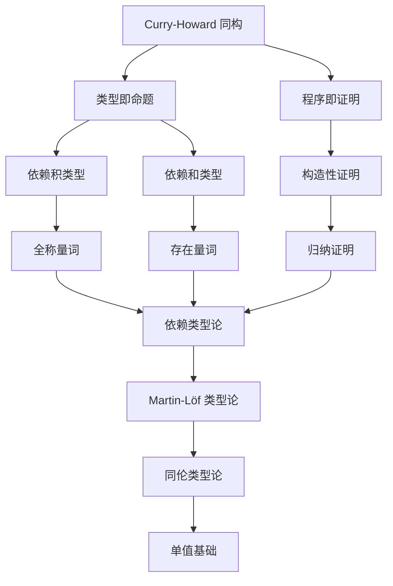
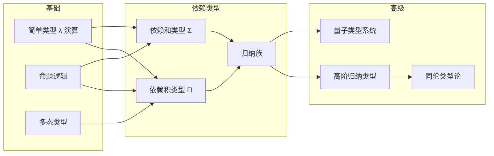
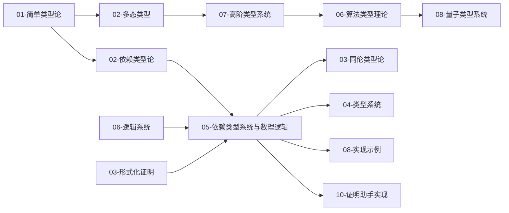

> **版本**: 2.0
> **最后更新**: 2026-04-20
> **作者**: 算法规范设计团队 / 类型理论工作组
>
> ---
>
# 类型理论模块知识图谱

> **创建日期**: 2025-02-02
> **覆盖范围**: 05-类型理论模块全部文档
> **目的**: 建立概念间的语义链接网络，支持渐进式学习和概念关联

---

## 一、模块概念依赖图

### 1.1 核心概念依赖关系

```mermaid
graph TD
    A[简单类型论] -->|强依赖| B[多态类型]
    A -->|强依赖| C[依赖类型论]
    B -->|强依赖| D[高阶类型系统]
    C -->|强依赖| E[依赖类型系统与数理逻辑]
    D -->|强依赖| F[算法类型理论]
    C -->|特化| G[同伦类型论]
    E -->|特化| G
    D -->|应用| H[类型系统]
    E -->|应用| H
    F -->|应用| I[量子类型系统]
    G -->|应用| J[单值基础]
    E -->|应用| K[证明助手实现]
    E -->|应用| L[形式化验证]
```

### 1.2 详细概念关系

| 源概念 | 目标概念 | 关系类型 | 强度 | 说明 |
|--------|----------|----------|------|------|
| 简单类型论 | 多态类型 | generalizes_to | 强 | System F 扩展简单类型论 |
| 简单类型论 | 依赖类型论 | generalizes_to | 强 | 依赖类型论扩展简单类型论 |
| 多态类型 | 高阶类型系统 | generalizes_to | 强 | System Fω 扩展 System F |
| 依赖类型论 | 依赖类型系统与数理逻辑 | depends_on | 强 | 数理逻辑对应依赖类型论的核心应用 |
| 依赖类型论 | 同伦类型论 | specializes | 中 | HoTT 扩展依赖类型论 |
| 高阶类型系统 | 算法类型理论 | applies_to | 中 | 高阶抽象支持算法类型 |
| 依赖类型系统与数理逻辑 | 类型系统 | applies_to | 弱 | 理论到实践 |
| 依赖类型系统与数理逻辑 | 证明助手实现 | applies_to | 弱 | Coq/Agda/Lean 应用 |
| 量子类型系统 | 线性逻辑 | depends_on | 强 | 量子资源不可克隆 |

---

## 二、文档与六维补充对照表

| 序号 | 主文档 | 六维补充文档 | 状态 |
|------|--------|-------------|------|
| 01 | `01-简单类型论.md` | `01-简单类型论-六维补充.md` | ✅ 完整 |
| 02 | `02-多态类型.md` *(新建)* | `02-多态类型-六维补充.md` | ✅ 完整 |
| 02 | `02-依赖类型论.md` | `03-依赖类型-六维补充.md` | ✅ 完整 |
| 03 | `03-同伦类型论.md` | `03-同伦类型论-六维补充.md` *(新建)* | ✅ 完整 |
| 04 | `04-类型系统.md` | `04-类型系统-六维补充.md` *(新建)* | ✅ 完整 |
| 05 | `08-量子类型系统.md` | `05-量子类型系统-六维补充.md` *(新建)* | ✅ 完整 |
| 06 | `06-算法类型理论.md` | `06-算法类型理论-六维补充.md` *(新建)* | ✅ 完整 |
| 07 | `07-高阶类型系统.md` | `07-高阶类型系统-六维补充.md` *(新建)* | ✅ 完整 |
| 05 | `05-依赖类型系统与数理逻辑.md` | — | ✅ 主文档 |
| — | `多态类型系统.md` | — | ⚠️ 已归档（内容被 `02-多态类型.md` 覆盖） |

> **注**：原任务中提到的 `05-量子类型系统.md` 在当前文件系统中不存在，实际主文档为 `08-量子类型系统.md`，其六维补充统一命名为 `05-量子类型系统-六维补充.md` 以匹配模块编号逻辑。

---

## 三、Curry-Howard 同构知识图谱

### 3.1 Curry-Howard 概念关系

```mermaid
graph TB
    CH[Curry-Howard 同构] --> TAP[类型即命题]
    CH --> PAP[程序即证明]
    TAP --> DPT[依赖积类型]
    TAP --> DST[依赖和类型]
    PAP --> CP[构造性证明]
    DPT --> UQ[全称量词]
    DST --> EQ[存在量词]
    CP --> IP[归纳证明]
    UQ --> DT[依赖类型论]
    EQ --> DT
    IP --> DT
    DT --> MLTT[Martin-Löf 类型论]
    MLTT --> HoTT[同伦类型论]
    HoTT --> UF[单值基础]
```

### 3.2 Curry-Howard 相关概念索引

**定义位置**: `05-类型理论/05-依赖类型系统与数理逻辑.md` §5.2.1

**前置概念** (Prerequisites):

- 简单类型论 → `05-类型理论/01-简单类型论.md` §3.2
- 多态类型 → `05-类型理论/02-多态类型.md` §2
- 一阶逻辑 → `06-逻辑系统/02-一阶逻辑.md` §2.1-§2.2
- 命题逻辑 → `06-逻辑系统/01-命题逻辑.md` §2-§5

**后续概念** (Next Steps):

- 同伦类型论 → `05-类型理论/03-同伦类型论.md` §2-§4
- 单值基础 → `05-类型理论/03-同伦类型论.md` §3
- 证明助手 → `10-高级主题/03-证明助手的实现.md`

---

## 四、依赖类型核心概念图谱

### 4.1 依赖类型概念层次

```mermaid
graph LR
    subgraph 基础
        STLC[简单类型 λ 演算]
        PL[命题逻辑]
        Poly[多态类型]
    end

    subgraph 依赖类型
        DPT[依赖积类型 Π]
        DST[依赖和类型 Σ]
        IF[归纳族]
    end

    subgraph 高级
        HIT[高阶归纳类型]
        HoTT[同伦类型论]
        Quantum[量子类型系统]
    end

    STLC --> DPT
    STLC --> DST
    Poly --> DPT
    PL --> DPT
    PL --> DST
    DPT --> IF
    DST --> IF
    IF --> HIT
    HIT --> HoTT
    IF --> Quantum
```

### 4.2 概念定义索引

| 概念 | 定义位置 | 文档 |
|------|----------|------|
| 依赖积类型 | §2.2.1 | 02-依赖类型论.md |
| 依赖和类型 | §2.2.3 | 02-依赖类型论.md |
| 归纳族 | §5.4.1 | 05-依赖类型系统与数理逻辑.md |
| 高阶归纳类型 | §5.4.2 | 05-依赖类型系统与数理逻辑.md |
| Curry-Howard 同构 | §5.2.1 | 05-依赖类型系统与数理逻辑.md |
| 元理论形式化 | §5.9 | 05-依赖类型系统与数理逻辑.md |
| 路径类型 / Id-type | §1.1 | 03-同伦类型论.md |
| 单值公理 UA | §1.2 | 03-同伦类型论.md |
| System F Church 编码 | §5.1 | 02-多态类型.md |
| 线性类型 | §1.1 | 08-量子类型系统.md |

---

## 五、学习路径图

### 5.1 推荐学习顺序

```mermaid
graph LR
    A[01-简单类型论] --> B[02-多态类型]
    A --> C[02-依赖类型论]
    B --> D[07-高阶类型系统]
    C --> E[05-依赖类型系统与数理逻辑]
    D --> F[06-算法类型理论]
    E --> G[03-同伦类型论]
    E --> H[04-类型系统]
    F --> I[08-量子类型系统]

    J[06-逻辑系统] --> E
    K[03-形式化证明] --> E

    E --> L[08-实现示例]
    E --> M[10-证明助手实现]
```

### 5.2 学习路径说明

**基础路径** (必需):

1. 简单类型论 (01)
2. 多态类型 (02)
3. 依赖类型论 (02)
4. 依赖类型系统与数理逻辑 (05)

**扩展路径** (推荐):
5. 高阶类型系统 (07)
6. 同伦类型论 (03)
7. 类型系统 (04)
8. 算法类型理论 (06)

**前沿路径** (可选):
9. 量子类型系统 (08)
10. Lean 实现 (08/03)
11. 形式化验证 (08/04)

---

## 六、Lean 4 代码示例索引

| 主题 | 示例文件 | 覆盖内容 |
|------|---------|---------|
| 简单类型 | `examples/lean_proofs/simple_types.lean` | 函数类型、积类型、和类型 |
| 多态 / Church 编码 | `examples/lean_proofs/simple_types.lean` | 多态恒等、函数复合 |
| 依赖类型 Π/Σ | `examples/lean_proofs/FormalAlgorithm/dependent_types.lean` | 依赖函数、依赖对、Vector |
| 同伦类型论基础 | `examples/lean_proofs/FormalAlgorithm/hott_basics.lean` | 路径操作、transport、apd |
| 自然数归纳 | `examples/lean_proofs/NatInduction.lean` | 归纳证明、重写 |

---

## 七、概念快速检索

### 7.1 按主题检索

**类型与逻辑对应**:

- Curry-Howard 同构: 05/05 §5.2
- 全称量词-依赖积: 05/05 §5.3.1, 02-依赖类型论-六维补充.md
- 存在量词-依赖和: 05/05 §5.3.2, 02-依赖类型论-六维补充.md

**元理论与证明**:

- 元逻辑性质: 05/05 §5.5.1
- 证明自动化: 05/05 §5.5.2
- 元理论形式化: 05/05 §5.9
- Subject Reduction: 04-类型系统-六维补充.md §3.2
- Progress: 04-类型系统-六维补充.md §3.3
- 强规范化: 02-多态类型.md §4.2

**前沿主题**:

- 单值公理 UA: 03-同伦类型论-六维补充.md §1.1
- 高阶归纳类型 HITs: 03-同伦类型论.md §4
- 量子线性类型: 05-量子类型系统-六维补充.md §1.1
- 算法复杂度类型: 06-算法类型理论-六维补充.md §1.1
- 参数性 Parametricity: 07-高阶类型系统-六维补充.md §2.3

### 7.2 按文档检索

| 文档 | 核心概念 | 六维补充 |
|------|----------|---------|
| 01-简单类型论 | STLC、类型推导、类型安全 | 六维深化、Rust/Python 实现 |
| 02-多态类型 | System F、HM 推断、Church 编码 | 属性表、不可判定性证明 |
| 02-依赖类型论 | 依赖类型、构造演算、归纳类型 | Π/Σ 类型、Curry-Howard |
| 03-同伦类型论 | HoTT、路径类型、单值基础 | 规范定义深化、范畴论语义 |
| 04-类型系统 | 类型检查、类型推断、进展保持 | PER 模型、Lean 类型检查器 |
| 05-依赖类型系统与数理逻辑 | Curry-Howard、量词对应、元理论 | — |
| 06-算法类型理论 | 算法类型、复杂度类型 | 资源敏感类型、摊还分析 |
| 07-高阶类型系统 | System Fω、类型构造子、类型类 | Kind 安全、参数性证明 |
| 08-量子类型系统 | 量子比特、线性类型、量子门 | 希尔伯特语义、no-cloning |

---

**文档版本**: 2.0
**最后更新**: 2026-04-20
**状态**: 已补全六维补充文档并更新索引

## 学习目标

- 理解类型理论模块知识图谱的核心概念网络
- 掌握从简单类型到同伦类型论的渐进学习路径
- 熟悉各文档与其六维补充的对应关系

## 参考文献

- [HoTTBook2013]

## 知识导航

- [返回目录](../)
