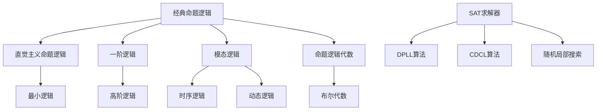

# 命题逻辑 - 六维内容补充


> **版本**: 1.0
> **创建日期**: 2026-04-19
> **最后更新**: 2026-04-19

> **模块**: 06-逻辑系统
> **文档**: 01-命题逻辑
> **补充维度**: 概念定义、属性、关系、解释、论证、形式证明
> **对标**: MIT 6.042J / Stanford CS103 / CMU 15-251
> **深度**: 研究生级

---

## 思维导图：命题逻辑概念结构

```mermaid
graph TD
    PL[命题逻辑<br/>Propositional Logic] --> SYN[语法<br/>Syntax]
    PL --> SEM[语义<br/>Semantics]
    PL --> PF[证明论<br/>Proof Theory]

    SYN --> PROP[命题变量<br/>p, q, r]
    SYN --> CONN[连接词<br/>¬, ∧, ∨, →]
    SYN --> WFF[合式公式<br/>Well-Formed]

    SEM --> INT[解释<br/>Interpretation]
    SEM --> TRUTH[真值表<br/>Truth Table]
    SEM --> VALID[有效性<br/>Validity]
    SEM >> SAT[可满足性<br/>SAT]

    PF --> NAT[自然演绎<br/>Natural Deduction]
    PF --> SEQ[序列演算<br/>Sequent Calculus]
    PF --> RES[归结<br/>Resolution]

    PL --> PROP2[重要性质]
    PROP2 --> DEC[可判定性<br/>Decidability]
    PROP2 --> COMP[完备性<br/>Completeness]
    PROP2 --> CONS[一致性<br/>Consistency]
```

---

## 一、概念定义 (Concept Definition)

### 1.1 命题逻辑 / Propositional Logic

**定义 1.1.1** (形式化)

命题逻辑（经典命题逻辑）是一个形式系统 $\mathcal{P} = (\mathcal{L}, \mathcal{A}, \mathcal{R})$：

**语法**:

$$
\begin{aligned}
\text{命题变量} \quad p &\in \mathcal{PV} \\
\text{公式} \quad \phi, \psi &::= p \mid \top \mid \bot \mid \neg\phi \mid \phi \land \psi \mid \phi \lor \psi \mid \phi \rightarrow \psi
\end{aligned}
$$

**语义**:

解释（赋值）$v: \mathcal{PV} \rightarrow \{0, 1\}$

扩展定义 $\hat{v}$:

$$
\begin{aligned}
\hat{v}(\top) &= 1 \\
\hat{v}(\bot) &= 0 \\
\hat{v}(\neg\phi) &= 1 - \hat{v}(\phi) \\
\hat{v}(\phi \land \psi) &= \min(\hat{v}(\phi), \hat{v}(\psi)) \\
\hat{v}(\phi \lor \psi) &= \max(\hat{v}(\phi), \hat{v}(\psi)) \\
\hat{v}(\phi \rightarrow \psi) &= \max(1 - \hat{v}(\phi), \hat{v}(\psi))
\end{aligned}
$$

**自然语言定义**

命题逻辑是研究命题（陈述句）之间逻辑关系的分支。它通过形式化的语法和语义，精确刻画"真"与"假"的推理规律，是更复杂逻辑系统（如一阶逻辑、模态逻辑）的基础。

---

### 1.2 有效性 / Validity

**定义 1.2.1** (形式化)

公式 $\phi$ 是**有效的**（valid，记作 $\vDash \phi$），如果对所有解释 $v$：

$$
\hat{v}(\phi) = 1
$$

公式 $\phi$ 是**可满足的**（satisfiable），如果存在解释 $v$：

$$
\hat{v}(\phi) = 1
$$

**逻辑后承**:

$$
\Gamma \vDash \phi \iff \forall v: (\forall \gamma \in \Gamma: \hat{v}(\gamma) = 1) \Rightarrow \hat{v}(\phi) = 1
$$

---

### 1.3 范式 / Normal Forms

**定义 1.3.1** (形式化)

**文字** (Literal): $p$ 或 $\neg p$

**合取范式** (CNF):

$$
\bigwedge_{i=1}^{n} \bigvee_{j=1}^{m_i} l_{ij}
$$

其中 $l_{ij}$ 是文字。

**析取范式** (DNF):

$$
\bigvee_{i=1}^{n} \bigwedge_{j=1}^{m_i} l_{ij}
$$

**定理**: 每个命题公式都逻辑等价于某个CNF和某个DNF。

---

## 二、属性 (Properties)

### 2.1 逻辑连接词真值表

| $\phi$ | $\psi$ | $\neg\phi$ | $\phi \land \psi$ | $\phi \lor \psi$ | $\phi \rightarrow \psi$ | $\phi \leftrightarrow \psi$ |
|--------|--------|------------|-------------------|------------------|-------------------------|---------------------------|
| 0 | 0 | 1 | 0 | 0 | 1 | 1 |
| 0 | 1 | 1 | 0 | 1 | 1 | 0 |
| 1 | 0 | 0 | 0 | 1 | 0 | 0 |
| 1 | 1 | 0 | 1 | 1 | 1 | 1 |

### 2.2 重要等值式

| 等值式 | 名称 | 说明 |
|--------|------|------|
| $\neg\neg\phi \equiv \phi$ | 双重否定 | 经典逻辑特有 |
| $\phi \land \phi \equiv \phi$ | 幂等律 | - |
| $\phi \lor \phi \equiv \phi$ | 幂等律 | - |
| $\phi \land \psi \equiv \psi \land \phi$ | 交换律 | - |
| $\phi \lor \psi \equiv \psi \lor \phi$ | 交换律 | - |
| $(\phi \land \psi) \land \chi \equiv \phi \land (\psi \land \chi)$ | 结合律 | - |
| $(\phi \lor \psi) \lor \chi \equiv \phi \lor (\psi \lor \chi)$ | 结合律 | - |
| $\phi \land (\psi \lor \chi) \equiv (\phi \land \psi) \lor (\phi \land \chi)$ | 分配律 | - |
| $\phi \lor (\psi \land \chi) \equiv (\phi \lor \psi) \land (\phi \lor \chi)$ | 分配律 | - |
| $\neg(\phi \land \psi) \equiv \neg\phi \lor \neg\psi$ | 德摩根律 | - |
| $\neg(\phi \lor \psi) \equiv \neg\phi \land \neg\psi$ | 德摩根律 | - |
| $\phi \rightarrow \psi \equiv \neg\phi \lor \psi$ | 蕴涵等值 | - |

### 2.3 复杂度属性

| 问题 | 复杂度 | 说明 |
|------|--------|------|
| **公式求值** | $O(|\phi|)$ | 给定解释求值 |
| **可满足性 (SAT)** | NP完全 | 首个被证明的NP完全问题 |
| **有效性检验** | coNP完全 | 等价于否定式的SAT |
| **蕴含检验** | coNP完全 | $\Gamma \vDash \phi$ |
| **CNF转换** | 多项式 | Tseitin转换 |
| **DNF转换** | 指数 | 可能产生指数级膨胀 |

---

## 三、关系 (Relations)

### 3.1 概念关系表

| 源概念 | 目标概念 | 关系类型 | 说明 |
|--------|----------|----------|------|
| 命题逻辑 | 一阶逻辑 | specializes | 命题逻辑是无量词的一阶逻辑 |
| 经典命题逻辑 | 直觉主义命题逻辑 | specializes | 经典排除排中律 |
| SAT | NP完全 | is | Cook-Levin定理 |
| CNF | 合取 | equivalent_to | 逻辑等价转换 |
| 有效性 | 可满足性 | dual_to | $\vDash\phi \iff \neg\phi$ 不可满足 |
| 命题逻辑 | 布尔代数 | equivalent_to | 代数语义 |
| 归结 | 自动定理证明 | applies_to | DPLL算法基础 |

### 3.2 逻辑系统层次



---

## 四、解释 (Explanation)

### 4.1 动机与直观

**为什么从命题逻辑开始？**

命题逻辑是逻辑的"原子物理":

1. **简单但完备**: 足以表达组合逻辑、电路设计
2. **可判定**: SAT虽然NP难，但是可判定的
3. **基础**: 一阶逻辑、模态逻辑都建立在命题逻辑之上

**SAT问题的实际重要性**:

- **硬件验证**: 验证电路设计是否正确
- **软件测试**: 生成满足约束的测试用例
- **规划**: AI中的自动规划
- **密码学**: 某些密码分析可归约为SAT

### 4.2 与已有概念的联系

**命题逻辑 ↔ 布尔代数**

命题逻辑和布尔代数是同一结构的两种视角：

| 命题逻辑 | 布尔代数 |
|----------|----------|
| $\land$ | $\cdot$ (乘法/与) |
| $\lor$ | $+$ (加法/或) |
| $\neg$ | $\bar{x}$ (补) |
| $\top$ | $1$ |
| $\bot$ | $0$ |

**命题逻辑 ↔ 数字电路**

- 逻辑门直接对应逻辑连接词
- 公式优化 = 电路优化
- SAT求解 = 电路可满足性分析

### 4.3 示例与反例

**示例 4.3.1**: 排中律

$$\vDash \phi \lor \neg\phi$$

这是经典逻辑的定理，但不是直觉主义逻辑的定理。

**反例 4.3.2**: 错误的推理

$$
\frac{\phi \rightarrow \psi}{\psi} \text{ ???}
$$

这是无效的！反例：令 $\phi = \bot, \psi = \bot$，则前提 $\bot \rightarrow \bot$ 为真，但结论 $\bot$ 为假。

正确的推理需要 $\phi$ 也为真：

$$
\frac{\phi \quad \phi \rightarrow \psi}{\psi}(\rightarrow E)
$$

---

## 五、论证 (Argumentation)

### 5.1 非形式论证：为什么SAT是NP完全的？

**Cook-Levin定理的直观**:

1. **SAT在NP中**: 给定一个赋值，可以在线性时间内验证它是否满足公式
2. **SAT是NP难的**: 任何NP问题都可以多项式归约到SAT

**归约思路**:

对于任何NP问题，存在一个非确定图灵机在多项式时间内解决它。我们可以构造一个布尔公式，编码：

- 初始状态
- 转移函数
- 接受条件

这个公式可满足当且仅当图灵机接受输入。

### 5.2 反例与边界

**边界情况 5.2.1**: 公式规模爆炸

转换为DNF可能产生指数级膨胀：

$$\phi_1 \land (\phi_2 \lor \psi_2) \land (\phi_3 \lor \psi_3) \land \cdots$$

转换为DNF后，有 $2^n$ 个合取子句。

---

## 六、形式证明 (Formal Proof)

### 6.1 可靠性定理

**定理 6.1.1** (Soundness): 若 $\Gamma \vdash \phi$，则 $\Gamma \vDash \phi$。

**证明** (对证明结构归纳):

**基例** (公理/假设): 若 $\phi \in \Gamma$，显然 $\Gamma \vDash \phi$。

**归纳步骤**: （以$\land$引入为例）

假设 $\Gamma \vdash \phi$ 和 $\Gamma \vdash \psi$，且 $\Gamma \vDash \phi$ 和 $\Gamma \vDash \psi$。

对于任意满足 $\Gamma$ 的解释 $v$：
$$\hat{v}(\phi) = 1 \text{ 且 } \hat{v}(\psi) = 1$$

因此：
$$\hat{v}(\phi \land \psi) = \min(\hat{v}(\phi), \hat{v}(\psi)) = 1$$

即 $\Gamma \vDash \phi \land \psi$。

### 6.2 完备性定理

**定理 6.2.1** (Completeness): 若 $\Gamma \vDash \phi$，则 $\Gamma \vdash \phi$。

**证明概要** (Henkin方法):

1. 假设 $\Gamma \not\vdash \phi$
2. 构造极大一致集 $\Delta \supseteq \Gamma$
3. 定义解释 $v$：$v(p) = 1 \iff p \in \Delta$
4. 证明对所有 $\psi$：$\hat{v}(\psi) = 1 \iff \psi \in \Delta$
5. 由于 $\phi \notin \Delta$，有 $\hat{v}(\phi) = 0$
6. 但 $\Gamma \subseteq \Delta$，所以 $\hat{v}$ 满足 $\Gamma$
7. 这与 $\Gamma \vDash \phi$ 矛盾

---

## 七、多语言实现：SAT求解器

### 7.1 Python: DPLL算法

```python
"""
DPLL算法实现 - 经典的SAT求解器
"""

from typing import List, Set, Dict, Optional, Tuple

# 文字: 正数表示正文字，负数表示负文字
Literal = int
Clause = Set[Literal]
CNF = List[Clause]


def dpll(cnf: CNF, assignment: Dict[int, bool] = None) -> Optional[Dict[int, bool]]:
    """
    DPLL算法求解SAT

    返回: 满足赋值 或 None（不可满足）
    """
    if assignment is None:
        assignment = {}

    # 单位传播
    cnf, assignment = unit_propagation(cnf, assignment)
    if cnf is None:  # 冲突
        return None

    # 纯文字消除
    cnf, assignment = pure_literal_elimination(cnf, assignment)

    # 终止条件
    if not cnf:  # 空公式，可满足
        return assignment

    if any(len(c) == 0 for c in cnf):  # 空子句，不可满足
        return None

    # 选择分支变量（启发式）
    var = select_variable(cnf)

    # 尝试真赋值
    new_cnf = [[l for l in clause if l != -var] for clause in cnf]
    new_cnf = [clause for clause in new_cnf if var not in clause]
    result = dpll(new_cnf, {**assignment, var: True})
    if result is not None:
        return result

    # 尝试假赋值
    new_cnf = [[l for l in clause if l != var] for clause in cnf]
    new_cnf = [clause for clause in new_cnf if -var not in clause]
    return dpll(new_cnf, {**assignment, var: False})


def unit_propagation(cnf: CNF, assignment: Dict[int, bool]) -> Tuple[Optional[CNF], Dict[int, bool]]:
    """单位传播"""
    changed = True

    while changed:
        changed = False

        # 找单位子句
        for clause in cnf:
            if len(clause) == 1:
                lit = list(clause)[0]
                var = abs(lit)
                val = lit > 0

                if var in assignment:
                    if assignment[var] != val:  # 冲突
                        return None, assignment
                else:
                    assignment = {**assignment, var: val}
                    # 简化公式
                    cnf = simplify(cnf, var, val)
                    changed = True
                    break

    return cnf, assignment


def pure_literal_elimination(cnf: CNF, assignment: Dict[int, bool]) -> Tuple[CNF, Dict[int, bool]]:
    """纯文字消除"""
    if not cnf:
        return cnf, assignment

    # 收集所有文字
    all_lits = set()
    for clause in cnf:
        all_lits.update(clause)

    # 找纯文字
    for lit in all_lits:
        if -lit not in all_lits:
            var = abs(lit)
            val = lit > 0
            if var not in assignment:
                assignment = {**assignment, var: val}
                cnf = simplify(cnf, var, val)
                return pure_literal_elimination(cnf, assignment)

    return cnf, assignment


def simplify(cnf: CNF, var: int, val: bool) -> CNF:
    """根据赋值简化CNF"""
    lit = var if val else -var

    new_cnf = []
    for clause in cnf:
        if lit in clause:  # 子句被满足
            continue
        # 移除相反文字
        new_clause = {l for l in clause if l != -lit}
        new_cnf.append(new_clause)

    return new_cnf


def select_variable(cnf: CNF) -> int:
    """选择变量（简单启发式：出现次数最多）"""
    count = {}
    for clause in cnf:
        for lit in clause:
            var = abs(lit)
            count[var] = count.get(var, 0) + 1
    return max(count, key=count.get)


# 示例
if __name__ == "__main__":
    # (p ∨ q) ∧ (¬p ∨ q) ∧ (p ∨ ¬q)
    cnf = [
        {1, 2},    # p ∨ q
        {-1, 2},   # ¬p ∨ q
        {1, -2}    # p ∨ ¬q
    ]

    result = dpll(cnf)
    print(f"CNF: {cnf}")
    print(f"Result: {result}")  # {1: True, 2: True}

    # 不可满足的例子: p ∧ ¬p
    unsat_cnf = [{1}, {-1}]
    result2 = dpll(unsat_cnf)
    print(f"\nUnsat CNF: {unsat_cnf}")
    print(f"Result: {result2}")  # None
```

---

## 八、真值表速查

### 8.1 常见公式性质

| 公式 | 有效性 | 可满足性 |
|------|--------|----------|
| $p \lor \neg p$ | ✅ | ✅ |
| $p \land \neg p$ | ❌ | ❌ |
| $p \rightarrow p$ | ✅ | ✅ |
| $p \rightarrow (q \rightarrow p)$ | ✅ | ✅ |
| $(p \land q) \rightarrow p$ | ✅ | ✅ |
| $p \rightarrow (q \lor r)$ | ❌ | ✅ |

### 8.2 推理规则速查

| 规则 | 名称 | 形式 |
|------|------|------|
| 肯定前件 | Modus Ponens | $\frac{\phi \quad \phi \rightarrow \psi}{\psi}$ |
| 否定后件 | Modus Tollens | $\frac{\neg\psi \quad \phi \rightarrow \psi}{\neg\phi}$ |
| 假言三段论 | Hypothetical Syllogism | $\frac{\phi \rightarrow \psi \quad \psi \rightarrow \chi}{\phi \rightarrow \chi}$ |
| 选言三段论 | Disjunctive Syllogism | $\frac{\phi \lor \psi \quad \neg\phi}{\psi}$ |
| 构造性二难 | Constructive Dilemma | $\frac{\phi \rightarrow \chi \quad \psi \rightarrow \chi \quad \phi \lor \psi}{\chi}$ |

---

**文档版本**: v1.0
**创建日期**: 2026-04-10
**维护**: 项目逻辑系统工作组

---

## 参考文献

- [Mendelson2015] E. Mendelson. Introduction to Mathematical Logic (6th ed.). CRC Press, 2015.
- [Enderton2001] H. B. Enderton. A Mathematical Introduction to Logic (2nd ed.). Academic Press, 2001.
- [Kripke1963] S. Kripke. Semantical Analysis of Modal Logic I. Zeitschrift für Mathematische Logik, 8:67-96, 1963.
- [Pnueli1977] A. Pnueli. The Temporal Logic of Programs. FOCS, 46-57, 1977.

---

## 知识导航

- [返回目录](README.md)

## 学习目标

- 理解命题逻辑 - 六维内容补充的核心概念
- 掌握命题逻辑 - 六维内容补充的形式化表示
