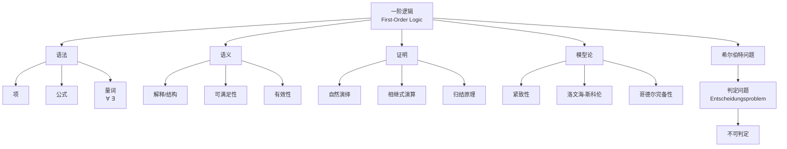
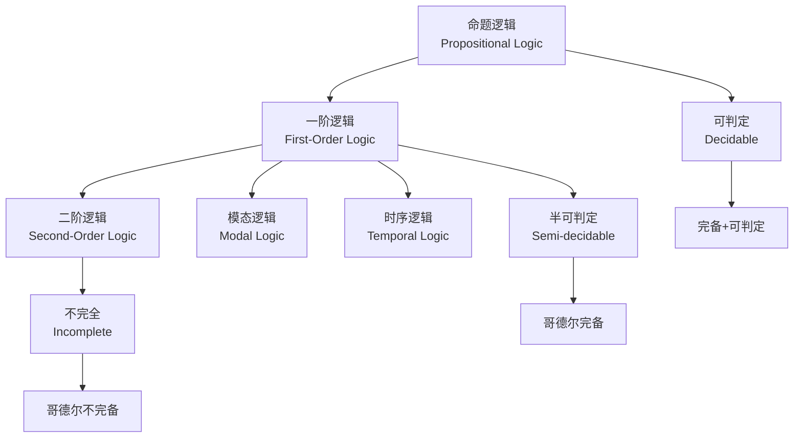

# 谓词逻辑（一阶逻辑）- 六维内容补充

> **模块**: 06-逻辑系统
> **文档**: 02-谓词逻辑
> **补充维度**: 概念定义、属性、关系、解释、论证、形式证明
> **对标**: MIT 6.042J / CMU 15-251 / Stanford CS103
> **深度**: 研究生级

---

## 思维导图：谓词逻辑概念结构



---

## 一、概念定义 (Concept Definition)

### 1.1 一阶逻辑语法 / First-Order Syntax

**定义 1.1.1** (形式化)

**签名 (Signature)** $\sigma = (C, F, R, ar)$:

- $C$: 常量符号集合
- $F$: 函数符号集合
- $R$: 谓词符号集合
- $ar$: 元数函数 $F \cup R \rightarrow \mathbb{N}^+$

**项 (Terms)** $Term_\sigma$ 归纳定义:

1. **变量**: $x \in Var \Rightarrow x \in Term_\sigma$
2. **常量**: $c \in C \Rightarrow c \in Term_\sigma$
3. **函数应用**: $f \in F, ar(f)=n, t_1,\ldots,t_n \in Term_\sigma \Rightarrow f(t_1,\ldots,t_n) \in Term_\sigma$

**公式 (Formulas)** $Form_\sigma$ 归纳定义:

1. **原子公式**: $P \in R, ar(P)=n, t_1,\ldots,t_n \in Term_\sigma \Rightarrow P(t_1,\ldots,t_n) \in Form_\sigma$
2. **等式**: $t_1 = t_2 \in Form_\sigma$（若包含等词）
3. **否定**: $\varphi \in Form_\sigma \Rightarrow \neg\varphi \in Form_\sigma$
4. **合取/析取**: $\varphi, \psi \in Form_\sigma \Rightarrow \varphi \land \psi, \varphi \lor \psi \in Form_\sigma$
5. **量词**: $\varphi \in Form_\sigma, x \in Var \Rightarrow \forall x.\varphi, \exists x.\varphi \in Form_\sigma$

---

### 1.2 一阶语义 / First-Order Semantics

**定义 1.2.1** (形式化)

**结构 (Structure)** $\mathcal{M} = (D, I)$:

- $D$: 非空论域
- $I$: 解释函数
  - $I(c) \in D$ （常量解释）
  - $I(f): D^n \rightarrow D$ （函数解释）
  - $I(R) \subseteq D^n$ （谓词解释）

**赋值 (Assignment)** $\rho: Var \rightarrow D$

**项求值** $\llbracket t \rrbracket_\rho^\mathcal{M}$:

- $\llbracket x \rrbracket_\rho^\mathcal{M} = \rho(x)$
- $\llbracket c \rrbracket_\rho^\mathcal{M} = I(c)$
- $\llbracket f(t_1,\ldots,t_n) \rrbracket_\rho^\mathcal{M} = I(f)(\llbracket t_1 \rrbracket_\rho^\mathcal{M}, \ldots)$

**满足关系** $\mathcal{M}, \rho \models \varphi$:

| 公式 | 满足条件 |
|------|----------|
| $P(t_1,\ldots,t_n)$ | $(\llbracket t_1 \rrbracket, \ldots) \in I(P)$ |
| $t_1 = t_2$ | $\llbracket t_1 \rrbracket = \llbracket t_2 \rrbracket$ |
| $\neg\varphi$ | $\mathcal{M}, \rho \not\models \varphi$ |
| $\varphi \land \psi$ | $\mathcal{M}, \rho \models \varphi$ 且 $\mathcal{M}, \rho \models \psi$ |
| $\forall x.\varphi$ | 对所有 $d \in D: \mathcal{M}, \rho[x \mapsto d] \models \varphi$ |
| $\exists x.\varphi$ | 存在 $d \in D: \mathcal{M}, \rho[x \mapsto d] \models \varphi$ |

---

### 1.3 重要语义概念

**定义 1.3.1**:

| 概念 | 定义 | 符号 |
|------|------|------|
| **有效 (Valid)** | 在所有结构中满足 | $\models \varphi$ |
| **可满足 (Satisfiable)** | 存在结构使其满足 | $\mathcal{M} \models \varphi$ |
| **逻辑后承** | $\Gamma \models \varphi$ 当且仅当所有满足$\Gamma$的模型也满足$\varphi$ | $\Gamma \models \varphi$ |
| **永假 (Contradiction)** | 不可满足 | 无模型满足 |

---

## 二、属性 (Properties)

### 2.1 一阶逻辑元定理

| 定理 | 内容 | 意义 |
|------|------|------|
| **哥德尔完备性** | $\Gamma \vdash \varphi \Leftrightarrow \Gamma \models \varphi$ | 语法与语义等价 |
| **紧致性** | $\Gamma \models \varphi \Rightarrow \exists \Gamma_0 \subseteq_{finite} \Gamma: \Gamma_0 \models \varphi$ | 无穷⇒有穷 |
| **洛文海-斯科伦** | 无穷模型⇒任意基数模型 | 模型论基础 |
| **不可判定性** | 有效性问题不可判定 | 计算复杂性边界 |

### 2.2 量词性质

| 性质 | 公式 | 有效性 |
|------|------|--------|
| **量词否定** | $\neg\forall x.\varphi \equiv \exists x.\neg\varphi$ | ✅ |
| **量词分配** | $\forall x.(\varphi \land \psi) \equiv \forall x.\varphi \land \forall x.\psi$ | ✅ |
| **量词分配(∨)** | $\forall x.(\varphi \lor \psi) \not\equiv \forall x.\varphi \lor \forall x.\psi$ | ❌ |
| **量词交换** | $\forall x\forall y.\varphi \equiv \forall y\forall x.\varphi$ | ✅ |
| **存在交换** | $\exists x\forall y.\varphi \not\equiv \forall y\exists x.\varphi$ | ❌ |

### 2.3 表达式复杂度

| 类 | 量词结构 | 示例 |
|----|----------|------|
| **∃* (存在式)** | $\exists x_1\ldots\exists x_n.\varphi$ | 可满足性判定是NP完全的 |
| **∀* (全称式)** | $\forall x_1\ldots\forall x_n.\varphi$ | 有效性判定是co-NP完全的 |
| **∃*∀* (AE式)** | $\exists\vec{x}\forall\vec{y}.\varphi$ | 特定片段可判定 |
| **任意** | 混合量词 | 一般不可判定 |

---

## 三、关系 (Relations)

### 3.1 概念关系表

| 源概念 | 目标概念 | 关系类型 | 说明 |
|--------|----------|----------|------|
| 命题逻辑 | 一阶逻辑 | extends | FOL是PL的扩展 |
| 一阶逻辑 | 高阶逻辑 | generalizes_to | HOL允许量词作用于谓词 |
| 语法 ⊢ | 语义 ⊨ | equivalent_by | 哥德尔完备性定理 |
| 紧致性 | 无穷模型 | implies | 紧致性⇒无穷公理系统效果 |
| 不可判定性 | 停机问题 | reduces_to | FOL不可判定性证明 |

### 3.2 逻辑系统层次



---

## 四、解释 (Explanation)

### 4.1 动机与直观

**为什么需要一阶逻辑？**

命题逻辑无法表达：

- "**所有**人都会死"
- "**存在**一个最大的素数"（实际上是假的）
- "**每个**数都有后继"

一阶逻辑引入**量词**和**谓词**，使这些表达成为可能。

**量词直观**:

- $\forall x. P(x)$: "对于所有$x$，$P$成立"（全称）
- $\exists x. P(x)$: "存在某个$x$使$P$成立"（存在）

**结构直观**:

结构就像是一个"数学宇宙"，其中：

- 论域$D$是所有对象的集合
- 解释$I$告诉我们符号具体指什么

例如，算术结构：

- $D = \mathbb{N}$
- $I(0) = 0$, $I(S) = \lambda x. x+1$, $I(+) = $ 加法

### 4.2 与已有概念的联系

**FOL ↔ 编程语言**

| 编程概念 | 逻辑对应 |
|----------|----------|
| 类型 | 论域 |
| 函数 | 函数符号 |
| 谓词/布尔函数 | 关系符号 |
| for-all循环 | $\forall$量词 |
| 存在检查 | $\exists$量词 |
| 模式匹配 | 项重写 |

**FOL ↔ 数据库**

关系数据库本质上是一阶逻辑模型：

- 表 → 谓词
- 行 → 元组满足谓词
- SQL查询 → 一阶逻辑公式
- 主键约束 → 唯一性公式

### 4.3 示例与反例

**示例 4.3.1**: 欧几里得算法公理化

```
签名: (0, S, +, ×, <)

公理:
1. ∀x. ¬(S(x) = 0)                 [0不是后继]
2. ∀x∀y. S(x) = S(y) → x = y       [后继单射]
3. ∀x. x + 0 = x                   [加法单位元]
4. ∀x∀y. x + S(y) = S(x + y)       [加法递归]
5. ∀x. x × 0 = 0                   [乘法零元]
6. ∀x∀y. x × S(y) = (x × y) + x    [乘法递归]
7. 归纳公理模式...

这个理论定义了皮亚诺算术PA
```

**反例 4.3.2**: 量词交换不成立

```
∀x∃y. P(x,y)  不等价于  ∃y∀x. P(x,y)

例: P(x,y) 表示 "y是x的父亲"

∀x∃y. P(x,y): 每个人都有父亲 [真]
∃y∀x. P(x,y): 存在一个人是所有人的父亲 [假]
```

---

## 五、论证 (Argumentation)

### 5.1 非形式论证：哥德尔完备性定理

**定理**: $\Gamma \vdash \varphi \Leftrightarrow \Gamma \models \varphi$

**(⇒) 可靠性**: 语法推演保持语义真值

归纳于证明树：

- 公理是有效的
- 推理规则保持有效性
- 因此可证的公式必然有效

**(⇐) 完备性**: 语义有效则语法可证

**构造性证明概要**:

1. 将$\Gamma$扩展为**极大一致集**$\Gamma^*$
2. 构造**典范模型**$\mathcal{M}$使得$\Gamma^*$恰好在$\mathcal{M}$中可满足
3. 若$\Gamma \models \varphi$但$\Gamma \not\vdash \varphi$，则$\Gamma \cup \{\neg\varphi\}$一致
4. 构造模型满足$\Gamma \cup \{\neg\varphi\}$，与$\Gamma \models \varphi$矛盾

### 5.2 反例与边界

**边界情况 5.2.1**: 不可判定性

丘奇(1936)和图灵(1936)独立证明：

**判定问题**: "给定一阶公式$\varphi$，$\varphi$是否有效？"是**不可判定**的。

**证明思路**:

- 将停机问题归约到FOL有效性
- 构造公式$\varphi_M$使得$\varphi_M$有效 ⟺ 图灵机$M$停机
- 由于停机问题不可判定，FOL有效性也不可判定

---

## 六、形式证明 (Formal Proof)

### 6.1 紧致性定理证明

**定理 6.1.1**: 若$\Gamma \models \varphi$，则存在有限$\Gamma_0 \subseteq \Gamma$使$\Gamma_0 \models \varphi$。

**证明**:

反设对所有有限$\Gamma_0 \subseteq \Gamma$，$\Gamma_0 \not\models \varphi$。

则每个有限子集$\Gamma_0 \cup \{\neg\varphi\}$可满足。

由**紧致性引理**: 若每个有限子集可满足，则整个集合可满足。

因此$\Gamma \cup \{\neg\varphi\}$可满足，即存在模型满足$\Gamma$但不满足$\varphi$。

这与$\Gamma \models \varphi$矛盾！

---

## 七、多语言实现：逻辑公式处理

### 7.1 Python: 一阶逻辑公式解析与求值

```python
"""
一阶逻辑公式处理
包含：解析、语义求值、简单推理
"""

from dataclasses import dataclass
from typing import Set, Dict, Callable, Any, Optional
from abc import ABC, abstractmethod

# ===== 语法树节点 =====

class Term(ABC):
    """项基类"""
    @abstractmethod
    def evaluate(self, assignment: Dict[str, Any], interpretation: Dict) -> Any:
        pass

@dataclass
class Var(Term):
    """变量"""
    name: str

    def evaluate(self, assignment, interpretation):
        return assignment.get(self.name)

@dataclass
class Const(Term):
    """常量"""
    name: str

    def evaluate(self, assignment, interpretation):
        return interpretation['constants'].get(self.name)

@dataclass
class FuncApp(Term):
    """函数应用"""
    func: str
    args: list

    def evaluate(self, assignment, interpretation):
        func = interpretation['functions'].get(self.func)
        arg_values = [arg.evaluate(assignment, interpretation) for arg in self.args]
        return func(*arg_values)

class Formula(ABC):
    """公式基类"""
    @abstractmethod
    def evaluate(self, domain: Set, assignment: Dict, interpretation: Dict) -> bool:
        pass

@dataclass
class Predicate(Formula):
    """原子谓词"""
    pred: str
    terms: list

    def evaluate(self, domain, assignment, interpretation):
        pred_interp = interpretation['predicates'].get(self.pred)
        term_values = tuple(t.evaluate(assignment, interpretation) for t in self.terms)
        return term_values in pred_interp

@dataclass
class Eq(Formula):
    """等式"""
    left: Term
    right: Term

    def evaluate(self, domain, assignment, interpretation):
        return self.left.evaluate(assignment, interpretation) == \
               self.right.evaluate(assignment, interpretation)

@dataclass
class Not(Formula):
    """否定"""
    formula: Formula

    def evaluate(self, domain, assignment, interpretation):
        return not self.formula.evaluate(domain, assignment, interpretation)

@dataclass
class And(Formula):
    """合取"""
    left: Formula
    right: Formula

    def evaluate(self, domain, assignment, interpretation):
        return self.left.evaluate(domain, assignment, interpretation) and \
               self.right.evaluate(domain, assignment, interpretation)

@dataclass
class ForAll(Formula):
    """全称量词"""
    var: str
    formula: Formula

    def evaluate(self, domain, assignment, interpretation):
        for d in domain:
            new_assignment = {**assignment, self.var: d}
            if not self.formula.evaluate(domain, new_assignment, interpretation):
                return False
        return True

@dataclass
class Exists(Formula):
    """存在量词"""
    var: str
    formula: Formula

    def evaluate(self, domain, assignment, interpretation):
        for d in domain:
            new_assignment = {**assignment, self.var: d}
            if self.formula.evaluate(domain, new_assignment, interpretation):
                return True
        return False

# ===== 结构（模型） =====

class Structure:
    """一阶结构"""

    def __init__(self, domain: Set, interpretation: Dict):
        self.domain = domain
        self.interpretation = interpretation

    def satisfies(self, formula: Formula, assignment: Dict = None) -> bool:
        """检查结构是否满足公式"""
        if assignment is None:
            assignment = {}
        return formula.evaluate(self.domain, assignment, self.interpretation)

# ===== 示例：算术结构 =====

def create_arithmetic_structure(max_n: int = 10) -> Structure:
    """创建有限算术结构"""
    domain = set(range(max_n))

    interpretation = {
        'constants': {'zero': 0},
        'functions': {
            'succ': lambda x: (x + 1) % max_n,
            'add': lambda x, y: (x + y) % max_n,
            'mul': lambda x, y: (x * y) % max_n
        },
        'predicates': {
            'Even': {(n,) for n in domain if n % 2 == 0},
            'Odd': {(n,) for n in domain if n % 2 == 1},
            'Less': {(m, n) for m in domain for n in domain if m < n}
        }
    }

    return Structure(domain, interpretation)

# ===== 测试 =====

def test_fol():
    """测试一阶逻辑求值"""
    arith = create_arithmetic_structure(10)

    # 公式: ∀x. Even(x) → ¬Odd(x)
    # 即：所有偶数都不是奇数
    formula = ForAll('x',
        Or(  # 使用德摩根律: P → Q ≡ ¬P ∨ Q
            Not(Predicate('Even', [Var('x')])),
            Not(Predicate('Odd', [Var('x')]))
        )
    )

    result = arith.satisfies(formula)
    print(f"∀x. Even(x) → ¬Odd(x) : {result}")

    # 公式: ∃x. Even(x) ∧ Less(zero, x)
    # 即：存在一个大于0的偶数
    formula2 = Exists('x',
        And(
            Predicate('Even', [Var('x')]),
            Predicate('Less', [Const('zero'), Var('x')])
        )
    )

    result2 = arith.satisfies(formula2)
    print(f"∃x. Even(x) ∧ Less(0, x) : {result2}")

if __name__ == "__main__":
    test_fol()
```

---

**文档版本**: v1.0
**创建日期**: 2026-04-10
**维护**: 项目逻辑系统工作组
