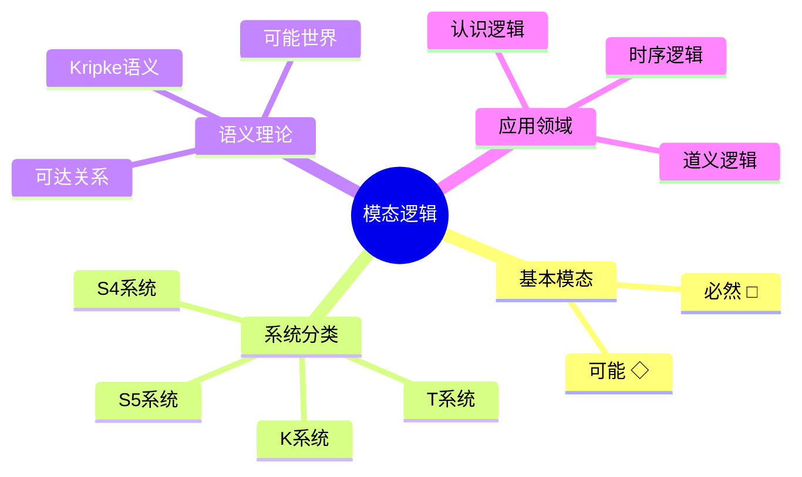

# 模态逻辑 - 六维补充


> **版本**: 1.0
> **创建日期**: 2026-04-19
> **最后更新**: 2026-04-19

> 本文档遵循六维内容标准：概念定义、属性、关系、解释、论证、形式证明

---

## 1. 概念定义 (Definition)

### 1.1 核心概念

**模态逻辑 (Modal Logic)**

模态逻辑是对经典命题/谓词逻辑的扩展，通过引入模态算子来表达**必然性**和**可能性**等概念。

### 1.2 思维导图



### 1.3 形式化定义

**定义 1 (模态语言)**

设 $Prop$ 为命题变元集合，模态公式 $\phi$ 的语法为：

$$
\phi ::= p \mid \bot \mid \phi \to \phi \mid \Box\phi \mid \Diamond\phi
$$

其中 $p \in Prop$，其他连接词定义为通常的缩写。

**定义 2 (必然与可能)**

$$
\begin{aligned}
\Box\phi &\equiv \text{"必然 } \phi\text{"} \\
\Diamond\phi &\equiv \text{"可能 } \phi\text{"} \\
\Diamond\phi &\leftrightarrow \neg\Box\neg\phi \quad \text{(对偶性)}
\end{aligned}
$$

**定义 3 (Kripke框架与模型)**

- **框架** $\mathcal{F} = (W, R)$，其中：
  - $W \neq \emptyset$：可能世界集合
  - $R \subseteq W \times W$：可达关系

- **模型** $\mathcal{M} = (W, R, V)$，其中：
  - $(W, R)$ 是框架
  - $V : Prop \to \mathcal{P}(W)$：赋值函数

**定义 4 (满足关系)**

$$
\mathcal{M}, w \Vdash \phi \text{ (在世界 } w \text{ 满足 } \phi \text{)}
$$

递归定义：

$$
\begin{aligned}
\mathcal{M}, w &\Vdash p &&\text{iff } w \in V(p) \\
\mathcal{M}, w &\Vdash \bot &&\text{永假} \\
\mathcal{M}, w &\Vdash \phi \to \psi &&\text{iff } \mathcal{M}, w \Vdash \phi \text{ 蕴含 } \mathcal{M}, w \Vdash \psi \\
\mathcal{M}, w &\Vdash \Box\phi &&\text{iff } \forall v \in W. (wRv \Rightarrow \mathcal{M}, v \Vdash \phi) \\
\mathcal{M}, w &\Vdash \Diamond\phi &&\text{iff } \exists v \in W. (wRv \land \mathcal{M}, v \Vdash \phi)
\end{aligned}
$$

---

## 2. 属性 (Properties)

### 2.1 模态算子代数性质

| 性质 | 公式 | 说明 |
|------|------|------|
| **对偶性** | $\Diamond\phi \leftrightarrow \neg\Box\neg\phi$ | 可能与必然的转换 |
| **单调性** | $\Box(\phi \to \psi) \to (\Box\phi \to \Box\psi)$ | K公理 |
| **分配性** | $\Box(\phi \land \psi) \leftrightarrow (\Box\phi \land \Box\psi)$ | 对合取分配 |
| **半分配性** | $\Diamond(\phi \lor \psi) \leftrightarrow (\Diamond\phi \lor \Diamond\psi)$ | 对析取分配 |
| **非分配** | $\Box(\phi \lor \psi) \not\leftrightarrow (\Box\phi \lor \Box\psi)$ | 不成立 |

### 2.2 Kripke关系属性

| 公理 | 条件 | 关系性质 |
|------|------|----------|
| **K** | $\Box(\phi \to \psi) \to (\Box\phi \to \Box\psi)$ | 所有框架 |
| **T** | $\Box\phi \to \phi$ | 自反性 (Reflexive) |
| **4** | $\Box\phi \to \Box\Box\phi$ | 传递性 (Transitive) |
| **5** | $\Diamond\phi \to \Box\Diamond\phi$ | 欧几里得性 (Euclidean) |
| **B** | $\phi \to \Box\Diamond\phi$ | 对称性 (Symmetric) |

### 2.3 模态系统层次

| 系统 | 公理 | 框架条件 |
|------|------|----------|
| **K** | K + MP + Nec | 所有框架 |
| **D** | K + $\Box\phi \to \Diamond\phi$ | 持续性 (Serial) |
| **T** | K + T | 自反框架 |
| **S4** | T + 4 | 预序 (Preorder) |
| **S5** | T + 5 或 S4 + B | 等价关系 |

---

## 3. 关系 (Relations)

### 3.1 与其他逻辑的关系

| 逻辑系统 | 关系 | 说明 |
|----------|------|------|
| 经典命题逻辑 | 基础 | 模态逻辑的底层 |
| 时序逻辑 | 扩展 | 加入时间算子 |
| 动态逻辑 | 扩展 | 加入程序算子 |
| 直觉主义逻辑 | 关联 | Kripke语义类似 |
| 一阶逻辑 | 可互译 | 标准翻译嵌入 |

### 3.2 模态系统关系图

```
                    K (最弱)
                    |
        +-----------+-----------+
        |           |           |
        D           T           KB
        |           |           |
        |           S4          |
        |          / | \        |
        +---------+  |  +--------+
                   S5 (最强)
```

### 3.3 语义关系

| 语义概念 | 关系 | 形式化表达 |
|----------|------|------------|
| 有效性 | 所有世界满足 | $\mathcal{M} \Vdash \phi$ |
| 框架有效性 | 所有模型满足 | $\mathcal{F} \Vdash \phi$ |
| 逻辑后承 | 前提真则结论真 | $\Gamma \Vdash \phi$ |
| 可满足性 | 存在满足的世界 | $\exists w. \mathcal{M}, w \Vdash \phi$ |

---

## 4. 解释 (Explanation)

### 4.1 必然与可能的直观理解

**可能世界语义**

想象存在多个"可能世界"，每个世界代表一种现实的可能性：

```
世界 w1 (现实世界)
   ├── 可达 → 世界 w2 (下雨的可能世界)
   ├── 可达 → 世界 w3 (晴天的可能世界)
   └── 可达 → 世界 w4 (下雪的可能世界)
```

- **□φ** (必然φ)：在w所有可达世界中都为真
- **◇φ** (可能φ)：在w至少一个可达世界中为真

### 4.2 Kripke语义的直观

**可达关系 R 的直观含义**

| R 的性质 | 含义 | 例子 |
|----------|------|------|
| 自反 | 自己可达自己 | "必然φ"蕴含"φ" |
| 传递 | 可达的可达仍可直达 | "必然"可以嵌套 |
| 对称 | 互可达 | "若φ则可能必然φ" |
| 全关系 | 所有世界互相可达 | S5，逻辑真理处处真 |

### 4.3 代码示例：模态逻辑求值器

```python
class KripkeModel:
    def __init__(self, worlds, relation, valuation):
        self.W = worlds          # 世界集合
        self.R = relation        # 可达关系 (dict: world -> set)
        self.V = valuation       # 赋值 (dict: prop -> set of worlds)

    def satisfies(self, world, formula):
        """检查公式在世界中是否满足"""
        if isinstance(formula, Prop):
            return world in self.V.get(formula.name, set())

        elif isinstance(formula, Not):
            return not self.satisfies(world, formula.sub)

        elif isinstance(formula, Implies):
            return (not self.satisfies(world, formula.left)) or \
                   self.satisfies(world, formula.right)

        elif isinstance(formula, Box):
            # □φ: 所有可达世界满足φ
            for v in self.R.get(world, set()):
                if not self.satisfies(v, formula.sub):
                    return False
            return True

        elif isinstance(formula, Diamond):
            # ◇φ: 存在可达世界满足φ
            for v in self.R.get(world, set()):
                if self.satisfies(v, formula.sub):
                    return True
            return False

# 示例模型
model = KripkeModel(
    worlds={'w1', 'w2', 'w3'},
    relation={
        'w1': {'w1', 'w2'},
        'w2': {'w2', 'w3'},
        'w3': {'w3'}
    },
    valuation={'p': {'w1', 'w2'}, 'q': {'w3'}}
)

# 验证: w1 ⊨ □p ?
# w1可达w1和w2，都满足p，所以w1 ⊨ □p
```

---

## 5. 论证 (Argumentation)

### 5.1 为什么需要模态逻辑？

**论证 1：表达力扩展**

> 经典逻辑只能表达"φ为真"，
> 模态逻辑可表达：
>
> - "φ必然为真" (□φ)
> - "φ可能为真" (◇φ)
> - "φ在将来为真" (时态)
> - "φ被允许/必须" (道义)

**论证 2：不同必然性的区分**

| 必然类型 | 模态解释 | 例子 |
|----------|----------|------|
| 逻辑必然 | 所有逻辑可能世界 | □(φ∨¬φ) |
| 物理必然 | 与物理定律一致 | □(光速恒定) |
| 认知必然 | 与已知信息一致 | □_a φ (a知道φ) |
| 道义必然 | 与规范一致 | Oφ (应当φ) |

**论证 3：相对于经典逻辑的优势**

```
经典逻辑: 真值是绝对的
模态逻辑: 真值是世界相对的

优势:
1. 处理不确定性
2. 表达知识/信念变化
3. 分析时态属性
4. 规范推理
```

### 5.2 Kripke语义的合理性论证

**哲学动机**

- 可能世界：源自莱布尼茨的哲学思想
- 可达关系：刻画"可及性"或"可替代性"
- 关系约束：对应不同必然性概念

---

## 6. 形式证明 (Formal Proofs)

### 6.1 引理：对偶性

**引理 6.1** 对任意公式 $\phi$，$\Diamond\phi \leftrightarrow \neg\Box\neg\phi$ 在所有框架上有效。

*证明：*

$$
\begin{aligned}
\mathcal{M}, w \Vdash \Diamond\phi
&\text{ iff } \exists v. wRv \land \mathcal{M}, v \Vdash \phi \\
&\text{ iff } \neg\forall v. wRv \Rightarrow \neg(\mathcal{M}, v \Vdash \phi) \\
&\text{ iff } \neg\forall v. wRv \Rightarrow \mathcal{M}, v \Vdash \neg\phi \\
&\text{ iff } \neg(\mathcal{M}, w \Vdash \Box\neg\phi) \\
&\text{ iff } \mathcal{M}, w \Vdash \neg\Box\neg\phi
\end{aligned}
$$

### 6.2 定理：对应理论

**定理 6.2** 框架 $\mathcal{F}$ 满足公理 T ($\Box\phi \to \phi$) 当且仅当 $R$ 是自反的。

*证明：*

**(⇒)** 设 $\mathcal{F} \Vdash \Box\phi \to \phi$ 对所有 $\phi$ 成立。
反设 $R$ 不自反，则存在 $w$ 使得 $\neg wRw$。
取 $\phi = \Box\bot$，构造赋值使 $w \Vdash \Box\phi$ 但 $w \not\Vdash \phi$，矛盾。

**(⇐)** 设 $R$ 自反。对任意 $w$，若 $w \Vdash \Box\phi$，
则对所有 $v$ 满足 $wRv$，有 $v \Vdash \phi$。
因 $wRw$，故 $w \Vdash \phi$。

### 6.3 定理：可靠性

**定理 6.3 (K的可靠性)** 若 $\vdash_K \phi$，则 $\phi$ 在所有框架上有效。

*证明概要：*

对推导长度进行归纳：

1. **K公理**：验证 $\Box(\phi\to\psi) \to (\Box\phi \to \Box\psi)$
   - 设 $w \Vdash \Box(\phi\to\psi)$ 且 $w \Vdash \Box\phi$
   - 对任意 $v$ 满足 $wRv$，有 $v \Vdash \phi\to\psi$ 和 $v \Vdash \phi$
   - 故 $v \Vdash \psi$，即 $w \Vdash \Box\psi$

2. **必然化规则**：若 $\phi$ 有效，则 $\Box\phi$ 有效
   - 对任意 $w$，对所有 $v$ 满足 $wRv$，有 $v \Vdash \phi$
   - 故 $w \Vdash \Box\phi$

### 6.4 定理：完全性

**定理 6.4 (K的完全性)** 若 $\phi$ 在所有框架上有效，则 $\vdash_K \phi$。

*证明概要 (典范模型法)：*

```
1. 构造典范框架 F^K = (W^K, R^K)
   - W^K: 极大一致集
   - R^K: 规范可达关系

2. 典范模型满足：
   对任意 Γ ∈ W^K: Γ ⊢ φ  iff  M^K, Γ ⊨ φ

3. 若 φ 在所有框架有效，则特别在典范框架有效
   → 对所有极大一致集 Γ: M^K, Γ ⊨ φ
   → 对所有极大一致集 Γ: Γ ⊢ φ
   → ⊢_K φ (由 Lindenbaum 引理)
```

### 6.5 复杂度结果

| 问题 | 复杂度 | 备注 |
|------|--------|------|
| K-SAT | PSPACE-完全 | 标准结果 |
| S4-SAT | PSPACE-完全 | 与K相同 |
| S5-SAT | NP-完全 | 对称性简化 |
| 模型检测 | P | 多项式时间 |

---

## 附录：常见模态公式表

| 名称 | 公式 | 含义 |
|------|------|------|
| K | $\Box(\phi\to\psi)\to(\Box\phi\to\Box\psi)$ | 分配性 |
| T | $\Box\phi\to\phi$ | 真实性 |
| 4 | $\Box\phi\to\Box\Box\phi$ | 迭代性 |
| 5 | $\Diamond\phi\to\Box\Diamond\phi$ | 欧几里得性 |
| B | $\phi\to\Box\Diamond\phi$ | 布劳威尔性 |
| D | $\Box\phi\to\Diamond\phi$ | 持续性 |

---

*文档版本: v1.0 | 六维内容标准 | 模态逻辑专题*

---

## 参考文献

- 待补充

---

## 知识导航

- [返回目录](README.md)

