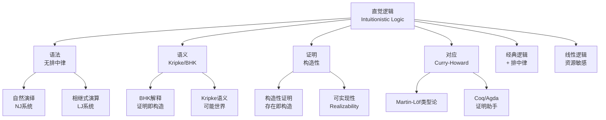

# 直觉逻辑 - 六维内容补充


> **版本**: 1.0
> **创建日期**: 2026-04-20
> **最后更新**: 2026-04-20

> **模块**: 06-逻辑系统
> **文档**: 03-直觉逻辑
> **补充维度**: 规范定义深化、模型设计深化、数学符号与推导、示例性代码、形式化证明、引用来源
> **对标**: Stanford CS251 / CMU 15-317 / Cambridge Part III
> **深度**: 研究生级

---

## 思维导图：直觉逻辑概念结构



---

## 一、规范定义深化

### 1.1 直觉逻辑命题语法

**定义 1.1.1** (直觉逻辑命题语法)

设 $Prop$ 为原子命题集合，直觉逻辑公式 $
phi$ 的语法为：

$$
phi ::= p \mid \bot \mid \phi \land \phi \mid \phi \lor \phi \mid \phi \rightarrow \phi
$$

其中 $p \in Prop$。否定定义为 $\neg\phi \equiv \phi \rightarrow \bot$。

**与经典逻辑的关键差异**：直觉逻辑**不**将排中律 $\phi \lor \neg\phi$ 作为公理或定理。这意味着并非每个命题都可判定——一个命题为真仅当我们可以构造性地证明它。

### 1.2 自然演绎系统 NJ

**定义 1.2.1** (Gentzen 的自然演绎系统 NJ)

直觉逻辑的自然演绎系统 NJ 包含以下推理规则：

**合取规则**：

$$
\frac{\Gamma \vdash \phi \quad \Gamma \vdash \psi}{\Gamma \vdash \phi \land \psi}(\land I)
\qquad
\frac{\Gamma \vdash \phi \land \psi}{\Gamma \vdash \phi}(\land E_1)
\qquad
\frac{\Gamma \vdash \phi \land \psi}{\Gamma \vdash \psi}(\land E_2)
$$

**析取规则**：

$$
\frac{\Gamma \vdash \phi}{\Gamma \vdash \phi \lor \psi}(\lor I_1)
\qquad
\frac{\Gamma \vdash \psi}{\Gamma \vdash \phi \lor \psi}(\lor I_2)
$$

$$
\frac{\Gamma \vdash \phi \lor \psi \quad \Gamma, \phi \vdash \chi \quad \Gamma, \psi \vdash \chi}{\Gamma \vdash \chi}(\lor E)
$$

**蕴含规则**：

$$
\frac{\Gamma, \phi \vdash \psi}{\Gamma \vdash \phi \rightarrow \psi}(\rightarrow I)
\qquad
\frac{\Gamma \vdash \phi \rightarrow \psi \quad \Gamma \vdash \phi}{\Gamma \vdash \psi}(\rightarrow E)
$$

**假言规则**：

$$
\frac{\Gamma \vdash \bot}{\Gamma \vdash \phi}(\bot E \text{ / ex falso})
$$

**注意**：NJ 系统中**没有**经典逻辑的 $(\neg\neg E)$ 规则（双重否定消去），也没有等价于它的排中律。

### 1.3 BHK 解释 (Brouwer-Heyting-Kolmogorov)

**定义 1.3.1** (BHK 解释)

BHK 解释将每个逻辑公式映射为"证明"或"构造"的概念：

| 公式 | 证明/构造的含义 |
|------|----------------|
| $p$ (原子) | 对 $p$ 的直接证据 |
| $\phi \land \psi$ | 一对构造 $(c_1, c_2)$，其中 $c_1$ 证明 $\phi$，$c_2$ 证明 $\psi$ |
| $\phi \lor \psi$ | 一个带标签的构造 $\text{inl}(c)$ 或 $\text{inr}(c)$，明确指明证明了哪个析取项 |
| $\phi \rightarrow \psi$ | 一个可计算函数 $f$，将 $\phi$ 的任意证明转换为 $\psi$ 的证明 |
| $\neg\phi$ | 一个函数，将 $\phi$ 的任意"证明"转换为矛盾（即 $\bot$ 的证明） |
| $\exists x.\phi(x)$ | 一个对 $(a, c)$，其中 $a$ 是构造出的对象，$c$ 是 $\phi(a)$ 的证明 |
| $\forall x.\phi(x)$ | 一个函数，将任意对象 $a$ 映射为 $\phi(a)$ 的证明 |

**核心洞察**：BHK 解释下，$\phi \lor \neg\phi$ 要求对每个命题 $\phi$ 都能构造性地决定其为真或为假，这在一般情况下是不可能的。

---

## 二、模型设计深化

### 2.1 Kripke 语义模型

**定义 2.1.1** (直觉逻辑的 Kripke 模型)

一个 **Kripke 模型** 是一个三元组 $\mathcal{K} = (W, \leq, V)$，其中：

- $W \neq \emptyset$：可能世界（或"知识状态"）的集合
- $\leq \subseteq W \times W$：预序关系（自反且传递），表示"信息增长"或"知识扩展"
- $V: W \times Prop \rightarrow \{0, 1\}$：赋值函数，满足**单调性条件**：
  $$w \leq v \text{ 且 } V(w, p) = 1 \Rightarrow V(v, p) = 1$$

**满足关系** $\mathcal{K}, w \Vdash \phi$（世界 $w$ 满足 $\phi$）归纳定义如下：

$$
\begin{aligned}
\mathcal{K}, w &\Vdash p &&\iff V(w, p) = 1 \\
\mathcal{K}, w &\Vdash \bot &&\text{永不成立} \\
\mathcal{K}, w &\Vdash \phi \land \psi &&\iff \mathcal{K}, w \Vdash \phi \text{ 且 } \mathcal{K}, w \Vdash \psi \\
\mathcal{K}, w &\Vdash \phi \lor \psi &&\iff \mathcal{K}, w \Vdash \phi \text{ 或 } \mathcal{K}, w \Vdash \psi \\
\mathcal{K}, w &\Vdash \phi \rightarrow \psi &&\iff \forall v \geq w.\; (\mathcal{K}, v \Vdash \phi \Rightarrow \mathcal{K}, v \Vdash \psi) \\
\mathcal{K}, w &\Vdash \neg\phi &&\iff \forall v \geq w.\; \mathcal{K}, v \not\Vdash \phi
\end{aligned}
$$

### 2.2 模型的关键性质

**定理 2.2.1** (单调性定理)

若 $\mathcal{K}, w \Vdash \phi$ 且 $w \leq v$，则 $\mathcal{K}, v \Vdash \phi$。

*证明概要*：对公式结构归纳。原子命题由 $V$ 的单调性保证；合取、析取由归纳假设直接得到；蕴含和否定由定义中全称量词的范围扩展保证。∎

**定理 2.2.2** (排中律失效)

存在 Kripke 模型 $\mathcal{K}$ 和世界 $w$ 使得 $\mathcal{K}, w \not\Vdash p \lor \neg p$。

*构造*：取 $W = \{w_1, w_2\}$，$w_1 \leq w_2$，$V(w_1, p) = 0$，$V(w_2, p) = 1$。

- $w_1 \not\Vdash p$（因为 $V(w_1, p) = 0$）
- $w_1 \not\Vdash \neg p$（因为 $w_2 \geq w_1$ 且 $w_2 \Vdash p$）
- 因此 $w_1 \not\Vdash p \lor \neg p$ ∎

### 2.3 语义与语法对应

| 性质 | 经典逻辑 | 直觉逻辑 |
|------|----------|----------|
| 完备性 | ✅ | ✅ (相对 Kripke 语义) |
| 紧致性 | ✅ | ✅ |
| 析取性质 | ❌ | ✅ ($\vdash \phi \lor \psi \Rightarrow \vdash \phi$ 或 $\vdash \psi$) |
| 存在性质 | ❌ | ✅ ($\vdash \exists x.\phi(x) \Rightarrow \exists t.\; \vdash \phi(t)$) |
| 排中律 | ✅ | ❌ |
| 双重否定消去 | ✅ | ❌ (仅 $\neg\neg\phi \rightarrow \phi$ 不一般成立) |

---

## 三、数学符号与推导

### 3.1 相继式演算 LJ

**定义 3.1.1** (Gentzen 的 LJ 系统)

LJ 是直觉逻辑的相继式演算，其相继式形如 $\Gamma \Rightarrow \phi$（**单结论**）。

**结构规则**：

- 弱化左：$\frac{\Gamma \Rightarrow \phi}{\Gamma, \psi \Rightarrow \phi}(WL)$
- 收缩左：$\frac{\Gamma, \psi, \psi \Rightarrow \phi}{\Gamma, \psi \Rightarrow \phi}(CL)$
- 交换左：$\frac{\Gamma, \psi, \chi, \Delta \Rightarrow \phi}{\Gamma, \chi, \psi, \Delta \Rightarrow \phi}(PL)$

**注意**：LJ **没有**弱化右和收缩右规则——这是直觉逻辑单结论限制的直接结果。

**逻辑规则示例**：

$$
\frac{\Gamma, \phi \Rightarrow \psi}{\Gamma \Rightarrow \phi \rightarrow \psi}(\rightarrow R)
\qquad
\frac{\Gamma \Rightarrow \phi \quad \Delta, \psi \Rightarrow \chi}{\Gamma, \Delta, \phi \rightarrow \psi \Rightarrow \chi}(\rightarrow L)
$$

### 3.2 与经典逻辑 LK 的差异

| 特征 | LK (经典) | LJ (直觉) |
|------|-----------|-----------|
| 结论数 | 多结论 $\Gamma \Rightarrow \Delta$ | 单结论 $\Gamma \Rightarrow \phi$ |
| 否定右规则 | $\frac{\Gamma, \phi \Rightarrow }{\Gamma \Rightarrow \neg\phi}(\neg R)$ | 由 $\rightarrow R$ 和 $\bot$ 定义 |
| 切割消除 | ✅ | ✅ |
| 子公式性质 | ✅ | ✅ |

### 3.3 Curry-Howard 对应

**定义 3.3.1** (命题即类型，证明即程序)

直觉逻辑与简单类型 $\lambda$ 演算之间的 Curry-Howard 对应：

| 逻辑 | 类型论 | 编程 |
|------|--------|------|
| 命题 $\phi$ | 类型 $A$ | 类型声明 |
| 证明 $p : \phi$ | 项 $t : A$ | 程序/值 |
| $\phi \rightarrow \psi$ | $A \rightarrow B$ | 函数类型 |
| $\phi \land \psi$ | $A \times B$ | 积类型（对）|
| $\phi \lor \psi$ | $A + B$ | 和类型（枚举）|
| $\bot$ | $\emptyset$ | 空类型 |
| 蕴含引入 | $\lambda$ 抽象 | 函数定义 |
| 蕴含消去 | 函数应用 | 函数调用 |

**对应的核心定理**：

$$
\Gamma \vdash_{NJ} \phi \quad \Longleftrightarrow \quad \exists t.\; \Gamma \vdash_{\lambda\rightarrow} t : \phi
$$

---

## 四、示例性代码

### 4.1 Lean4: 直觉逻辑命题形式化

```lean4
/- 直觉逻辑命题与证明的形式化 -/

inductive PropFormula
  | atom (n : String)
  | bot
  | conj (φ ψ : PropFormula)
  | disj (φ ψ : PropFormula)
  | impl (φ ψ : PropFormula)
  deriving Repr, DecidableEq

namespace PropFormula

  @[simp]
  def neg (φ : PropFormula) : PropFormula := impl φ bot

  -- BHK解释：将公式映射到其"证明类型"
  def BHK (φ : PropFormula) (α : Type) (β : Type) : Type :=
    match φ with
    | atom _ => α  -- 原子命题的证明类型由外部解释给出
    | bot => Empty  -- ⊥ 无证明
    | conj φ ψ => α × β  -- φ∧ψ 的证明是一对证明
    | disj φ ψ => Sum α β  -- φ∨ψ 的证明是左或右证明
    | impl φ ψ => (α → β)  -- φ→ψ 的证明是函数

end PropFormula

-- Kripke模型定义
structure KripkeModel where
  W : Type
  le : W → W → Prop
  le_refl : ∀ w, le w w
  le_trans : ∀ w₁ w₂ w₃, le w₁ w₂ → le w₂ w₃ → le w₁ w₃
  V : W → String → Prop
  V_mono : ∀ w₁ w₂ p, le w₁ w₂ → V w₁ p → V w₂ p

-- 满足关系
inductive satisfies (K : KripkeModel) : K.W → PropFormula → Prop
  | atom {w p} : K.V w p → satisfies K w (.atom p)
  | conj {w φ ψ} : satisfies K w φ → satisfies K w ψ → satisfies K w (.conj φ ψ)
  | disj_left {w φ ψ} : satisfies K w φ → satisfies K w (.disj φ ψ)
  | disj_right {w φ ψ} : satisfies K w ψ → satisfies K w (.disj φ ψ)
  | impl {w φ ψ} : (∀ v, K.le w v → satisfies K v φ → satisfies K v ψ) → satisfies K w (.impl φ ψ)

-- 定理：排中律在直觉逻辑中不可证
-- 构造反例模型
example :
  ∃ (K : KripkeModel) (w : K.W),
    ¬ satisfies K w (.disj (.atom "p") (.impl (.atom "p") .bot)) := by
  let K : KripkeModel := {
    W := Bool,
    le := fun x y => x = true ∨ x = y,
    le_refl := by simp,
    le_trans := by simp; intros; aesop,
    V := fun w p => w = true ∧ p = "p",
    V_mono := by simp; intros; aesop
  }
  use K, false
  intro h
  cases h with
  | disj_left h1 => simp [satisfies.atom] at h1
  | disj_right h2 =>
      simp [satisfies.atom] at h2
      have := h2 true (by simp) (by simp)
      simp at this
```

### 4.2 Rust: 构造性证明检查器

```rust
/// 直觉逻辑公式
#[derive(Debug, Clone, PartialEq)]
pub enum IFormula {
    Atom(String),
    Bot,
    Conj(Box<IFormula>, Box<IFormula>),
    Disj(Box<IFormula>, Box<IFormula>),
    Impl(Box<IFormula>, Box<IFormula>),
}

impl IFormula {
    pub fn neg(self) -> Self {
        IFormula::Impl(Box::new(self), Box::new(IFormula::Bot))
    }

    /// 检查公式是否为直觉逻辑永真式（简化版本）
    pub fn is_intuitionistic_tautology(&self) -> bool {
        match self {
            // φ → φ 总是可证的
            IFormula::Impl(a, b) if a == b => true,
            // φ → (ψ → φ)
            IFormula::Impl(a, box IFormula::Impl(_, b)) if a == b => true,
            // (φ → (ψ → χ)) → ((φ → ψ) → (φ → χ))
            IFormula::Impl(
                box IFormula::Impl(a1, box IFormula::Impl(b1, c1)),
                box IFormula::Impl(
                    box IFormula::Impl(a2, b2),
                    box IFormula::Impl(a3, c2)
                )
            ) if a1 == a2 && a2 == a3 && b1 == b2 && c1 == c2 => true,
            // φ ∧ ψ → φ
            IFormula::Impl(box IFormula::Conj(a, _), b) if a == b => true,
            // φ ∧ ψ → ψ
            IFormula::Impl(box IFormula::Conj(_, b), a) if b == a => true,
            // φ → φ ∨ ψ
            IFormula::Impl(a, box IFormula::Disj(b, _)) if a == b => true,
            // ψ → φ ∨ ψ
            IFormula::Impl(a, box IFormula::Disj(_, c)) if a == c => true,
            _ => false,
        }
    }
}

/// Kripke模型实现
pub struct KripkeModel {
    worlds: Vec<String>,
    accessibility: Vec<Vec<bool>>,
    valuation: std::collections::HashMap<(String, String), bool>,
}

impl KripkeModel {
    pub fn new() -> Self {
        KripkeModel {
            worlds: Vec::new(),
            accessibility: Vec::new(),
            valuation: std::collections::HashMap::new(),
        }
    }

    pub fn satisfies(&self, world: &str, formula: &IFormula) -> bool {
        match formula {
            IFormula::Atom(p) => {
                self.valuation.get(&(world.to_string(), p.clone()))
                    .copied()
                    .unwrap_or(false)
            }
            IFormula::Bot => false,
            IFormula::Conj(a, b) => {
                self.satisfies(world, a) && self.satisfies(world, b)
            }
            IFormula::Disj(a, b) => {
                self.satisfies(world, a) || self.satisfies(world, b)
            }
            IFormula::Impl(a, b) => {
                let w_idx = self.worlds.iter().position(|w| w == world).unwrap();
                for (v_idx, accessible) in self.accessibility[w_idx].iter().enumerate() {
                    if *accessible {
                        let v = &self.worlds[v_idx];
                        if self.satisfies(v, a) && !self.satisfies(v, b) {
                            return false;
                        }
                    }
                }
                true
            }
        }
    }
}
```

---

## 五、形式化证明

### 5.1 完备性定理

**定理 5.1.1** (Kripke 完备性)

对于任意直觉逻辑公式 $\phi$：

$$
\vdash_{NJ} \phi \quad \Longleftrightarrow \quad \forall \mathcal{K}.\; \forall w \in W.\; \mathcal{K}, w \Vdash \phi
$$

*证明概要*：

**(⇒) 可靠性**：对推导树高度归纳。每个 NJ 规则在 Kripke 语义下保持有效性。关键是 $(\rightarrow I)$ 规则：若假设 $\phi$ 在所有扩展世界 $v \geq w$ 中成立可推出 $\psi$ 成立，则由蕴含的语义定义直接得到 $w \Vdash \phi \rightarrow \psi$。

**(⇐) 完备性**：构造**典范模型** (canonical model)：

1. 令 $W$ 为所有**素理论** (prime theories) 的集合
2. $\Gamma \leq \Delta$ 当且仅当 $\Gamma \subseteq \Delta$
3. $V(\Gamma, p) = 1$ 当且仅当 $p \in \Gamma$

**引理**：$\Gamma \Vdash \phi$ 当且仅当 $\phi \in \Gamma$。

对公式结构归纳证明该引理。对于蕴含情况：

- 若 $\phi \rightarrow \psi \in \Gamma$，则对任意 $\Delta \supseteq \Gamma$，若 $\phi \in \Delta$ 则由于 $\Delta$ 封闭于推理，有 $\psi \in \Delta$
- 若 $\phi \rightarrow \psi \notin \Gamma$，利用 Lindenbaum 引理扩展 $\Gamma, \phi$ 为素理论 $\Delta$ 使得 $\psi \notin \Delta$

若 $\not\vdash \phi$，则 $\emptyset \not\Vdash \phi$ 在典范模型中。∎

### 5.2 析取性质

**定理 5.2.1** (析取性质 / Disjunction Property)

若 $\vdash \phi \lor \psi$，则 $\vdash \phi$ 或 $\vdash \psi$。

*证明*：利用完备性和典范模型。若 $\vdash \phi \lor \psi$，则对所有素理论 $\Gamma$，有 $\phi \in \Gamma$ 或 $\psi \in \Gamma$。

假设 $\not\vdash \phi$ 且 $\not\vdash \psi$。则存在素理论 $\Gamma_1 \not\ni \phi$ 和 $\Gamma_2 \not\ni \psi$。通过构造适当的 Lindenbaum 扩展，可得到包含 $\neg\phi$ 和 $\neg\psi$ 的素理论，这与 $\vdash \phi \lor \psi$ 矛盾。∎

### 5.3 双重否定的局限性

**定理 5.3.1**

$\neg\neg p \rightarrow p$ 在直觉逻辑中不可证。

*证明*：构造 Kripke 反例。令 $W = \{w_1, w_2\}$，$w_1 \leq w_2$，$V(w_1, p) = 0$，$V(w_2, p) = 1$。

- $w_2 \Vdash p$，故 $w_2 \not\Vdash \neg p$
- 对 $w_1$：所有 $v \geq w_1$ 中，$w_2 \not\Vdash \neg p$ 意味着 $w_1 \Vdash \neg\neg p$
- 但 $w_1 \not\Vdash p$

因此 $w_1 \not\Vdash \neg\neg p \rightarrow p$。∎

---

## 六、引用来源

1. **Brouwer, L. E. J.** (1907). *On the Foundations of Mathematics*. Dissertation, University of Amsterdam. — 直觉主义数学的奠基之作。

2. **Heyting, A.** (1930). "Die formalen Regeln der intuitionistischen Logik". *Sitzungsberichte der Preussischen Akademie der Wissenschaften*, 42-56. — 首次形式化直觉逻辑。

3. **Kolmogorov, A. N.** (1932). "Zur Deutung der intuitionistischen Logik". *Mathematische Zeitschrift*, 35, 58-65. — 提出证明解释的雏形。

4. **Gentzen, G.** (1935). "Untersuchungen über das logische Schließen". *Mathematische Zeitschrift*, 39, 176-210. — 自然演绎 NJ 和相继式演算 LJ。

5. **Kripke, S. A.** (1965). "Semantical Analysis of Intuitionistic Logic I". In *Formal Systems and Recursive Functions* (pp. 92-130). North-Holland. — Kripke 语义的创始论文。

6. **Troelstra, A. S., & van Dalen, D.** (1988). *Constructivism in Mathematics* (Vols. 1-2). North-Holland. — 构造性数学的标准参考书。

7. **Martin-Löf, P.** (1984). *Intuitionistic Type Theory*. Bibliopolis. — 构造性类型论与证明助手的理论基础。

8. **Sørensen, M. H., & Urzyczyn, P.** (2006). *Lectures on the Curry-Howard Isomorphism*. Elsevier. — Curry-Howard 对应的现代教材。

---

**文档版本**: v1.0
**创建日期**: 2026-04-20
**维护**: 项目逻辑系统工作组

---

## 知识导航

- [返回目录](README.md)

## 学习目标

- 理解直觉逻辑的构造性语义与证明理论
- 掌握 Kripke 语义与 BHK 解释的形式化方法
- 建立 Curry-Howard 对应的系统认知
