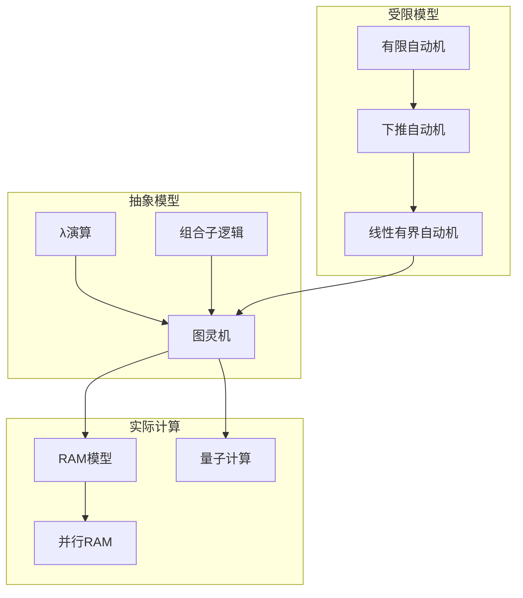
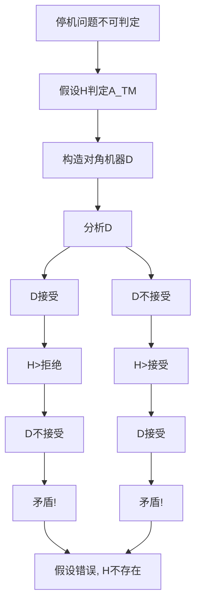

# 图灵机 - 六维内容补充


> **版本**: 1.0
> **创建日期**: 2026-04-19
> **最后更新**: 2026-04-19

> **模块**: 07-计算模型
> **文档**: 01-图灵机
> **补充维度**: 概念定义、属性、关系、解释、论证、形式证明
> **对标**: MIT 18.404 / CMU 15-251 / UCSD CSE 105
> **深度**: 研究生级

---

## 思维导图：图灵机概念结构

```mermaid
graph TD
    TM[图灵机<br/>Turing Machine] --> DEF[定义]
    TM --> VAR[变体]
    TM --> POW[能力]

    DEF --> TAPE[无限磁带]
    DEF --> HEAD[读写头]
    DEF --> STATE[有限状态]
    DEF --> TRANS[转移函数]

    VAR --> DTM[确定型<br/>DTM]
    VAR --> NTM[非确定型<br/>NTM]
    VAR >> UTM[通用<br/>UTM]
    VAR >> MTM[多带<br/>Multi-tape]

    POW --> DEC[可判定性<br/>Decidability]
    POW --> REC[可计算性<br/>Computability]
    POW --> CH[丘奇-图灵论题<br/>Church-Turing]

    TM --> HALT[停机问题<br/>Halting Problem]
    HALT --> UNDEC[不可判定<br/>Undecidable]
    HALT >> RE[递归可枚举<br/>RE]

    TM --> RED[归约<br/>Reduction]
    RED --> MAPPING[映射归约<br/>≤m]
    RED >> TURING[Turing归约<br/>≤T]
```

---

## 一、概念定义 (Concept Definition)

### 1.1 图灵机 / Turing Machine

**定义 1.1.1** (形式化)

**确定型图灵机** (Deterministic Turing Machine, DTM) 是一个七元组：

$$
M = (Q, \Sigma, \Gamma, \delta, q_0, q_{accept}, q_{reject})
$$

其中：

- $Q$: 有限状态集
- $\Sigma$: 输入字母表（不含空白符 $\sqcup$）
- $\Gamma$: 磁带字母表，$\Sigma \subset \Gamma$，$\sqcup \in \Gamma$
- $\delta: Q \times \Gamma \rightarrow Q \times \Gamma \times \{L, R\}$: 转移函数
- $q_0 \in Q$: 初始状态
- $q_{accept} \in Q$: 接受状态
- $q_{reject} \in Q$: 拒绝状态，$q_{reject} \neq q_{accept}$

**瞬时描述** (Configuration): $(q, w, i)$ 表示状态 $q$，磁带内容 $w$，读写头位置 $i$。

**自然语言定义**

图灵机是一种抽象的计算模型，由一个有限状态控制器、一个无限长的磁带和一个读写头组成。它能够模拟任何算法的计算过程，是计算理论的基础模型。丘奇-图灵论题断言：任何"可有效计算"的函数都可被图灵机计算。

---

### 1.2 可判定性 / Decidability

**定义 1.2.1** (形式化)

语言 $L$ 是**可判定的** (Decidable/Recursive)，如果存在图灵机 $M$：

$$
\forall w \in \Sigma^*:
\begin{cases}
w \in L \Rightarrow M(w) \text{ 接受} \\
w \notin L \Rightarrow M(w) \text{ 拒绝}
\end{cases}
$$

且 $M$ 在所有输入上都停机。

**递归可枚举** (Recursively Enumerable, RE):

语言 $L$ 是RE的，如果存在图灵机 $M$：

$$
w \in L \iff M(w) \text{ 接受}
$$

（对于 $w \notin L$，$M$ 可能拒绝或永不停机）

**co-RE**: $L$ 是co-RE的，如果 $\bar{L}$ 是RE的。

---

### 1.3 停机问题 / Halting Problem

**定义 1.3.1** (形式化)

$$A_{TM} = \{\langle M, w \rangle \mid M \text{ 是TM}, w \in L(M)\}$$

**定理**: $A_{TM}$ 是RE但不可判定的。

**停机问题**:

$$H_{TM} = \{\langle M, w \rangle \mid M \text{ 在输入 } w \text{ 上停机}\}$$

**定理**: $H_{TM}$ 不可判定。

---

## 二、属性 (Properties)

### 2.1 图灵机变体对比

| 变体 | 定义特征 | 计算能力 | 与DTM关系 |
|------|----------|----------|-----------|
| **DTM** | 单带，确定型转移 | 基准模型 | = |
| **NTM** | 多选择转移 | 等价于DTM | NTIME(t) ⊆ DSPACE(t) |
| **多带TM** | $k$ 条磁带 | 等价于DTM | 时间多项式相关 |
| **UTM** | 可模拟任意TM | 通用计算 | 存在性定理 |
| **概率TM** | 随机转移 | 等价于DTM | BPP类 |
| **量子TM** | 量子叠加态 | 可能更强 | BQP类 |

### 2.2a 多带图灵机变体（形式化补充）

**定义 2.2a.1** ($k$-带图灵机)

$k$-带图灵机是一个七元组 $M = (Q, \Sigma, \Gamma, \delta, q_0, q_{accept}, q_{reject})$，其中转移函数：
$$\delta: Q \times \Gamma^k \to Q \times \Gamma^k \times \{L, R, S\}^k$$

$S$ 表示"静止"（Stay）。初始时，输入放在第 1 带上，其余带为空。

**定理 2.2a.1** (多带 → 单带模拟)

任何可被 $k$-带图灵机在时间 $T(n)$ 内判定的语言，均可被单带图灵机在时间 $O(T(n)^2)$ 内判定 [Sipser2013, §3.2]。

**证明概要**：
单带 TM 将 $k$ 条带的内容按"轨道"（track）方式编码到一条带上，每条轨道存储一条带的内容，并用特殊标记记录 $k$ 个读写头的位置。模拟 $k$-带 TM 的一步需要：扫描整条带以读取所有 $k$ 个头下的符号（$O(T(n))$），然后再次扫描以写入和移动标记（$O(T(n))$）。总时间为 $O(T(n) \cdot T(n)) = O(T(n)^2)$。 ∎

### 2.2b 概率图灵机 (Probabilistic TM)

**定义 2.2b.1** (概率图灵机 / PTM)

PTM 是一种非确定性图灵机，其转移函数 $\delta$ 的每个选择都附带一个概率值，且从同一配置出发的所有选择概率之和为 1。对于输入 $x$：

- 若 PTM 以概率 $\geq 2/3$ 接受 $x$，则称 $x$ 被**接受**
- 若 PTM 以概率 $\leq 1/3$ 接受 $x$，则称 $x$ 被**拒绝**

**复杂度类 BPP**：
$$\text{BPP} = \{L : \exists \text{ PTM } M, \forall x, \Pr[M(x) = L(x)] \geq 2/3\}$$

**定理 2.2b.1**

$\text{P} \subseteq \text{BPP} \subseteq \text{EXP}$。目前普遍认为 $\text{P} = \text{BPP}$，但尚未证明 [Sipser2013, §10.2]。

### 2.2c 交互式证明系统与图灵机

**定义 2.2c.1** (IP 类)

交互式证明系统由一个概率图灵机验证者 $V$ 和一个全知证明者 $P$ 通过多轮交互组成。$\text{IP}$ 类包含所有可被此类交互式协议以有界错误概率判定的语言。

**定理 2.2c.1** (Shamir 1990)
$$\text{IP} = \text{PSPACE}$$

> 这标志着概率/交互式扩展的图灵机模型可以刻画 PSPACE，远超确定性 TM 的能力。

### 2.2 复杂度类关系

| 复杂度类 | 定义 | 包含关系 |
|----------|------|----------|
| **L** | DSPACE($\log n$) | ⊆ NL ⊆ P |
| **P** | DTIME($n^{O(1)}$) | ⊆ NP ⊆ PSPACE |
| **NP** | NTIME($n^{O(1)}$) | ⊆ PSPACE |
| **PSPACE** | DSPACE($n^{O(1)}$) | ⊆ EXP |
| **EXP** | DTIME($2^{n^{O(1)}}$) | ⊆ NEXP |
| **R** (递归) | 可判定语言 | = RE ∩ co-RE |
| **RE** | 递归可枚举 | ⊃ R |

### 2.3 可判定性问题示例

| 问题 | 可判定性 | 复杂度 |
|------|----------|--------|
| DFA接受性 | ✅ 可判定 | P完全 |
| NFA接受性 | ✅ 可判定 | PSPACE完全 |
| CFL成员资格 | ✅ 可判定 | P |
| CFL空性 | ✅ 可判定 | P |
| TM接受性 | ❌ 不可判定 | RE完全 |
| TM空性 | ❌ 不可判定 | RE难 |
| 停机问题 | ❌ 不可判定 | RE完全 |
| Post对应问题 | ❌ 不可判定 | RE完全 |

---

## 三、关系 (Relations)

### 3.1 概念关系表

| 源概念 | 目标概念 | 关系类型 | 说明 |
|--------|----------|----------|------|
| 图灵机 | λ演算 | equivalent_to | 丘奇-图灵论题 |
| DTM | NTM | simulates | DTM可模拟NTM |
| 多带TM | 单带TM | simulates | 多项式时间模拟 |
| 可判定性 | 递归语言 | equivalent_to | R = Decidable |
| RE | 半可判定 | equivalent_to | 接受但可能不停机 |
| 停机问题 | 不可判定问题 | reduces_to | 所有不可判定问题可归约 |
| 图灵机 | 现代计算机 | models | 理论模型 vs 实际实现 |

### 3.2 计算模型层次



---

## 四、解释 (Explanation)

### 4.1 动机与直观

**为什么需要图灵机？**

1936年，Alan Turing需要回答希尔伯特的"Entscheidungsproblem"（判定问题）：是否存在一个算法可以判定任意数学命题的真假？

为了回答这个问题，Turing需要一个**精确的形式化**的"算法"概念：

- 不能太抽象（无法分析）
- 不能太具体（受限于实现）
- 必须足够强大（能表达所有计算）

**图灵机的核心洞察**:

1. **局部性**: 计算只需要查看和修改当前单元格
2. **离散性**: 状态、符号都是有限的
3. **无限性**: 磁带无限，但任何时刻只有有限部分被使用

### 4.2 与已有概念的联系

**图灵机 ↔ 现代计算机**

| 图灵机 | 现代计算机 |
|--------|-----------|
| 有限状态 | CPU寄存器 |
| 磁带 | 内存/存储 |
| 读写头 | 内存地址寄存器 |
| 转移函数 | 机器指令 |
| 无限磁带 | 虚拟内存 + 存储层次 |

**丘奇-图灵论题**:

> 任何可有效计算的函数都可被图灵机计算。

这是一个**论题**（经验性假设），而非定理。它之所以被广泛接受，是因为：

1. 所有提出的其他计算模型都被证明等价于图灵机
2. 没有反例被发现
3. 它符合我们对"计算"的直观理解

### 4.3 示例与反例

**示例 4.3.1**: 识别 $0^n1^n$ 的图灵机

```
状态: q0 (扫描0), q1 (扫描1), q_accept, q_reject

算法:
1. 在q0状态，读到0则改为X，右移到第一个1
2. 读到1则改为Y，左移回最左
3. 重复直到所有0和1被匹配
4. 如果0和1数量相等则接受
```

**反例 4.3.2**: 为什么停机问题不可判定？

**对角线论证**:

假设 $H$ 判定停机问题。构造机器 $D$：

```
D(w):
    如果 H(<D>, w) 接受（即D在w上停机）
        则进入无限循环
    否则
        停机并接受
```

问：$D(\langle D \rangle)$ 是否停机？

- 如果停机，则 $H$ 会说停机，$D$ 会无限循环
- 如果不停机，则 $H$ 会说不停机，$D$ 会停机

矛盾！因此 $H$ 不存在。

---

## 五、论证 (Argumentation)

### 5.1 非形式论证：为什么多带图灵机等价于单带？

**模拟策略**:

单带TM可以用**轨道**（track）技术模拟 $k$ 带TM：

```
单带布局: [带1符号, 带2符号, ..., 带k符号, 头位置标记]
```

**复杂度分析**:

- 空间: 多带使用 $k \cdot S$ 空间 $\Rightarrow$ 单带 $O(k \cdot S) = O(S)$
- 时间: 多带 $T$ 步 $\Rightarrow$ 单带 $O(T^2)$（需要来回扫描）

**结论**: 两者在多项式时间相关，计算能力等价。

### 5.2 反例与边界

**边界情况 5.2.1**: 无限循环 vs 永不停机

```
M(w):
    如果 w = "halt"
        则停机
    否则
        无限循环
```

这个机器在某些输入上停机，在某些上不停机。它的语言是 $L(M) = \{halt\}$，是RE的。

---

## 六、形式证明 (Formal Proof)

### 6.1 停机问题不可判定性

**定理 6.1.1**: $A_{TM} = \{\langle M, w \rangle \mid M(w) \text{ 接受}\}$ 不可判定。

**证明** (对角线法):

**假设**存在判定 $A_{TM}$ 的图灵机 $H$：

$$
H(\langle M, w \rangle) = \begin{cases}
accept & \text{if } M(w) \text{ 接受} \\
reject & \text{if } M(w) \text{ 拒绝或不停机}
\end{cases}
$$

**构造**机器 $D$：

```
D(w):
    在输入w上:
    1. 模拟 H(<w>, w)  // 将输入解释为TM描述
    2. 如果 H 接受, 则拒绝
       如果 H 拒绝, 则接受
```

**分析** $D(\langle D \rangle)$:

$$
\begin{aligned}
D(\langle D \rangle) \text{ 接受} &\iff H(\langle D, \langle D \rangle \rangle) \text{ 拒绝} \\
&\iff D(\langle D \rangle) \text{ 不接受}
\end{aligned}
$$

矛盾！因此假设错误，$H$ 不存在。

### 6.2 Rice定理

**定理 6.2.1** (Rice定理): 任何关于程序行为的非平凡性质都是不可判定的。

**形式化**: 设 $P$ 是任意关于RE语言的非平凡性质（即 $\exists L_1 \in P, L_2 \notin P$），则 $P$ 不可判定。

**证明概要**:

通过归约 $A_{TM} \leq_m P$ 证明。

对于任意 $\langle M, w \rangle$，构造机器 $M'$：

```
M'(x):
    模拟 M(w)
    如果 M(w) 接受, 则模拟 M1(x)  // M1是P中某语言的识别器
    否则拒绝
```

则 $\langle M, w \rangle \in A_{TM} \iff L(M') \in P$。

### 6.3 证明决策树



---

## 七、多语言实现：图灵机模拟器

### 7.1 Python: 图灵机模拟器

```python
"""
图灵机模拟器实现
"""

from typing import Dict, Tuple, Set, Optional
from dataclasses import dataclass
from enum import Enum

class Direction(Enum):
    LEFT = -1
    RIGHT = 1

@dataclass(frozen=True)
class Transition:
    """转移函数项"""
    write: str
    move: Direction
    next_state: str

class TuringMachine:
    """确定型图灵机"""

    def __init__(self,
                 states: Set[str],
                 input_alphabet: Set[str],
                 tape_alphabet: Set[str],
                 transitions: Dict[Tuple[str, str], Transition],
                 initial_state: str,
                 accept_state: str,
                 reject_state: str,
                 blank: str = '_'):

        self.states = states
        self.input_alphabet = input_alphabet
        self.tape_alphabet = tape_alphabet
        self.transitions = transitions
        self.initial_state = initial_state
        self.accept_state = accept_state
        self.reject_state = reject_state
        self.blank = blank

        # 验证
        assert blank in tape_alphabet
        assert input_alphabet.issubset(tape_alphabet)
        assert accept_state in states
        assert reject_state in states

    def run(self, input_string: str, max_steps: int = 10000) -> Tuple[bool, str, int]:
        """
        运行图灵机

        返回: (是否接受, 最终磁带内容, 执行步数)
        """
        # 初始化磁带
        tape = list(input_string) if input_string else [self.blank]
        head = 0
        state = self.initial_state
        steps = 0

        while steps < max_steps:
            # 检查是否接受或拒绝
            if state == self.accept_state:
                return True, ''.join(tape).strip(self.blank), steps
            if state == self.reject_state:
                return False, ''.join(tape).strip(self.blank), steps

            # 读取当前符号
            if head < 0:
                tape.insert(0, self.blank)
                head = 0
            elif head >= len(tape):
                tape.append(self.blank)

            symbol = tape[head]

            # 查找转移
            key = (state, symbol)
            if key not in self.transitions:
                # 无转移 = 拒绝
                return False, ''.join(tape).strip(self.blank), steps

            trans = self.transitions[key]

            # 执行转移
            tape[head] = trans.write
            head += trans.move.value
            state = trans.next_state
            steps += 1

        # 超过最大步数
        return False, ''.join(tape).strip(self.blank), steps

    def trace(self, input_string: str, max_steps: int = 100):
        """追踪执行过程"""
        tape = list(input_string) if input_string else [self.blank]
        head = 0
        state = self.initial_state

        print(f"Initial: {''.join(tape)}")
        print(f"State: {state}")

        for step in range(max_steps):
            if state in (self.accept_state, self.reject_state):
                break

            if head < 0:
                tape.insert(0, self.blank)
                head = 0
            elif head >= len(tape):
                tape.append(self.blank)

            symbol = tape[head]
            key = (state, symbol)

            if key not in self.transitions:
                print(f"Step {step}: No transition for ({state}, {symbol})")
                break

            trans = self.transitions[key]

            print(f"Step {step}: ({state}, {symbol}) -> "
                  f"({trans.next_state}, {trans.write}, "
                  f"{'R' if trans.move == Direction.RIGHT else 'L'})")

            tape[head] = trans.write
            head += trans.move.value
            state = trans.next_state

            # 显示磁带和头位置
            tape_str = ''.join(tape)
            head_indicator = ' ' * head + '^'
            print(f"  Tape: {tape_str}")
            print(f"        {head_indicator}")
            print(f"  State: {state}")

        return state == self.accept_state


# 示例: 识别 0^n1^n 的图灵机
def create_0n1n_tm():
    """创建识别 {0^n1^n | n >= 0} 的图灵机"""

    states = {'q0', 'q1', 'q2', 'q3', 'q4', 'q_accept', 'q_reject'}
    input_alphabet = {'0', '1'}
    tape_alphabet = {'0', '1', 'X', 'Y', '_'}

    transitions = {
        # 阶段1: 将0标记为X，寻找对应的1
        ('q0', '0'): Transition('X', Direction.RIGHT, 'q1'),
        ('q0', 'Y'): Transition('Y', Direction.RIGHT, 'q3'),
        ('q0', '_'): Transition('_', Direction.RIGHT, 'q_accept'),

        # 阶段2: 右移过0和Y，找到第一个1
        ('q1', '0'): Transition('0', Direction.RIGHT, 'q1'),
        ('q1', 'Y'): Transition('Y', Direction.RIGHT, 'q1'),
        ('q1', '1'): Transition('Y', Direction.LEFT, 'q2'),

        # 阶段3: 左移回最左边的0或X
        ('q2', '0'): Transition('0', Direction.LEFT, 'q2'),
        ('q2', 'Y'): Transition('Y', Direction.LEFT, 'q2'),
        ('q2', 'X'): Transition('X', Direction.RIGHT, 'q0'),

        # 阶段4: 验证所有1都被标记
        ('q3', 'Y'): Transition('Y', Direction.RIGHT, 'q3'),
        ('q3', '_'): Transition('_', Direction.RIGHT, 'q_accept'),
    }

    return TuringMachine(
        states=states,
        input_alphabet=input_alphabet,
        tape_alphabet=tape_alphabet,
        transitions=transitions,
        initial_state='q0',
        accept_state='q_accept',
        reject_state='q_reject',
        blank='_'
    )


if __name__ == "__main__":
    tm = create_0n1n_tm()

    # 测试
    test_cases = ["0011", "000111", "01", "", "001", "1100"]

    for tc in test_cases:
        accepted, final_tape, steps = tm.run(tc)
        print(f"Input: '{tc}' -> {'Accept' if accepted else 'Reject'} "
              f"(steps: {steps}, tape: '{final_tape}')")
```

---

## 八、丘奇-图灵论题速查

### 8.1 计算模型等价性

| 模型 | 提出者 | 年份 | 与TM关系 |
|------|--------|------|----------|
| λ演算 | Church | 1936 | 等价 |
| 图灵机 | Turing | 1936 | 基准 |
| 递归函数 | Gödel, Kleene | 1936 | 等价 |
| 组合子逻辑 | Schönfinkel, Curry | 1924-30 | 等价 |
| 无限寄存器机 | Shepherdson, Sturgis | 1963 | 等价 |
| 随机存取机 | 传统 | - | 多项式等价 |

### 8.2 不可判定问题列表

| 问题 | 描述 | 证明方法 |
|------|------|----------|
| 停机问题 | TM是否在给定输入上停机 | 对角线法 |
| 空性问题 | $L(M) = \emptyset$? | Rice定理 |
| 等价性问题 | $L(M_1) = L(M_2)$? | Rice定理 |
| 成员资格问题 | $w \in L(M)$? | 归约自停机问题 |
| Post对应问题 | 给定多米诺骨牌是否有匹配 | 归约 |
| 希尔伯特第10问题 | 丢番图方程可解性 | 深归约 |

---

**文档版本**: v1.0
**创建日期**: 2026-04-10
**维护**: 项目计算模型工作组

---

## 参考文献

- [Turing1936]

---

## 知识导航

- [返回目录](README.md)

## 学习目标

- 理解图灵机 - 六维内容补充的核心概念
- 掌握图灵机 - 六维内容补充的形式化表示
