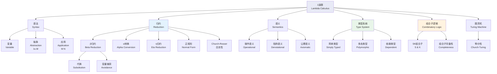
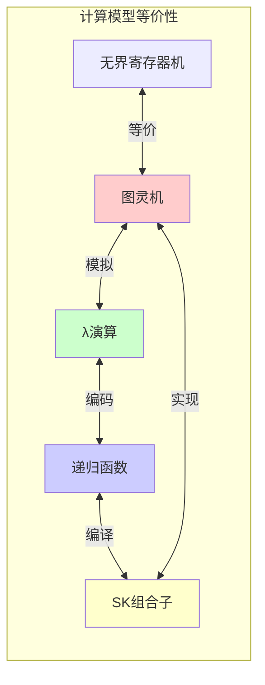
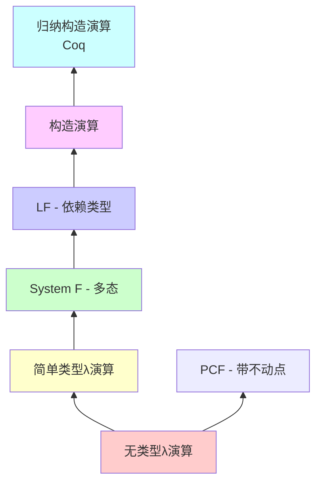
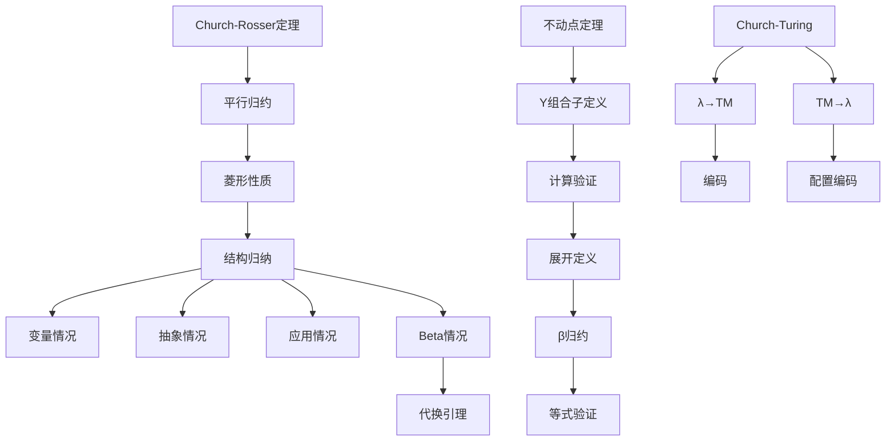

# λ演算 - 六维内容补充


> **版本**: 1.0
> **创建日期**: 2026-04-19
> **最后更新**: 2026-04-19

> **模块**: 07-计算模型
> **文档**: 03-λ演算
> **补充维度**: 概念定义、属性、关系、解释、论证、形式证明
> **对标**: MIT 6.042J / CMU 15-312 / Stanford CS 242
> **深度**: 研究生级

---

## 思维导图：λ演算概念结构



---

## 一、概念定义 (Concept Definition)

### 1.1 λ项 (Lambda Terms)

**定义 1.1.1** (形式化语法)

**λ项**的抽象语法递归定义如下：

$$
M, N, P ::= x \mid \lambda x.M \mid (M\ N)
$$

其中：

| 构造 | 名称 | 含义 | 优先级 |
|------|------|------|--------|
| $x$ | 变量 | 来自可数无穷变量集 | 原子 |
| $\lambda x.M$ | 抽象 | 函数定义 | 最低 |
| $M\ N$ | 应用 | 函数调用 | 左结合 |

**括号省略约定**:

1. **应用左结合**: $M\ N\ P \equiv ((M\ N)\ P)$
2. **抽象右延伸**: $\lambda x.M\ N \equiv \lambda x.(M\ N)$
3. **多重抽象**: $\lambda xy.M \equiv \lambda x.\lambda y.M$

**示例**:

- $\lambda x.x$ (恒等函数，记作 $I$)
- $\lambda x.\lambda y.x$ (常函数，记作 $K$)
- $\lambda f.\lambda x.(f\ x)$ (应用函数)

---

### 1.2 自由变量与约束变量

**定义 1.2.1** (自由变量 $FV$)

自由变量的集合递归定义：

$$
\begin{aligned}
FV(x) &= \{x\} \\
FV(\lambda x.M) &= FV(M) \setminus \{x\} \\
FV(M\ N) &= FV(M) \cup FV(N)
\end{aligned}
$$

**定义 1.2.2** (约束变量)

在 $\lambda x.M$ 中，$M$ 中所有 $x$ 的出现都是**约束的**（被 $\lambda x$ 约束）。

**定义 1.2.3** (封闭项 / 组合子)

若 $FV(M) = \emptyset$，则 $M$ 称为**封闭项**或**组合子**。

---

### 1.3 β归约 (Beta Reduction)

**定义 1.3.1** (β归约)

**β归约**是最核心的计算规则：

$$
(\lambda x.M)\ N \rightarrow_\beta M[N/x]
$$

其中 $M[N/x]$ 表示将 $M$ 中所有 $x$ 的自由出现替换为 $N$。

**定义 1.3.2** (代换 - 形式化)

代换 $M[N/x]$ 递归定义：

$$
\begin{aligned}
x[N/x] &= N \\
y[N/x] &= y \quad (y \neq x) \\
(M_1\ M_2)[N/x] &= (M_1[N/x])\ (M_2[N/x]) \\
(\lambda y.M)[N/x] &= \lambda y.(M[N/x]) \quad (y \neq x, y \notin FV(N)) \\
\end{aligned}
$$

**变量捕获问题**: 若 $y \in FV(N)$，需先进行α转换避免捕获。

---

### 1.4 α等价 (Alpha Equivalence)

**定义 1.4.1** (α转换)

**α转换**允许重命名约束变量：

$$
\lambda x.M \equiv_\alpha \lambda y.(M[y/x]) \quad \text{若 } y \notin FV(M)
$$

**α等价的性质**:

1. **自反性**: $M \equiv_\alpha M$
2. **对称性**: $M \equiv_\alpha N \Rightarrow N \equiv_\alpha M$
3. **传递性**: $M \equiv_\alpha N, N \equiv_\alpha P \Rightarrow M \equiv_\alpha P$
4. **同余性**:
   - $M \equiv_\alpha M', N \equiv_\alpha N' \Rightarrow M\ N \equiv_\alpha M'\ N'$
   - $M \equiv_\alpha N \Rightarrow \lambda x.M \equiv_\alpha \lambda x.N$

---

### 1.5 正规形 (Normal Forms)

**定义 1.5.1** (β正规形)

λ项 $M$ 是**β正规形**（记作 $M \downarrow$），如果它不包含任何β可约式：

$$M \text{ 是正规形 } \Leftrightarrow \neg\exists N: M \rightarrow_\beta N$$

**定义 1.5.2** (β可约式 / Redex)

**β可约式**是形如 $(\lambda x.M)\ N$ 的子项。

**定义 1.5.3** (正规化)

- $M$ **有正规形**: $\exists N$ 使得 $M \twoheadrightarrow_\beta N$ 且 $N$ 是正规形
- $M$ **强正规化**: 所有归约序列都终止于正规形
- $M$ **弱正规化**: 至少存在一个归约序列终止于正规形

---

### 1.6 η归约 (Eta Reduction)

**定义 1.6.1** (η归约)

**η归约**表示函数的外延性：

$$
\lambda x.(M\ x) \rightarrow_\eta M \quad \text{若 } x \notin FV(M)
$$

**直观**: 若函数 $f$ 满足 $f(x) = M(x)$ 对所有 $x$ 成立，则 $f = M$。

---

## 二、属性 (Properties)

### 2.1 归约系统属性对比

| 属性 | β归约 | η归约 | β+η |
|------|-------|-------|-----|
| **合流性** | ✅ Church-Rosser | ✅ | ✅ |
| **终止性** | ❌ 一般否 | ✅ | ❌ |
| **正规形唯一性** | ✅ (模α) | ✅ | ✅ (模α) |
| **完备性** | 图灵完备 | 否 | 图灵完备 |

### 2.2 归约策略对比

| 策略 | 选择规则 | 终止性 | 效率 | 实现 |
|------|----------|--------|------|------|
| **正规序** | 最左最外 | 最优 | 慢 | 解释器 |
| **应用序** | 最左最内 | 次优 | 快 | 大多数语言 |
| **惰性求值** | 最外+记忆化 | 最优 | 中等 | Haskell |
| **并行归约** | 所有外层的Redex | - | - | 理论 |

**关键定理**: 若 $M$ 有正规形，则**正规序归约**必定能找到它（**正规化定理**）。

### 2.3 Church数与可定义性

| 数 | λ表示 | 后继 |
|----|-------|------|
| $0$ | $\lambda f.\lambda x.x$ | $S\ 0$ |
| $1$ | $\lambda f.\lambda x.f\ x$ | $S\ 1$ |
| $2$ | $\lambda f.\lambda x.f\ (f\ x)$ | $S\ 2$ |
| $n$ | $\lambda f.\lambda x.f^n\ x$ | $\lambda n.\lambda f.\lambda x.f\ (n\ f\ x)$ |

**算术运算定义**:

$$
\begin{aligned}
S &= \lambda n.\lambda f.\lambda x.f\ (n\ f\ x) \quad \text{[后继]} \\
+ &= \lambda m.\lambda n.\lambda f.\lambda x.m\ f\ (n\ f\ x) \quad \text{[加法]} \\
\times &= \lambda m.\lambda n.\lambda f.m\ (n\ f) \quad \text{[乘法]} \\
^ & = \lambda m.\lambda n.n\ m \quad \text{[幂运算]}
\end{aligned}
$$

---

## 三、关系 (Relations)

### 3.1 概念关系表

| 源概念 | 目标概念 | 关系类型 | 说明 |
|--------|----------|----------|------|
| λ演算 | 图灵机 | equivalent_to | Church-Turing论题 |
| λ演算 | 组合子逻辑 | implements | SK组合子实现λ抽象 |
| β归约 | α转换 | depends_on | 代换前需避免变量捕获 |
| 正规序 | 惰性求值 | specializes | 惰性求值是正规序优化 |
| λ演算 | 简单类型λ | extends_to | 加入类型约束 |
| λ演算 | 函数式编程 | inspires | 理论基础 |
| Curry-Howard | 构造逻辑 | corresponds_to | 类型即命题，程序即证明 |

### 3.2 计算模型等价关系



### 3.3 λ演算扩展谱系



---

## 四、解释 (Explanation)

### 4.1 动机与直观

**为什么需要λ演算？**

1930年代，Alonzo Church需要一个形式系统来研究函数定义、函数应用和递归。λ演算提供了：

1. **计算的本质**: 只有函数抽象和应用，无状态、无变量赋值
2. **简洁性**: 三个语法构造即可表达所有可计算函数
3. **理论基础**: 函数式编程语言、类型论、证明论的基础

**β归约的直观**:

$(\lambda x.M)\ N$ 可以看作：

- $\lambda x.M$ : "对于输入 $x$，计算 $M$"
- 应用 $N$ : "用具体值 $N$ 替换参数 $x$"
- 结果 $M[N/x]$ : "执行计算"

**示例**: $(\lambda x.x + 1)\ 5 \rightarrow 5 + 1 = 6$

### 4.2 与已有概念的联系

**λ演算 ↔ 函数式编程**:

| λ演算 | Haskell | ML |
|-------|---------|-----|
| $\lambda x.M$ | `\x -> M` | `fn x => M` |
| $M\ N$ | `M N` | `M N` |
| 正规序 | 惰性求值 | 严格求值 |
| $Y$ 组合子 | `fix` | `rec` |

**λ演算 ↔ 逻辑 (Curry-Howard对应)**:

| 逻辑 | 类型 | 程序 |
|------|------|------|
| 命题 $A \rightarrow B$ | 函数类型 $A \rightarrow B$ | 函数 |
| 证明 | 项 | 程序 |
| 蕴含消除 | 函数应用 | 函数调用 |
| 蕴含引入 | 函数抽象 | 函数定义 |

### 4.3 示例与反例

**示例 4.3.1**: $Y$ 组合子（不动点组合子）

$$Y = \lambda f.(\lambda x.f\ (x\ x))\ (\lambda x.f\ (x\ x))$$

**验证**: 对于任意 $f$，$Y\ f$ 是 $f$ 的不动点：

$$\begin{aligned}
Y\ f &= (\lambda x.f\ (x\ x))\ (\lambda x.f\ (x\ x)) \\
&\rightarrow_\beta f\ ((\lambda x.f\ (x\ x))\ (\lambda x.f\ (x\ x))) \\
&= f\ (Y\ f)
\end{aligned}$$

**用途**: 定义递归函数而不使用显式递归。

**反例 4.3.2**: 非终止归约

考虑 $\Omega = (\lambda x.x\ x)\ (\lambda x.x\ x)$

$$\Omega \rightarrow_\beta \Omega \rightarrow_\beta \Omega \rightarrow_\beta \cdots$$

这个项没有正规形，展示了λ演算的非终止性。

**反例 4.3.3**: 变量捕获

考虑 $(\lambda x.\lambda y.x)\ y$

**错误代换**: $\lambda y.y$（捕获了 $y$）

**正确做法**（α转换后）:
$$(\lambda x.\lambda z.x)\ y \rightarrow_\beta \lambda z.y$$

---

## 五、论证 (Argumentation)

### 5.1 非形式论证：为什么β归约是合流的？

**核心思想**: 如果两个归约从同一项出发，最终可以汇合。

**关键引理**: **平行归约**保持合流性。

**论证步骤**:

1. **局部合流** (Local Confluence): 若 $M \rightarrow M_1$ 且 $M \rightarrow M_2$，则存在 $N$ 使得 $M_1 \twoheadrightarrow N$ 且 $M_2 \twoheadrightarrow N$。

2. **新引理** (Newman's Lemma): 若关系是终止的且局部合流，则全局合流。

3. **β归约不终止**（有 $\Omega$），所以不能直接用Newman引理。

4. **Tait-Martin-Löf 证明**: 使用平行归约和归纳法证明合流性。

### 5.2 反例与边界

**边界情况 5.2.1**: 弱正规化但非强正规化

考虑 $K\ I\ \Omega$，其中 $K = \lambda xy.x$，$I = \lambda x.x$，$\Omega$ 如上。

- 正规序: $K\ I\ \Omega \rightarrow (\lambda y.I)\ \Omega \rightarrow I$ ✓
- 应用序: $K\ I\ \Omega \rightarrow K\ I\ \Omega \rightarrow \cdots$ ✗（因为先归约 $\Omega$）

**边界情况 5.2.2**: 正规形不唯一？

Church-Rosser定理保证：若 $M \twoheadrightarrow N_1$ 且 $M \twoheadrightarrow N_2$，且 $N_1, N_2$ 都是正规形，则 $N_1 \equiv_\alpha N_2$。

即正规形在α等价意义下唯一。

---

## 六、形式证明 (Formal Proof)

### 6.1 Church-Rosser定理（β归约合流性）

**定理 6.1.1** (Church-Rosser): 若 $M \twoheadrightarrow_\beta N_1$ 且 $M \twoheadrightarrow_\beta N_2$，则存在 $P$ 使得 $N_1 \twoheadrightarrow_\beta P$ 且 $N_2 \twoheadrightarrow_\beta P$。

**证明**: 使用**平行归约** (Parallel Reduction) 技巧。

**定义** (平行归约 $\Rrightarrow$):

$$
\begin{aligned}
&\text{(VAR)} \quad x \Rrightarrow x \\
&\text{(LAM)} \quad \frac{M \Rrightarrow M'}{\lambda x.M \Rrightarrow \lambda x.M'} \\
&\text{(APP)} \quad \frac{M \Rrightarrow M' \quad N \Rrightarrow N'}{M\ N \Rrightarrow M'\ N'} \\
&\text{(BETA)} \quad \frac{M \Rrightarrow M' \quad N \Rrightarrow N'}{(\lambda x.M)\ N \Rrightarrow M'[N'/x]}
\end{aligned}
$$

**引理 6.1.2**: $M \twoheadrightarrow_\beta N \Leftrightarrow M \Rrightarrow^* N$

**引理 6.1.3** (平行归约的菱形性质): 若 $M \Rrightarrow N_1$ 且 $M \Rrightarrow N_2$，则存在 $P$ 使得 $N_1 \Rrightarrow P$ 且 $N_2 \Rrightarrow P$。

**引理 6.1.3 的证明**: 对 $M$ 的结构归纳。

**情况**: $M = (\lambda x.M_1)\ M_2$ (Redex)

- 若两个归约都是(BETA): $N_1 = M_1'[M_2'/x]$，$N_2 = M_1''[M_2''/x]$
- 由归纳假设，存在 $M_1'''$ 和 $M_2'''$ 使得 $M_1', M_1'' \Rrightarrow M_1'''$，$M_2', M_2'' \Rrightarrow M_2'''$
- 取 $P = M_1'''[M_2'''/x]$ 即可

**完成证明**: 由菱形性质可得合流性。$\square$

### 6.2 不动点定理

**定理 6.2.1** (不动点存在性): 对于每个λ项 $F$，存在 $X$ 使得 $F\ X =_\beta X$。

**证明**:

定义 $Y = \lambda f.(\lambda x.f\ (x\ x))\ (\lambda x.f\ (x\ x))$

令 $W = \lambda x.F\ (x\ x)$

则：

$$\begin{aligned}
Y\ F &= (\lambda x.F\ (x\ x))\ (\lambda x.F\ (x\ x)) \\
&= W\ W \\
&\rightarrow_\beta F\ (W\ W) \\
&= F\ (Y\ F)
\end{aligned}$$

因此 $X = Y\ F$ 是 $F$ 的不动点。$\square$

**推论**: 任何递归函数都可以在λ演算中定义。

### 6.3 Church-Turing论题（λ演算部分）

**定理 6.3.1**: 一个函数是λ可定义的当且仅当它是图灵可计算的。

**证明概要** (⇒ 方向: λ → 图灵机):

1. **编码**: 将λ项编码为二进制串
2. **归约模拟**: 图灵机模拟β归约
3. **正规形检测**: 图灵机检测是否到达正规形

**证明概要** (⇐ 方向: 图灵机 → λ):

1. **编码**: 将图灵机配置编码为Church数
2. **转移函数**: 用λ项定义图灵机转移
3. **迭代**: 用不动点组合子实现迭代

### 6.4 证明决策树



---

## 七、多语言实现：λ演算解释器

### 7.1 Python: λ演算解释器

```python
from dataclasses import dataclass
from typing import Optional, Set, Dict, Callable

@dataclass
class Var:
    name: str

@dataclass
class Lam:
    var: str
    body: 'Term'

@dataclass
class App:
    func: 'Term'
    arg: 'Term'

Term = Var | Lam | App

def show(term: Term) -> str:
    """将λ项转换为字符串表示"""
    match term:
        case Var(name):
            return name
        case Lam(var, body):
            return f"(λ{var}.{show(body)})"
        case App(func, arg):
            return f"({show(func)} {show(arg)})"

def free_vars(term: Term) -> Set[str]:
    """计算自由变量集合"""
    match term:
        case Var(name):
            return {name}
        case Lam(var, body):
            return free_vars(body) - {var}
        case App(func, arg):
            return free_vars(func) | free_vars(arg)

def fresh_var(avoid: Set[str], base: str = "x") -> str:
    """生成不冲突的新变量名"""
    if base not in avoid:
        return base
    i = 0
    while f"{base}{i}" in avoid:
        i += 1
    return f"{base}{i}"

def substitute(term: Term, var: str, replacement: Term) -> Term:
    """代换 M[replacement/var]，避免变量捕获"""
    match term:
        case Var(name):
            return replacement if name == var else term
        case Lam(bound_var, body):
            if bound_var == var:
                return term
            # 避免变量捕获
            fv_repl = free_vars(replacement)
            if bound_var in fv_repl:
                # α转换
                new_var = fresh_var(fv_repl | free_vars(body), bound_var)
                new_body = substitute(body, bound_var, Var(new_var))
                return Lam(new_var, substitute(new_body, var, replacement))
            else:
                return Lam(bound_var, substitute(body, var, replacement))
        case App(func, arg):
            return App(substitute(func, var, replacement),
                      substitute(arg, var, replacement))

def is_redex(term: Term) -> bool:
    """检查是否为β可约式"""
    return isinstance(term, App) and isinstance(term.func, Lam)

def beta_reduce(term: Term) -> Optional[Term]:
    """执行一步β归约，返回None如果无法归约"""
    match term:
        case App(Lam(var, body), arg):
            return substitute(body, var, arg)
        case App(func, arg):
            # 尝试归约函数部分
            new_func = beta_reduce(func)
            if new_func:
                return App(new_func, arg)
            # 尝试归约参数部分
            new_arg = beta_reduce(arg)
            if new_arg:
                return App(func, new_arg)
            return None
        case Lam(var, body):
            new_body = beta_reduce(body)
            return Lam(var, new_body) if new_body else None
        case _:
            return None

def normalize(term: Term, max_steps: int = 1000) -> Term:
    """正规序归约到正规形"""
    current = term
    for _ in range(max_steps):
        next_term = beta_reduce(current)
        if next_term is None:
            break
        current = next_term
    return current

# 常用组合子
I = Lam("x", Var("x"))                          # λx.x
K = Lam("x", Lam("y", Var("x")))                # λxy.x
S = Lam("x", Lam("y", Lam("z",
        App(App(Var("x"), Var("z")),
            App(Var("y"), Var("z"))))))          # λxyz.xz(yz)

# Church数
def church_num(n: int) -> Term:
    """生成Church数 n"""
    body = Var("x")
    for _ in range(n):
        body = App(Var("f"), body)
    return Lam("f", Lam("x", body))

# 后继函数
SUCC = Lam("n", Lam("f", Lam("x",
            App(Var("f"), App(App(Var("n"), Var("f")), Var("x"))))))

# 测试
if __name__ == "__main__":
    # 测试 I I → I
    test1 = App(I, I)
    print(f"I I = {show(test1)}")
    print(f"→ {show(normalize(test1))}")

    # 测试 K a b → a
    test2 = App(App(K, Var("a")), Var("b"))
    print(f"\nK a b = {show(test2)}")
    print(f"→ {show(normalize(test2))}")

    # 测试 Church数后继
    zero = church_num(0)
    one = normalize(App(SUCC, zero))
    print(f"\nsucc 0 = {show(one)}")
```

## 7.2 Rust: 类型化λ演算核心
### 7.2 Rust: 类型化λ演算核心

```rust
use std::collections::HashMap;

/// 简单类型
# [derive(Debug, Clone, PartialEq)]
pub enum Type {
    Base(String),                    // 基本类型如 int, bool
    Arrow(Box<Type>, Box<Type>),     // 函数类型 T → U
}

impl Type {
    pub fn arrow(from: Type, to: Type) -> Self {
        Type::Arrow(Box::new(from), Box::new(to))
    }
}

/// 类型化λ项
# [derive(Debug, Clone)]
pub enum TypedTerm {
    Var(String, Type),
    Lam(String, Type, Box<TypedTerm>),  // λx:T.M
    App(Box<TypedTerm>, Box<TypedTerm>),
}

/// 类型环境
pub type Context = HashMap<String, Type>;

pub fn type_check(ctx: &Context, term: &TypedTerm) -> Result<Type, String> {
    match term {
        TypedTerm::Var(name, typ) => {
            // 变量类型由环境或注解给出
            match ctx.get(name) {
                Some(ctx_typ) if ctx_typ == typ => Ok(typ.clone()),
                Some(ctx_typ) => Err(format!(
                    "Type mismatch for {}: expected {:?}, got {:?}",
                    name, ctx_typ, typ
                )),
                None => Ok(typ.clone()),  // 假设注解正确
            }
        }
        TypedTerm::Lam(var, var_type, body) => {
            let mut new_ctx = ctx.clone();
            new_ctx.insert(var.clone(), var_type.clone());
            let body_type = type_check(&new_ctx, body)?;
            Ok(Type::arrow(var_type.clone(), body_type))
        }
        TypedTerm::App(func, arg) => {
            let func_type = type_check(ctx, func)?;
            let arg_type = type_check(ctx, arg)?;

            match func_type {
                Type::Arrow(param_type, return_type) => {
                    if *param_type == arg_type {
                        Ok(*return_type)
                    } else {
                        Err(format!(
                            "Application type mismatch: expected {:?}, got {:?}",
                            param_type, arg_type
                        ))
                    }
                }
                _ => Err(format!("Expected function type, got {:?}", func_type)),
            }
        }
    }
}

/// 简单类型λ项求值（按值调用）
pub fn eval(term: TypedTerm) -> TypedTerm {
    match term {
        TypedTerm::App(func, arg) => {
            let func_val = eval(*func);
            let arg_val = eval(*arg);

            match func_val {
                TypedTerm::Lam(var, _, body) => {
                    substitute(*body, &var, arg_val)
                }
                _ => TypedTerm::App(Box::new(func_val), Box::new(arg_val)),
            }
        }
        TypedTerm::Lam(var, typ, body) => {
            TypedTerm::Lam(var, typ, Box::new(eval(*body)))
        }
        var => var,
    }
}

fn substitute(term: TypedTerm, var: &str, replacement: TypedTerm) -> TypedTerm {
    match term {
        TypedTerm::Var(name, typ) => {
            if name == var {
                match &replacement {
                    TypedTerm::Var(_, repl_typ) => {
                        TypedTerm::Var(name.clone(), repl_typ.clone())
                    }
                    _ => replacement,
                }
            } else {
                TypedTerm::Var(name, typ)
            }
        }
        TypedTerm::Lam(bound_var, bound_typ, body) => {
            if bound_var == var {
                TypedTerm::Lam(bound_var, bound_typ, body)
            } else {
                TypedTerm::Lam(
                    bound_var,
                    bound_typ,
                    Box::new(substitute(*body, var, replacement)),
                )
            }
        }
        TypedTerm::App(func, arg) => TypedTerm::App(
            Box::new(substitute(*func, var, replacement.clone())),
            Box::new(substitute(*arg, var, replacement)),
        ),
    }
}

# [cfg(test)]
mod tests {
    use super::*;

    #[test]
    fn test_identity() {
        // λx:int.x : int → int
        let id = TypedTerm::Lam(
            "x".to_string(),
            Type::Base("int".to_string()),
            Box::new(TypedTerm::Var("x".to_string(), Type::Base("int".to_string()))),
        );

        let typ = type_check(&Context::new(), &id).unwrap();
        match typ {
            Type::Arrow(from, to) => {
                assert_eq!(*from, Type::Base("int".to_string()));
                assert_eq!(*to, Type::Base("int".to_string()));
            }
            _ => panic!("Expected arrow type"),
        }
    }

    #[test]
    fn test_application() {
        // (λx:int.x) 5
        let id = TypedTerm::Lam(
            "x".to_string(),
            Type::Base("int".to_string()),
            Box::new(TypedTerm::Var("x".to_string(), Type::Base("int".to_string()))),
        );
        let five = TypedTerm::Var("5".to_string(), Type::Base("int".to_string()));
        let app = TypedTerm::App(Box::new(id), Box::new(five));

        let typ = type_check(&Context::new(), &app).unwrap();
        assert_eq!(typ, Type::Base("int".to_string()));
    }
}
```

---

## 八、λ演算速查

### 8.1 常用组合子表

| 名称 | 定义 | 行为 |
|------|------|------|
| $I$ | $\lambda x.x$ | 恒等函数 |
| $K$ | $\lambda xy.x$ | 常值函数 |
| $S$ | $\lambda xyz.xz(yz)$ | 替换组合子 |
| $B$ | $\lambda xyz.x(yz)$ | 函数复合 |
| $C$ | $\lambda xyz.xzy$ | 参数交换 |
| $Y$ | $\lambda f.(\lambda x.f(xx))(\lambda x.f(xx))$ | 不动点组合子 |
| $\Omega$ | $(\lambda x.xx)(\lambda x.xx)$ | 发散项 |

### 8.2 类型系统谱系

| 类型系统 | 表达能力 | 终止性 | 典型实现 |
|----------|----------|--------|----------|
| 无类型λ | 图灵完备 | 否 | 纯λ演算 |
| 简单类型 | 原始递归 | 是 | Simply Typed λ |
| System F | 高阶多态 | 是 | ML, Haskell核心 |
| 依赖类型 | 逻辑全称 | 是 | Coq, Agda |
| 线性类型 | 资源敏感 | 是 | Rust借用检查 |

---

**文档版本**: v1.0
**创建日期**: 2026-04-10
**维护**: 项目计算模型工作组

---

## 参考文献

- 待补充

---

## 知识导航

- [返回目录](README.md)

## 学习目标

- 理解λ演算 - 六维内容补充的核心概念
- 掌握λ演算 - 六维内容补充的形式化表示
