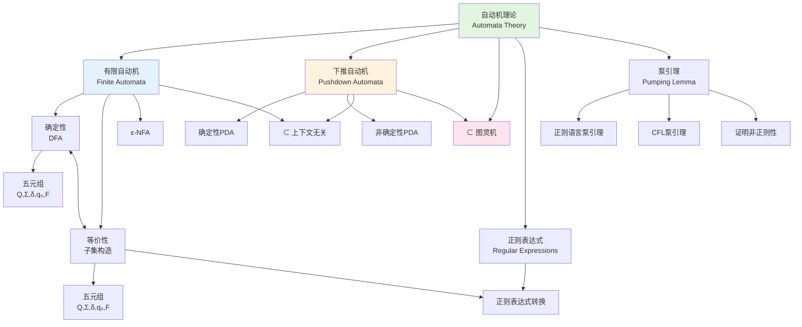
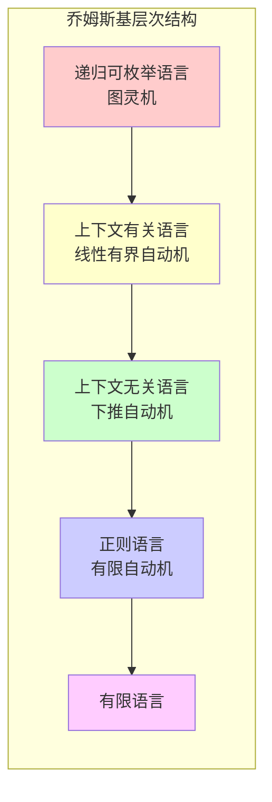
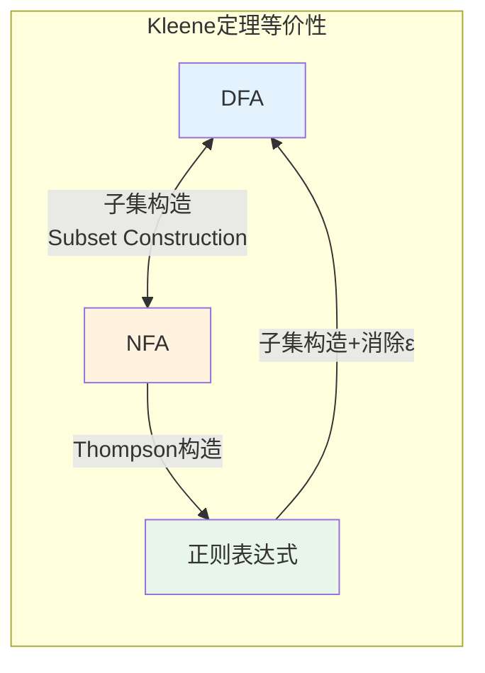
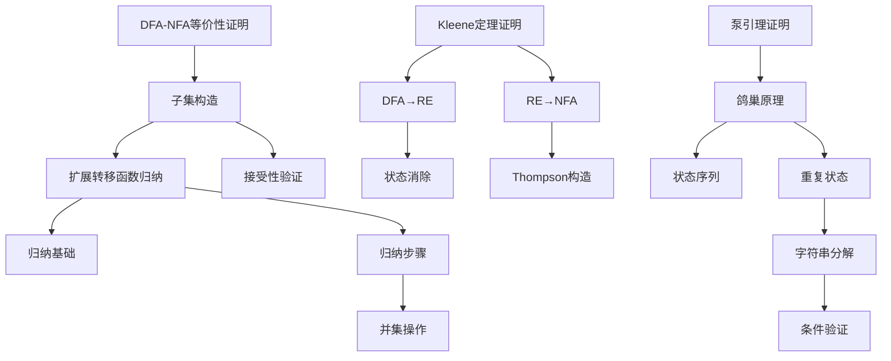

# 自动机理论 - 六维内容补充


> **版本**: 1.0
> **创建日期**: 2026-04-19
> **最后更新**: 2026-04-19

> **模块**: 07-计算模型
> **文档**: 02-自动机理论
> **补充维度**: 概念定义、属性、关系、解释、论证、形式证明
> **对标**: MIT 18.404 / CMU 15-251 / Stanford CS 154
> **深度**: 研究生级

---

## 思维导图：自动机理论概念结构



---

## 一、概念定义 (Concept Definition)

### 1.1 确定性有限自动机 (DFA)

**定义 1.1.1** (形式化)

**确定性有限自动机** (Deterministic Finite Automaton, DFA) 是一个五元组：

$$
M = (Q, \Sigma, \delta, q_0, F)
$$

其中：

| 组件 | 含义 | 约束条件 |
|------|------|----------|
| $Q$ | 有限状态集 | $ \|Q\| < \infty $ |
| $\Sigma$ | 输入字母表 | 有限符号集 |
| $\delta$ | 转移函数 | $\delta: Q \times \Sigma \rightarrow Q$ |
| $q_0$ | 初始状态 | $q_0 \in Q$ |
| $F$ | 接受状态集 | $F \subseteq Q$ |

**扩展转移函数** $\hat{\delta}: Q \times \Sigma^* \rightarrow Q$ 递归定义：

$$
\hat{\delta}(q, \varepsilon) = q \\
\hat{\delta}(q, wa) = \delta(\hat{\delta}(q, w), a)
$$

**语言接受**: $L(M) = \{w \in \Sigma^* \mid \hat{\delta}(q_0, w) \in F\}$

---

### 1.2 非确定性有限自动机 (NFA)

**定义 1.2.1** (形式化)

**非确定性有限自动机** (Nondeterministic Finite Automaton, NFA) 是一个五元组：

$$
N = (Q, \Sigma, \delta, q_0, F)
$$

其中转移函数为：

$$
\delta: Q \times (\Sigma \cup \{\varepsilon\}) \rightarrow 2^Q
$$

**关键区别**:

| 特性 | DFA | NFA |
|------|-----|-----|
| 转移确定性 | 唯一后继 | 多后继可选 |
| 转移函数 | $\delta: Q \times \Sigma \rightarrow Q$ | $\delta: Q \times \Sigma \rightarrow 2^Q$ |
| ε转移 | 不允许 | 允许 |
| 状态数 | 可能较多 | 通常较少 |
| 计算能力 | 等价 | 等价 |

**NFA接受条件**: 字符串 $w$ 被接受，当且仅当存在至少一条从 $q_0$ 到某 $q \in F$ 的路径，其标签为 $w$。

---

### 1.3 正则表达式 (Regular Expressions)

**定义 1.3.1** (递归定义)

给定字母表 $\Sigma$，**正则表达式**递归定义如下：

1. **基础**: $\emptyset$ 是正则表达式，表示空语言
2. **基础**: $\varepsilon$ 是正则表达式，表示 $\{\varepsilon\}$
3. **基础**: 对于 $\forall a \in \Sigma$，$a$ 是正则表达式，表示 $\{a\}$
4. **并**: 若 $R_1, R_2$ 是正则表达式，则 $R_1 + R_2$ 是正则表达式
5. **连接**: 若 $R_1, R_2$ 是正则表达式，则 $R_1 R_2$ 是正则表达式
6. **Kleene闭包**: 若 $R$ 是正则表达式，则 $R^*$ 是正则表达式

**正则表达式语义**:

| 表达式 | 语言 $L(R)$ |
|--------|-------------|
| $\emptyset$ | $\emptyset$ |
| $\varepsilon$ | $\{\varepsilon\}$ |
| $a$ | $\{a\}$ |
| $R_1 + R_2$ | $L(R_1) \cup L(R_2)$ |
| $R_1 R_2$ | $\{xy \mid x \in L(R_1), y \in L(R_2)\}$ |
| $R^*$ | $\bigcup_{i=0}^{\infty} L(R)^i$ |

**正则表达式代数定律**:

$$
\begin{aligned}
R + S &= S + R \\
(R + S) + T &= R + (S + T) \\
(RS)T &= R(ST) \\
R(S + T) &= RS + RT \\
(R + S)T &= RT + ST \\
R^* &= \varepsilon + RR^* \\
(R^*)^* &= R^* \\
\emptyset^* &= \varepsilon
\end{aligned}
$$

---

### 1.4 泵引理 (Pumping Lemma)

**定义 1.4.1** (正则语言泵引理)

设 $L$ 是正则语言，则存在**泵长度** $p > 0$，使得对于所有满足 $|w| \geq p$ 的字符串 $w \in L$，存在分解 $w = xyz$，满足：

1. $|xy| \leq p$
2. $|y| > 0$
3. $\forall i \geq 0: xy^iz \in L$

**直观理解**: 对于足够长的正则语言字符串，其中必然存在可重复（泵送）的子串。

---

## 二、属性 (Properties)

### 2.1 自动机复杂度对比

| 自动机类型 | 状态数界限 | 转换复杂度 | 判定问题复杂度 |
|------------|-----------|-----------|---------------|
| **DFA** | $|Q|$ | $O(|Q| \cdot |\Sigma|)$ | 空性: $O(|Q|)$ |
| **NFA** | $2^{|Q|}$ (DFA转换) | $O(|Q|^2 \cdot |\Sigma|)$ | 空性: $O(|Q| + |\delta|)$ |
| **ε-NFA** | $2^{|Q|}$ | $O(|Q|^3)$ (ε闭包) | 接受性: $O(|w| \cdot |Q|^2)$ |
| **PDA** | 无限 (栈) | - | 接受性: 不可判定 |

### 2.2 正则语言封闭性

| 运算 | 封闭性 | 构造方法 |
|------|--------|----------|
| 并 $L_1 \cup L_2$ | ✅ 封闭 | 乘积构造 |
| 交 $L_1 \cap L_2$ | ✅ 封闭 | 乘积构造 |
| 补 $\overline{L}$ | ✅ 封闭 | 交换接受/非接受状态 |
| 连接 $L_1 \cdot L_2$ | ✅ 封闭 | NFA构造 |
| Kleene星 $L^*$ | ✅ 封闭 | ε转移构造 |
| 差 $L_1 - L_2$ | ✅ 封闭 | $L_1 \cap \overline{L_2}$ |
| 反转 $L^R$ | ✅ 封闭 | 状态反转 |
| 同态 $h(L)$ | ✅ 封闭 | 符号替换 |
| 逆同态 $h^{-1}(L)$ | ✅ 封闭 | 预处理输入 |

### 2.3 正则语言判定问题

| 问题 | 输入 | 复杂度 | 可判定性 |
|------|------|--------|----------|
| **成员资格** | DFA $M$, 串 $w$ | $O(|w|)$ | ✅ 可判定 |
| **空性** | DFA $M$ | $O(|Q|)$ | ✅ 可判定 |
| **有穷性** | DFA $M$ | $O(|Q|)$ | ✅ 可判定 |
| **等价性** | DFA $M_1, M_2$ | $O(|Q_1| \cdot |Q_2|)$ | ✅ 可判定 |
| **包含性** | DFA $M_1, M_2$ | $O(|Q_1| \cdot |Q_2|)$ | ✅ 可判定 |
| **最小化** | DFA $M$ | $O(|Q| \log |Q|)$ | ✅ 可判定 |

---

## 三、关系 (Relations)

### 3.1 概念关系表

| 源概念 | 目标概念 | 关系类型 | 说明 |
|--------|----------|----------|------|
| DFA | NFA | equivalent_to | 计算能力等价 |
| NFA | DFA | reduces_to | 子集构造法 |
| 正则表达式 | NFA | equivalent_to | Kleene定理 |
| 正则语言 | DFA | recognized_by | DFA接受正则语言 |
| DFA | 正则表达式 | generates | DFA可转正则表达式 |
| 泵引理 | 正则语言 | characterizes | 必要条件非充分 |
| DFA | PDA | subset_of | DFA是PDA的特例 |
| 正则语言 | CFL | subset_of | 正则语言 ⊂ 上下文无关语言 |

### 3.2 乔姆斯基层次 (Chomsky Hierarchy)



### 3.3 DFA-NFA-正则表达式等价关系



---

## 四、解释 (Explanation)

### 4.1 动机与直观

**为什么需要自动机理论？**

自动机理论为计算提供了最基础的数学模型。从编译器中的词法分析器到硬件电路设计，从文本搜索算法到形式验证，自动机的思想无处不在。

**DFA vs NFA 的直观理解**:

| 比喻 | DFA | NFA |
|------|-----|-----|
| 迷宫探索 | 每路口只有一条路 | 每路口有多条路可选 |
| 计算过程 | 确定性执行 | "猜测"正确路径 |
| 实现难度 | 直接实现 | 需回溯或并行模拟 |
| 表达能力 | 相同 | 相同 |

**正则表达式的直观**:

正则表达式是描述字符串模式的声明式语言：

- `a*` : "零个或多个a"
- `(a+b)*` : "由a和b组成的任意字符串"
- `ab*` : "a后跟零个或多个b"

### 4.2 与已有概念的联系

**自动机与编译器**:

```
源代码 → [词法分析器(DFA)] → 记号流 → [语法分析器(PDA)] → 语法树
```

**自动机与电路设计**:

| 自动机概念 | 电路概念 |
|------------|----------|
| 状态 | 寄存器值 |
| 输入符号 | 输入信号 |
| 转移函数 | 组合逻辑 |
| 接受状态 | 输出信号 |

### 4.3 示例与反例

**示例 4.3.1**: 识别 $\{w \in \{0,1\}^* \mid w \text{ 以 } 01 \text{ 结尾}\}$ 的DFA

```
状态: q0 (初始), q1 (读到0), q2 (接受, 读到01)

转移:
  q0 --0--> q1
  q0 --1--> q0
  q1 --0--> q1
  q1 --1--> q2
  q2 --0--> q1
  q2 --1--> q0
```

**反例 4.3.2**: 泵引理证明 $L = \{0^n1^n \mid n \geq 0\}$ 非正则

**证明**: 假设 $L$ 是正则的，设泵长度为 $p$。

取 $w = 0^p1^p$，显然 $|w| = 2p \geq p$。

由泵引理，$w = xyz$，其中 $|xy| \leq p$，$|y| > 0$。

因此 $y$ 只包含0。取 $i = 2$，则 $xy^2z = 0^{p+|y|}1^p$。

由于 $|y| > 0$，$xy^2z \notin L$，矛盾！

因此 $L$ 不是正则语言。

---

## 五、论证 (Argumentation)

### 5.1 非形式论证：为什么DFA和NFA等价？

**核心思想**: NFA的"非确定性选择"可以通过**并行模拟**来消除。

**子集构造法**:

NFA在任意时刻可能处于多个状态的"叠加"。DFA的一个状态可以表示NFA可能处于的所有状态的集合。

```
NFA状态: {q1, q2, q3} ──子集构造──→ DFA状态: [q1,q2,q3]
```

**复杂度分析**:

- NFA有 $n$ 个状态
- 对应的DFA最坏有 $2^n$ 个状态
- 这是**指数级**的状态爆炸

### 5.2 反例与边界

**边界情况 5.2.1**: 泵引理的逆不成立

存在满足泵引理条件的语言但不是正则语言。

**例**: $L = \{a^nb^n \mid n \geq 0\} \cup \{a^nb^m \mid n,m \geq 0, n \neq m\}$

这个语言满足泵引理但不是正则的。

**边界情况 5.2.2**: NFA到DFA的最小状态数

存在NFA族，使得任何等价的DFA都需要指数级更多状态。

**例**: 语言 $L_n = \{w \in \{0,1\}^* \mid w \text{ 的第 } n \text{ 个字符从右是 } 1\}$

- NFA: $O(n)$ 状态
- DFA: $2^n$ 状态（必需）

---

## 六、形式证明 (Formal Proof)

### 6.1 NFA到DFA的等价性（子集构造法）

**定理 6.1.1**: 对于每个NFA $N = (Q, \Sigma, \delta, q_0, F)$，存在DFA $D$ 使得 $L(D) = L(N)$。

**证明**:

**构造**:

定义DFA $D = (Q_D, \Sigma, \delta_D, q_{0D}, F_D)$：

1. $Q_D = 2^Q$（$Q$ 的幂集）
2. $\delta_D(S, a) = \bigcup_{q \in S} \delta(q, a)$
3. $q_{0D} = \{q_0\}$
4. $F_D = \{S \subseteq Q \mid S \cap F \neq \emptyset\}$

**正确性证明**（归纳法）:

**引理**: 对于所有 $S \subseteq Q$ 和 $w \in \Sigma^*$：
$$\hat{\delta}_D(S, w) = \bigcup_{q \in S} \hat{\delta}_N(q, w)$$

**归纳基础**: $w = \varepsilon$
$$\hat{\delta}_D(S, \varepsilon) = S = \bigcup_{q \in S} \{q\} = \bigcup_{q \in S} \hat{\delta}_N(q, \varepsilon)$$

**归纳步骤**: 假设对 $|w| = k$ 成立，证明对 $wa$ 成立。

$$\begin{aligned}
\hat{\delta}_D(S, wa) &= \delta_D(\hat{\delta}_D(S, w), a) \\
&= \delta_D(\bigcup_{q \in S} \hat{\delta}_N(q, w), a) \quad \text{[归纳假设]} \\
&= \bigcup_{p \in \bigcup_{q \in S} \hat{\delta}_N(q, w)} \delta_N(p, a) \\
&= \bigcup_{q \in S} \bigcup_{p \in \hat{\delta}_N(q, w)} \delta_N(p, a) \\
&= \bigcup_{q \in S} \hat{\delta}_N(q, wa)
\end{aligned}$$

**接受性**:
$$w \in L(D) \Leftrightarrow \hat{\delta}_D(q_{0D}, w) \in F_D \Leftrightarrow \hat{\delta}_N(q_0, w) \cap F \neq \emptyset \Leftrightarrow w \in L(N)$$

因此 $L(D) = L(N)$。$\square$

### 6.2 Kleene定理

**定理 6.2.1** (Kleene, 1956): 语言 $L$ 是正则的当且仅当存在正则表达式 $R$ 使得 $L = L(R)$。

**证明** (⇒ 方向: DFA → 正则表达式):

**方法**: 状态消除法

设DFA $D = (Q, \Sigma, \delta, q_0, F)$，$Q = \{q_0, q_1, \ldots, q_n\}$。

定义 $R_{ij}^{(k)}$ 为从 $q_i$ 到 $q_j$ 且中间只经过 $\{q_0, \ldots, q_k\}$ 的路径上的所有字符串的集合。

**递归定义**:

- **基础**: $R_{ij}^{(-1)} = \{a \in \Sigma \mid \delta(q_i, a) = q_j\}$（若 $i=j$ 则加上 $\varepsilon$）

- **归纳**: $R_{ij}^{(k)} = R_{ij}^{(k-1)} + R_{ik}^{(k-1)}(R_{kk}^{(k-1)})^*R_{kj}^{(k-1)}$

**终止**: 对于单一接受状态 $q_f$：$L(D) = R_{0f}^{(n)}$

对于多个接受状态：$L(D) = \sum_{q_f \in F} R_{0f}^{(n)}$

**证明** (⇐ 方向: 正则表达式 → NFA):

**Thompson构造法**: 对正则表达式的结构归纳

| 表达式 | NFA构造 |
|--------|---------|
| $\emptyset$ | 两个状态，无转移 |
| $\varepsilon$ | 两个状态，ε转移 |
| $a$ | 两个状态，$a$转移 |
| $R_1 + R_2$ | $N(R_1)$ 和 $N(R_2)$ 并联 |
| $R_1 R_2$ | $N(R_1)$ 和 $N(R_2)$ 串联 |
| $R^*$ | $N(R)$ 加循环 |

### 6.3 泵引理的形式证明

**定理 6.3.1** (正则语言泵引理): 若 $L$ 是正则语言，则泵引理条件成立。

**证明**:

设 $M = (Q, \Sigma, \delta, q_0, F)$ 是接受 $L$ 的DFA，$|Q| = n$。

取 $p = n$（泵长度）。

对于 $w = a_1a_2\ldots a_m \in L$，$m \geq n$，考虑状态序列：

$$q_0, \delta(q_0, a_1), \delta(q_0, a_1a_2), \ldots, \delta(q_0, w)$$

共有 $m+1 \geq n+1$ 个状态，但只有 $n$ 个不同状态。

由**鸽巢原理**，存在 $0 \leq i < j \leq n$ 使得状态重复。

设 $q_i = q_j$，分解 $w = xyz$：
- $x = a_1\ldots a_i$
- $y = a_{i+1}\ldots a_j$
- $z = a_{j+1}\ldots a_m$

**验证条件**:

1. $|xy| = j \leq n = p$ ✓
2. $|y| = j - i > 0$ ✓
3. 对于任意 $k \geq 0$，$\hat{\delta}(q_0, xy^kz) = \hat{\delta}(q_i, y^kz) = \hat{\delta}(q_j, y^{k-1}z) = \ldots = \hat{\delta}(q_j, z) \in F$ ✓

因此泵引理成立。$\square$

### 6.4 证明决策树



---

## 七、多语言实现：自动机模拟器

### 7.1 Python: DFA与NFA实现

```python
from typing import Set, Dict, Tuple, FrozenSet
from dataclasses import dataclass

@dataclass(frozen=True)
class DFA:
    """确定性有限自动机"""
    states: FrozenSet[str]
    alphabet: FrozenSet[str]
    transition: Dict[Tuple[str, str], str]  # (state, symbol) -> next_state
    start_state: str
    accept_states: FrozenSet[str]

    def accepts(self, input_string: str) -> bool:
        """判断DFA是否接受输入字符串"""
        current = self.start_state
        for symbol in input_string:
            if (current, symbol) not in self.transition:
                return False
            current = self.transition[(current, symbol)]
        return current in self.accept_states

    def minimize(self) -> 'DFA':
        """DFA最小化（Hopcroft算法）"""
        # 初始划分: 接受状态和非接受状态
        accepting = self.accept_states
        non_accepting = self.states - accepting

        partitions = [accepting] if accepting else []
        if non_accepting:
            partitions.append(non_accepting)

        # 迭代细化划分
        changed = True
        while changed:
            changed = False
            new_partitions = []

            for group in partitions:
                if len(group) <= 1:
                    new_partitions.append(group)
                    continue

                # 按转移目标分组
                signatures = {}
                for state in group:
                    sig = tuple(
                        next((i for i, p in enumerate(partitions)
                              if self.transition.get((state, a)) in p), -1)
                        for a in self.alphabet
                    )
                    if sig not in signatures:
                        signatures[sig] = set()
                    signatures[sig].add(state)

                if len(signatures) > 1:
                    changed = True
                new_partitions.extend(frozenset(s) for s in signatures.values())

            partitions = new_partitions

        # 构建最小DFA
        state_map = {state: f"q{i}" for i, part in enumerate(partitions)
                     for state in part}

        new_trans = {}
        for (s, a), t in self.transition.items():
            new_trans[(state_map[s], a)] = state_map[t]

        new_start = state_map[self.start_state]
        new_accept = frozenset(state_map[s] for s in self.accept_states)

        return DFA(
            states=frozenset(state_map.values()),
            alphabet=self.alphabet,
            transition=new_trans,
            start_state=new_start,
            accept_states=new_accept
        )


class NFA:
    """非确定性有限自动机（带ε转移）"""

    def __init__(self):
        self.states: Set[str] = set()
        self.alphabet: Set[str] = set()
        self.transitions: Dict[Tuple[str, str], Set[str]] = {}  # (state, symbol) -> set of states
        self.epsilon_transitions: Dict[str, Set[str]] = {}  # state -> set of states
        self.start_state: str = ""
        self.accept_states: Set[str] = set()

    def epsilon_closure(self, states: Set[str]) -> Set[str]:
        """计算状态的ε闭包"""
        closure = set(states)
        stack = list(states)

        while stack:
            state = stack.pop()
            for next_state in self.epsilon_transitions.get(state, set()):
                if next_state not in closure:
                    closure.add(next_state)
                    stack.append(next_state)

        return closure

    def to_dfa(self) -> DFA:
        """使用子集构造法将NFA转换为DFA"""
        from collections import deque

        # 初始状态是NFA起始状态的ε闭包
        initial = frozenset(self.epsilon_closure({self.start_state}))

        dfa_states = {initial}
        dfa_transitions = {}
        unmarked = deque([initial])

        while unmarked:
            current = unmarked.popleft()

            for symbol in self.alphabet:
                # 计算从current中任意状态通过symbol可达的状态
                next_states = set()
                for state in current:
                    next_states.update(self.transitions.get((state, symbol), set()))

                # 取ε闭包
                next_closure = frozenset(self.epsilon_closure(next_states))

                if next_closure:
                    dfa_transitions[(current, symbol)] = next_closure

                    if next_closure not in dfa_states:
                        dfa_states.add(next_closure)
                        unmarked.append(next_closure)

        # 确定接受状态
        dfa_accept = {s for s in dfa_states if s & self.accept_states}

        # 将frozenset状态转换为字符串
        state_names = {s: f"q{i}" for i, s in enumerate(dfa_states)}

        final_trans = {}
        for (s, a), t in dfa_transitions.items():
            final_trans[(state_names[s], a)] = state_names[t]

        return DFA(
            states=frozenset(state_names.values()),
            alphabet=frozenset(self.alphabet),
            transition=final_trans,
            start_state=state_names[initial],
            accept_states=frozenset(state_names[s] for s in dfa_accept)
        )


# 示例: 创建识别以"01"结尾的DFA
if __name__ == "__main__":
    dfa = DFA(
        states=frozenset({"q0", "q1", "q2"}),
        alphabet=frozenset({"0", "1"}),
        transition={
            ("q0", "0"): "q1",
            ("q0", "1"): "q0",
            ("q1", "0"): "q1",
            ("q1", "1"): "q2",
            ("q2", "0"): "q1",
            ("q2", "1"): "q0",
        },
        start_state="q0",
        accept_states=frozenset({"q2"})
    )

    test_strings = ["", "01", "001", "101", "0101", "1110", "0001"]
    for s in test_strings:
        result = dfa.accepts(s)
        print(f"'{s}': {'接受' if result else '拒绝'}")
```

## 7.2 Rust: 正则表达式引擎核心
### 7.2 Rust: 正则表达式引擎核心

```rust
use std::collections::{HashMap, HashSet};

/// 正则表达式抽象语法树
# [derive(Debug, Clone)]
pub enum Regex {
    Empty,              // ∅
    Epsilon,            // ε
    Symbol(char),       // a
    Union(Box<Regex>, Box<Regex>),   // R1 + R2
    Concat(Box<Regex>, Box<Regex>),  // R1 R2
    Star(Box<Regex>),   // R*
}

impl Regex {
    /// Thompson构造法: 正则表达式转NFA
    pub fn to_nfa(&self) -> ThompsonNFA {
        let mut nfa = ThompsonNFA::new();
        let (start, accept) = self.build_nfa(&mut nfa);
        nfa.start_state = start;
        nfa.accept_states.insert(accept);
        nfa
    }

    fn build_nfa(&self, nfa: &mut ThompsonNFA) -> (usize, usize) {
        match self {
            Regex::Empty => {
                let start = nfa.new_state();
                let accept = nfa.new_state();
                (start, accept)  // 无转移
            }
            Regex::Epsilon => {
                let start = nfa.new_state();
                let accept = nfa.new_state();
                nfa.add_epsilon(start, accept);
                (start, accept)
            }
            Regex::Symbol(c) => {
                let start = nfa.new_state();
                let accept = nfa.new_state();
                nfa.add_transition(start, *c, accept);
                (start, accept)
            }
            Regex::Union(r1, r2) => {
                let (s1, a1) = r1.build_nfa(nfa);
                let (s2, a2) = r2.build_nfa(nfa);
                let start = nfa.new_state();
                let accept = nfa.new_state();

                nfa.add_epsilon(start, s1);
                nfa.add_epsilon(start, s2);
                nfa.add_epsilon(a1, accept);
                nfa.add_epsilon(a2, accept);

                (start, accept)
            }
            Regex::Concat(r1, r2) => {
                let (s1, a1) = r1.build_nfa(nfa);
                let (s2, a2) = r2.build_nfa(nfa);

                nfa.add_epsilon(a1, s2);

                (s1, a2)
            }
            Regex::Star(r) => {
                let (s, a) = r.build_nfa(nfa);
                let start = nfa.new_state();
                let accept = nfa.new_state();

                nfa.add_epsilon(start, accept);  // 空串
                nfa.add_epsilon(start, s);       // 进入
                nfa.add_epsilon(a, accept);      // 结束
                nfa.add_epsilon(a, s);           // 循环

                (start, accept)
            }
        }
    }
}

pub struct ThompsonNFA {
    states: usize,
    transitions: HashMap<(usize, char), HashSet<usize>>,
    epsilon_transitions: HashMap<usize, HashSet<usize>>,
    start_state: usize,
    accept_states: HashSet<usize>,
}

impl ThompsonNFA {
    fn new() -> Self {
        ThompsonNFA {
            states: 0,
            transitions: HashMap::new(),
            epsilon_transitions: HashMap::new(),
            start_state: 0,
            accept_states: HashSet::new(),
        }
    }

    fn new_state(&mut self) -> usize {
        let id = self.states;
        self.states += 1;
        id
    }

    fn add_transition(&mut self, from: usize, symbol: char, to: usize) {
        self.transitions
            .entry((from, symbol))
            .or_insert_with(HashSet::new)
            .insert(to);
    }

    fn add_epsilon(&mut self, from: usize, to: usize) {
        self.epsilon_transitions
            .entry(from)
            .or_insert_with(HashSet::new)
            .insert(to);
    }
}

# [cfg(test)]
mod tests {
    use super::*;

    #[test]
    fn test_regex_to_nfa() {
        // (a+b)*abb
        let regex = Regex::Concat(
            Box::new(Regex::Star(Box::new(Regex::Union(
                Box::new(Regex::Symbol('a')),
                Box::new(Regex::Symbol('b'))
            )))),
            Box::new(Regex::Concat(
                Box::new(Regex::Symbol('a')),
                Box::new(Regex::Concat(
                    Box::new(Regex::Symbol('b')),
                    Box::new(Regex::Symbol('b'))
                ))
            ))
        );

        let nfa = regex.to_nfa();
        assert!(nfa.accept_states.len() > 0);
    }
}
```

---

## 八、自动机理论速查

### 8.1 构造方法对照表

| 构造 | 输入 | 输出 | 复杂度 | 关键步骤 |
|------|------|------|--------|----------|
| **NFA → DFA** | NFA | DFA | $O(2^{|Q|})$ | 子集构造 |
| **ε-NFA → NFA** | ε-NFA | NFA | $O(|Q|^3)$ | ε闭包计算 |
| **RE → NFA** | 正则表达式 | NFA | $O(|R|)$ | Thompson构造 |
| **DFA → RE** | DFA | 正则表达式 | $O(|Q|^3)$ | 状态消除 |
| **DFA最小化** | DFA | 最小DFA | $O(|Q| \log |Q|)$ | 划分细化 |

### 8.2 非正则语言证明技巧

| 方法 | 适用场景 | 关键步骤 |
|------|----------|----------|
| **泵引理** | 经典非正则语言 | 选择适当的泵送串 |
| **Myhill-Nerode** | 需要精确的等价类分析 | 构造无限个可区分串 |
| **封闭性** | 已知语言的组合 | 反证法 |
| **计数论证** | 状态数下界 | 计算不同后缀的数量 |

---

**文档版本**: v1.0
**创建日期**: 2026-04-10
**维护**: 项目计算模型工作组

---

## 参考文献

- 待补充

---

## 知识导航

- [返回目录](README.md)

## 学习目标

- 理解自动机理论 - 六维内容补充的核心概念
- 掌握自动机理论 - 六维内容补充的形式化表示
