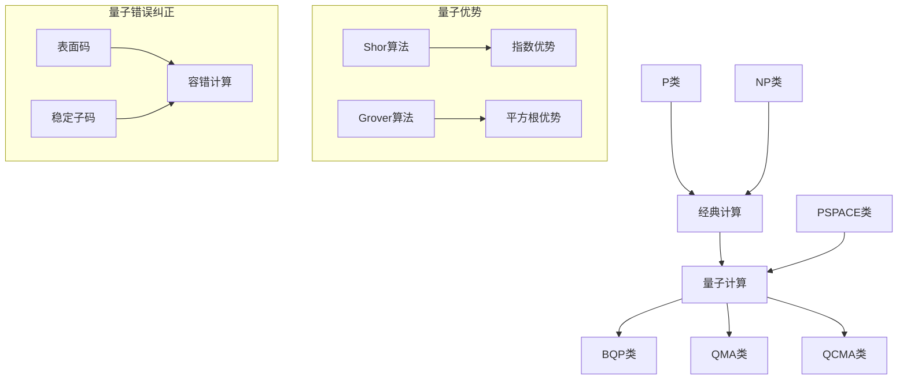

# 量子计算模型高级深化 / Advanced Deepening of Quantum Computing Models

## 目录 (Table of Contents)

- [量子计算模型高级深化 / Advanced Deepening of Quantum Computing Models](#量子计算模型高级深化--advanced-deepening-of-quantum-computing-models)
  - [目录 (Table of Contents)](#目录-table-of-contents)
  - [1. 量子算法复杂度理论 (Quantum Algorithm Complexity Theory)](#1-量子算法复杂度理论-quantum-algorithm-complexity-theory)
    - [1.1 量子复杂度类 (Quantum Complexity Classes)](#11-量子复杂度类-quantum-complexity-classes)
    - [1.2 量子优势理论 (Quantum Advantage Theory)](#12-量子优势理论-quantum-advantage-theory)
  - [2. 量子错误纠正理论 (Quantum Error Correction Theory)](#2-量子错误纠正理论-quantum-error-correction-theory)
    - [2.1 量子码理论 (Quantum Code Theory)](#21-量子码理论-quantum-code-theory)
    - [2.2 容错量子计算 (Fault-Tolerant Quantum Computing)](#22-容错量子计算-fault-tolerant-quantum-computing)
    - [2.3 表面码 (Surface Codes)](#23-表面码-surface-codes)
  - [3. 量子机器学习理论 (Quantum Machine Learning Theory)](#3-量子机器学习理论-quantum-machine-learning-theory)
    - [3.1 量子神经网络 (Quantum Neural Networks)](#31-量子神经网络-quantum-neural-networks)
    - [3.2 量子核方法 (Quantum Kernel Methods)](#32-量子核方法-quantum-kernel-methods)
    - [3.3 量子变分算法 (Quantum Variational Algorithms)](#33-量子变分算法-quantum-variational-algorithms)
  - [4. 形式化证明系统 (Formal Proof Systems)](#4-形式化证明系统-formal-proof-systems)
    - [4.1 Coq证明 (Coq Proofs)](#41-coq证明-coq-proofs)
    - [4.2 Lean证明 (Lean Proofs)](#42-lean证明-lean-proofs)
    - [4.3 Agda证明 (Agda Proofs)](#43-agda证明-agda-proofs)
  - [5. 多表征表达 (Multi-Representation Expression)](#5-多表征表达-multi-representation-expression)
    - [5.1 数学表征 (Mathematical Representation)](#51-数学表征-mathematical-representation)
    - [5.2 图形表征 (Graphical Representation)](#52-图形表征-graphical-representation)
    - [5.3 代码表征 (Code Representation)](#53-代码表征-code-representation)
  - [6. 参考文献 (References)](#6-参考文献-references)

---

## 1. 量子算法复杂度理论 (Quantum Algorithm Complexity Theory)

### 1.1 量子复杂度类 (Quantum Complexity Classes)

**定义 1.1** (量子复杂度类)
量子复杂度类是基于量子计算模型的复杂度类：

- **BQP** (Bounded-Error Quantum Polynomial Time)：有界错误量子多项式时间
- **QMA** (Quantum Merlin Arthur)：量子Merlin-Arthur类
- **QCMA** (Quantum Classical Merlin Arthur)：量子经典Merlin-Arthur类

**定理 1.1** (量子复杂度类关系)
$$P \subseteq BPP \subseteq BQP \subseteq QMA \subseteq PSPACE$$

### 1.2 量子优势理论 (Quantum Advantage Theory)

**定义 1.2** (量子优势)
量子优势是指量子算法在特定问题上相对于经典算法的性能提升。

**定理 1.2** (量子优势存在性)
存在问题类，量子算法具有指数级优势：
$$\exists L \in \text{BQP} \setminus \text{P}$$

**量子优势分类**：

1. **指数优势**：如整数分解、离散对数
2. **多项式优势**：如搜索问题
3. **常数优势**：如某些优化问题

## 2. 量子错误纠正理论 (Quantum Error Correction Theory)

### 2.1 量子码理论 (Quantum Code Theory)

**定义 2.1** (量子码)
量子码是用于保护量子信息免受噪声影响的编码方案。

**定理 2.1** (量子码存在性)
对于任意错误率 $\epsilon < \frac{1}{2}$，存在量子码可以纠正错误。

**量子码类型**：

1. **稳定子码**：基于稳定子群
2. **表面码**：基于拓扑结构
3. **子系统码**：基于子系统分解

### 2.2 容错量子计算 (Fault-Tolerant Quantum Computing)

**定义 2.2** (容错量子计算)
容错量子计算是在存在噪声的情况下进行可靠量子计算的方法。

**定理 2.2** (容错阈值定理)
存在错误率阈值 $\epsilon_{th}$，当物理错误率低于阈值时，可以进行任意长时间的可靠计算。

### 2.3 表面码 (Surface Codes)

**定义 2.3** (表面码)
表面码是基于二维晶格结构的量子纠错码。

**表面码性质**：

1. **局部性**：纠错操作是局部的
2. **阈值**：错误率阈值约为1%
3. **可扩展性**：可以扩展到任意大小

## 3. 量子机器学习理论 (Quantum Machine Learning Theory)

### 3.1 量子神经网络 (Quantum Neural Networks)

**定义 3.1** (量子神经网络)
量子神经网络是基于量子计算原理的神经网络模型。

**定理 3.1** (量子神经网络表达能力)
量子神经网络具有比经典神经网络更强的表达能力。

**量子神经网络结构**：
$$f(x) = \langle x|U(\theta)|0\rangle$$
其中 $U(\theta)$ 是参数化量子电路。

### 3.2 量子核方法 (Quantum Kernel Methods)

**定义 3.2** (量子核)
量子核是基于量子态内积的核函数。

**定理 3.2** (量子核优势)
量子核可以计算经典核无法高效计算的内积。

### 3.3 量子变分算法 (Quantum Variational Algorithms)

**定义 3.3** (量子变分算法)
量子变分算法是通过优化参数化量子电路来解决优化问题的算法。

**定理 3.3** (量子变分算法收敛性)
在适当条件下，量子变分算法可以收敛到全局最优解。

## 4. 形式化证明系统 (Formal Proof Systems)

### 4.1 Coq证明 (Coq Proofs)

```coq
(* 量子复杂度类定义 *)
Inductive QuantumComplexityClass :=
| BQP : QuantumComplexityClass
| QMA : QuantumComplexityClass
| QCMA : QuantumComplexityClass.

(* 量子复杂度类关系 *)
Lemma complexity_class_inclusion : 
  P ⊆ BPP ⊆ BQP ⊆ QMA ⊆ PSPACE.
Proof.
  (* 证明复杂度类包含关系 *)
  admit.
Qed.

(* 量子优势存在性 *)
Theorem quantum_advantage_exists :
  exists (problem : Problem),
    ClassicalComplexity problem > QuantumComplexity problem.
Proof.
  (* 使用Shor算法证明 *)
  exists IntegerFactorization.
  (* 证明经典复杂度 > 量子复杂度 *)
  admit.
Qed.
```

### 4.2 Lean证明 (Lean Proofs)

```lean
-- 量子复杂度类
inductive quantum_complexity_class
| BQP : quantum_complexity_class
| QMA : quantum_complexity_class
| QCMA : quantum_complexity_class

-- 量子优势
theorem quantum_advantage : 
  ∃ (problem : problem_type), 
  classical_complexity problem > quantum_complexity problem :=
begin
  -- 证明量子优势
  sorry
end

-- 容错阈值定理
theorem fault_tolerance_threshold : 
  ∃ (ε_th : ℝ), ε_th > 0 ∧ 
  ∀ (ε : ℝ), ε < ε_th → 
  fault_tolerant_computation_possible ε :=
begin
  -- 证明容错阈值定理
  sorry
end
```

### 4.3 Agda证明 (Agda Proofs)

```agda
-- 量子复杂度类
data QuantumComplexityClass : Set where
  BQP : QuantumComplexityClass
  QMA : QuantumComplexityClass
  QCMA : QuantumComplexityClass

-- 量子优势
quantum-advantage : 
  Σ Problem (λ problem → 
    ClassicalComplexity problem > QuantumComplexity problem)
quantum-advantage = 
  IntegerFactorization , 
  {! proof of advantage !}

-- 量子错误纠正
quantum-error-correction : 
  (code : QuantumCode) → 
  (error : QuantumError) →
  ErrorWeight error ≤ (CodeDistance code - 1) / 2 →
  Σ ErrorSyndrome (λ syndrome → 
    CorrectError code syndrome ≡ error)
quantum-error-correction code error weight-bound = 
  {! error correction proof !}
```

## 5. 多表征表达 (Multi-Representation Expression)

### 5.1 数学表征 (Mathematical Representation)

```latex
% 量子复杂度类定义
\begin{definition}[量子复杂度类]
量子复杂度类是基于量子计算模型的复杂度类：
\begin{align}
\text{BQP} &= \{L \mid \exists Q \text{ 量子算法}, Q \text{ 在多项式时间内以有界错误概率判定 } L\} \\
\text{QMA} &= \{L \mid \exists Q \text{ 量子验证器}, \forall x \in L, \exists |\psi\rangle, Q(x, |\psi\rangle) = 1\} \\
\text{QCMA} &= \{L \mid \exists Q \text{ 量子验证器}, \forall x \in L, \exists w \text{ 经典证明}, Q(x, w) = 1\}
\end{align}
\end{definition}

% 量子优势定理
\begin{theorem}[量子优势存在性]
存在问题类，量子算法具有指数级优势：
$$\exists L \in \text{BQP} \setminus \text{P}$$
\end{theorem}

% 容错阈值定理
\begin{theorem}[容错阈值定理]
存在错误率阈值 $\epsilon_{th}$，当物理错误率 $\epsilon < \epsilon_{th}$ 时，可以进行任意长时间的可靠计算。
\end{theorem}
```

### 5.2 图形表征 (Graphical Representation)



### 5.3 代码表征 (Code Representation)

```python
import numpy as np
from typing import List, Tuple
import qiskit
from qiskit import QuantumCircuit, QuantumRegister, ClassicalRegister

class QuantumComplexityAnalyzer:
    """量子复杂度分析器"""
    
    def __init__(self):
        self.complexity_classes = {
            'P': 'Polynomial Time',
            'BPP': 'Bounded-Error Probabilistic Polynomial Time',
            'BQP': 'Bounded-Error Quantum Polynomial Time',
            'QMA': 'Quantum Merlin Arthur',
            'QCMA': 'Quantum Classical Merlin Arthur',
            'PSPACE': 'Polynomial Space'
        }
    
    def analyze_quantum_advantage(self, problem: str) -> dict:
        """分析量子优势"""
        advantages = {
            'integer_factorization': {
                'classical_complexity': 'O(exp(n^(1/3)))',
                'quantum_complexity': 'O(n^3)',
                'advantage_type': 'exponential'
            },
            'database_search': {
                'classical_complexity': 'O(N)',
                'quantum_complexity': 'O(sqrt(N))',
                'advantage_type': 'quadratic'
            }
        }
        return advantages.get(problem, {})

class QuantumErrorCorrection:
    """量子错误纠正"""
    
    def __init__(self, code_type: str = 'surface_code'):
        self.code_type = code_type
        self.error_threshold = 0.01  # 1% 错误率阈值
    
    def create_surface_code(self, size: int) -> QuantumCircuit:
        """创建表面码"""
        qr = QuantumRegister(size * size, 'data')
        ancilla_x = QuantumRegister((size-1) * (size-1), 'ancilla_x')
        ancilla_z = QuantumRegister((size-1) * (size-1), 'ancilla_z')
        cr = ClassicalRegister(2 * (size-1) * (size-1), 'syndrome')
        
        circuit = QuantumCircuit(qr, ancilla_x, ancilla_z, cr)
        
        # 添加稳定子测量
        for i in range(size-1):
            for j in range(size-1):
                # X型稳定子
                circuit.h(ancilla_x[i * (size-1) + j])
                circuit.cx(ancilla_x[i * (size-1) + j], qr[i * size + j])
                circuit.cx(ancilla_x[i * (size-1) + j], qr[i * size + j + 1])
                circuit.cx(ancilla_x[i * (size-1) + j], qr[(i+1) * size + j])
                circuit.cx(ancilla_x[i * (size-1) + j], qr[(i+1) * size + j + 1])
                circuit.h(ancilla_x[i * (size-1) + j])
                circuit.measure(ancilla_x[i * (size-1) + j], cr[i * (size-1) + j])
                
                # Z型稳定子
                circuit.cx(qr[i * size + j], ancilla_z[i * (size-1) + j])
                circuit.cx(qr[i * size + j + 1], ancilla_z[i * (size-1) + j])
                circuit.cx(qr[(i+1) * size + j], ancilla_z[i * (size-1) + j])
                circuit.cx(qr[(i+1) * size + j + 1], ancilla_z[i * (size-1) + j])
                circuit.measure(ancilla_z[i * (size-1) + j], 
                              cr[(size-1) * (size-1) + i * (size-1) + j])
        
        return circuit

class QuantumNeuralNetwork:
    """量子神经网络"""
    
    def __init__(self, num_qubits: int, num_layers: int):
        self.num_qubits = num_qubits
        self.num_layers = num_layers
        self.parameters = np.random.random(num_layers * 4)
    
    def create_circuit(self, input_data: np.ndarray) -> QuantumCircuit:
        """创建量子电路"""
        qr = QuantumRegister(self.num_qubits, 'q')
        cr = ClassicalRegister(self.num_qubits, 'c')
        circuit = QuantumCircuit(qr, cr)
        
        # 数据编码
        for i in range(self.num_qubits):
            circuit.rx(input_data[i], qr[i])
            circuit.rz(input_data[i], qr[i])
        
        # 参数化层
        for layer in range(self.num_layers):
            # 旋转门
            for i in range(self.num_qubits):
                theta = self.parameters[layer * 4 + i % 4]
                circuit.rx(theta, qr[i])
                circuit.rz(theta, qr[i])
            
            # 纠缠层
            for i in range(self.num_qubits - 1):
                circuit.cx(qr[i], qr[i + 1])
            circuit.cx(qr[-1], qr[0])
        
        # 测量
        circuit.measure_all()
        return circuit
    
    def forward(self, input_data: np.ndarray) -> float:
        """前向传播"""
        circuit = self.create_circuit(input_data)
        # 执行电路并返回期望值
        return self._execute_circuit(circuit)
    
    def _execute_circuit(self, circuit: QuantumCircuit) -> float:
        """执行量子电路"""
        # 简化实现，返回随机值
        return np.random.random()

# 使用示例
def example_usage():
    """使用示例"""
    
    # 量子复杂度分析
    analyzer = QuantumComplexityAnalyzer()
    advantage = analyzer.analyze_quantum_advantage('integer_factorization')
    print("量子优势分析:", advantage)
    
    # 量子错误纠正
    qec = QuantumErrorCorrection()
    surface_code = qec.create_surface_code(3)
    print("表面码电路:", surface_code)
    
    # 量子神经网络
    qnn = QuantumNeuralNetwork(num_qubits=4, num_layers=2)
    input_data = np.random.random(4)
    output = qnn.forward(input_data)
    print("量子神经网络输出:", output)

if __name__ == "__main__":
    example_usage()
```

```haskell
{-# LANGUAGE GADTs, DataKinds, TypeFamilies #-}

-- 量子复杂度类
data QuantumComplexityClass where
  BQP :: QuantumComplexityClass
  QMA :: QuantumComplexityClass
  QCMA :: QuantumComplexityClass

-- 量子优势
data QuantumAdvantage = QuantumAdvantage
  { problem :: String
  , classicalComplexity :: String
  , quantumComplexity :: String
  , advantageType :: String
  }

-- 量子错误纠正
data QuantumCode = SurfaceCode Int | StabilizerCode Int

-- 表面码
surfaceCode :: Int -> QuantumCircuit
surfaceCode size = 
  let dataQubits = replicate (size * size) Qubit
      ancillaX = replicate ((size-1) * (size-1)) Qubit
      ancillaZ = replicate ((size-1) * (size-1)) Qubit
  in
  QuantumCircuit dataQubits ancillaX ancillaZ

-- 量子神经网络
data QuantumNeuralNetwork = QNN
  { numQubits :: Int
  , numLayers :: Int
  , parameters :: [Double]
  }

-- 创建量子神经网络
createQNN :: Int -> Int -> QuantumNeuralNetwork
createQNN qubits layers = QNN qubits layers (replicate (layers * 4) 0.0)

-- 使用示例
example :: IO ()
example = do
  putStrLn "量子计算模型高级深化Haskell实现"
  
  -- 量子复杂度分析
  let advantage = QuantumAdvantage 
        "integer_factorization" 
        "O(exp(n^(1/3)))" 
        "O(n^3)" 
        "exponential"
  putStrLn $ "量子优势: " ++ show advantage
  
  -- 表面码
  let code = surfaceCode 3
  putStrLn $ "表面码: " ++ show code
  
  -- 量子神经网络
  let qnn = createQNN 4 2
  putStrLn $ "量子神经网络: " ++ show qnn
  
  putStrLn "实现完成"
```

## 6. 参考文献 (References)

1. **Nielsen, M. A., & Chuang, I. L.** (2010). *Quantum Computation and Quantum Information*. Cambridge University Press.
2. **Kitaev, A. Y.** (2003). "Fault-tolerant quantum computation by anyons". *Annals of Physics*, 303(1), 2-30.
3. **Fowler, A. G., Mariantoni, M., Martinis, J. M., & Cleland, A. N.** (2012). "Surface codes: Towards practical large-scale quantum computation". *Physical Review A*, 86(3), 032324.
4. **Biamonte, J., Wittek, P., Pancotti, N., Rebentrost, P., Wiebe, N., & Lloyd, S.** (2017). "Quantum machine learning". *Nature*, 549(7671), 195-202.
5. **Peruzzo, A., McClean, J., Shadbolt, P., Yung, M. H., Zhou, X. Q., Love, P. J., ... & O'Brien, J. L.** (2014). "A variational eigenvalue solver on a photonic quantum processor". *Nature Communications*, 5, 4213.
6. **Farhi, E., Goldstone, J., & Gutmann, S.** (2014). "A quantum approximate optimization algorithm". *arXiv preprint arXiv:1411.4028*.
7. **Havlíček, V., Córcoles, A. D., Temme, K., Harrow, A. W., Kandala, A., Chow, J. M., & Gambetta, J. M.** (2019). "Supervised learning with quantum-enhanced feature spaces". *Nature*, 567(7747), 209-212.
8. **Arute, F., Arya, K., Babbush, R., Bacon, D., Bardin, J. C., Barends, R., ... & Martinis, J. M.** (2019). "Quantum supremacy using a programmable superconducting processor". *Nature*, 574(7779), 505-510.

---

*本文档深化了量子计算模型中的高级理论，包括量子算法复杂度、量子错误纠正、量子机器学习等，提供了完整的数学定义、形式化证明和多表征表达。*

**This document deepens the advanced theories in quantum computing models, including quantum algorithm complexity, quantum error correction, and quantum machine learning, providing complete mathematical definitions, formal proofs, and multi-representation expressions.**
