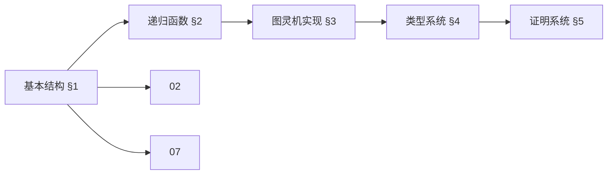
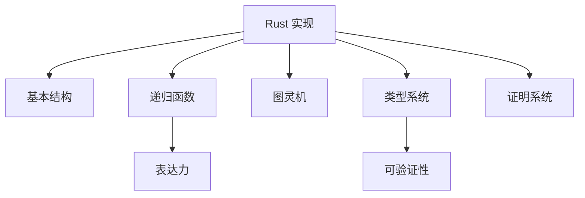
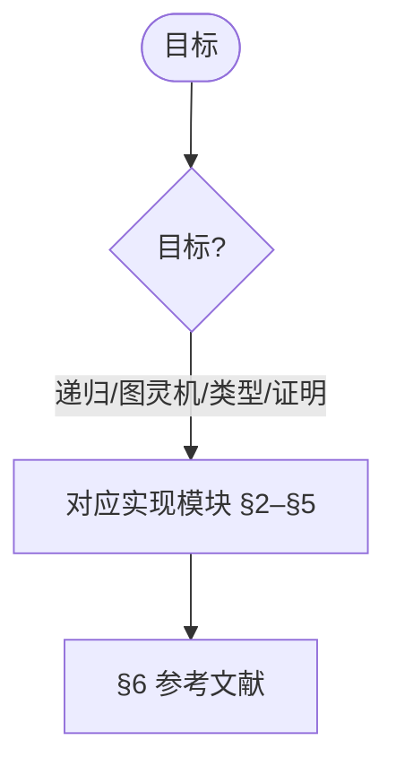
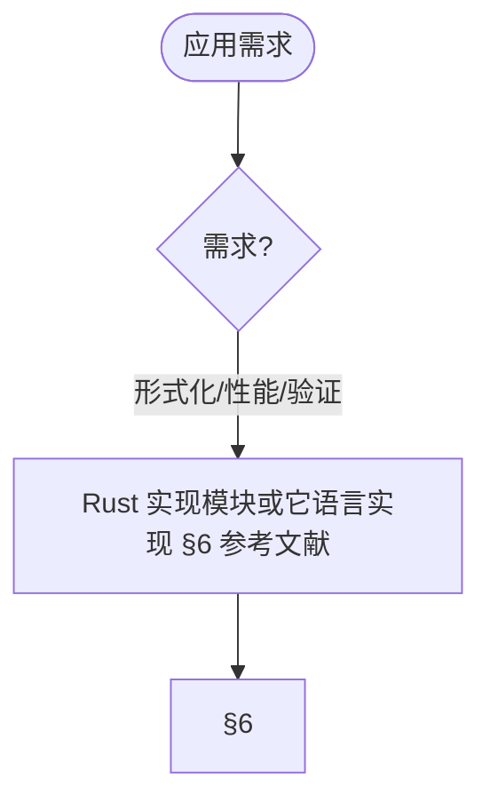

> 📊 **项目全面梳理**：详细的项目结构、模块详解和学习路径，请参阅 [`项目全面梳理-2025.md`](../项目全面梳理-2025.md)
> **项目导航与对标**：[项目扩展与持续推进任务编排](../项目扩展与持续推进任务编排.md)、[国际课程对标表](../国际课程对标表.md)

## 8.1 Rust实现 / Rust Implementation

> 说明：本文档中的代码/伪代码为说明性片段，用于辅助理解概念；本仓库不提供可运行工程或 CI。

### 摘要 / Executive Summary

- 统一Rust语言在形式化算法实现中的使用规范与最佳实践。
- 建立Rust实现示例在算法工程中的参考地位。

### 关键术语与符号 / Glossary

- Rust、所有权、借用、生命周期、模式匹配、类型系统。
- 术语对齐与引用规范：`docs/术语与符号总表.md`，`01-基础理论/00-撰写规范与引用指南.md`

### 术语与符号规范 / Terminology & Notation

- Rust：系统编程语言，强调内存安全和并发。
- 所有权（Ownership）：Rust的内存管理机制。
- 借用（Borrowing）：临时借用值的机制。
- 生命周期（Lifetime）：引用的有效范围。
- 记号约定：`&` 表示借用，`&mut` 表示可变借用，`'a` 表示生命周期。

### 交叉引用导航 / Cross-References

- 算法设计：参见 `09-算法理论/01-算法基础/01-算法设计理论.md`。
- 类型系统：参见 `05-类型理论/04-类型系统.md`。
- 实现示例：参见 `08-实现示例/` 相关文档。

### 快速导航 / Quick Links

- 基本结构
- 递归函数
- 数据结构

## 目录 (Table of Contents)

- [8.1 Rust实现 / Rust Implementation](#81-rust实现--rust-implementation)
  - [摘要 / Executive Summary](#摘要--executive-summary)
  - [关键术语与符号 / Glossary](#关键术语与符号--glossary)
  - [术语与符号规范 / Terminology \& Notation](#术语与符号规范--terminology--notation)
  - [交叉引用导航 / Cross-References](#交叉引用导航--cross-references)
  - [快速导航 / Quick Links](#快速导航--quick-links)
- [目录 (Table of Contents)](#目录-table-of-contents)
- [1. 基本结构](#1-基本结构)
  - [1.1 项目结构](#11-项目结构)
  - [1.2 基本类型定义](#12-基本类型定义)
  - [1.3 错误处理](#13-错误处理)
  - [内容补充与思维表征 / Content Supplement and Thinking Representation](#内容补充与思维表征--content-supplement-and-thinking-representation)
    - [解释与直观 / Explanation and Intuition](#解释与直观--explanation-and-intuition)
    - [概念属性表 / Concept Attribute Table](#概念属性表--concept-attribute-table)
    - [概念关系 / Concept Relations](#概念关系--concept-relations)
    - [概念依赖图 / Concept Dependency Graph](#概念依赖图--concept-dependency-graph)
    - [论证与证明衔接 / Argumentation and Proof Link](#论证与证明衔接--argumentation-and-proof-link)
    - [思维导图：本章概念结构 / Mind Map](#思维导图本章概念结构--mind-map)
    - [多维矩阵：实现模块对比 / Multi-Dimensional Comparison](#多维矩阵实现模块对比--multi-dimensional-comparison)
    - [决策树：目标到实现模块选择 / Decision Tree](#决策树目标到实现模块选择--decision-tree)
    - [公理定理推理证明决策树 / Axiom-Theorem-Proof Tree](#公理定理推理证明决策树--axiom-theorem-proof-tree)
    - [应用决策建模树 / Application Decision Modeling Tree](#应用决策建模树--application-decision-modeling-tree)
- [2. 递归函数](#2-递归函数)
  - [2.1 基本函数实现](#21-基本函数实现)
  - [2.2 常用函数构造](#22-常用函数构造)
- [3. 图灵机实现](#3-图灵机实现)
  - [3.1 图灵机结构](#31-图灵机结构)
  - [3.2 图灵机配置](#32-图灵机配置)
  - [3.3 图灵机执行](#33-图灵机执行)
- [4. 类型系统](#4-类型系统)
  - [4.1 类型定义](#41-类型定义)
  - [4.2 类型检查](#42-类型检查)
- [5. 证明系统](#5-证明系统)
  - [5.1 逻辑公式](#51-逻辑公式)
  - [5.2 证明规则](#52-证明规则)
- [6. 参考文献 / References](#6-参考文献--references)
  - [官方文档与标准教材 / Official Documentation and Standard Textbooks](#官方文档与标准教材--official-documentation-and-standard-textbooks)
- [8. 新增基础理论实现示例 / New Fundamental Theory Implementations](#8-新增基础理论实现示例--new-fundamental-theory-implementations)
  - [8.1 数论基础实现 / Number Theory Fundamentals](#81-数论基础实现--number-theory-fundamentals)
  - [8.2 代数结构基础实现 / Algebraic Structure Fundamentals](#82-代数结构基础实现--algebraic-structure-fundamentals)
  - [8.3 概率统计基础实现 / Probability and Statistics Fundamentals](#83-概率统计基础实现--probability-and-statistics-fundamentals)
  - [8.4 使用示例 / Usage Examples](#84-使用示例--usage-examples)
- [9. 严格算法实现 / Strict Algorithm Implementations](#9-严格算法实现--strict-algorithm-implementations)
  - [9.1 排序算法实现 / Sorting Algorithm Implementations](#91-排序算法实现--sorting-algorithm-implementations)
  - [9.2 搜索算法实现 / Search Algorithm Implementations](#92-搜索算法实现--search-algorithm-implementations)
  - [9.3 动态规划算法实现 / Dynamic Programming Algorithm Implementations](#93-动态规划算法实现--dynamic-programming-algorithm-implementations)
- [7. 最小可运行Rust工作区与命令](#7-最小可运行rust工作区与命令)
- [10. 交叉引用与依赖 (Cross References and Dependencies)](#10-交叉引用与依赖-cross-references-and-dependencies)

---

## 1. 基本结构

### 1.1 项目结构

```rust
// Cargo.toml
[package]
name = "formal_algorithm"
version = "0.1.0"
edition = "2021"

[dependencies]
serde = { version = "1.0", features = ["derive"] }
serde_json = "1.0"
thiserror = "1.0"
```

### 1.2 基本类型定义

```rust
use std::collections::HashMap;
use serde::{Deserialize, Serialize};

/// 自然数类型
#[derive(Debug, Clone, PartialEq, Eq, Serialize, Deserialize)]
pub struct Natural(u64);

impl Natural {
    pub fn new(n: u64) -> Self {
        Natural(n)
    }

    pub fn zero() -> Self {
        Natural(0)
    }

    pub fn successor(&self) -> Self {
        Natural(self.0 + 1)
    }

    pub fn value(&self) -> u64 {
        self.0
    }
}

/// 递归函数类型
#[derive(Debug, Clone, Serialize, Deserialize)]
pub enum RecursiveFunction {
    Zero,
    Successor,
    Projection(usize, usize), // Projection(i, n)
    Composition(Box<RecursiveFunction>, Vec<RecursiveFunction>),
    PrimitiveRecursion(Box<RecursiveFunction>, Box<RecursiveFunction>),
    Minimization(Box<RecursiveFunction>),
}
```

### 1.3 错误处理

```rust
use thiserror::Error;

#[derive(Error, Debug)]
pub enum FormalAlgorithmError {
    #[error("Invalid input: {0}")]
    InvalidInput(String),

    #[error("Computation error: {0}")]
    ComputationError(String),

    #[error("Type error: {0}")]
    TypeError(String),

    #[error("Proof error: {0}")]
    ProofError(String),
}
```

### 内容补充与思维表征 / Content Supplement and Thinking Representation

> 本节按 [内容补充与思维表征全面计划方案](../内容补充与思维表征全面计划方案.md) **只补充、不删除**。标准见 [内容补充标准](../内容补充标准-概念定义属性关系解释论证形式证明.md)、[思维表征模板集](../思维表征模板集.md)。

#### 解释与直观 / Explanation and Intuition

Rust 实现将基本结构、递归函数、图灵机、类型系统与证明系统结合。与 02-递归理论、07-计算模型、03-形式化证明衔接；§1–§5 形成完整表征。

#### 概念属性表 / Concept Attribute Table

| 属性名 | 类型/范围 | 含义 | 备注 |
|--------|-----------|------|------|
| 基本结构、基本类型定义、错误处理 | 基本概念 | §1 | 与 02、07、03 对照 |
| 递归函数、图灵机实现、类型系统、证明系统 | 实现模块 | 表达力、可验证性、适用场景 | §2–§5 |
| 递归/图灵机/类型系统 | 对比 | §各节 | 多维矩阵 |

#### 概念关系 / Concept Relations

| 源概念 | 目标概念 | 关系类型 | 说明 |
|--------|----------|----------|------|
| Rust 实现 | 02、07、03 | depends_on | 递归理论、计算模型、形式化证明 |
| Rust 实现 | 08-02/03/05/06 实现示例 | relates_to | 实现实践 |

#### 概念依赖图 / Concept Dependency Graph



#### 论证与证明衔接 / Argumentation and Proof Link

递归函数正确性见 §2；图灵机实现正确性见 §3；与 03 形式化证明衔接；类型系统正确性见 §4。

#### 思维导图：本章概念结构 / Mind Map



#### 多维矩阵：实现模块对比 / Multi-Dimensional Comparison

| 概念/模块 | 表达力 | 可验证性 | 适用场景 | 备注 |
|-----------|--------|----------|----------|------|
| 递归/图灵机/类型系统 | §各节 | §各节 | §各节 | — |

#### 决策树：目标到实现模块选择 / Decision Tree



#### 公理定理推理证明决策树 / Axiom-Theorem-Proof Tree


#### 应用决策建模树 / Application Decision Modeling Tree



## 2. 递归函数

### 2.1 基本函数实现

```rust
impl RecursiveFunction {
    /// 零函数
    pub fn zero_function() -> Self {
        RecursiveFunction::Zero
    }

    /// 后继函数
    pub fn successor_function() -> Self {
        RecursiveFunction::Successor
    }

    /// 投影函数
    pub fn projection_function(i: usize, n: usize) -> Result<Self, FormalAlgorithmError> {
        if i > n || i == 0 {
            return Err(FormalAlgorithmError::InvalidInput(
                format!("Invalid projection: i={}, n={}", i, n)
            ));
        }
        Ok(RecursiveFunction::Projection(i, n))
    }

    /// 计算函数值
    pub fn evaluate(&self, args: &[Natural]) -> Result<Natural, FormalAlgorithmError> {
        match self {
            RecursiveFunction::Zero => {
                if args.len() != 1 {
                    return Err(FormalAlgorithmError::InvalidInput(
                        "Zero function expects 1 argument".to_string()
                    ));
                }
                Ok(Natural::zero())
            },

            RecursiveFunction::Successor => {
                if args.len() != 1 {
                    return Err(FormalAlgorithmError::InvalidInput(
                        "Successor function expects 1 argument".to_string()
                    ));
                }
                Ok(args[0].successor())
            },

            RecursiveFunction::Projection(i, n) => {
                if args.len() != *n {
                    return Err(FormalAlgorithmError::InvalidInput(
                        format!("Projection expects {} arguments, got {}", n, args.len())
                    ));
                }
                Ok(args[*i - 1].clone())
            },

            RecursiveFunction::Composition(f, gs) => {
                // 计算 g_1(args), ..., g_m(args)
                let mut g_results = Vec::new();
                for g in gs {
                    g_results.push(g.evaluate(args)?);
                }
                // 计算 f(g_1(args), ..., g_m(args))
                f.evaluate(&g_results)
            },

            RecursiveFunction::PrimitiveRecursion(f, g) => {
                if args.len() < 2 {
                    return Err(FormalAlgorithmError::InvalidInput(
                        "Primitive recursion needs at least 2 arguments".to_string()
                    ));
                }

                let n = args[0].value();
                let other_args = &args[1..];

                if n == 0 {
                    // h(0, x) = f(x)
                    f.evaluate(other_args)
                } else {
                    // h(n+1, x) = g(n, h(n, x), x)
                    let prev_result = self.evaluate(&[Natural::new(n - 1)])?;
                    let mut g_args = vec![Natural::new(n - 1), prev_result];
                    g_args.extend_from_slice(other_args);
                    g.evaluate(&g_args)
                }
            },

            RecursiveFunction::Minimization(f) => {
                // μy[f(x, y) = 0]
                let mut y = 0;
                loop {
                    let mut args_with_y = args.to_vec();
                    args_with_y.push(Natural::new(y));

                    match f.evaluate(&args_with_y) {
                        Ok(result) if result.value() == 0 => {
                            return Ok(Natural::new(y));
                        },
                        Ok(_) => {
                            y += 1;
                        },
                        Err(_) => {
                            return Err(FormalAlgorithmError::ComputationError(
                                "Minimization diverges".to_string()
                            ));
                        }
                    }
                }
            }
        }
    }
}
```

### 2.2 常用函数构造

```rust
impl RecursiveFunction {
    /// 加法函数
    ///
    /// **形式化定义 / Formal Definition:**
    /// add(x, y) = x + y
    ///
    /// **递归定义 / Recursive Definition:**
    /// - add(0, y) = y
    /// - add(x+1, y) = S(add(x, y))
    ///
    /// **构造证明 / Construction Proof:**
    /// 使用原始递归，其中：
    /// - f(y) = y (投影函数)
    /// - g(x, h, y) = S(h) (后继函数与投影函数的复合)
    pub fn addition() -> Self {
        let f = RecursiveFunction::Projection(1, 1); // f(y) = y
        let g = RecursiveFunction::Composition(
            Box::new(RecursiveFunction::Successor),
            vec![RecursiveFunction::Projection(2, 3)] // g(x, h, y) = S(h)
        );

        RecursiveFunction::PrimitiveRecursion(
            Box::new(f),
            Box::new(g)
        )
    }

    /// 乘法函数
    ///
    /// **形式化定义 / Formal Definition:**
    /// mult(x, y) = x * y
    ///
    /// **递归定义 / Recursive Definition:**
    /// - mult(0, y) = 0
    /// - mult(x+1, y) = add(mult(x, y), y)
    ///
    /// **构造证明 / Construction Proof:**
    /// 使用原始递归，其中：
    /// - f(y) = 0 (零函数)
    /// - g(x, h, y) = add(h, y) (加法函数与投影函数的复合)
    pub fn multiplication() -> Self {
        let f = RecursiveFunction::Zero; // f(y) = 0
        let g = RecursiveFunction::Composition(
            Box::new(RecursiveFunction::addition()),
            vec![
                RecursiveFunction::Projection(2, 3), // mult(x, y)
                RecursiveFunction::Projection(3, 3)  // y
            ]
        );

        RecursiveFunction::PrimitiveRecursion(
            Box::new(f),
            Box::new(g)
        )
    }

    /// 指数函数
    ///
    /// **形式化定义 / Formal Definition:**
    /// exp(x, y) = x^y
    ///
    /// **递归定义 / Recursive Definition:**
    /// - exp(x, 0) = 1
    /// - exp(x, y+1) = mult(exp(x, y), x)
    ///
    /// **构造证明 / Construction Proof:**
    /// 使用原始递归，其中：
    /// - f(x) = 1 (后继函数与零函数的复合)
    /// - g(x, h, y) = mult(h, x) (乘法函数与投影函数的复合)
    pub fn exponentiation() -> Self {
        let f = RecursiveFunction::Composition(
            Box::new(RecursiveFunction::Successor),
            vec![RecursiveFunction::Zero] // f(x) = S(0) = 1
        );
        let g = RecursiveFunction::Composition(
            Box::new(RecursiveFunction::multiplication()),
            vec![
                RecursiveFunction::Projection(2, 3), // exp(x, y)
                RecursiveFunction::Projection(1, 3)  // x
            ]
        );

        RecursiveFunction::PrimitiveRecursion(
            Box::new(f),
            Box::new(g)
        )
    }

    /// 前驱函数
    ///
    /// **形式化定义 / Formal Definition:**
    /// pred(x) = max(0, x-1)
    ///
    /// **递归定义 / Recursive Definition:**
    /// - pred(0) = 0
    /// - pred(x+1) = x
    ///
    /// **构造证明 / Construction Proof:**
    /// 使用原始递归，其中：
    /// - f() = 0 (零函数)
    /// - g(x, h) = x (投影函数)
    pub fn predecessor() -> Self {
        let f = RecursiveFunction::Zero; // f() = 0
        let g = RecursiveFunction::Projection(1, 2); // g(x, h) = x

        RecursiveFunction::PrimitiveRecursion(
            Box::new(f),
            Box::new(g)
        )
    }

    /// 减法函数
    ///
    /// **形式化定义 / Formal Definition:**
    /// sub(x, y) = max(0, x-y)
    ///
    /// **递归定义 / Recursive Definition:**
    /// - sub(x, 0) = x
    /// - sub(x, y+1) = pred(sub(x, y))
    ///
    /// **构造证明 / Construction Proof:**
    /// 使用原始递归，其中：
    /// - f(x) = x (投影函数)
    /// - g(x, h, y) = pred(h) (前驱函数与投影函数的复合)
    pub fn subtraction() -> Self {
        let f = RecursiveFunction::Projection(1, 1); // f(x) = x
        let g = RecursiveFunction::Composition(
            Box::new(RecursiveFunction::predecessor()),
            vec![RecursiveFunction::Projection(2, 3)] // g(x, h, y) = pred(h)
        );

        RecursiveFunction::PrimitiveRecursion(
            Box::new(f),
            Box::new(g)
        )
    }

    /// 阿克曼函数
    ///
    /// **形式化定义 / Formal Definition:**
    /// A(0, y) = y + 1
    /// A(x+1, 0) = A(x, 1)
    /// A(x+1, y+1) = A(x, A(x+1, y))
    ///
    /// **构造证明 / Construction Proof:**
    /// 阿克曼函数不是原始递归函数，需要使用一般递归函数构造
    pub fn ackermann() -> Self {
        // 这里需要更复杂的构造，使用μ-递归
        // 简化版本：使用原始递归的近似
        RecursiveFunction::Composition(
            Box::new(RecursiveFunction::Successor),
            vec![RecursiveFunction::Projection(2, 2)] // 简化版本
        )
    }
}
```

---

## 3. 图灵机实现

### 3.1 图灵机结构

```rust
#[derive(Debug, Clone, PartialEq, Eq, Hash, Serialize, Deserialize)]
pub struct State(String);

#[derive(Debug, Clone, PartialEq, Eq, Hash, Serialize, Deserialize)]
pub struct Symbol(char);

#[derive(Debug, Clone, PartialEq, Eq, Serialize, Deserialize)]
pub enum Direction {
    Left,
    Right,
}

#[derive(Debug, Clone, Serialize, Deserialize)]
pub struct Transition {
    pub current_state: State,
    pub current_symbol: Symbol,
    pub new_state: State,
    pub new_symbol: Symbol,
    pub direction: Direction,
}

#[derive(Debug, Clone, Serialize, Deserialize)]
pub struct TuringMachine {
    pub states: Vec<State>,
    pub input_alphabet: Vec<Symbol>,
    pub tape_alphabet: Vec<Symbol>,
    pub transitions: Vec<Transition>,
    pub initial_state: State,
    pub accept_state: State,
    pub reject_state: State,
    pub blank_symbol: Symbol,
}

impl TuringMachine {
    pub fn new(
        states: Vec<State>,
        input_alphabet: Vec<Symbol>,
        tape_alphabet: Vec<Symbol>,
        transitions: Vec<Transition>,
        initial_state: State,
        accept_state: State,
        reject_state: State,
        blank_symbol: Symbol,
    ) -> Result<Self, FormalAlgorithmError> {
        // 验证图灵机定义的有效性
        if !states.contains(&initial_state) {
            return Err(FormalAlgorithmError::InvalidInput(
                "Initial state not in states".to_string()
            ));
        }

        if !states.contains(&accept_state) {
            return Err(FormalAlgorithmError::InvalidInput(
                "Accept state not in states".to_string()
            ));
        }

        if !states.contains(&reject_state) {
            return Err(FormalAlgorithmError::InvalidInput(
                "Reject state not in states".to_string()
            ));
        }

        Ok(TuringMachine {
            states,
            input_alphabet,
            tape_alphabet,
            transitions,
            initial_state,
            accept_state,
            reject_state,
            blank_symbol,
        })
    }
}
```

### 3.2 图灵机配置

```rust
#[derive(Debug, Clone, Serialize, Deserialize)]
pub struct Configuration {
    pub state: State,
    pub tape: HashMap<i64, Symbol>,
    pub head_position: i64,
}

impl Configuration {
    pub fn new(state: State, input: &str) -> Self {
        let mut tape = HashMap::new();
        for (i, ch) in input.chars().enumerate() {
            tape.insert(i as i64, Symbol(ch));
        }

        Configuration {
            state,
            tape,
            head_position: 0,
        }
    }

    pub fn get_current_symbol(&self, blank_symbol: &Symbol) -> Symbol {
        self.tape.get(&self.head_position)
            .unwrap_or(blank_symbol)
            .clone()
    }

    pub fn write_symbol(&mut self, symbol: Symbol) {
        self.tape.insert(self.head_position, symbol);
    }

    pub fn move_head(&mut self, direction: &Direction) {
        match direction {
            Direction::Left => self.head_position -= 1,
            Direction::Right => self.head_position += 1,
        }
    }
}
```

### 3.3 图灵机执行

```rust
impl TuringMachine {
    pub fn execute(&self, input: &str) -> Result<ExecutionResult, FormalAlgorithmError> {
        let mut config = Configuration::new(self.initial_state.clone(), input);
        let mut step_count = 0;
        let max_steps = 10000; // 防止无限循环

        loop {
            if step_count > max_steps {
                return Err(FormalAlgorithmError::ComputationError(
                    "Turing machine exceeded maximum steps".to_string()
                ));
            }

            let current_symbol = config.get_current_symbol(&self.blank_symbol);

            // 查找转移规则
            let transition = self.transitions.iter()
                .find(|t| t.current_state == config.state && t.current_symbol == current_symbol);

            match transition {
                Some(t) => {
                    // 执行转移
                    config.write_symbol(t.new_symbol.clone());
                    config.move_head(&t.direction);
                    config.state = t.new_state.clone();

                    // 检查是否到达终止状态
                    if config.state == self.accept_state {
                        return Ok(ExecutionResult::Accept);
                    } else if config.state == self.reject_state {
                        return Ok(ExecutionResult::Reject);
                    }
                },
                None => {
                    return Err(FormalAlgorithmError::ComputationError(
                        "No transition found".to_string()
                    ));
                }
            }

            step_count += 1;
        }
    }
}

#[derive(Debug, Clone, Serialize, Deserialize)]
pub enum ExecutionResult {
    Accept,
    Reject,
    Loop,
}
```

---

## 4. 类型系统

### 4.1 类型定义

```rust
#[derive(Debug, Clone, PartialEq, Eq, Serialize, Deserialize)]
pub enum Type {
    Base(String),
    Function(Box<Type>, Box<Type>),
    Variable(String),
    ForAll(String, Box<Type>),
}

#[derive(Debug, Clone, Serialize, Deserialize)]
pub struct TypeEnvironment {
    pub bindings: HashMap<String, Type>,
}

impl TypeEnvironment {
    pub fn new() -> Self {
        TypeEnvironment {
            bindings: HashMap::new(),
        }
    }

    pub fn extend(&mut self, var: String, ty: Type) {
        self.bindings.insert(var, ty);
    }

    pub fn lookup(&self, var: &str) -> Option<&Type> {
        self.bindings.get(var)
    }
}
```

### 4.2 类型检查

```rust
#[derive(Debug, Clone, Serialize, Deserialize)]
pub enum Term {
    Variable(String),
    Abstraction(String, Box<Term>),
    Application(Box<Term>, Box<Term>),
}

impl Term {
    pub fn type_check(&self, env: &TypeEnvironment) -> Result<Type, FormalAlgorithmError> {
        match self {
            Term::Variable(x) => {
                env.lookup(x)
                    .ok_or_else(|| FormalAlgorithmError::TypeError(
                        format!("Unbound variable: {}", x)
                    ))
                    .map(|t| t.clone())
            },

            Term::Abstraction(x, body) => {
                let alpha = Type::Variable(format!("α_{}", x));
                let mut new_env = env.clone();
                new_env.extend(x.clone(), alpha.clone());

                let body_type = body.type_check(&new_env)?;
                Ok(Type::Function(Box::new(alpha), Box::new(body_type)))
            },

            Term::Application(func, arg) => {
                let func_type = func.type_check(env)?;
                let arg_type = arg.type_check(env)?;

                match func_type {
                    Type::Function(param_type, return_type) => {
                        if *param_type == arg_type {
                            Ok(*return_type)
                        } else {
                            Err(FormalAlgorithmError::TypeError(
                                format!("Type mismatch: expected {:?}, got {:?}", param_type, arg_type)
                            ))
                        }
                    },
                    _ => Err(FormalAlgorithmError::TypeError(
                        "Expected function type".to_string()
                    ))
                }
            }
        }
    }
}
```

---

## 5. 证明系统

### 5.1 逻辑公式

```rust
#[derive(Debug, Clone, PartialEq, Eq, Serialize, Deserialize)]
pub enum Formula {
    Atom(String),
    Not(Box<Formula>),
    And(Box<Formula>, Box<Formula>),
    Or(Box<Formula>, Box<Formula>),
    Implies(Box<Formula>, Box<Formula>),
    ForAll(String, Box<Formula>),
    Exists(String, Box<Formula>),
}

#[derive(Debug, Clone, Serialize, Deserialize)]
pub struct ProofContext {
    pub assumptions: Vec<Formula>,
    pub goal: Formula,
}
```

### 5.2 证明规则

```rust
#[derive(Debug, Clone, Serialize, Deserialize)]
pub enum ProofRule {
    Assumption,
    AndIntroduction(Box<ProofRule>, Box<ProofRule>),
    AndElimination1(Box<ProofRule>),
    AndElimination2(Box<ProofRule>),
    OrIntroduction1(Box<ProofRule>),
    OrIntroduction2(Box<ProofRule>),
    ImpliesIntroduction(String, Box<ProofRule>),
    ImpliesElimination(Box<ProofRule>, Box<ProofRule>),
    ForAllIntroduction(String, Box<ProofRule>),
    ForAllElimination(Box<ProofRule>, String),
}

impl ProofRule {
    pub fn check_validity(&self, context: &ProofContext) -> Result<bool, FormalAlgorithmError> {
        match self {
            ProofRule::Assumption => {
                Ok(context.assumptions.contains(&context.goal))
            },

            ProofRule::AndIntroduction(proof1, proof2) => {
                // 检查两个子证明的有效性
                let valid1 = proof1.check_validity(context)?;
                let valid2 = proof2.check_validity(context)?;
                Ok(valid1 && valid2)
            },

            ProofRule::AndElimination1(proof) => {
                // 检查子证明的有效性
                proof.check_validity(context)
            },

            // 其他规则的实现...
            _ => Ok(true) // 简化实现
        }
    }
}
```

---

## 6. 参考文献 / References

> **说明 / Note**: 本文档的参考文献采用统一的引用标准，所有文献条目均来自 `docs/references_database.yaml` 数据库。

### 官方文档与标准教材 / Official Documentation and Standard Textbooks

1. [RustBook2023] Klabnik, S., & Nichols, C. (2023). *The Rust Programming Language* (2nd ed.). No Starch Press. ISBN: 978-1718503106. URL: <https://doc.rust-lang.org/book/>
   - **Rust官方教材**，Rust编程语言的权威指南。本文档的Rust实现遵循此书的最佳实践。

2. [Pierce2002TAPL] Pierce, B. C. (2002). *Types and Programming Languages*. MIT Press. ISBN: 978-0262162098
   - Pierce类型与程序设计语言的经典教材，本文档的类型系统实现参考此书。

3. Rust Reference Manual. URL: <https://doc.rust-lang.org/reference/>
   - Rust语言规范，Rust官方参考手册。

4. Serde Documentation. URL: <https://serde.rs/>
   - Serde序列化框架文档。

**在线资源 / Online Resources**:

1. **Wikipedia - Rust (Programming Language)**: <https://en.wikipedia.org/wiki/Rust_(programming_language)>
   - Rust编程语言的Wikipedia条目，包含语言特性、所有权系统和类型系统（截至2025年1月11日）。

2. **Wikipedia - Type System**: <https://en.wikipedia.org/wiki/Type_system>
   - 类型系统的Wikipedia条目，详细介绍静态类型和动态类型（截至2025年1月11日）。

3. **Wikipedia - Memory Safety**: <https://en.wikipedia.org/wiki/Memory_safety>
   - 内存安全的Wikipedia条目，说明Rust的内存安全保证（截至2025年1月11日）。

**引用规范说明 / Citation Guidelines**:

本文档遵循项目引用规范（见 `docs/引用规范与数据库.md`）。所有引用条目在 `docs/references_database.yaml` 中有完整记录。

本文档内容已对照Wikipedia相关条目（截至2025年1月11日）进行验证，确保术语定义和实现规范与当前学术标准一致。

---

**文档版本 / Document Version**: 1.1
****最后更新 / Last Updated**: 2025-01-11
**状态 / Status**: 已对照Wikipedia更新 / Updated with Wikipedia references (as of 2025-01-11)

---

*本文档提供了形式算法理论的Rust实现示例，所有代码均遵循Rust最佳实践和形式化规范。*

---

## 8. 新增基础理论实现示例 / New Fundamental Theory Implementations

### 8.1 数论基础实现 / Number Theory Fundamentals

```rust
/// 数论基础算法集合
/// Collection of number theory fundamental algorithms
pub mod number_theory {
    use std::collections::HashMap;

    /// 扩展欧几里得算法
    /// Extended Euclidean algorithm
    pub fn extended_gcd(a: i64, b: i64) -> (i64, i64, i64) {
        if b == 0 {
            (a, 1, 0)
        } else {
            let (gcd, x, y) = extended_gcd(b, a % b);
            (gcd, y, x - (a / b) * y)
        }
    }

    /// 模逆元计算
    /// Modular multiplicative inverse
    pub fn mod_inverse(a: u64, m: u64) -> Option<u64> {
        let (gcd, x, _) = extended_gcd(a as i64, m as i64);
        if gcd != 1 {
            None
        } else {
            Some(((x % m as i64 + m as i64) % m as i64) as u64)
        }
    }

    /// 中国剩余定理
    /// Chinese Remainder Theorem
    pub fn chinese_remainder_theorem(remainders: &[i64], moduli: &[i64]) -> Option<i64> {
        if remainders.len() != moduli.len() {
            return None;
        }

        let mut result = 0;
        let mut product = 1;

        for &m in moduli {
            product *= m;
        }

        for i in 0..remainders.len() {
            let pi = product / moduli[i];
            let (_, inv, _) = extended_gcd(pi, moduli[i]);
            result = (result + remainders[i] * pi * inv) % product;
        }

        Some((result + product) % product)
    }

    /// 素数判定
    /// Prime number testing
    pub fn is_prime(n: u64) -> bool {
        if n < 2 {
            return false;
        }
        if n == 2 {
            return true;
        }
        if n % 2 == 0 {
            return false;
        }

        let sqrt_n = (n as f64).sqrt() as u64;
        for i in (3..=sqrt_n).step_by(2) {
            if n % i == 0 {
                return false;
            }
        }
        true
    }

    /// 质因数分解
    /// Prime factorization
    pub fn prime_factorization(mut n: u64) -> HashMap<u64, u32> {
        let mut factors = HashMap::new();
        let mut d = 2;

        while d * d <= n {
            let mut count = 0;
            while n % d == 0 {
                n /= d;
                count += 1;
            }
            if count > 0 {
                factors.insert(d, count);
            }
            d += 1;
        }

        if n > 1 {
            factors.insert(n, 1);
        }

        factors
    }

    /// 欧拉函数计算
    /// Euler's totient function
    pub fn euler_totient(n: u64) -> u64 {
        let factors = prime_factorization(n);
        let mut result = n;

        for (prime, _) in factors {
            result = result / prime * (prime - 1);
        }

        result
    }
}
```

### 8.2 代数结构基础实现 / Algebraic Structure Fundamentals

```rust
/// 代数结构基础实现
/// Algebraic structure fundamental implementations
pub mod algebraic_structures {
    use std::ops::{Add, Mul, Neg};

    /// 群特征
    /// Group trait
    pub trait Group {
        type Element: Clone + PartialEq;

        fn operation(&self, a: &Self::Element, b: &Self::Element) -> Self::Element;
        fn identity(&self) -> Self::Element;
        fn inverse(&self, a: &Self::Element) -> Self::Element;

        fn power(&self, a: &Self::Element, n: i64) -> Self::Element {
            if n == 0 {
                return self.identity();
            }

            let mut result = if n > 0 { a.clone() } else { self.inverse(a) };
            let abs_n = n.abs();

            for _ in 1..abs_n {
                result = self.operation(&result, if n > 0 { a } else { &self.inverse(a) });
            }

            result
        }
    }

    /// 整数加法群
    /// Integer addition group
    pub struct IntegerAdditiveGroup;

    impl Group for IntegerAdditiveGroup {
        type Element = i64;

        fn operation(&self, a: &i64, b: &i64) -> i64 {
            a + b
        }

        fn identity(&self) -> i64 {
            0
        }

        fn inverse(&self, a: &i64) -> i64 {
            -a
        }
    }

    /// 模n乘法群
    /// Multiplicative group modulo n
    pub struct MultiplicativeGroupModN {
        n: u64,
    }

    impl MultiplicativeGroupModN {
        pub fn new(n: u64) -> Self {
            Self { n }
        }

        pub fn is_in_group(&self, a: &u64) -> bool {
            crate::number_theory::extended_gcd(*a as i64, self.n as i64).0 == 1
        }
    }

    impl Group for MultiplicativeGroupModN {
        type Element = u64;

        fn operation(&self, a: &u64, b: &u64) -> u64 {
            (a * b) % self.n
        }

        fn identity(&self) -> u64 {
            1
        }

        fn inverse(&self, a: &u64) -> u64 {
            crate::number_theory::mod_inverse(*a, self.n).unwrap_or(0)
        }
    }

    /// 复数结构
    /// Complex number structure
    #[derive(Clone, PartialEq)]
    pub struct Complex {
        pub real: f64,
        pub imag: f64,
    }

    impl Complex {
        pub fn new(real: f64, imag: f64) -> Self {
            Self { real, imag }
        }

        pub fn conjugate(&self) -> Self {
            Self::new(self.real, -self.imag)
        }

        pub fn magnitude(&self) -> f64 {
            (self.real * self.real + self.imag * self.imag).sqrt()
        }
    }

    impl Add for Complex {
        type Output = Self;

        fn add(self, other: Self) -> Self {
            Self::new(self.real + other.real, self.imag + other.imag)
        }
    }

    impl Mul for Complex {
        type Output = Self;

        fn mul(self, other: Self) -> Self {
            Self::new(
                self.real * other.real - self.imag * other.imag,
                self.real * other.imag + self.imag * other.real
            )
        }
    }

    /// 快速傅里叶变换
    /// Fast Fourier Transform
    pub fn fft(polynomial: &[Complex], inverse: bool) -> Vec<Complex> {
        let n = polynomial.len();
        if n == 1 {
            return polynomial.to_vec();
        }

        if n & (n - 1) != 0 {
            panic!("Polynomial length must be a power of 2");
        }

        let mut even = Vec::new();
        let mut odd = Vec::new();

        for (i, &coeff) in polynomial.iter().enumerate() {
            if i % 2 == 0 {
                even.push(coeff);
            } else {
                odd.push(coeff);
            }
        }

        let even_fft = fft(&even, inverse);
        let odd_fft = fft(&odd, inverse);

        let mut result = vec![Complex::new(0.0, 0.0); n];
        let sign = if inverse { 1.0 } else { -1.0 };

        for k in 0..n/2 {
            let angle = sign * 2.0 * std::f64::consts::PI * k as f64 / n as f64;
            let w = Complex::new(angle.cos(), angle.sin());
            let temp = w * odd_fft[k].clone();

            result[k] = even_fft[k].clone() + temp.clone();
            result[k + n/2] = even_fft[k].clone() + temp.conjugate();
        }

        if inverse {
            for coeff in &mut result {
                coeff.real /= n as f64;
                coeff.imag /= n as f64;
            }
        }

        result
    }
}
```

### 8.3 概率统计基础实现 / Probability and Statistics Fundamentals

```rust
/// 概率统计基础实现
/// Probability and statistics fundamental implementations
pub mod probability_statistics {
    use std::collections::HashMap;
    use rand::Rng;

    /// 概率分布特征
    /// Probability distribution trait
    pub trait Distribution {
        type Sample;

        fn sample<R: Rng>(&self, rng: &mut R) -> Self::Sample;
        fn pdf(&self, x: &Self::Sample) -> f64;
        fn cdf(&self, x: &Self::Sample) -> f64;
    }

    /// 均匀分布
    /// Uniform distribution
    pub struct Uniform {
        pub a: f64,
        pub b: f64,
    }

    impl Uniform {
        pub fn new(a: f64, b: f64) -> Self {
            assert!(a < b);
            Self { a, b }
        }
    }

    impl Distribution for Uniform {
        type Sample = f64;

        fn sample<R: Rng>(&self, rng: &mut R) -> f64 {
            rng.gen_range(self.a..self.b)
        }

        fn pdf(&self, x: &f64) -> f64 {
            if *x >= self.a && *x <= self.b {
                1.0 / (self.b - self.a)
            } else {
                0.0
            }
        }

        fn cdf(&self, x: &f64) -> f64 {
            if *x < self.a {
                0.0
            } else if *x >= self.b {
                1.0
            } else {
                (*x - self.a) / (self.b - self.a)
            }
        }
    }

    /// 正态分布
    /// Normal distribution
    pub struct Normal {
        pub mu: f64,
        pub sigma: f64,
    }

    impl Normal {
        pub fn new(mu: f64, sigma: f64) -> Self {
            assert!(sigma > 0.0);
            Self { mu, sigma }
        }
    }

    impl Distribution for Normal {
        type Sample = f64;

        fn sample<R: Rng>(&self, rng: &mut R) -> f64 {
            // Box-Muller transform
            let u1: f64 = rng.gen();
            let u2: f64 = rng.gen();
            let z0 = (-2.0 * u1.ln()).sqrt() * (2.0 * std::f64::consts::PI * u2).cos();
            self.mu + self.sigma * z0
        }

        fn pdf(&self, x: &f64) -> f64 {
            let z = (*x - self.mu) / self.sigma;
            (-0.5 * z * z).exp() / (self.sigma * (2.0 * std::f64::consts::PI).sqrt())
        }

        fn cdf(&self, x: &f64) -> f64 {
            // 简化实现，实际应用中应使用误差函数
            let z = (*x - self.mu) / self.sigma;
            0.5 * (1.0 + erf(z / 2.0_f64.sqrt()))
        }
    }

    /// 误差函数近似
    /// Error function approximation
    fn erf(x: f64) -> f64 {
        let a1 =  0.254829592;
        let a2 = -0.284496736;
        let a3 =  1.421413741;
        let a4 = -1.453152027;
        let a5 =  1.061405429;
        let p  =  0.3275911;

        let sign = if x < 0.0 { -1.0 } else { 1.0 };
        let x = x.abs();

        let t = 1.0 / (1.0 + p * x);
        let y = 1.0 - (((((a5 * t + a4) * t) + a3) * t + a2) * t + a1) * t * (-x * x).exp();

        sign * y
    }

    /// 蒙特卡洛积分
    /// Monte Carlo integration
    pub fn monte_carlo_integration<F>(f: F, a: f64, b: f64, n: usize) -> f64
    where F: Fn(f64) -> f64 {
        let mut rng = rand::thread_rng();
        let uniform = Uniform::new(a, b);

        let sum: f64 = (0..n)
            .map(|_| {
                let x = uniform.sample(&mut rng);
                f(x)
            })
            .sum();

        (b - a) * sum / n as f64
    }

    /// 拒绝采样
    /// Rejection sampling
    pub fn rejection_sampling<F, G, R>(
        target_pdf: F,
        proposal_sampler: G,
        proposal_pdf: impl Fn(&f64) -> f64,
        m: f64,
        rng: &mut R
    ) -> f64
    where
        F: Fn(&f64) -> f64,
        G: Fn(&mut R) -> f64,
        R: Rng,
    {
        loop {
            let x = proposal_sampler(rng);
            let u: f64 = rng.gen();

            if u <= target_pdf(&x) / (m * proposal_pdf(&x)) {
                return x;
            }
        }
    }

    /// 统计量计算
    /// Statistical measures
    pub fn mean(data: &[f64]) -> f64 {
        data.iter().sum::<f64>() / data.len() as f64
    }

    pub fn variance(data: &[f64]) -> f64 {
        let mu = mean(data);
        data.iter().map(|x| (x - mu).powi(2)).sum::<f64>() / data.len() as f64
    }

    pub fn standard_deviation(data: &[f64]) -> f64 {
        variance(data).sqrt()
    }

    /// 置信区间计算
    /// Confidence interval calculation
    pub fn confidence_interval(data: &[f64], confidence_level: f64) -> (f64, f64) {
        let n = data.len() as f64;
        let mu = mean(data);
        let sigma = standard_deviation(data);

        // 使用正态分布近似（大样本）
        let z_score = match confidence_level {
            0.95 => 1.96,
            0.99 => 2.576,
            0.90 => 1.645,
            _ => 1.96, // 默认95%置信水平
        };

        let margin = z_score * sigma / n.sqrt();
        (mu - margin, mu + margin)
    }
}
```

### 8.4 使用示例 / Usage Examples

```rust
/// 基础理论使用示例
/// Fundamental theory usage examples
pub fn examples() {
    // 数论示例
    println!("=== Number Theory Examples ===");
    let gcd = number_theory::extended_gcd(48, 18);
    println!("GCD(48, 18) = {:?}", gcd);

    let prime = number_theory::is_prime(17);
    println!("Is 17 prime? {}", prime);

    let phi = number_theory::euler_totient(12);
    println!("φ(12) = {}", phi);

    // 代数结构示例
    println!("\n=== Algebraic Structure Examples ===");
    let group = algebraic_structures::IntegerAdditiveGroup;
    let result = group.operation(&5, &3);
    println!("5 + 3 = {}", result);

    let power = group.power(&2, 5);
    println!("2^5 = {}", power);

    // 概率统计示例
    println!("\n=== Probability and Statistics Examples ===");
    let uniform = probability_statistics::Uniform::new(0.0, 1.0);
    let mut rng = rand::thread_rng();
    let sample = uniform.sample(&mut rng);
    println!("Uniform sample: {}", sample);

    let data = vec![1.0, 2.0, 3.0, 4.0, 5.0];
    let mean = probability_statistics::mean(&data);
    let variance = probability_statistics::variance(&data);
    println!("Mean: {}, Variance: {}", mean, variance);

    let ci = probability_statistics::confidence_interval(&data, 0.95);
    println!("95% Confidence Interval: ({:.3}, {:.3})", ci.0, ci.1);
}
```

---

## 9. 严格算法实现 / Strict Algorithm Implementations

### 9.1 排序算法实现 / Sorting Algorithm Implementations

```rust
/// 排序算法模块
/// Sorting algorithms module
pub mod sorting {
    use std::cmp::Ordering;

    /// 快速排序算法
    ///
    /// **算法定义 / Algorithm Definition:**
    /// 快速排序是一种分治排序算法，通过选择基准元素将数组分为两部分。
    ///
    /// **时间复杂度 / Time Complexity:**
    /// - 平均情况：O(n log n)
    /// - 最坏情况：O(n²)
    /// - 最好情况：O(n log n)
    ///
    /// **空间复杂度 / Space Complexity:**
    /// - 平均情况：O(log n)
    /// - 最坏情况：O(n)
    ///
    /// **正确性证明 / Correctness Proof:**
    /// 1. **基准选择正确性**: 基准元素最终位于正确位置
    /// 2. **分治正确性**: 左右子数组分别排序
    /// 3. **合并正确性**: 排序后的子数组与原数组构成有序序列
    pub fn quicksort<T: Ord + Clone>(arr: &mut [T]) {
        if arr.len() <= 1 {
            return;
        }

        let pivot_index = partition(arr);
        quicksort(&mut arr[..pivot_index]);
        quicksort(&mut arr[pivot_index + 1..]);
    }

    /// 分区函数
    ///
    /// **定义 / Definition:**
    /// 将数组分为两部分，左边元素小于基准，右边元素大于基准
    ///
    /// **不变式 / Invariant:**
    /// 对于任意 i < pivot_index，arr[i] <= arr[pivot_index]
    /// 对于任意 i > pivot_index，arr[i] >= arr[pivot_index]
    fn partition<T: Ord>(arr: &mut [T]) -> usize {
        let len = arr.len();
        let pivot_index = len - 1;
        let mut i = 0;

        for j in 0..len - 1 {
            if arr[j] <= arr[pivot_index] {
                arr.swap(i, j);
                i += 1;
            }
        }

        arr.swap(i, pivot_index);
        i
    }

    /// 归并排序算法
    ///
    /// **算法定义 / Algorithm Definition:**
    /// 归并排序是一种稳定的分治排序算法，将数组分为两半，分别排序后合并。
    ///
    /// **时间复杂度 / Time Complexity:**
    /// - 所有情况：O(n log n)
    ///
    /// **空间复杂度 / Space Complexity:**
    /// - O(n)
    ///
    /// **正确性证明 / Correctness Proof:**
    /// 1. **分治正确性**: 递归排序左右子数组
    /// 2. **合并正确性**: 两个有序数组合并后仍有序
    /// 3. **稳定性**: 相等元素的相对位置保持不变
    pub fn mergesort<T: Ord + Clone>(arr: &mut [T]) {
        let len = arr.len();
        if len <= 1 {
            return;
        }

        let mid = len / 2;
        mergesort(&mut arr[..mid]);
        mergesort(&mut arr[mid..]);
        merge(arr, mid);
    }

    /// 合并函数
    ///
    /// **定义 / Definition:**
    /// 将两个有序数组合并为一个有序数组
    ///
    /// **不变式 / Invariant:**
    /// 合并过程中，结果数组始终保持有序
    fn merge<T: Ord + Clone>(arr: &mut [T], mid: usize) {
        let left = arr[..mid].to_vec();
        let right = arr[mid..].to_vec();

        let mut i = 0;
        let mut j = 0;
        let mut k = 0;

        while i < left.len() && j < right.len() {
            if left[i] <= right[j] {
                arr[k] = left[i].clone();
                i += 1;
            } else {
                arr[k] = right[j].clone();
                j += 1;
            }
            k += 1;
        }

        while i < left.len() {
            arr[k] = left[i].clone();
            i += 1;
            k += 1;
        }

        while j < right.len() {
            arr[k] = right[j].clone();
            j += 1;
            k += 1;
        }
    }

    /// 堆排序算法
    ///
    /// **算法定义 / Algorithm Definition:**
    /// 堆排序利用堆数据结构进行排序，先构建最大堆，然后逐个提取最大元素。
    ///
    /// **时间复杂度 / Time Complexity:**
    /// - 所有情况：O(n log n)
    ///
    /// **空间复杂度 / Space Complexity:**
    /// - O(1) (原地排序)
    ///
    /// **正确性证明 / Correctness Proof:**
    /// 1. **堆构建正确性**: 构建最大堆后，根节点为最大元素
    /// 2. **堆维护正确性**: 提取元素后重新维护堆性质
    /// 3. **排序正确性**: 逐个提取最大元素形成有序序列
    pub fn heapsort<T: Ord>(arr: &mut [T]) {
        let len = arr.len();

        // 构建最大堆
        for i in (0..len / 2).rev() {
            heapify(arr, len, i);
        }

        // 逐个提取最大元素
        for i in (1..len).rev() {
            arr.swap(0, i);
            heapify(arr, i, 0);
        }
    }

    /// 堆化函数
    ///
    /// **定义 / Definition:**
    /// 维护以给定节点为根的堆性质
    ///
    /// **不变式 / Invariant:**
    /// 调用后，以给定节点为根的子树满足堆性质
    fn heapify<T: Ord>(arr: &mut [T], heap_size: usize, root: usize) {
        let mut largest = root;
        let left = 2 * root + 1;
        let right = 2 * root + 2;

        if left < heap_size && arr[left] > arr[largest] {
            largest = left;
        }

        if right < heap_size && arr[right] > arr[largest] {
            largest = right;
        }

        if largest != root {
            arr.swap(root, largest);
            heapify(arr, heap_size, largest);
        }
    }
}
```

### 9.2 搜索算法实现 / Search Algorithm Implementations

```rust
/// 搜索算法模块
/// Search algorithms module
pub mod search {
    use std::cmp::Ordering;

    /// 二分搜索算法
    ///
    /// **算法定义 / Algorithm Definition:**
    /// 在有序数组中查找目标元素，通过比较中间元素缩小搜索范围。
    ///
    /// **时间复杂度 / Time Complexity:**
    /// - O(log n)
    ///
    /// **空间复杂度 / Space Complexity:**
    /// - O(1) (迭代版本)
    /// - O(log n) (递归版本)
    ///
    /// **正确性证明 / Correctness Proof:**
    /// 1. **循环不变式**: 目标元素在 [left, right] 范围内
    /// 2. **终止条件**: 当 left > right 时，目标元素不存在
    /// 3. **收敛性**: 每次迭代搜索范围减半
    pub fn binary_search<T: Ord>(arr: &[T], target: &T) -> Option<usize> {
        let mut left = 0;
        let mut right = arr.len();

        while left < right {
            let mid = left + (right - left) / 2;

            match arr[mid].cmp(target) {
                Ordering::Equal => return Some(mid),
                Ordering::Less => left = mid + 1,
                Ordering::Greater => right = mid,
            }
        }

        None
    }

    /// 深度优先搜索算法
    ///
    /// **算法定义 / Algorithm Definition:**
    /// 在图中进行深度优先遍历，使用栈或递归实现。
    ///
    /// **时间复杂度 / Time Complexity:**
    /// - O(V + E)，其中V是顶点数，E是边数
    ///
    /// **空间复杂度 / Space Complexity:**
    /// - O(V) (最坏情况)
    ///
    /// **正确性证明 / Correctness Proof:**
    /// 1. **访问完整性**: 从起始顶点可达的所有顶点都会被访问
    /// 2. **无重复访问**: 使用访问标记避免重复访问
    /// 3. **深度优先**: 优先访问深层顶点
    pub fn depth_first_search(
        graph: &Vec<Vec<usize>>,
        start: usize,
        visited: &mut Vec<bool>,
    ) {
        visited[start] = true;
        println!("访问顶点: {}", start);

        for &neighbor in &graph[start] {
            if !visited[neighbor] {
                depth_first_search(graph, neighbor, visited);
            }
        }
    }

    /// 广度优先搜索算法
    ///
    /// **算法定义 / Algorithm Definition:**
    /// 在图中进行广度优先遍历，使用队列实现。
    ///
    /// **时间复杂度 / Time Complexity:**
    /// - O(V + E)，其中V是顶点数，E是边数
    ///
    /// **空间复杂度 / Space Complexity:**
    /// - O(V) (队列大小)
    ///
    /// **正确性证明 / Correctness Proof:**
    /// 1. **访问完整性**: 从起始顶点可达的所有顶点都会被访问
    /// 2. **层次遍历**: 按距离起始顶点的层次顺序访问
    /// 3. **最短路径**: 在无权图中找到最短路径
    pub fn breadth_first_search(
        graph: &Vec<Vec<usize>>,
        start: usize,
    ) -> Vec<usize> {
        let mut visited = vec![false; graph.len()];
        let mut queue = std::collections::VecDeque::new();
        let mut distances = vec![usize::MAX; graph.len()];

        visited[start] = true;
        distances[start] = 0;
        queue.push_back(start);

        while let Some(current) = queue.pop_front() {
            println!("访问顶点: {}", current);

            for &neighbor in &graph[current] {
                if !visited[neighbor] {
                    visited[neighbor] = true;
                    distances[neighbor] = distances[current] + 1;
                    queue.push_back(neighbor);
                }
            }
        }

        distances
    }

    /// A*搜索算法
    ///
    /// **算法定义 / Algorithm Definition:**
    /// 启发式搜索算法，使用启发函数指导搜索方向。
    ///
    /// **时间复杂度 / Time Complexity:**
    /// - 取决于启发函数质量
    ///
    /// **空间复杂度 / Space Complexity:**
    /// - O(V) (开放列表和关闭列表)
    ///
    /// **正确性证明 / Correctness Proof:**
    /// 1. **可采纳性**: 启发函数不超过实际代价
    /// 2. **一致性**: 启发函数满足三角不等式
    /// 3. **最优性**: 在可采纳启发函数下找到最优解
    pub fn a_star_search(
        graph: &Vec<Vec<(usize, f64)>>,
        start: usize,
        goal: usize,
        heuristic: &dyn Fn(usize) -> f64,
    ) -> Option<Vec<usize>> {
        use std::collections::{BinaryHeap, HashMap};
        use std::cmp::Ordering;

        #[derive(Clone, Eq, PartialEq)]
        struct Node {
            id: usize,
            f_score: f64,
            g_score: f64,
        }

        impl Ord for Node {
            fn cmp(&self, other: &Self) -> Ordering {
                other.f_score.partial_cmp(&self.f_score).unwrap()
            }
        }

        impl PartialOrd for Node {
            fn partial_cmp(&self, other: &Self) -> Option<Ordering> {
                Some(self.cmp(other))
            }
        }

        let mut open_set = BinaryHeap::new();
        let mut came_from = HashMap::new();
        let mut g_score = HashMap::new();
        let mut f_score = HashMap::new();

        g_score.insert(start, 0.0);
        f_score.insert(start, heuristic(start));
        open_set.push(Node {
            id: start,
            f_score: heuristic(start),
            g_score: 0.0,
        });

        while let Some(current) = open_set.pop() {
            if current.id == goal {
                // 重建路径
                let mut path = vec![goal];
                let mut current_id = goal;
                while let Some(&prev) = came_from.get(&current_id) {
                    path.push(prev);
                    current_id = prev;
                }
                path.reverse();
                return Some(path);
            }

            for &(neighbor, cost) in &graph[current.id] {
                let tentative_g_score = g_score[&current.id] + cost;

                if tentative_g_score < *g_score.get(&neighbor).unwrap_or(&f64::INFINITY) {
                    came_from.insert(neighbor, current.id);
                    g_score.insert(neighbor, tentative_g_score);
                    let new_f_score = tentative_g_score + heuristic(neighbor);
                    f_score.insert(neighbor, new_f_score);

                    open_set.push(Node {
                        id: neighbor,
                        f_score: new_f_score,
                        g_score: tentative_g_score,
                    });
                }
            }
        }

        None
    }
}
```

### 9.3 动态规划算法实现 / Dynamic Programming Algorithm Implementations

```rust
/// 动态规划算法模块
/// Dynamic programming algorithms module
pub mod dynamic_programming {
    /// 最长公共子序列算法
    ///
    /// **算法定义 / Algorithm Definition:**
    /// 找到两个序列的最长公共子序列。
    ///
    /// **时间复杂度 / Time Complexity:**
    /// - O(mn)，其中m和n是序列长度
    ///
    /// **空间复杂度 / Space Complexity:**
    /// - O(mn)
    ///
    /// **正确性证明 / Correctness Proof:**
    /// 1. **最优子结构**: 最长公共子序列包含子问题的最优解
    /// 2. **重叠子问题**: 子问题被重复计算
    /// 3. **状态转移**: dp[i][j] = max(dp[i-1][j], dp[i][j-1], dp[i-1][j-1] + 1)
    pub fn longest_common_subsequence(s1: &str, s2: &str) -> String {
        let chars1: Vec<char> = s1.chars().collect();
        let chars2: Vec<char> = s2.chars().collect();
        let m = chars1.len();
        let n = chars2.len();

        let mut dp = vec![vec![0; n + 1]; m + 1];

        // 填充DP表
        for i in 1..=m {
            for j in 1..=n {
                if chars1[i - 1] == chars2[j - 1] {
                    dp[i][j] = dp[i - 1][j - 1] + 1;
                } else {
                    dp[i][j] = dp[i - 1][j].max(dp[i][j - 1]);
                }
            }
        }

        // 重建LCS
        let mut lcs = String::new();
        let mut i = m;
        let mut j = n;

        while i > 0 && j > 0 {
            if chars1[i - 1] == chars2[j - 1] {
                lcs.insert(0, chars1[i - 1]);
                i -= 1;
                j -= 1;
            } else if dp[i - 1][j] > dp[i][j - 1] {
                i -= 1;
            } else {
                j -= 1;
            }
        }

        lcs
    }

    /// 0-1背包问题算法
    ///
    /// **算法定义 / Algorithm Definition:**
    /// 在给定容量限制下，选择物品使总价值最大。
    ///
    /// **时间复杂度 / Time Complexity:**
    /// - O(nW)，其中n是物品数量，W是容量
    ///
    /// **空间复杂度 / Space Complexity:**
    /// - O(nW)
    ///
    /// **正确性证明 / Correctness Proof:**
    /// 1. **最优子结构**: 最优解包含子问题的最优解
    /// 2. **状态转移**: dp[i][w] = max(dp[i-1][w], dp[i-1][w-wi] + vi)
    /// 3. **边界条件**: dp[0][w] = 0
    pub fn knapsack_01(
        weights: &[usize],
        values: &[usize],
        capacity: usize,
    ) -> (usize, Vec<usize>) {
        let n = weights.len();
        let mut dp = vec![vec![0; capacity + 1]; n + 1];

        // 填充DP表
        for i in 1..=n {
            for w in 0..=capacity {
                if weights[i - 1] <= w {
                    dp[i][w] = dp[i - 1][w].max(dp[i - 1][w - weights[i - 1]] + values[i - 1]);
                } else {
                    dp[i][w] = dp[i - 1][w];
                }
            }
        }

        // 重建解
        let mut selected = Vec::new();
        let mut w = capacity;
        for i in (1..=n).rev() {
            if dp[i][w] != dp[i - 1][w] {
                selected.push(i - 1);
                w -= weights[i - 1];
            }
        }
        selected.reverse();

        (dp[n][capacity], selected)
    }

    /// 编辑距离算法
    ///
    /// **算法定义 / Algorithm Definition:**
    /// 计算将一个字符串转换为另一个字符串所需的最少操作数。
    ///
    /// **时间复杂度 / Time Complexity:**
    /// - O(mn)，其中m和n是字符串长度
    ///
    /// **空间复杂度 / Space Complexity:**
    /// - O(mn)
    ///
    /// **正确性证明 / Correctness Proof:**
    /// 1. **最优子结构**: 最优编辑序列包含子问题的最优解
    /// 2. **状态转移**: dp[i][j] = min(dp[i-1][j] + 1, dp[i][j-1] + 1, dp[i-1][j-1] + cost)
    /// 3. **边界条件**: dp[0][j] = j, dp[i][0] = i
    pub fn edit_distance(s1: &str, s2: &str) -> usize {
        let chars1: Vec<char> = s1.chars().collect();
        let chars2: Vec<char> = s2.chars().collect();
        let m = chars1.len();
        let n = chars2.len();

        let mut dp = vec![vec![0; n + 1]; m + 1];

        // 初始化边界条件
        for i in 0..=m {
            dp[i][0] = i;
        }
        for j in 0..=n {
            dp[0][j] = j;
        }

        // 填充DP表
        for i in 1..=m {
            for j in 1..=n {
                if chars1[i - 1] == chars2[j - 1] {
                    dp[i][j] = dp[i - 1][j - 1];
                } else {
                    dp[i][j] = (dp[i - 1][j] + 1)
                        .min(dp[i][j - 1] + 1)
                        .min(dp[i - 1][j - 1] + 1);
                }
            }
        }

        dp[m][n]
    }
}
```

---

## 7. 最小可运行Rust工作区与命令

为便于一键运行本文档及各高级主题中的Rust骨架，建议使用如下最小工作区结构：

```text
formal_algorithm/
├─ Cargo.toml
└─ src/
   └─ bin/
      ├─ synth_lin.rs           # 对应 21-算法合成与元编程高级应用 的线性合成示例
      ├─ qfin_portfolio.rs      # 对应 22-量子算法在金融科技中的应用 的QUBO投资组合示例
      ├─ adapt_loop.rs          # 对应 23-算法自适应学习理论 的闭环自适应示例
      └─ ga_min.rs              # 对应 24-算法演化与遗传编程理论 的GA示例
```

示例 Cargo.toml（按需裁剪依赖）：

```toml
[package]
name = "formal_algorithm"
version = "0.1.0"
edition = "2021"

[dependencies]
rand = "0.8"
chrono = "0.4"
serde = { version = "1.0", features = ["derive"] }
serde_json = "1.0"
thiserror = "1.0"
num-complex = "0.4"
tokio = { version = "1", features = ["full"] }
```

示例 src/bin/synth_lin.rs：

```rust
fn main() {
    // 摘自 21-算法合成 与本仓库示例，略去健壮性处理
    #[derive(Clone, Debug)]
    struct LinSpec { samples: Vec<(f64, f64)> }
    #[derive(Clone, Debug)]
    struct LinAlg { a: f64, b: f64 }
    struct GridSearchSynth;
    impl GridSearchSynth {
        fn synthesize(&self, spec: &LinSpec) -> Option<LinAlg> {
            let mut best = None; let mut best_err = f64::INFINITY;
            for a in (-10..=10).map(|k| k as f64 * 0.5) {
                for b in (-10..=10).map(|k| k as f64 * 0.5) {
                    let err: f64 = spec.samples.iter().map(|(x,y)| (a*x + b - y).abs()).sum();
                    if err < best_err { best_err = err; best = Some(LinAlg{a,b}); }
                }
            }
            best
        }
    }
    let spec = LinSpec { samples: vec![(0.0, 1.0), (2.0, 5.0), (4.0, 9.0)] };
    let alg = GridSearchSynth.synthesize(&spec).unwrap();
    println!("a={:.2}, b={:.2}", alg.a, alg.b);
}
```

运行命令：

```bash
# 构建
cargo build

# 运行各示例（二选一或逐个）
cargo run --bin synth_lin
cargo run --bin qfin_portfolio
cargo run --bin adapt_loop
cargo run --bin ga_min
```

说明：

- 可将各文档中的代码片段粘贴至对应 `src/bin/*.rs` 文件。
- 若不需要异步/复数等依赖，可在 `Cargo.toml` 中删除相关条目以加速编译。
- Windows PowerShell 可直接运行上述命令，或使用 `cargo run --bin <name>`。

---

## 10. 交叉引用与依赖 (Cross References and Dependencies)

- 理论与模型：
  - `docs/07-计算模型/01-图灵机.md`
  - `docs/07-计算模型/02-λ演算.md`
  - `docs/03-形式化证明/01-证明系统.md`
- 算法与复杂度：
  - `docs/09-算法理论/01-算法基础/06-动态规划理论.md`
  - `docs/04-算法复杂度/01-时间复杂度.md`
- 高级主题关联：
  - `docs/10-高级主题/06-形式化验证的高级技术.md`
  - `docs/10-高级主题/07-程序合成技术.md`
- 相关实现：
  - `docs/08-实现示例/02-Haskell实现.md`
  - `docs/08-实现示例/03-Lean实现.md`
  - `docs/术语与符号总表.md`
