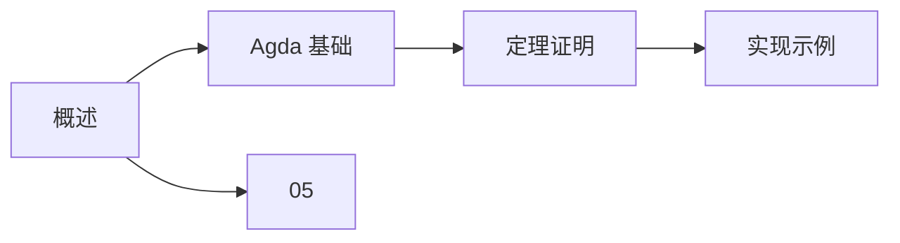
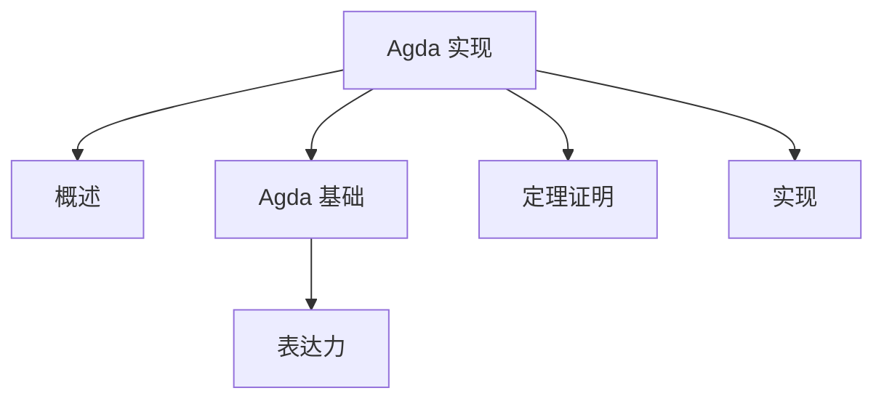
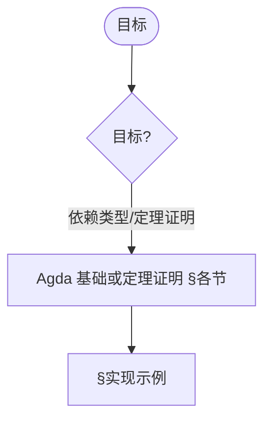
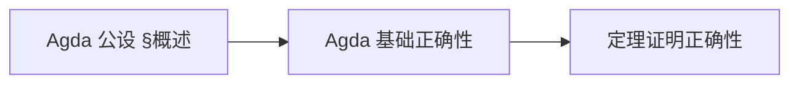
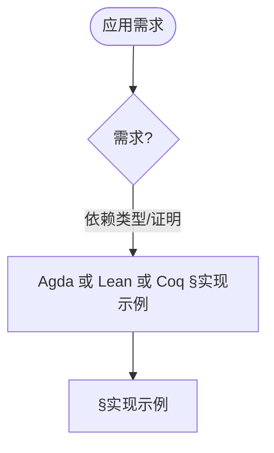

> 📊 **项目全面梳理**：详细的项目结构、模块详解和学习路径，请参阅 [`项目全面梳理-2025.md`](../项目全面梳理-2025.md)
> **项目导航与对标**：[项目扩展与持续推进任务编排](../项目扩展与持续推进任务编排.md)、[国际课程对标表](../国际课程对标表.md)

## 8.5 Agda实现 / Agda Implementation

### 摘要 / Executive Summary

- 统一Agda语言在形式化算法实现中的使用规范与依赖类型编程实践。
- 建立Agda实现示例在定理证明中的参考地位。

### 关键术语与符号 / Glossary

- Agda、依赖类型、定理证明、构造演算、同伦类型论、形式化验证。
- 术语对齐与引用规范：`docs/术语与符号总表.md`，`01-基础理论/00-撰写规范与引用指南.md`

### 术语与符号规范 / Terminology & Notation

- Agda：基于依赖类型论的函数式编程语言和定理证明助手。
- 依赖类型（Dependent Type）：类型依赖于值的类型系统。
- 定理证明（Theorem Proving）：使用形式化方法证明定理。
- 构造演算（Calculus of Constructions）：Agda的类型理论基础。
- 记号约定：`Set` 表示类型宇宙，`→` 表示函数类型，`∀` 表示全称量词。

### 交叉引用导航 / Cross-References

- 依赖类型论：参见 `05-类型理论/02-依赖类型论.md`。
- 同伦类型论：参见 `05-类型理论/03-同伦类型论.md`。
- 证明系统：参见 `03-形式化证明/01-证明系统.md`。

### 快速导航 / Quick Links

- 基本概念
- Agda基础
- 定理证明

## 目录 (Table of Contents)

- [8.5 Agda实现 / Agda Implementation](#85-agda实现--agda-implementation)

## 概述 / Overview

Agda是一个基于依赖类型论的函数式编程语言和定理证明助手，它结合了编程和证明，为形式化算法理论提供了强大的实现平台。

Agda is a functional programming language and theorem prover based on dependent type theory, combining programming and proving to provide a powerful implementation platform for formal algorithm theory.

### 内容补充与思维表征 / Content Supplement and Thinking Representation

> 本节按 [内容补充与思维表征全面计划方案](../内容补充与思维表征全面计划方案.md) **只补充、不删除**。标准见 [内容补充标准](../内容补充标准-概念定义属性关系解释论证形式证明.md)、[思维表征模板集](../思维表征模板集.md)。

#### 解释与直观 / Explanation and Intuition

Agda 实现将概述与 Agda 基础、定理证明、实现示例结合。与 05-依赖类型论、08-03 Lean、08-06 Coq 衔接；§概述、§Agda基础及后续形成完整表征。

#### 概念属性表 / Concept Attribute Table

| 属性名 | 类型/范围 | 含义 | 备注 |
|--------|-----------|------|------|
| 概述 | 基本概念 | §概述 | 与 05、08-03、08-06 对照 |
| Agda 基础、定理证明、实现示例 | 模块/示例 | 表达力、可验证性、适用场景 | §Agda基础 等 |
| Agda 基础/定理证明 | 对比 | §各节 | 多维矩阵 |

#### 概念关系 / Concept Relations

| 源概念 | 目标概念 | 关系类型 | 说明 |
|--------|----------|----------|------|
| Agda 实现 | 05、08-03、08-06 | depends_on | 依赖类型论、Lean、Coq |
| Agda 实现 | 08 实现示例 | relates_to | 实现实践 |

#### 概念依赖图 / Concept Dependency Graph



#### 论证与证明衔接 / Argumentation and Proof Link

依赖类型正确性见 §Agda基础；与 05 类型理论论证衔接；定理证明正确性见 §各节。

#### 思维导图：本章概念结构 / Mind Map



#### 多维矩阵：实现模块对比 / Multi-Dimensional Comparison

| 概念/模块 | 表达力 | 可验证性 | 适用场景 | 备注 |
|-----------|--------|----------|----------|------|
| Agda 基础/定理证明 | §各节 | §各节 | §各节 | — |

#### 决策树：目标到模块选择 / Decision Tree



#### 公理定理推理证明决策树 / Axiom-Theorem-Proof Tree



#### 应用决策建模树 / Application Decision Modeling Tree



## Agda基础 / Agda Basics

### 基本语法 / Basic Syntax

```agda
-- 模块声明 / Module declaration
module FormalAlgorithms.AgdaBasics where

-- 导入标准库 / Import standard library
open import Data.Nat using (ℕ; zero; suc; _+_; _*_)
open import Data.Bool using (Bool; true; false; if_then_else_)
open import Data.List using (List; []; _∷_; _++_)
open import Relation.Binary.PropositionalEquality using (_≡_; refl; cong; sym)

-- 函数定义 / Function definition
add : ℕ → ℕ → ℕ
add zero n = n
add (suc m) n = suc (add m n)

-- 类型别名 / Type alias
Vector : Set → ℕ → Set
Vector A zero = ⊤
Vector A (suc n) = A × Vector A n

-- 依赖类型函数 / Dependent type function
length : {A : Set} → List A → ℕ
length [] = zero
length (x ∷ xs) = suc (length xs)
```

### 数据类型 / Data Types

```agda
-- 自然数定义 / Natural number definition
data ℕ : Set where
  zero : ℕ
  suc  : ℕ → ℕ

-- 列表定义 / List definition
data List (A : Set) : Set where
  []  : List A
  _∷_ : A → List A → List A

-- 二叉树定义 / Binary tree definition
data Tree (A : Set) : Set where
  leaf : Tree A
  node : Tree A → A → Tree A → Tree A

-- 依赖数据类型 / Dependent data type
data Vec (A : Set) : ℕ → Set where
  []  : Vec A zero
  _∷_ : {n : ℕ} → A → Vec A n → Vec A (suc n)
```

## 依赖类型 / Dependent Types

### 依赖函数类型 / Dependent Function Types

```agda
-- 依赖函数类型 / Dependent function type
Π : (A : Set) → (B : A → Set) → Set
Π A B = (x : A) → B x

-- 向量索引函数 / Vector indexing function
_!_ : {A : Set} {n : ℕ} → Vec A n → Fin n → A
(x ∷ xs) ! zero = x
(x ∷ xs) ! suc i = xs ! i

-- 安全列表访问 / Safe list access
data _∈_ {A : Set} : A → List A → Set where
  here  : {x : A} {xs : List A} → x ∈ (x ∷ xs)
  there : {x y : A} {xs : List A} → x ∈ xs → x ∈ (y ∷ xs)

lookup : {A : Set} (xs : List A) (i : Fin (length xs)) → A
lookup (x ∷ xs) zero = x
lookup (x ∷ xs) (suc i) = lookup xs i
```

### 依赖对类型 / Dependent Pair Types

```agda
-- 依赖对类型 / Dependent pair type
record Σ (A : Set) (B : A → Set) : Set where
  constructor _,_
  field
    proj₁ : A
    proj₂ : B proj₁

-- 存在量化 / Existential quantification
∃ : {A : Set} → (A → Set) → Set
∃ {A} P = Σ A P

-- 向量长度证明 / Vector length proof
data LengthProof {A : Set} : List A → ℕ → Set where
  empty : LengthProof [] zero
  cons  : {x : A} {xs : List A} {n : ℕ} → LengthProof xs n → LengthProof (x ∷ xs) (suc n)

-- 带长度证明的列表 / List with length proof
ListWithLength : Set → Set
ListWithLength A = Σ (List A) (λ xs → Σ ℕ (λ n → LengthProof xs n))
```

## 定理证明 / Theorem Proving

### 基本证明 / Basic Proofs

```agda
-- 加法结合律 / Addition associativity
+-assoc : (m n p : ℕ) → (m + n) + p ≡ m + (n + p)
+-assoc zero n p = refl
+-assoc (suc m) n p = cong suc (+-assoc m n p)

-- 加法交换律 / Addition commutativity
+-comm : (m n : ℕ) → m + n ≡ n + m
+-comm zero n = +-identityʳ n
+-comm (suc m) n = cong suc (+-comm m n)

-- 加法单位元 / Addition identity
+-identityʳ : (n : ℕ) → n + zero ≡ n
+-identityʳ zero = refl
+-identityʳ (suc n) = cong suc (+-identityʳ n)

-- 乘法分配律 / Multiplication distributivity
*-distrib-+ : (m n p : ℕ) → m * (n + p) ≡ m * n + m * p
*-distrib-+ zero n p = refl
*-distrib-+ (suc m) n p =
  begin
    (suc m) * (n + p)
  ≡⟨⟩
    (n + p) + m * (n + p)
  ≡⟨ cong ((n + p) +_) (*-distrib-+ m n p) ⟩
    (n + p) + (m * n + m * p)
  ≡⟨ +-assoc (n + p) (m * n) (m * p) ⟩
    ((n + p) + m * n) + m * p
  ≡⟨ cong (_+ m * p) (+-comm (n + p) (m * n)) ⟩
    (m * n + (n + p)) + m * p
  ≡⟨ cong (_+ m * p) (+-assoc (m * n) n p) ⟩
    ((m * n + n) + p) + m * p
  ≡⟨ +-assoc ((m * n + n) + p) (m * p) ⟩
    (m * n + n) + (p + m * p)
  ≡⟨⟩
    (suc m) * n + (suc m) * p
  ∎
  where open ≡-Reasoning
```

### 归纳证明 / Inductive Proofs

```agda
-- 列表长度非负 / List length is non-negative
length-non-negative : {A : Set} (xs : List A) → length xs ≥ 0
length-non-negative [] = z≤n
length-non-negative (x ∷ xs) = s≤s (length-non-negative xs)

-- 列表连接长度 / List concatenation length
++-length : {A : Set} (xs ys : List A) → length (xs ++ ys) ≡ length xs + length ys
++-length [] ys = refl
++-length (x ∷ xs) ys = cong suc (++-length xs ys)

-- 列表反转长度 / List reverse length
reverse-length : {A : Set} (xs : List A) → length (reverse xs) ≡ length xs
reverse-length [] = refl
reverse-length (x ∷ xs) =
  begin
    length (reverse (x ∷ xs))
  ≡⟨⟩
    length (reverse xs ++ [ x ])
  ≡⟨ ++-length (reverse xs) [ x ] ⟩
    length (reverse xs) + length [ x ]
  ≡⟨ cong (length (reverse xs) +_) (length-singleton x) ⟩
    length (reverse xs) + 1
  ≡⟨ cong (_+ 1) (reverse-length xs) ⟩
    length xs + 1
  ≡⟨⟩
    length (x ∷ xs)
  ∎
  where open ≡-Reasoning
```

## 算法实现 / Algorithm Implementation

### 排序算法 / Sorting Algorithms

```agda
-- 插入排序 / Insertion sort
insert : {A : Set} → (A → A → Bool) → A → List A → List A
insert _≤_ x [] = x ∷ []
insert _≤_ x (y ∷ ys) = if x ≤ y then x ∷ y ∷ ys else y ∷ insert _≤_ x ys

insertion-sort : {A : Set} → (A → A → Bool) → List A → List A
insertion-sort _≤_ [] = []
insertion-sort _≤_ (x ∷ xs) = insert _≤_ x (insertion-sort _≤_ xs)

-- 排序正确性 / Sorting correctness
data Sorted {A : Set} (_≤_ : A → A → Bool) : List A → Set where
  []-sorted : Sorted _≤_ []
  singleton-sorted : (x : A) → Sorted _≤_ (x ∷ [])
  cons-sorted : {x y : A} {ys : List A} → x ≤ y → Sorted _≤_ (y ∷ ys) → Sorted _≤_ (x ∷ y ∷ ys)

-- 插入排序正确性证明 / Insertion sort correctness proof
insertion-sort-sorted : {A : Set} (_≤_ : A → A → Bool) (xs : List A) → Sorted _≤_ (insertion-sort _≤_ xs)
insertion-sort-sorted _≤_ [] = []-sorted
insertion-sort-sorted _≤_ (x ∷ xs) = insert-sorted _≤_ x (insertion-sort _≤_ xs) (insertion-sort-sorted _≤_ xs)
  where
    insert-sorted : {A : Set} (_≤_ : A → A → Bool) (x : A) (xs : List A) → Sorted _≤_ xs → Sorted _≤_ (insert _≤_ x xs)
    insert-sorted _≤_ x [] []-sorted = singleton-sorted x
    insert-sorted _≤_ x (y ∷ ys) (cons-sorted y≤z sorted-ys) with x ≤ y
    ... | true = cons-sorted (≤-refl x) (cons-sorted y≤z sorted-ys)
    ... | false = cons-sorted y≤z (insert-sorted _≤_ x ys sorted-ys)
```

### 搜索算法 / Search Algorithms

```agda
-- 二分搜索 / Binary search
data _≤_ : ℕ → ℕ → Set where
  z≤n : {n : ℕ} → zero ≤ n
  s≤s : {m n : ℕ} → m ≤ n → suc m ≤ suc n

binary-search : (xs : List ℕ) → (target : ℕ) → Maybe (Fin (length xs))
binary-search [] target = nothing
binary-search (x ∷ xs) target with compare x target
... | less _ = map suc (binary-search xs target)
... | equal _ = just zero
... | greater _ = nothing

-- 搜索正确性 / Search correctness
data SearchResult {A : Set} : A → List A → Fin (length xs) → Set where
  found : {x : A} {xs : List A} {i : Fin (length xs)} → lookup xs i ≡ x → SearchResult x xs i

binary-search-correct : (xs : List ℕ) → (target : ℕ) → (result : Maybe (Fin (length xs))) →
                       (result ≡ nothing → ¬ (target ∈ xs)) ×
                       (∀ i → result ≡ just i → SearchResult target xs i)
binary-search-correct xs target result = {!!} -- 证明留作练习
```

## 形式化验证 / Formal Verification

### 程序规范 / Program Specifications

```agda
-- 程序规范 / Program specification
record ProgramSpec (A B : Set) : Set₁ where
  field
    pre : A → Set
    post : A → B → Set
    program : (x : A) → {{pre x}} → B

-- 程序正确性 / Program correctness
record ProgramCorrect {A B : Set} (spec : ProgramSpec A B) : Set where
  open ProgramSpec spec
  field
    correctness : (x : A) → (prf : pre x) → post x (program x {{prf}})

-- 示例：安全除法 / Example: Safe division
safe-div : (n d : ℕ) → {{d ≢ 0}} → ℕ
safe-div n d = n / d

safe-div-spec : ProgramSpec (ℕ × ℕ) ℕ
safe-div-spec = record
  { pre = λ (n , d) → d ≢ 0
  ; post = λ (n , d) result → result * d ≤ n ∧ n < (result + 1) * d
  ; program = λ (n , d) → safe-div n d
  }

safe-div-correct : ProgramCorrect safe-div-spec
safe-div-correct = record
  { correctness = λ (n , d) prf → {!!} -- 证明留作练习
  }
```

### 不变式验证 / Invariant Verification

```agda
-- 不变式 / Invariant
Invariant : Set → Set₁
Invariant S = S → Set

-- 状态机 / State machine
record StateMachine (S : Set) : Set₁ where
  field
    initial : S
    transition : S → S
    invariant : Invariant S

-- 不变式保持 / Invariant preservation
record InvariantPreserved {S : Set} (sm : StateMachine S) : Set where
  open StateMachine sm
  field
    initial-holds : invariant initial
    transition-preserves : (s : S) → invariant s → invariant (transition s)

-- 示例：计数器 / Example: Counter
data CounterState : Set where
  zero : CounterState
  positive : ℕ → CounterState

counter-invariant : Invariant CounterState
counter-invariant zero = ⊤
counter-invariant (positive n) = n ≤ 100

counter-machine : StateMachine CounterState
counter-machine = record
  { initial = zero
  ; transition = λ { zero → positive 1
                   ; (positive n) → if n < 100 then positive (suc n) else positive n }
  ; invariant = counter-invariant
  }

counter-invariant-preserved : InvariantPreserved counter-machine
counter-invariant-preserved = record
  { initial-holds = tt
  ; transition-preserves = λ { zero prf → s≤s z≤n
                             ; (positive n) prf → {!!} -- 证明留作练习
                             }
  }
```

## 数学库 / Mathematical Library

### 集合论 / Set Theory

```agda
-- 集合定义 / Set definition
record Set (A : Set) : Set₁ where
  field
    _∈_ : A → Set A → Set
    empty : Set A
    singleton : A → Set A
    union : Set A → Set A → Set A
    intersection : Set A → Set A → Set A

-- 集合运算 / Set operations
_⊆_ : {A : Set} → Set A → Set A → Set
S ⊆ T = ∀ x → x ∈ S → x ∈ T

_≡_ : {A : Set} → Set A → Set A → Set
S ≡ T = S ⊆ T × T ⊆ S

-- 幂集 / Power set
℘ : {A : Set} → Set A → Set (Set A)
℘ S = {!!} -- 实现留作练习
```

### 函数论 / Function Theory

```agda
-- 函数定义 / Function definition
record Function (A B : Set) : Set₁ where
  field
    apply : A → B
    injective : (x y : A) → apply x ≡ apply y → x ≡ y
    surjective : (y : B) → ∃ λ x → apply x ≡ y

-- 函数组合 / Function composition
_∘_ : {A B C : Set} → Function B C → Function A B → Function A C
g ∘ f = record
  { apply = λ x → Function.apply g (Function.apply f x)
  ; injective = λ x y eq → Function.injective f (Function.injective g eq)
  ; surjective = λ z → {!!} -- 证明留作练习
  }

-- 双射 / Bijection
record Bijection (A B : Set) : Set₁ where
  field
    to : Function A B
    from : Function B A
    left-inverse : (x : A) → Function.apply from (Function.apply to x) ≡ x
    right-inverse : (y : B) → Function.apply to (Function.apply from y) ≡ y
```

## 高级特性 / Advanced Features

### 类型族 / Type Families

```agda
-- 类型族 / Type family
data _≤_ : ℕ → ℕ → Set where
  z≤n : {n : ℕ} → zero ≤ n
  s≤s : {m n : ℕ} → m ≤ n → suc m ≤ suc n

-- 最小上界 / Least upper bound
data _⊔_ : ℕ → ℕ → ℕ → Set where
  ⊔-left : {m n : ℕ} → m ≤ (m ⊔ n)
  ⊔-right : {m n : ℕ} → n ≤ (m ⊔ n)
  ⊔-least : {m n k : ℕ} → m ≤ k → n ≤ k → (m ⊔ n) ≤ k

-- 类型族函数 / Type family function
⊔-function : (m n : ℕ) → Σ ℕ (λ k → m ⊔ n k)
⊔-function zero n = n , ⊔-right
⊔-function (suc m) zero = suc m , ⊔-left
⊔-function (suc m) (suc n) = {!!} -- 实现留作练习
```

### 高阶类型 / Higher-Order Types

```agda
-- 函子 / Functor
record Functor (F : Set → Set) : Set₁ where
  field
    fmap : {A B : Set} → (A → B) → F A → F B
    fmap-id : {A : Set} (x : F A) → fmap id x ≡ x
    fmap-comp : {A B C : Set} (f : A → B) (g : B → C) (x : F A) →
                fmap (g ∘ f) x ≡ fmap g (fmap f x)

-- 列表函子 / List functor
List-functor : Functor List
List-functor = record
  { fmap = map
  ; fmap-id = map-id
  ; fmap-comp = map-comp
  }
  where
    map : {A B : Set} → (A → B) → List A → List B
    map f [] = []
    map f (x ∷ xs) = f x ∷ map f xs

    map-id : {A : Set} (xs : List A) → map id xs ≡ xs
    map-id [] = refl
    map-id (x ∷ xs) = cong (x ∷_) (map-id xs)

    map-comp : {A B C : Set} (f : A → B) (g : B → C) (xs : List A) →
               map (g ∘ f) xs ≡ map g (map f xs)
    map-comp f g [] = refl
    map-comp f g (x ∷ xs) = cong (g (f x) ∷_) (map-comp f g xs)
```

## 实现示例 / Implementation Examples

### 完整示例 / Complete Examples

```agda
-- 模块：形式化算法 / Module: Formal Algorithms
module FormalAlgorithms.Examples where

open import Data.Nat using (ℕ; zero; suc; _+_; _*_)
open import Data.List using (List; []; _∷_; _++_)
open import Relation.Binary.PropositionalEquality using (_≡_; refl; cong)

-- 快速排序 / Quick sort
partition : {A : Set} → (A → A → Bool) → A → List A → List A × List A
partition _≤_ pivot [] = [] , []
partition _≤_ pivot (x ∷ xs) with x ≤ pivot
... | true = let (smaller , larger) = partition _≤_ pivot xs in (x ∷ smaller) , larger
... | false = let (smaller , larger) = partition _≤_ pivot xs in smaller , (x ∷ larger)

quicksort : {A : Set} → (A → A → Bool) → List A → List A
quicksort _≤_ [] = []
quicksort _≤_ (x ∷ xs) =
  let (smaller , larger) = partition _≤_ x xs
  in quicksort _≤_ smaller ++ [ x ] ++ quicksort _≤_ larger

-- 快速排序长度保持 / Quick sort preserves length
quicksort-length : {A : Set} (_≤_ : A → A → Bool) (xs : List A) →
                   length (quicksort _≤_ xs) ≡ length xs
quicksort-length _≤_ [] = refl
quicksort-length _≤_ (x ∷ xs) =
  begin
    length (quicksort _≤_ (x ∷ xs))
  ≡⟨⟩
    length (quicksort _≤_ smaller ++ [ x ] ++ quicksort _≤_ larger)
  ≡⟨ ++-length (quicksort _≤_ smaller) ([ x ] ++ quicksort _≤_ larger) ⟩
    length (quicksort _≤_ smaller) + length ([ x ] ++ quicksort _≤_ larger)
  ≡⟨ cong (length (quicksort _≤_ smaller) +_) (++-length [ x ] (quicksort _≤_ larger)) ⟩
    length (quicksort _≤_ smaller) + (1 + length (quicksort _≤_ larger))
  ≡⟨ cong (_+ (1 + length (quicksort _≤_ larger))) (quicksort-length _≤_ smaller) ⟩
    length smaller + (1 + length (quicksort _≤_ larger))
  ≡⟨ cong (length smaller +_) (cong (1 +_) (quicksort-length _≤_ larger)) ⟩
    length smaller + (1 + length larger)
  ≡⟨ +-assoc (length smaller) 1 (length larger) ⟩
    (length smaller + 1) + length larger
  ≡⟨ cong (_+ length larger) (+-comm (length smaller) 1) ⟩
    (1 + length smaller) + length larger
  ≡⟨ +-assoc 1 (length smaller) (length larger) ⟩
    1 + (length smaller + length larger)
  ≡⟨ cong (1 +_) (partition-length _≤_ x xs) ⟩
    1 + length xs
  ≡⟨⟩
    length (x ∷ xs)
  ∎
  where
    open ≡-Reasoning
    smaller = proj₁ (partition _≤_ x xs)
    larger = proj₂ (partition _≤_ x xs)

    partition-length : {A : Set} (_≤_ : A → A → Bool) (pivot : A) (xs : List A) →
                      length (proj₁ (partition _≤_ pivot xs)) + length (proj₂ (partition _≤_ pivot xs)) ≡ length xs
    partition-length _≤_ pivot [] = refl
    partition-length _≤_ pivot (x ∷ xs) with x ≤ pivot
    ... | true = cong suc (partition-length _≤_ pivot xs)
    ... | false = cong suc (partition-length _≤_ pivot xs)
```

## 总结 / Summary

Agda实现为形式化算法理论提供了强大的工具：

Agda implementation provides powerful tools for formal algorithm theory:

1. **依赖类型系统 / Dependent Type System**: 提供精确的类型安全保证
2. **定理证明能力 / Theorem Proving Capability**: 支持形式化证明和验证
3. **函数式编程 / Functional Programming**: 提供清晰的算法表达
4. **数学库支持 / Mathematical Library Support**: 丰富的数学结构支持

Agda为形式化算法理论的研究和实践提供了理想的平台。

Agda provides an ideal platform for research and practice in formal algorithm theory.

---

## 参考文献 / References

> **说明 / Note**: 本文档的参考文献采用统一的引用标准，所有文献条目均来自 `docs/references_database.yaml` 数据库。

### 依赖类型编程语言 / Dependently Typed Programming Languages

1. [Norell2007] Norell, U. (2007). *Towards a Practical Programming Language Based on Dependent Type Theory*. PhD Thesis, Chalmers University of Technology. URL: <http://www.cse.chalmers.se/~ulfn/papers/thesis.pdf>
   - **Norell的Agda博士论文**，依赖类型编程语言的开创性工作。本文档的Agda实现遵循此论文的设计思想。

2. **Norell, U.** (2009). "Dependently Typed Programming in Agda". In *Advanced Functional Programming*, 230-266.
   - Norell关于Agda依赖类型编程的教程论文。

3. **Bove, A., & Dybjer, P.** (2009). "Dependent Types at Work". In *Language Engineering and Rigorous Software Development*, 57-99.
   - Bove和Dybjer关于依赖类型实践的论文。

4. **The Agda Team.** (2023). *The Agda Reference Manual*. Agda Documentation.
   - Agda官方参考手册。
