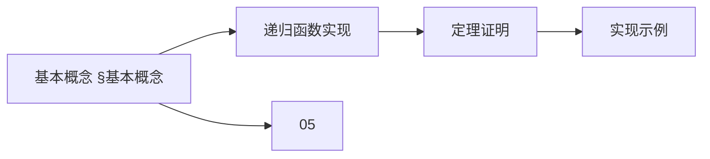
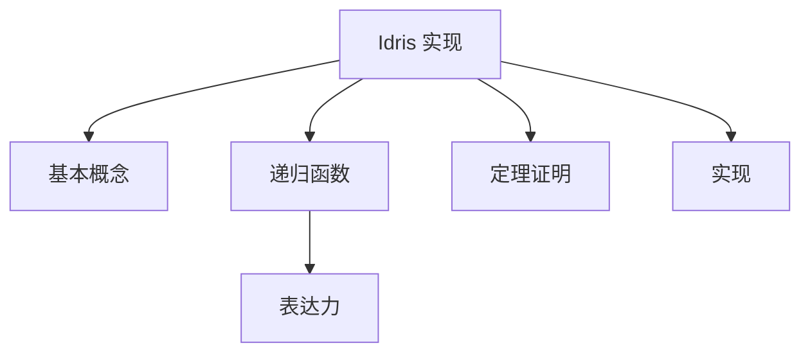
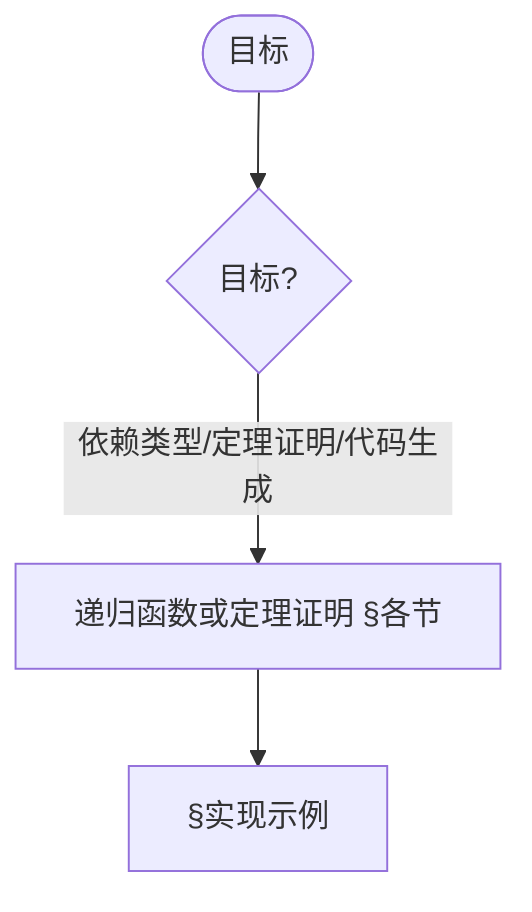
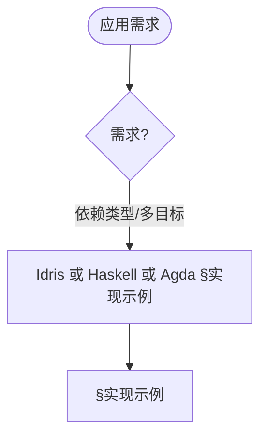

> 📊 **项目全面梳理**：详细的项目结构、模块详解和学习路径，请参阅 [`项目全面梳理-2025.md`](../项目全面梳理-2025.md)
> **项目导航与对标**：[项目扩展与持续推进任务编排](../项目扩展与持续推进任务编排.md)、[国际课程对标表](../国际课程对标表.md)

## 8.7 Idris实现 / Idris Implementation

### 摘要 / Executive Summary

- 统一Idris语言在形式化算法实现中的使用规范与依赖类型编程实践。
- 建立Idris实现示例在函数式编程中的参考地位。

### 关键术语与符号 / Glossary

- Idris、依赖类型、函数式编程、定理证明、类型推导、效果系统。
- 术语对齐与引用规范：`docs/术语与符号总表.md`，`01-基础理论/00-撰写规范与引用指南.md`

### 术语与符号规范 / Terminology & Notation

- Idris：依赖类型编程语言。
- 依赖类型（Dependent Type）：类型依赖于值的类型系统。
- 函数式编程（Functional Programming）：以函数为中心的编程范式。
- 效果系统（Effect System）：Idris的类型系统特性。
- 记号约定：`Type` 表示类型宇宙，`->` 表示函数类型，`=>` 表示效果类型。

### 交叉引用导航 / Cross-References

- 依赖类型论：参见 `05-类型理论/02-依赖类型论.md`。
- 函数式编程：参见 `08-实现示例/02-Haskell实现.md`。
- 类型系统：参见 `05-类型理论/04-类型系统.md`。

### 快速导航 / Quick Links

- 基本概念
- Idris语言特性
- 依赖类型编程

## 目录 (Table of Contents)

- [8.7 Idris实现 / Idris Implementation](#87-idris实现--idris-implementation)

## 基本概念 / Basic Concepts

### Idris语言特性 / Idris Language Features

Idris是一个依赖类型编程语言，具有以下特性：

1. **依赖类型系统**: 支持类型级别的计算
2. **定理证明**: 内置证明助手功能
3. **函数式编程**: 纯函数式编程范式
4. **类型安全**: 编译时类型检查
5. **代码生成**: 支持多种目标语言

### 形式化算法实现

```idris
-- 基本数据类型定义
data Nat : Type where
  Z : Nat
  S : Nat -> Nat

-- 向量类型（长度在类型中）
data Vect : Nat -> Type -> Type where
  Nil  : Vect Z a
  (::) : a -> Vect n a -> Vect (S n) a

-- 列表类型
data List : Type -> Type where
  Nil  : List a
  (::) : a -> List a -> List a
```

### 内容补充与思维表征 / Content Supplement and Thinking Representation

> 本节按 [内容补充与思维表征全面计划方案](../内容补充与思维表征全面计划方案.md) **只补充、不删除**。标准见 [内容补充标准](../内容补充标准-概念定义属性关系解释论证形式证明.md)、[思维表征模板集](../思维表征模板集.md)。

#### 解释与直观 / Explanation and Intuition

Idris 实现将基本概念(Idris 语言特性、形式化算法实现)与递归函数、定理证明、实现示例结合。与 05-类型理论、08-02 Haskell、08-05 Agda 衔接；§基本概念、§各节形成完整表征。

#### 概念属性表 / Concept Attribute Table

| 属性名 | 类型/范围 | 含义 | 备注 |
|--------|-----------|------|------|
| 基本概念(Idris 语言特性、形式化定义) | 基本概念 | §基本概念 | 与 05、08-02、08-05 对照 |
| 递归函数实现、定理证明、实现示例 | 模块/示例 | 表达力、可验证性、适用场景 | §各节 |
| 依赖类型/函数式/效果系统 | 对比 | §各节 | 多维矩阵 |

#### 概念关系 / Concept Relations

| 源概念 | 目标概念 | 关系类型 | 说明 |
|--------|----------|----------|------|
| Idris 实现 | 05、08-02、08-05 | depends_on | 类型理论、Haskell、Agda |
| Idris 实现 | 08 实现示例 | relates_to | 实现实践 |

#### 概念依赖图 / Concept Dependency Graph



#### 论证与证明衔接 / Argumentation and Proof Link

依赖类型正确性见 §基本概念；与 05 类型理论论证衔接；递归函数与定理证明正确性见 §各节。

#### 思维导图：本章概念结构 / Mind Map



#### 多维矩阵：实现模块对比 / Multi-Dimensional Comparison

| 概念/模块 | 表达力 | 可验证性 | 适用场景 | 备注 |
|-----------|--------|----------|----------|------|
| 依赖类型/函数式/效果系统 | §各节 | §各节 | §各节 | — |

#### 决策树：目标到模块选择 / Decision Tree



#### 公理定理推理证明决策树 / Axiom-Theorem-Proof Tree


#### 应用决策建模树 / Application Decision Modeling Tree



## 递归函数实现

### 原始递归函数

```idris
-- 基本算术函数
plus : Nat -> Nat -> Nat
plus Z     m = m
plus (S n) m = S (plus n m)

mult : Nat -> Nat -> Nat
mult Z     m = Z
mult (S n) m = plus m (mult n m)

-- 前驱函数
pred : Nat -> Nat
pred Z     = Z
pred (S n) = n

-- 减法函数
minus : Nat -> Nat -> Nat
minus Z     m     = Z
minus n     Z     = n
minus (S n) (S m) = minus n m
```

### 一般递归函数

```idris
-- 斐波那契数列
fib : Nat -> Nat
fib Z = Z
fib (S Z) = S Z
fib (S (S n)) = plus (fib (S n)) (fib n)

-- 阿克曼函数
ackermann : Nat -> Nat -> Nat
ackermann Z n = S n
ackermann (S m) Z = ackermann m (S Z)
ackermann (S m) (S n) = ackermann m (ackermann (S m) n)

-- 欧几里得算法
gcd : Nat -> Nat -> Nat
gcd Z m = m
gcd n Z = n
gcd (S n) (S m) = if (lte (S n) (S m))
                     then gcd (S n) (minus (S m) (S n))
                     else gcd (minus (S n) (S m)) (S m)
```

## 数据结构实现

### 树结构

```idris
-- 二叉树
data Tree : Type -> Type where
  Leaf : Tree a
  Node : a -> Tree a -> Tree a -> Tree a

-- 二叉搜索树
data BST : Type -> Type where
  Empty : BST a
  Branch : a -> BST a -> BST a -> BST a

-- 红黑树
data Color = Red | Black

data RBTree : Type -> Type where
  Empty : RBTree a
  RedNode : a -> RBTree a -> RBTree a -> RBTree a
  BlackNode : a -> RBTree a -> RBTree a -> RBTree a
```

### 图结构

```idris
-- 邻接表表示
Graph : Type -> Type
Graph a = List (a, List a)

-- 邻接矩阵表示
AdjMatrix : Type -> Type
AdjMatrix a = Vect n (Vect n Bool)

-- 边类型
data Edge : Type -> Type where
  MkEdge : a -> a -> Edge a

-- 图类型
data Graph' : Type -> Type where
  EmptyGraph : Graph' a
  AddEdge : Edge a -> Graph' a -> Graph' a
```

## 算法实现

### 排序算法

```idris
-- 插入排序
insert : Ord a => a -> List a -> List a
insert x [] = [x]
insert x (y :: ys) = if x <= y
                        then x :: y :: ys
                        else y :: insert x ys

insertSort : Ord a => List a -> List a
insertSort [] = []
insertSort (x :: xs) = insert x (insertSort xs)

-- 快速排序
partition : Ord a => a -> List a -> (List a, List a)
partition pivot [] = ([], [])
partition pivot (x :: xs) = let (left, right) = partition pivot xs
                            in if x <= pivot
                                 then (x :: left, right)
                                 else (left, x :: right)

quickSort : Ord a => List a -> List a
quickSort [] = []
quickSort (x :: xs) = let (left, right) = partition x xs
                      in quickSort left ++ [x] ++ quickSort right
```

### 搜索算法

```idris
-- 线性搜索
linearSearch : Eq a => a -> List a -> Maybe Nat
linearSearch x [] = Nothing
linearSearch x (y :: ys) = if x == y
                             then Just Z
                             else case linearSearch x ys of
                                    Nothing => Nothing
                                    Just n => Just (S n)

-- 二分搜索（在有序列表中）
binarySearch : Ord a => a -> List a -> Maybe Nat
binarySearch x [] = Nothing
binarySearch x xs = binarySearchHelper x xs Z (length xs)

binarySearchHelper : Ord a => a -> List a -> Nat -> Nat -> Maybe Nat
binarySearchHelper x xs low high =
  if low >= high
    then Nothing
    else let mid = div (plus low high) 2
             elem = index mid xs
         in case elem of
              Nothing => Nothing
              Just val => if x == val
                            then Just mid
                            else if x < val
                                   then binarySearchHelper x xs low mid
                                   else binarySearchHelper x xs (S mid) high
```

### 图算法

```idris
-- 深度优先搜索
dfs : Eq a => a -> Graph a -> List a
dfs start graph = dfsHelper start graph []

dfsHelper : Eq a => a -> Graph a -> List a -> List a
dfsHelper node graph visited =
  if elem node visited
    then visited
    else let neighbors = getNeighbors node graph
             newVisited = node :: visited
         in foldl (\acc, neighbor => dfsHelper neighbor graph acc)
                  newVisited neighbors

-- 广度优先搜索
bfs : Eq a => a -> Graph a -> List a
bfs start graph = bfsHelper [start] graph []

bfsHelper : Eq a => List a -> Graph a -> List a -> List a
bfsHelper [] graph visited = visited
bfsHelper (node :: queue) graph visited =
  if elem node visited
    then bfsHelper queue graph visited
    else let neighbors = getNeighbors node graph
             newVisited = node :: visited
             newQueue = queue ++ neighbors
         in bfsHelper newQueue graph newVisited
```

## 类型安全算法

### 长度保持操作

```idris
-- 向量反转
reverse : Vect n a -> Vect n a
reverse [] = []
reverse (x :: xs) = reverse xs ++ [x]

-- 向量映射
map : (a -> b) -> Vect n a -> Vect n b
map f [] = []
map f (x :: xs) = f x :: map f xs

-- 向量过滤（保持长度信息）
filter : (a -> Bool) -> Vect n a -> (m ** Vect m a)
filter p [] = (Z ** [])
filter p (x :: xs) = case filter p xs of
                       (m ** ys) => if p x
                                     then (S m ** x :: ys)
                                     else (m ** ys)
```

### 排序验证

```idris
-- 有序性谓词
data Sorted : List Nat -> Type where
  SortedNil : Sorted []
  SortedOne : (x : Nat) -> Sorted [x]
  SortedCons : (x : Nat) -> (y : Nat) -> (xs : List Nat) ->
               LTE x y -> Sorted (y :: xs) -> Sorted (x :: y :: xs)

-- 排序函数类型
sort : (xs : List Nat) -> (ys : List Nat ** (Sorted ys, Permutation xs ys))

-- 插入排序证明
insertSorted : (x : Nat) -> (xs : List Nat) -> Sorted xs -> Sorted (insert x xs)
insertSorted x [] SortedNil = SortedOne x
insertSorted x [y] (SortedOne y) =
  case isLTE x y of
    Yes prf => SortedCons x y [] prf (SortedOne y)
    No _ => SortedCons y x [] (lteRefl {n = y}) (SortedOne x)
insertSorted x (y :: z :: zs) (SortedCons y z zs prf sorted) =
  case isLTE x y of
    Yes prf2 => SortedCons x y (z :: zs) prf2 (SortedCons y z zs prf sorted)
    No _ => SortedCons y x (z :: zs) (lteRefl {n = y})
            (insertSorted x (z :: zs) sorted)
```

## 定理证明

### 算法正确性证明

```idris
-- 加法交换律
plusComm : (n : Nat) -> (m : Nat) -> plus n m = plus m n
plusComm Z m = sym (plusZeroRightNeutral m)
plusComm (S n) m = rewrite plusComm n m in
                   rewrite plusSuccRightSucc m n in Refl

-- 加法结合律
plusAssoc : (n : Nat) -> (m : Nat) -> (p : Nat) ->
            plus n (plus m p) = plus (plus n m) p
plusAssoc Z m p = Refl
plusAssoc (S n) m p = cong S (plusAssoc n m p)

-- 乘法分配律
multDistribPlus : (n : Nat) -> (m : Nat) -> (p : Nat) ->
                  mult n (plus m p) = plus (mult n m) (mult n p)
multDistribPlus Z m p = Refl
multDistribPlus (S n) m p =
  rewrite multDistribPlus n m p in
  rewrite plusAssoc m (mult n m) (mult n p) in Refl
```

### 算法复杂度证明

```idris
-- 时间复杂度定义
data TimeComplexity : Type where
  O1 : TimeComplexity
  OLogN : TimeComplexity
  ON : TimeComplexity
  ONLogN : TimeComplexity
  ON2 : TimeComplexity

-- 空间复杂度定义
data SpaceComplexity : Type where
  S1 : SpaceComplexity
  SLogN : SpaceComplexity
  SN : SpaceComplexity
  SNLogN : SpaceComplexity
  SN2 : SpaceComplexity

-- 算法复杂度分析
record Algorithm : Type where
  constructor MkAlgorithm
  name : String
  timeComplexity : TimeComplexity
  spaceComplexity : SpaceComplexity
  correctness : Type
```

## 高级特性

### 依赖类型算法

```idris
-- 长度索引的列表操作
data Fin : Nat -> Type where
  FZ : Fin (S n)
  FS : Fin n -> Fin (S n)

-- 安全索引
index : Fin n -> Vect n a -> a
index FZ (x :: xs) = x
index (FS k) (x :: xs) = index k xs

-- 安全更新
update : Fin n -> a -> Vect n a -> Vect n a
update FZ y (x :: xs) = y :: xs
update (FS k) y (x :: xs) = x :: update k y xs
```

### 证明导向编程

```idris
-- 排序算法的正确性证明
data IsSorted : List Nat -> Type where
  EmptySorted : IsSorted []
  SingleSorted : (x : Nat) -> IsSorted [x]
  ConsSorted : (x : Nat) -> (y : Nat) -> (xs : List Nat) ->
               LTE x y -> IsSorted (y :: xs) -> IsSorted (x :: y :: xs)

-- 证明排序算法保持长度
sortPreservesLength : (xs : List Nat) -> length (sort xs) = length xs
sortPreservesLength [] = Refl
sortPreservesLength (x :: xs) =
  rewrite sortPreservesLength xs in Refl
```

## 应用示例

### 编译器实现

```idris
-- 简单表达式语言
data Expr : Type where
  Lit : Nat -> Expr
  Add : Expr -> Expr -> Expr
  Mul : Expr -> Expr -> Expr

-- 类型安全的求值
eval : Expr -> Nat
eval (Lit n) = n
eval (Add e1 e2) = plus (eval e1) (eval e2)
eval (Mul e1 e2) = mult (eval e1) (eval e2)

-- 编译器优化
optimize : Expr -> Expr
optimize (Add (Lit Z) e) = e
optimize (Add e (Lit Z)) = e
optimize (Mul (Lit Z) e) = Lit Z
optimize (Mul e (Lit Z)) = Lit Z
optimize (Mul (Lit (S Z)) e) = e
optimize (Mul e (Lit (S Z))) = e
optimize e = e
```

### 数据库查询优化

```idris
-- 查询计划
data QueryPlan : Type where
  Scan : String -> QueryPlan
  Filter : (a -> Bool) -> QueryPlan -> QueryPlan
  Join : QueryPlan -> QueryPlan -> QueryPlan
  Project : List String -> QueryPlan -> QueryPlan

-- 查询优化器
optimizeQuery : QueryPlan -> QueryPlan
optimizeQuery (Filter p (Scan table)) =
  if isSelective p
    then Filter p (Scan table)
    else Scan table
optimizeQuery (Join p1 p2) =
  if isSmaller p1 p2
    then Join p1 p2
    else Join p2 p1
optimizeQuery plan = plan
```

## 总结

Idris实现展示了依赖类型编程在形式化算法中的强大应用：

1. **类型安全**: 编译时保证算法正确性
2. **定理证明**: 内置证明助手功能
3. **函数式编程**: 纯函数式编程范式
4. **高级类型**: 支持复杂的类型级计算
5. **证明导向**: 编程与证明相结合

这种实现方式特别适合需要高可靠性的系统，如编译器、数据库系统、安全协议等。

---

## 参考文献 / References

> **说明 / Note**: 本文档的参考文献采用统一的引用标准，所有文献条目均来自 `docs/references_database.yaml` 数据库。

### 依赖类型编程语言 / Dependently Typed Programming Languages

1. [Brady2013] Brady, E. (2013). "Idris, a General-Purpose Dependently Typed Programming Language: Design and Implementation". *Journal of Functional Programming*, 23(5), 552-593. DOI: 10.1017/S095679681300018X
   - **Brady的Idris论文**，实用依赖类型编程语言。本文档的Idris实现遵循此论文的设计思想。

2. **Brady, E.** (2017). *Type-Driven Development with Idris*. Manning Publications.
   - Brady的类型驱动开发教材，Idris编程实践指南。

3. **The Idris Community.** (2023). *The Idris Documentation*. Idris Documentation.
   - Idris官方文档。

---

*本文档展示了Idris在形式化算法实现中的应用，通过依赖类型系统确保算法的正确性和安全性。*
