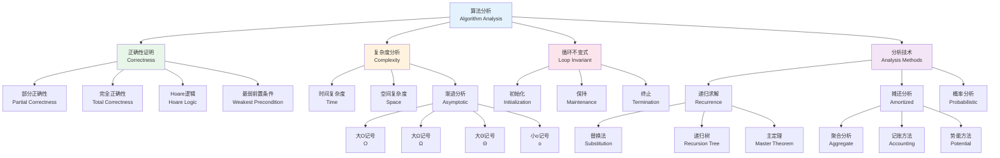
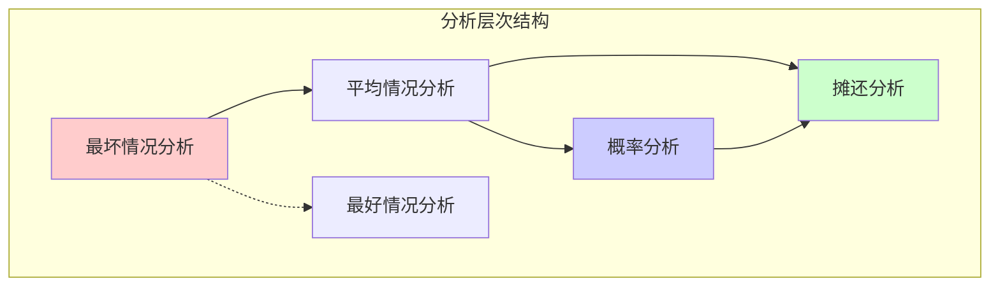
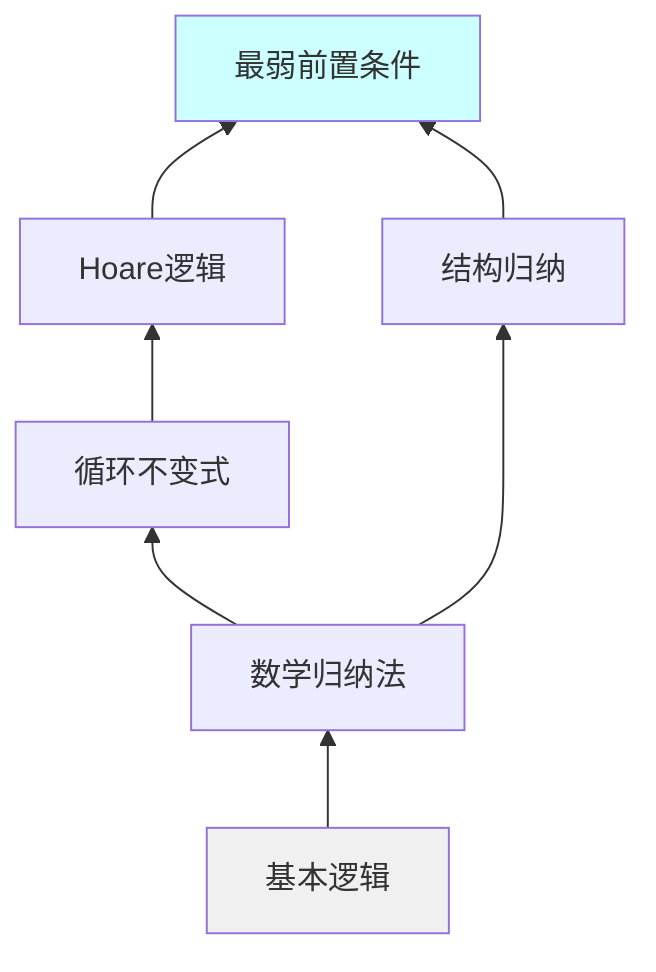
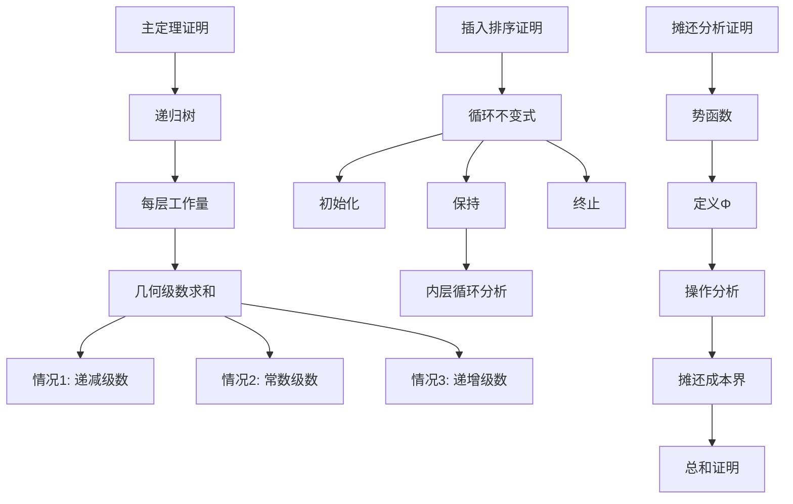

# 算法分析基础 - 六维内容补充


> **版本**: 1.0
> **创建日期**: 2026-04-19
> **最后更新**: 2026-04-19

> **模块**: 09-算法理论/01-算法基础
> **文档**: 01-算法设计理论
> **补充维度**: 概念定义、属性、关系、解释、论证、形式证明
> **对标**: MIT 6.006 / Stanford CS 161 / CMU 15-451
> **深度**: 研究生级

---

## 思维导图：算法分析基础概念结构



---

## 一、概念定义 (Concept Definition)

### 1.1 算法正确性

**定义 1.1.1** (部分正确性)

程序 $S$ 关于前置条件 $P$ 和后置条件 $Q$ 是**部分正确**的（记作 $\{P\}\ S\ \{Q\}$），如果：

$$\forall \sigma: P(\sigma) \Rightarrow (S(\sigma) \text{ 终止} \Rightarrow Q(S(\sigma)))$$

**定义 1.1.2** (完全正确性)

程序 $S$ 关于前置条件 $P$ 和后置条件 $Q$ 是**完全正确**的（记作 $[P]\ S\ [Q]$），如果：

$$\forall \sigma: P(\sigma) \Rightarrow (S(\sigma) \text{ 终止} \land Q(S(\sigma)))$$

**定义 1.1.3** (Hoare三元组)

**Hoare三元组** $\{P\}\ S\ \{Q\}$ 表示：若程序 $S$ 执行前 $P$ 成立，且 $S$ 终止，则执行后 $Q$ 成立。

---

### 1.2 循环不变式

**定义 1.2.1** (循环不变式)

**循环不变式** $I$ 是满足以下条件的谓词：

1. **初始化**: $\{P\}\ S_{init}\ \{I\}$（前置条件蕴含初始化后不变式成立）
2. **保持**: $\{I \land B\}\ S_{body}\ \{I\}$（每次迭代保持不变式）
3. **终止**: $I \land \neg B \Rightarrow Q$（循环终止时推出后置条件）

其中 $P$ 是前置条件，$B$ 是循环条件，$Q$ 是后置条件。

**定义 1.2.2** (循环变体)

**循环变体** $V$ 是用于证明终止性的整数值表达式，满足：

1. $V \geq 0$（下界有界）
2. 每次迭代 $V$ 严格递减

---

### 1.3 渐进记号

**定义 1.3.1** (大O记号)

$$O(g(n)) = \{f(n) \mid \exists c > 0, n_0 > 0: \forall n \geq n_0: 0 \leq f(n) \leq c \cdot g(n)\}$$

**定义 1.3.2** (大Ω记号)

$$\Omega(g(n)) = \{f(n) \mid \exists c > 0, n_0 > 0: \forall n \geq n_0: 0 \leq c \cdot g(n) \leq f(n)\}$$

**定义 1.3.3** (大Θ记号)

$$\Theta(g(n)) = O(g(n)) \cap \Omega(g(n))$$

**定义 1.3.4** (小o记号)

$$o(g(n)) = \{f(n) \mid \forall c > 0, \exists n_0 > 0: \forall n \geq n_0: 0 \leq f(n) < c \cdot g(n)\}$$

---

### 1.4 递归关系

**定义 1.4.1** (递归关系)

**递归关系**是定义函数 $T(n)$ 的方程，其中 $T(n)$ 依赖于 $T$ 在更小输入上的值：

$$T(n) = aT(n/b) + f(n)$$

**定义 1.4.2** (主定理形式)

对于递归关系 $T(n) = aT(n/b) + f(n)$，其中 $a \geq 1, b > 1$：

设 $c_{crit} = \log_b a$，则：

| 情况 | 条件 | 解 |
|------|------|-----|
| 1 | $f(n) = O(n^{c_{crit} - \epsilon})$ | $T(n) = \Theta(n^{c_{crit}})$ |
| 2 | $f(n) = \Theta(n^{c_{crit}})$ | $T(n) = \Theta(n^{c_{crit}} \log n)$ |
| 3 | $f(n) = \Omega(n^{c_{crit} + \epsilon})$ 且正则条件 | $T(n) = \Theta(f(n))$ |

---

## 二、属性 (Properties)

### 2.1 渐进记号属性

| 属性 | 大O | 大Ω | 大Θ |
|------|-----|-----|-----|
| **自反性** | $f \in O(f)$ | $f \in \Omega(f)$ | $f \in \Theta(f)$ |
| **对称性** | - | - | $f \in \Theta(g) \Leftrightarrow g \in \Theta(f)$ |
| **传递性** | $f \in O(g), g \in O(h) \Rightarrow f \in O(h)$ | ✅ | ✅ |
| **和规则** | $O(f) + O(g) = O(\max(f,g))$ | ✅ | ✅ |
| **积规则** | $O(f) \cdot O(g) = O(f \cdot g)$ | ✅ | ✅ |

### 2.2 常见复杂度类对比

| 复杂度类 | 增长速率 | 典型算法 |
|----------|----------|----------|
| $O(1)$ | 常数 | 数组随机访问 |
| $O(\log n)$ | 对数 | 二分搜索 |
| $O(\sqrt{n})$ | 平方根 | 整数分解（试除）|
| $O(n)$ | 线性 | 线性搜索 |
| $O(n \log n)$ | 线性对数 | 归并排序、堆排序 |
| $O(n^2)$ | 平方 | 冒泡排序 |
| $O(n^3)$ | 立方 | 矩阵乘法（朴素）|
| $O(2^n)$ | 指数 | 子集枚举 |
| $O(n!)$ | 阶乘 | 排列枚举 |

### 2.3 正确性证明技术对比

| 技术 | 适用场景 | 难度 | 自动化程度 |
|------|----------|------|-----------|
| **循环不变式** | 迭代算法 | 中 | 部分 |
| **数学归纳法** | 递归算法 | 中 | 部分 |
| **结构归纳** | 数据结构 | 高 | 低 |
| **Hoare逻辑** | 命令式程序 | 中 | 部分 |
| **最弱前置条件** | 形式化验证 | 高 | 高 |
| **模型检查** | 有限状态系统 | 低 | 高 |

---

## 三、关系 (Relations)

### 3.1 概念关系表

| 源概念 | 目标概念 | 关系类型 | 说明 |
|--------|----------|----------|------|
| 循环不变式 | 数学归纳法 | specializes | 循环中的归纳法 |
| 大O记号 | 大Ω记号 | dual_to | 上界与下界 |
| 大Θ记号 | 大O + 大Ω | intersection | 紧确界 |
| Hoare逻辑 | 公理语义 | implements | 程序公理系统 |
| 递归关系 | 主定理 | solved_by | 特定形式的解 |
| 摊还分析 | 平均分析 | refines | 最坏情况平均 |
| 部分正确性 | 完全正确性 | extended_to | 加入终止性 |

### 3.2 复杂度分析层次



### 3.3 证明技术依赖图



---

## 四、解释 (Explanation)

### 4.1 动机与直观

**为什么需要算法分析？**

算法分析回答两个核心问题：

1. **正确性**: 算法是否产生预期的结果？
2. **效率**: 算法运行多快？使用多少资源？

**循环不变式的直观**:

想象在循环执行过程中拍摄一系列"快照"。循环不变式就是在每个快照中都成立的性质。

```
初始化 → [不变式成立] → 迭代1 → [不变式保持] → 迭代2 → ... → 终止 → [推出结果]
```

**渐进分析的直观**:

当输入规模 $n$ 足够大时，算法运行时间的**主导项**决定其行为：

- $100n$ vs $n^2$: 对于大 $n$，$n^2$ 主导
- 常数因子在理论分析中被忽略（但在实践中重要）

### 4.2 与已有概念的联系

**算法分析 ↔ 数学**:

| 算法分析 | 数学概念 |
|----------|----------|
| 渐进记号 | 函数比较 |
| 递归求解 | 差分方程 |
| 概率分析 | 概率论 |
| 摊还分析 | 平均/积分 |

**正确性证明 ↔ 软件工程**:

- **单元测试**: 验证具体输入的输出
- **形式化证明**: 验证所有输入的行为
- **模型检查**: 自动验证有限状态系统

### 4.3 示例与反例

**示例 4.3.1**: 插入排序的循环不变式

```
算法: INSERTION-SORT(A, n)
for j = 2 to n
    key = A[j]
    i = j - 1
    while i > 0 and A[i] > key
        A[i+1] = A[i]
        i = i - 1
    A[i+1] = key
```

**循环不变式**: 在每次for循环迭代开始时，子数组 $A[1..j-1]$ 包含有序的 $A[1..j-1]$ 的原始元素。

**初始化**: $j=2$ 时，$A[1]$ 显然有序。
**保持**: 内层while将 $key$ 插入正确位置，保持有序性。
**终止**: $j=n+1$ 时，$A[1..n]$ 有序。

**反例 4.3.2**: 主定理不适用的情况

$T(n) = 2T(n/2) + n \log n$

这里 $f(n) = n \log n$ 与 $n^{\log_2 2} = n$ 的关系不满足主定理的任何情况（不是多项式差异）。

需要使用**扩展主定理**或**递归树方法**。

---

## 五、论证 (Argumentation)

### 5.1 非形式论证：为什么摊还分析有效？

**核心思想**: 昂贵的操作很少发生，可以将其成本分摊到多次廉价操作上。

**栈操作示例**:

- `PUSH`: $O(1)$
- `POP`: $O(1)$
- `MULTIPOP(k)`: $O(k)$

**论证**: $n$ 次操作的总成本为 $O(n)$，因为每个元素最多被弹出一次。

**平均成本**: $O(n)/n = O(1)$ 每次操作。

### 5.2 反例与边界

**边界情况 5.2.1**: 渐进分析的陷阱

```python
def algorithm(n):
    if n < 1000:
        return expensive_operation(n)  # O(n!)
    else:
        return efficient_operation(n)   # O(n log n)
```

渐进分析说是 $O(n \log n)$，但对于所有实际输入（$n < 1000$），实际行为是 $O(n!)$。

**边界情况 5.2.2**: 平均情况 ≠ 期望情况

快速排序：

- **最好情况**: $O(n \log n)$
- **最坏情况**: $O(n^2)$
- **平均情况**: $O(n \log n)$（假设随机输入）
- **随机化期望**: $O(n \log n)$（随机化算法）

平均情况假设输入分布，期望情况分析随机算法。

---

## 六、形式证明 (Formal Proof)

### 6.1 主定理的形式证明

**定理 6.1.1** (主定理): 对于 $T(n) = aT(n/b) + f(n)$，其中 $a \geq 1, b > 1$：

设 $c_{crit} = \log_b a$，则：

**情况1**: 若 $f(n) = O(n^{c_{crit} - \epsilon})$ 对某个 $\epsilon > 0$，则 $T(n) = \Theta(n^{c_{crit}})$。

**情况2**: 若 $f(n) = \Theta(n^{c_{crit}})$，则 $T(n) = \Theta(n^{c_{crit}} \log n)$。

**情况3**: 若 $f(n) = \Omega(n^{c_{crit} + \epsilon})$ 且满足正则条件 $af(n/b) \leq cf(n)$ 对某个 $c < 1$，则 $T(n) = \Theta(f(n))$。

**证明** (递归树法):

**递归树结构**:

```
第0层:          f(n)
              /  |  \
第1层:       f(n/b) ... f(n/b)  [a个节点]
            / | \       / | \
第2层:    f(n/b²)...  f(n/b²)  [a²个节点]
...
第log_b(n)层: T(1) ... T(1)  [a^{log_b n} = n^{log_b a}个节点]
```

**每层工作量**:

第 $j$ 层: $a^j \cdot f(n/b^j)$

**总工作量**:

$$T(n) = \sum_{j=0}^{\log_b n - 1} a^j f(n/b^j) + \Theta(n^{\log_b a})$$

**情况1分析**:

$$\begin{aligned}
T(n) &= \Theta(n^{\log_b a}) + \sum_{j=0}^{\log_b n - 1} a^j O((n/b^j)^{\log_b a - \epsilon}) \\
&= \Theta(n^{\log_b a}) + O(n^{\log_b a - \epsilon}) \sum_{j=0}^{\log_b n - 1} (a/b^{\log_b a - \epsilon})^j \\
&= \Theta(n^{\log_b a}) + O(n^{\log_b a - \epsilon}) \cdot \frac{(b^\epsilon)^{\log_b n} - 1}{b^\epsilon - 1} \\
&= \Theta(n^{\log_b a}) + O(n^{\log_b a}) \\
&= \Theta(n^{\log_b a})
\end{aligned}$$

**情况2和3类似证明**。$\square$

### 6.2 插入排序正确性的形式证明

**定理 6.2.1**: 插入排序算法对任意输入数组 $A[1..n]$ 产生有序输出。

**证明** (循环不变式法):

**不变式 $I(j)$**: 在for循环第 $j$ 次迭代开始时（$2 \leq j \leq n+1$），子数组 $A[1..j-1]$ 包含原数组 $A[1..j-1]$ 的元素，且按非递减顺序排列。

**初始化** ($j = 2$):

$A[1..1]$ 只有一个元素，显然有序。

**保持**:

假设 $I(j)$ 成立。内层while循环将 $A[j]$ 插入 $A[1..j-1]$ 中的正确位置：

```
A[1] ≤ A[2] ≤ ... ≤ A[i] ≤ key ≤ A[i+2] ≤ ... ≤ A[j]
```

因此 $A[1..j]$ 有序，即 $I(j+1)$ 成立。

**终止** ($j = n+1$):

$I(n+1)$ 表明 $A[1..n]$ 有序。

因此插入排序正确。$\square$

### 6.3 势能方法的摊还分析证明

**定理 6.3.1**: 对于栈的 $PUSH$, $POP$, $MULTIPOP$ 操作序列，总摊还成本为 $O(n)$。

**证明** (势能法):

定义**势函数** $\Phi(D_i) = $ 栈 $D_i$ 中的元素个数。

**操作分析**:

1. **PUSH**: 实际成本 $c_i = 1$，势变化 $\Phi(D_i) - \Phi(D_{i-1}) = 1$

   摊还成本: $\hat{c}_i = c_i + \Delta\Phi = 1 + 1 = 2$

2. **POP**: 实际成本 $c_i = 1$，势变化 $\Delta\Phi = -1$

   摊还成本: $\hat{c}_i = 1 - 1 = 0$

3. **MULTIPOP(k)**: 实际成本 $c_i = k' = \min(k, s)$（$s$ 为栈大小）

   势变化 $\Delta\Phi = -k'$

   摊还成本: $\hat{c}_i = k' - k' = 0$

**总和**:

$$\sum_{i=1}^n c_i = \sum_{i=1}^n \hat{c}_i - \Phi(D_n) + \Phi(D_0) \leq 2n - 0 + 0 = O(n)$$

因此每个操作的摊还成本为 $O(1)$。$\square$

### 6.4 证明决策树



---

## 七、多语言实现：算法分析工具

### 7.1 Python: 算法复杂度分析器

```python
import time
import functools
from typing import Callable, List, Tuple
import random

class ComplexityAnalyzer:
    """算法复杂度分析工具"""

    def __init__(self):
        self.results: List[Tuple[int, float]] = []

    def measure(self, func: Callable, input_generator: Callable[[int], any],
                sizes: List[int], runs: int = 3) -> List[Tuple[int, float]]:
        """测量算法在不同输入规模下的运行时间"""
        results = []

        for size in sizes:
            times = []
            for _ in range(runs):
                data = input_generator(size)
                start = time.perf_counter()
                func(data)
                elapsed = time.perf_counter() - start
                times.append(elapsed)

            avg_time = sum(times) / len(times)
            results.append((size, avg_time))

        self.results = results
        return results

    def estimate_complexity(self) -> str:
        """基于测量结果估计复杂度"""
        if len(self.results) < 2:
            return "Insufficient data"

        # 计算增长率
        ratios = []
        for i in range(1, len(self.results)):
            n1, t1 = self.results[i-1]
            n2, t2 = self.results[i]
            if t1 > 0:
                ratio = (t2 / t1) / (n2 / n1)
                ratios.append(ratio)

        avg_ratio = sum(ratios) / len(ratios)

        if avg_ratio < 0.1:
            return "O(1) - Constant"
        elif avg_ratio < 0.5:
            return "O(log n) - Logarithmic"
        elif 0.8 < avg_ratio < 1.5:
            return "O(n) - Linear"
        elif 1.5 < avg_ratio < 3:
            return "O(n log n) - Linearithmic"
        elif 3 < avg_ratio < 5:
            return "O(n²) - Quadratic"
        elif avg_ratio > 5:
            return "O(n³) or higher - Polynomial/Exponential"

        return f"Unknown (ratio: {avg_ratio:.2f})"


def loop_invariant_check(iteration: int, state: dict, invariant: Callable) -> bool:
    """循环不变式检查器"""
    try:
        return invariant(iteration, state)
    except Exception as e:
        print(f"Invariant check failed at iteration {iteration}: {e}")
        return False


# 示例: 验证插入排序的不变式
def verify_insertion_sort_invariant():
    """验证插入排序的循环不变式"""

    def is_sorted(arr: List[int], start: int, end: int) -> bool:
        """检查子数组是否有序"""
        for i in range(start, end - 1):
            if arr[i] > arr[i + 1]:
                return False
        return True

    def insertion_sort_with_check(arr: List[int]) -> List[int]:
        A = arr.copy()
        n = len(A)
        original = A.copy()

        for j in range(1, n):
            # 检查不变式: A[0..j-1] 有序且是原数组的排列
            assert is_sorted(A, 0, j), f"Invariant violated at j={j}"
            assert sorted(A[:j]) == sorted(original[:j]), f"Permutation violated at j={j}"

            key = A[j]
            i = j - 1
            while i >= 0 and A[i] > key:
                A[i + 1] = A[i]
                i -= 1
            A[i + 1] = key

        # 终止条件: 整个数组有序
        assert is_sorted(A, 0, n), "Final array not sorted"
        return A

    # 测试
    test_cases = [
        [5, 2, 4, 6, 1, 3],
        [1, 2, 3, 4, 5],
        [5, 4, 3, 2, 1],
        [1],
        [],
    ]

    for arr in test_cases:
        sorted_arr = insertion_sort_with_check(arr)
        assert sorted_arr == sorted(arr)
        print(f"✓ Invariant verified for {arr}")


if __name__ == "__main__":
    # 运行不变式验证
    print("=== Loop Invariant Verification ===")
    verify_insertion_sort_invariant()

    # 复杂度测量示例
    print("\n=== Complexity Analysis ===")
    analyzer = ComplexityAnalyzer()

    # 测试线性搜索
    def linear_search(arr):
        target = -1  # 最坏情况
        for x in arr:
            if x == target:
                return True
        return False

    def generate_array(n):
        return list(range(n))

    sizes = [1000, 2000, 4000, 8000, 16000]
    results = analyzer.measure(linear_search, generate_array, sizes)

    print("Linear search measurements:")
    for size, time_taken in results:
        print(f"  n={size:6d}: {time_taken*1000:.3f} ms")

    print(f"\nEstimated complexity: {analyzer.estimate_complexity()}")
```

### 7.2 Rust: 递归求解器

```rust
/// 递归关系求解器
pub struct RecurrenceSolver;

impl RecurrenceSolver {
    /// 使用主定理求解 T(n) = aT(n/b) + f(n)
    pub fn master_theorem(a: f64, b: f64, f_complexity: &str) -> Result<String, String> {
        if a < 1.0 {
            return Err("a must be >= 1".to_string());
        }
        if b <= 1.0 {
            return Err("b must be > 1".to_string());
        }

        let c_crit = a.log(b);

        // 解析 f(n) 的复杂度
        let f_exp = Self::parse_complexity(f_complexity)?;

        if f_exp < c_crit - 0.001 {
            // 情况1: f(n) = O(n^{c_crit - epsilon})
            Ok(format!("Θ(n^{:.2})", c_crit))
        } else if (f_exp - c_crit).abs() < 0.001 {
            // 情况2: f(n) = Θ(n^{c_crit})
            Ok(format!("Θ(n^{:.2} log n)", c_crit))
        } else if f_exp > c_crit + 0.001 {
            // 情况3: f(n) = Ω(n^{c_crit + epsilon})
            Ok(format!("Θ({})", f_complexity))
        } else {
            Err("Ambiguous case".to_string())
        }
    }

    fn parse_complexity(comp: &str) -> Result<f64, String> {
        // 简化解析: O(n^k) 或 O(n^k log n)
        if let Some(start) = comp.find("n^") {
            let rest = &comp[start + 2..];
            let end = rest.find(|c: char| !c.is_ascii_digit() && c != '.')
                .unwrap_or(rest.len());
            rest[..end].parse::<f64>()
                .map_err(|_| "Failed to parse complexity".to_string())
        } else if comp.contains("log") && !comp.contains("n") {
            Ok(0.0) // O(log n)
        } else if comp.contains("n") && comp.contains("log") {
            Ok(1.0) // O(n log n)
        } else {
            Err("Unsupported complexity format".to_string())
        }
    }

    /// 使用递归树方法计算前几层
    pub fn recursion_tree_levels(a: f64, b: f64, f: fn(f64) -> f64,
                                  n: f64, levels: usize) -> Vec<f64> {
        let mut level_costs = Vec::new();
        let mut current_n = n;
        let mut num_nodes = 1.0;

        for _ in 0..levels {
            let level_cost = num_nodes * f(current_n);
            level_costs.push(level_cost);

            current_n /= b;
            num_nodes *= a;
        }

        level_costs
    }
}

/// 渐进比较
# [derive(Debug, PartialEq)]
pub enum AsymptoticRelation {
    StrictlyLess,      // f = o(g)
    LessOrEqual,       // f = O(g)
    Theta,             // f = Θ(g)
    GreaterOrEqual,    // f = Ω(g)
    StrictlyGreater,   // f = ω(g)
    Incomparable,      // 不可比较
}

pub fn compare_asymptotic(f: &str, g: &str) -> AsymptoticRelation {
    // 简化实现: 基于解析后的指数比较
    let f_exp = RecurrenceSolver::parse_complexity(f).unwrap_or(f64::NAN);
    let g_exp = RecurrenceSolver::parse_complexity(g).unwrap_or(f64::NAN);

    if f_exp.is_nan() || g_exp.is_nan() {
        return AsymptoticRelation::Incomparable;
    }

    let diff = f_exp - g_exp;
    let epsilon = 0.001;

    if diff < -epsilon {
        AsymptoticRelation::StrictlyLess
    } else if diff.abs() < epsilon {
        AsymptoticRelation::Theta
    } else if diff > epsilon {
        AsymptoticRelation::StrictlyGreater
    } else {
        AsymptoticRelation::Incomparable
    }
}

# [cfg(test)]
mod tests {
    use super::*;

    #[test]
    fn test_master_theorem_case1() {
        // T(n) = 2T(n/2) + O(1)
        // a=2, b=2, f=O(1)=O(n^0), c_crit = log_2(2) = 1
        // f(n) = O(n^{1-epsilon})，情况1
        let result = RecurrenceSolver::master_theorem(2.0, 2.0, "O(n^0)").unwrap();
        assert!(result.contains("n^1"));
    }

    #[test]
    fn test_master_theorem_case2() {
        // T(n) = 2T(n/2) + O(n)
        // a=2, b=2, f=O(n^1), c_crit = 1
        // f(n) = Θ(n^{c_crit})，情况2
        let result = RecurrenceSolver::master_theorem(2.0, 2.0, "O(n^1)").unwrap();
        assert!(result.contains("log"));
    }

    #[test]
    fn test_master_theorem_case3() {
        // T(n) = 2T(n/2) + O(n^2)
        // a=2, b=2, f=O(n^2), c_crit = 1
        // f(n) = Ω(n^{c_crit+epsilon})，情况3
        let result = RecurrenceSolver::master_theorem(2.0, 2.0, "O(n^2)").unwrap();
        assert!(result.contains("n^2"));
    }

    #[test]
    fn test_recursion_tree() {
        // T(n) = 2T(n/2) + n
        let f = |n: f64| n;
        let levels = RecurrenceSolver::recursion_tree_levels(2.0, 2.0, f, 16.0, 4);

        // 第0层: 1 * 16 = 16
        // 第1层: 2 * 8 = 16
        // 第2层: 4 * 4 = 16
        // 第3层: 8 * 2 = 16
        assert_eq!(levels, vec![16.0, 16.0, 16.0, 16.0]);
    }
}
```

---

## 八、算法分析速查

### 8.1 常见算法复杂度对照表

| 算法 | 最好 | 平均 | 最坏 | 空间 |
|------|------|------|------|------|
| **冒泡排序** | $O(n)$ | $O(n^2)$ | $O(n^2)$ | $O(1)$ |
| **插入排序** | $O(n)$ | $O(n^2)$ | $O(n^2)$ | $O(1)$ |
| **归并排序** | $O(n \log n)$ | $O(n \log n)$ | $O(n \log n)$ | $O(n)$ |
| **快速排序** | $O(n \log n)$ | $O(n \log n)$ | $O(n^2)$ | $O(\log n)$ |
| **堆排序** | $O(n \log n)$ | $O(n \log n)$ | $O(n \log n)$ | $O(1)$ |
| **计数排序** | $O(n+k)$ | $O(n+k)$ | $O(n+k)$ | $O(k)$ |
| **二分搜索** | $O(1)$ | $O(\log n)$ | $O(\log n)$ | $O(1)$ |
| **BFS/DFS** | $O(V+E)$ | $O(V+E)$ | $O(V+E)$ | $O(V)$ |
| **Dijkstra** | $O(E + V \log V)$ | $O(E + V \log V)$ | $O(V^2)$ | $O(V)$ |

### 8.2 证明技术选择指南

| 场景 | 推荐技术 | 关键步骤 |
|------|----------|----------|
| 迭代算法 | 循环不变式 | 找不变式 → 验证三条件 |
| 递归算法 | 数学归纳法 | 基础情况 → 归纳步骤 |
| 分治算法 | 递归关系 + 主定理 | 建立递推式 → 求解 |
| 数据结构 | 摊还分析 | 选势函数 → 摊还成本 |
| 随机算法 | 概率分析 | 期望计算 → 尾界 |
| 形式验证 | Hoare逻辑/WP | 公理应用 → 验证条件 |

---

**文档版本**: v1.0
**创建日期**: 2026-04-10
**维护**: 项目算法理论工作组

---

## 参考文献 / References

1. **[CLRS2022]** Cormen, T. H., Leiserson, C. E., Rivest, R. L., & Stein, C. (2022). *Introduction to Algorithms* (4th ed.). MIT Press.
2. **[KleinbergTardos2006]** Kleinberg, J., & Tardos, É. (2006). *Algorithm Design*. Pearson.
3. **[Erickson2019]** Erickson, J. (2019). *Algorithms*. Self-published. <https://jeffe.cs.illinois.edu/teaching/algorithms/>.

**文档版本 / Document Version**: 1.0
**对齐状态**: 已补充权威引用，与项目引用规范对齐。
---

## 知识导航

- [返回目录](README.md)

