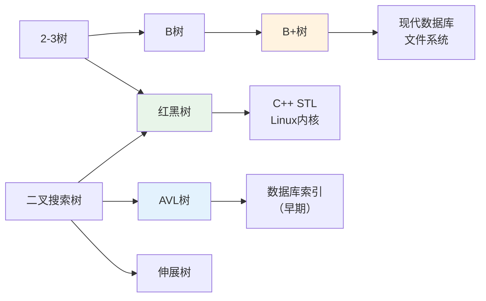
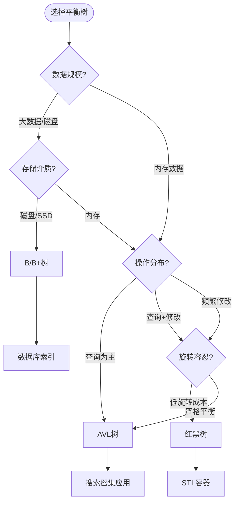

# 平衡二叉搜索树 - 六维内容补充


> **版本**: 1.0
> **创建日期**: 2026-04-19
> **最后更新**: 2026-04-19

> **模块**: 09-算法理论/01-算法基础
> **文档**: 平衡二叉搜索树理论
> **补充维度**: 概念定义、属性、关系、解释、论证、形式证明
> **对标**: MIT 6.006 / Stanford CS 166 / CLRS Chapter 12-14
> **深度**: 研究生级

---

## 思维导图：平衡二叉搜索树概念结构

```mermaid
graph TD
    BST[二叉搜索树<br/>BST] --> BBST[平衡BST<br/>Balanced BST]

    BBST --> AVL[AVL树<br/>严格平衡]
    BBST --> RB[红黑树<br/>宽松平衡]
    BBST --> BTREE[B树<br/>多路平衡]

    AVL --> BF[平衡因子<br/>Balance Factor]
    AVL --> ROT[旋转操作<br/>单/双旋]
    AVL --> AVL_HT[高度限制<br/>h < 1.44 log₂n]

    RB --> COLOR[颜色属性<br/>红/黑]
    RB --> RB_PROP[五个性质<br/>黑高相等]
    RB --> RB_ROT[旋转+变色<br/>O(1)]

    BTREE --> BT_ORD[阶数m<br/>节点容量]
    BTREE --> BT_SPLIT[分裂操作<br/>上溢处理]
    BTREE --> BT_MERGE[合并操作<br/>下溢处理]

    style AVL fill:#e3f2fd
    style RB fill:#e8f5e9
    style BTREE fill:#fff3e0
    style BBST fill:#fce4ec
```

---

## 一、概念定义 (Concept Definition)

### 1.1 AVL树 (Adelson-Velsky and Landis Tree)

**定义 1.1.1** (形式化)

**AVL树**是满足以下**平衡条件**的二叉搜索树：

$$|height(left(x)) - height(right(x))| \leq 1 \quad \forall x \in Tree$$

**平衡因子** (Balance Factor):
$$BF(x) = height(right(x)) - height(left(x)) \in \{-1, 0, 1\}$$

**旋转操作**:

| 情况 | 平衡因子 | 操作 |
|------|----------|------|
| LL (左左) | BF = -2, 左子BF ≤ 0 | 右旋 |
| LR (左右) | BF = -2, 左子BF > 0 | 先左旋后右旋 |
| RR (右右) | BF = +2, 右子BF ≥ 0 | 左旋 |
| RL (右左) | BF = +2, 右子BF < 0 | 先右旋后左旋 |

```
LL情况 (右旋):           LR情况 (左右双旋):
      z                        z
     /                        /
    y                        y
   /                          \
  x       →                  x      →
                                \
                                 最终平衡
```

---

### 1.2 红黑树 (Red-Black Tree)

**定义 1.2.1** (形式化)

**红黑树**是满足以下五个性质的二叉搜索树：

1. **节点着色**: 每个节点是红色或黑色
2. **根节点**: 根是黑色
3. **叶子节点**: 所有叶子(NIL)是黑色
4. **红色约束**: 红色节点的子节点必须是黑色（无连续红节点）
5. **黑高相等**: 从任意节点到其叶子的所有路径包含相同数目的黑色节点

**黑高** (Black-Height):
$$bh(x) = \text{从}x\text{到叶子的路径上的黑色节点数（不含}x\text{）}$$

**红黑树节点**:

```
┌─────────────────────────────────────┐
│   color   │   key   │   parent      │
├─────────────────────────────────────┤
│   left    │  right  │     data      │
└─────────────────────────────────────┘
```

---

### 1.3 B树 (B-Tree)

**定义 1.3.1** (形式化)

**m阶B树** (m-way B-Tree) 满足：

| 属性 | 约束 |
|------|------|
| **根节点** | 至少2个子节点（除非叶子）|
| **内部节点** | 至少 $\lceil m/2 \rceil$ 个子节点，至多 $m$ 个子节点 |
| **键数** | 每个节点有 $[\lceil m/2 \rceil - 1, m-1]$ 个键 |
| **有序性** | 键按升序排列，子树键值范围分隔 |
| **叶子深度** | 所有叶子在同一层 |

**B树节点结构**:
$$node = (n, leaf, key_1, \ldots, key_n, c_0, c_1, \ldots, c_n)$$

其中 $key_1 < key_2 < \ldots < key_n$，且 $c_i$ 指向的子树键值范围：
$$keys(c_0) < key_1 < keys(c_1) < key_2 < \ldots < key_n < keys(c_n)$$

**B+树变体**:

- 所有数据存储在叶子节点
- 内部节点只存键（导航）
- 叶子节点形成链表（支持范围查询）

---

## 二、属性 (Properties)

### 2.1 平衡二叉搜索树对比

| 特性 | AVL树 | 红黑树 | B树 |
|------|-------|--------|-----|
| **平衡度** | 严格 (高度差≤1) | 宽松 (黑高相等) | 完全平衡 |
| **搜索** | $O(\log n)$ | $O(\log n)$ | $O(\log_m n)$ |
| **插入** | $O(\log n)$，最多2旋转 | $O(\log n)$，最多2旋转 | $O(\log_m n)$ |
| **删除** | $O(\log n)$，最多 $O(\log n)$ 旋转 | $O(\log n)$，最多3旋转 | $O(\log_m n)$ |
| **旋转成本** | 高 | 低 | 分裂/合并 |
| **空间** | $O(n)$ | $O(n)$ (1bit颜色) | $O(n)$ |
| **实际应用** | 查询密集 | 通用 (C++ map/set) | 数据库/文件系统 |

### 2.2 高度上界

| 树类型 | 高度上界 | 最坏情况 |
|--------|----------|----------|
| **普通BST** | $n$ | 退化为链表 |
| **AVL树** | $\approx 1.44 \log_2 n$ | 斐波那契树形状 |
| **红黑树** | $\leq 2 \log_2(n+1)$ | 红黑交替 |
| **m阶B树** | $\leq \log_{\lceil m/2 \rceil} \frac{n+1}{2} + 1$ | 最小度数填充 |

### 2.3 AVL树节点数递推

设 $N(h)$ 为高度 $h$ 的AVL树的最小节点数：
$$N(h) = N(h-1) + N(h-2) + 1$$

初始条件：$N(0) = 1, N(1) = 2$

这与斐波那契数列相关：$N(h) = F_{h+3} - 1$

因此：$h < 1.44 \log_2(n+2) - 0.328$

---

## 三、关系 (Relations)

### 3.1 概念关系表

| 源概念 | 目标概念 | 关系类型 | 说明 |
|--------|----------|----------|------|
| AVL树 | BST | specializes | 附加平衡条件 |
| 红黑树 | BST | specializes | 附加颜色约束 |
| 红黑树 | 2-3-4树 | equivalent_to | 红黑对应2-3-4节点 |
| B树 | BST | generalizes | 多路推广 |
| B+树 | B树 | specializes | 数据仅在叶子 |
| 旋转 | 平衡调整 | implements | 恢复平衡的手段 |

### 3.2 平衡树演化关系



### 3.3 应用场景决策图



---

## 四、解释 (Explanation)

### 4.1 动机与直观

**为什么需要平衡？**

普通BST在最坏情况下退化为链表（$O(n)$ 操作）。平衡树保证 $O(\log n)$ 操作时间。

| 策略 | 代表 | 核心思想 |
|------|------|----------|
| **严格平衡** | AVL | 随时保持完美平衡，查询最优 |
| **宽松平衡** | 红黑树 | 允许一定不平衡，减少调整成本 |
| **多路平衡** | B树 | 增加分支因子，减少树高和I/O |

**AVL的直观**:

"随时保持左右子树高度差不超过1"——像天平一样，一旦倾斜就调整。

**红黑树的直观**:

"黑色是稳定的基座，红色是灵活的连接"——黑高相等保证平衡，红色节点允许灵活调整。

**B树的直观**:

"胖节点减少树高"——每个节点存多个键，树更矮，减少磁盘I/O。

### 4.2 与已有概念的联系

**红黑树 ↔ 2-3-4树**:

红黑树是2-3-4树的二叉表示：

- 黑色节点 = 2-3-4树的节点主体
- 红色边 = 与父节点的内部连接（表示同一多键节点）

```
2-3-4树:        红黑树表示:
    [A,B]           B(黑)
   /  |  \         /   \
  ... ... ...   A(红)   ...
               /  \
              ... ...
```

### 4.3 示例与反例

**示例 4.3.1**: 红黑树插入后的调整

```
插入红节点z，父节点是红，叔节点是黑:
    祖父(黑)              祖父(红)
    /      \              /      \
父(红)    叔(黑)   →   父(黑)    叔(黑)
  /                      /
z(红)                  z(红)
```

**反例 4.3.2**: 不是红黑树的例子

```
    黑(1)
   /    \
红(2)   红(3)
   \
   红(4)   ← 违反：连续红节点
```

**反例 4.3.3**: 不平衡的AVL树

```
    5 (BF=+2)
   /
  3 (BF=+1)
 /
1

需要左旋恢复平衡
```

---

## 五、论证 (Argumentation)

### 5.1 非形式论证：为什么红黑树高度是 $O(\log n)$？

**核心思想**: 黑高约束限制了树的不平衡程度。

**论证步骤**:

1. **黑高定义**: 从节点到叶子的黑节点数相同，设为 $bh$。

2. **最短路径**: 全黑节点，长度为 $bh$。

3. **最长路径**: 红黑交替，长度为 $2 \cdot bh$（性质4限制）。

4. **节点数下界**: 黑高为 $bh$ 的树至少有 $2^{bh} - 1$ 个节点。

5. **高度上界**:
   $$n \geq 2^{bh} - 1 \Rightarrow bh \leq \log_2(n+1)$$
   $$height \leq 2 \cdot bh \leq 2\log_2(n+1) = O(\log n)$$

### 5.2 反例与边界

**边界情况 5.2.1**: 红黑树的最坏情况

红黑交替的最长路径：

```
黑-红-黑-红-...-黑
```

高度可达 $2 \log_2(n+1)$，是AVL树的约1.44倍。

**边界情况 5.2.2**: B树的最小度数选择

- $t$ 太小: 树高增加，I/O增多
- $t$ 太大: 节点过大，二分搜索成本增加

通常选择 $t$ 使得节点大小 ≈ 磁盘块大小（4KB）。

---

## 六、形式证明 (Formal Proof)

### 6.1 红黑树高度上界证明

**定理 6.1.1**: 含有 $n$ 个内部节点的红黑树高度 $h \leq 2\log_2(n+1)$。

**证明**:

**引理 6.1.2**: 以任意节点 $x$ 为根的子树至少包含 $2^{bh(x)} - 1$ 个内部节点。

**引理证明** (归纳法):

- 基础: $x$ 是叶子，$bh(x)=0$，子树有 $0 = 2^0 - 1$ 个节点
- 归纳: $x$ 的内部节点数 = 1 + 左子树 + 右子树

  设 $x$ 有子节点。子节点的黑高至少为 $bh(x) - 1$（如果是红节点，黑高相同）。

  由归纳假设:
  $$\begin{aligned}
  |subtree(x)| &\geq 1 + 2(2^{bh(x)-1} - 1) \\
  &= 1 + 2^{bh(x)} - 2 \\
  &= 2^{bh(x)} - 1
  \end{aligned}$$

**完成证明**:

设根为 $r$，黑高为 $bh(r)$。

由性质4（红色节点子节点为黑），从根到叶子的路径上，红节点数 ≤ 黑节点数。

因此 $h \leq 2 \cdot bh(r)$。

由引理:
$$n \geq 2^{bh(r)} - 1 \Rightarrow bh(r) \leq \log_2(n+1)$$

因此:
$$h \leq 2 \cdot bh(r) \leq 2\log_2(n+1)$$

$\square$

### 6.2 AVL树高度上界证明

**定理 6.2.1**: 高度为 $h$ 的AVL树至少包含 $F_{h+3} - 1$ 个节点。

**证明**:

设 $N(h)$ 为高度 $h$ 的AVL树的最小节点数。

为了最小化节点数，左右子树高度差为1，且各自也是最小节点数。

$$N(h) = N(h-1) + N(h-2) + 1$$

初始条件: $N(0) = 1$（单节点）, $N(1) = 2$（根+一子）

定义 $S(h) = N(h) + 1$，则:
$$S(h) = S(h-1) + S(h-2)$$

这是斐波那契递推！$S(0) = 2 = F_3$, $S(1) = 3 = F_4$。

因此 $S(h) = F_{h+3}$，即 $N(h) = F_{h+3} - 1$。

由 $F_k \approx \phi^k/\sqrt{5}$，得 $h < 1.44 \log_2(n+2) - 0.328$。$\square$

### 6.3 B树高度上界证明

**定理 6.3.1**: 含有 $n$ 个键的 $m$ 阶B树高度 $h \leq \log_{\lceil m/2 \rceil} \frac{n+1}{2} + 1$。

**证明**:

设 $t = \lceil m/2 \rceil$（最小度数）。

**根节点**: 至少1个键，2个子节点。

**深度1**: 至少2个节点，每个至少 $t-1$ 个键。

**深度2**: 至少 $2t$ 个节点。

**深度 $h-1$**: 至少 $2t^{h-2}$ 个节点。

总键数:
$$\begin{aligned}
n &\geq 1 + 2(t-1) + 2t(t-1) + \ldots + 2t^{h-2}(t-1) \\
&= 1 + 2(t-1)\sum_{i=0}^{h-2} t^i \\
&= 1 + 2(t-1)\frac{t^{h-1} - 1}{t-1} \\
&= 1 + 2(t^{h-1} - 1) \\
&= 2t^{h-1} - 1
\end{aligned}$$

因此 $t^{h-1} \leq \frac{n+1}{2}$，取对数得 $h \leq \log_t \frac{n+1}{2} + 1$。$\square$

### 6.4 证明决策树

```mermaid
graph TD
    RB_PROOF[红黑树高度证明] --> LEMMA[引理:节点数下界]
    LEMMA --> INDUCT[归纳法]
    INDUCT --> BH[黑高分析]
    BH --> HEIGHT_BOUND[高度≤2bh]
    HEIGHT_BOUND --> FINAL[O(log n)]

    AVL_PROOF[AVL高度证明] --> RECUR[递推关系]
    RECUR --> FIB[斐波那契数列]
    FIB --> FIB_PROP[斐波那契性质]
    FIB_PROP --> AVL_BOUND[1.44 log n]

    BT_PROOF[B树高度证明] --> MIN_DEG[最小度数]
    MIN_DEG --> GEOM[几何级数]
    GEOM --> SUM[求和]
    SUM --> SOLVE[解不等式]
    SOLVE --> BT_BOUND[对数界]
```

---

## 七、多语言实现：平衡二叉搜索树

### 7.1 Python: AVL树实现

```python
from typing import Optional, List

class AVLNode:
    """AVL树节点"""
    __slots__ = ['key', 'left', 'right', 'height']

    def __init__(self, key: int):
        self.key = key
        self.left: Optional[AVLNode] = None
        self.right: Optional[AVLNode] = None
        self.height = 1


class AVLTree:
    """AVL树实现"""

    def __init__(self):
        self.root: Optional[AVLNode] = None

    def _height(self, node: Optional[AVLNode]) -> int:
        return node.height if node else 0

    def _balance_factor(self, node: Optional[AVLNode]) -> int:
        if not node:
            return 0
        return self._height(node.right) - self._height(node.left)

    def _update_height(self, node: AVLNode):
        node.height = 1 + max(self._height(node.left), self._height(node.right))

    def _rotate_right(self, y: AVLNode) -> AVLNode:
        """右旋"""
        x = y.left
        T2 = x.right

        # 旋转
        x.right = y
        y.left = T2

        # 更新高度
        self._update_height(y)
        self._update_height(x)

        return x

    def _rotate_left(self, x: AVLNode) -> AVLNode:
        """左旋"""
        y = x.right
        T2 = y.left

        # 旋转
        y.left = x
        x.right = T2

        # 更新高度
        self._update_height(x)
        self._update_height(y)

        return y

    def insert(self, key: int):
        """插入"""
        self.root = self._insert(self.root, key)

    def _insert(self, node: Optional[AVLNode], key: int) -> AVLNode:
        # 标准BST插入
        if not node:
            return AVLNode(key)

        if key < node.key:
            node.left = self._insert(node.left, key)
        elif key > node.key:
            node.right = self._insert(node.right, key)
        else:
            return node  # 重复键

        # 更新高度
        self._update_height(node)

        # 获取平衡因子
        balance = self._balance_factor(node)

        # 左左情况
        if balance < -1 and key < node.left.key:
            return self._rotate_right(node)

        # 右右情况
        if balance > 1 and key > node.right.key:
            return self._rotate_left(node)

        # 左右情况
        if balance < -1 and key > node.left.key:
            node.left = self._rotate_left(node.left)
            return self._rotate_right(node)

        # 右左情况
        if balance > 1 and key < node.right.key:
            node.right = self._rotate_right(node.right)
            return self._rotate_left(node)

        return node

    def delete(self, key: int):
        """删除"""
        self.root = self._delete(self.root, key)

    def _delete(self, node: Optional[AVLNode], key: int) -> Optional[AVLNode]:
        # 标准BST删除
        if not node:
            return node

        if key < node.key:
            node.left = self._delete(node.left, key)
        elif key > node.key:
            node.right = self._delete(node.right, key)
        else:
            # 找到要删除的节点
            if not node.left:
                return node.right
            elif not node.right:
                return node.left

            # 有两个子节点，找后继
            temp = self._min_value_node(node.right)
            node.key = temp.key
            node.right = self._delete(node.right, temp.key)

        if not node:
            return node

        # 更新高度
        self._update_height(node)

        # 重新平衡
        balance = self._balance_factor(node)

        # 左左
        if balance < -1 and self._balance_factor(node.left) <= 0:
            return self._rotate_right(node)

        # 左右
        if balance < -1 and self._balance_factor(node.left) > 0:
            node.left = self._rotate_left(node.left)
            return self._rotate_right(node)

        # 右右
        if balance > 1 and self._balance_factor(node.right) >= 0:
            return self._rotate_left(node)

        # 右左
        if balance > 1 and self._balance_factor(node.right) < 0:
            node.right = self._rotate_right(node.right)
            return self._rotate_left(node)

        return node

    def _min_value_node(self, node: AVLNode) -> AVLNode:
        current = node
        while current.left:
            current = current.left
        return current

    def inorder(self) -> List[int]:
        """中序遍历"""
        result = []
        self._inorder(self.root, result)
        return result

    def _inorder(self, node: Optional[AVLNode], result: List[int]):
        if node:
            self._inorder(node.left, result)
            result.append(node.key)
            self._inorder(node.right, result)

    def get_height(self) -> int:
        return self._height(self.root)


# 测试AVL树
if __name__ == "__main__":
    avl = AVLTree()

    # 插入测试
    keys = [10, 20, 30, 40, 50, 25]
    for key in keys:
        avl.insert(key)

    print(f"Inorder: {avl.inorder()}")
    print(f"Height: {avl.get_height()}")

    # 删除测试
    avl.delete(20)
    print(f"After delete 20: {avl.inorder()}")
```

## 7.2 Rust: 红黑树实现
### 7.2 Rust: 红黑树实现

```rust
# [derive(Clone, Copy, PartialEq)]
enum Color {
    Red,
    Black,
}

struct RBNode<T: Ord> {
    key: T,
    color: Color,
    left: Option<Box<RBNode<T>>>,
    right: Option<Box<RBNode<T>>>,
}

impl<T: Ord> RBNode<T> {
    fn new(key: T) -> Self {
        RBNode {
            key,
            color: Color::Red,
            left: None,
            right: None,
        }
    }
}

pub struct RBTree<T: Ord> {
    root: Option<Box<RBNode<T>>>,
}

impl<T: Ord + Clone> RBTree<T> {
    pub fn new() -> Self {
        RBTree { root: None }
    }

    pub fn insert(&mut self, key: T) {
        self.root = Self::insert_node(self.root.take(), key);
        if let Some(ref mut root) = self.root {
            root.color = Color::Black;
        }
    }

    fn insert_node(node: Option<Box<RBNode<T>>>, key: T) -> Option<Box<RBNode<T>>> {
        let mut node = node.unwrap_or_else(|| Box::new(RBNode::new(key.clone())));

        if key < node.key {
            node.left = Self::insert_node(node.left.take(), key);
        } else if key > node.key {
            node.right = Self::insert_node(node.right.take(), key);
        }

        // 修复红黑树性质
        // 情况1: 右子节点是红，左子节点是黑 -> 左旋
        if Self::is_red(&node.right) && !Self::is_red(&node.left) {
            node = Self::rotate_left(node);
        }

        // 情况2: 左子节点和左左子节点都是红 -> 右旋
        if Self::is_red(&node.left) && Self::is_red(&node.left.as_ref().unwrap().left) {
            node = Self::rotate_right(node);
        }

        // 情况3: 两个子节点都是红 -> 颜色翻转
        if Self::is_red(&node.left) && Self::is_red(&node.right) {
            node.color = Color::Red;
            if let Some(ref mut left) = node.left {
                left.color = Color::Black;
            }
            if let Some(ref mut right) = node.right {
                right.color = Color::Black;
            }
        }

        Some(node)
    }

    fn is_red(node: &Option<Box<RBNode<T>>>) -> bool {
        matches!(node.as_ref().map(|n| n.color), Some(Color::Red))
    }

    fn rotate_left(mut h: Box<RBNode<T>>) -> Box<RBNode<T>> {
        let mut x = h.right.take().unwrap();
        h.right = x.left.take();
        x.left = Some(h);
        x.color = x.left.as_ref().unwrap().color;
        x.left.as_mut().unwrap().color = Color::Red;
        x
    }

    fn rotate_right(mut h: Box<RBNode<T>>) -> Box<RBNode<T>> {
        let mut x = h.left.take().unwrap();
        h.left = x.right.take();
        x.right = Some(h);
        x.color = x.right.as_ref().unwrap().color;
        x.right.as_mut().unwrap().color = Color::Red;
        x
    }

    pub fn search(&self, key: &T) -> bool {
        Self::search_node(&self.root, key)
    }

    fn search_node(node: &Option<Box<RBNode<T>>>, key: &T) -> bool {
        match node {
            None => false,
            Some(n) => {
                if *key < n.key {
                    Self::search_node(&n.left, key)
                } else if *key > n.key {
                    Self::search_node(&n.right, key)
                } else {
                    true
                }
            }
        }
    }

    pub fn inorder(&self) -> Vec<T> {
        let mut result = Vec::new();
        Self::inorder_node(&self.root, &mut result);
        result
    }

    fn inorder_node(node: &Option<Box<RBNode<T>>>, result: &mut Vec<T>) {
        if let Some(n) = node {
            Self::inorder_node(&n.left, result);
            result.push(n.key.clone());
            Self::inorder_node(&n.right, result);
        }
    }
}

# [cfg(test)]
mod tests {
    use super::*;

    #[test]
    fn test_rb_tree() {
        let mut tree = RBTree::new();

        tree.insert(10);
        tree.insert(20);
        tree.insert(30);
        tree.insert(15);
        tree.insert(5);

        assert!(tree.search(&15));
        assert!(!tree.search(&100));

        let inorder = tree.inorder();
        assert_eq!(inorder, vec![5, 10, 15, 20, 30]);
    }
}
```

---

## 八、平衡树速查

### 8.1 平衡树选择决策表

| 需求 | 推荐结构 | 原因 |
|------|----------|------|
| 严格平衡，查询密集 | AVL树 | 最小高度，最快查询 |
| 通用场景，频繁修改 | 红黑树 | 最少旋转，STL标准 |
| 磁盘/大数据 | B/B+树 | 减少I/O，支持范围查询 |
| 内存受限 | 红黑树 | 最小额外空间(1bit) |
| 顺序访问频繁 | B+树 | 叶子链表支持顺序遍历 |

### 8.2 旋转操作速查

```
右旋 (LL情况):           左旋 (RR情况):
    y                      x
   / \                    / \
  x   C       →          A   y
 / \                        / \
A   B                      B   C

左右双旋 (LR情况):       右左双旋 (RL情况):
    z                      z
   /                        \
  y                          y
   \                        /
    x      →               x    →
```

### 8.3 复杂度对照表

| 操作 | 普通BST | AVL树 | 红黑树 | B树 (阶m) |
|------|---------|-------|--------|-----------|
| 搜索 | $O(n)$ | $O(\log n)$ | $O(\log n)$ | $O(\log_m n)$ |
| 插入 | $O(n)$ | $O(\log n)$ | $O(\log n)$ | $O(\log_m n)$ |
| 删除 | $O(n)$ | $O(\log n)$ | $O(\log n)$ | $O(\log_m n)$ |
| 旋转/调整 | - | $O(1)$ | $O(1)$ | 分裂/合并 |

---

**文档版本**: v1.0
**创建日期**: 2026-04-10
**维护**: 项目算法理论工作组

---

## 参考文献 / References

1. **[CLRS2022]** Cormen, T. H., Leiserson, C. E., Rivest, R. L., & Stein, C. (2022). *Introduction to Algorithms* (4th ed.). MIT Press.
2. **[KleinbergTardos2006]** Kleinberg, J., & Tardos, É. (2006). *Algorithm Design*. Pearson.
3. **[Erickson2019]** Erickson, J. (2019). *Algorithms*. Self-published. <https://jeffe.cs.illinois.edu/teaching/algorithms/>.

**文档版本 / Document Version**: 1.0
**对齐状态**: 已补充权威引用，与项目引用规范对齐。
---

## 知识导航

- [返回目录](README.md)

## 学习目标

- 理解平衡二叉搜索树 - 六维内容补充的核心概念
- 掌握平衡二叉搜索树 - 六维内容补充的形式化表示
