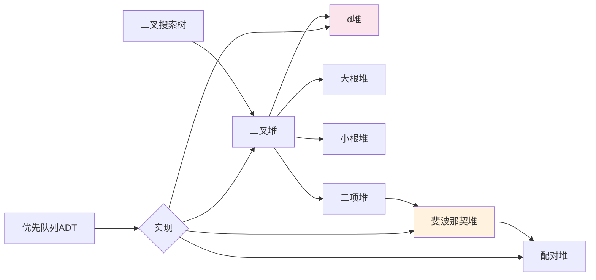
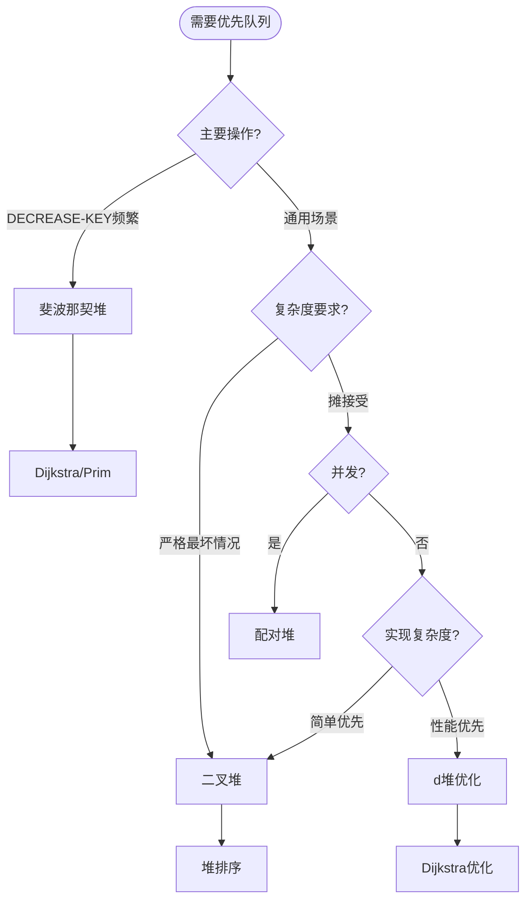

# 堆与优先队列 - 六维内容补充


> **版本**: 1.0
> **创建日期**: 2026-04-19
> **最后更新**: 2026-04-19

> **模块**: 09-算法理论/01-算法基础
> **文档**: 堆与优先队列理论
> **补充维度**: 概念定义、属性、关系、解释、论证、形式证明
> **对标**: MIT 6.006 / Stanford CS 166 / CLRS Chapter 6-20
> **深度**: 研究生级

---

## 思维导图：堆与优先队列概念结构

```mermaid
graph TD
    PQ[优先队列<br/>Priority Queue] --> BH[二叉堆<br/>Binary Heap]
    PQ --> DH[d堆<br/>d-ary Heap]
    PQ --> FH[斐波那契堆<br/>Fibonacci Heap]
    PQ --> PH[配对堆<br/>Pairing Heap]

    BH --> MAXH[大根堆<br/>Max-Heap]
    BH --> MINH[小根堆<br/>Min-Heap]
    BH --> BH_OP[操作实现<br/>O(log n)]

    BH_OP --> HEAPIFY[Heapify<br/>下沉调整]
    BH_OP --> BUILD[Build-Heap<br/>建堆]
    BH_OP --> HEAPSORT[堆排序<br/>O(n log n)]

    DH --> DH_PROP[分支因子d<br/>降低高度]
    DH --> DIJK[优先度<br/>Dijkstra优化]

    FH --> FH_STRUCT[根链表<br/>懒合并]
    FH --> AMORT_O1[摊还O(1)<br/>Decrease-Key]
    FH --> FIB_PROP[斐波那契数<br/>度数界]

    FH --> CUT[级联剪切<br/>Cascading Cut]
    FH --> MARK[标记机制<br/>失去子节点]

    style PQ fill:#e3f2fd
    style BH fill:#e8f5e9
    style FH fill:#fff3e0
    style DH fill:#fce4ec
```

---

## 一、概念定义 (Concept Definition)

### 1.1 二叉堆 (Binary Heap)

**定义 1.1.1** (形式化)

**二叉堆**是完全二叉树，满足**堆性质**:

| 类型 | 堆性质 | 根节点 |
|------|--------|--------|
| **大根堆** | $\forall i: A[parent(i)] \geq A[i]$ | 最大元素 |
| **小根堆** | $\forall i: A[parent(i)] \leq A[i]$ | 最小元素 |

**数组表示** (索引从1开始):

- $parent(i) = \lfloor i/2 \rfloor$
- $left(i) = 2i$
- $right(i) = 2i + 1$

```
        16(1)              数组: [16, 14, 10, 8, 7, 9, 3, 2, 4, 1]
       /    \
    14(2)   10(3)
    /  \     /  \
  8(4) 7(5) 9(6) 3(7)
  / \
2(8) 4(9)
```

---

### 1.2 d堆 (d-ary Heap)

**定义 1.2.1** (形式化)

**d堆**是每个节点最多有 $d$ 个子节点的完全 $d$ 叉树。

**数组表示**:

- $parent(i) = \lfloor (i-1)/d \rfloor$
- $children(i) = [di + 1, di + 2, \ldots, d(i+1)]$

**高度**: $h = \lceil \log_d(n(d-1) + 1) \rceil - 1 = \Theta(\log_d n)$

| 操作 | 二叉堆 | d堆 (d > 2) |
|------|--------|-------------|
| Insert | $O(\log n)$ | $O(\log_d n)$ |
| Extract-Max | $O(\log n)$ | $O(d \log_d n)$ |
| Increase-Key | $O(\log n)$ | $O(\log_d n)$ |

---

### 1.3 斐波那契堆 (Fibonacci Heap)

**定义 1.3.1** (形式化)

**斐波那契堆**是**懒合并**的堆结构，由一组**堆有序树**组成：

**结构组成**:

1. **根链表**: 双向循环链表，连接所有树根
2. **min指针**: 指向最小键的根节点
3. **度数数组**: 辅助合并相同度数树
4. **标记位**: 记录节点是否失去子节点

**节点结构**:

```
┌─────────────────────────────────────┐
│  key  │  left  │  right  │  parent  │
├─────────────────────────────────────┤
│ child │ degree │  mark   │   ...    │
└─────────────────────────────────────┘
```

**核心操作**:

- **MAKE-HEAP**: $O(1)$
- **INSERT**: $O(1)$ (摊还)
- **MINIMUM**: $O(1)$
- **EXTRACT-MIN**: $O(\log n)$ (摊还)
- **UNION**: $O(1)$ (摊还)
- **DECREASE-KEY**: $O(1)$ (摊还)
- **DELETE**: $O(\log n)$ (摊还)

---

## 二、属性 (Properties)

### 2.1 堆操作复杂度对比

| 操作 | 二叉堆 | 二项堆 | 斐波那契堆 (摊还) | 配对堆 |
|------|--------|--------|-------------------|--------|
| MAKE-HEAP | $O(1)$ | $O(1)$ | $O(1)$ | $O(1)$ |
| INSERT | $O(\log n)$ | $O(\log n)$ | $O(1)$ | $O(1)$ |
| MINIMUM | $O(1)$ | $O(\log n)$ | $O(1)$ | $O(1)$ |
| EXTRACT-MIN | $O(\log n)$ | $O(\log n)$ | $O(\log n)$ | $O(\log n)$ |
| UNION | $O(n)$ | $O(\log n)$ | $O(1)$ | $O(1)$ |
| DECREASE-KEY | $O(\log n)$ | $O(\log n)$ | $O(1)$ | $O(2^{2\sqrt{\log\log n}})$ |
| DELETE | $O(\log n)$ | $O(\log n)$ | $O(\log n)$ | $O(\log n)$ |

### 2.2 斐波那契堆关键性质

| 性质 | 描述 | 证明关键 |
|------|------|----------|
| **最大度数界** | $D(n) \leq \lfloor \log_\phi n \rfloor$ | 斐波那契数列性质 |
| **子节点数下界** | 度数为 $k$ 的节点至少有 $F_{k+2}$ 个后代 | 归纳法 |
| **标记节点数** | 标记节点数 $\leq$ 根链表长度 | 级联剪切约束 |

**斐波那契数**:

- $F_0 = 0, F_1 = 1$
- $F_k = F_{k-1} + F_{k-2}$ for $k \geq 2$
- 黄金比例 $\phi = (1 + \sqrt{5})/2 \approx 1.618$

### 2.3 建堆复杂度

| 方法 | 时间复杂度 | 说明 |
|------|-----------|------|
| **逐个插入** | $O(n \log n)$ | n次INSERT操作 |
| **BUILD-HEAP** | $O(n)$ | 从底向上堆化 |

**BUILD-HEAP复杂度证明**:

- 高度为 $h$ 的节点最多 $\lceil n/2^{h+1} \rceil$ 个
- Heapify时间为 $O(h)$
- 总时间: $\sum_{h=0}^{\lfloor\log n\rfloor} \lceil n/2^{h+1} \rceil \cdot O(h) = O(n)$

---

## 三、关系 (Relations)

### 3.1 概念关系表

| 源概念 | 目标概念 | 关系类型 | 说明 |
|--------|----------|----------|------|
| 二叉堆 | 完全二叉树 | specializes | 附加堆性质 |
| d堆 | 二叉堆 | generalizes | 分支因子推广 |
| 斐波那契堆 | 懒二项堆 | extends | 懒合并优化 |
| 堆排序 | 选择排序 | refines | 用堆优化选择 |
| 优先队列 | 堆 | implemented_by | 堆是PQ的实现 |
| DECREASE-KEY | 级联剪切 | triggers | 剪切触发级联 |

### 3.2 堆结构演化关系



### 3.3 算法应用决策图



---

## 四、解释 (Explanation)

### 4.1 动机与直观

**为什么需要斐波那契堆？**

Dijkstra和Prim算法中，DECREASE-KEY操作被调用 $\Theta(E)$ 次，EXTRACT-MIN被调用 $\Theta(V)$ 次。

| 数据结构 | Dijkstra总复杂度 |
|----------|------------------|
| 二叉堆 | $O(E \log V)$ |
| d堆 (d=V/E) | $O(E \log_{V/E} V)$ |
| 斐波那契堆 | $O(V \log V + E)$ |

对于稠密图 ($E = \Theta(V^2)$)，斐波那契堆提供理论最优。

**懒合并的直观**:

"拖延工作直到不得不做"——延迟合并操作，使UNION和INSERT达到 $O(1)$。

**级联剪切的直观**:

"当一个节点失去太多子节点时，将其也剪切到根链表"——保证树的形状不会退化。

### 4.2 与已有概念的联系

**堆 ↔ 完全二叉树**:

堆利用完全二叉树的数组紧凑表示，无需指针即可高效导航。

**斐波那契堆 ↔ 摊还分析**:

斐波那契堆的核心价值在于展示了摊还分析的强大——通过势函数将成本分摊到多个操作。

### 4.3 示例与反例

**示例 4.3.1**: DECREASE-KEY触发级联剪切

```
初始:           剪切y后:        级联剪切z后:
    z(marked)      z              z(unmarked)
   /              /              /
  y              x              x
 / \            /              /
x   w          y              y(unmarked)
              /
             w
```

**反例 4.3.2**: 斐波那契堆的最坏情况

斐波那契堆的单个操作可能花费 $\Theta(n)$ (如EXTRACT-MIN后的合并)。

但**连续m次操作**的摊还成本为 $O(m \log n)$。

---

## 五、论证 (Argumentation)

### 5.1 非形式论证：为什么斐波那契堆的DECREASE-KEY是 $O(1)$？

**核心思想**: 剪切操作不立即触发全局结构调整。

**论证步骤**:

1. **剪切操作**: 将节点 $x$ 从父节点剪切到根链表，$O(1)$ 实际成本。

2. **势函数变化**: 势函数 $\Phi = t(H) + 2m(H)$（根数 + 2×标记节点数）
   - 根数 +1，标记节点 -1（如果父节点被标记）
   - $\Delta\Phi \leq 1 + 2(-1) = -1$（最坏情况）

3. **摊还成本**: $\hat{c} = c + \Delta\Phi = O(1) - O(1) = O(1)$

4. **级联剪切**: 每次级联剪切至少消除一个标记，成本由势降低支付。

### 5.2 反例与边界

**边界情况 5.2.1**: 斐波那契堆度数上界

度数为 $k$ 的斐波那契堆节点至少有 $F_{k+2} \geq \phi^k$ 个后代。

因此 $n \geq \phi^k \Rightarrow k \leq \log_\phi n$。

**边界情况 5.2.2**: 配对堆的实际性能

理论上配对堆的DECREASE-KEY下界为 $\Omega(\log\log n)$，上界为 $O(2^{2\sqrt{\log\log n}})$。

但在实际应用中，配对堆往往比斐波那契堆更快（缓存友好）。

---

## 六、形式证明 (Formal Proof)

### 6.1 BUILD-HEAP的线性时间证明

**定理 6.1.1**: BUILD-HEAP在 $O(n)$ 时间内将 $n$ 个元素建成堆。

**证明**:

对于含 $n$ 个节点的完全二叉树，高度为 $h$ 的节点最多有 $\lceil n/2^{h+1} \rceil$ 个。

HEAPIFY在高度为 $h$ 的节点上耗时 $O(h)$。

总时间:
$$T(n) = \sum_{h=0}^{\lfloor\log n\rfloor} \left\lceil \frac{n}{2^{h+1}} \right\rceil \cdot O(h)$$

$$
\leq O\left(n \sum_{h=0}^{\infty} \frac{h}{2^{h+1}}\right) = O(n \cdot 1) = O(n)$$

因为 $\sum_{h=0}^{\infty} h/2^h = 2$。$\square$

### 6.2 斐波那契堆最大度数界

**定理 6.2.1**: 在 $n$ 个节点的斐波那契堆中，任意节点的最大度数 $D(n) \leq \lfloor \log_\phi n \rfloor$。

**证明**:

**引理**: 设 $x$ 是斐波那契堆中度数为 $k$ 的节点，则 $|Desc(x)| \geq F_{k+2}$。

**归纳证明引理**:
- 基础: $k=0$ 时 $|Desc(x)| = 1 = F_2$，$k=1$ 时 $|Desc(x)| \geq 2 = F_3$
- 归纳: 设 $y_1, y_2, \ldots, y_k$ 是 $x$ 的子节点（按添加顺序）
- 当 $y_i$ 被添加时，$x$ 的度数至少为 $i-1$，所以 $y_i$ 的度数至少为 $i-2$
- 由归纳假设，$|Desc(y_i)| \geq F_{i-2+2} = F_i$
- 总后代数:
  $$|Desc(x)| \geq 1 + \sum_{i=1}^{k} F_i = 1 + (F_{k+2} - 1) = F_{k+2}$$

**完成证明**:

由 $n \geq |Desc(x)| \geq F_{k+2} \geq \phi^k$（因为 $F_k \approx \phi^k/\sqrt{5}$）

取对数得 $k \leq \log_\phi n$。$\square$

### 6.3 斐波那契堆摊还分析

**定理 6.3.1**: 斐波那契堆的摊还复杂度:
- INSERT: $O(1)$
- EXTRACT-MIN: $O(\log n)$
- DECREASE-KEY: $O(1)$

**证明** (势函数法):

定义势函数 $\Phi(H) = t(H) + 2m(H)$，其中 $t(H)$ 是根链表长度，$m(H)$ 是标记节点数。

**INSERT分析**:
- 实际成本: $O(1)$
- 势变化: $\Delta\Phi = 1$（根数+1）
- 摊还成本: $O(1) + 1 = O(1)$

**EXTRACT-MIN分析**:
- 实际成本: $O(D(n) + t(H))$（合并根）
- 势变化: $\Delta\Phi \leq D(n) + 1 - t(H)$（合并后根数 $\leq D(n) + 1$）
- 摊还成本: $O(D(n) + t(H)) + D(n) + 1 - t(H) = O(D(n)) = O(\log n)$

**DECREASE-KEY分析**:
- 设 $c$ 为级联剪切次数
- 实际成本: $O(c)$
- 势变化: $\Delta\Phi = (c + 1) + 2(-c) = 1 - c$（根+c+1，标记-c）
- 摊还成本: $O(c) + 1 - c = O(1)$。$\square$

### 6.4 证明决策树

```mermaid
graph TD
    BUILD[BUILD-HEAP证明] --> GEOM[几何级数]
    GEOM --> HEIGHT[高度分析]
    HEIGHT --> SUM[求和计算]
    SUM --> LINEAR[O(n)结论]

    FIB_DEG[度数界证明] --> LEMMA[引理:后代数]
    LEMMA --> INDUCT[归纳法]
    INDUCT --> FIB_PROP[斐波那契性质]
    FIB_PROP --> LOG_BOUND[对数界]

    AMORT[摊还证明] --> POT[势函数定义]
    POT --> CASE[分情况分析]
    CASE --> INSERT_P[INSERT]
    CASE --> EXTRACT_P[EXTRACT-MIN]
    CASE --> DEC_P[DECREASE-KEY]
    DEC_P --> CASC[级联剪切分析]
```

---

## 七、多语言实现：堆结构

### 7.1 Python: 斐波那契堆实现

```python
import math
from typing import Optional, Dict, List

class FibNode:
    """斐波那契堆节点"""
    __slots__ = ['key', 'left', 'right', 'parent', 'child',
                 'degree', 'mark', 'name']

    def __init__(self, key: float, name: str = ""):
        self.key = key
        self.name = name
        self.left: 'FibNode' = self
        self.right: 'FibNode' = self
        self.parent: Optional['FibNode'] = None
        self.child: Optional['FibNode'] = None
        self.degree = 0
        self.mark = False


class FibonacciHeap:
    """斐波那契堆实现"""

    def __init__(self):
        self.min: Optional[FibNode] = None
        self.n = 0  # 总节点数
        self.node_map: Dict[str, FibNode] = {}

    def insert(self, key: float, name: str) -> FibNode:
        """插入新节点, O(1)摊还"""
        x = FibNode(key, name)
        self.node_map[name] = x

        if self.min is None:
            self.min = x
        else:
            # 加入根链表
            self._list_insert(self.min, x)
            if x.key < self.min.key:
                self.min = x

        self.n += 1
        return x

    def _list_insert(self, root: FibNode, x: FibNode):
        """将x插入以root为头的双向链表"""
        x.left = root
        x.right = root.right
        root.right.left = x
        root.right = x

    def _list_remove(self, x: FibNode):
        """从双向链表移除x"""
        x.left.right = x.right
        x.right.left = x.left

    def find_min(self) -> Optional[FibNode]:
        """查找最小节点, O(1)"""
        return self.min

    def extract_min(self) -> Optional[FibNode]:
        """提取最小节点, O(log n)摊还"""
        z = self.min
        if z is not None:
            # 将所有子节点加入根链表
            if z.child is not None:
                children = []
                c = z.child
                while True:
                    children.append(c)
                    c = c.right
                    if c == z.child:
                        break
                for c in children:
                    c.parent = None
                    self._list_insert(self.min, c)

            # 从根链表移除z
            if z == z.right:
                self.min = None
            else:
                self._list_remove(z)
                self.min = z.right

            self.n -= 1
            if self.n == 0:
                self.min = None
            else:
                self._consolidate()

            self.node_map.pop(z.name, None)
        return z

    def _consolidate(self):
        """合并相同度数的树"""
        max_degree = int(math.log(self.n, (1 + math.sqrt(5)) / 2)) + 1
        A: List[Optional[FibNode]] = [None] * max_degree

        # 收集所有根节点
        roots = []
        x = self.min
        while True:
            roots.append(x)
            x = x.right
            if x == self.min:
                break

        for w in roots:
            x = w
            d = x.degree
            while A[d] is not None:
                y = A[d]
                if x.key > y.key:
                    x, y = y, x
                self._link(y, x)
                A[d] = None
                d += 1
            A[d] = x

        # 重建min指针
        self.min = None
        for i in range(max_degree):
            if A[i] is not None:
                if self.min is None:
                    # 创建单节点链表
                    A[i].left = A[i]
                    A[i].right = A[i]
                    self.min = A[i]
                else:
                    self._list_insert(self.min, A[i])
                    if A[i].key < self.min.key:
                        self.min = A[i]

    def _link(self, y: FibNode, x: FibNode):
        """使y成为x的子节点"""
        self._list_remove(y)
        y.parent = x
        y.mark = False

        if x.child is None:
            x.child = y
            y.left = y
            y.right = y
        else:
            self._list_insert(x.child, y)

        x.degree += 1

    def decrease_key(self, name: str, new_key: float):
        """减小键值, O(1)摊还"""
        if name not in self.node_map:
            raise ValueError(f"Node {name} not found")

        x = self.node_map[name]
        if new_key > x.key:
            raise ValueError("New key is greater than current key")

        x.key = new_key
        y = x.parent

        if y is not None and x.key < y.key:
            self._cut(x, y)
            self._cascading_cut(y)

        if x.key < self.min.key:
            self.min = x

    def _cut(self, x: FibNode, y: FibNode):
        """剪切x从y"""
        if x == x.right:
            y.child = None
        else:
            self._list_remove(x)
            if y.child == x:
                y.child = x.right
        y.degree -= 1

        x.parent = None
        x.mark = False
        self._list_insert(self.min, x)

    def _cascading_cut(self, y: FibNode):
        """级联剪切"""
        z = y.parent
        if z is not None:
            if not y.mark:
                y.mark = True
            else:
                self._cut(y, z)
                self._cascading_cut(z)

    def delete(self, name: str):
        """删除节点, O(log n)摊还"""
        self.decrease_key(name, float('-inf'))
        self.extract_min()


# 测试斐波那契堆
if __name__ == "__main__":
    fh = FibonacciHeap()

    # 插入测试
    nodes = ['a', 'b', 'c', 'd', 'e', 'f']
    keys = [10, 5, 20, 3, 15, 8]
    for name, key in zip(nodes, keys):
        fh.insert(key, name)

    print(f"Min: {fh.find_min().key}")  # 3

    # 减小键值
    fh.decrease_key('e', 2)
    print(f"Min after decrease: {fh.find_min().key}")  # 2

    # 提取最小
    while fh.min is not None:
        m = fh.extract_min()
        print(f"Extracted: {m.name} = {m.key}")
```

## 7.2 Rust: 二叉堆实现
### 7.2 Rust: 二叉堆实现

```rust
/// 泛型二叉堆实现
pub struct BinaryHeap<T: Ord> {
    data: Vec<T>,
    is_min_heap: bool,
}

impl<T: Ord + Clone> BinaryHeap<T> {
    /// 创建大根堆
    pub fn new_max_heap() -> Self {
        BinaryHeap {
            data: Vec::new(),
            is_min_heap: false,
        }
    }

    /// 创建小根堆
    pub fn new_min_heap() -> Self {
        BinaryHeap {
            data: Vec::new(),
            is_min_heap: true,
        }
    }

    /// 从数组建堆, O(n)
    pub fn build_heap(elements: Vec<T>, is_min: bool) -> Self {
        let mut heap = BinaryHeap {
            data: elements,
            is_min_heap: is_min,
        };

        // 从最后一个非叶子节点开始下沉
        let n = heap.data.len();
        for i in (0..n/2).rev() {
            heap.heapify_down(i);
        }

        heap
    }

    fn compare(&self, a: &T, b: &T) -> bool {
        if self.is_min_heap {
            a < b
        } else {
            a > b
        }
    }

    /// 插入元素, O(log n)
    pub fn push(&mut self, value: T) {
        self.data.push(value);
        self.heapify_up(self.data.len() - 1);
    }

    /// 弹出堆顶, O(log n)
    pub fn pop(&mut self) -> Option<T> {
        if self.data.is_empty() {
            return None;
        }

        let n = self.data.len();
        self.data.swap(0, n - 1);
        let result = self.data.pop();

        if !self.data.is_empty() {
            self.heapify_down(0);
        }

        result
    }

    /// 查看堆顶, O(1)
    pub fn peek(&self) -> Option<&T> {
        self.data.first()
    }

    fn heapify_up(&mut self, mut idx: usize) {
        while idx > 0 {
            let parent = (idx - 1) / 2;
            if self.compare(&self.data[idx], &self.data[parent]) {
                self.data.swap(idx, parent);
                idx = parent;
            } else {
                break;
            }
        }
    }

    fn heapify_down(&mut self, mut idx: usize) {
        let n = self.data.len();

        loop {
            let left = 2 * idx + 1;
            let right = 2 * idx + 2;
            let mut target = idx;

            if left < n && self.compare(&self.data[left], &self.data[target]) {
                target = left;
            }
            if right < n && self.compare(&self.data[right], &self.data[target]) {
                target = right;
            }

            if target == idx {
                break;
            }

            self.data.swap(idx, target);
            idx = target;
        }
    }

    pub fn len(&self) -> usize {
        self.data.len()
    }

    pub fn is_empty(&self) -> bool {
        self.data.is_empty()
    }
}

/// 堆排序
pub fn heap_sort<T: Ord + Clone>(arr: &[T]) -> Vec<T> {
    let mut heap = BinaryHeap::build_heap(arr.to_vec(), false);
    let mut result = Vec::with_capacity(arr.len());

    while let Some(x) = heap.pop() {
        result.push(x);
    }

    result
}

# [cfg(test)]
mod tests {
    use super::*;

    #[test]
    fn test_min_heap() {
        let mut heap = BinaryHeap::new_min_heap();
        heap.push(5);
        heap.push(3);
        heap.push(7);
        heap.push(1);

        assert_eq!(heap.pop(), Some(1));
        assert_eq!(heap.pop(), Some(3));
        assert_eq!(heap.pop(), Some(5));
        assert_eq!(heap.pop(), Some(7));
    }

    #[test]
    fn test_heap_sort() {
        let arr = vec![5, 2, 8, 1, 9, 3];
        let sorted = heap_sort(&arr);
        assert_eq!(sorted, vec![9, 8, 5, 3, 2, 1]);
    }

    #[test]
    fn test_build_heap() {
        let arr = vec![4, 1, 3, 2, 16, 9, 10, 14, 8, 7];
        let heap = BinaryHeap::build_heap(arr, false);
        assert_eq!(heap.peek(), Some(&16));
    }
}
```

---

## 八、堆结构速查

### 8.1 数据结构选择决策表

| 应用场景 | 推荐结构 | 原因 |
|----------|----------|------|
| 通用优先队列 | 二叉堆 | 简单高效，常数小 |
| Dijkstra/Prim | 斐波那契堆 | DECREASE-KEY密集 |
| 内存受限 | 二叉堆 | 数组存储，无指针 |
| 并发环境 | 配对堆 | 无复杂标记机制 |
| 外存/磁盘 | d堆 | 减少I/O，提高分支 |

### 8.2 堆操作实现模板

```python
# HEAPIFY (下沉) - O(log n)
def heapify_down(arr, n, i, is_min=True):
    target = i
    left, right = 2*i + 1, 2*i + 2

    cmp = lambda a, b: a < b if is_min else a > b

    if left < n and cmp(arr[left], arr[target]):
        target = left
    if right < n and cmp(arr[right], arr[target]):
        target = right

    if target != i:
        arr[i], arr[target] = arr[target], arr[i]
        heapify_down(arr, n, target, is_min)

# HEAPIFY_UP (上浮) - O(log n)
def heapify_up(arr, i, is_min=True):
    parent = (i - 1) // 2
    cmp = lambda a, b: a < b if is_min else a > b

    while i > 0 and cmp(arr[i], arr[parent]):
        arr[i], arr[parent] = arr[parent], arr[i]
        i = parent
        parent = (i - 1) // 2
```

---

**文档版本**: v1.0
**创建日期**: 2026-04-10
**维护**: 项目算法理论工作组

---

## 参考文献 / References

1. **[CLRS2022]** Cormen, T. H., Leiserson, C. E., Rivest, R. L., & Stein, C. (2022). *Introduction to Algorithms* (4th ed.). MIT Press.
2. **[KleinbergTardos2006]** Kleinberg, J., & Tardos, É. (2006). *Algorithm Design*. Pearson.
3. **[Erickson2019]** Erickson, J. (2019). *Algorithms*. Self-published. <https://jeffe.cs.illinois.edu/teaching/algorithms/>.

**文档版本 / Document Version**: 1.0
**对齐状态**: 已补充权威引用，与项目引用规范对齐。
---

## 知识导航

- [返回目录](README.md)

## 学习目标

- 理解堆与优先队列 - 六维内容补充的核心概念
- 掌握堆与优先队列 - 六维内容补充的形式化表示
