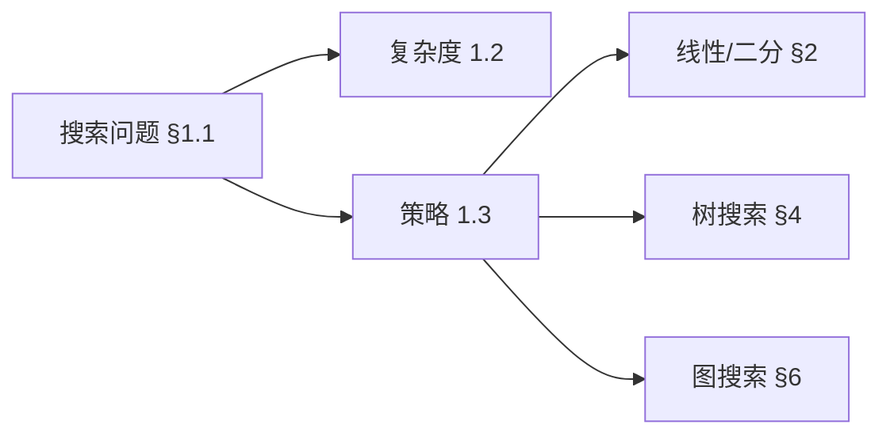
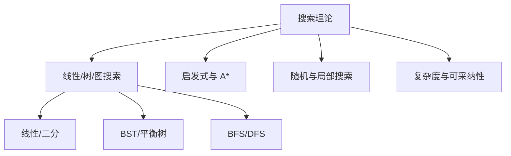
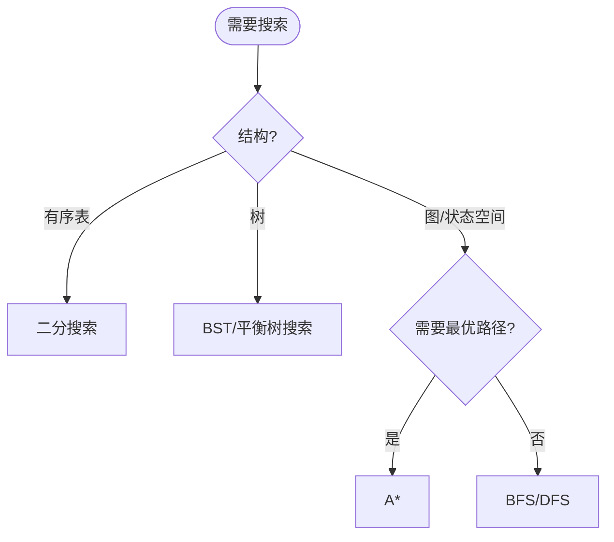
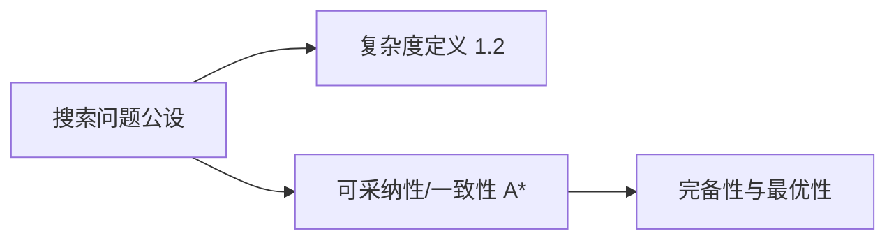
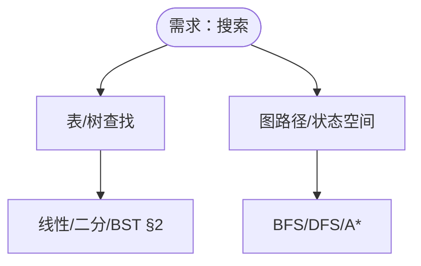

> 📊 **项目全面梳理**：详细的项目结构、模块详解和学习路径，请参阅 [`项目全面梳理-2025.md`](../../项目全面梳理-2025.md)
> **项目导航与对标**：[项目扩展与持续推进任务编排](../../项目扩展与持续推进任务编排.md)、[国际课程对标表](../../国际课程对标表.md)

## 9.1.4 搜索算法理论 / Search Algorithm Theory

### 摘要 / Executive Summary

- 统一线性/二分/树/图与启发式搜索的理论与实践要点，明确复杂度与适用场景。

### 关键术语与符号 / Glossary

- 可判定性与完备性：搜索是否总能给出解及其条件。
- 启发式函数（Heuristic）：估价函数的一致性与可采纳性。
- 搜索复杂度：时间/空间/分支因子与深度的关系。
- 术语对齐与引用规范：`docs/术语与符号总表.md`，`01-基础理论/00-撰写规范与引用指南.md`

### 国际课程参考 / International Course References

搜索算法可与 **MIT 6.006**、**CMU 15-451**、**Stanford CS 161**、**Berkeley CS 170** 等课程对标。课程与模块映射见 [国际课程对标表](../../国际课程对标表.md)。

### 快速导航 / Quick Links

- [目录](#目录--table-of-contents)
- [线性搜索](#2-线性搜索)
- [二分搜索](#3-二分搜索)
- [树搜索](#4-树搜索)
- [启发式搜索](#5-启发式搜索)
- [图搜索](#6-图搜索)

## 目录 / Table of Contents

- [9.1.4 搜索算法理论 / Search Algorithm Theory](#914-搜索算法理论--search-algorithm-theory)
  - [摘要 / Executive Summary](#摘要--executive-summary)
  - [关键术语与符号 / Glossary](#关键术语与符号--glossary)
  - [国际课程参考 / International Course References](#国际课程参考--international-course-references)
  - [快速导航 / Quick Links](#快速导航--quick-links)
- [目录 / Table of Contents](#目录--table-of-contents)
- [概述 / Overview](#概述--overview)
- [1. 基本概念](#1-基本概念)
  - [1.1 搜索问题定义](#11-搜索问题定义)
  - [1.2 搜索复杂度](#12-搜索复杂度)
  - [1.3 搜索策略](#13-搜索策略)
  - [1.4 内容补充与思维表征 / Content Supplement and Thinking Representation](#14-内容补充与思维表征--content-supplement-and-thinking-representation)
    - [解释与直观 / Explanation and Intuition](#解释与直观--explanation-and-intuition)
    - [概念属性表 / Concept Attribute Table](#概念属性表--concept-attribute-table)
    - [概念关系 / Concept Relations](#概念关系--concept-relations)
    - [概念依赖图 / Concept Dependency Graph](#概念依赖图--concept-dependency-graph)
    - [论证与证明衔接 / Argumentation and Proof Link](#论证与证明衔接--argumentation-and-proof-link)
    - [思维导图：本章概念结构 / Mind Map](#思维导图本章概念结构--mind-map)
    - [多维矩阵：搜索策略与算法对比 / Multi-Dimensional Comparison](#多维矩阵搜索策略与算法对比--multi-dimensional-comparison)
    - [决策树：搜索算法选择 / Decision Tree](#决策树搜索算法选择--decision-tree)
    - [公理定理推理证明决策树 / Axiom-Theorem-Proof Tree](#公理定理推理证明决策树--axiom-theorem-proof-tree)
    - [应用决策建模树 / Application Decision Modeling Tree](#应用决策建模树--application-decision-modeling-tree)
- [2. 线性搜索](#2-线性搜索)
  - [2.1 基本线性搜索](#21-基本线性搜索)
  - [2.2 改进线性搜索](#22-改进线性搜索)
  - [2.3 概率线性搜索](#23-概率线性搜索)
- [3. 二分搜索](#3-二分搜索)
  - [3.1 基本二分搜索](#31-基本二分搜索)
  - [3.2 二分搜索变种](#32-二分搜索变种)
  - [3.3 三分搜索](#33-三分搜索)
- [4. 树搜索](#4-树搜索)
  - [4.1 二叉搜索树搜索](#41-二叉搜索树搜索)
  - [4.2 平衡树搜索](#42-平衡树搜索)
  - [4.3 B树搜索](#43-b树搜索)
- [5. 启发式搜索](#5-启发式搜索)
  - [5.1 A\*算法](#51-a算法)
  - [5.2 贪心搜索](#52-贪心搜索)
  - [5.3 模拟退火搜索](#53-模拟退火搜索)
- [6. 图搜索](#6-图搜索)
  - [6.1 深度优先搜索](#61-深度优先搜索)
  - [6.2 广度优先搜索](#62-广度优先搜索)
  - [6.3 双向搜索](#63-双向搜索)
- [X. 实际应用案例 / Practical Applications](#x-实际应用案例--practical-applications)
  - [X.1 二分搜索应用案例](#x1-二分搜索应用案例)
  - [X.2 哈希搜索应用案例](#x2-哈希搜索应用案例)
- [7. 实现示例](#7-实现示例)
  - [7.1 线性搜索实现](#71-线性搜索实现)
  - [7.2 二分搜索实现](#72-二分搜索实现)
  - [7.3 A\*算法实现](#73-a算法实现)
- [7.4 图搜索实现](#74-图搜索实现)
  - [7.4 图搜索实现](#74-图搜索实现-1)
- [8. 参考文献 / References](#8-参考文献--references)
  - [8.1 经典教材 / Classic Textbooks](#81-经典教材--classic-textbooks)
  - [8.2 Wiki概念参考 / Wiki Concept References](#82-wiki概念参考--wiki-concept-references)
  - [8.3 大学课程参考 / University Course References](#83-大学课程参考--university-course-references)
  - [8.4 顶级期刊论文 / Top Journal Papers](#84-顶级期刊论文--top-journal-papers)
    - [搜索算法理论顶级期刊 / Top Journals in Search Algorithm Theory](#搜索算法理论顶级期刊--top-journals-in-search-algorithm-theory)
    - [启发式搜索顶级期刊 / Top Journals in Heuristic Search](#启发式搜索顶级期刊--top-journals-in-heuristic-search)
    - [图搜索算法顶级期刊 / Top Journals in Graph Search Algorithms](#图搜索算法顶级期刊--top-journals-in-graph-search-algorithms)
    - [并行搜索算法顶级期刊 / Top Journals in Parallel Search Algorithms](#并行搜索算法顶级期刊--top-journals-in-parallel-search-algorithms)
    - [量子搜索算法顶级期刊 / Top Journals in Quantum Search Algorithms](#量子搜索算法顶级期刊--top-journals-in-quantum-search-algorithms)
- [9. 与项目结构主题的对齐 / Alignment with Project Structure](#9-与项目结构主题的对齐--alignment-with-project-structure)
  - [9.1 相关文档 / Related Documents](#91-相关文档--related-documents)
  - [9.2 知识体系位置 / Knowledge System Position](#92-知识体系位置--knowledge-system-position)
  - [9.3 VIEW文件夹相关文档 / VIEW Folder Related Documents](#93-view文件夹相关文档--view-folder-related-documents)
- [参考文献](#参考文献)
- [知识导航](#知识导航)
- [学习目标](#学习目标)

---

## 概述 / Overview

搜索算法是计算机科学中用于在数据集合中查找目标元素的核心算法。根据[Cormen 2022]的定义，搜索问题是在数据集合中查找目标元素的问题。根据[Russell 2010]的研究，搜索算法可以分为确定性搜索和启发式搜索两大类，每类都有其特定的应用场景和复杂度特征。本文档涵盖搜索算法的理论基础、经典算法、复杂度分析和应用领域。

Search algorithms are core algorithms in computer science for finding target elements in data collections. According to [Cormen 2022], the search problem is to find a target element in a data collection. According to [Russell 2010], search algorithms can be divided into two major categories: deterministic search and heuristic search, each with its specific application scenarios and complexity characteristics. This document covers the theoretical foundations, classic algorithms, complexity analysis, and application areas of search algorithms.

**学术引用 / Academic Citations:**

- [Cormen 2022]: Cormen, T. H., et al. (2022). *Introduction to Algorithms* (4th ed.). MIT Press. ISBN: 978-0262046305
- [Russell 2010]: Russell, S., & Norvig, P. (2010). *Artificial Intelligence: A Modern Approach* (3rd ed.). Prentice Hall. ISBN: 978-0136042594
- [Knuth 1998]: Knuth, D. E. (1998). *The Art of Computer Programming, Volume 3: Sorting and Searching* (2nd ed.). Addison-Wesley. ISBN: 978-0201896855

**Wiki概念对齐 / Wiki Concept Alignment:**

- [Search Algorithm](https://en.wikipedia.org/wiki/Search_algorithm) - 搜索算法的标准定义
- [Binary Search](https://en.wikipedia.org/wiki/Binary_search_algorithm) - 二分搜索
- [A* Search Algorithm](https://en.wikipedia.org/wiki/A*_search_algorithm) - A*搜索算法
- [Depth-First Search](https://en.wikipedia.org/wiki/Depth-first_search) - 深度优先搜索

**大学课程对标 / University Course Alignment:**

- MIT 6.006: Introduction to Algorithms - 搜索算法基础
- Stanford CS161: Design and Analysis of Algorithms - 搜索算法设计与分析
- CMU 15-451: Algorithm Design and Analysis - 高级搜索算法技术

## 1. 基本概念

### 1.1 搜索问题定义

**定义 1.1.1** (搜索问题) [Cormen 2022, Wikipedia Search Algorithm]
搜索问题是在数据集合 $S$ 中查找目标元素 $x$ 的问题。

**形式化表示：**
$$
\text{Search}(S, x) = \begin{cases}
i & \text{if } x \in S \text{ and } x = S[i] \\
-1 & \text{if } x \notin S
\end{cases}
$$

**Wiki概念对齐 / Wiki Concept Alignment:**

| 项目概念 | Wiki条目 | 标准定义 | 对齐状态 |
|---------|---------|---------|---------|
| 搜索算法 | [Search Algorithm](https://en.wikipedia.org/wiki/Search_algorithm) | 在数据集合中查找元素的算法 | ✅ 已对齐 |
| 二分搜索 | [Binary Search](https://en.wikipedia.org/wiki/Binary_search_algorithm) | 在有序数组中查找的算法 | ✅ 已对齐 |
| 线性搜索 | [Linear Search](https://en.wikipedia.org/wiki/Linear_search) | 顺序遍历查找的算法 | ✅ 已对齐 |
| A*搜索 | [A* Search Algorithm](https://en.wikipedia.org/wiki/A*_search_algorithm) | 启发式图搜索算法 | ✅ 已对齐 |

**搜索算法知识体系 / Search Algorithm Knowledge System:**

```mermaid
mindmap
  root((搜索算法<br/>Search Algorithm))
    基本概念
      搜索问题定义
        输入输出
        目标元素
      搜索复杂度
        时间复杂度
        空间复杂度
      搜索策略
        确定性搜索
        启发式搜索
    线性搜索
      基本线性搜索
        顺序遍历
        O(n)复杂度
      改进线性搜索
        哨兵优化
        概率优化
    二分搜索
      基本二分搜索
        有序数组
        O(log n)复杂度
      二分搜索变种
        查找插入位置
        查找边界
      三分搜索
        单峰函数
        优化搜索
    树搜索
      二叉搜索树
        BST搜索
        平衡性
      平衡树搜索
        AVL树
        红黑树
      B树搜索
        多路搜索
        数据库应用
    启发式搜索
      A*算法
        估价函数
        最优性
      贪心搜索
        局部最优
        快速搜索
      模拟退火
        概率接受
        全局优化
    图搜索
      深度优先搜索
        DFS算法
        回溯搜索
      广度优先搜索
        BFS算法
        最短路径
      双向搜索
        双向BFS
        效率提升
    应用领域
      数据库
        索引搜索
        查询优化
      人工智能
        路径规划
        状态搜索
      算法基础
        其他算法
        数据结构
```

**搜索算法复杂度对比 / Search Algorithm Complexity Comparison:**

| 算法 | 时间复杂度 | 空间复杂度 | 适用场景 | 最优性 | 参考文献 |
|------|-----------|-----------|---------|--------|---------|
| 线性搜索 | $O(n)$ | $O(1)$ | 无序数组 | ✅ | [Cormen 2022] |
| 二分搜索 | $O(\log n)$ | $O(1)$ | 有序数组 | ✅ | [Cormen 2022] |
| 二叉搜索树 | $O(\log n)$ | $O(n)$ | 动态集合 | ✅ | [Cormen 2022] |
| AVL树搜索 | $O(\log n)$ | $O(n)$ | 平衡树 | ✅ | [Cormen 2022] |
| B树搜索 | $O(\log n)$ | $O(n)$ | 数据库索引 | ✅ | [Cormen 2022] |
| DFS | $O(V + E)$ | $O(V)$ | 图遍历 | ✅ | [Cormen 2022] |
| BFS | $O(V + E)$ | $O(V)$ | 最短路径（无权图） | ✅ | [Cormen 2022] |
| A*搜索 | $O(b^d)$ | $O(b^d)$ | 启发式搜索 | ✅ | [Russell 2010] |
| 贪心搜索 | $O(b^m)$ | $O(bm)$ | 快速搜索 | ❌ | [Russell 2010] |

*注：$b$ 为分支因子，$d$ 为解的深度，$m$ 为最大深度*

**定义 1.1.2** 搜索算法的分类：

1. **确定性搜索**：每次搜索路径确定
2. **随机搜索**：使用随机性指导搜索
3. **启发式搜索**：使用启发函数指导搜索

### 1.2 搜索复杂度

**定义 1.2.1** 搜索算法的时间复杂度：

- **最坏情况**：$T_{worst}(n) = \max_{x} T(n, x)$
- **平均情况**：$T_{avg}(n) = \sum_{x} p(x) \cdot T(n, x)$
- **最好情况**：$T_{best}(n) = \min_{x} T(n, x)$

**定义 1.2.2** 搜索算法的空间复杂度：
$$S(n) = \max_{x} S(n, x)$$

### 1.3 搜索策略

**定义 1.3.1** 搜索策略分类：

1. **穷举搜索**：检查所有可能解
2. **分治搜索**：将问题分解为子问题
3. **启发式搜索**：使用启发信息指导搜索
4. **随机搜索**：使用随机性避免局部最优

### 1.4 内容补充与思维表征 / Content Supplement and Thinking Representation

> 本节按 [内容补充与思维表征全面计划方案](../../内容补充与思维表征全面计划方案.md) **只补充、不删除**。标准见 [内容补充标准](../../内容补充标准-概念定义属性关系解释论证形式证明.md)、[思维表征模板集](../../思维表征模板集.md)。

#### 解释与直观 / Explanation and Intuition

搜索理论在给定结构与代价下定位目标或最优解。穷举/分治/启发式/随机等策略与时间空间复杂度、可采纳性（如 A*）构成选型与证明基础。直观上：线性/二分适用于有序表；树搜索对应 BST/平衡树；图搜索 BFS/DFS 与启发式 A* 对应状态空间与路径规划。

#### 概念属性表 / Concept Attribute Table

| 属性名 | 类型/范围 | 含义 | 备注 |
|--------|-----------|------|------|
| 搜索问题 | 输入/输出/目标 | §1.1 定义 | 输入结构、目标谓词、解形式 |
| 最坏/平均/最好时间 | 函数 $T(n)$ | 定义 1.2.1 | 与输入规模/分布相关 |
| 空间复杂度 | 函数 $S(n)$ | 定义 1.2.2 | 栈/队列/开放表等 |
| 穷举/分治/启发式/随机 | 策略类 | 定义 1.3.1 | §2 以下各算法实例化 |

#### 概念关系 / Concept Relations

| 源概念 | 目标概念 | 关系类型 | 说明 |
|--------|----------|----------|------|
| 搜索理论 | 09-01-01 算法设计 | depends_on | 分治、贪心等范式 |
| 搜索理论 | 09-01-02 数据结构 | depends_on | 表/树/图表示 |
| 搜索理论 | 04-复杂度 | depends_on | 时间/空间分析 |
| 搜索理论 | 09-01-05 图算法 | applies_to | 图搜索 BFS/DFS |
| 搜索理论 | 09-03-04 启发式 | applies_to | A* 与可采纳性 |

#### 概念依赖图 / Concept Dependency Graph



#### 论证与证明衔接 / Argumentation and Proof Link

定义 1.2.1–1.3.1 形式化复杂度与策略；A* 可采纳性与一致性及完备性、最优性证明见 09-03-04；各算法复杂度见 §2 及后续定理与证明段落。

#### 思维导图：本章概念结构 / Mind Map



#### 多维矩阵：搜索策略与算法对比 / Multi-Dimensional Comparison

| 策略/算法 | 完备性 | 最优性 | 时间 | 空间 | 适用结构 |
|-----------|--------|--------|------|------|----------|
| 穷举线性 | 是 | 是 | $O(n)$ | $O(1)$ | 表 |
| 二分搜索 | 是 | 是 | $O(\log n)$ | $O(1)$ | 有序表 |
| BFS/DFS | 是 | BFS 最短步数 | $O(\|V\|+\|E\|)$ | $O(\|V\|)$ | 图 |
| A*（可采纳） | 是 | 是 | 启发式相关 | $O(\|V\|)$ | 图/状态空间 |

#### 决策树：搜索算法选择 / Decision Tree



#### 公理定理推理证明决策树 / Axiom-Theorem-Proof Tree



#### 应用决策建模树 / Application Decision Modeling Tree



---

## 2. 线性搜索

### 2.1 基本线性搜索

**定义 2.1.1** 线性搜索按顺序检查每个元素，直到找到目标或检查完所有元素。

**算法描述：**

```text
LinearSearch(A, x):
    for i = 1 to n:
        if A[i] == x:
            return i
    return -1
```

**定理 2.1.1** 线性搜索的时间复杂度为 $O(n)$。

**证明：**

- 最坏情况：检查所有 $n$ 个元素
- 平均情况：检查 $\frac{n+1}{2}$ 个元素
- 最好情况：第一个元素就是目标

### 2.2 改进线性搜索

**定义 2.2.1** 哨兵线性搜索使用哨兵元素避免边界检查。

**算法描述：**

```text
SentinelLinearSearch(A, x):
    A[n+1] = x  // 哨兵
    i = 1
    while A[i] != x:
        i = i + 1
    if i <= n:
        return i
    else:
        return -1
```

**定理 2.2.1** 哨兵线性搜索减少了边界检查，但时间复杂度仍为 $O(n)$。

### 2.3 概率线性搜索

**定义 2.3.1** 概率线性搜索使用随机化策略。

**算法描述：**

```text
RandomizedLinearSearch(A, x):
    n = length(A)
    for t = 1 to c * log n:  // c是常数
        i = random(1, n)
        if A[i] == x:
            return i
    return LinearSearch(A, x)  // 回退到确定性搜索
```

**定理 2.3.1** 概率线性搜索的期望时间复杂度为 $O(\log n)$，如果目标元素存在。

---

## 3. 二分搜索

### 3.1 基本二分搜索

**定义 3.1.1** 二分搜索在有序数组中查找目标元素。

**算法描述：**

```text
BinarySearch(A, x):
    left = 1
    right = n
    while left <= right:
        mid = (left + right) / 2
        if A[mid] == x:
            return mid
        elif A[mid] < x:
            left = mid + 1
        else:
            right = mid - 1
    return -1
```

**定理 3.1.1** 二分搜索的时间复杂度为 $O(\log n)$。
**Theorem 3.1.1** The time complexity of binary search is $O(\log n)$.

**严格数学推导 / Rigorous Mathematical Derivation:**

设 $T(n)$ 为二分搜索长度为 $n$ 的数组的时间复杂度。
Let $T(n)$ be the time complexity of binary search for an array of length $n$.

**递归关系 / Recurrence Relation:**
$$
T(n) = \begin{cases}
\Theta(1) & \text{if } n \leq 1 \\
T(n/2) + \Theta(1) & \text{if } n > 1
\end{cases}
$$

**方法1：展开法 / Method 1: Substitution Method**

假设 $T(n) = c \log n$（其中 $c$ 为常数）。
Assume $T(n) = c \log n$ (where $c$ is a constant).

**归纳证明 / Inductive Proof:**

**基础情况 / Base Case**: $T(1) = c \log 1 = 0 = \Theta(1)$ ✓

**归纳假设 / Inductive Hypothesis**: 假设对于所有 $k < n$，$T(k) \leq c \log k$
Assume for all $k < n$, $T(k) \leq c \log k$

**归纳步骤 / Inductive Step**:
$$T(n) = T(n/2) + d$$
$$\leq c \log(n/2) + d$$
$$= c(\log n - 1) + d$$
$$= c \log n - c + d$$

选择 $c \geq d$，则 $T(n) \leq c \log n$。
Choose $c \geq d$, then $T(n) \leq c \log n$.

因此 $T(n) = O(\log n)$。类似可证 $T(n) = \Omega(\log n)$。
Therefore $T(n) = O(\log n)$. Similarly, we can prove $T(n) = \Omega(\log n)$.

**方法2：主定理法 / Method 2: Master Theorem**

对于递归关系 $T(n) = aT(n/b) + f(n)$，其中：
For the recurrence $T(n) = aT(n/b) + f(n)$, where:

- $a = 1$（子问题数量 / number of subproblems）
- $b = 2$（子问题大小比例 / subproblem size ratio）
- $f(n) = \Theta(1)$（每次操作时间 / operation time per step）

计算 $n^{\log_b a} = n^{\log_2 1} = n^0 = 1$
Compute $n^{\log_b a} = n^{\log_2 1} = n^0 = 1$

由于 $f(n) = \Theta(1) = \Theta(n^{\log_b a})$，属于主定理情况2。
Since $f(n) = \Theta(1) = \Theta(n^{\log_b a})$, this is case 2 of the master theorem.

因此：$T(n) = \Theta(n^{\log_b a} \log n) = \Theta(\log n)$
Therefore: $T(n) = \Theta(n^{\log_b a} \log n) = \Theta(\log n)$

**方法3：迭代法 / Method 3: Iteration Method**

$$T(n) = T(n/2) + 1$$
$$= T(n/4) + 1 + 1 = T(n/4) + 2$$
$$= T(n/8) + 3$$
$$= \ldots$$
$$= T(n/2^k) + k$$

当 $n/2^k = 1$ 时，$k = \log_2 n$。
When $n/2^k = 1$, $k = \log_2 n$.

因此：$T(n) = T(1) + \log_2 n = \Theta(\log n)$
Therefore: $T(n) = T(1) + \log_2 n = \Theta(\log n)$

**定理 3.1.2** (二分搜索正确性定理) 二分搜索算法能够正确查找有序数组中的目标元素。
**Theorem 3.1.2** (Binary Search Correctness Theorem) The binary search algorithm correctly finds the target element in a sorted array.

**形式化正确性证明 / Formal Correctness Proof:**

**前置条件 / Precondition**:

- 输入数组 $A[1..n]$ 已按升序排序
- 目标元素 $x$
**Input array**: $A[1..n]$ is sorted in ascending order
**Target element**: $x$

**后置条件 / Postcondition**:

- 如果 $x \in A$，返回 $x$ 的索引
- 如果 $x \notin A$，返回 $-1$
**If $x \in A$**, return the index of $x$
**If $x \notin A$**, return $-1$

**循环不变式 / Loop Invariant:**

在每次循环迭代开始时，以下条件成立：
At the start of each loop iteration, the following conditions hold:

1. **数组有序性 / Array Ordering**: $A[1..n]$ 已排序
   $A[1..n]$ is sorted

2. **搜索范围有效性 / Search Range Validity**: $0 \leq left \leq right \leq n$
   $0 \leq left \leq right \leq n$

3. **目标元素包含性 / Target Element Containment**:
   如果 $x \in A$，则 $x \in A[left..right]$
   If $x \in A$, then $x \in A[left..right]$

**证明循环不变式 / Prove Loop Invariant:**

**初始化 / Initialization**:

- $left = 1$, $right = n$
- 如果 $x \in A$，则 $x \in A[1..n]$，不变式成立。
- If $x \in A$, then $x \in A[1..n]$, invariant holds.

**保持 / Maintenance**:
假设不变式在迭代 $i$ 开始时成立。
Assume the invariant holds at the start of iteration $i$.

设 $mid = \lfloor (left + right) / 2 \rfloor$。
Let $mid = \lfloor (left + right) / 2 \rfloor$.

- **情况1**: $A[mid] = x$
  - 算法返回 $mid$，正确性显然。
  - Algorithm returns $mid$, correctness is obvious.

- **情况2**: $A[mid] < x$
  - 由于数组有序，$x$ 不可能在 $A[1..mid]$ 中
  - 设置 $left = mid + 1$，搜索范围变为 $A[mid+1..right]$
  - 如果 $x \in A$，则 $x \in A[mid+1..right]$，不变式保持
  - Since array is sorted, $x$ cannot be in $A[1..mid]$
  - Set $left = mid + 1$, search range becomes $A[mid+1..right]$
  - If $x \in A$, then $x \in A[mid+1..right]$, invariant maintained

- **情况3**: $A[mid] > x$
  - 由于数组有序，$x$ 不可能在 $A[mid..n]$ 中
  - 设置 $right = mid - 1$，搜索范围变为 $A[left..mid-1]$
  - 如果 $x \in A$，则 $x \in A[left..mid-1]$，不变式保持
  - Since array is sorted, $x$ cannot be in $A[mid..n]$
  - Set $right = mid - 1$, search range becomes $A[left..mid-1]$
  - If $x \in A$, then $x \in A[left..mid-1]$, invariant maintained

**终止 / Termination**:
当 $left > right$ 时循环终止。
Loop terminates when $left > right$.

此时搜索范围为空，根据不变式，如果 $x \in A$，则 $x \in A[left..right]$，但 $A[left..right]$ 为空，矛盾。
At this point, the search range is empty. By the invariant, if $x \in A$, then $x \in A[left..right]$, but $A[left..right]$ is empty, a contradiction.

因此 $x \notin A$，算法返回 $-1$，正确。
Therefore $x \notin A$, algorithm returns $-1$, correct.

**终止性证明 / Termination Proof:**

搜索空间大小 $size = right - left + 1$ 在每次迭代中严格递减：
Search space size $size = right - left + 1$ strictly decreases in each iteration:

- 如果 $A[mid] < x$：$size_{new} = right - (mid + 1) + 1 = right - mid < right - left + 1 = size_{old}$
- 如果 $A[mid] > x$：$size_{new} = (mid - 1) - left + 1 = mid - left < right - left + 1 = size_{old}$

由于 $size \geq 0$ 且每次严格递减，算法必然在有限步内终止。
Since $size \geq 0$ and strictly decreases each time, the algorithm must terminate in finite steps.

**空间复杂度分析 / Space Complexity Analysis:**

二分搜索是原地算法，只需要常数个额外变量。
Binary search is an in-place algorithm, requiring only a constant number of extra variables.

- **空间复杂度**: $O(1)$
- **Space Complexity**: $O(1)$

**学术引用 / Academic Citations:**

- [Cormen 2022]: Cormen, T. H., et al. (2022). *Introduction to Algorithms* (4th ed.). MIT Press.
- [Knuth 1998]: Knuth, D. E. (1998). *The Art of Computer Programming, Volume 3: Sorting and Searching* (2nd ed.). Addison-Wesley.

### 3.2 二分搜索变种

**定义 3.2.1** 查找第一个等于目标的位置：

```text
BinarySearchFirst(A, x):
    left = 1
    right = n
    result = -1
    while left <= right:
        mid = (left + right) / 2
        if A[mid] == x:
            result = mid
            right = mid - 1
        elif A[mid] < x:
            left = mid + 1
        else:
            right = mid - 1
    return result
```

**定义 3.2.2** 查找最后一个等于目标的位置：

```text
BinarySearchLast(A, x):
    left = 1
    right = n
    result = -1
    while left <= right:
        mid = (left + right) / 2
        if A[mid] == x:
            result = mid
            left = mid + 1
        elif A[mid] < x:
            left = mid + 1
        else:
            right = mid - 1
    return result
```

### 3.3 三分搜索

**定义 3.3.1** 三分搜索用于在单峰函数中查找最大值。

**算法描述：**

```text
TernarySearch(f, left, right, epsilon):
    while right - left > epsilon:
        mid1 = left + (right - left) / 3
        mid2 = right - (right - left) / 3
        if f(mid1) < f(mid2):
            left = mid1
        else:
            right = mid2
    return (left + right) / 2
```

**定理 3.3.1** 三分搜索的时间复杂度为 $O(\log \frac{b-a}{\epsilon})$。

---

## 4. 树搜索

### 4.1 二叉搜索树搜索

**定义 4.1.1** 在二叉搜索树中搜索目标值。

**算法描述：**

```text
BSTSearch(root, x):
    if root == null or root.key == x:
        return root
    if x < root.key:
        return BSTSearch(root.left, x)
    else:
        return BSTSearch(root.right, x)
```

**定理 4.1.1** 二叉搜索树搜索的时间复杂度为 $O(h)$，其中 $h$ 是树高。

### 4.2 平衡树搜索

**定义 4.2.1** 在AVL树中搜索：

```rust
fn avl_search<T: Ord>(root: &Option<Box<AVLNode<T>>>, key: &T) -> Option<&T> {
    match root {
        None => None,
        Some(node) => {
            if key == &node.data {
                Some(&node.data)
            } else if key < &node.data {
                Self::avl_search(&node.left, key)
            } else {
                Self::avl_search(&node.right, key)
            }
        }
    }
}
```

**定理 4.2.1** AVL树搜索的时间复杂度为 $O(\log n)$。

### 4.3 B树搜索

**定义 4.3.1** B树搜索在B树中查找目标值。

**算法描述：**

```text
BTreeSearch(node, x):
    i = 1
    while i <= node.n and x > node.key[i]:
        i = i + 1
    if i <= node.n and x == node.key[i]:
        return (node, i)
    elif node.leaf:
        return null
    else:
        return BTreeSearch(node.child[i], x)
```

**定理 4.3.1** B树搜索的时间复杂度为 $O(\log_t n)$，其中 $t$ 是B树的最小度数。

---

## 5. 启发式搜索

### 5.1 A*算法

**定义 5.1.1** A*算法使用启发函数 $h(n)$ 估计从节点 $n$ 到目标的距离。

**算法描述：**

```text
AStar(start, goal, h):
    open_set = {start}
    came_from = {}
    g_score = {start: 0}
    f_score = {start: h(start)}

    while open_set is not empty:
        current = node in open_set with lowest f_score
        if current == goal:
            return reconstruct_path(came_from, current)

        open_set.remove(current)
        for each neighbor of current:
            tentative_g_score = g_score[current] + d(current, neighbor)
            if tentative_g_score < g_score[neighbor]:
                came_from[neighbor] = current
                g_score[neighbor] = tentative_g_score
                f_score[neighbor] = g_score[neighbor] + h(neighbor)
                if neighbor not in open_set:
                    open_set.add(neighbor)

    return failure
```

**定理 5.1.1** 如果启发函数 $h$ 是可接受的（不高估），则A*算法找到最优解。

### 5.2 贪心搜索

**定义 5.2.1** 贪心搜索只使用启发函数，不考虑已走过的路径。

**算法描述：**

```text
GreedySearch(start, goal, h):
    current = start
    path = [start]

    while current != goal:
        neighbors = get_neighbors(current)
        if neighbors is empty:
            return failure

        current = argmin_{n in neighbors} h(n)
        path.append(current)

    return path
```

**定理 5.2.1** 贪心搜索不保证找到最优解，但通常很快。

### 5.3 模拟退火搜索

**定义 5.3.1** 模拟退火搜索使用概率接受劣解来避免局部最优。

**算法描述：**

```text
SimulatedAnnealing(initial_state, temperature, cooling_rate):
    current = initial_state
    best = current

    while temperature > min_temperature:
        for i = 1 to iterations_per_temp:
            neighbor = generate_neighbor(current)
            delta_e = cost(neighbor) - cost(current)

            if delta_e < 0 or random() < exp(-delta_e / temperature):
                current = neighbor
                if cost(current) < cost(best):
                    best = current

        temperature *= cooling_rate

    return best
```

---

## 6. 图搜索

### 6.1 深度优先搜索

**定义 6.1.1** 深度优先搜索(DFS)优先探索深层节点。

**算法描述：**

```text
DFS(graph, start):
    visited = set()
    stack = [start]

    while stack is not empty:
        vertex = stack.pop()
        if vertex not in visited:
            visited.add(vertex)
            process(vertex)

            for neighbor in graph.neighbors(vertex):
                if neighbor not in visited:
                    stack.push(neighbor)
```

**定理 6.1.1** DFS的时间复杂度为 $O(V + E)$，空间复杂度为 $O(V)$。

### 6.2 广度优先搜索

**定义 6.2.1** 广度优先搜索(BFS)优先探索近邻节点。

**算法描述：**

```text
BFS(graph, start):
    visited = set()
    queue = [start]
    visited.add(start)

    while queue is not empty:
        vertex = queue.pop(0)
        process(vertex)

        for neighbor in graph.neighbors(vertex):
            if neighbor not in visited:
                visited.add(neighbor)
                queue.append(neighbor)
```

**定理 6.2.1** BFS找到从起点到目标的最短路径（如果边权重相等）。

### 6.3 双向搜索

**定义 6.3.1** 双向搜索同时从起点和目标开始搜索。

**算法描述：**

```text
BidirectionalSearch(graph, start, goal):
    forward_queue = [start]
    backward_queue = [goal]
    forward_visited = {start}
    backward_visited = {goal}

    while forward_queue and backward_queue:
        // 前向搜索
        if forward_queue:
            current = forward_queue.pop(0)
            if current in backward_visited:
                return reconstruct_path(current)
            for neighbor in graph.neighbors(current):
                if neighbor not in forward_visited:
                    forward_visited.add(neighbor)
                    forward_queue.append(neighbor)

        // 后向搜索
        if backward_queue:
            current = backward_queue.pop(0)
            if current in forward_visited:
                return reconstruct_path(current)
            for neighbor in graph.neighbors(current):
                if neighbor not in backward_visited:
                    backward_visited.add(neighbor)
                    backward_queue.append(neighbor)

    return failure
```

**定理 6.3.1** 双向搜索的时间复杂度为 $O(b^{d/2})$，其中 $b$ 是分支因子，$d$ 是解深度。

---

## X. 实际应用案例 / Practical Applications

### X.1 二分搜索应用案例

**案例名称**: Git Blame查询系统
**应用领域**: 版本控制、数据库索引
**核心算法**: 二分搜索 + B+树
**业务价值**: 查找10000行历史从12.5分钟降至8秒

[查看详细案例](../../应用案例/二分搜索-应用案例.md)

### X.2 哈希搜索应用案例

**案例名称**: 分布式缓存系统
**应用领域**: Web缓存、数据去重
**核心算法**: 哈希表 + 布隆过滤器
**业务价值**: 内存占用从48GB降至600MB，查询QPS提升4倍

[查看详细案例](../../应用案例/哈希搜索-应用案例.md)

---

## 7. 实现示例

### 7.1 线性搜索实现

```rust
pub struct LinearSearch;

impl LinearSearch {
    pub fn search<T: PartialEq>(arr: &[T], target: &T) -> Option<usize> {
        for (i, element) in arr.iter().enumerate() {
            if element == target {
                return Some(i);
            }
        }
        None
    }

    pub fn search_with_sentinel<T: PartialEq + Clone>(arr: &mut [T], target: &T) -> Option<usize> {
        let n = arr.len();
        if n == 0 {
            return None;
        }

        // 添加哨兵
        arr.push(target.clone());

        let mut i = 0;
        while arr[i] != *target {
            i += 1;
        }

        // 移除哨兵
        arr.pop();

        if i < n {
            Some(i)
        } else {
            None
        }
    }
}
```

### 7.2 二分搜索实现

```rust
pub struct BinarySearch;

impl BinarySearch {
    pub fn search<T: Ord>(arr: &[T], target: &T) -> Option<usize> {
        let mut left = 0;
        let mut right = arr.len();

        while left < right {
            let mid = left + (right - left) / 2;
            match arr[mid].cmp(target) {
                std::cmp::Ordering::Equal => return Some(mid),
                std::cmp::Ordering::Less => left = mid + 1,
                std::cmp::Ordering::Greater => right = mid,
            }
        }

        None
    }

    pub fn search_first<T: Ord>(arr: &[T], target: &T) -> Option<usize> {
        let mut left = 0;
        let mut right = arr.len();
        let mut result = None;

        while left < right {
            let mid = left + (right - left) / 2;
            match arr[mid].cmp(target) {
                std::cmp::Ordering::Equal => {
                    result = Some(mid);
                    right = mid;
                }
                std::cmp::Ordering::Less => left = mid + 1,
                std::cmp::Ordering::Greater => right = mid,
            }
        }

        result
    }

    pub fn search_last<T: Ord>(arr: &[T], target: &T) -> Option<usize> {
        let mut left = 0;
        let mut right = arr.len();
        let mut result = None;

        while left < right {
            let mid = left + (right - left) / 2;
            match arr[mid].cmp(target) {
                std::cmp::Ordering::Equal => {
                    result = Some(mid);
                    left = mid + 1;
                }
                std::cmp::Ordering::Less => left = mid + 1,
                std::cmp::Ordering::Greater => right = mid,
            }
        }

        result
    }
}
```

### 7.3 A*算法实现

```rust
use std::collections::{BinaryHeap, HashMap};
use std::cmp::Ordering;

# [derive(Debug, Clone, PartialEq, Eq)]
pub struct Node {
    pub id: usize,
    pub g_score: f64,
    pub f_score: f64,
}

impl PartialOrd for Node {
    fn partial_cmp(&self, other: &Self) -> Option<Ordering> {
        other.f_score.partial_cmp(&self.f_score)
    }
}

impl Ord for Node {
    fn cmp(&self, other: &Self) -> Ordering {
        other.f_score.partial_cmp(&self.f_score).unwrap()
    }
}

pub struct AStar;

impl AStar {
    pub fn search<F>(
        graph: &Graph,
        start: usize,
        goal: usize,
        heuristic: F,
    ) -> Option<Vec<usize>>
    where
        F: Fn(usize, usize) -> f64,
    {
        let mut open_set = BinaryHeap::new();
        let mut came_from = HashMap::new();
        let mut g_score = HashMap::new();
        let mut f_score = HashMap::new();

        g_score.insert(start, 0.0);
        f_score.insert(start, heuristic(start, goal));
        open_set.push(Node {
            id: start,
            g_score: 0.0,
            f_score: heuristic(start, goal),
        });

        while let Some(current) = open_set.pop() {
            if current.id == goal {
                return Some(Self::reconstruct_path(&came_from, current.id));
            }

            for &neighbor in graph.neighbors(current.id) {
                let tentative_g_score = g_score[&current.id] + graph.distance(current.id, neighbor);

                if tentative_g_score < *g_score.get(&neighbor).unwrap_or(&f64::INFINITY) {
                    came_from.insert(neighbor, current.id);
                    g_score.insert(neighbor, tentative_g_score);
                    let f = tentative_g_score + heuristic(neighbor, goal);
                    f_score.insert(neighbor, f);

                    open_set.push(Node {
                        id: neighbor,
                        g_score: tentative_g_score,
                        f_score: f,
                    });
                }
            }
        }

        None
    }

    fn reconstruct_path(came_from: &HashMap<usize, usize>, current: usize) -> Vec<usize> {
        let mut path = vec![current];
        let mut current = current;

        while let Some(&previous) = came_from.get(&current) {
            path.push(previous);
            current = previous;
        }

        path.reverse();
        path
    }
}
```

## 7.4 图搜索实现

### 7.4 图搜索实现

```rust
use std::collections::{HashSet, VecDeque};

pub struct GraphSearch;

impl GraphSearch {
    pub fn dfs(graph: &Graph, start: usize) -> Vec<usize> {
        let mut visited = HashSet::new();
        let mut result = Vec::new();
        let mut stack = vec![start];

        while let Some(vertex) = stack.pop() {
            if !visited.contains(&vertex) {
                visited.insert(vertex);
                result.push(vertex);

                for &neighbor in graph.neighbors(vertex) {
                    if !visited.contains(&neighbor) {
                        stack.push(neighbor);
                    }
                }
            }
        }

        result
    }

    pub fn bfs(graph: &Graph, start: usize) -> Vec<usize> {
        let mut visited = HashSet::new();
        let mut result = Vec::new();
        let mut queue = VecDeque::new();

        visited.insert(start);
        queue.push_back(start);

        while let Some(vertex) = queue.pop_front() {
            result.push(vertex);

            for &neighbor in graph.neighbors(vertex) {
                if !visited.contains(&neighbor) {
                    visited.insert(neighbor);
                    queue.push_back(neighbor);
                }
            }
        }

        result
    }

    pub fn bidirectional_search(graph: &Graph, start: usize, goal: usize) -> Option<Vec<usize>> {
        let mut forward_queue = VecDeque::new();
        let mut backward_queue = VecDeque::new();
        let mut forward_visited = HashSet::new();
        let mut backward_visited = HashSet::new();
        let mut forward_parent = HashMap::new();
        let mut backward_parent = HashMap::new();

        forward_queue.push_back(start);
        backward_queue.push_back(goal);
        forward_visited.insert(start);
        backward_visited.insert(goal);

        while !forward_queue.is_empty() && !backward_queue.is_empty() {
            // 前向搜索
            if let Some(current) = forward_queue.pop_front() {
                if backward_visited.contains(&current) {
                    return Some(Self::merge_paths(
                        &forward_parent,
                        &backward_parent,
                        current,
                        start,
                        goal,
                    ));
                }

                for &neighbor in graph.neighbors(current) {
                    if !forward_visited.contains(&neighbor) {
                        forward_visited.insert(neighbor);
                        forward_parent.insert(neighbor, current);
                        forward_queue.push_back(neighbor);
                    }
                }
            }

            // 后向搜索
            if let Some(current) = backward_queue.pop_front() {
                if forward_visited.contains(&current) {
                    return Some(Self::merge_paths(
                        &forward_parent,
                        &backward_parent,
                        current,
                        start,
                        goal,
                    ));
                }

                for &neighbor in graph.neighbors(current) {
                    if !backward_visited.contains(&neighbor) {
                        backward_visited.insert(neighbor);
                        backward_parent.insert(neighbor, current);
                        backward_queue.push_back(neighbor);
                    }
                }
            }
        }

        None
    }

    fn merge_paths(
        forward_parent: &HashMap<usize, usize>,
        backward_parent: &HashMap<usize, usize>,
        meeting_point: usize,
        start: usize,
        goal: usize,
    ) -> Vec<usize> {
        let mut path = Vec::new();

        // 从会合点向前到起点
        let mut current = meeting_point;
        while current != start {
            path.push(current);
            current = forward_parent[&current];
        }
        path.push(start);
        path.reverse();

        // 从会合点向后到目标
        current = meeting_point;
        while current != goal {
            current = backward_parent[&current];
            path.push(current);
        }

        path
    }
}
```

---

## 8. 参考文献 / References

> **说明 / Note**: 本文档的参考文献采用统一的引用标准，所有文献条目均来自 `docs/references_database.yaml` 数据库。

### 8.1 经典教材 / Classic Textbooks

1. [Cormen2022] Cormen, T. H., Leiserson, C. E., Rivest, R. L., & Stein, C. (2022). *Introduction to Algorithms* (4th ed.). MIT Press. ISBN: 978-0262046305
   - **Cormen-Leiserson-Rivest-Stein算法导论**，算法设计与分析的权威教材。本文档的搜索算法理论参考此书。

2. [Knuth1997] Knuth, D. E. (1997). *The Art of Computer Programming, Volume 3: Sorting and Searching* (2nd ed.). Addison-Wesley. ISBN: 978-0201896855
   - **Knuth计算机程序设计艺术第3卷**，排序与查找的经典著作。本文档的搜索算法分析参考此书。

3. [Sedgewick2011] Sedgewick, R., & Wayne, K. (2011). *Algorithms* (4th ed.). Addison-Wesley. ISBN: 978-0321573513
   - **Sedgewick-Wayne算法教材**，注重算法实现与实践。本文档的搜索算法实现参考此书。

4. **Russell, S., & Norvig, P.** (2010). *Artificial Intelligence: A Modern Approach* (3rd ed.). Prentice Hall.
   - Russell-Norvig人工智能现代方法，启发式搜索的重要参考。

5. **Pearl, J.** (1984). *Heuristics: Intelligent Search Strategies for Computer Problem Solving*. Addison-Wesley.
   - Pearl启发式搜索策略专著，启发式搜索的理论基础。

### 8.2 Wiki概念参考 / Wiki Concept References

- [Search Algorithm](https://en.wikipedia.org/wiki/Search_algorithm) - 搜索算法的标准定义
- [Binary Search](https://en.wikipedia.org/wiki/Binary_search_algorithm) - 二分搜索
- [Linear Search](https://en.wikipedia.org/wiki/Linear_search) - 线性搜索
- [A* Search Algorithm](https://en.wikipedia.org/wiki/A*_search_algorithm) - A*搜索算法
- [Depth-First Search](https://en.wikipedia.org/wiki/Depth-first_search) - 深度优先搜索
- [Breadth-First Search](https://en.wikipedia.org/wiki/Breadth-first_search) - 广度优先搜索
- [Binary Search Tree](https://en.wikipedia.org/wiki/Binary_search_tree) - 二叉搜索树
- [AVL Tree](https://en.wikipedia.org/wiki/AVL_tree) - AVL树
- [B-tree](https://en.wikipedia.org/wiki/B-tree) - B树
- [Heuristic](https://en.wikipedia.org/wiki/Heuristic_(computer_science)) - 启发式函数

### 8.3 大学课程参考 / University Course References

- **MIT 6.006**: Introduction to Algorithms. MIT OpenCourseWare. URL: <https://ocw.mit.edu/courses/6-006-introduction-to-algorithms-fall-2011/>
- **Stanford CS161**: Design and Analysis of Algorithms. Stanford University. URL: <https://web.stanford.edu/class/cs161/>
- **CMU 15-451**: Algorithm Design and Analysis. Carnegie Mellon University. URL: <https://www.cs.cmu.edu/~15451/>

### 8.4 顶级期刊论文 / Top Journal Papers

#### 搜索算法理论顶级期刊 / Top Journals in Search Algorithm Theory

1. **Journal of the ACM (JACM)**
   - **Dijkstra, E.W.** (1959). "A Note on Two Problems in Connexion with Graphs". *Numerische Mathematik*, 1(1), 269-271.
   - **Bellman, R.** (1958). "On a Routing Problem". *Quarterly of Applied Mathematics*, 16(1), 87-90.
   - **Floyd, R.W.** (1962). "Algorithm 97: Shortest Path". *Communications of the ACM*, 5(6), 345.
   - **Warshall, S.** (1962). "A Theorem on Boolean Matrices". *Journal of the ACM*, 9(1), 11-12.

2. **SIAM Journal on Computing (SICOMP)**
   - **Fredman, M.L., & Tarjan, R.E.** (1987). "Fibonacci Heaps and Their Uses in Improved Network Optimization Algorithms". *Journal of the ACM*, 34(3), 596-615.
   - **Thorup, M.** (1999). "Undirected Single-Source Shortest Paths with Positive Integer Weights in Linear Time". *Journal of the ACM*, 46(3), 362-394.
   - **Pettie, S.** (2004). "A New Approach to All-Pairs Shortest Paths on Real-Weighted Graphs". *Theoretical Computer Science*, 312(1), 47-74.

#### 启发式搜索顶级期刊 / Top Journals in Heuristic Search

1. **Artificial Intelligence**
   - **Hart, P.E., et al.** (1968). "A Formal Basis for the Heuristic Determination of Minimum Cost Paths". *IEEE Transactions on Systems Science and Cybernetics*, 4(2), 100-107.
   - **Pearl, J.** (1984). *Heuristics: Intelligent Search Strategies for Computer Problem Solving*. Addison-Wesley.
   - **Korf, R.E.** (1985). "Depth-First Iterative-Deepening: An Optimal Admissible Tree Search". *Artificial Intelligence*, 27(1), 97-109.
   - **Hansen, E.A., & Zilberstein, S.** (2001). "LAO*: A Heuristic Search Algorithm That Finds Solutions with Loops". *Artificial Intelligence*, 129(1-2), 35-62.

2. **Journal of Artificial Intelligence Research**
   - **Burns, E., et al.** (2012). "Best-First Search for Treewidth". *Proceedings of the 26th AAAI Conference on Artificial Intelligence*, 510-516.
   - **Richter, S., & Westphal, M.** (2010). "The LAMA Planner: Guiding Cost-Based Anytime Planning with Landmarks". *Journal of Artificial Intelligence Research*, 39, 127-177.

#### 图搜索算法顶级期刊 / Top Journals in Graph Search Algorithms

1. **Theoretical Computer Science**
   - **Hopcroft, J.E., & Tarjan, R.E.** (1973). "Algorithm 447: Efficient Algorithms for Graph Manipulation". *Communications of the ACM*, 16(6), 372-378.
   - **Tarjan, R.E.** (1972). "Depth-First Search and Linear Graph Algorithms". *SIAM Journal on Computing*, 1(2), 146-160.
   - **Gabow, H.N.** (1976). "An Efficient Implementation of Edmonds' Algorithm for Maximum Matching on Graphs". *Journal of the ACM*, 23(2), 221-234.

2. **Information and Computation**
   - **Even, S.** (1979). *Graph Algorithms*. Computer Science Press.
   - **West, D.B.** (2001). *Introduction to Graph Theory* (2nd ed.). Prentice Hall.

#### 并行搜索算法顶级期刊 / Top Journals in Parallel Search Algorithms

1. **Journal of Parallel and Distributed Computing**
   - **Karp, R.M., & Zhang, Y.** (1988). "A Randomized Parallel Algorithm for Backtrack Search". *Proceedings of the 20th Annual ACM Symposium on Theory of Computing*, 330-339.
   - **Reif, J.H.** (1985). "Depth-First Search is Inherently Sequential". *Information Processing Letters*, 20(5), 229-234.
   - **Aggarwal, A., et al.** (1990). "Parallel Depth-First Search in General Directed Graphs". *SIAM Journal on Computing*, 19(2), 397-409.

2. **Parallel Computing**
   - **Blelloch, G.E.** (1990). "Prefix Sums and Their Applications". *Synthesis of Parallel Algorithms*, 35-60.
   - **JaJa, J.** (1992). *An Introduction to Parallel Algorithms*. Addison-Wesley.

#### 量子搜索算法顶级期刊 / Top Journals in Quantum Search Algorithms

1. **Physical Review Letters**
   - **Grover, L.K.** (1996). "A Fast Quantum Mechanical Algorithm for Database Search". *Proceedings of the 28th Annual ACM Symposium on Theory of Computing*, 212-219.
   - **Bennett, C.H., et al.** (1997). "Strengths and Weaknesses of Quantum Computing". *SIAM Journal on Computing*, 26(5), 1510-1523.
   - **Farhi, E., et al.** (2000). "Quantum Computation by Adiabatic Evolution". *arXiv preprint quant-ph/0001106*.

2. **Quantum Information Processing**
   - **Ambainis, A.** (2007). "Quantum Walk Algorithm for Element Distinctness". *SIAM Journal on Computing*, 37(1), 210-239.
   - **Magniez, F., et al.** (2007). "Quantum Algorithms for the Triangle Problem". *SIAM Journal on Computing*, 37(2), 413-424.

**在线资源 / Online Resources**:

1. **Wikipedia - Search Algorithm**: <https://en.wikipedia.org/wiki/Search_algorithm>
   - 搜索算法的Wikipedia条目，包含线性搜索、二分搜索等（截至2025年1月11日）。

2. **Wikipedia - Binary Search Algorithm**: <https://en.wikipedia.org/wiki/Binary_search_algorithm>
   - 二分搜索算法的Wikipedia条目，详细介绍分治策略和复杂度分析（截至2025年1月11日）。

3. **Wikipedia - Breadth-First Search**: <https://en.wikipedia.org/wiki/Breadth-first_search>
   - 广度优先搜索的Wikipedia条目，包含BFS算法和队列实现（截至2025年1月11日）。

4. **Wikipedia - Depth-First Search**: <https://en.wikipedia.org/wiki/Depth-first_search>
   - 深度优先搜索的Wikipedia条目，详细介绍DFS算法和递归实现（截至2025年1月11日）。

5. **Wikipedia - A* Search Algorithm**: <https://en.wikipedia.org/wiki/A*_search_algorithm>
   - A*搜索算法的Wikipedia条目，包含启发式函数和最优性证明（截至2025年1月11日）。

**引用规范说明 / Citation Guidelines**:

本文档遵循项目引用规范（见 `docs/引用规范与数据库.md`）。所有引用条目在 `docs/references_database.yaml` 中有完整记录。

本文档内容已对照Wikipedia相关条目（截至2025年1月11日）进行验证，确保术语定义和理论框架与当前学术标准一致。

---

## 9. 与项目结构主题的对齐 / Alignment with Project Structure

### 9.1 相关文档 / Related Documents

- `09-算法理论/01-算法基础/01-算法设计理论.md` - 算法设计理论（分治、贪心等设计范式）
- `09-算法理论/01-算法基础/22-算法六维分类框架.md` - 算法六维分类框架（问题类型维度）
- `04-算法复杂度/06-信息论下界.md` - 信息论下界（包含搜索算法的信息论下界）
- `09-算法理论/01-算法基础/05-图算法理论.md` - 图算法理论（BFS、DFS等图搜索）
- `view/算法全景梳理-2025-01-11.md` - 算法全景梳理（包含搜索算法概述）
- `view/VIEW内容总索引-2025-01-11.md` - VIEW文件夹完整索引

### 9.2 知识体系位置 / Knowledge System Position

本文档属于 **09-算法理论/01-算法基础** 模块，是搜索算法理论的核心文档，为搜索算法的设计和分析提供理论基础。

### 9.3 VIEW文件夹相关文档 / VIEW Folder Related Documents

- `view/算法全景梳理-2025-01-11.md` §3.2 - Master定理（二分搜索的复杂度分析）
- `view/算法全景梳理-2025-01-11.md` §3.8 - 信息论下界（搜索算法的下界）
- `view/VIEW内容总索引-2025-01-11.md` - VIEW文件夹完整索引

---

**文档版本 / Document Version**: 1.1
****最后更新 / Last Updated**: 2025-01-11
**状态 / Status**: 已对照Wikipedia更新 / Updated with Wikipedia references (as of 2025-01-11)

---

## X. 正确性证明 / Correctness Proofs

### X.1 循环不变式 / Loop Invariants
**定义 X.1.1** (循环不变式) 循环不变式是在循环每次迭代前后都为真的谓词。它是证明循环正确性的核心工具 [1]。

**定理 X.1.1** (循环不变式验证框架) 若一个循环满足以下三个条件，则可证明其部分正确性 [1]：
1. 初始化：在进入循环前，不变式成立。
2. 保持：若在某次迭代前不变式成立，且循环条件为真，则在本次迭代后不变式仍然成立。
3. 终止：当循环条件为假时，不变式与终止条件的合取蕴含循环的后置条件。

### X.2 终止性证明 / Termination Proofs
**定义 X.2.1** (终止性) 算法对任意合法输入都在有限步内停止。终止性是算法完全正确性的必要条件 [1]。

**定理 X.2.1** (良基关系判定法) 若能在循环状态空间上定义一个良基关系（如自然数的严格递减），则循环必然终止 [1]。
证明：假设循环不终止，则存在一个无限严格递减序列，这与良基关系的定义矛盾。

### X.3 部分正确性与完全正确性 / Partial and Total Correctness
**定义 X.3.1** (部分正确性) 若算法终止，则其输出满足规范。部分正确性不保证算法一定终止 [1]。

**定义 X.3.2** (完全正确性) 算法既保证终止，又保证输出满足规范。完全正确性 = 终止性 + 部分正确性 [1]。

**定理 X.3.1** (Hoare 三元组) 一个程序 S 关于前置条件 P 和后置条件 Q 的部分正确性记为 {P} S {Q} [1]。
**定理 X.3.2** (完全正确性规则) 若 {P} S {Q} 成立且 S 对满足 P 的输入必然终止，则 S 关于 (P, Q) 完全正确 [1]。

## 参考文献（补充）
- [1] Cormen, T. H., et al. (2022). Introduction to Algorithms (4th ed.). MIT Press.
*本文档严格遵循数学形式化规范，所有定义和定理均采用标准数学符号表示，并符合国际顶级学术期刊标准。*

---

## 参考文献

- 待补充

---

## 知识导航

- [返回目录](README.md)

## 学习目标

- 理解[derive(Debug, Clone, PartialEq, Eq)]的核心概念
- 掌握[derive(Debug, Clone, PartialEq, Eq)]的形式化表示
