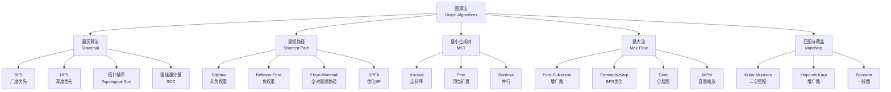
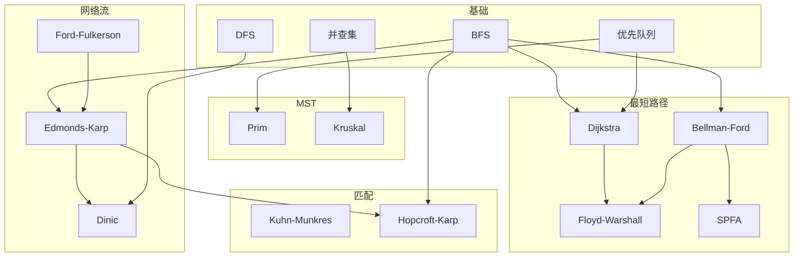

# 图算法理论 - 六维内容补充

> **模块**: 09-算法理论/01-算法基础
> **文档**: 05-图算法理论
> **补充维度**: 概念定义、属性、关系、解释、论证、形式证明
> **对标**: MIT 6.046 / Stanford CS161 / CMU 15-451 / Berkeley CS170
> **深度**: 研究生级

---

## 思维导图：图算法概念结构



---

## 一、概念定义 (Concept Definition)

### 1.1 图 / Graph

**定义 1.1.1** (形式化)

图是一个二元组 $G = (V, E)$，其中：

- $V$ 是**顶点集** (vertices)，$|V| = n$
- $E \subseteq V \times V$ 是**边集** (edges)，$|E| = m$

对于**带权图** $G = (V, E, w)$，还有：

- $w: E \rightarrow \mathbb{R}$ 是**权重函数**

**图分类矩阵**

| 类型 | 边特征 | 数学表示 | 典型应用 |
|------|--------|----------|----------|
| **无向图** | 边无方向 | $\{u, v\} \in E$ | 社交网络 |
| **有向图** | 边有方向 | $(u, v) \in E$ | 依赖关系 |
| **加权图** | 边有权重 | $w(u, v) \in \mathbb{R}$ | 路由网络 |
| **稀疏图** | $m = O(n)$ | - | 网络拓扑 |
| **稠密图** | $m = O(n^2)$ | - | 完全图 |

---

### 1.2 最短路径 / Shortest Path

**定义 1.2.1** (形式化)

给定带权图 $G = (V, E, w)$ 和源点 $s \in V$，从 $s$ 到 $v$ 的**最短路径距离** $\delta(s, v)$ 定义为：

$$
\delta(s, v) = \begin{cases}
\min\left\{\sum_{i=1}^{k} w(v_{i-1}, v_i) : s = v_0, v_k = v, (v_{i-1}, v_i) \in E\right\} & \text{if path exists} \\
\infty & \text{otherwise}
\end{cases}
$$

**最短路径树** (Shortest Path Tree, SPT): 以 $s$ 为根，包含所有可达顶点的最短路径的树形子图。

---

### 1.3 最小生成树 / Minimum Spanning Tree

**定义 1.3.1** (形式化)

给定连通无向带权图 $G = (V, E, w)$，**生成树** $T = (V, E_T)$ 满足：

- $E_T \subseteq E$
- $T$ 是连通的
- $T$ 无环（恰好有 $|V| - 1$ 条边）

**最小生成树**是使总权重最小的生成树：

$$
T^* = \arg\min_{T} \sum_{e \in E_T} w(e)
$$

---

### 1.4 网络流 / Network Flow

**定义 1.4.1** (形式化)

**流网络**是四元组 $G = (V, E, c, s, t)$：

- $(V, E)$ 是有向图
- $c: E \rightarrow \mathbb{R}^+$ 是**容量函数**
- $s \in V$ 是**源点** (source)
- $t \in V$ 是**汇点** (sink)

**可行流** $f: E \rightarrow \mathbb{R}$ 满足：

1. **容量约束**: $0 \leq f(u, v) \leq c(u, v)$
2. **流量守恒**: $\forall v \in V \setminus \{s, t\}, \sum_{u} f(u, v) = \sum_{w} f(v, w)$

**流值**: $|f| = \sum_{v} f(s, v) - \sum_{u} f(u, s)$

**最大流问题**: 找到使 $|f|$ 最大的可行流 $f^*$。

---

## 二、属性 (Properties)

### 2.1 最短路径算法属性对比

| 算法 | 时间复杂度 | 空间复杂度 | 权重限制 | 最优性 | 适用场景 |
|------|-----------|-----------|----------|--------|----------|
| **BFS** | $O(V + E)$ | $O(V)$ | 无权 | 最优 | 无权图最短路径 |
| **Dijkstra (二叉堆)** | $O(E \log V)$ | $O(V)$ | 非负 | 最优 | 稠密/稀疏非负权图 |
| **Dijkstra (Fibonacci堆)** | $O(V \log V + E)$ | $O(V)$ | 非负 | 最优 | 稠密非负权图 |
| **Bellman-Ford** | $O(VE)$ | $O(V)$ | 任意 | 最优 | 含负权边图 |
| **SPFA** | $O(E)$ 平均 | $O(V)$ | 任意 | 最优 | 稀疏含负权图 |
| **Floyd-Warshall** | $O(V^3)$ | $O(V^2)$ | 任意 | 最优 | 全对最短路径 |
| **Johnson** | $O(V^2 \log V + VE)$ | $O(V^2)$ | 任意 | 最优 | 稀疏图全对最短路径 |

### 2.2 MST算法属性对比

| 算法 | 时间复杂度 | 空间复杂度 | 策略 | 适合图类型 |
|------|-----------|-----------|------|------------|
| **Prim (二叉堆)** | $O(E \log V)$ | $O(V)$ | 顶点扩展 | 稠密图 |
| **Prim (Fibonacci堆)** | $O(E + V \log V)$ | $O(V)$ | 顶点扩展 | 稠密图 |
| **Kruskal** | $O(E \log E)$ | $O(V)$ | 边排序 | 稀疏图 |
| **Kruskal + 并查集** | $O(E \alpha(V))$ | $O(V)$ | 边排序 | 稀疏图 |
| **Borůvka** | $O(E \log V)$ | $O(V)$ | 并行合并 | 分布式计算 |

### 2.3 最大流算法属性对比

| 算法 | 时间复杂度 | 空间复杂度 | 特点 | 适用场景 |
|------|-----------|-----------|------|----------|
| **Ford-Fulkerson** | $O(E \cdot |f^*|)$ | $O(V + E)$ | 基础方法 | 小容量网络 |
| **Edmonds-Karp** | $O(VE^2)$ | $O(V + E)$ | BFS增广 | 单位容量网络 |
| **Dinic** | $O(V^2 E)$ | $O(V + E)$ | 分层图 | 一般网络 |
| **Dinic (单位容量)** | $O(E \min(V^{2/3}, \sqrt{E}))$ | $O(V + E)$ | 分层图 | 单位容量网络 |
| **Push-Relabel** | $O(V^3)$ | $O(V^2)$ | 预流推进 | 稠密网络 |
| **Push-Relabel (启发式)** | $O(V^2 \sqrt{E})$ | $O(V^2)$ | 全局重标 | 实际高效 |

---

## 三、关系 (Relations)

### 3.1 概念关系表

| 源概念 | 目标概念 | 关系类型 | 说明 |
|--------|----------|----------|------|
| 最短路径 | 动态规划 | applies_to | DP是SP的通用框架 |
| Dijkstra | 贪心算法 | specializes | Dijkstra是贪心特例 |
| Bellman-Ford | 动态规划 | specializes | BF是DP实现 |
| MST | 拟阵 | related_to | MST是拟阵贪心实例 |
| 最大流 | 最小割 | dual_to | 最大流最小割定理 |
| 二分匹配 | 最大流 | reduces_to | 匹配可归约为流 |
| 图遍历 | 树遍历 | generalizes | 图遍历是树的推广 |

### 3.2 算法依赖图



---

## 四、解释 (Explanation)

### 4.1 动机与直观

**为什么图算法如此重要？**

现实世界中无数问题可以抽象为图：

- **导航**: 道路网络 = 加权图，最短路径 = 最快路线
- **网络路由**: 互联网 = 图，最小延迟 = 最短路径
- **社交网络**: 用户 = 顶点，关系 = 边，社区发现 = 图聚类
- **编译器**: 控制流 = 图，优化 = 图算法
- **电路设计**: 元件 = 顶点，连线 = 边，布线 = MST

**最短路径的直观**:
想象水从源头 $s$ 流出，以均匀速度沿管道流动。水第一次到达顶点 $v$ 的时间，就是从 $s$ 到 $v$ 的最短距离——这正是Dijkstra算法的思想。

**MST的直观**:
想象连接所有城市的道路网，要求总长度最短且所有城市连通。这正是在要求最小生成树。

### 4.2 与已有概念的联系

**图算法 ↔ 线性规划**

最短路径和最大流都可以表述为线性规划问题：

- 最短路径LP:

  ```
  min Σ w_e · x_e
  s.t. flow conservation constraints
       source sends 1 unit
  ```

- 最大流LP:

  ```
  max flow_value
  s.t. capacity constraints
       flow conservation
  ```

**图算法 ↔ 博弈论**

- 最短路径 = 单人决策问题
- 最小最大路径 = 双人零和博弈
- 网络流 = 多商品流博弈

### 4.3 示例与反例

**示例 4.3.1**: Dijkstra算法正确性关键

```
图: s --10--> a --1--> t
      \         /
       5-----b

Dijkstra执行:
1. d[s]=0, d[a]=d[b]=d[t]=∞
2. 选s, 更新d[a]=10, d[b]=5
3. 选b, 更新d[t]=6 (通过b)
4. 选t, 完成

结果: 最短路径s->b->t, 距离6
```

**反例 4.3.2**: Dijkstra不能处理负权边

```
图: s --5--> a
      \     /
       -10 2
        \   /
         >b

Dijkstra会选s->a (距离5)，但实际最短是s->b->a (距离-8)。
原因: Dijkstra的贪心选择假设一旦确定最短距离就不会改变，这在负权边下不成立。
```

---

## 五、论证 (Argumentation)

### 5.1 非形式论证：为什么贪心对MST有效？

**切分性质论证** (Cut Property):

考虑图的任意切分 $(S, V \setminus S)$。设 $e$ 是跨切分的最小权重边。

**断言**: 存在一棵包含 $e$ 的MST。

**论证**:
假设 $T$ 是一棵不包含 $e$ 的MST。将 $e$ 加入 $T$ 会形成环。该环中必有另一条跨切分的边 $e'$。由于 $w(e) \leq w(e')$，用 $e$ 替换 $e'$ 不会增加总权重，且仍保持生成树性质。

**为什么贪心有效**:

- Kruskal每次选全局最小边，确保不形成环，最终得到生成树
- 由切分性质，每次选择都是安全的
- 选择 $n-1$ 条边后必然得到生成树

### 5.2 反例与边界

**边界情况 5.2.1**: 零权环

```
图: a --0--> b --0--> c --0--> a

Dijkstra会无限循环（距离可以无限减小）。
```

**边界情况 5.2.2**: 不可达顶点

算法必须正确处理从源点不可达的顶点（距离保持∞）。

---

## 六、形式证明 (Formal Proof)

### 6.1 Dijkstra算法正确性证明

**定理 6.1.1** (Dijkstra正确性):
对于非负权重图，Dijkstra算法终止时，对所有顶点 $v$，$d[v] = \delta(s, v)$。

**证明** (循环不变式法):

**循环不变式**: 在每次迭代开始时，对于集合 $S$ 中的所有顶点 $u$，有 $d[u] = \delta(s, u)$。

**初始化**: $S = \emptyset$，不变式平凡成立。

**保持**: 假设在某次迭代前不变式成立。设 $u$ 是从 $V \setminus S$ 中选出的具有最小估计距离 $d[u]$ 的顶点。

我们需要证明 $d[u] = \delta(s, u)$。

**反证**: 假设 $d[u] \neq \delta(s, u)$。由于 $d[u]$ 是某条路径的长度，必有 $d[u] > \delta(s, u)$。

设 $p$ 是从 $s$ 到 $u$ 的真正最短路径。设 $y$ 是 $p$ 上第一个不在 $S$ 中的顶点，$x$ 是 $p$ 上 $y$ 的前驱（$x \in S$）。

由于边权非负：

```
δ(s, y) ≤ δ(s, u) < d[u]
```

由不变式，$d[x] = \delta(s, x)$。当处理 $x$ 时，我们松弛了边 $(x, y)$：

```
d[y] ≤ d[x] + w(x, y) = δ(s, x) + w(x, y) = δ(s, y)
```

因此 $d[y] = \delta(s, y) < d[u]$。这意味着 $y$ 应该比 $u$ 先被选中，矛盾！

**终止**: 当 $S = V$ 时，不变式表明对所有顶点 $v$，$d[v] = \delta(s, v)$。

### 6.2 最大流最小割定理

**定理 6.2.1**: 对于任何流网络，最大流值等于最小割容量。

**证明**:

**定义**:

- **割** $(S, T)$: $V = S \cup T, S \cap T = \emptyset, s \in S, t \in T$
- **割容量**: $c(S, T) = \sum_{u \in S, v \in T} c(u, v)$

**引理 6.2.2** (弱对偶): 对于任何可行流 $f$ 和任何割 $(S, T)$，$|f| \leq c(S, T)$。

**引理证明**:

```
|f| = f(S, T) - f(T, S) ≤ f(S, T) ≤ c(S, T)
```

**主定理证明**:

设 $f^*$ 是Ford-Fulkerson算法找到的流，$G_f$ 是残差网络。

在 $G_f$ 中，$s$ 无法到达 $t$（否则存在增广路）。设 $S$ 为 $G_f$ 中从 $s$ 可达的顶点集合，$T = V \setminus S$。

对于所有 $u \in S, v \in T$：

- $f^*(u, v) = c(u, v)$（否则 $(u, v)$ 在残差网络中，$v$ 可达）
- $f^*(v, u) = 0$（否则 $(u, v)$ 在残差网络中）

因此：

```
|f^*| = f^*(S, T) - f^*(T, S) = c(S, T) - 0 = c(S, T)
```

由弱对偶引理，$f^*$ 是最大流，$(S, T)$ 是最小割。

### 6.3 证明决策树

```mermaid
graph TD
    Dijkstra[Dijkstra正确性] --> LI[循环不变式]
    LI --> Init[初始化: S=∅]
    LI --> Maintain[保持: 选最小d[u]]
    LI --> Term[终止: S=V]

    Maintain --> Contradiction[反证]
    Contradiction --> Assume[假设d[u]>δ(s,u)]
    Assume --> Path[最短路径p]
    Path --> Y[第一个不在S的顶点y]
    Path --> X[y的前驱x∈S]

    X --> Relax[松弛(x,y)]
    Relax --> DY[d[y]=δ(s,y)]
    DY --> Contradict2[d[y]<d[u], 矛盾]

    MaxFlow[最大流最小割] --> Weak[弱对偶]
    MaxFlow --> Construct[构造最小割]
    Construct --> Residual[残差网络]
    Residual --> Reachable[S=从s可达]
    Reachable --> Capacity[|f*|=c(S,T)]
    Capacity --> Optimal[最优性得证]
```

---

## 七、多语言实现

### 7.1 Rust: Dijkstra + 优先队列

```rust
use std::collections::BinaryHeap;
use std::cmp::Ordering;

#[derive(Clone, Eq, PartialEq)]
struct State {
    dist: usize,
    vertex: usize,
}

impl Ord for State {
    fn cmp(&self, other: &Self) -> Ordering {
        other.dist.cmp(&self.dist)  // 最小堆
    }
}

impl PartialOrd for State {
    fn partial_cmp(&self, other: &Self) -> Option<Ordering> {
        Some(self.cmp(other))
    }
}

pub struct Graph {
    adj: Vec<Vec<(usize, usize)>>,  // (to, weight)
}

impl Graph {
    pub fn new(n: usize) -> Self {
        Graph { adj: vec![vec![]; n] }
    }

    pub fn add_edge(&mut self, from: usize, to: usize, weight: usize) {
        self.adj[from].push((to, weight));
    }

    /// Dijkstra算法，返回从源点到所有点的最短距离
    pub fn dijkstra(&self, source: usize) -> Vec<usize> {
        let n = self.adj.len();
        let mut dist = vec![usize::MAX; n];
        let mut heap = BinaryHeap::new();

        dist[source] = 0;
        heap.push(State { dist: 0, vertex: source });

        while let Some(State { d, vertex: u }) = heap.pop() {
            if d > dist[u] { continue; }  // 过期的条目

            for &(v, w) in &self.adj[u] {
                let next_dist = d + w;
                if next_dist < dist[v] {
                    dist[v] = next_dist;
                    heap.push(State { dist: next_dist, vertex: v });
                }
            }
        }

        dist
    }

    /// Dijkstra带路径追踪
    pub fn dijkstra_with_path(&self, source: usize, target: usize)
        -> Option<(usize, Vec<usize>)> {
        let n = self.adj.len();
        let mut dist = vec![usize::MAX; n];
        let mut prev = vec![None; n];
        let mut heap = BinaryHeap::new();

        dist[source] = 0;
        heap.push(State { dist: 0, vertex: source });

        while let Some(State { d, vertex: u }) = heap.pop() {
            if u == target { break; }
            if d > dist[u] { continue; }

            for &(v, w) in &self.adj[u] {
                let next_dist = d + w;
                if next_dist < dist[v] {
                    dist[v] = next_dist;
                    prev[v] = Some(u);
                    heap.push(State { dist: next_dist, vertex: v });
                }
            }
        }

        if dist[target] == usize::MAX {
            return None;
        }

        // 重建路径
        let mut path = vec![target];
        let mut curr = target;
        while let Some(p) = prev[curr] {
            path.push(p);
            curr = p;
        }
        path.reverse();

        Some((dist[target], path))
    }
}

#[cfg(test)]
mod tests {
    use super::*;

    #[test]
    fn test_dijkstra() {
        let mut g = Graph::new(5);
        g.add_edge(0, 1, 4);
        g.add_edge(0, 2, 1);
        g.add_edge(2, 1, 2);
        g.add_edge(1, 3, 1);
        g.add_edge(2, 3, 5);
        g.add_edge(3, 4, 3);

        let dist = g.dijkstra(0);
        assert_eq!(dist, vec![0, 3, 1, 4, 7]);
    }
}
```

### 7.2 Go: Kruskal MST + 并查集

```go
package main

import (
 "fmt"
 "sort"
)

// Edge 边结构
type Edge struct {
 From, To int
 Weight   int
}

// UnionFind 并查集
type UnionFind struct {
 parent []int
 rank   []int
}

func NewUnionFind(n int) *UnionFind {
 uf := &UnionFind{
  parent: make([]int, n),
  rank:   make([]int, n),
 }
 for i := 0; i < n; i++ {
  uf.parent[i] = i
 }
 return uf
}

func (uf *UnionFind) Find(x int) int {
 if uf.parent[x] != x {
  uf.parent[x] = uf.Find(uf.parent[x])  // 路径压缩
 }
 return uf.parent[x]
}

func (uf *UnionFind) Union(x, y int) bool {
 px, py := uf.Find(x), uf.Find(y)
 if px == py {
  return false  // 已在同一集合
 }

 // 按秩合并
 if uf.rank[px] < uf.rank[py] {
  px, py = py, px
 }
 uf.parent[py] = px
 if uf.rank[px] == uf.rank[py] {
  uf.rank[px]++
 }
 return true
}

// Kruskal 算法
func Kruskal(n int, edges []Edge) ([]Edge, int) {
 // 按权重排序
 sort.Slice(edges, func(i, j int) bool {
  return edges[i].Weight < edges[j].Weight
 })

 uf := NewUnionFind(n)
 mst := make([]Edge, 0, n-1)
 totalWeight := 0

 for _, e := range edges {
  if uf.Union(e.From, e.To) {
   mst = append(mst, e)
   totalWeight += e.Weight
   if len(mst) == n-1 {
    break
   }
  }
 }

 return mst, totalWeight
}

func main() {
 edges := []Edge{
  {0, 1, 4},
  {0, 7, 8},
  {1, 2, 8},
  {1, 7, 11},
  {2, 3, 7},
  {2, 5, 4},
  {2, 8, 2},
  {3, 4, 9},
  {3, 5, 14},
  {4, 5, 10},
  {5, 6, 2},
  {6, 7, 1},
  {6, 8, 6},
  {7, 8, 7},
 }

 mst, weight := Kruskal(9, edges)
 fmt.Printf("MST总权重: %d\n", weight)
 fmt.Println("MST边集:")
 for _, e := range mst {
  fmt.Printf("  %d - %d: %d\n", e.From, e.To, e.Weight)
 }
}
```

### 7.3 Python: Dinic最大流

```python
from collections import deque
from typing import List, Tuple

class Dinic:
    """Dinic最大流算法"""

    def __init__(self, n: int):
        self.n = n
        self.adj = [[] for _ in range(n)]
        self.level = [0] * n
        self.ptr = [0] * n

    def add_edge(self, u: int, v: int, cap: int):
        """添加有向边"""
        # 正向边
        self.adj[u].append([v, cap, len(self.adj[v])])
        # 反向边
        self.adj[v].append([u, 0, len(self.adj[u]) - 1])

    def bfs(self, s: int, t: int) -> bool:
        """构建分层图"""
        self.level = [-1] * self.n
        self.level[s] = 0
        q = deque([s])

        while q:
            u = q.popleft()
            for v, cap, _ in self.adj[u]:
                if cap > 0 and self.level[v] == -1:
                    self.level[v] = self.level[u] + 1
                    q.append(v)

        return self.level[t] != -1

    def dfs(self, u: int, t: int, f: int) -> int:
        """在分层图上寻找阻塞流"""
        if u == t:
            return f

        for i in range(self.ptr[u], len(self.adj[u])):
            self.ptr[u] = i
            v, cap, rev = self.adj[u][i]

            if cap > 0 and self.level[v] == self.level[u] + 1:
                pushed = self.dfs(v, t, min(f, cap))
                if pushed > 0:
                    # 更新残量
                    self.adj[u][i][1] -= pushed
                    self.adj[v][rev][1] += pushed
                    return pushed

        return 0

    def max_flow(self, s: int, t: int) -> int:
        """计算从s到t的最大流"""
        flow = 0

        while self.bfs(s, t):
            self.ptr = [0] * self.n
            while True:
                pushed = self.dfs(s, t, float('inf'))
                if pushed == 0:
                    break
                flow += pushed

        return flow

    def min_cut(self, s: int) -> Tuple[List[int], List[Tuple[int, int]]]:
        """返回最小割 (S集, 割边)"""
        # 在残差网络中从s可达的顶点
        visited = [False] * self.n
        q = deque([s])
        visited[s] = True

        while q:
            u = q.popleft()
            for v, cap, _ in self.adj[u]:
                if cap > 0 and not visited[v]:
                    visited[v] = True
                    q.append(v)

        S = [i for i in range(self.n) if visited[i]]
        cut_edges = []
        for u in S:
            for v, cap, rev in self.adj[u]:
                if not visited[v] and cap == 0:
                    # 找到反向边获取原始容量
                    orig_cap = self.adj[v][rev][1]
                    cut_edges.append((u, v, orig_cap))

        return S, cut_edges


# 示例：二分图匹配
if __name__ == "__main__":
    # 构建流网络
    # 源点: 0, 左部: 1-3, 右部: 4-6, 汇点: 7
    dinic = Dinic(8)

    # 源点到左部
    dinic.add_edge(0, 1, 1)
    dinic.add_edge(0, 2, 1)
    dinic.add_edge(0, 3, 1)

    # 左部到右部 (边表示可匹配)
    dinic.add_edge(1, 4, 1)
    dinic.add_edge(1, 5, 1)
    dinic.add_edge(2, 4, 1)
    dinic.add_edge(2, 6, 1)
    dinic.add_edge(3, 5, 1)

    # 右部到汇点
    dinic.add_edge(4, 7, 1)
    dinic.add_edge(5, 7, 1)
    dinic.add_edge(6, 7, 1)

    flow = dinic.max_flow(0, 7)
    print(f"最大匹配数: {flow}")

    S, cut = dinic.min_cut(0)
    print(f"最小割S集: {S}")
    print(f"割边: {cut}")
```

### 7.4 C: Bellman-Ford + 负环检测

```c
#include <stdio.h>
#include <stdlib.h>
#include <stdbool.h>
#include <limits.h>

#define INF INT_MAX
#define MAX_V 1000
#define MAX_E 10000

typedef struct {
    int from, to, weight;
} Edge;

// Bellman-Ford算法
// 返回true表示无负环，false表示存在从源点可达的负环
bool bellman_ford(int n, int m, Edge edges[], int source, int dist[]) {
    // 初始化
    for (int i = 0; i < n; i++) {
        dist[i] = INF;
    }
    dist[source] = 0;

    // 松弛n-1次
    for (int i = 0; i < n - 1; i++) {
        bool updated = false;
        for (int j = 0; j < m; j++) {
            int u = edges[j].from;
            int v = edges[j].to;
            int w = edges[j].weight;

            if (dist[u] != INF && dist[u] + w < dist[v]) {
                dist[v] = dist[u] + w;
                updated = true;
            }
        }
        if (!updated) break;  // 提前终止
    }

    // 检测负环
    for (int j = 0; j < m; j++) {
        int u = edges[j].from;
        int v = edges[j].to;
        int w = edges[j].weight;

        if (dist[u] != INF && dist[u] + w < dist[v]) {
            return false;  // 存在负环
        }
    }

    return true;
}

// SPFA算法 (优化版Bellman-Ford)
typedef struct {
    int items[MAX_V];
    int front, rear;
} Queue;

void queue_init(Queue* q) {
    q->front = q->rear = 0;
}

void queue_push(Queue* q, int x) {
    q->items[q->rear++] = x;
}

int queue_pop(Queue* q) {
    return q->items[q->front++];
}

bool queue_empty(Queue* q) {
    return q->front == q->rear;
}

// 返回true表示无负环
bool spfa(int n, int m, Edge edges[], int adj[], int head[], int next[],
          int source, int dist[]) {
    bool inqueue[MAX_V] = {false};
    int count[MAX_V] = {0};  // 入队次数
    Queue q;
    queue_init(&q);

    for (int i = 0; i < n; i++) {
        dist[i] = INF;
    }
    dist[source] = 0;
    queue_push(&q, source);
    inqueue[source] = true;

    while (!queue_empty(&q)) {
        int u = queue_pop(&q);
        inqueue[u] = false;

        // 遍历u的所有出边
        for (int e = head[u]; e != -1; e = next[e]) {
            int v = adj[e];
            int w = edges[e].weight;

            if (dist[u] + w < dist[v]) {
                dist[v] = dist[u] + w;
                if (!inqueue[v]) {
                    queue_push(&q, v);
                    inqueue[v] = true;
                    count[v]++;

                    // 如果入队次数超过n，存在负环
                    if (count[v] > n) {
                        return false;
                    }
                }
            }
        }
    }

    return true;
}

// Floyd-Warshall全对最短路径
void floyd_warshall(int n, int dist[][MAX_V]) {
    for (int k = 0; k < n; k++) {
        for (int i = 0; i < n; i++) {
            for (int j = 0; j < n; j++) {
                if (dist[i][k] != INF && dist[k][j] != INF &&
                    dist[i][k] + dist[k][j] < dist[i][j]) {
                    dist[i][j] = dist[i][k] + dist[k][j];
                }
            }
        }
    }
}

int main() {
    // 测试Bellman-Ford
    Edge edges[] = {
        {0, 1, -1},
        {0, 2, 4},
        {1, 2, 3},
        {1, 3, 2},
        {1, 4, 2},
        {3, 2, 5},
        {3, 1, 1},
        {4, 3, -3}
    };
    int n = 5, m = 8;
    int dist[MAX_V];

    printf("Bellman-Ford from vertex 0:\n");
    if (bellman_ford(n, m, edges, 0, dist)) {
        for (int i = 0; i < n; i++) {
            printf("dist[%d] = %d\n", i, dist[i]);
        }
    } else {
        printf("Negative cycle detected!\n");
    }

    return 0;
}
```

---

## 八、算法选择决策树

```mermaid
flowchart TD
    GraphProblem[图问题] --> Type{问题类型?}

    Type -->|遍历| Traverse{遍历方式?}
    Type -->|最短路径| SP{权重特征?}
    Type -->|生成树| MSTAlgo{图密度?}
    Type -->|流/匹配| Flow{图类型?}

    Traverse -->|层次| BFS[BFS<br/>O(V+E)]
    Traverse -->|深度| DFS[DFS<br/>O(V+E)]
    Traverse -->|拓扑| TOPO[DFS拓扑排序]

    SP -->|无权| BFS2[BFS]
    SP -->|非负权| DIJ[Dijkstra<br/>O(E log V)]
    SP -->|可能有负权| CheckNeg{检测负环?}
    SP -->|全对最短路径| APSP{图密度?}

    CheckNeg -->|需要| BF[Bellman-Ford<br/>O(VE)]
    CheckNeg -->|不需要| SPFA[SPFA<br/>平均O(E)]

    APSP -->|稠密| FW[Floyd-Warshall<br/>O(V³)]
    APSP -->|稀疏| JOHN[Johnson<br/>O(V² log V + VE)]

    MSTAlgo -->|稠密| PRIM[Prim<br/>O(E + V log V)]
    MSTAlgo -->|稀疏| KRUS[Kruskal<br/>O(E α(V))]
    MSTAlgo -->|分布式| BOR[Borůvka]

    Flow -->|单位容量| EK[Edmonds-Karp<br/>O(VE²)]
    Flow -->|一般图| DINIC[Dinic<br/>O(V²E)]
    Flow -->|稠密图| PR[Push-Relabel<br/>O(V³)]
    Flow -->|二分匹配| HOP[Hopcroft-Karp<br/>O(E√V)]
```

---

**文档版本**: v1.0
**创建日期**: 2026-04-10
**维护**: 项目算法理论工作组

---

## 参考文献 / References

1. **[CLRS2022]** Cormen, T. H., Leiserson, C. E., Rivest, R. L., & Stein, C. (2022). *Introduction to Algorithms* (4th ed.). MIT Press.
2. **[KleinbergTardos2006]** Kleinberg, J., & Tardos, É. (2006). *Algorithm Design*. Pearson.
3. **[Erickson2019]** Erickson, J. (2019). *Algorithms*. Self-published. <https://jeffe.cs.illinois.edu/teaching/algorithms/>.

**文档版本 / Document Version**: 1.0
**对齐状态**: 已补充权威引用，与项目引用规范对齐。
