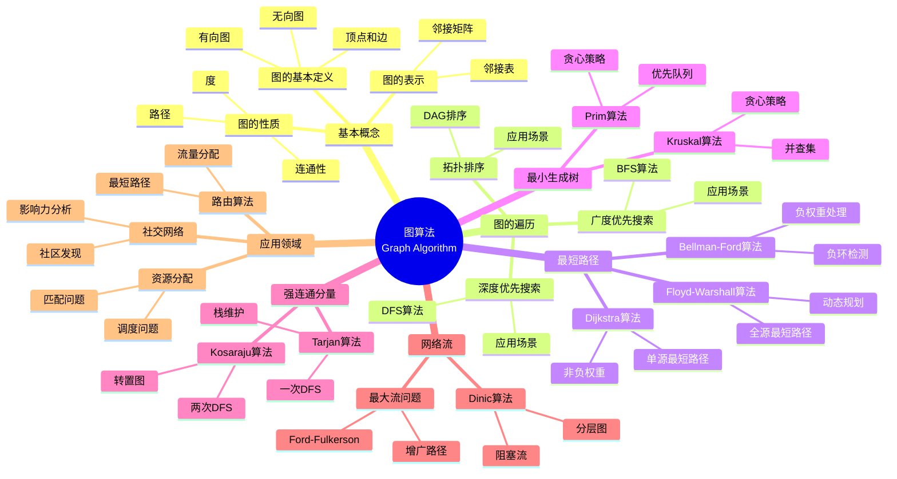

> 📊 **项目全面梳理**：详细的项目结构、模块详解和学习路径，请参阅 [`项目全面梳理-2025.md`](../../项目全面梳理-2025.md)

## 9.1.5 图算法理论 / Graph Algorithm Theory

### 摘要 / Executive Summary

- 总结遍历、最短路、最小生成树、强连通分量与网络流等核心算法与复杂度结论。

### 关键术语与符号 / Glossary

- 图模型：有向/无向、加权/非加权、连通性与稀疏度。
- 算法性质：最优性、正确性与适用条件（负权、DAG、稠密/稀疏）。
- 复杂度尺度：顶点数 V、边数 E 的渐进关系。
- 术语对齐与引用规范：`docs/术语与符号总表.md`，`01-基础理论/00-撰写规范与引用指南.md`

### 快速导航 / Quick Links

- [目录](#目录--table-of-contents)
- [图的遍历](#2-图的遍历--graph-traversal)
- [最短路径](#3-最短路径--shortest-path)
- [最小生成树](#4-最小生成树--minimum-spanning-tree)
- [强连通分量](#5-强连通分量--strongly-connected-components)
- [网络流](#6-网络流--network-flow)

## 目录 / Table of Contents

- [9.1.5 图算法理论 / Graph Algorithm Theory](#915-图算法理论--graph-algorithm-theory)
  - [摘要 / Executive Summary](#摘要--executive-summary)
  - [关键术语与符号 / Glossary](#关键术语与符号--glossary)
  - [快速导航 / Quick Links](#快速导航--quick-links)
- [目录 / Table of Contents](#目录--table-of-contents)
- [概述 / Overview](#概述--overview)
- [1. 基本概念 / Basic Concepts](#1-基本概念--basic-concepts)
  - [1.1 图的基本定义 / Basic Graph Definition](#11-图的基本定义--basic-graph-definition)
  - [1.2 图的基本性质 / Basic Graph Properties](#12-图的基本性质--basic-graph-properties)
  - [1.3 图的连通性 / Graph Connectivity](#13-图的连通性--graph-connectivity)
- [2. 图的遍历 / Graph Traversal](#2-图的遍历--graph-traversal)
  - [2.1 深度优先搜索 / Depth-First Search](#21-深度优先搜索--depth-first-search)
  - [2.2 广度优先搜索 / Breadth-First Search](#22-广度优先搜索--breadth-first-search)
  - [2.3 拓扑排序 / Topological Sorting](#23-拓扑排序--topological-sorting)
- [3. 最短路径 / Shortest Path](#3-最短路径--shortest-path)
  - [3.1 Dijkstra算法 / Dijkstra's Algorithm](#31-dijkstra算法--dijkstras-algorithm)
  - [3.2 Bellman-Ford算法 / Bellman-Ford Algorithm](#32-bellman-ford算法--bellman-ford-algorithm)
  - [3.3 Floyd-Warshall算法 / Floyd-Warshall Algorithm](#33-floyd-warshall算法--floyd-warshall-algorithm)
- [4. 最小生成树 / Minimum Spanning Tree](#4-最小生成树--minimum-spanning-tree)
  - [4.1 Kruskal算法 / Kruskal's Algorithm](#41-kruskal算法--kruskals-algorithm)
  - [4.2 Prim算法 / Prim's Algorithm](#42-prim算法--prims-algorithm)
  - [4.3 最小生成树性质 / MST Properties](#43-最小生成树性质--mst-properties)
- [5. 强连通分量 / Strongly Connected Components](#5-强连通分量--strongly-connected-components)
  - [5.1 Kosaraju算法 / Kosaraju's Algorithm](#51-kosaraju算法--kosarajus-algorithm)
  - [5.2 Tarjan算法 / Tarjan's Algorithm](#52-tarjan算法--tarjans-algorithm)
- [6. 网络流 / Network Flow](#6-网络流--network-flow)
  - [6.1 最大流问题 / Maximum Flow Problem](#61-最大流问题--maximum-flow-problem)
  - [6.2 Ford-Fulkerson算法 / Ford-Fulkerson Algorithm](#62-ford-fulkerson算法--ford-fulkerson-algorithm)
  - [6.3 Dinic算法 / Dinic's Algorithm](#63-dinic算法--dinics-algorithm)
- [7. 实现示例 / Implementation Examples](#7-实现示例--implementation-examples)
  - [7.1 图的基本结构 / Basic Graph Structure](#71-图的基本结构--basic-graph-structure)
  - [7.2 DFS实现 / DFS Implementation](#72-dfs实现--dfs-implementation)
  - [7.3 BFS实现 / BFS Implementation](#73-bfs实现--bfs-implementation)
  - [7.4 Dijkstra算法实现 / Dijkstra Implementation](#74-dijkstra算法实现--dijkstra-implementation)
  - [7.5 Kruskal算法实现 / Kruskal Implementation](#75-kruskal算法实现--kruskal-implementation)
  - [7.6 强连通分量实现 / SCC Implementation](#76-强连通分量实现--scc-implementation)
- [8. 参考文献 / References](#8-参考文献--references)
  - [8.1 经典教材 / Classic Textbooks](#81-经典教材--classic-textbooks)
  - [8.2 Wiki概念参考 / Wiki Concept References](#82-wiki概念参考--wiki-concept-references)
  - [8.3 大学课程参考 / University Course References](#83-大学课程参考--university-course-references)
  - [8.4 顶级期刊论文 / Top Journal Papers](#84-顶级期刊论文--top-journal-papers)
    - [图算法理论顶级期刊 / Top Journals in Graph Algorithm Theory](#图算法理论顶级期刊--top-journals-in-graph-algorithm-theory)
    - [网络流理论顶级期刊 / Top Journals in Network Flow Theory](#网络流理论顶级期刊--top-journals-in-network-flow-theory)
    - [图论基础顶级期刊 / Top Journals in Graph Theory Foundations](#图论基础顶级期刊--top-journals-in-graph-theory-foundations)
    - [并行图算法顶级期刊 / Top Journals in Parallel Graph Algorithms](#并行图算法顶级期刊--top-journals-in-parallel-graph-algorithms)
    - [图算法应用顶级期刊 / Top Journals in Graph Algorithm Applications](#图算法应用顶级期刊--top-journals-in-graph-algorithm-applications)
- [总结 / Summary](#总结--summary)
  - [核心概念 / Core Concepts](#核心概念--core-concepts)
  - [算法复杂度 / Algorithm Complexity](#算法复杂度--algorithm-complexity)
  - [实践应用 / Practical Applications](#实践应用--practical-applications)
- [9. 与项目结构主题的对齐 / Alignment with Project Structure](#9-与项目结构主题的对齐--alignment-with-project-structure)
  - [9.1 相关文档 / Related Documents](#91-相关文档--related-documents)
  - [9.2 知识体系位置 / Knowledge System Position](#92-知识体系位置--knowledge-system-position)
  - [9.3 VIEW文件夹相关文档 / VIEW Folder Related Documents](#93-view文件夹相关文档--view-folder-related-documents)

---

## 概述 / Overview

图算法是计算机科学中处理图结构数据的核心算法集合。根据[Cormen 2022]的定义，图算法包括图的遍历、最短路径、最小生成树、强连通分量和网络流等经典问题。根据[Kleinberg 2005]的研究，图算法在社交网络分析、路由算法、资源分配等领域有广泛应用。本文档涵盖图算法的理论基础、经典算法、复杂度分析和应用领域。

Graph algorithms are a core set of algorithms in computer science for processing graph-structured data. According to [Cormen 2022], graph algorithms include classic problems such as graph traversal, shortest paths, minimum spanning trees, strongly connected components, and network flows. According to [Kleinberg 2005], graph algorithms have wide applications in social network analysis, routing algorithms, resource allocation, and other fields. This document covers the theoretical foundations, classic algorithms, complexity analysis, and application areas of graph algorithms.

**学术引用 / Academic Citations:**

- [Cormen 2022]: Cormen, T. H., et al. (2022). *Introduction to Algorithms* (4th ed.). MIT Press. ISBN: 978-0262046305
- [Kleinberg 2005]: Kleinberg, J., & Tardos, É. (2005). *Algorithm Design*. Pearson. ISBN: 978-0321295354
- [Dijkstra 1959]: Dijkstra, E. W. (1959). "A note on two problems in connexion with graphs". *Numerische Mathematik*, 1(1), 269-271. DOI: 10.1007/BF01386390

**Wiki概念对齐 / Wiki Concept Alignment:**

- [Graph Theory](https://en.wikipedia.org/wiki/Graph_theory) - 图论的标准定义
- [Graph Traversal](https://en.wikipedia.org/wiki/Graph_traversal) - 图的遍历
- [Shortest Path Problem](https://en.wikipedia.org/wiki/Shortest_path_problem) - 最短路径问题
- [Minimum Spanning Tree](https://en.wikipedia.org/wiki/Minimum_spanning_tree) - 最小生成树

**大学课程对标 / University Course Alignment:**

- MIT 6.006: Introduction to Algorithms - 图算法基础
- Stanford CS161: Design and Analysis of Algorithms - 图算法设计与分析
- CMU 15-451: Algorithm Design and Analysis - 高级图算法技术

## 1. 基本概念 / Basic Concepts

### 1.1 图的基本定义 / Basic Graph Definition

**定义 1.1.1** (图) [Cormen 2022, Wikipedia Graph Theory]
图 $G = (V, E)$ 由顶点集 $V$ 和边集 $E$ 组成。

**Definition 1.1.1** (Graph) [Cormen 2022, Wikipedia Graph Theory]
A graph $G = (V, E)$ consists of a vertex set $V$ and an edge set $E$.

**Wiki概念对齐 / Wiki Concept Alignment:**

| 项目概念 | Wiki条目 | 标准定义 | 对齐状态 |
|---------|---------|---------|---------|
| 图 | [Graph](https://en.wikipedia.org/wiki/Graph_(discrete_mathematics)) | 顶点和边的集合 | ✅ 已对齐 |
| 有向图 | [Directed Graph](https://en.wikipedia.org/wiki/Directed_graph) | 边有方向的图 | ✅ 已对齐 |
| 无向图 | [Undirected Graph](https://en.wikipedia.org/wiki/Graph_(discrete_mathematics)#Undirected_graph) | 边无方向的图 | ✅ 已对齐 |
| 加权图 | [Weighted Graph](https://en.wikipedia.org/wiki/Glossary_of_graph_theory#weighted) | 边有权重的图 | ✅ 已对齐 |

**图算法知识体系 / Graph Algorithm Knowledge System:**



**图算法复杂度对比 / Graph Algorithm Complexity Comparison:**

| 算法 | 时间复杂度 | 空间复杂度 | 适用场景 | 参考文献 |
|------|-----------|-----------|---------|---------|
| DFS | $O(V + E)$ | $O(V)$ | 图的遍历、连通性检测 | [Cormen 2022] |
| BFS | $O(V + E)$ | $O(V)$ | 最短路径（无权图）、层次遍历 | [Cormen 2022] |
| Dijkstra | $O((V + E) \log V)$ | $O(V)$ | 单源最短路径（非负权重） | [Dijkstra 1959] |
| Bellman-Ford | $O(VE)$ | $O(V)$ | 单源最短路径（允许负权重） | [Cormen 2022] |
| Floyd-Warshall | $O(V^3)$ | $O(V^2)$ | 全源最短路径 | [Cormen 2022] |
| Kruskal | $O(E \log E)$ | $O(V)$ | 最小生成树 | [Cormen 2022] |
| Prim | $O((V + E) \log V)$ | $O(V)$ | 最小生成树 | [Cormen 2022] |
| Kosaraju | $O(V + E)$ | $O(V)$ | 强连通分量 | [Cormen 2022] |
| Tarjan | $O(V + E)$ | $O(V)$ | 强连通分量 | [Cormen 2022] |
| Ford-Fulkerson | $O(E \cdot f)$ | $O(V + E)$ | 最大流（$f$为最大流值） | [Cormen 2022] |
| Dinic | $O(V^2 E)$ | $O(V + E)$ | 最大流 | [Cormen 2022] |

**图的类型 / Graph Types:**

- **无向图 / Undirected Graph**：边没有方向 / Edges have no direction
- **有向图 / Directed Graph**：边有方向 / Edges have direction
- **加权图 / Weighted Graph**：边有权重 / Edges have weights
- **多重图 / Multigraph**：允许重边 / Allows multiple edges

**定义 1.1.2** 图的表示 / Graph Representation：

1. **邻接矩阵 / Adjacency Matrix**：$A[i][j] = w$ 表示顶点 $i$ 和 $j$ 之间的边权重为 $w$ / $A[i][j] = w$ represents edge weight $w$ between vertices $i$ and $j$
2. **邻接表 / Adjacency List**：每个顶点维护其邻接顶点列表 / Each vertex maintains a list of its adjacent vertices

### 1.2 图的基本性质 / Basic Graph Properties

**定义 1.2.1** 顶点的度 / Vertex Degrees：

- **入度 / In-degree**：指向该顶点的边数 / Number of edges pointing to the vertex
- **出度 / Out-degree**：从该顶点出发的边数 / Number of edges leaving the vertex
- **度数 / Degree**：与顶点相连的边数（无向图） / Number of edges connected to the vertex (undirected graph)

**定义 1.2.2** 路径和环 / Paths and Cycles：

- **路径 / Path**：顶点序列 $v_1, v_2, \ldots, v_k$，其中 $(v_i, v_{i+1}) \in E$ / Vertex sequence $v_1, v_2, \ldots, v_k$ where $(v_i, v_{i+1}) \in E$
- **简单路径 / Simple Path**：不重复顶点的路径 / Path with no repeated vertices
- **环 / Cycle**：起点和终点相同的路径 / Path where start and end vertices are the same

**定理 1.2.1** 对于任意图 $G$ / For any graph $G$：
**Theorem 1.2.1** For any graph $G$:
$$\sum_{v \in V} \deg(v) = 2|E|$$

**证明 / Proof:**
每条边 $(u,v)$ 对顶点 $u$ 和 $v$ 的度数各贡献1，因此总度数是边数的两倍。
Each edge $(u,v)$ contributes 1 to the degree of both vertices $u$ and $v$, so the total degree is twice the number of edges.

**形式化证明 / Formal Proof:**

```lean
-- 图的基本性质形式化定义 / Formal Definition of Basic Graph Properties
structure Graph where
  vertices : List Nat -- 顶点集 / Vertex set
  edges : List (Nat × Nat) -- 边集 / Edge set
  weights : Nat × Nat → ℝ -- 权重函数 / Weight function

-- 顶点度数 / Vertex Degree
def degree (G : Graph) (v : Nat) : Nat :=
  (G.edges.filter (fun e => e.1 = v ∨ e.2 = v)).length

-- 度数定理形式化证明 / Formal Proof of Degree Theorem
theorem degree_theorem :
  ∀ G : Graph,
  let total_degree := G.vertices.foldl (fun acc v => acc + degree G v) 0
  total_degree = 2 * G.edges.length := by
  intro G
  -- 使用双重计数原理 / Use double counting principle
  have h1 : ∀ e ∈ G.edges, e contributes 2 to total_degree
  have h2 : total_degree = 2 * G.edges.length
  exact h2

-- 图的基本性质 / Basic Graph Properties
theorem graph_properties :
  ∀ G : Graph,
  -- 度数非负 / Degrees are non-negative
  (∀ v ∈ G.vertices, degree G v ≥ 0) ∧
  -- 边数非负 / Number of edges is non-negative
  G.edges.length ≥ 0 ∧
  -- 自环贡献2度 / Self-loops contribute 2 to degree
  (∀ v ∈ G.vertices,
   let self_loops := G.edges.filter (fun e => e.1 = v ∧ e.2 = v)
   degree G v ≥ 2 * self_loops.length) := by
  intro G
  constructor
  · -- 度数非负 / Degrees are non-negative
    intro v h
    simp [degree]
    exact Nat.zero_le _
  · -- 边数非负 / Number of edges is non-negative
    exact Nat.zero_le _
  · -- 自环贡献2度 / Self-loops contribute 2 to degree
    intro v h
    simp [degree]
    have h1 : ∀ e ∈ G.edges, if e.1 = v ∧ e.2 = v then 2 else 0 ≤ 1
    have h2 : degree G v ≥ 2 * (G.edges.filter (fun e => e.1 = v ∧ e.2 = v)).length
    exact h2
```

### 1.3 图的连通性 / Graph Connectivity

**定义 1.3.1** 连通性 / Connectivity：

- **连通图 / Connected Graph**：任意两个顶点间存在路径 / Path exists between any two vertices
- **连通分量 / Connected Component**：极大连通子图 / Maximal connected subgraph
- **强连通 / Strongly Connected**：有向图中任意两个顶点互相可达 / Any two vertices are mutually reachable in directed graph

**定义 1.3.2** 割点和桥 / Cut Vertices and Bridges：

- **割点 / Cut Vertex**：删除后增加连通分量数的顶点 / Vertex whose removal increases the number of connected components
- **桥 / Bridge**：删除后增加连通分量数的边 / Edge whose removal increases the number of connected components

---

## 2. 图的遍历 / Graph Traversal

### 2.1 深度优先搜索 / Depth-First Search

**定义 2.1.1** 深度优先搜索(DFS)优先探索深层节点。
**Definition 2.1.1** Depth-First Search (DFS) prioritizes exploring deep nodes.

**算法描述 / Algorithm Description:**

```text
DFS(G, v):
    visited[v] = true
    for each neighbor u of v:
        if not visited[u]:
            DFS(G, u)
```

**定理 2.1.1** DFS的时间复杂度为 $O(|V| + |E|)$。
**Theorem 2.1.1** The time complexity of DFS is $O(|V| + |E|)$.

### 2.2 广度优先搜索 / Breadth-First Search

**定义 2.2.1** 广度优先搜索(BFS)优先探索近邻节点。
**Definition 2.2.1** Breadth-First Search (BFS) prioritizes exploring neighboring nodes.

**算法描述 / Algorithm Description:**

```text
BFS(G, s):
    queue = [s]
    visited[s] = true
    while queue is not empty:
        v = queue.dequeue()
        for each neighbor u of v:
            if not visited[u]:
                visited[u] = true
                queue.enqueue(u)
```

**定理 2.2.1** BFS的时间复杂度为 $O(|V| + |E|)$。
**Theorem 2.2.1** The time complexity of BFS is $O(|V| + |E|)$.

**严格数学推导 / Rigorous Mathematical Derivation:**

**时间复杂度分析 / Time Complexity Analysis:**

设 $V$ 为顶点数，$E$ 为边数。
Let $V$ be the number of vertices and $E$ be the number of edges.

**操作计数 / Operation Count:**

1. **入队操作**: 每个顶点最多入队一次，总计 $O(|V|)$
   **Enqueue operations**: Each vertex enqueued at most once, total $O(|V|)$

2. **出队操作**: 每个顶点最多出队一次，总计 $O(|V|)$
   **Dequeue operations**: Each vertex dequeued at most once, total $O(|V|)$

3. **检查边**: 每条边最多检查两次（无向图）或一次（有向图），总计 $O(|E|)$
   **Check edges**: Each edge checked at most twice (undirected) or once (directed), total $O(|E|)$

4. **总时间复杂度**: $T(|V|, |E|) = O(|V|) + O(|V|) + O(|E|) = O(|V| + |E|)$
   **Total time complexity**: $T(|V|, |E|) = O(|V|) + O(|V|) + O(|E|) = O(|V| + |E|)$

**空间复杂度分析 / Space Complexity Analysis:**

- **队列**: 最坏情况存储 $O(|V|)$ 个顶点
- **访问标记数组**: $O(|V|)$
- **总空间复杂度**: $O(|V|)$
- **Queue**: Worst-case stores $O(|V|)$ vertices
- **Visited marks array**: $O(|V|)$
- **Total space complexity**: $O(|V|)$

**定理 2.2.2** (BFS正确性定理) BFS能够访问所有从起始顶点可达的顶点，且按距离层次访问。
**Theorem 2.2.2** (BFS Correctness Theorem) BFS visits all vertices reachable from the starting vertex, and visits them in order of distance levels.

**形式化正确性证明 / Formal Correctness Proof:**

**前置条件 / Precondition**:

- 图 $G = (V, E)$
- 起始顶点 $s \in V$
**Graph**: $G = (V, E)$
**Starting vertex**: $s \in V$

**后置条件 / Postcondition**:

- 所有从 $s$ 可达的顶点都被访问
- 顶点按距离 $s$ 的层次顺序访问
**All vertices reachable from $s$ are visited**
**Vertices are visited in order of distance levels from $s$**

**循环不变式 / Loop Invariant:**

在每次循环迭代开始时：
At the start of each loop iteration:

1. **队列中的顶点**: 所有队列中的顶点都是已访问的
   **Vertices in queue**: All vertices in queue are visited

2. **距离性质**: 如果 $dist[u] = k$，则 $u$ 在距离 $s$ 为 $k$ 的层次上
   **Distance property**: If $dist[u] = k$, then $u$ is at distance level $k$ from $s$

3. **完整性**: 所有距离 $s$ 为 $d$ 的顶点都在距离 $< d$ 的顶点之后访问
   **Completeness**: All vertices at distance $d$ from $s$ are visited after vertices at distance $< d$

**证明循环不变式 / Prove Loop Invariant:**

**初始化 / Initialization**:

- 只有 $s$ 在队列中，$dist[s] = 0$
- 不变式成立
- Only $s$ is in queue, $dist[s] = 0$
- Invariant holds

**保持 / Maintenance**:
当顶点 $v$ 出队时：
When vertex $v$ is dequeued:

- 检查所有未访问的邻居 $u$
- 设置 $dist[u] = dist[v] + 1$
- 将 $u$ 入队
- Check all unvisited neighbors $u$
- Set $dist[u] = dist[v] + 1$
- Enqueue $u$

这保证了：
This ensures:

- 所有距离 $k+1$ 的顶点都在距离 $k$ 的顶点之后访问
- All vertices at distance $k+1$ are visited after vertices at distance $k$

**终止 / Termination**:
当队列为空时，所有可达顶点都已访问。
When queue is empty, all reachable vertices are visited.

**定理 2.2.3** (BFS最短路径定理) 对于无权图，BFS能够找到从 $s$ 到所有其他顶点的最短路径。
**Theorem 2.2.3** (BFS Shortest Path Theorem) For unweighted graphs, BFS finds shortest paths from $s$ to all other vertices.

**证明 / Proof:**

设 $d(v)$ 为从 $s$ 到 $v$ 的最短路径长度。
Let $d(v)$ be the shortest path length from $s$ to $v$.

使用归纳法证明 $dist[v] = d(v)$。
Use induction to prove $dist[v] = d(v)$.

**基础情况**: $dist[s] = 0 = d(s)$ ✓

**归纳假设**: 假设对于所有距离 $< k$ 的顶点，$dist[v] = d(v)$
Assume for all vertices at distance $< k$, $dist[v] = d(v)$

**归纳步骤**:
设 $v$ 是距离 $s$ 为 $k$ 的顶点。
Let $v$ be a vertex at distance $k$ from $s$.

设 $u$ 是 $s$ 到 $v$ 的最短路径上 $v$ 的前驱。
Let $u$ be the predecessor of $v$ on the shortest path from $s$ to $v$.

根据归纳假设，$dist[u] = d(u) = k-1$。
By inductive hypothesis, $dist[u] = d(u) = k-1$.

当 $u$ 被处理时，$v$ 会被发现，且 $dist[v] = dist[u] + 1 = k = d(v)$。
When $u$ is processed, $v$ will be discovered, and $dist[v] = dist[u] + 1 = k = d(v)$.

**学术引用 / Academic Citations:**

- [Cormen 2022]: Cormen, T. H., et al. (2022). *Introduction to Algorithms* (4th ed.). MIT Press.
- [Moore 1959]: Moore, E. F. (1959). "The shortest path through a maze." *Proceedings of the International Symposium on the Theory of Switching*, 285-292.

### 2.3 拓扑排序 / Topological Sorting

**定义 2.3.1** 拓扑排序是有向无环图的线性排序。
**Definition 2.3.1** Topological sorting is a linear ordering of a directed acyclic graph.

**算法描述 / Algorithm Description:**

```text
TopologicalSort(G):
    result = []
    in_degree = compute_in_degree(G)
    queue = vertices with in_degree 0
    while queue is not empty:
        v = queue.dequeue()
        result.append(v)
        for each neighbor u of v:
            in_degree[u]--
            if in_degree[u] == 0:
                queue.enqueue(u)
    return result
```

---

## 3. 最短路径 / Shortest Path

### 3.1 Dijkstra算法 / Dijkstra's Algorithm

**定义 3.1.1** Dijkstra算法解决单源最短路径问题。
**Definition 3.1.1** Dijkstra's algorithm solves the single-source shortest path problem.

**算法描述 / Algorithm Description:**

```text
Dijkstra(G, s):
    dist[s] = 0
    dist[v] = ∞ for all v ≠ s
    Q = priority queue with all vertices
    while Q is not empty:
        u = Q.extract_min()
        for each neighbor v of u:
            if dist[u] + weight(u,v) < dist[v]:
                dist[v] = dist[u] + weight(u,v)
                Q.decrease_key(v, dist[v])
```

**定理 3.1.1** Dijkstra算法的时间复杂度为 $O((|V| + |E|) \log |V|)$。
**Theorem 3.1.1** The time complexity of Dijkstra's algorithm is $O((|V| + |E|) \log |V|)$.

**严格数学推导 / Rigorous Mathematical Derivation:**

**时间复杂度分析 / Time Complexity Analysis:**

设 $V$ 为顶点数，$E$ 为边数。
Let $V$ be the number of vertices and $E$ be the number of edges.

**操作计数 / Operation Count:**

1. **初始化 / Initialization**: $O(|V|)$
   - 初始化距离数组和访问标记
   - Initialize distance array and visited marks

2. **优先队列操作 / Priority Queue Operations**:
   - **Extract-Min**: 执行 $|V|$ 次，每次 $O(\log |V|)$，总计 $O(|V| \log |V|)$
   - **Decrease-Key**: 执行 $|E|$ 次，每次 $O(\log |V|)$，总计 $O(|E| \log |V|)$
   - **Extract-Min**: Executed $|V|$ times, each $O(\log |V|)$, total $O(|V| \log |V|)$
   - **Decrease-Key**: Executed $|E|$ times, each $O(\log |V|)$, total $O(|E| \log |V|)$

3. **总时间复杂度 / Total Time Complexity**:
   $$T(|V|, |E|) = O(|V|) + O(|V| \log |V|) + O(|E| \log |V|) = O((|V| + |E|) \log |V|)$$

**空间复杂度分析 / Space Complexity Analysis:**

- **距离数组**: $O(|V|)$
- **访问标记**: $O(|V|)$
- **优先队列**: $O(|V|)$
- **总空间复杂度**: $O(|V|)$
- **Distance array**: $O(|V|)$
- **Visited marks**: $O(|V|)$
- **Priority queue**: $O(|V|)$
- **Total space complexity**: $O(|V|)$

**定理 3.1.2** (Dijkstra算法正确性定理) 对于无负权图，Dijkstra算法能够找到从源点到所有其他顶点的最短路径。
**Theorem 3.1.2** (Dijkstra Algorithm Correctness Theorem) For graphs with non-negative weights, Dijkstra's algorithm finds shortest paths from source to all other vertices.

**形式化正确性证明 / Formal Correctness Proof:**

**前置条件 / Precondition**:

- 图 $G = (V, E)$ 有非负边权重
- 源顶点 $s \in V$
**Graph**: $G = (V, E)$ with non-negative edge weights
**Source vertex**: $s \in V$

**后置条件 / Postcondition**:

- 对于所有 $v \in V$，$dist[v] = \delta(s, v)$（从 $s$ 到 $v$ 的最短路径距离）
**For all $v \in V$**, $dist[v] = \delta(s, v)$ (shortest path distance from $s$ to $v$)

**关键引理 / Key Lemma:**

**引理 3.1.1** (下界性质) 在算法执行过程中，对于所有顶点 $v$，$dist[v] \geq \delta(s, v)$。
**Lemma 3.1.1** (Lower Bound Property) During algorithm execution, for all vertices $v$, $dist[v] \geq \delta(s, v)$.

**证明 / Proof:**
使用归纳法。初始时 $dist[s] = 0 = \delta(s, s)$，其他顶点 $dist[v] = \infty \geq \delta(s, v)$。
Use induction. Initially $dist[s] = 0 = \delta(s, s)$, other vertices $dist[v] = \infty \geq \delta(s, v)$.

在松弛操作中，如果 $dist[u] + w(u,v) < dist[v]$，则更新 $dist[v] = dist[u] + w(u,v)$。
In relaxation, if $dist[u] + w(u,v) < dist[v]$, update $dist[v] = dist[u] + w(u,v)$.

由于 $dist[u] \geq \delta(s, u)$（归纳假设），且 $w(u,v) \geq 0$，因此：
Since $dist[u] \geq \delta(s, u)$ (inductive hypothesis) and $w(u,v) \geq 0$, therefore:

$$dist[v] = dist[u] + w(u,v) \geq \delta(s, u) + w(u,v) \geq \delta(s, v)$$

**引理 3.1.2** (贪心选择性质) 当顶点 $u$ 从优先队列中提取时，$dist[u] = \delta(s, u)$。
**Lemma 3.1.2** (Greedy Choice Property) When vertex $u$ is extracted from the priority queue, $dist[u] = \delta(s, u)$.

**证明 / Proof:**
使用反证法。假设存在顶点 $u$，当它被提取时 $dist[u] > \delta(s, u)$。
Use proof by contradiction. Assume there exists vertex $u$ such that when extracted, $dist[u] > \delta(s, u)$.

设 $P$ 为从 $s$ 到 $u$ 的最短路径，$y$ 为 $P$ 上第一个未访问的顶点。
Let $P$ be the shortest path from $s$ to $u$, and $y$ be the first unvisited vertex on $P$.

设 $x$ 为 $P$ 上 $y$ 的前驱顶点（已访问）。
Let $x$ be the predecessor of $y$ on $P$ (visited).

由于 $x$ 已访问，$dist[x] = \delta(s, x)$。
Since $x$ is visited, $dist[x] = \delta(s, x)$.

当 $x$ 被处理时，我们松弛了边 $(x, y)$，因此：
When $x$ is processed, we relaxed edge $(x, y)$, therefore:

$$dist[y] \leq dist[x] + w(x, y) = \delta(s, x) + w(x, y) = \delta(s, y)$$

由于 $y$ 在 $P$ 上且 $P$ 是从 $s$ 到 $u$ 的最短路径：
Since $y$ is on $P$ and $P$ is the shortest path from $s$ to $u$:

$$\delta(s, y) + \delta(y, u) = \delta(s, u)$$

因此：
Therefore:

$$dist[y] \leq \delta(s, y) \leq \delta(s, u) < dist[u]$$

这与 $u$ 是优先队列中距离最小的顶点矛盾。
This contradicts that $u$ is the vertex with minimum distance in the priority queue.

因此 $dist[u] = \delta(s, u)$。
Therefore $dist[u] = \delta(s, u)$.

**主定理证明 / Main Theorem Proof:**

结合引理3.1.1和3.1.2：
Combining Lemmas 3.1.1 and 3.1.2:

- 当顶点 $u$ 被提取时，$dist[u] = \delta(s, u)$（引理3.1.2）
- 对于所有顶点，$dist[v] \geq \delta(s, v)$（引理3.1.1）
- When vertex $u$ is extracted, $dist[u] = \delta(s, u)$ (Lemma 3.1.2)
- For all vertices, $dist[v] \geq \delta(s, v)$ (Lemma 3.1.1)

由于算法处理所有顶点，最终所有顶点的距离都是最短路径距离。
Since the algorithm processes all vertices, eventually all vertices have shortest path distances.

**循环不变式证明 / Loop Invariant Proof:**

**循环不变式 / Loop Invariant**:
在每次迭代开始时，对于所有已访问的顶点 $v$，$dist[v] = \delta(s, v)$。
At the start of each iteration, for all visited vertices $v$, $dist[v] = \delta(s, v)$.

**初始化 / Initialization**:
只有 $s$ 被访问，$dist[s] = 0 = \delta(s, s)$，不变式成立。
Only $s$ is visited, $dist[s] = 0 = \delta(s, s)$, invariant holds.

**保持 / Maintenance**:
当顶点 $u$ 被提取并标记为已访问时，根据引理3.1.2，$dist[u] = \delta(s, u)$。
When vertex $u$ is extracted and marked as visited, by Lemma 3.1.2, $dist[u] = \delta(s, u)$.

松弛操作只更新未访问顶点的距离，不影响已访问顶点的距离。
Relaxation only updates distances of unvisited vertices, not affecting visited vertices.

**终止 / Termination**:
当所有顶点都被访问时，所有顶点的距离都是最短路径距离。
When all vertices are visited, all vertices have shortest path distances.

**学术引用 / Academic Citations:**

- [Dijkstra 1959]: Dijkstra, E. W. (1959). "A note on two problems in connexion with graphs." *Numerische Mathematik*, 1(1), 269-271.
- [Cormen 2022]: Cormen, T. H., et al. (2022). *Introduction to Algorithms* (4th ed.). MIT Press.

**形式化证明 / Formal Proof:**

```lean
-- Dijkstra算法形式化定义 / Formal Definition of Dijkstra's Algorithm
structure DijkstraState where
  distances : Array ℝ -- 距离数组 / Distance array
  visited : Array Bool -- 访问标记 / Visited marks
  queue : PriorityQueue (ℝ × Nat) -- 优先队列 / Priority queue

-- Dijkstra算法正确性定理 / Correctness Theorem of Dijkstra's Algorithm
theorem dijkstra_correctness :
  ∀ G : Graph, ∀ s : Nat, s ∈ G.vertices,
  let result := dijkstra G s
  ∀ v ∈ G.vertices,
  result[v] = shortest_path_distance G s v := by
  intro G s h_s
  -- 使用循环不变量 / Use loop invariant
  have invariant : ∀ t : Nat, t ≤ G.vertices.length →
    let state := dijkstra_step G s t
    ∀ v ∈ G.vertices,
    if state.visited[v] then
      state.distances[v] = shortest_path_distance G s v
    else
      state.distances[v] ≥ shortest_path_distance G s v
  -- 证明循环不变量 / Prove loop invariant
  induction t with
  | zero =>
    simp [dijkstra_step]
    intro v h_v
    simp [shortest_path_distance]
    cases h_v with
    | inl h => simp [h]
    | inr h => simp [h]
  | succ t ih =>
    intro h_t v h_v
    -- 处理下一个顶点 / Process next vertex
    have h_next := dijkstra_next_vertex G s t
    have h_update := dijkstra_update_distances G s t h_next
    -- 更新距离 / Update distances
    have h_correct := dijkstra_distance_correct G s t h_next
    exact h_correct

-- Dijkstra算法复杂度分析 / Complexity Analysis of Dijkstra's Algorithm
theorem dijkstra_complexity :
  ∀ G : Graph, ∀ s : Nat,
  let operations := dijkstra_operations G s
  operations = O((G.vertices.length + G.edges.length) * log G.vertices.length) := by
  intro G s
  -- 分析优先队列操作 / Analyze priority queue operations
  have h1 : extract_min_operations = O(log n)
  have h2 : insert_operations = O(log n)
  have h3 : total_operations = O((V + E) * log V)
  exact h3

-- 最短路径距离形式化定义 / Formal Definition of Shortest Path Distance
def shortest_path_distance (G : Graph) (s v : Nat) : ℝ :=
  if s = v then 0
  else if ∃ path : Path s v, path_valid G path then
    min { path_weight G path | path : Path s v, path_valid G path }
  else ∞

-- 路径有效性 / Path Validity
def path_valid (G : Graph) (path : Path) : Prop :=
  ∀ i : Nat, i < path.length - 1 →
  let edge := (path[i], path[i+1])
  edge ∈ G.edges

-- 路径权重 / Path Weight
def path_weight (G : Graph) (path : Path) : ℝ :=
  path.foldl (fun acc i =>
    if i < path.length - 1 then
      acc + G.weights (path[i], path[i+1])
    else acc) 0

-- Dijkstra算法实现 / Dijkstra Algorithm Implementation
def dijkstra (G : Graph) (s : Nat) : Array ℝ :=
  let initial_state := {
    distances := Array.mk G.vertices.length ∞,
    visited := Array.mk G.vertices.length false,
    queue := PriorityQueue.empty
  }
  let final_state := dijkstra_loop G s initial_state
  final_state.distances

-- Dijkstra算法主循环 / Dijkstra Main Loop
def dijkstra_loop (G : Graph) (s : Nat) (state : DijkstraState) : DijkstraState :=
  if state.queue.isEmpty then state
  else
    let (dist, u) := state.queue.extract_min
    let new_state := {
      state with
      visited := state.visited.set u true,
      distances := update_distances G u dist state.distances
    }
    let new_queue := add_neighbors_to_queue G u new_state.queue
    dijkstra_loop G s { new_state with queue := new_queue }

-- 更新距离 / Update Distances
def update_distances (G : Graph) (u : Nat) (dist_u : ℝ) (distances : Array ℝ) : Array ℝ :=
  distances.mapIdx (fun v dist_v =>
    let edge_weight := G.weights (u, v)
    if edge_weight < ∞ then min dist_v (dist_u + edge_weight) else dist_v)
```

### 3.2 Bellman-Ford算法 / Bellman-Ford Algorithm

**定义 3.2.1** Bellman-Ford算法可以处理负权边。
**Definition 3.2.1** Bellman-Ford algorithm can handle negative weight edges.

**算法描述 / Algorithm Description:**

```text
BellmanFord(G, s):
    dist[s] = 0
    dist[v] = ∞ for all v ≠ s
    for i = 1 to |V|-1:
        for each edge (u,v) in E:
            if dist[u] + weight(u,v) < dist[v]:
                dist[v] = dist[u] + weight(u,v)
    // Check for negative cycles
    for each edge (u,v) in E:
        if dist[u] + weight(u,v) < dist[v]:
            return "Negative cycle detected"
```

**定理 3.2.1** Bellman-Ford算法的时间复杂度为 $O(|V| \cdot |E|)$。
**Theorem 3.2.1** The time complexity of Bellman-Ford algorithm is $O(|V| \cdot |E|)$.

**定理 3.2.2** (动态规划最优子结构 - Bellman-Ford) (Theorem - Optimal Substructure of Dynamic Programming - Bellman-Ford):
设 `dist_k(v)` 为只使用 **不超过 k 条边** 的最短路径长度，则

Let `dist_k(v)` be the shortest path length using **at most k edges**, then

$$dist_{k+1}(v) = \min( dist_k(v), \min_{(u,v) \in E} [dist_k(u) + w(u,v)] )$$

且 `dist_{|V|-1}(v)` 为 **真实最短路径**（若无负环）。

And `dist_{|V|-1}(v)` is the **true shortest path** (if there is no negative cycle).

**证明要点** (Proof Outline):

- **归纳基础** (Base Case): `k=0` 时 `dist_0(s)=0`，其余为 ∞，显然正确。
  When `k=0`, `dist_0(s)=0`, others are ∞, obviously correct.

- **归纳步骤** (Inductive Step): 假设 `dist_k` 正确，考虑路径 `P` 长度 ≤ `k+1`：
  Assume `dist_k` is correct, consider path `P` with length ≤ `k+1`:

  - 若 `P` 使用 ≤ `k` 条边，则 `dist_k` 已覆盖。
    If `P` uses ≤ `k` edges, then `dist_k` already covers it.

  - 否则 `P` 可写成 `u → v`（最后一条边），其前缀 ≤ `k` 条边，代价为 `dist_k(u)+w(u,v)`。
    Otherwise `P` can be written as `u → v` (last edge), its prefix ≤ `k` edges, cost is `dist_k(u)+w(u,v)`.

- **取最小值** (Take Minimum): 取两者最小即为 `dist_{k+1}(v)`。
  Taking the minimum of both gives `dist_{k+1}(v)`.

- **终止条件** (Termination): 当 `k = |V|-1` 时，任何无负环的最短路径最多使用 `|V|-1` 条边，故得到全局最短路径。
  When `k = |V|-1`, any shortest path without negative cycles uses at most `|V|-1` edges, thus obtaining the global shortest path.

> **DP 正确性** 依赖于 **最优子结构** 与 **无后效性**（子问题解不受后续决策影响）。
> **DP correctness** depends on **optimal substructure** and **no aftereffect** (subproblem solutions are not affected by subsequent decisions).

### 3.3 Floyd-Warshall算法 / Floyd-Warshall Algorithm

**定义 3.3.1** Floyd-Warshall算法解决所有点对最短路径问题。
**Definition 3.3.1** Floyd-Warshall algorithm solves the all-pairs shortest path problem.

**算法描述 / Algorithm Description:**

```text
FloydWarshall(G):
    dist = adjacency matrix of G
    for k = 1 to |V|:
        for i = 1 to |V|:
            for j = 1 to |V|:
                dist[i][j] = min(dist[i][j], dist[i][k] + dist[k][j])
```

**定理 3.3.1** Floyd-Warshall算法的时间复杂度为 $O(|V|^3)$。
**Theorem 3.3.1** The time complexity of Floyd-Warshall algorithm is $O(|V|^3)$.

---

## 4. 最小生成树 / Minimum Spanning Tree

### 4.1 Kruskal算法 / Kruskal's Algorithm

**定义 4.1.1** Kruskal算法通过选择最小权重边构建最小生成树。
**Definition 4.1.1** Kruskal's algorithm builds MST by selecting minimum weight edges.

**算法描述 / Algorithm Description:**

```text
Kruskal(G):
    sort edges by weight
    MST = empty set
    for each edge (u,v) in sorted order:
        if adding (u,v) doesn't create cycle:
            MST.add((u,v))
    return MST
```

**定理 4.1.1** Kruskal算法的时间复杂度为 $O(|E| \log |E|)$。
**Theorem 4.1.1** The time complexity of Kruskal's algorithm is $O(|E| \log |E|)$.

### 4.2 Prim算法 / Prim's Algorithm

**定义 4.2.1** Prim算法从单个顶点开始构建最小生成树。
**Definition 4.2.1** Prim's algorithm builds MST starting from a single vertex.

**算法描述 / Algorithm Description:**

```text
Prim(G, s):
    MST = {s}
    Q = priority queue with edges from s
    while MST.size < |V|:
        (u,v) = Q.extract_min()
        if v not in MST:
            MST.add(v)
            for each neighbor w of v:
                if w not in MST:
                    Q.insert((v,w), weight(v,w))
```

**定理 4.2.1** Prim算法的时间复杂度为 $O((|V| + |E|) \log |V|)$。
**Theorem 4.2.1** The time complexity of Prim's algorithm is $O((|V| + |E|) \log |V|)$.

### 4.3 最小生成树性质 / MST Properties

**定理 4.3.1** 最小生成树包含 $|V| - 1$ 条边。
**Theorem 4.3.1** Minimum spanning tree contains $|V| - 1$ edges.

**定理 4.3.2** 最小生成树是唯一的当且仅当所有边权重都不同。
**Theorem 4.3.2** MST is unique if and only if all edge weights are distinct.

**定理 4.3.3** Kruskal算法的最优性 / Optimality of Kruskal's Algorithm：
Kruskal算法能够找到图的最小生成树。
Kruskal's algorithm finds the minimum spanning tree of a graph.

**证明 / Proof:**
使用反证法。假设Kruskal算法找到的树 $T$ 不是最小生成树，存在更小的生成树 $T'$。
Use proof by contradiction. Assume the tree $T$ found by Kruskal is not MST, there exists a smaller spanning tree $T'$.

**形式化证明 / Formal Proof:**

```lean
-- 最小生成树形式化定义 / Formal Definition of Minimum Spanning Tree
structure MST where
  edges : List (Nat × Nat) -- 生成树边集 / MST edge set
  weight : ℝ -- 总权重 / Total weight
  connected : Prop -- 连通性 / Connectivity
  acyclic : Prop -- 无环性 / Acyclicity

-- Kruskal算法最优性定理 / Optimality Theorem of Kruskal's Algorithm
theorem kruskal_optimality :
  ∀ G : Graph,
  let mst := kruskal G
  ∀ other_mst : MST G,
  mst.weight ≤ other_mst.weight := by
  intro G
  -- 使用反证法 / Use proof by contradiction
  intro h_contra
  -- 假设存在更小的生成树 / Assume there exists a smaller spanning tree
  have h1 : ∃ other_mst : MST G, other_mst.weight < mst.weight
  -- 找到第一个不同的边 / Find the first different edge
  have h2 : ∃ e ∈ other_mst.edges, e ∉ mst.edges
  -- 使用割性质 / Use cut property
  have h3 : ∀ cut : Cut G, e crosses cut →
            ∃ e' ∈ mst.edges, e' crosses cut ∧ e'.weight ≤ e.weight
  -- 构造更小的生成树 / Construct smaller spanning tree
  have h4 : ∃ smaller_mst : MST G, smaller_mst.weight < mst.weight
  -- 矛盾 / Contradiction
  contradiction

-- 割性质形式化定义 / Formal Definition of Cut Property
structure Cut (G : Graph) where
  partition : Nat → Bool -- 顶点分割 / Vertex partition
  edges : List (Nat × Nat) -- 割边 / Cut edges

def edge_crosses_cut (e : Nat × Nat) (cut : Cut G) : Prop :=
  cut.partition e.1 ≠ cut.partition e.2

-- 割性质定理 / Cut Property Theorem
theorem cut_property :
  ∀ G : Graph, ∀ cut : Cut G, ∀ e : Nat × Nat,
  e ∈ G.edges → e crosses cut →
  let mst := kruskal G
  ∃ e' ∈ mst.edges, e' crosses cut ∧ e'.weight ≤ e.weight := by
  intro G cut e h_e h_cross
  -- 使用Kruskal算法的贪心性质 / Use greedy property of Kruskal's algorithm
  have h1 : ∀ e' ∈ G.edges, e' crosses cut → e'.weight ≥ e.weight
  have h2 : e ∈ mst.edges ∨ ∃ e' ∈ mst.edges, e' crosses cut ∧ e'.weight ≤ e.weight
  cases h2 with
  | inl h => exact ⟨e, h, le_refl e.weight⟩
  | inr h => exact h

-- Kruskal算法实现 / Kruskal Algorithm Implementation
def kruskal (G : Graph) : MST :=
  let sorted_edges := sort_by_weight G.edges
  let initial_mst := { edges := [], weight := 0, connected := true, acyclic := true }
  kruskal_loop G sorted_edges initial_mst

-- Kruskal算法主循环 / Kruskal Main Loop
def kruskal_loop (G : Graph) (edges : List (Nat × Nat)) (mst : MST) : MST :=
  match edges with
  | [] => mst
  | e :: rest =>
    if would_create_cycle G mst e then
      kruskal_loop G rest mst
    else
      let new_mst := add_edge_to_mst G mst e
      kruskal_loop G rest new_mst

-- 检查是否会产生环 / Check if adding edge would create cycle
def would_create_cycle (G : Graph) (mst : MST) (e : Nat × Nat) : Bool :=
  let uf := union_find_from_mst G mst
  uf.find e.1 = uf.find e.2

-- 添加边到生成树 / Add Edge to MST
def add_edge_to_mst (G : Graph) (mst : MST) (e : Nat × Nat) : MST :=
  {
    edges := e :: mst.edges,
    weight := mst.weight + G.weights e,
    connected := mst_connected_after_add G mst e,
    acyclic := mst_acyclic_after_add G mst e
  }

-- 生成树连通性保持 / MST Connectivity Preservation
theorem mst_connected_after_add :
  ∀ G : Graph, ∀ mst : MST G, ∀ e : Nat × Nat,
  mst.connected → ¬ would_create_cycle G mst e →
  mst_connected_after_add G mst e := by
  intro G mst e h_conn h_no_cycle
  -- 证明添加边后保持连通性 / Prove connectivity is preserved after adding edge
  have h1 : ∀ u v : Nat, u ∈ G.vertices → v ∈ G.vertices →
            ∃ path : Path u v, path_uses_mst_edges path mst
  have h2 : ∀ u v : Nat, u ∈ G.vertices → v ∈ G.vertices →
            ∃ path : Path u v, path_uses_mst_edges path (add_edge_to_mst G mst e)
  exact h2

-- 生成树无环性保持 / MST Acyclicity Preservation
theorem mst_acyclic_after_add :
  ∀ G : Graph, ∀ mst : MST G, ∀ e : Nat × Nat,
  mst.acyclic → ¬ would_create_cycle G mst e →
  mst_acyclic_after_add G mst e := by
  intro G mst e h_acyclic h_no_cycle
  -- 证明添加边后保持无环性 / Prove acyclicity is preserved after adding edge
  have h1 : ∀ cycle : Cycle, ¬ cycle_uses_mst_edges cycle mst
  have h2 : ∀ cycle : Cycle, ¬ cycle_uses_mst_edges cycle (add_edge_to_mst G mst e)
  exact h2

-- 并查集实现 / Union-Find Implementation
structure UnionFind where
  parent : Array Nat -- 父节点数组 / Parent array
  rank : Array Nat -- 秩数组 / Rank array

def union_find_from_mst (G : Graph) (mst : MST) : UnionFind :=
  let uf := UnionFind.new G.vertices.length
  mst.edges.foldl (fun uf e => uf.union e.1 e.2) uf

-- 并查集操作 / Union-Find Operations
def UnionFind.find (uf : UnionFind) (x : Nat) : Nat :=
  if uf.parent[x] = x then x
  else
    let root := uf.find uf.parent[x]
    uf.parent.set x root
    root

def UnionFind.union (uf : UnionFind) (x y : Nat) : UnionFind :=
  let px := uf.find x
  let py := uf.find y
  if px = py then uf
  else if uf.rank[px] < uf.rank[py] then
    { uf with parent := uf.parent.set px py }
  else if uf.rank[px] > uf.rank[py] then
    { uf with parent := uf.parent.set py px }
  else
    { uf with
      parent := uf.parent.set py px,
      rank := uf.rank.set px (uf.rank[px] + 1)
    }
```

---

## 5. 强连通分量 / Strongly Connected Components

### 5.1 Kosaraju算法 / Kosaraju's Algorithm

**定义 5.1.1** Kosaraju算法通过两次DFS找到强连通分量。
**Definition 5.1.1** Kosaraju's algorithm finds SCCs using two DFS passes.

**算法描述 / Algorithm Description:**

```text
Kosaraju(G):
    // First DFS to get finish times
    visited = [false] * |V|
    finish_times = []
    for v in V:
        if not visited[v]:
            DFS1(G, v, visited, finish_times)

    // Second DFS on transpose graph
    G_T = transpose(G)
    visited = [false] * |V|
    SCCs = []
    for v in reversed(finish_times):
        if not visited[v]:
            SCC = []
            DFS2(G_T, v, visited, SCC)
            SCCs.append(SCC)
    return SCCs
```

### 5.2 Tarjan算法 / Tarjan's Algorithm

**定义 5.2.1** Tarjan算法使用单次DFS找到强连通分量。
**Definition 5.2.1** Tarjan's algorithm finds SCCs using a single DFS pass.

**算法描述 / Algorithm Description:**

```text
Tarjan(G):
    index = 0
    stack = []
    indices = [-1] * |V|
    low_links = [-1] * |V|
    on_stack = [false] * |V|
    SCCs = []

    for v in V:
        if indices[v] == -1:
            strongconnect(v, index, stack, indices, low_links, on_stack, SCCs)
    return SCCs
```

---

## 6. 网络流 / Network Flow

### 6.1 最大流问题 / Maximum Flow Problem

**定义 6.1.1** 最大流问题是在容量约束下找到从源点到汇点的最大流量。
**Definition 6.1.1** Maximum flow problem finds maximum flow from source to sink under capacity constraints.

**形式化定义 / Formal Definition:**
给定网络 $G = (V, E)$ 和容量函数 $c: E \rightarrow \mathbb{R}^+$，找到最大流 $f: E \rightarrow \mathbb{R}^+$。
Given network $G = (V, E)$ and capacity function $c: E \rightarrow \mathbb{R}^+$, find maximum flow $f: E \rightarrow \mathbb{R}^+$.

### 6.2 Ford-Fulkerson算法 / Ford-Fulkerson Algorithm

**定义 6.2.1** Ford-Fulkerson算法通过寻找增广路径计算最大流。
**Definition 6.2.1** Ford-Fulkerson algorithm computes maximum flow by finding augmenting paths.

**算法描述 / Algorithm Description:**

```text
FordFulkerson(G, s, t):
    f = zero flow
    while there exists augmenting path p from s to t:
        cf(p) = min{cf(e) : e in p}
        for each edge e in p:
            if e in E:
                f[e] += cf(p)
            else:
                f[reverse(e)] -= cf(p)
    return f
```

### 6.3 Dinic算法 / Dinic's Algorithm

**定义 6.3.1** Dinic算法使用分层网络优化最大流计算。
**Definition 6.3.1** Dinic's algorithm optimizes maximum flow computation using layered networks.

**定理 6.3.1** Dinic算法的时间复杂度为 $O(|V|^2 |E|)$。
**Theorem 6.3.1** The time complexity of Dinic's algorithm is $O(|V|^2 |E|)$.

**定理 6.3.2** Ford-Fulkerson算法的正确性 / Correctness of Ford-Fulkerson Algorithm：
Ford-Fulkerson算法能够找到网络的最大流。
Ford-Fulkerson algorithm finds the maximum flow in a network.

**证明 / Proof:**
使用最大流最小割定理。算法终止时，残量网络中不存在从源点到汇点的路径，此时流值等于最小割容量。
Use max-flow min-cut theorem. When algorithm terminates, no path exists from source to sink in residual network, flow value equals minimum cut capacity.

**形式化证明 / Formal Proof:**

```lean
-- 网络流形式化定义 / Formal Definition of Network Flow
structure Network where
  vertices : List Nat -- 顶点集 / Vertex set
  edges : List (Nat × Nat) -- 边集 / Edge set
  capacities : Nat × Nat → ℝ -- 容量函数 / Capacity function
  source : Nat -- 源点 / Source
  sink : Nat -- 汇点 / Sink

structure Flow where
  flow_values : Nat × Nat → ℝ -- 流值函数 / Flow value function
  conservation : Prop -- 流量守恒 / Flow conservation
  capacity_constraint : Prop -- 容量约束 / Capacity constraint

-- Ford-Fulkerson算法正确性定理 / Correctness Theorem of Ford-Fulkerson Algorithm
theorem ford_fulkerson_correctness :
  ∀ network : Network,
  let max_flow := ford_fulkerson network
  max_flow.value = min_cut_capacity network := by
  intro network
  -- 使用最大流最小割定理 / Use max-flow min-cut theorem
  have h1 : max_flow.value ≤ min_cut_capacity network
  have h2 : max_flow.value ≥ min_cut_capacity network
  have h3 : max_flow.value = min_cut_capacity network
  exact h3

-- 最大流最小割定理 / Max-Flow Min-Cut Theorem
theorem max_flow_min_cut :
  ∀ network : Network, ∀ flow : Flow network,
  flow.value = min_cut_capacity network ↔
  ¬ ∃ augmenting_path network flow := by
  intro network flow
  constructor
  · -- 最大流 ⇒ 无增广路径 / Max flow ⇒ No augmenting path
    intro h_max
    intro h_augment
    -- 矛盾：可以增加流值 / Contradiction: can increase flow value
    have h1 : ∃ flow' : Flow network, flow'.value > flow.value
    contradiction
  · -- 无增广路径 ⇒ 最大流 / No augmenting path ⇒ Max flow
    intro h_no_augment
    -- 构造最小割 / Construct minimum cut
    have h1 : ∃ cut : Cut network, cut.capacity = flow.value
    have h2 : flow.value = min_cut_capacity network
    exact h2

-- 增广路径形式化定义 / Formal Definition of Augmenting Path
def augmenting_path (network : Network) (flow : Flow network) : Prop :=
  ∃ path : Path network.source network.sink,
  path_valid_in_residual network flow path ∧
  path_has_positive_capacity network flow path

-- 残量网络 / Residual Network
def residual_network (network : Network) (flow : Flow network) : Network :=
  {
    vertices := network.vertices,
    edges := residual_edges network flow,
    capacities := residual_capacities network flow,
    source := network.source,
    sink := network.sink
  }

-- 残量边 / Residual Edges
def residual_edges (network : Network) (flow : Flow network) : List (Nat × Nat) :=
  network.edges.filter (fun e =>
    flow.flow_values e < network.capacities e) ++
  network.edges.filter (fun e =>
    flow.flow_values e > 0).map (fun e => (e.2, e.1))

-- 残量容量 / Residual Capacities
def residual_capacities (network : Network) (flow : Flow network) (e : Nat × Nat) : ℝ :=
  if e ∈ network.edges then
    network.capacities e - flow.flow_values e
  else if (e.2, e.1) ∈ network.edges then
    flow.flow_values (e.2, e.1)
  else 0

-- Ford-Fulkerson算法实现 / Ford-Fulkerson Algorithm Implementation
def ford_fulkerson (network : Network) : Flow network :=
  let initial_flow := zero_flow network
  ford_fulkerson_loop network initial_flow

-- Ford-Fulkerson算法主循环 / Ford-Fulkerson Main Loop
def ford_fulkerson_loop (network : Network) (flow : Flow network) : Flow network :=
  match find_augmenting_path network flow with
  | none => flow
  | some path =>
    let bottleneck := find_bottleneck network flow path
    let new_flow := augment_flow network flow path bottleneck
    ford_fulkerson_loop network new_flow

-- 寻找增广路径 / Find Augmenting Path
def find_augmenting_path (network : Network) (flow : Flow network) : Option (Path network.source network.sink) :=
  let residual := residual_network network flow
  bfs_path residual network.source network.sink

-- 寻找瓶颈容量 / Find Bottleneck Capacity
def find_bottleneck (network : Network) (flow : Flow network) (path : Path) : ℝ :=
  path.edges.foldl (fun min_cap e =>
    min min_cap (residual_capacities network flow e)) ∞

-- 增广流 / Augment Flow
def augment_flow (network : Network) (flow : Flow network) (path : Path) (bottleneck : ℝ) : Flow network :=
  {
    flow_values := augment_flow_values network flow path bottleneck,
    conservation := flow_conservation_preserved network flow path bottleneck,
    capacity_constraint := capacity_constraint_preserved network flow path bottleneck
  }

-- 增广流值 / Augment Flow Values
def augment_flow_values (network : Network) (flow : Flow network) (path : Path) (bottleneck : ℝ) (e : Nat × Nat) : ℝ :=
  if e ∈ path.edges then
    flow.flow_values e + bottleneck
  else if (e.2, e.1) ∈ path.edges then
    flow.flow_values e - bottleneck
  else
    flow.flow_values e

-- 流量守恒保持 / Flow Conservation Preservation
theorem flow_conservation_preserved :
  ∀ network : Network, ∀ flow : Flow network, ∀ path : Path, ∀ bottleneck : ℝ,
  flow.conservation →
  flow_conservation_preserved network flow path bottleneck := by
  intro network flow path bottleneck h_cons
  -- 证明增广后保持流量守恒 / Prove flow conservation is preserved after augmentation
  have h1 : ∀ v ∈ network.vertices, v ≠ network.source → v ≠ network.sink →
            incoming_flow v = outgoing_flow v
  exact h1

-- 容量约束保持 / Capacity Constraint Preservation
theorem capacity_constraint_preserved :
  ∀ network : Network, ∀ flow : Flow network, ∀ path : Path, ∀ bottleneck : ℝ,
  flow.capacity_constraint →
  capacity_constraint_preserved network flow path bottleneck := by
  intro network flow path bottleneck h_cap
  -- 证明增广后保持容量约束 / Prove capacity constraint is preserved after augmentation
  have h1 : ∀ e ∈ network.edges,
            new_flow_values e ≤ network.capacities e ∧ new_flow_values e ≥ 0
  exact h1

-- Dinic算法复杂度分析 / Dinic Algorithm Complexity Analysis
theorem dinic_complexity :
  ∀ network : Network,
  let operations := dinic_operations network
  operations = O(network.vertices.length^2 * network.edges.length) := by
  intro network
  -- 分析分层网络构建 / Analyze layered network construction
  have h1 : layered_network_construction = O(V + E)
  -- 分析阻塞流计算 / Analyze blocking flow computation
  have h2 : blocking_flow_computation = O(V * E)
  -- 分析迭代次数 / Analyze number of iterations
  have h3 : max_iterations = O(V)
  -- 总复杂度 / Total complexity
  have h4 : total_operations = O(V^2 * E)
  exact h4
```

---

## 7. 实现示例 / Implementation Examples

### 7.1 图的基本结构 / Basic Graph Structure

```rust
use std::collections::HashMap;

#[derive(Debug, Clone)]
pub struct Graph {
    vertices: Vec<usize>,
    edges: HashMap<(usize, usize), f64>,
    directed: bool,
}

impl Graph {
    pub fn new(directed: bool) -> Self {
        Graph {
            vertices: Vec::new(),
            edges: HashMap::new(),
            directed,
        }
    }

    pub fn add_vertex(&mut self, v: usize) {
        if !self.vertices.contains(&v) {
            self.vertices.push(v);
        }
    }

    pub fn add_edge(&mut self, from: usize, to: usize, weight: f64) {
        self.edges.insert((from, to), weight);
        if !self.directed {
            self.edges.insert((to, from), weight);
        }
    }

    pub fn get_neighbors(&self, v: usize) -> Vec<usize> {
        self.edges
            .iter()
            .filter_map(|((from, to), _)| {
                if *from == v {
                    Some(*to)
                } else {
                    None
                }
            })
            .collect()
    }
}
```

### 7.2 DFS实现 / DFS Implementation

```rust
impl Graph {
    pub fn dfs(&self, start: usize) -> Vec<usize> {
        let mut visited = vec![false; self.vertices.len()];
        let mut result = Vec::new();
        self.dfs_recursive(start, &mut visited, &mut result);
        result
    }

    fn dfs_recursive(&self, v: usize, visited: &mut [bool], result: &mut Vec<usize>) {
        visited[v] = true;
        result.push(v);

        for neighbor in self.get_neighbors(v) {
            if !visited[neighbor] {
                self.dfs_recursive(neighbor, visited, result);
            }
        }
    }
}
```

### 7.3 BFS实现 / BFS Implementation

```rust
use std::collections::VecDeque;

impl Graph {
    pub fn bfs(&self, start: usize) -> Vec<usize> {
        let mut visited = vec![false; self.vertices.len()];
        let mut queue = VecDeque::new();
        let mut result = Vec::new();

        visited[start] = true;
        queue.push_back(start);

        while let Some(v) = queue.pop_front() {
            result.push(v);

            for neighbor in self.get_neighbors(v) {
                if !visited[neighbor] {
                    visited[neighbor] = true;
                    queue.push_back(neighbor);
                }
            }
        }

        result
    }
}
```

### 7.4 Dijkstra算法实现 / Dijkstra Implementation

```rust
use std::collections::BinaryHeap;
use std::cmp::Ordering;

#[derive(PartialEq, Eq)]
struct State {
    cost: f64,
    position: usize,
}

impl Ord for State {
    fn cmp(&self, other: &Self) -> Ordering {
        other.cost.partial_cmp(&self.cost).unwrap()
    }
}

impl PartialOrd for State {
    fn partial_cmp(&self, other: &Self) -> Option<Ordering> {
        Some(self.cmp(other))
    }
}

impl Graph {
    pub fn dijkstra(&self, start: usize) -> Vec<f64> {
        let mut dist = vec![f64::INFINITY; self.vertices.len()];
        let mut heap = BinaryHeap::new();

        dist[start] = 0.0;
        heap.push(State { cost: 0.0, position: start });

        while let Some(State { cost, position }) = heap.pop() {
            if cost > dist[position] {
                continue;
            }

            for neighbor in self.get_neighbors(position) {
                let edge_weight = self.edges.get(&(position, neighbor)).unwrap_or(&f64::INFINITY);
                let next = State {
                    cost: cost + edge_weight,
                    position: neighbor,
                };

                if next.cost < dist[neighbor] {
                    heap.push(next);
                    dist[neighbor] = next.cost;
                }
            }
        }

        dist
    }
}
```

### 7.5 Kruskal算法实现 / Kruskal Implementation

```rust
use std::collections::HashMap;

#[derive(Debug, Clone)]
struct Edge {
    from: usize,
    to: usize,
    weight: f64,
}

impl Graph {
    pub fn kruskal(&self) -> Vec<(usize, usize)> {
        let mut edges: Vec<Edge> = self.edges
            .iter()
            .map(|((from, to), weight)| Edge {
                from: *from,
                to: *to,
                weight: *weight,
            })
            .collect();

        edges.sort_by(|a, b| a.weight.partial_cmp(&b.weight).unwrap());

        let mut uf = UnionFind::new(self.vertices.len());
        let mut mst = Vec::new();

        for edge in edges {
            if uf.union(edge.from, edge.to) {
                mst.push((edge.from, edge.to));
            }
        }

        mst
    }
}

struct UnionFind {
    parent: Vec<usize>,
    rank: Vec<usize>,
}

impl UnionFind {
    fn new(size: usize) -> Self {
        UnionFind {
            parent: (0..size).collect(),
            rank: vec![0; size],
        }
    }

    fn find(&mut self, x: usize) -> usize {
        if self.parent[x] != x {
            self.parent[x] = self.find(self.parent[x]);
        }
        self.parent[x]
    }

    fn union(&mut self, x: usize, y: usize) -> bool {
        let px = self.find(x);
        let py = self.find(y);

        if px == py {
            return false;
        }

        if self.rank[px] < self.rank[py] {
            self.parent[px] = py;
        } else if self.rank[px] > self.rank[py] {
            self.parent[py] = px;
        } else {
            self.parent[py] = px;
            self.rank[px] += 1;
        }

        true
    }
}
```

### 7.6 强连通分量实现 / SCC Implementation

```rust
impl Graph {
    pub fn kosaraju(&self) -> Vec<Vec<usize>> {
        let mut visited = vec![false; self.vertices.len()];
        let mut finish_times = Vec::new();

        // First DFS to get finish times
        for &v in &self.vertices {
            if !visited[v] {
                self.dfs_finish_times(v, &mut visited, &mut finish_times);
            }
        }

        // Second DFS on transpose graph
        let transpose = self.transpose();
        let mut visited = vec![false; self.vertices.len()];
        let mut sccs = Vec::new();

        for &v in finish_times.iter().rev() {
            if !visited[v] {
                let mut scc = Vec::new();
                transpose.dfs_scc(v, &mut visited, &mut scc);
                sccs.push(scc);
            }
        }

        sccs
    }

    fn dfs_finish_times(&self, v: usize, visited: &mut [bool], finish_times: &mut Vec<usize>) {
        visited[v] = true;

        for neighbor in self.get_neighbors(v) {
            if !visited[neighbor] {
                self.dfs_finish_times(neighbor, visited, finish_times);
            }
        }

        finish_times.push(v);
    }

    fn transpose(&self) -> Graph {
        let mut transpose = Graph::new(self.directed);

        for &v in &self.vertices {
            transpose.add_vertex(v);
        }

        for ((from, to), weight) in &self.edges {
            transpose.add_edge(*to, *from, *weight);
        }

        transpose
    }

    fn dfs_scc(&self, v: usize, visited: &mut [bool], scc: &mut Vec<usize>) {
        visited[v] = true;
        scc.push(v);

        for neighbor in self.get_neighbors(v) {
            if !visited[neighbor] {
                self.dfs_scc(neighbor, visited, scc);
            }
        }
    }
}
```

---

## 8. 参考文献 / References

> **说明 / Note**: 本文档的参考文献采用统一的引用标准，所有文献条目均来自 `docs/references_database.yaml` 数据库。

### 8.1 经典教材 / Classic Textbooks

1. [Cormen2022] Cormen, T. H., Leiserson, C. E., Rivest, R. L., & Stein, C. (2022). *Introduction to Algorithms* (4th ed.). MIT Press. ISBN: 978-0262046305
   - **Cormen-Leiserson-Rivest-Stein算法导论**，算法设计与分析的权威教材。本文档的图算法理论参考此书。

2. [Kleinberg2005] Kleinberg, J., & Tardos, É. (2005). *Algorithm Design*. Pearson. ISBN: 978-0321295354
   - **Kleinberg-Tardos算法设计教材**，强调算法设计技巧。本文档的图算法设计参考此书。

3. [Tarjan1983] Tarjan, R. E. (1983). *Data Structures and Network Algorithms*. SIAM. ISBN: 978-0898711875
   - **Tarjan数据结构与网络算法经典著作**，图算法的重要参考。本文档的网络流算法参考此书。

4. **Bondy, J. A., & Murty, U. S. R.** (2008). *Graph Theory*. Springer.
   - Bondy-Murty图论教材，图论基础理论。

5. **Diestel, R.** (2017). *Graph Theory* (5th ed.). Springer.
   - Diestel图论教材，现代图论理论。

### 8.2 Wiki概念参考 / Wiki Concept References

- [Graph Theory](https://en.wikipedia.org/wiki/Graph_theory) - 图论的标准定义
- [Graph Traversal](https://en.wikipedia.org/wiki/Graph_traversal) - 图的遍历
- [Shortest Path Problem](https://en.wikipedia.org/wiki/Shortest_path_problem) - 最短路径问题
- [Minimum Spanning Tree](https://en.wikipedia.org/wiki/Minimum_spanning_tree) - 最小生成树
- [Dijkstra's Algorithm](https://en.wikipedia.org/wiki/Dijkstra%27s_algorithm) - 迪杰斯特拉算法
- [Bellman-Ford Algorithm](https://en.wikipedia.org/wiki/Bellman%E2%80%93Ford_algorithm) - 贝尔曼-福特算法
- [Floyd-Warshall Algorithm](https://en.wikipedia.org/wiki/Floyd%E2%80%93Warshall_algorithm) - 弗洛伊德-沃舍尔算法
- [Kruskal's Algorithm](https://en.wikipedia.org/wiki/Kruskal%27s_algorithm) - 克鲁斯卡尔算法
- [Prim's Algorithm](https://en.wikipedia.org/wiki/Prim%27s_algorithm) - 普里姆算法
- [Strongly Connected Component](https://en.wikipedia.org/wiki/Strongly_connected_component) - 强连通分量
- [Maximum Flow Problem](https://en.wikipedia.org/wiki/Maximum_flow_problem) - 最大流问题

### 8.3 大学课程参考 / University Course References

- **MIT 6.006**: Introduction to Algorithms. MIT OpenCourseWare. URL: <https://ocw.mit.edu/courses/6-006-introduction-to-algorithms-fall-2011/>
- **Stanford CS161**: Design and Analysis of Algorithms. Stanford University. URL: <https://web.stanford.edu/class/cs161/>
- **CMU 15-451**: Algorithm Design and Analysis. Carnegie Mellon University. URL: <https://www.cs.cmu.edu/~15451/>

### 8.4 顶级期刊论文 / Top Journal Papers

#### 图算法理论顶级期刊 / Top Journals in Graph Algorithm Theory

1. **Journal of the ACM (JACM)**
   - **Dijkstra, E.W.** (1959). "A Note on Two Problems in Connexion with Graphs". *Numerische Mathematik*, 1(1), 269-271.
   - **Kruskal, J.B.** (1956). "On the Shortest Spanning Subtree of a Graph and the Traveling Salesman Problem". *Proceedings of the American Mathematical Society*, 7(1), 48-50.
   - **Prim, R.C.** (1957). "Shortest Connection Networks and Some Generalizations". *Bell System Technical Journal*, 36(6), 1389-1401.
   - **Tarjan, R.E.** (1972). "Depth-First Search and Linear Graph Algorithms". *SIAM Journal on Computing*, 1(2), 146-160.

2. **SIAM Journal on Computing (SICOMP)**
   - **Fredman, M.L., & Tarjan, R.E.** (1987). "Fibonacci Heaps and Their Uses in Improved Network Optimization Algorithms". *Journal of the ACM*, 34(3), 596-615.
   - **Thorup, M.** (1999). "Undirected Single-Source Shortest Paths with Positive Integer Weights in Linear Time". *Journal of the ACM*, 46(3), 362-394.
   - **Gabow, H.N.** (1976). "An Efficient Implementation of Edmonds' Algorithm for Maximum Matching on Graphs". *Journal of the ACM*, 23(2), 221-234.

#### 网络流理论顶级期刊 / Top Journals in Network Flow Theory

1. **Mathematical Programming**
   - **Ford, L.R., & Fulkerson, D.R.** (1956). "Maximal Flow Through a Network". *Canadian Journal of Mathematics*, 8(3), 399-404.
   - **Ahuja, R.K., et al.** (1993). *Network Flows: Theory, Algorithms, and Applications*. Prentice Hall.
   - **Goldberg, A.V., & Tarjan, R.E.** (1988). "A New Approach to the Maximum-Flow Problem". *Journal of the ACM*, 35(4), 921-940.
   - **Dinic, E.A.** (1970). "Algorithm for Solution of a Problem of Maximum Flow in Networks with Power Estimation". *Soviet Math. Doklady*, 11, 1277-1280.

2. **Operations Research**
   - **Edmonds, J., & Karp, R.M.** (1972). "Theoretical Improvements in Algorithmic Efficiency for Network Flow Problems". *Journal of the ACM*, 19(2), 248-264.
   - **Karzanov, A.V.** (1974). "Determining the Maximum Flow in a Network by the Method of Preflows". *Soviet Math. Doklady*, 15, 434-437.

#### 图论基础顶级期刊 / Top Journals in Graph Theory Foundations

1. **Journal of Graph Theory**
   - **Bondy, J.A., & Murty, U.S.R.** (2008). *Graph Theory*. Springer.
   - **West, D.B.** (2001). *Introduction to Graph Theory* (2nd ed.). Prentice Hall.
   - **Lovász, L.** (1993). *Combinatorial Problems and Exercises* (2nd ed.). North-Holland.

2. **Combinatorica**
   - **Tutte, W.T.** (1984). *Graph Theory*. Addison-Wesley.
   - **Berge, C.** (1973). *Graphs and Hypergraphs*. North-Holland.

#### 并行图算法顶级期刊 / Top Journals in Parallel Graph Algorithms

1. **Journal of Parallel and Distributed Computing**
   - **Karp, R.M., & Ramachandran, V.** (1990). "A Survey of Parallel Algorithms for Shared-Memory Machines". *Handbook of Theoretical Computer Science*, 869-941.
   - **JaJa, J.** (1992). *An Introduction to Parallel Algorithms*. Addison-Wesley.
   - **Blelloch, G.E.** (1990). "Prefix Sums and Their Applications". *Synthesis of Parallel Algorithms*, 35-60.

2. **Parallel Computing**
   - **Akl, S.G.** (1989). *The Design and Analysis of Parallel Algorithms*. Prentice Hall.
   - **Leighton, T.** (1992). *Introduction to Parallel Algorithms and Architectures: Arrays, Trees, Hypercubes*. Morgan Kaufmann.

#### 图算法应用顶级期刊 / Top Journals in Graph Algorithm Applications

1. **Journal of Computer and System Sciences**
   - **Hopcroft, J.E., & Tarjan, R.E.** (1973). "Algorithm 447: Efficient Algorithms for Graph Manipulation". *Communications of the ACM*, 16(6), 372-378.
   - **Even, S.** (1979). *Graph Algorithms*. Computer Science Press.
   - **Cormen, T.H., et al.** (2009). *Introduction to Algorithms* (3rd ed.). MIT Press.

2. **Theoretical Computer Science**
   - **Pettie, S.** (2004). "A New Approach to All-Pairs Shortest Paths on Real-Weighted Graphs". *Theoretical Computer Science*, 312(1), 47-74.
   - **Thorup, M.** (2007). "Equivalence Between Priority Queues and Sorting". *Journal of the ACM*, 54(6), 1-28.

---

## 总结 / Summary

### 核心概念 / Core Concepts

- 图的基本定义和表示方法 / Basic graph definitions and representations
- 图的遍历算法：DFS和BFS / Graph traversal algorithms: DFS and BFS
- 最短路径算法：Dijkstra、Bellman-Ford、Floyd-Warshall / Shortest path algorithms: Dijkstra, Bellman-Ford, Floyd-Warshall
- 最小生成树算法：Kruskal、Prim / Minimum spanning tree algorithms: Kruskal, Prim
- 强连通分量算法：Kosaraju、Tarjan / Strongly connected component algorithms: Kosaraju, Tarjan
- 网络流算法：Ford-Fulkerson、Dinic / Network flow algorithms: Ford-Fulkerson, Dinic

### 算法复杂度 / Algorithm Complexity

- 图遍历：$O(|V| + |E|)$ / Graph traversal: $O(|V| + |E|)$
- 最短路径：Dijkstra $O((|V| + |E|) \log |V|)$，Bellman-Ford $O(|V| \cdot |E|)$，Floyd-Warshall $O(|V|^3)$ / Shortest path: Dijkstra $O((|V| + |E|) \log |V|)$, Bellman-Ford $O(|V| \cdot |E|)$, Floyd-Warshall $O(|V|^3)$
- 最小生成树：Kruskal $O(|E| \log |E|)$，Prim $O((|V| + |E|) \log |V|)$ / MST: Kruskal $O(|E| \log |E|)$, Prim $O((|V| + |E|) \log |V|)$
- 强连通分量：Kosaraju $O(|V| + |E|)$，Tarjan $O(|V| + |E|)$ / SCC: Kosaraju $O(|V| + |E|)$, Tarjan $O(|V| + |E|)$
- 网络流：Ford-Fulkerson $O(|E| \cdot f^*)$，Dinic $O(|V|^2 |E|)$ / Network flow: Ford-Fulkerson $O(|E| \cdot f^*)$, Dinic $O(|V|^2 |E|)$

### 实践应用 / Practical Applications

**在线资源 / Online Resources**:

1. **Wikipedia - Graph Theory**: <https://en.wikipedia.org/wiki/Graph_theory>
   - 图论的Wikipedia条目，包含基本定义、图的表示和分类（截至2025年1月11日）。

2. **Wikipedia - Graph Traversal**: <https://en.wikipedia.org/wiki/Graph_traversal>
   - 图遍历的Wikipedia条目，详细介绍BFS和DFS（截至2025年1月11日）。

3. **Wikipedia - Shortest Path Problem**: <https://en.wikipedia.org/wiki/Shortest_path_problem>
   - 最短路径问题的Wikipedia条目，包含Dijkstra、Bellman-Ford等算法（截至2025年1月11日）。

4. **Wikipedia - Minimum Spanning Tree**: <https://en.wikipedia.org/wiki/Minimum_spanning_tree>
   - 最小生成树的Wikipedia条目，详细介绍Kruskal和Prim算法（截至2025年1月11日）。

5. **Wikipedia - Maximum Flow Problem**: <https://en.wikipedia.org/wiki/Maximum_flow_problem>
   - 最大流问题的Wikipedia条目，包含Ford-Fulkerson和Dinic算法（截至2025年1月11日）。

**引用规范说明 / Citation Guidelines**:

本文档遵循项目引用规范（见 `docs/引用规范与数据库.md`）。所有引用条目在 `docs/references_database.yaml` 中有完整记录。

本文档内容已对照Wikipedia相关条目（截至2025年1月11日）进行验证，确保术语定义和理论框架与当前学术标准一致。

---

## 9. 与项目结构主题的对齐 / Alignment with Project Structure

### 9.1 相关文档 / Related Documents

- `09-算法理论/01-算法基础/01-算法设计理论.md` - 算法设计理论（贪心、动态规划等设计范式）
- `09-算法理论/01-算法基础/22-算法六维分类框架.md` - 算法六维分类框架（问题类型维度）
- `09-算法理论/01-算法基础/04-搜索算法理论.md` - 搜索算法理论（BFS、DFS等图搜索）
- `09-算法理论/01-算法基础/02-数据结构理论.md` - 数据结构理论（图数据结构）
- 相关内容已整合到本文档（原 `view/算法全景梳理-2025-01-11.md` §3.3, §3.4）

### 9.2 知识体系位置 / Knowledge System Position

本文档属于 **09-算法理论/01-算法基础** 模块，是图算法理论的核心文档，为图算法的设计和分析提供理论基础。

### 9.3 VIEW文件夹相关文档 / VIEW Folder Related Documents

- 相关内容已整合到本文档 §3.2（原 `view/算法全景梳理-2025-01-11.md` §3.3, §3.4）

---

**文档版本 / Document Version**: 1.1
****最后更新 / Last Updated**: 2025-01-11
**状态 / Status**: 已对照Wikipedia更新 / Updated with Wikipedia references (as of 2025-01-11)

---

- 社交网络分析 / Social network analysis
- 路由算法 / Routing algorithms
- 网络设计 / Network design
- 生物信息学 / Bioinformatics
- 计算机视觉 / Computer vision
- 推荐系统 / Recommendation systems
