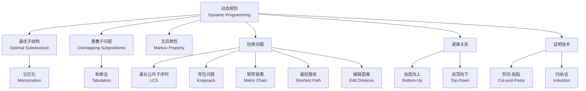
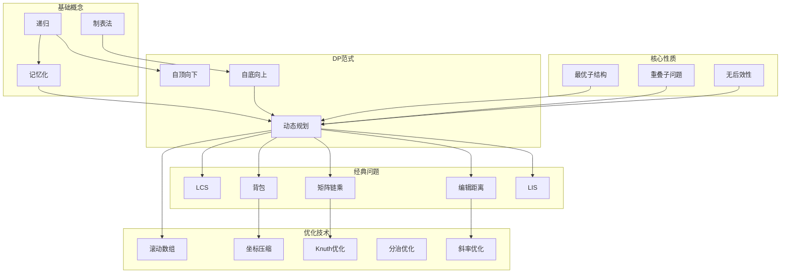
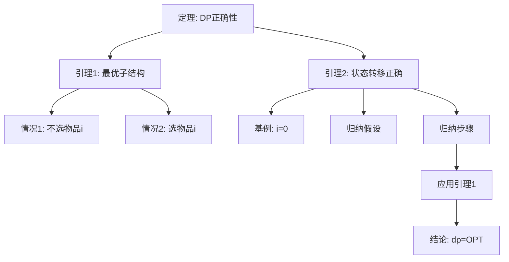

# 动态规划理论 - 六维内容补充


> **版本**: 1.0
> **创建日期**: 2026-04-19
> **最后更新**: 2026-04-19

> **模块**: 09-算法理论/01-算法基础
> **文档**: 06-动态规划理论
> **补充维度**: 概念定义、属性、关系、解释、论证、形式证明
> **对标**: MIT 6.046 / Stanford CS161 / CMU 15-451 / Berkeley CS170
> **深度**: 研究生级

---

## 思维导图：动态规划概念结构



---

## 一、概念定义 (Concept Definition)

### 1.1 动态规划 / Dynamic Programming

**定义 1.1.1** (形式化)

动态规划是一种算法设计范式，适用于满足以下两个性质的问题：

1. **最优子结构** (Optimal Substructure):
   设原问题 $P$ 的最优解为 $S^*$，若 $S^*$ 可分解为子解 $S_1^*, S_2^*, \ldots, S_k^*$，则每个 $S_i^*$ 必须是对应子问题 $P_i$ 的最优解。

2. **重叠子问题** (Overlapping Subproblems):
   问题的递归分解产生大量相同的子问题，即子问题空间规模为多项式级别。

形式化地，DP算法可表示为：

$$
\text{DP}(P) = \begin{cases}
\text{base}(P) & \text{if } P \text{ 是基本情况} \\
\text{combine}\left(\text{DP}(P_1), \ldots, \text{DP}(P_k)\right) & \text{otherwise}
\end{cases}
$$

其中 combine 操作满足最优子结构。

**自然语言定义**

动态规划通过将复杂问题分解为相互重叠的子问题，并存储子问题的解以避免重复计算，从而高效地求解最优化问题。其核心思想是"用空间换时间"。

---

### 1.2 最优子结构 / Optimal Substructure

**定义 1.2.1** (形式化)

问题 $P$ 具有最优子结构，如果存在分解 $P \rightarrow \{P_1, \ldots, P_k\}$ 使得：

$$
\text{opt}(P) = f\left(\text{opt}(P_1), \ldots, \text{opt}(P_k)\right)
$$

其中 $f$ 是某个组合函数，$\text{opt}(X)$ 表示问题 $X$ 的最优解。

**判定准则**

对于最优化问题，最优子结构成立的充分条件是：

- 问题的解空间可分解为子问题的解空间的笛卡尔积
- 目标函数具有单调性：子问题的非最优解不会导致原问题的最优解

---

### 1.3 重叠子问题 / Overlapping Subproblems

**定义 1.3.1** (形式化)

问题 $P$ 具有重叠子问题性质，如果其递归调用树满足：

$$
|\{P' : P' \text{ 是 } P \text{ 的子问题}\}| = O(n^k)
$$

但递归树的节点数为 $\Omega(2^n)$（或更大），其中 $n$ 是问题规模参数。

---

## 二、属性 (Properties)

### 2.1 动态规划问题属性表

| 属性名 | 类型/范围 | 含义 | 示例 |
|--------|-----------|------|------|
| **最优子结构** | 布尔 | 全局最优解包含子问题最优解 | 最短路径、LCS |
| **重叠子问题** | 布尔 | 子问题被多次求解 | Fibonacci、矩阵链乘 |
| **无后效性** | 布尔 | 未来状态只依赖当前状态 | 状态压缩DP |
| **决策单调性** | 布尔 | 最优决策点单调移动 | 分治优化DP |
| **凸性/凹性** | 布尔 | 代价函数满足凸/凹性 | 斜率优化DP |

### 2.2 经典DP问题对比矩阵

| 问题 | 状态定义 | 转移方程 | 时间复杂度 | 空间复杂度 | 优化技术 |
|------|----------|----------|------------|------------|----------|
| **斐波那契** | $F(n)$ | $F(n)=F(n-1)+F(n-2)$ | $O(n)$ | $O(1)$ | 滚动数组 |
| **LCS** | $dp[i][j]$ | $\max(dp[i-1][j], dp[i][j-1], dp[i-1][j-1]+1)$ | $O(mn)$ | $O(\min(m,n))$ | 空间压缩 |
| **0/1背包** | $dp[i][w]$ | $\max(dp[i-1][w], dp[i-1][w-w_i]+v_i)$ | $O(nW)$ | $O(W)$ | 逆序更新 |
| **完全背包** | $dp[w]$ | $\max(dp[w], dp[w-w_i]+v_i)$ | $O(nW)$ | $O(W)$ | 正序更新 |
| **矩阵链乘** | $dp[i][j]$ | $\min_{k}(dp[i][k]+dp[k+1][j]+p_{i-1}p_kp_j)$ | $O(n^3)$ | $O(n^2)$ | Knuth优化 |
| **编辑距离** | $dp[i][j]$ | $\min(dp[i-1][j], dp[i][j-1], dp[i-1][j-1])+cost$ | $O(mn)$ | $O(\min(m,n))$ | Hirschberg |
| **最长递增子序列** | $dp[i]$ | $\max_{j<i, a_j<a_i}(dp[j])+1$ | $O(n^2) \to O(n\log n)$ | $O(n)$ | 二分优化 |
| **树形DP** | $dp[u][k]$ | 合并子树状态 | $O(nk^2)$ | $O(nk)$ | 背包式合并 |

### 2.3 状态转移方程模板

```
一般形式:
  dp[state] = optimal{ dp[prev_state] + cost(prev_state → state) }

其中:
  - state: 当前状态编码
  - prev_state: 所有可达的前驱状态
  - optimal: max 或 min
  - cost: 状态转移代价
```

---

## 三、关系 (Relations)

### 3.1 概念关系表

| 源概念 | 目标概念 | 关系类型 | 说明 |
|--------|----------|----------|------|
| 动态规划 | 分治算法 | specializes | DP是分治+记忆化 |
| 动态规划 | 贪心算法 | contrasts_with | DP需要探索所有子问题，贪心局部最优 |
| 记忆化搜索 | 制表法 | equivalent_to | 两种实现方式，等价 |
| 最优子结构 | 贪心选择性质 | depends_on | 贪心需要更强的性质 |
| 动态规划 | 最短路径 | applies_to | 图上的DP特例 |
| 动态规划 | 马尔可夫决策 | generalizes_to | MDP是随机环境下的DP |

### 3.2 概念依赖图



---

## 四、解释 (Explanation)

### 4.1 动机与直观

**为什么需要动态规划？**

考虑斐波那契数列的朴素递归：

```python
def fib(n):
    if n <= 1: return n
    return fib(n-1) + fib(n-2)
```

时间复杂度：$O(2^n)$ —— 因为 $F(3)$ 被重复计算了无数次！

**DP的核心洞察**:

1. **子问题重叠**: $F(n-2)$ 在计算 $F(n)$ 和 $F(n-1)$ 时都会被用到
2. **记忆化**: 存储已计算结果，避免重复
3. **复杂度降低**: 时间从指数降到线性

### 4.2 与已有概念的联系

**DP ↔ 分治**

| 特征 | 分治 | 动态规划 |
|------|------|----------|
| 子问题划分 | 不重叠 | 重叠 |
| 子问题求解 | 独立 | 依赖 |
| 典型复杂度 | $O(n \log n)$ | $O(n^2)$ 或更高 |
| 典型问题 | 归并排序 | 矩阵链乘 |

**DP ↔ 贪心**

贪心选择性质 $\subset$ 最优子结构

- DP: "探索所有可能，选择最优"
- 贪心: "做出局部最优选择，相信它是全局最优的一部分"

### 4.3 示例与反例

**示例 4.3.1**: 0/1背包问题

```
问题: n个物品，重量w[i]，价值v[i]，背包容量W
目标: 在不超过容量的情况下，最大化总价值

DP定义: dp[i][j] = 考虑前i个物品，容量为j时的最大价值

转移方程:
  dp[i][j] = max(
    dp[i-1][j],                    // 不选第i个物品
    dp[i-1][j-w[i]] + v[i]         // 选第i个物品（如果j>=w[i]）
  )

初始化: dp[0][j] = 0, dp[i][0] = 0
答案: dp[n][W]
```

**反例 4.3.2**: 最长简单路径

问题：求有向无环图中两点间的最长路径。

为什么不能直接用DP？

- 看似可以：$dp[v] = \max_{u \to v}(dp[u] + w(u,v))$
- 问题：最长路径的子路径不一定是最长路径！
- 反例：A→B→C 和 A→D→C，若两条路径都经过某中间点，会重复计数

**教训**: 必须严格验证最优子结构性质。

---

## 五、论证 (Argumentation)

### 5.1 非形式论证：为什么DP能得到最优解？

**归纳论证框架**:

1. **基例**: 基本情况（如 $dp[0]$）显然最优
2. **归纳假设**: 假设所有规模小于 $n$ 的子问题已求得最优解
3. **归纳步骤**: 证明 $dp[n]$ 通过状态转移方程组合这些最优解后仍保持最优

**关键洞察**: 最优子结构保证了"局部最优 $\Rightarrow$ 全局最优"的传递性。

### 5.2 反例与边界

**边界情况 5.2.1**: 整数溢出

```python
# 危险代码
dp = [0] * (W + 1)
for i in range(n):
    for w in range(W, w[i]-1, -1):
        dp[w] = max(dp[w], dp[w - w[i]] + v[i])
```

问题：如果总价值超过 `int` 范围，会发生溢出。

**边界情况 5.2.2**: 空间复杂度陷阱

某些DP问题（如LCS）空间复杂度为 $O(mn)$，当 $m, n = 10^5$ 时，内存需求约40GB！

---

## 六、形式证明 (Formal Proof)

### 6.1 0/1背包问题正确性证明

**定理 6.1.1**: 上述0/1背包DP算法返回最优解。

**证明** (归纳法):

**定义**: 设 $OPT(i, w)$ 为考虑前 $i$ 个物品、容量为 $w$ 时的最优价值。

**引理 6.1.2** (最优子结构):
对于 $i > 0$ 且 $w \geq w[i]$：

$$OPT(i, w) = \max\left(OPT(i-1, w), OPT(i-1, w-w[i]) + v[i]\right)$$

**引理证明**:
考虑最优解 $S$ 对于前 $i$ 个物品、容量 $w$：

- **情况1**: 物品 $i \notin S$。则 $S$ 是前 $i-1$ 个物品、容量 $w$ 的最优解，价值为 $OPT(i-1, w)$。
- **情况2**: 物品 $i \in S$。则剩余容量为 $w - w[i]$，剩余物品为前 $i-1$ 个，最优价值为 $OPT(i-1, w-w[i]) + v[i]$。

两种情况取最大值即得。

**主定理证明** (归纳):

- **基例**: $dp[0][w] = 0 = OPT(0, w)$ 对所有 $w$ 成立。
- **归纳假设**: 假设对所有 $i' < i$，$dp[i'][w] = OPT(i', w)$ 成立。
- **归纳步骤**:

  ```
  dp[i][w] = max(dp[i-1][w], dp[i-1][w-w[i]] + v[i])    [算法定义]
           = max(OPT(i-1, w), OPT(i-1, w-w[i]) + v[i]) [归纳假设]
           = OPT(i, w)                                  [引理6.1.2]
  ```

因此 $dp[n][W] = OPT(n, W)$，即算法正确。

### 6.2 证明决策树



---

## 七、多语言实现

### 7.1 Rust: 0/1背包

```rust
/// 0/1背包问题 - 空间优化版本
/// 时间: O(nW), 空间: O(W)
pub fn knapsack_01(weights: &[usize], values: &[usize], capacity: usize) -> usize {
    let n = weights.len();
    let mut dp = vec![0; capacity + 1];

    for i in 0..n {
        // 逆序更新，避免重复选择
        for w in (weights[i]..=capacity).rev() {
            dp[w] = dp[w].max(dp[w - weights[i]] + values[i]);
        }
    }

    dp[capacity]
}

/// 带路径追踪的0/1背包
pub fn knapsack_01_with_path(
    weights: &[usize],
    values: &[usize],
    capacity: usize
) -> (usize, Vec<bool>) {
    let n = weights.len();
    let mut dp = vec![vec![0; capacity + 1]; n + 1];

    // 填表
    for i in 1..=n {
        for w in 0..=capacity {
            dp[i][w] = dp[i-1][w];
            if w >= weights[i-1] {
                dp[i][w] = dp[i][w].max(
                    dp[i-1][w - weights[i-1]] + values[i-1]
                );
            }
        }
    }

    // 回溯找出选择的物品
    let mut selected = vec![false; n];
    let mut w = capacity;
    for i in (1..=n).rev() {
        if dp[i][w] != dp[i-1][w] {
            selected[i-1] = true;
            w -= weights[i-1];
        }
    }

    (dp[n][capacity], selected)
}

#[cfg(test)]
mod tests {
    use super::*;

    #[test]
    fn test_knapsack_basic() {
        let weights = vec![2, 3, 4, 5];
        let values = vec![3, 4, 5, 6];
        let capacity = 8;
        assert_eq!(knapsack_01(&weights, &values, capacity), 10);
    }

    #[test]
    fn test_knapsack_path() {
        let weights = vec![1, 2, 3];
        let values = vec![6, 10, 12];
        let capacity = 5;
        let (max_value, selected) = knapsack_01_with_path(&weights, &values, capacity);
        assert_eq!(max_value, 22);
        assert_eq!(selected, vec![false, true, true]);
    }
}
```

### 7.2 Go: 最长公共子序列 (LCS)

```go
package main

import "fmt"

// LCS 计算最长公共子序列长度
// 时间: O(mn), 空间: O(min(m,n))
func LCS(s1, s2 string) int {
 m, n := len(s1), len(s2)

 // 确保s2是较短的字符串以优化空间
 if m < n {
  return LCS(s2, s1)
 }

 // 只需要两行
 prev := make([]int, n+1)
 curr := make([]int, n+1)

 for i := 1; i <= m; i++ {
  for j := 1; j <= n; j++ {
   if s1[i-1] == s2[j-1] {
    curr[j] = prev[j-1] + 1
   } else {
    curr[j] = max(prev[j], curr[j-1])
   }
  }
  // 交换prev和curr
  prev, curr = curr, prev
 }

 return prev[n]
}

// LCSWithPath 返回LCS长度和具体的LCS字符串
func LCSWithPath(s1, s2 string) (int, string) {
 m, n := len(s1), len(s2)

 // 构建完整的DP表
 dp := make([][]int, m+1)
 for i := range dp {
  dp[i] = make([]int, n+1)
 }

 // 填表
 for i := 1; i <= m; i++ {
  for j := 1; j <= n; j++ {
   if s1[i-1] == s2[j-1] {
    dp[i][j] = dp[i-1][j-1] + 1
   } else {
    dp[i][j] = max(dp[i-1][j], dp[i][j-1])
   }
  }
 }

 // 回溯构建LCS
 lcs := make([]byte, 0, dp[m][n])
 i, j := m, n
 for i > 0 && j > 0 {
  if s1[i-1] == s2[j-1] {
   lcs = append(lcs, s1[i-1])
   i--
   j--
  } else if dp[i-1][j] > dp[i][j-1] {
   i--
  } else {
   j--
  }
 }

 // 反转lcs
 for i, j := 0, len(lcs)-1; i < j; i, j = i+1, j-1 {
  lcs[i], lcs[j] = lcs[j], lcs[i]
 }

 return dp[m][n], string(lcs)
}

func max(a, b int) int {
 if a > b {
  return a
 }
 return b
}

func main() {
 s1 := "ABCDGH"
 s2 := "AEDFHR"

 length := LCS(s1, s2)
 fmt.Printf("LCS length: %d\n", length)

 length2, lcs := LCSWithPath(s1, s2)
 fmt.Printf("LCS: %s (length: %d)\n", lcs, length2)
}
```

### 7.3 Python: 矩阵链乘

```python
from typing import List, Tuple

def matrix_chain_order(dimensions: List[int]) -> Tuple[int, List[List[int]]]:
    """
    矩阵链乘法最优括号化

    Args:
        dimensions: 矩阵维度列表，第i个矩阵为 dimensions[i] x dimensions[i+1]

    Returns:
        (最小乘法次数, 分割点表)
    """
    n = len(dimensions) - 1  # 矩阵数量

    # dp[i][j] = 计算矩阵i到j的最小代价
    dp = [[0] * n for _ in range(n)]
    # split[i][j] = 最优分割点
    split = [[0] * n for _ in range(n)]

    # 链长从2到n
    for chain_len in range(2, n + 1):
        for i in range(n - chain_len + 1):
            j = i + chain_len - 1
            dp[i][j] = float('inf')

            # 尝试所有可能的分割点
            for k in range(i, j):
                cost = (dp[i][k] + dp[k+1][j] +
                       dimensions[i] * dimensions[k+1] * dimensions[j+1])

                if cost < dp[i][j]:
                    dp[i][j] = cost
                    split[i][j] = k

    return dp[0][n-1], split


def print_optimal_parens(split: List[List[int]], i: int, j: int) -> str:
    """打印最优括号化方案"""
    if i == j:
        return f"A{i+1}"
    else:
        k = split[i][j]
        left = print_optimal_parens(split, i, k)
        right = print_optimal_parens(split, k+1, j)
        return f"({left} x {right})"


# 带Knuth优化的版本 (O(n^2))
def matrix_chain_order_knuth(dimensions: List[int]) -> int:
    """
    Knuth优化版本
    适用于满足四边形不等式的问题
    """
    n = len(dimensions) - 1
    dp = [[0] * n for _ in range(n)]
    opt = [[0] * n for _ in range(n)]  # 最优分割点

    for i in range(n):
        opt[i][i] = i

    for chain_len in range(2, n + 1):
        for i in range(n - chain_len + 1):
            j = i + chain_len - 1
            dp[i][j] = float('inf')

            # 只在 opt[i][j-1] 到 opt[i+1][j] 范围内搜索
            start = opt[i][j-1] if j > i else i
            end = opt[i+1][j] if i < j else j

            for k in range(start, min(end, j) + 1):
                cost = (dp[i][k] + dp[k+1][j] +
                       dimensions[i] * dimensions[k+1] * dimensions[j+1])

                if cost < dp[i][j]:
                    dp[i][j] = cost
                    opt[i][j] = k

    return dp[0][n-1]


if __name__ == "__main__":
    # 示例: 3个矩阵 A1(10x30), A2(30x5), A3(5x60)
    dimensions = [10, 30, 5, 60]

    min_cost, split = matrix_chain_order(dimensions)
    print(f"最小乘法次数: {min_cost}")  # 4500
    print(f"最优括号化: {print_optimal_parens(split, 0, 2)}")

    # 大例子
    dims = [30, 35, 15, 5, 10, 20, 25]
    cost, _ = matrix_chain_order(dims)
    print(f"6个矩阵的最小代价: {cost}")  # 15125
```

### 7.4 C: 编辑距离

```c
#include <stdio.h>
#include <stdlib.h>
#include <string.h>

// 编辑距离 (Levenshtein Distance)
// 时间: O(mn), 空间: O(min(m,n))
int edit_distance(const char* s1, const char* s2) {
    int m = strlen(s1);
    int n = strlen(s2);

    // 确保s2是较短的字符串
    if (m < n) {
        const char* temp = s1;
        s1 = s2;
        s2 = temp;
        int temp_len = m;
        m = n;
        n = temp_len;
    }

    // 只需要两行
    int* prev = (int*)calloc(n + 1, sizeof(int));
    int* curr = (int*)calloc(n + 1, sizeof(int));

    // 初始化第一行
    for (int j = 0; j <= n; j++) {
        prev[j] = j;
    }

    for (int i = 1; i <= m; i++) {
        curr[0] = i;
        for (int j = 1; j <= n; j++) {
            if (s1[i-1] == s2[j-1]) {
                curr[j] = prev[j-1];  // 字符相同，无操作
            } else {
                int insertion = curr[j-1] + 1;
                int deletion = prev[j] + 1;
                int substitution = prev[j-1] + 1;

                // 取最小值
                curr[j] = insertion;
                if (deletion < curr[j]) curr[j] = deletion;
                if (substitution < curr[j]) curr[j] = substitution;
            }
        }
        // 交换prev和curr
        int* temp = prev;
        prev = curr;
        curr = temp;
    }

    int result = prev[n];
    free(prev);
    free(curr);
    return result;
}

// 带操作的编辑距离 (返回操作序列)
typedef enum { MATCH, INSERT, DELETE, SUBSTITUTE } EditOp;

typedef struct {
    EditOp op;
    char from;
    char to;
} Operation;

// 带路径追踪的编辑距离
int edit_distance_with_path(const char* s1, const char* s2,
                            Operation** ops, int* op_count) {
    int m = strlen(s1);
    int n = strlen(s2);

    // 分配DP表
    int** dp = (int**)malloc((m + 1) * sizeof(int*));
    for (int i = 0; i <= m; i++) {
        dp[i] = (int*)calloc(n + 1, sizeof(int));
    }

    // 初始化边界
    for (int i = 0; i <= m; i++) dp[i][0] = i;
    for (int j = 0; j <= n; j++) dp[0][j] = j;

    // 填表
    for (int i = 1; i <= m; i++) {
        for (int j = 1; j <= n; j++) {
            if (s1[i-1] == s2[j-1]) {
                dp[i][j] = dp[i-1][j-1];
            } else {
                int insertion = dp[i][j-1] + 1;
                int deletion = dp[i-1][j] + 1;
                int substitution = dp[i-1][j-1] + 1;

                dp[i][j] = insertion;
                if (deletion < dp[i][j]) dp[i][j] = deletion;
                if (substitution < dp[i][j]) dp[i][j] = substitution;
            }
        }
    }

    // 回溯找出操作序列
    *ops = (Operation*)malloc((m + n) * sizeof(Operation));
    *op_count = 0;

    int i = m, j = n;
    while (i > 0 || j > 0) {
        if (i == 0) {
            (*ops)[(*op_count)++] = (Operation){INSERT, '-', s2[j-1]};
            j--;
        } else if (j == 0) {
            (*ops)[(*op_count)++] = (Operation){DELETE, s1[i-1], '-'};
            i--;
        } else if (s1[i-1] == s2[j-1]) {
            (*ops)[(*op_count)++] = (Operation){MATCH, s1[i-1], s2[j-1]};
            i--; j--;
        } else {
            int insertion = dp[i][j-1];
            int deletion = dp[i-1][j];
            int substitution = dp[i-1][j-1];

            if (substitution <= insertion && substitution <= deletion) {
                (*ops)[(*op_count)++] = (Operation){SUBSTITUTE, s1[i-1], s2[j-1]};
                i--; j--;
            } else if (insertion < deletion) {
                (*ops)[(*op_count)++] = (Operation){INSERT, '-', s2[j-1]};
                j--;
            } else {
                (*ops)[(*op_count)++] = (Operation){DELETE, s1[i-1], '-'};
                i--;
            }
        }
    }

    // 反转操作序列
    for (int k = 0; k < *op_count / 2; k++) {
        Operation temp = (*ops)[k];
        (*ops)[k] = (*ops)[*op_count - 1 - k];
        (*ops)[*op_count - 1 - k] = temp;
    }

    int result = dp[m][n];

    // 释放内存
    for (int k = 0; k <= m; k++) free(dp[k]);
    free(dp);

    return result;
}

void print_operation(Operation op) {
    switch (op.op) {
        case MATCH: printf("  %c (keep)\n", op.to); break;
        case INSERT: printf("  +%c (insert)\n", op.to); break;
        case DELETE: printf("  -%c (delete)\n", op.from); break;
        case SUBSTITUTE: printf("  %c->%c (substitute)\n", op.from, op.to); break;
    }
}

int main() {
    const char* s1 = "kitten";
    const char* s2 = "sitting";

    int dist = edit_distance(s1, s2);
    printf("Edit distance between '%s' and '%s': %d\n", s1, s2, dist);

    Operation* ops;
    int op_count;
    dist = edit_distance_with_path(s1, s2, &ops, &op_count);
    printf("\nOperations:\n");
    for (int i = 0; i < op_count; i++) {
        print_operation(ops[i]);
    }

    free(ops);
    return 0;
}
```

---

## 八、算法选择决策树

```mermaid
flowchart TD
    Problem[最优化问题] --> Check1{满足最优子结构?}
    Check1 -->|否| Greedy{尝试贪心}
    Check1 -->|是| Check2{子问题重叠?}

    Check2 -->|否| Divide[使用分治算法]
    Check2 -->|是| DPApproach[使用动态规划]

    DPApproach --> State{状态设计?}
    State -->|线性| Linear[线性DP<br/>如: LIS, 背包]
    State -->|二维| Grid[网格DP<br/>如: LCS, 编辑距离]
    State -->|区间| Interval[区间DP<br/>如: 矩阵链乘]
    State -->|树形| TreeDP[树形DP<br/>如: 树的最大独立集]
    State -->|状态压缩| Bitmask[状压DP<br/>如: TSP, 子集DP]

    Linear --> Opt1{需要优化?}
    Opt1 -->|空间| SpaceOpt[滚动数组]
    Opt1 -->|时间| TimeOpt[单调队列/斜率优化]

    Grid --> Opt2{需要优化?}
    Opt2 -->|空间| SpaceOpt2[只保留两行]

    Interval --> Opt3{满足四边形不等式?}
    Opt3 -->|是| Knuth[Knuth优化 O(n^2)]
    Opt3 -->|否| Standard[标准O(n^3)]
```

---

**文档版本**: v1.0
**创建日期**: 2026-04-10
**维护**: 项目算法理论工作组

---

## 参考文献 / References

1. **[CLRS2022]** Cormen, T. H., Leiserson, C. E., Rivest, R. L., & Stein, C. (2022). *Introduction to Algorithms* (4th ed.). MIT Press.
2. **[KleinbergTardos2006]** Kleinberg, J., & Tardos, É. (2006). *Algorithm Design*. Pearson.
3. **[Erickson2019]** Erickson, J. (2019). *Algorithms*. Self-published. <https://jeffe.cs.illinois.edu/teaching/algorithms/>.

**文档版本 / Document Version**: 1.0
**对齐状态**: 已补充权威引用，与项目引用规范对齐。
---

## 知识导航

- [返回目录](README.md)

