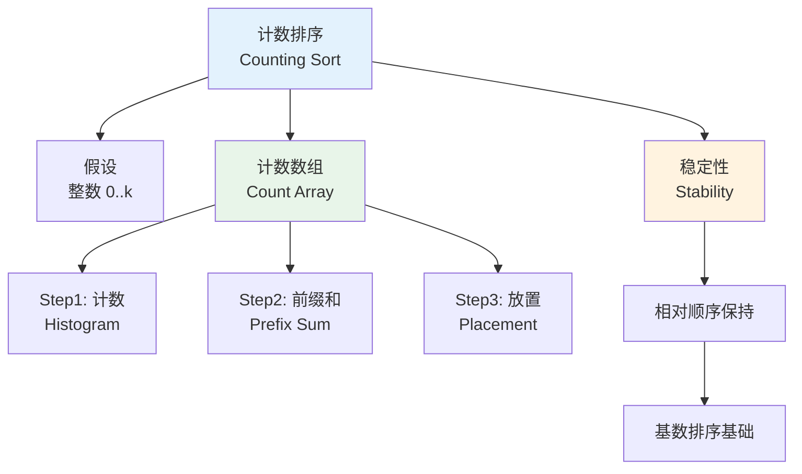

# 计数排序 - 六维内容补充


> **版本**: 1.0
> **创建日期**: 2026-04-19
> **最后更新**: 2026-04-19

> **模块**: 09-算法理论/01-算法基础
> **文档**: 计数排序 (Counting Sort)
> **补充维度**: 概念定义、属性、关系、解释、论证、形式证明
> **对标**: CLRS 4th Ed. Chapter 8.2 / MIT 6.006 / CMU 15-451
> **深度**: 研究生级

---

## 思维导图：计数排序概念结构



---

## 一、理论基础 (Theoretical Foundation)

### 1.1 计数排序的定义

**定义 1.1.1** (计数排序) [CLRS2022, Ch.8.2]

**计数排序**（Counting Sort）假设输入元素均为 $[0, k]$ 范围内的整数。它通过统计每个值出现的次数，然后利用前缀和计算每个值在输出序列中的最终位置，从而在线性时间内完成排序。

### 1.2 排序问题的整数约束版本

**定义 1.2.1** (整数排序问题)

给定一个数组 $A[1..n]$，其中每个元素 $A[j] \in \{0, 1, \ldots, k\}$，输出一个非递减序列 $B[1..n]$，使得 $B$ 是 $A$ 的一个排列。

**稳定性要求**: 若 $A[i] = A[j]$ 且 $i < j$，则在 $B$ 中 $A[i]$ 应位于 $A[j]$ 之前。

---

## 二、算法设计 (Algorithm Design)

### 2.1 计数排序伪代码

```
算法: COUNTING-SORT(A, n, k)
1. 令 C[0..k] 为新数组，初始化为 0
2. for j = 1 to n
3.     C[A[j]] = C[A[j]] + 1
4. // 此时 C[i] 表示值 i 在 A 中出现的次数
5. for i = 1 to k
6.     C[i] = C[i] + C[i-1]
7. // 此时 C[i] 表示值 ≤ i 的元素个数
8. 令 B[1..n] 为新数组
9. for j = n downto 1
10.    B[C[A[j]]] = A[j]
11.    C[A[j]] = C[A[j]] - 1
12. return B
```

### 2.2 算法设计要点

| 阶段 | 操作 | 目的 |
|------|------|------|
| 计数 | 遍历输入，统计频次 | 建立直方图 |
| 累加 | 计算前缀和 | 确定每个值的"右边界" |
| 放置 | 逆序遍历输入，放入输出 | 保持稳定性 |

**稳定性关键**: 第 9-11 行的逆序遍历确保了相等元素中后出现者被放置在更靠后的位置，从而保持了原始相对顺序。

---

## 三、复杂度分析 (Complexity Analysis)

### 3.1 时间复杂度

**定理 3.1.1** (计数排序时间复杂度) [CLRS2022, Ch.8.2]

计数排序的时间复杂度为 $\Theta(n + k)$。

**证明**:

- 第 2-3 行：计数阶段，$\Theta(n)$
- 第 5-6 行：累加阶段，$\Theta(k)$
- 第 9-11 行：放置阶段，$\Theta(n)$

总时间：$\Theta(n) + \Theta(k) + \Theta(n) = \Theta(n + k)$。$\square$

**推论 3.1.2**: 当 $k = O(n)$ 时，计数排序的时间复杂度为 $\Theta(n)$。

### 3.2 空间复杂度

计数排序需要：

- 计数数组 $C[0..k]$：$\Theta(k)$
- 输出数组 $B[1..n]$：$\Theta(n)$

总空间复杂度：$\Theta(n + k)$。

---

## 四、形式化验证 (Formal Verification)

### 4.1 循环不变式

**定理 4.1.1** (计数排序的正确性)

算法 `COUNTING-SORT(A, n, k)` 输出数组 $B$ 满足：

1. $B$ 是非递减有序的
2. $B$ 是 $A$ 的一个排列
3. 若 $A$ 中 $x$ 出现在 $y$ 之前且 $x = y$，则在 $B$ 中 $x$ 仍出现在 $y$ 之前（稳定性）

### 4.2 放置阶段循环不变式

**不变式** (第 9-11 行 for 循环):

在每次迭代开始时（处理 $A[j..n]$ 之前），数组 $B$ 满足：

1. $B[C[A[j]]+1 .. n]$ 中已经包含了 $A[j+1..n]$ 中元素的稳定放置结果
2. 对于每个值 $v \in [0, k]$，$C[v]$ 表示值 $v$ 在 $A[1..j]$ 中最后一个应该被放置的位置

**初始化**: 循环开始前，$j = n$，$B$ 为空，不变式显然成立。

**保持**: 假设不变式在迭代 $j$ 时成立。将 $A[j]$ 放置到 $B[C[A[j]]]$，然后 $C[A[j]]$ 减 1。这使得 $C[A[j]]$ 仍然指向 $A[1..j-1]$ 中值为 $A[j]$ 的元素应该放置的位置。由于我们是逆序遍历，先出现的相同值会被放置到更靠前的位置，保证了稳定性。

**终止**: 当 $j = 0$ 时，所有元素都已按稳定方式放入 $B$。

---

## 五、应用场景 (Application Scenarios)

### 5.1 适用条件

计数排序最适合以下场景：

- 输入为**整数**或可以被映射为整数
- 数值范围 $k$ 不太大，最好是 $k = O(n)$
- 需要**稳定排序**作为子程序（如基数排序）

### 5.2 实际应用

| 应用场景 | 说明 |
|----------|------|
| 年龄排序 | 年龄范围通常 $0 \sim 150$，远小于 $n$ |
| 成绩排序 | 百分制成绩，$k = 100$ |
| 基数排序子程序 | 按位稳定排序的核心步骤 |
| 字符串按字符排序 | ASCII 码范围 $k = 128$ 或 $256$ |
| 像素值排序 | 灰度图像 $k = 255$ |

### 5.3 不适用场景

- 浮点数排序（难以直接映射到整数范围）
- $k$ 远大于 $n$ 的情况（空间开销过大）
- 数据分布极度稀疏时

---

## 六、扩展变体 (Extensions and Variants)

### 6.1 原地计数排序

**定义 6.1.1** (原地计数排序)

通过多轮扫描和交换，可以在 $O(n + k)$ 时间和 $O(k)$ 额外空间内实现不稳定的原地计数排序，但通常稳定性会被破坏。

### 6.2 前缀和优化

对于多次排序相同范围的数据，可以预先计算并缓存前缀和数组，将后续排序的累加阶段从 $O(k)$ 降到 $O(1)$（均摊）。

### 6.3 并行计数排序

计数阶段和放置阶段都可以通过 GPU 并行化：

- **计数**: 使用并行直方图算法
- **前缀和**: 使用并行扫描（Parallel Scan）
- **放置**: 各线程独立写入输出位置（无冲突，因为位置已通过前缀和唯一确定）

### 6.4 负数和偏移计数排序

通过 $A'[j] = A[j] - \min(A)$ 的偏移变换，可以将任意有界整数范围映射到 $[0, k]$，扩展计数排序的适用范围。

---

## 参考文献 / References

1. **[CLRS2022]** Cormen, T. H., Leiserson, C. E., Rivest, R. L., & Stein, C. (2022). *Introduction to Algorithms* (4th ed.). MIT Press. Chapter 8.2.
2. **[Sedgewick2011]** Sedgewick, R., & Wayne, K. (2011). *Algorithms* (4th ed.). Addison-Wesley.

**文档版本 / Document Version**: 1.0
**对齐状态**: 已补充权威引用，与项目引用规范对齐
---

## 知识导航

- [返回目录](README.md)

## 学习目标

- 理解计数排序 - 六维内容补充的核心概念
- 掌握计数排序 - 六维内容补充的形式化表示
