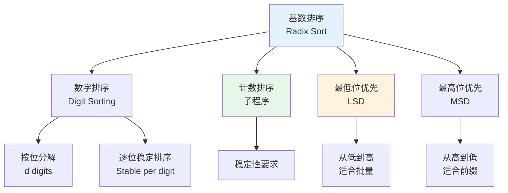

# 基数排序 - 六维内容补充

> **模块**: 09-算法理论/01-算法基础
> **文档**: 基数排序 (Radix Sort)
> **补充维度**: 概念定义、属性、关系、解释、论证、形式证明
> **对标**: CLRS 4th Ed. Chapter 8.3 / MIT 6.006 / CMU 15-451
> **深度**: 研究生级

---

## 思维导图：基数排序概念结构



---

## 一、理论基础 (Theoretical Foundation)

### 1.1 基数排序的定义

**定义 1.1.1** (基数排序) [CLRS2022, Ch.8.3]

**基数排序**（Radix Sort）是一种非比较排序算法，适用于每个元素都可以视为由 $d$ 个"数字"（或关键字）组成的序列。算法通过从最低有效位（LSD）到最高有效位（或相反），逐位使用稳定排序算法（通常是计数排序）对整个数组进行排序。

### 1.2 数字表示模型

**定义 1.2.1** ($d$ 位数字表示)

设每个输入元素 $x$ 可以表示为 $d$ 位数字序列：

$$x = (x_d, x_{d-1}, \ldots, x_1)$$

其中每位数字 $x_i \in \{0, 1, \ldots, k-1\}$，$k$ 为基数（如十进制 $k=10$，二进制 $k=2$）。

排序规则为字典序：$x < y$ 当且仅当存在某个位置 $j$，使得对所有 $i < j$ 有 $x_i = y_i$ 且 $x_j < y_j$。

---

## 二、算法设计 (Algorithm Design)

### 2.1 LSD 基数排序伪代码

```
算法: RADIX-SORT(A, n, d)
1. for i = 1 to d
2.     使用稳定排序按第 i 位对 A 排序
```

其中 $i=1$ 表示最低有效位，$i=d$ 表示最高有效位。

### 2.2 LSD vs MSD 基数排序

| 特性 | LSD (最低位优先) | MSD (最高位优先) |
|------|-----------------|-----------------|
| 扫描顺序 | 从低位到高位 | 从高位到低位 |
| 中间结果 | 无意义 | 部分有序（前缀已排序） |
| 稳定性 | 必须稳定 | 可以不稳定 |
| 空间 | $O(n)$ | $O(n + k)$ 递归栈 |
| 适用性 | 固定位数数据 | 变长数据（如字符串） |

### 2.3 算法设计要点

LSD 基数排序的正确性依赖于子排序的**稳定性**：
- 在按低位排序后，若两个元素低位相同，高位较大的元素不应被移动到高位较小元素的前面
- 稳定排序保证了高位的相对顺序在低位排序过程中不被破坏

---

## 三、复杂度分析 (Complexity Analysis)

### 3.1 时间复杂度

**定理 3.1.1** (基数排序时间复杂度) [CLRS2022, Ch.8.3]

给定 $n$ 个 $d$ 位元素，每位取值范围为 $0$ 到 $k-1$。若使用计数排序作为稳定子排序，则基数排序的时间复杂度为 $\Theta(d(n + k))$。

**证明**:
- 每位排序使用计数排序，时间为 $\Theta(n + k)$
- 共 $d$ 位，总时间为 $d \cdot \Theta(n + k) = \Theta(d(n + k))$。$\square$

**推论 3.1.2**: 当 $d$ 为常数且 $k = O(n)$ 时，基数排序的时间复杂度为 $\Theta(n)$。

### 3.2 具体数值分析

对于 $b$ 位二进制整数，若按 $r$ 位一组进行基数排序：
- 位数 $d = \lceil b/r \rceil$
- 每位范围 $k = 2^r - 1$
- 总时间：$\Theta\left(\frac{b}{r}(n + 2^r)\right)$

**最优 $r$ 选择**: 取 $r = \log_2 n$ 时，时间复杂度为 $\Theta(bn / \log n)$。

### 3.3 空间复杂度

- 输出数组：$O(n)$
- 计数数组（每轮复用）：$O(k)$

总空间复杂度：$O(n + k)$。

---

## 四、形式化验证 (Formal Verification)

### 4.1 基数排序正确性

**定理 4.1.1** (LSD 基数排序正确性)

设 `RADIX-SORT(A, n, d)` 使用稳定排序作为子程序，则输出数组是非递减有序的。

### 4.2 归纳证明

**证明** (数学归纳法):

**归纳假设 $P(i)$**: 在处理完前 $i$ 位（从最低位开始）后，数组按低 $i$ 位有序。

**基础情况** ($i = 1$): 第 1 位排序后，数组显然按最低 1 位有序。

**归纳步骤**: 假设 $P(i-1)$ 成立。考虑第 $i$ 位排序：
- 由于子排序是稳定的，对于第 $i$ 位相同的元素，它们在排序后的相对顺序与排序前相同
- 排序前，这些元素已经按低 $i-1$ 位有序（由归纳假设）
- 因此，第 $i$ 位排序后，数组按低 $i$ 位有序

**终止**: 当 $i = d$ 时，数组按全部 $d$ 位有序。$\square$

### 4.3 稳定性传递

**引理 4.3.1**: 若每次按位排序都是稳定的，则整个基数排序过程保持原始数组中相等元素的相对顺序。

---

## 五、应用场景 (Application Scenarios)

### 5.1 适用条件

基数排序最适合：
- 输入元素可以自然地分解为固定长度的数字/关键字序列
- 位数 $d$ 不太大，或 $d = O(1)$
- 每位取值范围 $k$ 可控

### 5.2 实际应用

| 应用场景 | 说明 |
|----------|------|
| 整数排序 | 32位/64位整数的按字节排序 |
| 日期排序 | 年-月-日作为3位关键字 |
| IP 地址排序 | 4段字节作为4位关键字 |
| 字符串排序 | 固定长度字符串的按字符排序 |
| 银行卡号排序 | 固定位数字串 |
| 大型整数排序 | 大整数按 limb（机器字）排序 |

### 5.3 工程优化

| 优化技术 | 效果 |
|----------|------|
| 按字节排序 ($k=256$) | 适合 CPU 缓存，避免大计数数组 |
| 并行基数排序 | GPU 上可实现近线性加速 |
| 原位基数排序 | 减少内存分配开销 |
| 混合策略 | 小范围用计数排序，大范围用快速排序 |

---

## 六、扩展变体 (Extensions and Variants)

### 6.1 美国国旗排序 (American Flag Sort)

美国国旗排序是 MSD 基数排序的原地变体，使用三路划分思想，将数组按当前位分成 $k$ 个桶，然后递归处理每个桶。空间复杂度为 $O(k \cdot d)$ 递归栈，但避免了额外的输出数组。

### 6.2 基数排序用于浮点数

通过将浮点数的位模式重新解释为有符号整数（IEEE 754 的巧妙变换），可以使用基数排序对浮点数进行排序。

### 6.3 并行与分布式基数排序

- **GPU 基数排序**: NVIDIA CUB 库中的 `DeviceRadixSort`，利用 warp 级并行和共享内存优化
- **分布式基数排序**: 在 Spark/Hadoop 中对大数据集按关键字分桶排序

### 6.4 字符串基数排序 (Burstsort)

Burstsort 是 MSD 基数排序与快速排序的混合，专门用于大规模字符串排序，通过构建小的 Trie 结构来减少缓存未命中。

---

## 参考文献 / References

1. **[CLRS2022]** Cormen, T. H., Leiserson, C. E., Rivest, R. L., & Stein, C. (2022). *Introduction to Algorithms* (4th ed.). MIT Press. Chapter 8.3.
2. **[Sedgewick2011]** Sedgewick, R., & Wayne, K. (2011). *Algorithms* (4th ed.). Addison-Wesley.

**文档版本 / Document Version**: 1.0
**对齐状态**: 已补充权威引用，与项目引用规范对齐。
